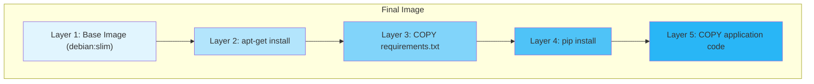

# How to Build Docker Images with Best Practices

Author: [nawazdhandala](https://www.github.com/nawazdhandala)

Tags: Docker, Containers, DevOps, Best Practices, Dockerfile

Description: A practical guide to building production-ready Docker images with best practices covering multi-stage builds, layer optimization, security hardening, and caching strategies.

---

Building Docker images seems straightforward until you realize your 2GB image takes forever to push, your CI pipeline is painfully slow, and your security team is flagging vulnerabilities left and right. Let's fix that.

This guide covers the best practices I've learned from years of containerizing applications in production environments. We'll go through each technique with real examples you can apply today.

## Understanding Docker Layers

Before diving into best practices, you need to understand how Docker layers work. Every instruction in your Dockerfile creates a new layer. Layers are cached, and if nothing changes in a layer, Docker reuses it.



When you change a layer, Docker invalidates all subsequent layers and rebuilds them. This is why instruction order matters.

## 1. Use Multi-Stage Builds

Multi-stage builds are the single most impactful optimization you can make. They let you separate build-time dependencies from runtime, dramatically reducing image size.

Here's a typical Node.js application without multi-stage builds:

```dockerfile
# BAD: Everything in one stage
# This includes node_modules with devDependencies, build tools, etc.
FROM node:20

WORKDIR /app

# Copy everything including source, tests, configs
COPY . .

# Install all dependencies including devDependencies
RUN npm install

# Build the application
RUN npm run build

# The final image contains build tools, test files, and devDependencies
CMD ["node", "dist/index.js"]
```

Now let's fix it with multi-stage builds:

```dockerfile
# GOOD: Multi-stage build separating build and runtime

# Stage 1: Build environment
# This stage has all the build tools and devDependencies
FROM node:20-alpine AS builder

WORKDIR /app

# Copy package files first for better layer caching
COPY package.json package-lock.json ./

# Install ALL dependencies (including devDependencies for building)
RUN npm ci

# Copy source code and build
COPY . .
RUN npm run build

# Stage 2: Production runtime
# This stage only has what we need to run the application
FROM node:20-alpine AS runtime

WORKDIR /app

# Copy package files for production install
COPY package.json package-lock.json ./

# Install only production dependencies
# --omit=dev excludes devDependencies
RUN npm ci --omit=dev

# Copy built artifacts from builder stage
COPY --from=builder /app/dist ./dist

# Run as non-root user for security
USER node

CMD ["node", "dist/index.js"]
```

The difference? The first approach might produce a 1.2GB image. The multi-stage version typically comes in under 200MB.

## 2. Choose the Right Base Image

Your base image choice has a massive impact on image size and security. Here's a comparison:

| Base Image | Size | Use Case |
|------------|------|----------|
| `node:20` | ~1GB | Development only |
| `node:20-slim` | ~200MB | When you need apt-get |
| `node:20-alpine` | ~130MB | Most production apps |
| `gcr.io/distroless/nodejs20` | ~100MB | Maximum security |

The same applies to other languages:

```dockerfile
# Python options from largest to smallest
FROM python:3.12           # 1GB+, includes build tools
FROM python:3.12-slim      # 130MB, minimal Debian
FROM python:3.12-alpine    # 50MB, smallest but glibc issues

# Go options
FROM golang:1.22           # 800MB, includes Go compiler
FROM golang:1.22-alpine    # 250MB, smaller with Go compiler
FROM gcr.io/distroless/static  # 2MB, for compiled binaries only
```

For Go applications, you can compile a static binary and run it in a scratch or distroless image:

```dockerfile
# Build stage with Go compiler
FROM golang:1.22-alpine AS builder

WORKDIR /app
COPY go.mod go.sum ./
RUN go mod download

COPY . .

# Build static binary with no external dependencies
# CGO_ENABLED=0: Disable CGO for fully static binary
# -ldflags="-w -s": Strip debug info and symbol table
RUN CGO_ENABLED=0 GOOS=linux go build -ldflags="-w -s" -o /app/server ./cmd/server

# Runtime stage - just 2MB base image
FROM gcr.io/distroless/static-debian12

# Copy the binary from builder
COPY --from=builder /app/server /server

# Distroless runs as nonroot by default (UID 65532)
USER nonroot:nonroot

ENTRYPOINT ["/server"]
```

## 3. Optimize Layer Caching

Docker caches layers based on the instruction and the files involved. To maximize cache hits, put instructions that change less frequently at the top.

```dockerfile
FROM python:3.12-slim

WORKDIR /app

# Step 1: Copy only dependency files (changes rarely)
# This layer is cached unless requirements.txt changes
COPY requirements.txt ./

# Step 2: Install dependencies (only rebuilds if requirements change)
# Using --no-cache-dir reduces image size by not storing pip cache
RUN pip install --no-cache-dir -r requirements.txt

# Step 3: Copy application code (changes frequently)
# This layer rebuilds on every code change
COPY . .

# Step 4: Run the application
CMD ["python", "main.py"]
```

The key insight: if you change `main.py`, only the last `COPY` layer rebuilds. Dependencies stay cached.

For Node.js, the pattern is similar:

```dockerfile
FROM node:20-alpine

WORKDIR /app

# Copy package files first
COPY package.json package-lock.json ./

# Install dependencies (cached unless package files change)
RUN npm ci

# Copy everything else
COPY . .

CMD ["node", "index.js"]
```

## 4. Minimize the Number of Layers

Each `RUN` instruction creates a layer. Combine related commands to reduce layers:

```dockerfile
# BAD: Multiple layers for related operations
RUN apt-get update
RUN apt-get install -y curl
RUN apt-get install -y git
RUN rm -rf /var/lib/apt/lists/*

# GOOD: Single layer with cleanup
# Combining commands and cleaning up in the same layer
# reduces the final image size
RUN apt-get update && \
    apt-get install -y --no-install-recommends \
        curl \
        git && \
    rm -rf /var/lib/apt/lists/*
```

The `--no-install-recommends` flag prevents installing suggested packages you don't need.

## 5. Use .dockerignore Effectively

A `.dockerignore` file prevents unnecessary files from being sent to the Docker daemon during build. This speeds up builds and prevents accidentally including sensitive files.

```
# .dockerignore

# Dependencies (will be installed fresh in the container)
node_modules/
vendor/
__pycache__/
*.pyc

# Build artifacts
dist/
build/
*.egg-info/

# Development files
.git/
.gitignore
*.md
docs/

# IDE and editor files
.vscode/
.idea/
*.swp
*.swo

# Test files (unless you need them in the image)
tests/
test/
__tests__/
*.test.js
*.spec.js

# Environment and secrets
.env
.env.*
*.pem
*.key
secrets/

# Docker files (no need to copy these into the image)
Dockerfile*
docker-compose*
.dockerignore

# OS files
.DS_Store
Thumbs.db
```

## 6. Don't Run as Root

Running containers as root is a security risk. Always specify a non-root user:

```dockerfile
FROM node:20-alpine

WORKDIR /app

# Create a non-root user and group
# -S: Create a system user (no password, no home directory prompt)
# -G: Add user to specified group
RUN addgroup -S appgroup && adduser -S appuser -G appgroup

# Install dependencies as root (needs write permissions)
COPY package.json package-lock.json ./
RUN npm ci --omit=dev

# Copy application files
COPY . .

# Change ownership of the app directory to non-root user
RUN chown -R appuser:appgroup /app

# Switch to non-root user before running the application
USER appuser

CMD ["node", "index.js"]
```

For images that already have a non-root user, just use it:

```dockerfile
FROM node:20-alpine
# The 'node' user already exists in the node images
USER node
```

## 7. Handle Secrets Properly

Never bake secrets into your image. They persist in layers and can be extracted.

```dockerfile
# BAD: Secret is stored in image layer
ENV API_KEY=super_secret_key
RUN curl -H "Authorization: ${API_KEY}" https://api.example.com/setup

# GOOD: Use build-time secrets (requires BuildKit)
# syntax=docker/dockerfile:1.4
# The secret is mounted only during this RUN command
# It never appears in any image layer
RUN --mount=type=secret,id=api_key \
    API_KEY=$(cat /run/secrets/api_key) && \
    curl -H "Authorization: ${API_KEY}" https://api.example.com/setup
```

Build with BuildKit and pass the secret:

```bash
# Build with BuildKit and mount the secret file
DOCKER_BUILDKIT=1 docker build \
    --secret id=api_key,src=./api_key.txt \
    -t myapp:latest .
```

For npm private registries:

```dockerfile
# syntax=docker/dockerfile:1.4
FROM node:20-alpine

WORKDIR /app
COPY package.json package-lock.json ./

# Mount the npm token during install only
# The token is never saved in the image
RUN --mount=type=secret,id=npmrc,target=/root/.npmrc \
    npm ci

COPY . .
CMD ["node", "index.js"]
```

## 8. Add Health Checks

Health checks let Docker and orchestrators know if your application is actually working:

```dockerfile
FROM node:20-alpine

WORKDIR /app
COPY package.json package-lock.json ./
RUN npm ci --omit=dev
COPY . .

# Health check configuration
# --interval: Time between health checks (30 seconds)
# --timeout: Max time to wait for a response (10 seconds)
# --start-period: Grace period for container startup (5 seconds)
# --retries: Number of failures before marking unhealthy (3)
HEALTHCHECK --interval=30s --timeout=10s --start-period=5s --retries=3 \
    CMD wget --no-verbose --tries=1 --spider http://localhost:3000/health || exit 1

USER node
CMD ["node", "index.js"]
```

For applications without wget or curl, use a simple script:

```dockerfile
# For Python applications
HEALTHCHECK --interval=30s --timeout=10s --retries=3 \
    CMD python -c "import urllib.request; urllib.request.urlopen('http://localhost:8000/health')" || exit 1
```

## 9. Use Specific Tags, Avoid 'latest'

Always pin your base image versions for reproducible builds:

```dockerfile
# BAD: 'latest' can change unexpectedly
FROM node:latest

# BAD: Major version only - minor updates can break things
FROM node:20

# GOOD: Specific version for reproducibility
FROM node:20.11.0-alpine3.19

# EVEN BETTER: Pin to SHA digest for absolute reproducibility
FROM node:20.11.0-alpine3.19@sha256:abc123def456...
```

You can find image digests with:

```bash
docker inspect --format='{{index .RepoDigests 0}}' node:20.11.0-alpine3.19
```

## 10. Label Your Images

Labels provide metadata that helps with image management:

```dockerfile
FROM node:20-alpine

# OCI standard labels for container metadata
LABEL org.opencontainers.image.title="My Application"
LABEL org.opencontainers.image.description="Production API server"
LABEL org.opencontainers.image.version="1.2.3"
LABEL org.opencontainers.image.vendor="My Company"
LABEL org.opencontainers.image.source="https://github.com/myorg/myapp"
LABEL org.opencontainers.image.created="2024-01-15T10:30:00Z"

# Build arguments for dynamic labels
ARG BUILD_DATE
ARG GIT_COMMIT
LABEL org.opencontainers.image.created="${BUILD_DATE}"
LABEL org.opencontainers.image.revision="${GIT_COMMIT}"

WORKDIR /app
# ... rest of Dockerfile
```

Build with dynamic labels:

```bash
docker build \
    --build-arg BUILD_DATE=$(date -u +'%Y-%m-%dT%H:%M:%SZ') \
    --build-arg GIT_COMMIT=$(git rev-parse HEAD) \
    -t myapp:latest .
```

## Complete Production Example

Here's a complete Dockerfile combining all these best practices:

```dockerfile
# syntax=docker/dockerfile:1.4

# =============================================================================
# Stage 1: Dependencies
# Separate stage for dependencies to maximize cache efficiency
# =============================================================================
FROM node:20.11.0-alpine3.19 AS deps

WORKDIR /app

# Copy only dependency files
COPY package.json package-lock.json ./

# Install production dependencies only
# --omit=dev: Skip devDependencies
# npm ci: Clean install for reproducibility
RUN npm ci --omit=dev

# =============================================================================
# Stage 2: Builder
# Build the application with all necessary dev tools
# =============================================================================
FROM node:20.11.0-alpine3.19 AS builder

WORKDIR /app

# Copy package files
COPY package.json package-lock.json ./

# Install all dependencies including devDependencies
RUN npm ci

# Copy source code
COPY . .

# Build the application
RUN npm run build

# =============================================================================
# Stage 3: Production runtime
# Minimal image with only what's needed to run
# =============================================================================
FROM node:20.11.0-alpine3.19 AS production

# Labels for image metadata
LABEL org.opencontainers.image.title="My API Server"
LABEL org.opencontainers.image.description="Production REST API"

# Set environment
ENV NODE_ENV=production

WORKDIR /app

# Copy production dependencies from deps stage
COPY --from=deps /app/node_modules ./node_modules

# Copy built application from builder stage
COPY --from=builder /app/dist ./dist

# Copy necessary config files
COPY package.json ./

# Health check
HEALTHCHECK --interval=30s --timeout=10s --start-period=5s --retries=3 \
    CMD wget --no-verbose --tries=1 --spider http://localhost:3000/health || exit 1

# Switch to non-root user
USER node

# Expose the application port
EXPOSE 3000

# Start the application
CMD ["node", "dist/index.js"]
```

## Security Scanning

After building your image, scan it for vulnerabilities:

```bash
# Using Trivy
trivy image myapp:latest

# Using Docker Scout (built into Docker Desktop)
docker scout cves myapp:latest

# Using Grype
grype myapp:latest
```

Integrate scanning into your CI pipeline and fail builds on critical vulnerabilities.

## Summary Checklist

Before pushing an image to production, verify:

- [ ] Multi-stage build separates build and runtime
- [ ] Base image is minimal (alpine, slim, or distroless)
- [ ] Dependencies are copied before source code for caching
- [ ] Related RUN commands are combined
- [ ] .dockerignore excludes unnecessary files
- [ ] Container runs as non-root user
- [ ] No secrets baked into the image
- [ ] Health check is configured
- [ ] Base image version is pinned
- [ ] Image is scanned for vulnerabilities

---

*Building efficient Docker images takes practice, but these patterns will serve you well across any project. Want to monitor your containerized applications with comprehensive observability? Check out [OneUptime](https://oneuptime.com) for application performance monitoring, logs, and alerts that help you catch issues before your users do.*
