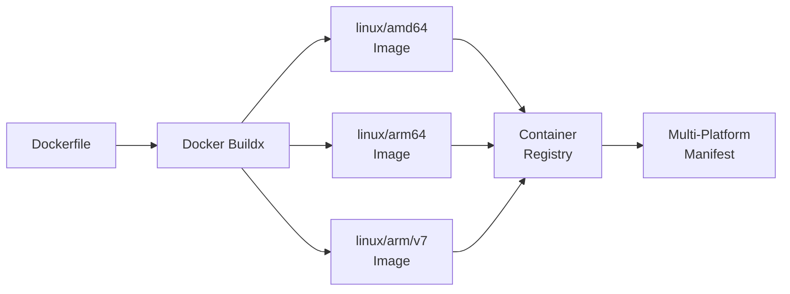
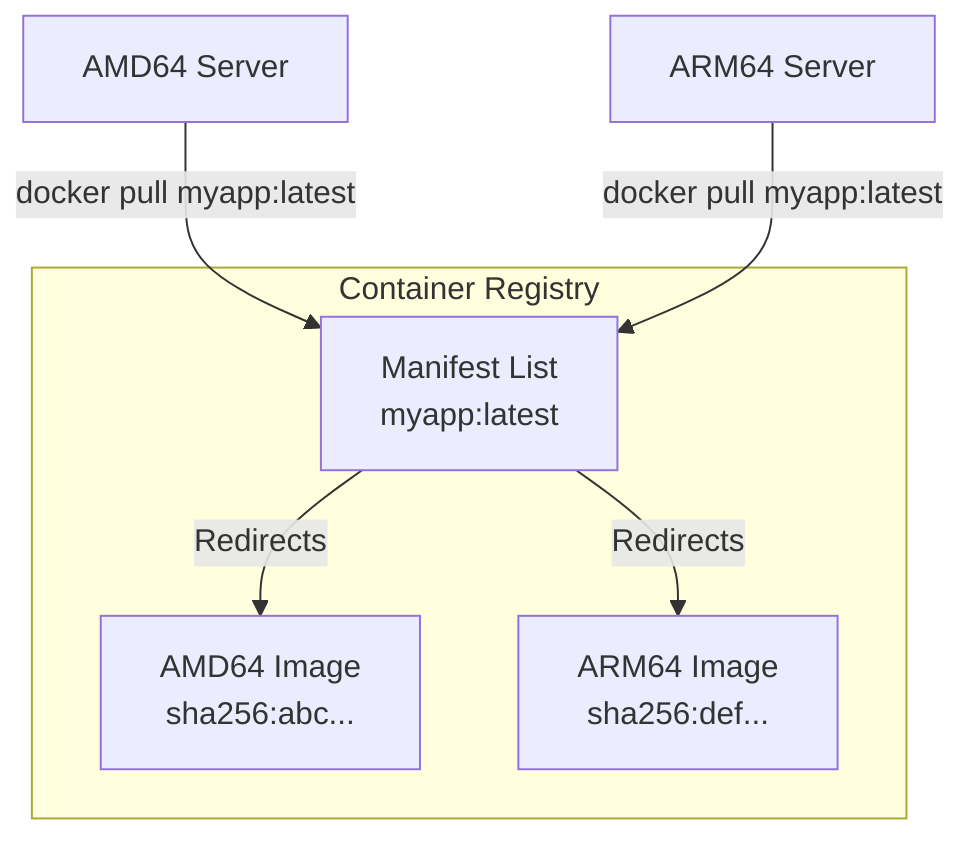
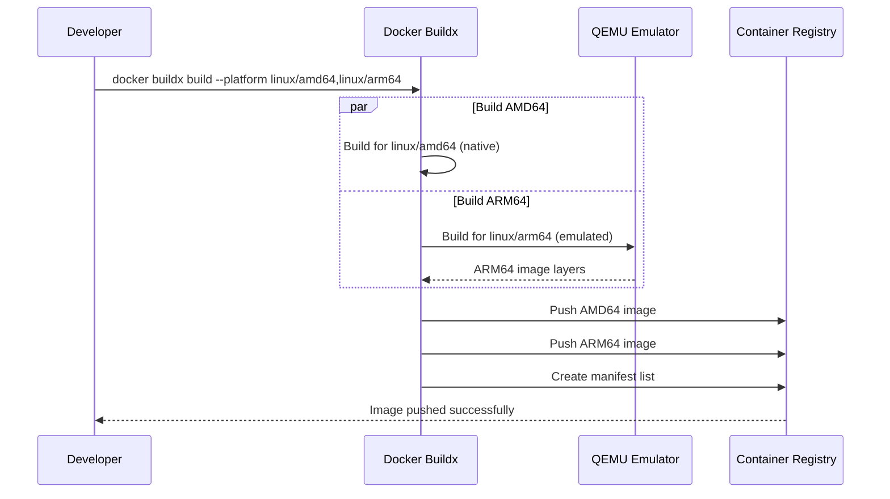
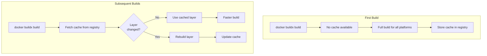

# How to Use Docker Multi-Platform Builds

Author: [nawazdhandala](https://www.github.com/nawazdhandala)

Tags: Docker, Multi-Platform, ARM64, AMD64, Container, DevOps, CI/CD, Buildx

Description: Learn how to build Docker images for multiple architectures using Docker Buildx. Covers setup, configuration, CI/CD integration, and best practices for cross-platform container deployments.

---

> Modern applications need to run on different CPU architectures, from Intel-based servers to ARM-powered cloud instances and Apple Silicon Macs. Docker multi-platform builds let you create images that work everywhere from a single build command.

Building for multiple platforms eliminates "works on my machine" problems across different architectures. Your container runs the same whether deployed to AMD64 servers or ARM64 instances.

---

## Overview



---

## Understanding Multi-Platform Builds

Docker Buildx extends the standard build capabilities to support multiple target platforms simultaneously. When you push a multi-platform image, the registry stores all variants under a single tag with a manifest list that directs each client to the correct image for its architecture.



---

## Prerequisites

Before building multi-platform images, ensure you have the necessary tools and configuration in place.

### Enable Docker Buildx

Docker Desktop includes Buildx by default. For Docker Engine on Linux, verify Buildx is available:

```bash
# Check if buildx is available
docker buildx version

# Expected output:
# github.com/docker/buildx v0.12.0 ...
```

### Install QEMU for Cross-Architecture Emulation

QEMU enables building images for architectures different from your host machine:

```bash
# Install QEMU emulators for cross-platform builds
# This allows an AMD64 machine to build ARM64 images and vice versa
docker run --privileged --rm tonistiigi/binfmt --install all

# Verify installed emulators
docker run --privileged --rm tonistiigi/binfmt
```

---

## Creating a Buildx Builder

The default Docker builder does not support multi-platform builds. Create a dedicated builder instance with the necessary capabilities.

### Initialize a New Builder

Create a builder that uses the docker-container driver for full multi-platform support:

```bash
# Create a new builder instance named "multiplatform"
# The docker-container driver provides full buildx functionality
docker buildx create --name multiplatform --driver docker-container --bootstrap

# Set this builder as the default for subsequent builds
docker buildx use multiplatform

# Verify the builder configuration and supported platforms
docker buildx inspect multiplatform
```

### Builder Inspection Output

The inspect command shows all supported platforms for your builder:

```bash
# Example output from buildx inspect
Name:   multiplatform
Driver: docker-container
Nodes:
Name:      multiplatform0
Endpoint:  unix:///var/run/docker.sock
Platforms: linux/amd64, linux/amd64/v2, linux/amd64/v3, linux/arm64, linux/arm/v7, linux/arm/v6
```

---

## Writing Multi-Platform Dockerfiles

Your Dockerfile should be architecture-agnostic. Avoid hardcoding architecture-specific paths or binaries.

### Basic Multi-Platform Dockerfile

Use official base images that support multiple platforms:

```dockerfile
# Dockerfile
# Use an official multi-platform base image
# The registry automatically serves the correct architecture
FROM node:20-alpine

# Set working directory
WORKDIR /app

# Copy package files first for better layer caching
COPY package*.json ./

# Install dependencies
RUN npm ci --only=production

# Copy application source
COPY . .

# Expose the application port
EXPOSE 3000

# Define the startup command
CMD ["node", "server.js"]
```

### Architecture-Specific Build Arguments

When you need different behavior per architecture, use the built-in TARGETPLATFORM and TARGETARCH arguments:

```dockerfile
# Dockerfile with architecture-specific logic
FROM golang:1.21-alpine AS builder

# TARGETARCH is automatically set by buildx (amd64, arm64, etc.)
ARG TARGETARCH
ARG TARGETOS

WORKDIR /app
COPY . .

# Build the binary for the target platform
# CGO_ENABLED=0 ensures static linking for portability
RUN CGO_ENABLED=0 GOOS=${TARGETOS} GOARCH=${TARGETARCH} \
    go build -ldflags="-w -s" -o /app/myapp

# Use a minimal runtime image
FROM alpine:3.19

# Copy the compiled binary from the builder stage
COPY --from=builder /app/myapp /usr/local/bin/myapp

ENTRYPOINT ["myapp"]
```

### Handling Architecture-Specific Dependencies

Some applications require different packages or configurations per architecture:

```dockerfile
# Dockerfile with conditional architecture logic
FROM ubuntu:22.04

# TARGETARCH is provided by buildx
ARG TARGETARCH

# Install architecture-specific packages
# The shell conditional handles different package names per architecture
RUN apt-get update && apt-get install -y \
    curl \
    ca-certificates \
    && if [ "$TARGETARCH" = "amd64" ]; then \
         apt-get install -y libc6-i386; \
       fi \
    && rm -rf /var/lib/apt/lists/*

# Download architecture-specific binaries
RUN curl -fsSL "https://example.com/releases/tool-${TARGETARCH}" \
    -o /usr/local/bin/tool \
    && chmod +x /usr/local/bin/tool

COPY . /app
WORKDIR /app
CMD ["/app/start.sh"]
```

---

## Building Multi-Platform Images

Execute builds targeting multiple platforms with a single command.

### Build and Push to Registry

Building multi-platform images requires pushing directly to a registry, as the local Docker daemon cannot store multi-architecture images:

```bash
# Build for AMD64 and ARM64, then push to registry
# The --platform flag specifies target architectures
# The --push flag uploads images to the registry
docker buildx build \
    --platform linux/amd64,linux/arm64 \
    --tag myregistry.com/myapp:latest \
    --push \
    .
```

### Build for Local Testing

To test a build for a specific platform locally without pushing:

```bash
# Build for ARM64 and load into local Docker daemon
# Only works with a single platform at a time
docker buildx build \
    --platform linux/arm64 \
    --tag myapp:latest-arm64 \
    --load \
    .

# Run the image with QEMU emulation on non-ARM hosts
docker run --rm myapp:latest-arm64
```

### Build with Build Arguments

Pass build-time variables for customization:

```bash
# Build with custom arguments for versioning and configuration
docker buildx build \
    --platform linux/amd64,linux/arm64 \
    --tag myregistry.com/myapp:v1.2.3 \
    --build-arg VERSION=1.2.3 \
    --build-arg BUILD_DATE=$(date -u +"%Y-%m-%dT%H:%M:%SZ") \
    --push \
    .
```

---

## Build Process Architecture



---

## CI/CD Integration

Automate multi-platform builds in your continuous integration pipeline.

### GitHub Actions Workflow

Configure a GitHub Actions workflow for automated multi-platform builds:

```yaml
# .github/workflows/docker-build.yml
name: Build Multi-Platform Docker Image

on:
  push:
    branches: [main]
    tags: ['v*']
  pull_request:
    branches: [main]

env:
  REGISTRY: ghcr.io
  IMAGE_NAME: ${{ github.repository }}

jobs:
  build:
    runs-on: ubuntu-latest

    permissions:
      contents: read
      packages: write

    steps:
      # Check out the repository code
      - name: Checkout repository
        uses: actions/checkout@v4

      # Set up QEMU for cross-platform emulation
      - name: Set up QEMU
        uses: docker/setup-qemu-action@v3

      # Configure Docker Buildx for multi-platform builds
      - name: Set up Docker Buildx
        uses: docker/setup-buildx-action@v3

      # Authenticate with the container registry
      - name: Log in to Container Registry
        uses: docker/login-action@v3
        with:
          registry: ${{ env.REGISTRY }}
          username: ${{ github.actor }}
          password: ${{ secrets.GITHUB_TOKEN }}

      # Extract metadata for image tags and labels
      - name: Extract metadata
        id: meta
        uses: docker/metadata-action@v5
        with:
          images: ${{ env.REGISTRY }}/${{ env.IMAGE_NAME }}
          tags: |
            type=ref,event=branch
            type=ref,event=pr
            type=semver,pattern={{version}}
            type=semver,pattern={{major}}.{{minor}}
            type=sha

      # Build and push the multi-platform image
      - name: Build and push
        uses: docker/build-push-action@v5
        with:
          context: .
          platforms: linux/amd64,linux/arm64
          push: ${{ github.event_name != 'pull_request' }}
          tags: ${{ steps.meta.outputs.tags }}
          labels: ${{ steps.meta.outputs.labels }}
          cache-from: type=gha
          cache-to: type=gha,mode=max
```

### GitLab CI Pipeline

Configure GitLab CI for multi-platform Docker builds:

```yaml
# .gitlab-ci.yml
stages:
  - build

variables:
  DOCKER_HOST: tcp://docker:2376
  DOCKER_TLS_CERTDIR: "/certs"
  DOCKER_TLS_VERIFY: 1
  DOCKER_CERT_PATH: "$DOCKER_TLS_CERTDIR/client"

build-multiplatform:
  stage: build
  image: docker:24
  services:
    - docker:24-dind

  before_script:
    # Install buildx plugin
    - mkdir -p ~/.docker/cli-plugins
    - wget -O ~/.docker/cli-plugins/docker-buildx
        https://github.com/docker/buildx/releases/download/v0.12.0/buildx-v0.12.0.linux-amd64
    - chmod +x ~/.docker/cli-plugins/docker-buildx

    # Set up QEMU for cross-platform builds
    - docker run --privileged --rm tonistiigi/binfmt --install all

    # Create and use buildx builder
    - docker buildx create --name multiplatform --use

    # Authenticate with registry
    - echo "$CI_REGISTRY_PASSWORD" | docker login -u "$CI_REGISTRY_USER" --password-stdin $CI_REGISTRY

  script:
    # Build and push multi-platform image
    - docker buildx build
        --platform linux/amd64,linux/arm64
        --tag $CI_REGISTRY_IMAGE:$CI_COMMIT_SHA
        --tag $CI_REGISTRY_IMAGE:latest
        --push
        .

  rules:
    - if: $CI_COMMIT_BRANCH == "main"
```

---

## Build Caching Strategies

Effective caching significantly reduces build times, especially for multi-platform builds.

### Registry-Based Caching

Store build cache in your container registry for sharing across CI runs:

```bash
# Build with registry-based cache
# Cache is stored as a separate image in the registry
docker buildx build \
    --platform linux/amd64,linux/arm64 \
    --tag myregistry.com/myapp:latest \
    --cache-from type=registry,ref=myregistry.com/myapp:cache \
    --cache-to type=registry,ref=myregistry.com/myapp:cache,mode=max \
    --push \
    .
```

### Local Cache Directory

For local development, use a directory-based cache:

```bash
# Build with local cache directory
# Useful for repeated local builds during development
docker buildx build \
    --platform linux/amd64,linux/arm64 \
    --tag myapp:latest \
    --cache-from type=local,src=/tmp/buildx-cache \
    --cache-to type=local,dest=/tmp/buildx-cache,mode=max \
    --push \
    .
```

### Inline Cache

Embed cache metadata directly in the image for simpler workflows:

```bash
# Build with inline cache
# Cache metadata is stored within the image itself
docker buildx build \
    --platform linux/amd64,linux/arm64 \
    --tag myregistry.com/myapp:latest \
    --cache-from type=registry,ref=myregistry.com/myapp:latest \
    --build-arg BUILDKIT_INLINE_CACHE=1 \
    --push \
    .
```

---

## Caching Workflow



---

## Optimizing Build Performance

Multi-platform builds can be slow due to emulation. Apply these optimizations to improve build times.

### Native Node Builds

Use multiple native builders instead of QEMU emulation for faster builds:

```bash
# Create a builder with native ARM64 node (requires ARM64 machine or cloud builder)
docker buildx create --name multiplatform \
    --driver docker-container \
    --platform linux/amd64

# Append an ARM64 builder node (e.g., an ARM64 EC2 instance)
docker buildx create --name multiplatform \
    --append \
    --node arm64-builder \
    --platform linux/arm64 \
    ssh://user@arm64-host

# Use the multi-node builder
docker buildx use multiplatform
```

### Optimize Dockerfile for Multi-Platform

Structure your Dockerfile to maximize cache reuse across platforms:

```dockerfile
# Dockerfile optimized for multi-platform caching
FROM --platform=$BUILDPLATFORM golang:1.21-alpine AS builder

# BUILDPLATFORM is the platform of the build machine
# TARGETPLATFORM is the platform being built for
ARG TARGETPLATFORM
ARG TARGETOS
ARG TARGETARCH

WORKDIR /app

# Copy dependency files first - rarely changes, cached across platforms
COPY go.mod go.sum ./
RUN go mod download

# Copy source files - changes more frequently
COPY . .

# Cross-compile for target platform
# Using BUILDPLATFORM for the build environment ensures native speed
RUN CGO_ENABLED=0 GOOS=${TARGETOS} GOARCH=${TARGETARCH} \
    go build -o /app/server ./cmd/server

# Final stage uses target platform
FROM alpine:3.19
COPY --from=builder /app/server /usr/local/bin/server
ENTRYPOINT ["server"]
```

### Parallel Stage Builds

Use multi-stage builds with platform-specific stages for parallelization:

```dockerfile
# Dockerfile with parallel platform-specific stages
FROM --platform=$BUILDPLATFORM node:20-alpine AS deps
WORKDIR /app
COPY package*.json ./
RUN npm ci

FROM --platform=$BUILDPLATFORM node:20-alpine AS builder
WORKDIR /app
COPY --from=deps /app/node_modules ./node_modules
COPY . .
RUN npm run build

# Runtime image matches target platform
FROM node:20-alpine AS runtime
WORKDIR /app
COPY --from=builder /app/dist ./dist
COPY --from=deps /app/node_modules ./node_modules
CMD ["node", "dist/server.js"]
```

---

## Verifying Multi-Platform Images

After building, verify that your images support the intended platforms.

### Inspect Manifest List

Check the platforms included in your multi-platform image:

```bash
# Inspect the manifest list for a multi-platform image
docker buildx imagetools inspect myregistry.com/myapp:latest

# Example output:
# Name:      myregistry.com/myapp:latest
# MediaType: application/vnd.oci.image.index.v1+json
# Digest:    sha256:abc123...
#
# Manifests:
#   Name:      myregistry.com/myapp:latest@sha256:def456...
#   MediaType: application/vnd.oci.image.manifest.v1+json
#   Platform:  linux/amd64
#
#   Name:      myregistry.com/myapp:latest@sha256:ghi789...
#   MediaType: application/vnd.oci.image.manifest.v1+json
#   Platform:  linux/arm64
```

### Test Specific Platform

Pull and run a specific platform variant to verify functionality:

```bash
# Pull a specific platform variant for testing
docker pull --platform linux/arm64 myregistry.com/myapp:latest

# Verify the image architecture
docker inspect myregistry.com/myapp:latest | grep Architecture

# Run the image with emulation if needed
docker run --platform linux/arm64 --rm myregistry.com/myapp:latest --version
```

---

## Troubleshooting Common Issues

### QEMU Errors During Build

If builds fail with QEMU-related errors, reinstall the emulators:

```bash
# Reset QEMU emulators
docker run --privileged --rm tonistiigi/binfmt --uninstall qemu-*
docker run --privileged --rm tonistiigi/binfmt --install all

# Verify emulators are registered
cat /proc/sys/fs/binfmt_misc/qemu-aarch64
```

### Slow Builds

Emulated builds are inherently slower. Use these techniques to improve speed:

```bash
# Use native builders for each platform when possible
# Limit concurrent platform builds to reduce resource contention
docker buildx build \
    --platform linux/amd64,linux/arm64 \
    --tag myregistry.com/myapp:latest \
    --builder multiplatform \
    --push \
    .

# Build platforms sequentially if memory is limited
for platform in linux/amd64 linux/arm64; do
    docker buildx build \
        --platform $platform \
        --tag myregistry.com/myapp:latest \
        --push \
        .
done
```

### Base Image Compatibility

Ensure your base images support all target platforms:

```bash
# Check if a base image supports your target platforms
docker buildx imagetools inspect node:20-alpine

# Look for your required platforms in the manifest list
# If a platform is missing, choose a different base image
```

---

## Best Practices

1. **Use official multi-platform base images** - verify platform support before building
2. **Avoid architecture-specific binaries** - use build arguments to handle differences
3. **Enable build caching** - reduces build time significantly for repeated builds
4. **Test on actual hardware** - emulation may hide architecture-specific bugs
5. **Pin base image versions** - ensures consistent builds across platforms
6. **Use multi-stage builds** - separates build environment from runtime image
7. **Build during CI/CD** - automates multi-platform builds on every commit

---

## Conclusion

Docker multi-platform builds enable you to create container images that run natively on any architecture. Key takeaways:

- **Docker Buildx** provides the tooling for multi-platform builds
- **QEMU emulation** allows building for any architecture from a single machine
- **Manifest lists** enable a single image tag to serve multiple architectures
- **CI/CD integration** automates multi-platform builds for every release
- **Caching strategies** dramatically reduce build times

Start building multi-platform images today to support the growing diversity of cloud and edge computing environments.

---

*Building containers for multiple architectures? [OneUptime](https://oneuptime.com) monitors your containerized applications across all deployment platforms with unified observability.*
