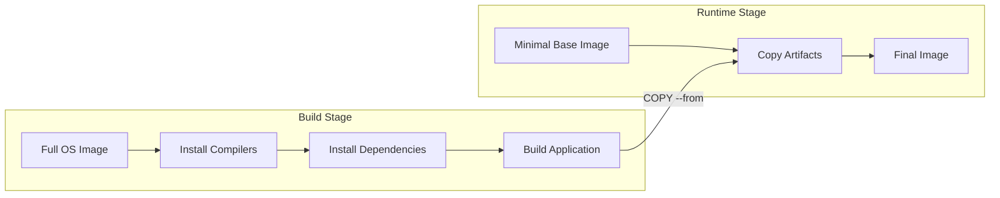
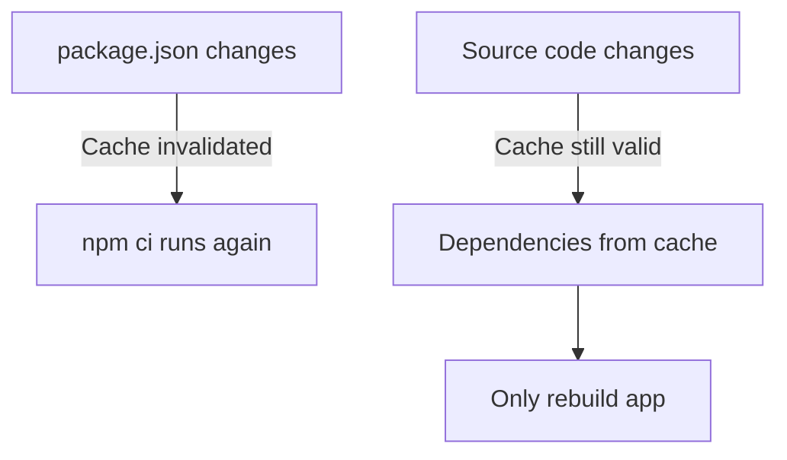

# How to Use Multi-Stage Docker Builds

Author: [nawazdhandala](https://www.github.com/nawazdhandala)

Tags: Docker, Multi-stage, Builds, Optimization

Description: Learn how to use multi-stage Docker builds to create smaller, faster, and more secure container images by separating build-time dependencies from runtime.

---

> Building Docker images the traditional way often results in bloated containers stuffed with compilers, build tools, and development dependencies your application doesn't need at runtime. Multi-stage builds solve this problem elegantly by letting you use multiple FROM statements in a single Dockerfile, copying only the artifacts you need into your final image.

---

## What Are Multi-Stage Builds?

Multi-stage builds allow you to use multiple `FROM` statements in your Dockerfile. Each `FROM` instruction starts a new build stage, and you can selectively copy artifacts from one stage to another. This means you can use a full development environment to build your application, then copy only the compiled binary or necessary files to a minimal production image.



---

## Why Use Multi-Stage Builds?

Here's a comparison of single-stage vs multi-stage approaches:

| Aspect | Single-Stage Build | Multi-Stage Build |
|--------|-------------------|-------------------|
| Image Size | 500MB - 2GB | 50MB - 200MB |
| Build Tools | Included in final image | Discarded after build |
| Attack Surface | Large (more packages) | Minimal |
| Pull Time | Slow | Fast |
| Storage Cost | High | Low |
| Security Scanning | More vulnerabilities to review | Fewer components to scan |

---

## Basic Multi-Stage Build Pattern

The fundamental pattern involves a builder stage where you compile or prepare your application, followed by a runtime stage that contains only what's needed to run it.

This example shows a simple Node.js application with a build stage for installing dependencies and a runtime stage with only production files:

```dockerfile
# Dockerfile

# Stage 1: Builder - full environment for building
FROM node:20-alpine AS builder

WORKDIR /app

# Copy dependency files first for better layer caching
COPY package*.json ./

# Install all dependencies including devDependencies
RUN npm ci

# Copy source code
COPY . .

# Build the application (TypeScript compilation, bundling, etc.)
RUN npm run build

# Stage 2: Runtime - minimal image for production
FROM node:20-alpine AS runtime

WORKDIR /app

# Only copy production dependencies
COPY package*.json ./
RUN npm ci --only=production && npm cache clean --force

# Copy built artifacts from builder stage
# This is the key - we only take what we need
COPY --from=builder /app/dist ./dist

# Create non-root user for security
RUN addgroup -g 1001 -S nodejs && \
    adduser -S nodejs -u 1001

USER nodejs

EXPOSE 3000

CMD ["node", "dist/index.js"]
```

---

## Go Application Multi-Stage Build

Go applications benefit massively from multi-stage builds because you can compile to a static binary and run it in a scratch or distroless image.

This Dockerfile compiles a Go application and produces a final image under 20MB:

```dockerfile
# Dockerfile

# Stage 1: Build the Go binary
FROM golang:1.22-alpine AS builder

WORKDIR /app

# Install certificates for HTTPS requests
# We'll need these in the final image too
RUN apk --no-cache add ca-certificates

# Download dependencies first (better caching)
COPY go.mod go.sum ./
RUN go mod download

# Copy source code
COPY . .

# Build a statically linked binary
# CGO_ENABLED=0 ensures no C library dependencies
# -ldflags="-s -w" strips debug info for smaller binary
RUN CGO_ENABLED=0 GOOS=linux go build \
    -ldflags="-s -w" \
    -o /app/server ./cmd/server

# Stage 2: Minimal runtime image
# scratch is an empty image - as small as possible
FROM scratch

WORKDIR /app

# Copy CA certificates for HTTPS
COPY --from=builder /etc/ssl/certs/ca-certificates.crt /etc/ssl/certs/

# Copy the compiled binary
COPY --from=builder /app/server .

# Run as non-root (UID 1000)
USER 1000

EXPOSE 8080

ENTRYPOINT ["/app/server"]
```

---

## Python Multi-Stage Build

Python requires a different approach since it's interpreted. The strategy is to install dependencies in a virtual environment during the build stage, then copy just the virtualenv to the runtime image.

This example shows how to keep build tools out of your production Python container:

```dockerfile
# Dockerfile

# Stage 1: Build dependencies
FROM python:3.12-slim AS builder

WORKDIR /app

# Install build dependencies needed for compiling Python packages
# These won't be in the final image
RUN apt-get update && apt-get install -y --no-install-recommends \
    build-essential \
    libpq-dev \
    && rm -rf /var/lib/apt/lists/*

# Create virtual environment in a known location
RUN python -m venv /opt/venv

# Activate virtual environment
ENV PATH="/opt/venv/bin:$PATH"

# Install Python dependencies
COPY requirements.txt .
RUN pip install --no-cache-dir -r requirements.txt

# Stage 2: Runtime
FROM python:3.12-slim AS runtime

WORKDIR /app

# Install only runtime libraries (not headers or compilers)
RUN apt-get update && apt-get install -y --no-install-recommends \
    libpq5 \
    && rm -rf /var/lib/apt/lists/*

# Copy the virtual environment from builder
COPY --from=builder /opt/venv /opt/venv
ENV PATH="/opt/venv/bin:$PATH"

# Copy application code
COPY . .

# Create non-root user
RUN useradd --create-home --shell /bin/bash appuser && \
    chown -R appuser:appuser /app

USER appuser

EXPOSE 8000

CMD ["gunicorn", "--bind", "0.0.0.0:8000", "--workers", "4", "app:app"]
```

---

## Java/Maven Multi-Stage Build

Java applications often have large build tools. Multi-stage builds let you use Maven or Gradle for building without including them in production.

This Dockerfile shows a Spring Boot application build with Maven:

```dockerfile
# Dockerfile

# Stage 1: Build with Maven
FROM maven:3.9-eclipse-temurin-21 AS builder

WORKDIR /app

# Copy pom.xml first for dependency caching
COPY pom.xml .

# Download dependencies (cached unless pom.xml changes)
RUN mvn dependency:go-offline -B

# Copy source code
COPY src ./src

# Build the application
# Skip tests during Docker build (run them in CI separately)
RUN mvn package -DskipTests -B

# Stage 2: Runtime with just the JRE
FROM eclipse-temurin:21-jre-alpine AS runtime

WORKDIR /app

# Create non-root user
RUN addgroup -S spring && adduser -S spring -G spring

# Copy the JAR from builder stage
COPY --from=builder /app/target/*.jar app.jar

# Change ownership
RUN chown -R spring:spring /app

USER spring

EXPOSE 8080

# Use container-aware memory settings
ENTRYPOINT ["java", \
    "-XX:+UseContainerSupport", \
    "-XX:MaxRAMPercentage=75.0", \
    "-jar", "app.jar"]
```

---

## Rust Multi-Stage Build

Rust compiles to native binaries, making it perfect for multi-stage builds with minimal final images.

This Dockerfile creates a Rust application image under 10MB:

```dockerfile
# Dockerfile

# Stage 1: Build with full Rust toolchain
FROM rust:1.75-alpine AS builder

WORKDIR /app

# Install musl-dev for static linking
RUN apk add --no-cache musl-dev

# Create a dummy project to cache dependencies
RUN cargo init
COPY Cargo.toml Cargo.lock ./
RUN cargo build --release && rm -rf src

# Copy real source code
COPY src ./src

# Build the actual application
# Touch main.rs to force rebuild of our code (not deps)
RUN touch src/main.rs && cargo build --release

# Stage 2: Minimal runtime
FROM alpine:3.19 AS runtime

WORKDIR /app

# Install CA certificates for HTTPS
RUN apk --no-cache add ca-certificates

# Copy the binary
COPY --from=builder /app/target/release/myapp .

# Create non-root user
RUN addgroup -S appgroup && adduser -S appuser -G appgroup
USER appuser

EXPOSE 8080

CMD ["./myapp"]
```

---

## Frontend Application Build

For React, Vue, or Angular applications, you build static files in one stage and serve them with a lightweight web server.

This example builds a React app and serves it with nginx:

```dockerfile
# Dockerfile

# Stage 1: Build the frontend
FROM node:20-alpine AS builder

WORKDIR /app

# Copy package files
COPY package*.json ./

# Install dependencies
RUN npm ci

# Copy source code
COPY . .

# Set build-time environment variables
ARG REACT_APP_API_URL
ENV REACT_APP_API_URL=$REACT_APP_API_URL

# Build the production bundle
RUN npm run build

# Stage 2: Serve with nginx
FROM nginx:alpine AS runtime

# Remove default nginx static files
RUN rm -rf /usr/share/nginx/html/*

# Copy built files from builder
COPY --from=builder /app/build /usr/share/nginx/html

# Copy custom nginx configuration
COPY nginx.conf /etc/nginx/conf.d/default.conf

# Run nginx as non-root
RUN chown -R nginx:nginx /usr/share/nginx/html && \
    chown -R nginx:nginx /var/cache/nginx && \
    touch /var/run/nginx.pid && \
    chown -R nginx:nginx /var/run/nginx.pid

USER nginx

EXPOSE 80

CMD ["nginx", "-g", "daemon off;"]
```

Supporting nginx configuration for the React app:

```nginx
# nginx.conf

server {
    listen 80;
    server_name localhost;
    root /usr/share/nginx/html;
    index index.html;

    # Enable gzip compression
    gzip on;
    gzip_types text/plain text/css application/json application/javascript;

    # Cache static assets
    location ~* \.(js|css|png|jpg|jpeg|gif|ico|svg)$ {
        expires 1y;
        add_header Cache-Control "public, immutable";
    }

    # Handle client-side routing
    location / {
        try_files $uri $uri/ /index.html;
    }

    # Security headers
    add_header X-Frame-Options "SAMEORIGIN" always;
    add_header X-Content-Type-Options "nosniff" always;
}
```

---

## Using Build Arguments Across Stages

You can pass build arguments and use them across multiple stages for configuration.

This example shows how to use ARG and ENV across stages:

```dockerfile
# Dockerfile

# Define build args at the top level
ARG APP_VERSION=latest
ARG BUILD_DATE

# Stage 1: Builder
FROM golang:1.22-alpine AS builder

# Args must be redeclared in each stage where they're used
ARG APP_VERSION

WORKDIR /app

COPY . .

# Embed version in the binary
RUN go build -ldflags="-X main.Version=${APP_VERSION}" -o server .

# Stage 2: Runtime
FROM alpine:3.19

# Redeclare args for this stage
ARG APP_VERSION
ARG BUILD_DATE

# Set as environment variables for runtime access
ENV APP_VERSION=$APP_VERSION
ENV BUILD_DATE=$BUILD_DATE

# Add labels for image metadata
LABEL org.opencontainers.image.version=$APP_VERSION
LABEL org.opencontainers.image.created=$BUILD_DATE

COPY --from=builder /app/server /server

CMD ["/server"]
```

Build with arguments:

```bash
docker build \
    --build-arg APP_VERSION=1.2.3 \
    --build-arg BUILD_DATE=$(date -u +"%Y-%m-%dT%H:%M:%SZ") \
    -t myapp:1.2.3 .
```

---

## Caching Dependencies Effectively

Proper layer ordering maximizes cache hits. Copy dependency manifests before source code.

This pattern ensures dependencies are only reinstalled when they actually change:

```dockerfile
# Dockerfile

FROM node:20-alpine AS builder

WORKDIR /app

# Layer 1: Package manifests (changes rarely)
COPY package.json package-lock.json ./

# Layer 2: Install dependencies (cached if manifests unchanged)
RUN npm ci

# Layer 3: Source code (changes frequently)
COPY . .

# Layer 4: Build
RUN npm run build
```



---

## Testing Stage Pattern

Add a dedicated testing stage that runs between build and production.

This pattern keeps test dependencies out of production while enabling CI testing:

```dockerfile
# Dockerfile

# Stage 1: Dependencies
FROM node:20-alpine AS deps

WORKDIR /app
COPY package*.json ./
RUN npm ci

# Stage 2: Build
FROM deps AS builder

COPY . .
RUN npm run build

# Stage 3: Test (optional - for CI pipelines)
FROM builder AS tester

# Install test dependencies if separated
RUN npm ci --include=dev

# Run tests
RUN npm test

# Stage 4: Production
FROM node:20-alpine AS production

WORKDIR /app

COPY package*.json ./
RUN npm ci --only=production

COPY --from=builder /app/dist ./dist

USER node
CMD ["node", "dist/index.js"]
```

Build specific stages:

```bash
# Run tests
docker build --target tester -t myapp:test .

# Build production image
docker build --target production -t myapp:prod .
```

---

## Security Scanning Stage

Include vulnerability scanning as part of your multi-stage build.

This Dockerfile includes a security scan stage:

```dockerfile
# Dockerfile

FROM python:3.12-slim AS builder

WORKDIR /app

COPY requirements.txt .
RUN pip install --no-cache-dir -r requirements.txt

# Stage 2: Security scan
FROM builder AS scanner

# Install scanning tools
RUN pip install safety pip-audit

# Scan for known vulnerabilities
# The || true prevents build failure - review results in CI
RUN safety check -r requirements.txt --json > /tmp/safety-report.json || true
RUN pip-audit --format json > /tmp/pip-audit-report.json || true

# Stage 3: Production
FROM python:3.12-slim AS production

WORKDIR /app

COPY --from=builder /usr/local/lib/python3.12/site-packages /usr/local/lib/python3.12/site-packages
COPY . .

USER nobody
CMD ["python", "app.py"]
```

---

## Image Size Comparison

Here's what you can expect in terms of size reduction:

| Application Type | Single Stage | Multi-Stage | Reduction |
|-----------------|--------------|-------------|-----------|
| Node.js Express | 950 MB | 180 MB | 81% |
| Go API Server | 850 MB | 15 MB | 98% |
| Python FastAPI | 1.1 GB | 140 MB | 87% |
| Java Spring Boot | 700 MB | 280 MB | 60% |
| Rust Web Server | 1.5 GB | 8 MB | 99% |
| React Frontend | 1.2 GB | 25 MB | 98% |

---

## Common Mistakes to Avoid

### Mistake 1: Copying Everything in Build Stage

Bad practice - copies node_modules and other unnecessary files:

```dockerfile
# Don't do this
FROM node:20 AS builder
COPY . .
RUN npm install && npm run build
```

Better approach - copy only what's needed:

```dockerfile
# Do this instead
FROM node:20 AS builder
COPY package*.json ./
RUN npm ci
COPY src ./src
COPY tsconfig.json ./
RUN npm run build
```

### Mistake 2: Running as Root

Always create and use a non-root user:

```dockerfile
# Add this before CMD
RUN addgroup -S appgroup && adduser -S appuser -G appgroup
USER appuser
```

### Mistake 3: Not Using .dockerignore

Create a .dockerignore to exclude unnecessary files:

```text
# .dockerignore
.git
.gitignore
node_modules
*.md
.env*
.vscode
.idea
coverage
tests
__pycache__
*.pyc
.pytest_cache
Dockerfile*
docker-compose*
```

---

## Best Practices Summary

1. **Name your stages** - Use `AS stagename` for clarity and targeting
2. **Order layers by change frequency** - Put rarely changing items first
3. **Use specific base image tags** - Avoid `latest` for reproducibility
4. **Copy only necessary files** - Don't copy entire directories blindly
5. **Run as non-root** - Create a dedicated user for the application
6. **Use multi-stage for all compiled languages** - Go, Rust, Java, TypeScript
7. **Include health checks** - Add HEALTHCHECK instruction
8. **Scan for vulnerabilities** - Add a scanning stage or use CI tools
9. **Minimize final image layers** - Combine RUN commands where logical
10. **Document build arguments** - Make your Dockerfile self-explanatory

---

## Conclusion

Multi-stage Docker builds are essential for creating production-ready container images. They let you maintain a single Dockerfile that produces optimized images without sacrificing build tooling. The investment in learning this pattern pays off through faster deployments, reduced storage costs, and improved security posture.

Start by identifying what's needed at runtime versus build time, then structure your Dockerfile to copy only the essentials to your final stage. Your images will shrink, your deployments will speed up, and your security team will thank you.

---

*Need to monitor your containerized applications? [OneUptime](https://oneuptime.com) provides comprehensive container monitoring with resource tracking, log aggregation, and intelligent alerting to keep your Docker deployments running smoothly.*
