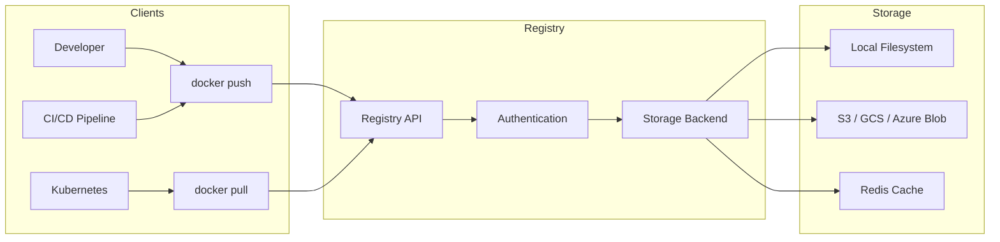
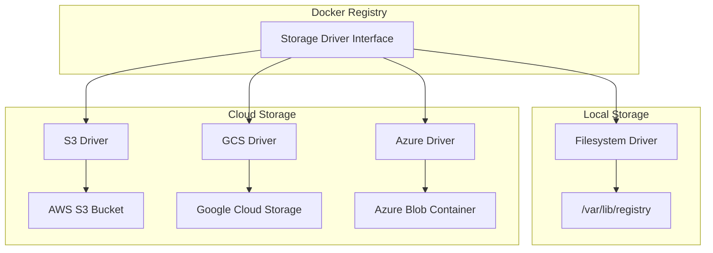
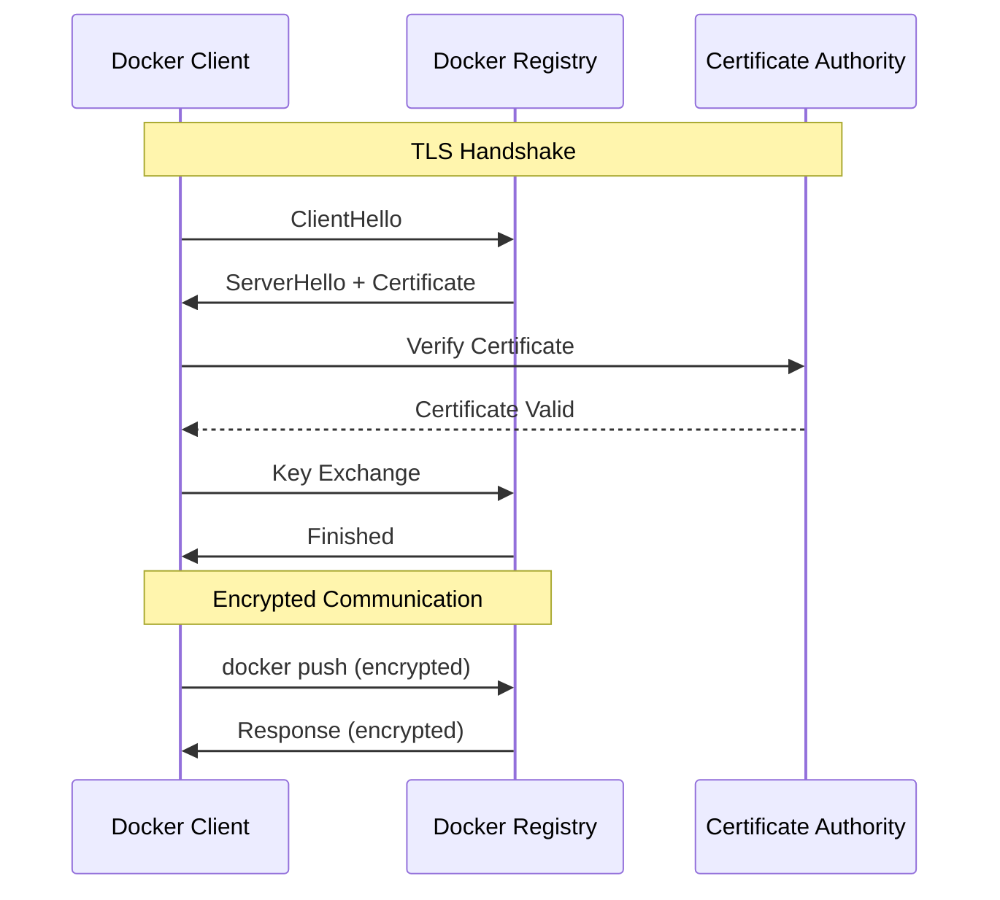
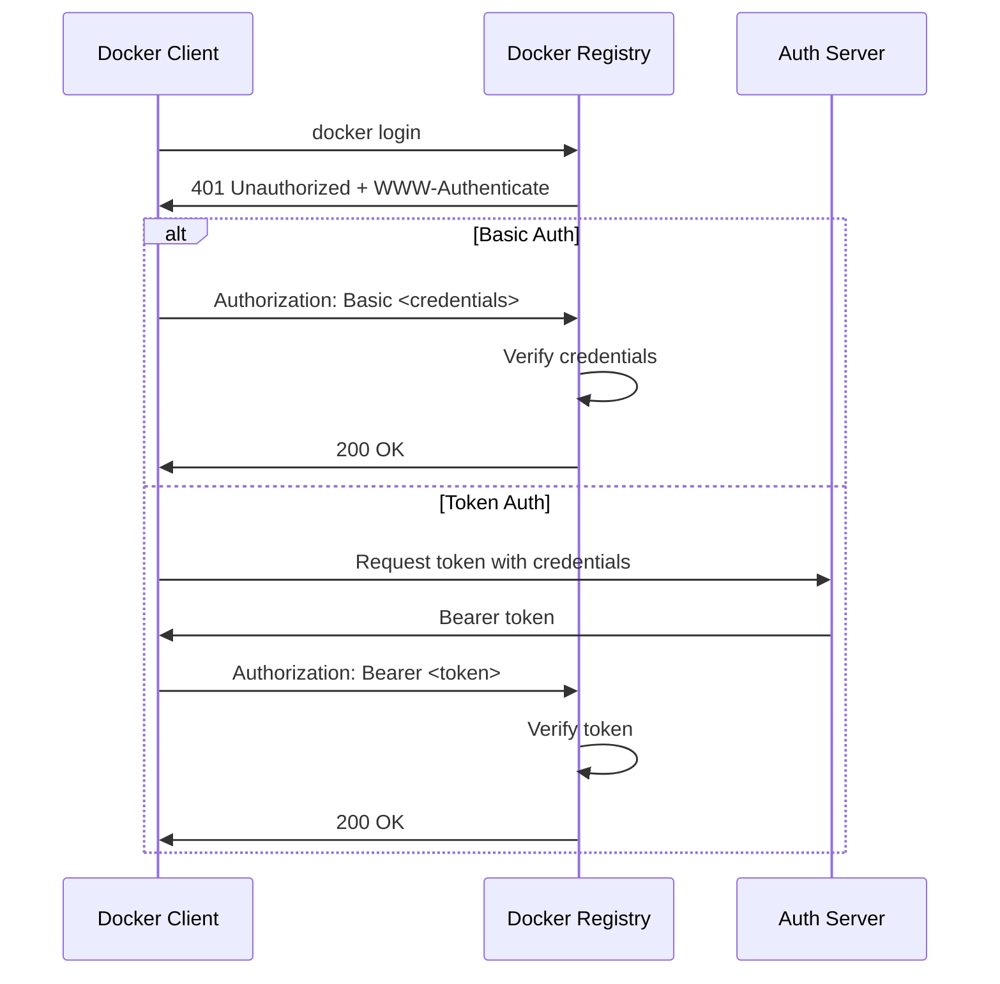
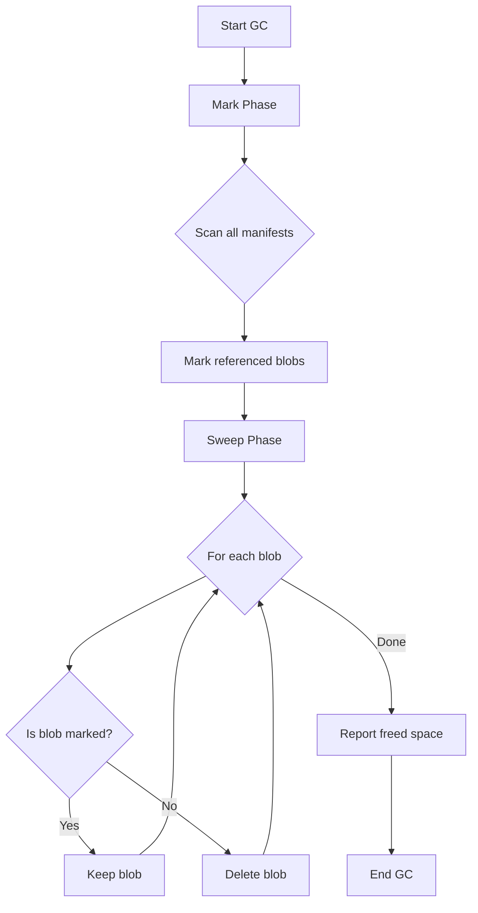
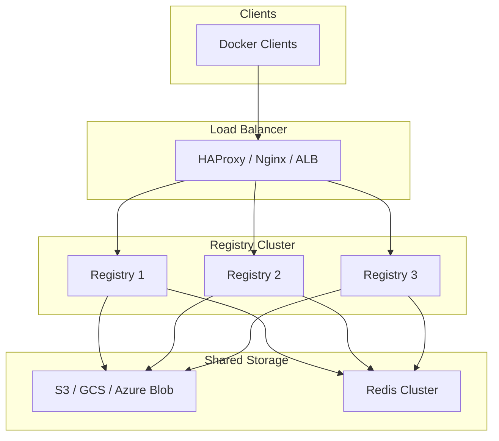

# How to Configure Docker Registry

Author: [nawazdhandala](https://www.github.com/nawazdhandala)

Tags: Docker, Registry, DevOps, Containers, CI/CD, Infrastructure

Description: Learn how to configure a Docker Registry for storing and distributing container images, including storage backends, authentication, TLS setup, garbage collection, and production best practices.

A Docker Registry is a stateless server-side application that stores and distributes Docker images. Running your own registry gives you full control over image storage, reduces external dependencies, and speeds up image pulls within your network.

---

## Architecture Overview

The following diagram illustrates how Docker clients interact with a registry, showing the flow of image push and pull operations through the various components.



---

## Basic Registry Setup

### Running the Official Registry Image

The simplest way to start a Docker Registry is by running the official image. The following command starts a registry on port 5000, which is the default registry port.

```bash
# Start a basic Docker Registry on port 5000
# The registry data is ephemeral and will be lost when the container stops
docker run -d \
  --name registry \
  -p 5000:5000 \
  registry:2
```

### Persistent Storage Configuration

For production use, you need persistent storage so images survive container restarts. The volume mount ensures data persists on the host filesystem.

```bash
# Run registry with persistent storage mounted from host
# Images are stored in /var/lib/registry inside the container
docker run -d \
  --name registry \
  -p 5000:5000 \
  -v /opt/registry/data:/var/lib/registry \
  registry:2
```

### Testing the Registry

Verify your registry is working by pushing and pulling a test image.

```bash
# Pull a small test image from Docker Hub
docker pull alpine:latest

# Tag the image for your local registry
# Format: <registry-host>:<port>/<image-name>:<tag>
docker tag alpine:latest localhost:5000/alpine:latest

# Push the image to your local registry
docker push localhost:5000/alpine:latest

# Verify by pulling the image back
docker pull localhost:5000/alpine:latest

# List images in the registry using the HTTP API
curl http://localhost:5000/v2/_catalog
# Output: {"repositories":["alpine"]}
```

---

## Registry Configuration File

The registry is configured using a YAML file. The following sections cover the most important configuration options.

### Basic Configuration Structure

The configuration file defines all aspects of registry behavior, from storage to authentication to logging.

```yaml
# config.yml - Docker Registry configuration file
version: 0.1

# Logging configuration controls what gets logged and where
log:
  level: info                    # Options: debug, info, warn, error
  formatter: text                # Options: text, json, logstash
  fields:
    service: registry
    environment: production

# Storage defines where images are stored
storage:
  filesystem:
    rootdirectory: /var/lib/registry
  # Delete enables image deletion via the API
  delete:
    enabled: true
  # Maintenance settings for garbage collection
  maintenance:
    uploadpurging:
      enabled: true
      age: 168h                  # Purge incomplete uploads after 7 days
      interval: 24h
      dryrun: false

# HTTP server configuration
http:
  addr: :5000                    # Listen address and port
  host: https://registry.example.com
  headers:
    X-Content-Type-Options: [nosniff]
  http2:
    disabled: false

# Health check endpoints
health:
  storagedriver:
    enabled: true
    interval: 10s
    threshold: 3
```

### Running with Custom Configuration

Mount your configuration file into the container to override default settings.

```bash
# Run registry with custom configuration file
# The config file must be mounted at /etc/docker/registry/config.yml
docker run -d \
  --name registry \
  -p 5000:5000 \
  -v /opt/registry/config.yml:/etc/docker/registry/config.yml \
  -v /opt/registry/data:/var/lib/registry \
  registry:2
```

---

## Storage Backend Configuration

The registry supports multiple storage backends for different use cases.

### Storage Architecture

The following diagram shows how the registry interacts with different storage backends and the tradeoffs involved.



### Amazon S3 Storage

S3 provides durable, scalable storage suitable for production registries. Configure the S3 driver with your bucket details and credentials.

```yaml
# config.yml - S3 storage backend configuration
storage:
  s3:
    # AWS region where your bucket is located
    region: us-east-1
    # S3 bucket name for storing images
    bucket: my-docker-registry
    # Optional: Use a specific path prefix within the bucket
    rootdirectory: /registry
    # Enable server-side encryption for data at rest
    encrypt: true
    # Use secure (HTTPS) connections to S3
    secure: true
    # Set chunk size for multipart uploads (minimum 5MB)
    chunksize: 5242880
    # Number of concurrent uploads to S3
    multipartcopychunksize: 33554432
    multipartcopymaxconcurrency: 100
    multipartcopythresholdsize: 33554432
  # Enable deletion support
  delete:
    enabled: true
  # Cache layer metadata in Redis for faster access
  cache:
    blobdescriptor: redis
  # Redirect clients directly to S3 for blob downloads
  redirect:
    disable: false
```

### Google Cloud Storage

GCS is ideal for registries running on Google Cloud Platform.

```yaml
# config.yml - Google Cloud Storage backend configuration
storage:
  gcs:
    # GCS bucket name
    bucket: my-docker-registry-bucket
    # Path to service account key file (if not using default credentials)
    keyfile: /etc/registry/gcs-key.json
    # Optional: Root directory within the bucket
    rootdirectory: /registry
    # Chunk size for resumable uploads
    chunksize: 5242880
  delete:
    enabled: true
  cache:
    blobdescriptor: redis
```

### Azure Blob Storage

Azure Blob Storage integrates well with Azure-hosted registries.

```yaml
# config.yml - Azure Blob Storage backend configuration
storage:
  azure:
    # Azure storage account name
    accountname: myregistryaccount
    # Storage account access key (use secrets management in production)
    accountkey: <your-account-key>
    # Container name within the storage account
    container: registry
    # Optional: Virtual directory within the container
    rootdirectory: /registry
  delete:
    enabled: true
```

### Redis Cache for Metadata

Redis caching improves performance by caching blob descriptors and reducing storage backend calls.

```yaml
# config.yml - Redis cache configuration
storage:
  cache:
    # Cache blob descriptors in Redis
    blobdescriptor: redis

# Redis connection settings
redis:
  addr: redis:6379
  password: your-redis-password
  db: 0
  # Connection pool settings
  pool:
    maxidle: 16
    maxactive: 64
    idletimeout: 300s
  # Dial timeout for establishing connections
  dialtimeout: 10ms
  readtimeout: 10ms
  writetimeout: 10ms
```

---

## TLS and Security Configuration

### TLS Flow

The following diagram shows how TLS secures communication between Docker clients and the registry.



### Generating TLS Certificates

Create a self-signed certificate for testing or use certificates from a trusted CA for production.

```bash
# Create directory for certificates
mkdir -p /opt/registry/certs

# Generate a private key for the registry
openssl genrsa -out /opt/registry/certs/registry.key 4096

# Create a certificate signing request (CSR)
# Replace registry.example.com with your actual domain
openssl req -new \
  -key /opt/registry/certs/registry.key \
  -out /opt/registry/certs/registry.csr \
  -subj "/CN=registry.example.com"

# Generate a self-signed certificate valid for 365 days
# For production, submit the CSR to a trusted CA instead
openssl x509 -req \
  -days 365 \
  -in /opt/registry/certs/registry.csr \
  -signkey /opt/registry/certs/registry.key \
  -out /opt/registry/certs/registry.crt
```

### TLS Configuration in Registry

Configure the registry to use TLS certificates for encrypted communication.

```yaml
# config.yml - TLS configuration
http:
  addr: :5000
  # TLS certificate and key paths
  tls:
    certificate: /certs/registry.crt
    key: /certs/registry.key
    # Optional: Minimum TLS version (tls1.2 or tls1.3)
    minimumtls: tls1.2
    # Optional: Specify allowed cipher suites
    ciphersuites:
      - TLS_ECDHE_ECDSA_WITH_AES_256_GCM_SHA384
      - TLS_ECDHE_RSA_WITH_AES_256_GCM_SHA384
```

### Running Registry with TLS

Mount the certificates and run the registry with TLS enabled.

```bash
# Run registry with TLS certificates mounted
docker run -d \
  --name registry \
  -p 5000:5000 \
  -v /opt/registry/certs:/certs \
  -v /opt/registry/config.yml:/etc/docker/registry/config.yml \
  -v /opt/registry/data:/var/lib/registry \
  registry:2
```

### Client Configuration for Self-Signed Certificates

Docker clients need to trust your self-signed certificate.

```bash
# Copy the certificate to Docker's certificate directory
# Create the directory structure matching your registry hostname
sudo mkdir -p /etc/docker/certs.d/registry.example.com:5000
sudo cp /opt/registry/certs/registry.crt \
  /etc/docker/certs.d/registry.example.com:5000/ca.crt

# Alternatively, add the registry as an insecure registry (not recommended)
# Edit /etc/docker/daemon.json:
# {
#   "insecure-registries": ["registry.example.com:5000"]
# }
# Then restart Docker: sudo systemctl restart docker
```

---

## Authentication Configuration

### Authentication Flow

The following diagram shows how the registry authenticates requests using either basic auth or token-based authentication.



### Basic Authentication with htpasswd

Basic authentication is the simplest method, suitable for small teams.

```bash
# Install htpasswd utility (if not already installed)
# On Ubuntu/Debian:
sudo apt-get install apache2-utils

# Create password file with first user
# -B uses bcrypt encryption (most secure)
# -c creates the file (only use -c for the first user)
htpasswd -Bc /opt/registry/auth/htpasswd admin

# Add additional users without -c flag
htpasswd -B /opt/registry/auth/htpasswd developer
htpasswd -B /opt/registry/auth/htpasswd ci-bot
```

### htpasswd Authentication Configuration

Configure the registry to use the htpasswd file for authentication.

```yaml
# config.yml - Basic authentication configuration
auth:
  htpasswd:
    # Realm shown in authentication prompts
    realm: Docker Registry
    # Path to the htpasswd file inside the container
    path: /auth/htpasswd
```

### Running Registry with Authentication

Mount both the configuration and authentication files.

```bash
# Run registry with basic authentication enabled
docker run -d \
  --name registry \
  -p 5000:5000 \
  -v /opt/registry/auth:/auth \
  -v /opt/registry/config.yml:/etc/docker/registry/config.yml \
  -v /opt/registry/data:/var/lib/registry \
  registry:2

# Test authentication
# Login to the registry
docker login registry.example.com:5000
# Enter username and password when prompted

# After successful login, credentials are stored in ~/.docker/config.json
```

### Token-Based Authentication

Token authentication provides more flexibility and is suitable for larger deployments with external identity providers.

```yaml
# config.yml - Token-based authentication configuration
auth:
  token:
    # Realm URL for the authentication server
    realm: https://auth.example.com/token
    # Service identifier sent to the auth server
    service: docker-registry
    # Issuer must match the token issuer claim
    issuer: auth.example.com
    # Path to public key for verifying tokens
    rootcertbundle: /certs/auth.crt
    # Auto-refresh public keys from JWKS endpoint
    autoredirect: false
```

---

## Garbage Collection

Over time, deleted images leave behind unreferenced blobs. Garbage collection removes these orphaned blobs to reclaim storage space.

### Garbage Collection Process

The following diagram shows how garbage collection identifies and removes unreferenced blobs.



### Running Garbage Collection

Execute garbage collection using the registry binary inside the container.

```bash
# First, stop the registry to prevent race conditions
# GC should not run while the registry is serving requests
docker stop registry

# Run garbage collection in dry-run mode first
# Dry-run shows what would be deleted without actually deleting
docker run --rm \
  -v /opt/registry/data:/var/lib/registry \
  -v /opt/registry/config.yml:/etc/docker/registry/config.yml \
  registry:2 garbage-collect --dry-run /etc/docker/registry/config.yml

# If dry-run looks correct, run actual garbage collection
docker run --rm \
  -v /opt/registry/data:/var/lib/registry \
  -v /opt/registry/config.yml:/etc/docker/registry/config.yml \
  registry:2 garbage-collect /etc/docker/registry/config.yml

# Restart the registry
docker start registry
```

### Automated Garbage Collection Script

Automate garbage collection with a script that can be run via cron.

```bash
#!/bin/bash
# gc-registry.sh - Automated garbage collection script
# Schedule with cron: 0 2 * * 0 /opt/registry/scripts/gc-registry.sh

set -e

REGISTRY_NAME="registry"
CONFIG_PATH="/opt/registry/config.yml"
DATA_PATH="/opt/registry/data"
LOG_FILE="/var/log/registry-gc.log"

echo "$(date): Starting garbage collection" >> "$LOG_FILE"

# Stop the registry gracefully
echo "$(date): Stopping registry" >> "$LOG_FILE"
docker stop "$REGISTRY_NAME"

# Run garbage collection
echo "$(date): Running garbage collection" >> "$LOG_FILE"
docker run --rm \
  -v "$DATA_PATH":/var/lib/registry \
  -v "$CONFIG_PATH":/etc/docker/registry/config.yml \
  registry:2 garbage-collect /etc/docker/registry/config.yml >> "$LOG_FILE" 2>&1

# Restart the registry
echo "$(date): Restarting registry" >> "$LOG_FILE"
docker start "$REGISTRY_NAME"

echo "$(date): Garbage collection complete" >> "$LOG_FILE"
```

### Enabling Delete API

Image deletion must be enabled in the configuration for garbage collection to be effective.

```yaml
# config.yml - Enable image deletion
storage:
  delete:
    enabled: true
  filesystem:
    rootdirectory: /var/lib/registry
```

### Deleting Images via API

Delete image tags before running garbage collection.

```bash
# Get the digest for an image tag
DIGEST=$(curl -s -H "Accept: application/vnd.docker.distribution.manifest.v2+json" \
  https://registry.example.com:5000/v2/myimage/manifests/v1.0.0 \
  -I | grep -i Docker-Content-Digest | awk '{print $2}' | tr -d '\r')

# Delete the manifest using the digest
curl -X DELETE \
  https://registry.example.com:5000/v2/myimage/manifests/$DIGEST

# After deleting manifests, run garbage collection to reclaim space
```

---

## Docker Compose Deployment

### Complete Production Setup

The following Docker Compose configuration provides a complete registry setup with TLS, authentication, and Redis caching.

```yaml
# docker-compose.yml - Production Docker Registry setup
services:
  registry:
    image: registry:2
    container_name: docker-registry
    restart: unless-stopped
    ports:
      - "5000:5000"
    volumes:
      # Registry data storage
      - registry-data:/var/lib/registry
      # Configuration file
      - ./config.yml:/etc/docker/registry/config.yml:ro
      # TLS certificates
      - ./certs:/certs:ro
      # Authentication files
      - ./auth:/auth:ro
    environment:
      # Override configuration via environment variables
      REGISTRY_HTTP_ADDR: 0.0.0.0:5000
      REGISTRY_STORAGE_DELETE_ENABLED: "true"
    depends_on:
      redis:
        condition: service_healthy
    healthcheck:
      test: ["CMD", "wget", "--no-verbose", "--tries=1", "--spider", "http://localhost:5000/v2/"]
      interval: 30s
      timeout: 10s
      retries: 3
      start_period: 10s
    networks:
      - registry-network

  redis:
    image: redis:7-alpine
    container_name: registry-redis
    restart: unless-stopped
    command: redis-server --requirepass ${REDIS_PASSWORD}
    volumes:
      - redis-data:/data
    healthcheck:
      test: ["CMD", "redis-cli", "-a", "${REDIS_PASSWORD}", "ping"]
      interval: 10s
      timeout: 5s
      retries: 5
    networks:
      - registry-network

  # Optional: Nginx reverse proxy for additional features
  nginx:
    image: nginx:alpine
    container_name: registry-nginx
    restart: unless-stopped
    ports:
      - "443:443"
    volumes:
      - ./nginx.conf:/etc/nginx/nginx.conf:ro
      - ./certs:/etc/nginx/certs:ro
    depends_on:
      registry:
        condition: service_healthy
    networks:
      - registry-network

volumes:
  registry-data:
    driver: local
  redis-data:
    driver: local

networks:
  registry-network:
    driver: bridge
```

### Nginx Configuration for Registry

Nginx provides additional features like rate limiting, access logging, and request buffering.

```nginx
# nginx.conf - Reverse proxy configuration for Docker Registry
events {
    worker_connections 1024;
}

http {
    # Upstream registry server
    upstream registry {
        server registry:5000;
    }

    # Rate limiting zone
    limit_req_zone $binary_remote_addr zone=registry_limit:10m rate=10r/s;

    server {
        listen 443 ssl http2;
        server_name registry.example.com;

        # TLS configuration
        ssl_certificate /etc/nginx/certs/registry.crt;
        ssl_certificate_key /etc/nginx/certs/registry.key;
        ssl_protocols TLSv1.2 TLSv1.3;
        ssl_ciphers ECDHE-ECDSA-AES128-GCM-SHA256:ECDHE-RSA-AES128-GCM-SHA256;
        ssl_prefer_server_ciphers off;

        # Required for large image layers
        client_max_body_size 0;
        chunked_transfer_encoding on;

        # Proxy settings
        location /v2/ {
            # Apply rate limiting
            limit_req zone=registry_limit burst=20 nodelay;

            # Proxy headers
            proxy_pass http://registry;
            proxy_set_header Host $http_host;
            proxy_set_header X-Real-IP $remote_addr;
            proxy_set_header X-Forwarded-For $proxy_add_x_forwarded_for;
            proxy_set_header X-Forwarded-Proto $scheme;

            # Timeouts for large uploads
            proxy_read_timeout 900;
            proxy_send_timeout 900;
            proxy_connect_timeout 60;

            # Buffering settings
            proxy_buffering off;
            proxy_request_buffering off;
        }

        # Health check endpoint
        location /health {
            access_log off;
            return 200 "healthy\n";
            add_header Content-Type text/plain;
        }
    }
}
```

---

## Monitoring and Metrics

### Prometheus Metrics Configuration

Enable Prometheus metrics for monitoring registry performance.

```yaml
# config.yml - Prometheus metrics configuration
http:
  addr: :5000
  debug:
    addr: :5001
    prometheus:
      enabled: true
      path: /metrics
```

### Key Metrics to Monitor

The following metrics provide insight into registry health and performance.

```bash
# Query Prometheus metrics endpoint
curl http://localhost:5001/metrics

# Key metrics to monitor:
# registry_storage_action_seconds - Storage operation latency
# registry_http_request_duration_seconds - HTTP request latency
# registry_http_request_size_bytes - Request payload sizes
# registry_http_in_flight_requests - Concurrent requests
```

### Prometheus Scrape Configuration

Configure Prometheus to scrape registry metrics.

```yaml
# prometheus.yml - Scrape configuration for Docker Registry
scrape_configs:
  - job_name: 'docker-registry'
    static_configs:
      - targets: ['registry:5001']
    metrics_path: /metrics
    scheme: http
```

### Health Check Endpoints

Monitor registry health using the built-in health endpoints.

```bash
# Check if registry is running and accepting connections
curl -f http://localhost:5000/v2/ || echo "Registry not responding"

# Check detailed health status (if debug endpoint is enabled)
curl http://localhost:5001/debug/health

# Monitor from external monitoring system
# Returns 200 if healthy, 503 if storage backend has issues
```

---

## Notifications and Webhooks

Configure webhooks to notify external systems about registry events.

```yaml
# config.yml - Webhook notification configuration
notifications:
  endpoints:
    - name: ci-webhook
      # URL to receive event notifications
      url: https://ci.example.com/registry-events
      # HTTP headers to include with notifications
      headers:
        Authorization: [Bearer your-webhook-token]
      # Timeout for webhook requests
      timeout: 1s
      # Retry settings for failed notifications
      threshold: 5
      backoff: 1s
      # Disable to stop sending notifications temporarily
      disabled: false
```

### Webhook Event Payload

Events are sent as JSON payloads containing details about the registry action.

```json
{
  "events": [
    {
      "id": "event-uuid",
      "timestamp": "2026-02-02T10:00:00.000Z",
      "action": "push",
      "target": {
        "mediaType": "application/vnd.docker.distribution.manifest.v2+json",
        "digest": "sha256:abc123...",
        "repository": "myapp",
        "tag": "v1.0.0"
      },
      "request": {
        "addr": "192.168.1.100:45678",
        "host": "registry.example.com",
        "method": "PUT",
        "useragent": "docker/24.0.0"
      }
    }
  ]
}
```

---

## High Availability Configuration

### High Availability Architecture

The following diagram shows a highly available registry deployment with multiple instances behind a load balancer.



### Shared Storage Requirement

All registry instances must share the same storage backend and cache.

```yaml
# config.yml - Shared storage for HA deployment
storage:
  s3:
    region: us-east-1
    bucket: my-registry-bucket
    encrypt: true
  cache:
    blobdescriptor: redis

redis:
  addr: redis-cluster.example.com:6379
  password: your-redis-password
  db: 0
```

### Load Balancer Health Checks

Configure your load balancer to health check registry instances.

```bash
# HAProxy health check configuration example
# frontend registry
#     bind *:5000
#     default_backend registry_servers
#
# backend registry_servers
#     option httpchk GET /v2/
#     http-check expect status 200
#     server registry1 registry1:5000 check
#     server registry2 registry2:5000 check
#     server registry3 registry3:5000 check
```

---

## Troubleshooting Common Issues

### Debug Logging

Enable debug logging to diagnose issues.

```yaml
# config.yml - Enable debug logging
log:
  level: debug
  formatter: json
```

### Common Error Solutions

The following commands help diagnose common registry issues.

```bash
# Check if registry is accessible
curl -v http://localhost:5000/v2/

# Verify TLS certificate
openssl s_client -connect registry.example.com:5000 -showcerts

# Check container logs for errors
docker logs registry --tail 100

# Verify storage permissions
docker exec registry ls -la /var/lib/registry

# Test authentication
curl -u admin:password http://localhost:5000/v2/

# Check disk space (common cause of push failures)
docker exec registry df -h /var/lib/registry

# Verify network connectivity to storage backend
docker exec registry wget -q -O- https://s3.amazonaws.com
```

### Permission Issues

Storage permission problems are common when using volume mounts.

```bash
# Fix permissions for local storage
sudo chown -R 1000:1000 /opt/registry/data

# Or run registry as root (less secure)
docker run -d \
  --name registry \
  --user root \
  -v /opt/registry/data:/var/lib/registry \
  registry:2
```

---

## Quick Reference

### Environment Variables

Override configuration using environment variables.

```bash
# Common environment variable overrides
# Format: REGISTRY_<SECTION>_<KEY>

# Storage settings
REGISTRY_STORAGE_FILESYSTEM_ROOTDIRECTORY=/var/lib/registry
REGISTRY_STORAGE_DELETE_ENABLED=true

# HTTP settings
REGISTRY_HTTP_ADDR=:5000
REGISTRY_HTTP_TLS_CERTIFICATE=/certs/registry.crt
REGISTRY_HTTP_TLS_KEY=/certs/registry.key

# Authentication
REGISTRY_AUTH_HTPASSWD_REALM=Registry
REGISTRY_AUTH_HTPASSWD_PATH=/auth/htpasswd

# Logging
REGISTRY_LOG_LEVEL=info
```

### Useful API Endpoints

```bash
# Check API version
curl http://localhost:5000/v2/

# List all repositories
curl http://localhost:5000/v2/_catalog

# List tags for a repository
curl http://localhost:5000/v2/myapp/tags/list

# Get manifest for a specific tag
curl -H "Accept: application/vnd.docker.distribution.manifest.v2+json" \
  http://localhost:5000/v2/myapp/manifests/v1.0.0

# Get blob (layer) information
curl http://localhost:5000/v2/myapp/blobs/sha256:abc123...
```

---

## Summary

- Start with basic filesystem storage for development, then move to cloud storage for production
- Always enable TLS in production to encrypt image data in transit
- Use htpasswd authentication for simple setups, token authentication for enterprise deployments
- Schedule regular garbage collection to reclaim storage space from deleted images
- Enable Prometheus metrics and health checks for proper monitoring
- Deploy multiple registry instances with shared storage for high availability
- Configure webhooks to integrate with CI/CD pipelines and audit systems

A well-configured registry provides fast, secure, and reliable image distribution for your container workloads.
