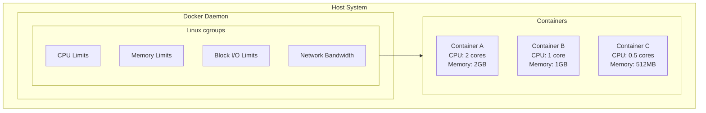
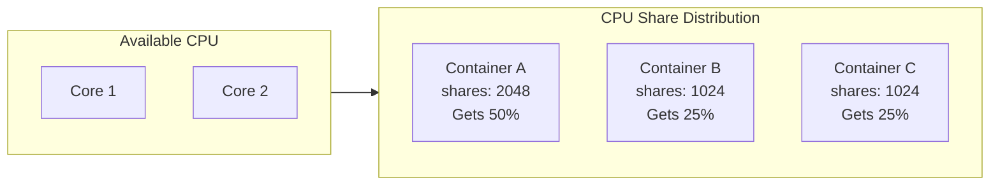
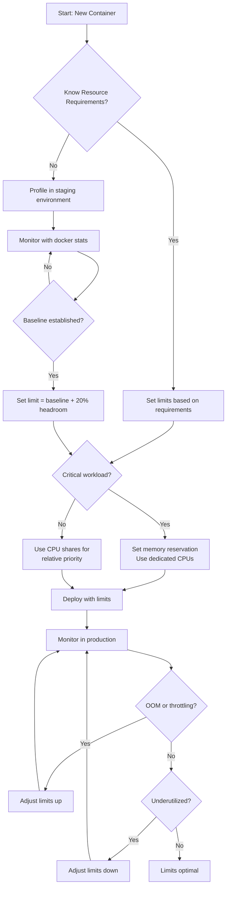

# How to Configure Docker Resource Limits

Author: [nawazdhandala](https://www.github.com/nawazdhandala)

Tags: Docker, DevOps, Containers, Performance, Resource Management

Description: A comprehensive guide to configuring CPU, memory, and I/O resource limits in Docker containers, covering runtime flags, Docker Compose settings, and best practices for production environments.

---

Containers without resource limits can consume all available host resources, causing cascading failures across your infrastructure. A single runaway container can starve other services, crash your host, or trigger OOM killers that terminate critical processes. Setting proper resource limits is essential for production deployments.

## Understanding Docker Resource Constraints

Docker leverages Linux cgroups (control groups) to enforce resource limits. You can constrain CPU, memory, block I/O, and network bandwidth. Here is how the constraint hierarchy works:



## Memory Limits

Memory limits prevent containers from consuming all available RAM. When a container exceeds its memory limit, Docker terminates it with an OOM (Out of Memory) error.

### Setting Hard Memory Limits

The `--memory` flag sets the maximum amount of memory a container can use. Once reached, the container gets killed.

```bash
# Run nginx with a hard memory limit of 512MB
# The container will be terminated if it tries to use more than 512MB
docker run -d \
  --name nginx-limited \
  --memory=512m \
  nginx:latest
```

### Configuring Memory Reservation (Soft Limits)

Memory reservation sets a soft limit that Docker tries to enforce when the host is under memory pressure. Containers can exceed this limit when resources are available.

```bash
# Set both hard limit (1GB) and soft limit (512MB)
# Container can use up to 1GB, but Docker will try to keep it at 512MB
# when the host is running low on memory
docker run -d \
  --name app-server \
  --memory=1g \
  --memory-reservation=512m \
  myapp:latest
```

### Controlling Swap Usage

By default, Docker allows containers to use swap equal to the memory limit. You can disable or limit swap usage for more predictable performance.

```bash
# Disable swap completely (container can only use RAM)
# memory-swap equals memory means no swap allowed
docker run -d \
  --name no-swap-app \
  --memory=512m \
  --memory-swap=512m \
  myapp:latest

# Allow 256MB of swap in addition to 512MB RAM (total 768MB)
docker run -d \
  --name limited-swap-app \
  --memory=512m \
  --memory-swap=768m \
  myapp:latest
```

## CPU Limits

CPU limits ensure fair resource distribution among containers. Docker provides multiple ways to constrain CPU usage.

### CPU Period and Quota

The most precise CPU limiting uses `--cpu-period` and `--cpu-quota`. The quota divided by period gives the number of CPUs available.

```bash
# Limit to 0.5 CPUs (50000 quota / 100000 period = 0.5)
# Period is in microseconds (100000 = 100ms)
# Quota is the time the container can run within each period
docker run -d \
  --name half-cpu-app \
  --cpu-period=100000 \
  --cpu-quota=50000 \
  myapp:latest

# Limit to 2 CPUs (200000 quota / 100000 period = 2)
docker run -d \
  --name dual-cpu-app \
  --cpu-period=100000 \
  --cpu-quota=200000 \
  myapp:latest
```

### Using the CPUs Flag (Simplified)

The `--cpus` flag provides a simpler way to limit CPU usage without calculating period and quota.

```bash
# Limit container to 1.5 CPUs
# Equivalent to --cpu-period=100000 --cpu-quota=150000
docker run -d \
  --name app-with-cpus \
  --cpus=1.5 \
  myapp:latest
```

### CPU Shares (Relative Weighting)

CPU shares provide relative priority between containers. The default is 1024. A container with 2048 shares gets twice the CPU time of a container with 1024 shares when they compete for resources.

```bash
# High priority container (double the default shares)
docker run -d \
  --name high-priority \
  --cpu-shares=2048 \
  critical-app:latest

# Low priority container (half the default shares)
docker run -d \
  --name low-priority \
  --cpu-shares=512 \
  background-job:latest
```

Here is how CPU shares work in practice:



### Pinning to Specific CPUs

For workloads requiring CPU affinity, you can pin containers to specific CPU cores.

```bash
# Pin container to CPU cores 0 and 1 only
# Useful for NUMA optimization or isolating workloads
docker run -d \
  --name pinned-app \
  --cpuset-cpus="0,1" \
  myapp:latest

# Pin to a range of CPUs (cores 0 through 3)
docker run -d \
  --name range-pinned-app \
  --cpuset-cpus="0-3" \
  myapp:latest
```

## Block I/O Limits

I/O limits prevent containers from monopolizing disk bandwidth, which is crucial for shared storage systems.

### Limiting Read/Write Bandwidth

Set maximum bytes per second for read and write operations.

```bash
# Limit read bandwidth to 10MB/s and write bandwidth to 5MB/s on /dev/sda
# Prevents container from saturating disk I/O
docker run -d \
  --name io-limited-app \
  --device-read-bps=/dev/sda:10mb \
  --device-write-bps=/dev/sda:5mb \
  myapp:latest
```

### Limiting I/O Operations Per Second (IOPS)

For workloads sensitive to IOPS rather than bandwidth, limit the number of operations.

```bash
# Limit to 1000 read IOPS and 500 write IOPS
# Useful for SSDs where IOPS is the primary constraint
docker run -d \
  --name iops-limited-app \
  --device-read-iops=/dev/sda:1000 \
  --device-write-iops=/dev/sda:500 \
  myapp:latest
```

### Block I/O Weight

Similar to CPU shares, I/O weight provides relative priority between containers (range: 10-1000, default: 500).

```bash
# High I/O priority container
docker run -d \
  --name high-io-priority \
  --blkio-weight=800 \
  database:latest

# Low I/O priority container
docker run -d \
  --name low-io-priority \
  --blkio-weight=200 \
  batch-job:latest
```

## Docker Compose Configuration

For production deployments, define resource limits in Docker Compose files for reproducibility.

```yaml
# docker-compose.yml
# Version 3.8+ required for deploy resources syntax
version: '3.8'

services:
  # Web application with balanced resource allocation
  webapp:
    image: myapp:latest
    deploy:
      resources:
        # Hard limits - container cannot exceed these
        limits:
          cpus: '2.0'        # Maximum 2 CPU cores
          memory: 1G          # Maximum 1GB RAM
        # Soft limits - guaranteed minimum resources
        reservations:
          cpus: '0.5'        # Reserve at least 0.5 CPU
          memory: 256M        # Reserve at least 256MB RAM
    # Health check ensures container is functioning
    healthcheck:
      test: ["CMD", "curl", "-f", "http://localhost/health"]
      interval: 30s
      timeout: 10s
      retries: 3

  # Database with higher resource allocation
  database:
    image: postgres:15
    deploy:
      resources:
        limits:
          cpus: '4.0'
          memory: 4G
        reservations:
          cpus: '1.0'
          memory: 1G
    # Mount data volume for persistence
    volumes:
      - db-data:/var/lib/postgresql/data

  # Background worker with lower priority
  worker:
    image: worker:latest
    deploy:
      resources:
        limits:
          cpus: '1.0'
          memory: 512M
        reservations:
          cpus: '0.25'
          memory: 128M
      # Run multiple replicas
      replicas: 3

volumes:
  db-data:
```

## Monitoring Resource Usage

Understanding actual resource consumption helps you set appropriate limits. Docker provides built-in monitoring capabilities.

### Real-time Statistics

The `docker stats` command shows live resource usage for all running containers.

```bash
# View real-time resource usage for all containers
# Shows CPU%, Memory usage/limit, Network I/O, Block I/O
docker stats

# Monitor specific containers only
docker stats webapp database worker

# Get a single snapshot without streaming (useful for scripts)
docker stats --no-stream --format "table {{.Name}}\t{{.CPUPerc}}\t{{.MemUsage}}"
```

### Inspecting Container Limits

Verify the resource limits applied to a running container.

```bash
# Show memory limit in bytes
docker inspect --format='{{.HostConfig.Memory}}' container_name

# Show CPU quota and period
docker inspect --format='CPUs: {{.HostConfig.NanoCpus}} Quota: {{.HostConfig.CpuQuota}} Period: {{.HostConfig.CpuPeriod}}' container_name

# Show all resource limits in JSON format
docker inspect --format='{{json .HostConfig.Resources}}' container_name | jq
```

## Resource Limit Decision Flow

Use the following decision process when setting resource limits:



## Best Practices

### 1. Always Set Memory Limits

Without memory limits, a memory leak can crash your entire host. Set limits for every production container.

```bash
# Always specify a memory limit, even if generous
docker run -d --memory=4g myapp:latest
```

### 2. Use Memory Reservation for Predictable Performance

Memory reservation ensures your application gets the resources it needs when the host is under pressure.

```bash
# Reservation guarantees resources, limit caps maximum
docker run -d \
  --memory=2g \
  --memory-reservation=1g \
  myapp:latest
```

### 3. Disable Swap for Latency-Sensitive Applications

Swap introduces unpredictable latency. Disable it for databases and real-time applications.

```bash
# Disable swap for consistent performance
docker run -d \
  --memory=4g \
  --memory-swap=4g \
  redis:latest
```

### 4. Start Conservative and Adjust

Begin with lower limits and increase based on monitoring data. Over-provisioning wastes resources; under-provisioning causes failures.

### 5. Use CPU Limits for Multi-Tenant Environments

In shared environments, CPU limits prevent one workload from affecting others.

```bash
# Ensure fair sharing in multi-tenant environments
docker run -d --cpus=2 tenant-app:latest
```

### 6. Combine with Health Checks

Resource limits work best alongside health checks. If a container becomes unresponsive due to resource constraints, health checks enable automatic recovery.

```yaml
# Docker Compose with health check
services:
  app:
    image: myapp:latest
    deploy:
      resources:
        limits:
          memory: 512M
    healthcheck:
      test: ["CMD", "curl", "-f", "http://localhost/health"]
      interval: 10s
      timeout: 5s
      retries: 3
      start_period: 30s
```

## Troubleshooting Common Issues

### Container Killed by OOM

When you see "Killed" in container logs, the OOM killer terminated your container. Check memory usage patterns and increase limits or fix memory leaks.

```bash
# Check if container was killed by OOM
docker inspect --format='{{.State.OOMKilled}}' container_name

# View container exit code (137 indicates OOM kill)
docker inspect --format='{{.State.ExitCode}}' container_name
```

### CPU Throttling

Containers hitting CPU limits show high throttle counts. Monitor throttling and adjust if performance suffers.

```bash
# Check CPU throttling statistics
cat /sys/fs/cgroup/cpu/docker/<container_id>/cpu.stat
```

### I/O Performance Issues

Slow disk operations may indicate I/O limits are too restrictive. Monitor actual I/O patterns before setting limits.

```bash
# Monitor container I/O in real-time
docker stats --format "table {{.Name}}\t{{.BlockIO}}"
```

---

Properly configured resource limits transform Docker from a development convenience into a production-ready platform. Start with monitoring to understand your baseline, apply limits conservatively, and iterate based on real-world behavior. The small investment in configuration prevents the large cost of resource exhaustion incidents.
