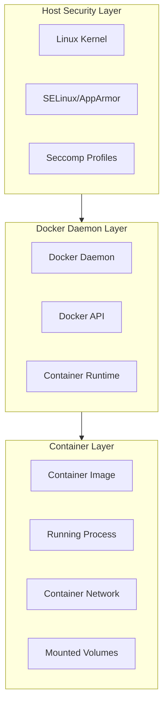
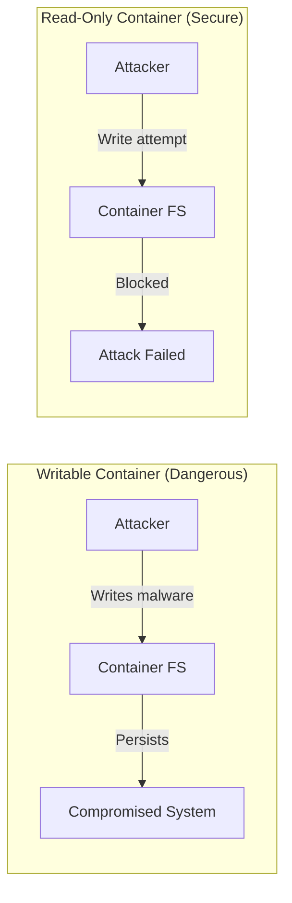
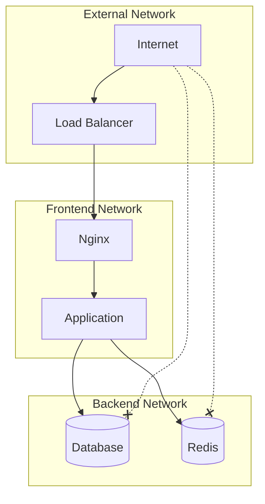
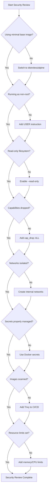

# How to Handle Docker Security Best Practices

Author: [nawazdhandala](https://www.github.com/nawazdhandala)

Tags: Docker, Security, Containers, Best Practices, DevOps, DevSecOps

Description: A comprehensive guide to securing Docker containers in production, covering image hardening, runtime security, network isolation, secrets management, and vulnerability scanning strategies.

---

Docker containers have revolutionized how we build, ship, and run applications. But with great power comes great responsibility. A misconfigured container can expose your entire infrastructure to attackers. This guide covers the essential security practices every team should implement when running Docker in production.

## Understanding Docker Security Layers

Before diving into specific practices, it is important to understand where security fits in the container ecosystem.



Security must be applied at every layer. A vulnerability at any level can compromise your entire stack.

## 1. Use Minimal Base Images

The smaller your image, the smaller your attack surface. Every package you include is a potential vulnerability.

### Choosing the Right Base Image

The following table shows common base images and their sizes. Smaller images mean fewer potential vulnerabilities to patch.

| Base Image | Size | Use Case |
|-----------|------|----------|
| scratch | 0 MB | Statically compiled binaries |
| distroless | 2-20 MB | Production runtime only |
| alpine | 5 MB | When shell access is needed |
| debian-slim | 80 MB | When glibc is required |
| ubuntu | 75 MB | Development and debugging |

### Using Distroless Images

Distroless images contain only your application and its runtime dependencies. No shell, no package manager, no extra utilities.

```dockerfile
# Build stage: Use full image with all build tools
# This stage compiles the Go application but is not included in the final image
FROM golang:1.22-bullseye AS builder

WORKDIR /app

# Copy dependency files first to leverage Docker layer caching
# go.mod and go.sum rarely change, so this layer stays cached
COPY go.mod go.sum ./
RUN go mod download

# Copy source code and build the binary
COPY . .

# Build a statically linked binary that can run without glibc
# CGO_ENABLED=0 disables C dependencies for true static linking
# -ldflags="-s -w" strips debug symbols to reduce binary size
RUN CGO_ENABLED=0 GOOS=linux go build -ldflags="-s -w" -o /app/server .

# Runtime stage: Use distroless for minimal attack surface
# This image has no shell, package manager, or debugging tools
FROM gcr.io/distroless/static-debian12

# Copy only the compiled binary from the build stage
COPY --from=builder /app/server /server

# Run as non-root user (65532 is the distroless nonroot user)
USER 65532:65532

ENTRYPOINT ["/server"]
```

### Using Alpine for Shell Access

When you need a shell but want to minimize size, Alpine is a good choice. However, be aware of musl vs glibc compatibility issues.

```dockerfile
# Alpine-based Node.js image for smaller footprint
# Alpine uses musl libc instead of glibc, which can cause compatibility issues
# with some native Node modules
FROM node:20-alpine

# Create application directory with proper ownership
WORKDIR /app

# Install security updates and remove package cache
# --no-cache prevents storing the package index (saves space)
RUN apk update && apk upgrade --no-cache

# Create non-root user for running the application
# Using a specific UID/GID for consistency across environments
RUN addgroup -g 1001 -S nodejs && \
    adduser -S nodejs -u 1001 -G nodejs

# Copy package files and install dependencies
COPY package*.json ./
RUN npm ci --only=production && npm cache clean --force

# Copy application code
COPY --chown=nodejs:nodejs . .

# Switch to non-root user
USER nodejs

EXPOSE 3000
CMD ["node", "server.js"]
```

## 2. Never Run Containers as Root

Running containers as root is one of the most common and dangerous misconfigurations. If an attacker escapes the container, they have root access to the host.

### Setting User in Dockerfile

Always specify a non-root user in your Dockerfile.

```dockerfile
# Python application with non-root user
FROM python:3.12-slim

# Create application directory
WORKDIR /app

# Create a non-root user with specific UID
# Using numeric UID for better compatibility with Kubernetes security contexts
RUN groupadd --gid 1000 appgroup && \
    useradd --uid 1000 --gid appgroup --shell /bin/false appuser

# Install dependencies as root (before switching users)
COPY requirements.txt .
RUN pip install --no-cache-dir -r requirements.txt

# Copy application code with correct ownership
COPY --chown=appuser:appgroup . .

# Switch to non-root user for all subsequent commands
USER appuser

# Use exec form to ensure signals are passed correctly
CMD ["python", "app.py"]
```

### Runtime User Override

You can also specify the user at runtime, which overrides the Dockerfile setting.

```bash
# Run container as non-root user with specific UID
# The --user flag overrides any USER instruction in the Dockerfile
docker run --user 1000:1000 myapp:latest

# Run with a read-only root filesystem for additional security
# tmpfs mounts provide writable directories where needed
docker run --user 1000:1000 \
    --read-only \
    --tmpfs /tmp:rw,noexec,nosuid \
    myapp:latest
```

### Docker Compose Configuration

In Docker Compose, set the user in your service definition.

```yaml
# docker-compose.yml with security configurations
version: "3.9"

services:
  web:
    image: myapp:latest
    # Run as non-root user
    user: "1000:1000"
    # Make root filesystem read-only
    read_only: true
    # Provide writable tmpfs for temporary files
    tmpfs:
      - /tmp:rw,noexec,nosuid,size=100m
    # Drop all capabilities and add only what is needed
    cap_drop:
      - ALL
    cap_add:
      - NET_BIND_SERVICE
    # Prevent privilege escalation
    security_opt:
      - no-new-privileges:true
```

## 3. Use Read-Only File Systems

Containers should be immutable. A read-only root filesystem prevents attackers from modifying binaries or writing malicious code.



### Implementing Read-Only Containers

The following configuration enables read-only filesystem with specific writable locations.

```bash
# Run with read-only root filesystem
# --read-only makes the entire container filesystem read-only
# --tmpfs provides in-memory writable directories for runtime needs
docker run -d \
    --read-only \
    --tmpfs /tmp:rw,noexec,nosuid,size=64m \
    --tmpfs /var/run:rw,noexec,nosuid,size=32m \
    nginx:alpine
```

### Handling Applications That Need Write Access

Some applications require specific writable directories. Map these explicitly.

```yaml
# docker-compose.yml for applications needing write access
version: "3.9"

services:
  app:
    image: myapp:latest
    read_only: true
    tmpfs:
      # Temporary files - cleared on restart
      - /tmp:rw,noexec,nosuid
    volumes:
      # Persistent data directory - use named volume
      - app_data:/app/data:rw
      # Logs directory - consider using external logging instead
      - app_logs:/var/log/app:rw
    security_opt:
      - no-new-privileges:true

volumes:
  app_data:
  app_logs:
```

## 4. Drop Linux Capabilities

By default, Docker containers run with a subset of Linux capabilities. Drop all capabilities and add only what you need.

### Understanding Capabilities

Linux capabilities split root privileges into distinct units. This allows fine-grained permission control.

| Capability | Description | Risk Level |
|-----------|-------------|------------|
| CAP_SYS_ADMIN | Perform system administration operations | Critical |
| CAP_NET_ADMIN | Network configuration | High |
| CAP_NET_RAW | Use raw sockets | Medium |
| CAP_CHOWN | Change file ownership | Medium |
| CAP_SETUID | Set user ID | High |

### Implementing Capability Restrictions

Drop all capabilities by default and add only the specific ones your application needs.

```bash
# Drop all capabilities and add only what is needed
# --cap-drop=ALL removes all default capabilities
# --cap-add adds back only specific required capabilities
docker run -d \
    --cap-drop=ALL \
    --cap-add=NET_BIND_SERVICE \
    --cap-add=CHOWN \
    nginx:alpine
```

### Docker Compose with Capability Controls

Configure capabilities in your Compose file for consistent deployments.

```yaml
# docker-compose.yml with capability restrictions
version: "3.9"

services:
  nginx:
    image: nginx:alpine
    # Drop all capabilities first
    cap_drop:
      - ALL
    # Add back only what nginx needs
    # NET_BIND_SERVICE: bind to ports below 1024
    # CHOWN: change ownership of log files
    # SETGID/SETUID: change process identity (for worker processes)
    cap_add:
      - NET_BIND_SERVICE
      - CHOWN
      - SETGID
      - SETUID
    # Prevent gaining new privileges through setuid binaries
    security_opt:
      - no-new-privileges:true
```

## 5. Implement Network Isolation

Container networks should be isolated by default. Only expose what is necessary.



### Creating Isolated Networks

Use Docker networks to segment your application tiers.

```bash
# Create isolated networks for different tiers
# frontend network: accessible from outside
docker network create --driver bridge frontend

# backend network: internal only, no external access
# --internal flag prevents external connectivity
docker network create --driver bridge --internal backend

# Run frontend container on frontend network
docker run -d --name nginx \
    --network frontend \
    -p 80:80 \
    nginx:alpine

# Run application on both networks (acts as bridge)
docker run -d --name app \
    --network frontend \
    myapp:latest

# Connect app to backend network as well
docker network connect backend app

# Run database on internal backend network only
docker run -d --name postgres \
    --network backend \
    postgres:16-alpine
```

### Docker Compose Network Configuration

Define network segmentation in your Compose file.

```yaml
# docker-compose.yml with network isolation
version: "3.9"

services:
  nginx:
    image: nginx:alpine
    networks:
      - frontend
    ports:
      - "80:80"
      - "443:443"

  app:
    image: myapp:latest
    networks:
      - frontend
      - backend
    # No ports exposed to host - only accessible via nginx

  postgres:
    image: postgres:16-alpine
    networks:
      - backend
    # No ports exposed - only accessible from backend network
    environment:
      POSTGRES_PASSWORD_FILE: /run/secrets/db_password
    secrets:
      - db_password

networks:
  frontend:
    driver: bridge
  backend:
    driver: bridge
    # Internal network - no external access
    internal: true

secrets:
  db_password:
    file: ./secrets/db_password.txt
```

## 6. Secure Secrets Management

Never hardcode secrets in images or environment variables visible in process listings.

### Using Docker Secrets (Swarm Mode)

Docker Swarm provides native secrets management.

```bash
# Create a secret from a file
# The secret is encrypted at rest and only mounted in containers that need it
echo "mysecretpassword" | docker secret create db_password -

# Create a secret from a file
docker secret create ssl_cert ./server.crt
```

### Using Docker Secrets in Compose

Mount secrets as files rather than environment variables.

```yaml
# docker-compose.yml with secrets
version: "3.9"

services:
  app:
    image: myapp:latest
    secrets:
      - db_password
      - api_key
    environment:
      # Point to secret files instead of containing the actual values
      DB_PASSWORD_FILE: /run/secrets/db_password
      API_KEY_FILE: /run/secrets/api_key

secrets:
  db_password:
    file: ./secrets/db_password.txt
  api_key:
    external: true  # Secret already exists in Docker
```

### Reading Secrets in Application Code

Your application should read secrets from files, not environment variables.

```python
# Python example: Reading secrets from files
import os

def get_secret(secret_name: str) -> str:
    """
    Read a secret from Docker secret file or environment variable.

    Docker secrets are mounted at /run/secrets/<secret_name>
    Falls back to environment variable if file does not exist.
    """
    # First, try to read from Docker secret file
    secret_file = f"/run/secrets/{secret_name}"

    if os.path.exists(secret_file):
        with open(secret_file, "r") as f:
            return f.read().strip()

    # Fall back to environment variable (for local development)
    env_var = f"{secret_name.upper()}"
    value = os.environ.get(env_var)

    if value is None:
        raise ValueError(f"Secret {secret_name} not found")

    return value

# Usage
db_password = get_secret("db_password")
api_key = get_secret("api_key")
```

### Using BuildKit for Build-Time Secrets

For secrets needed during build (like private package registries), use BuildKit secret mounts.

```dockerfile
# syntax=docker/dockerfile:1.6
# Enable BuildKit features with syntax directive

FROM node:20-alpine

WORKDIR /app

COPY package*.json ./

# Mount NPM token as a secret during npm install
# The secret is never stored in any image layer
# --mount=type=secret mounts the secret only for this RUN command
RUN --mount=type=secret,id=npm_token,target=/run/secrets/npm_token \
    npm config set //registry.npmjs.org/:_authToken $(cat /run/secrets/npm_token) && \
    npm ci --only=production && \
    npm config delete //registry.npmjs.org/:_authToken

COPY . .

USER node
CMD ["node", "server.js"]
```

Build with the secret:

```bash
# Build with BuildKit secrets
# The secret is passed to the build but never stored in the image
DOCKER_BUILDKIT=1 docker build \
    --secret id=npm_token,src=$HOME/.npmrc \
    -t myapp:latest .
```

## 7. Implement Image Scanning

Scan images for vulnerabilities before deployment. Integrate scanning into your CI/CD pipeline.

### Using Trivy for Vulnerability Scanning

Trivy is a comprehensive vulnerability scanner that checks for OS and application dependencies.

```bash
# Scan an image for vulnerabilities
# Trivy checks both OS packages and application dependencies
trivy image myapp:latest

# Scan with severity filter - only show high and critical
trivy image --severity HIGH,CRITICAL myapp:latest

# Fail CI if critical vulnerabilities found
# Exit code 1 if vulnerabilities matching criteria are found
trivy image --exit-code 1 --severity CRITICAL myapp:latest

# Generate JSON report for processing
trivy image --format json --output results.json myapp:latest
```

### CI/CD Integration with GitHub Actions

Integrate vulnerability scanning into your build pipeline.

```yaml
# .github/workflows/security-scan.yml
name: Security Scan

on:
  push:
    branches: [main]
  pull_request:
    branches: [main]

jobs:
  scan:
    runs-on: ubuntu-latest
    steps:
      - name: Checkout code
        uses: actions/checkout@v4

      - name: Build image
        run: docker build -t myapp:${{ github.sha }} .

      - name: Run Trivy vulnerability scanner
        uses: aquasecurity/trivy-action@master
        with:
          image-ref: myapp:${{ github.sha }}
          format: sarif
          output: trivy-results.sarif
          # Fail on critical and high vulnerabilities
          severity: CRITICAL,HIGH
          exit-code: 1

      - name: Upload Trivy scan results
        uses: github/codeql-action/upload-sarif@v3
        if: always()
        with:
          sarif_file: trivy-results.sarif
```

### Scanning Base Images Regularly

Base images receive security updates. Regularly rebuild and scan your images.

```bash
#!/bin/bash
# Script to scan and rebuild images with updated base images

IMAGES=("myapp:latest" "worker:latest" "api:latest")

for image in "${IMAGES[@]}"; do
    echo "Scanning $image..."

    # Scan for vulnerabilities
    trivy image --severity HIGH,CRITICAL "$image" > "/tmp/${image//[:\/]/_}_scan.txt"

    # Count critical vulnerabilities
    critical_count=$(trivy image --severity CRITICAL -q "$image" | wc -l)

    if [ "$critical_count" -gt 0 ]; then
        echo "WARNING: $image has $critical_count critical vulnerabilities"
        echo "Consider rebuilding with updated base image"
    fi
done
```

## 8. Use Security Profiles (Seccomp and AppArmor)

Seccomp and AppArmor provide additional layers of system call and resource access control.

### Seccomp Profiles

Seccomp filters limit which system calls a container can make.

```json
{
    "defaultAction": "SCMP_ACT_ERRNO",
    "defaultErrnoRet": 1,
    "architectures": [
        "SCMP_ARCH_X86_64",
        "SCMP_ARCH_AARCH64"
    ],
    "syscalls": [
        {
            "names": [
                "accept", "accept4", "bind", "close", "connect",
                "dup", "dup2", "epoll_create", "epoll_ctl", "epoll_wait",
                "exit", "exit_group", "fcntl", "fstat", "futex",
                "getpid", "getsockname", "getsockopt", "listen",
                "mmap", "mprotect", "munmap", "nanosleep", "open",
                "openat", "poll", "read", "recvfrom", "recvmsg",
                "rt_sigaction", "rt_sigprocmask", "sendmsg", "sendto",
                "setsockopt", "shutdown", "socket", "stat", "write"
            ],
            "action": "SCMP_ACT_ALLOW"
        }
    ]
}
```

Apply the profile:

```bash
# Run container with custom seccomp profile
# --security-opt seccomp= specifies the profile to use
docker run --security-opt seccomp=/path/to/profile.json myapp:latest
```

### AppArmor Profiles

AppArmor provides mandatory access control on file paths and capabilities.

```bash
# AppArmor profile for a web application
# Save as /etc/apparmor.d/docker-webapp
#include <tunables/global>

profile docker-webapp flags=(attach_disconnected,mediate_deleted) {
  #include <abstractions/base>
  #include <abstractions/nameservice>

  # Network access
  network inet tcp,
  network inet udp,

  # Allow reading application files
  /app/** r,
  /app/server ix,

  # Allow writing to specific directories only
  /tmp/** rw,
  /var/log/app/** rw,

  # Deny access to sensitive host paths
  deny /etc/shadow r,
  deny /etc/passwd w,
  deny /proc/*/mem rw,
}
```

Load and apply:

```bash
# Load the AppArmor profile
sudo apparmor_parser -r /etc/apparmor.d/docker-webapp

# Run container with AppArmor profile
docker run --security-opt apparmor=docker-webapp myapp:latest
```

## 9. Implement Resource Limits

Resource limits prevent denial of service attacks and resource exhaustion.

```yaml
# docker-compose.yml with resource limits
version: "3.9"

services:
  app:
    image: myapp:latest
    deploy:
      resources:
        limits:
          # Maximum resources the container can use
          cpus: "2.0"
          memory: 512M
          pids: 100  # Prevent fork bombs
        reservations:
          # Guaranteed minimum resources
          cpus: "0.5"
          memory: 256M
    # Limit file descriptors and processes
    ulimits:
      nofile:
        soft: 65536
        hard: 65536
      nproc:
        soft: 100
        hard: 200
```

### Runtime Resource Controls

Apply resource limits at runtime for additional protection.

```bash
# Run with comprehensive resource limits
docker run -d \
    --memory=512m \
    --memory-swap=512m \
    --memory-reservation=256m \
    --cpus=2 \
    --pids-limit=100 \
    --ulimit nofile=65536:65536 \
    --restart=on-failure:3 \
    myapp:latest
```

## 10. Enable Docker Content Trust

Docker Content Trust ensures you only run signed images from verified publishers.

```bash
# Enable Docker Content Trust
# This enforces signature verification for all image operations
export DOCKER_CONTENT_TRUST=1

# Now docker pull/push/build will verify signatures
docker pull myregistry.com/myapp:latest

# Sign and push an image
# Requires setting up signing keys first
docker trust sign myregistry.com/myapp:latest

# Inspect image signatures
docker trust inspect --pretty myregistry.com/myapp:latest
```

### Setting Up Image Signing

Configure signing keys for your registry.

```bash
# Generate a new signing key
docker trust key generate my-signing-key

# Add signer to a repository
docker trust signer add --key my-signing-key.pub my-signer myregistry.com/myapp

# Sign an image
docker trust sign myregistry.com/myapp:v1.0.0
```

## Security Checklist

Use this checklist to ensure your Docker deployments are secure.



### Quick Reference Commands

Keep these commands handy for security auditing.

```bash
# Check if container is running as root
docker inspect --format='{{.Config.User}}' container_name

# List containers with privileged mode
docker ps --quiet | xargs docker inspect --format='{{.Name}}: Privileged={{.HostConfig.Privileged}}'

# Check mounted volumes
docker inspect --format='{{range .Mounts}}{{.Source}} -> {{.Destination}}{{"\n"}}{{end}}' container_name

# View container capabilities
docker inspect --format='{{.HostConfig.CapAdd}} {{.HostConfig.CapDrop}}' container_name

# Check resource limits
docker stats --no-stream

# Audit all running containers
docker ps --format "table {{.Names}}\t{{.Image}}\t{{.Status}}"
```

## Conclusion

Docker security is not a single configuration but a comprehensive approach across multiple layers. By implementing these practices, you significantly reduce your attack surface and create a more resilient infrastructure.

Key takeaways:

1. **Start minimal** - Use distroless or Alpine base images
2. **Principle of least privilege** - Non-root users, dropped capabilities, read-only filesystems
3. **Defense in depth** - Network isolation, seccomp, AppArmor
4. **Automate security** - Scan images in CI/CD, enforce policies
5. **Manage secrets properly** - Never hardcode, use Docker secrets or external vaults
6. **Set resource limits** - Prevent resource exhaustion attacks
7. **Sign your images** - Enable Docker Content Trust

Security is an ongoing process. Regularly audit your configurations, update base images, and stay informed about new vulnerabilities. The effort you invest in container security today protects your infrastructure tomorrow.
