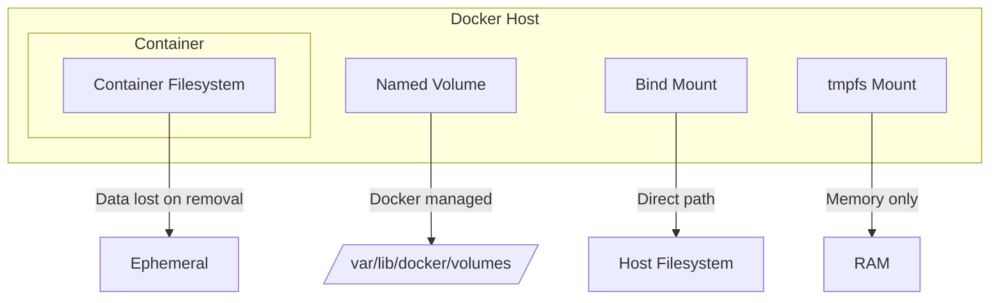
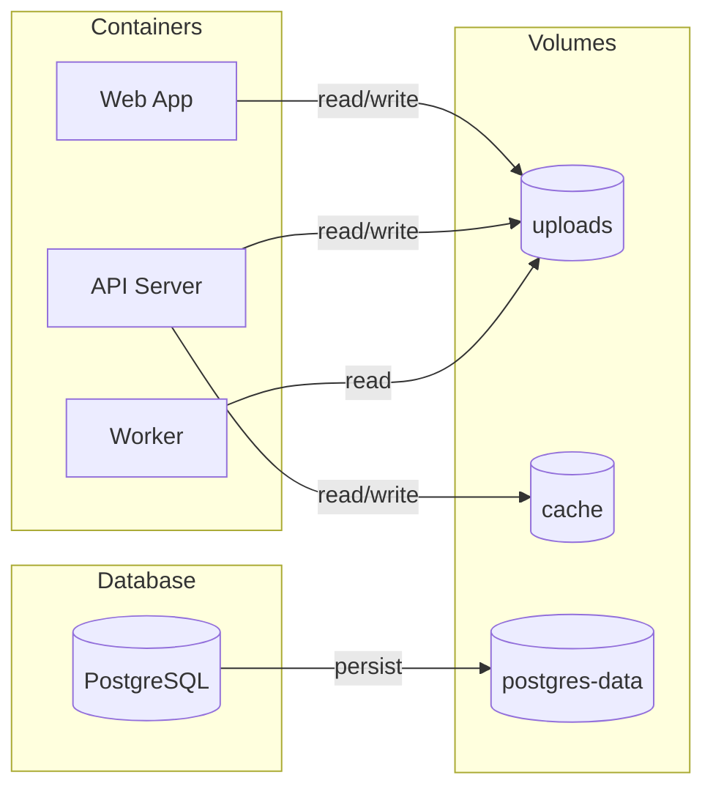
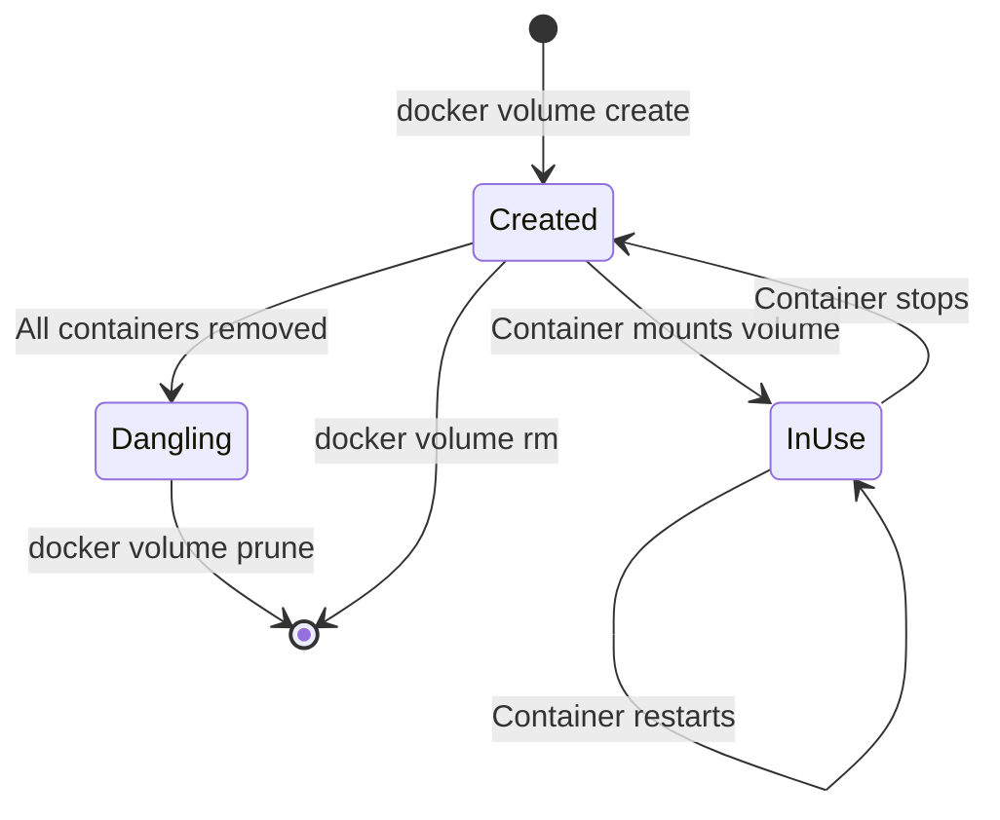
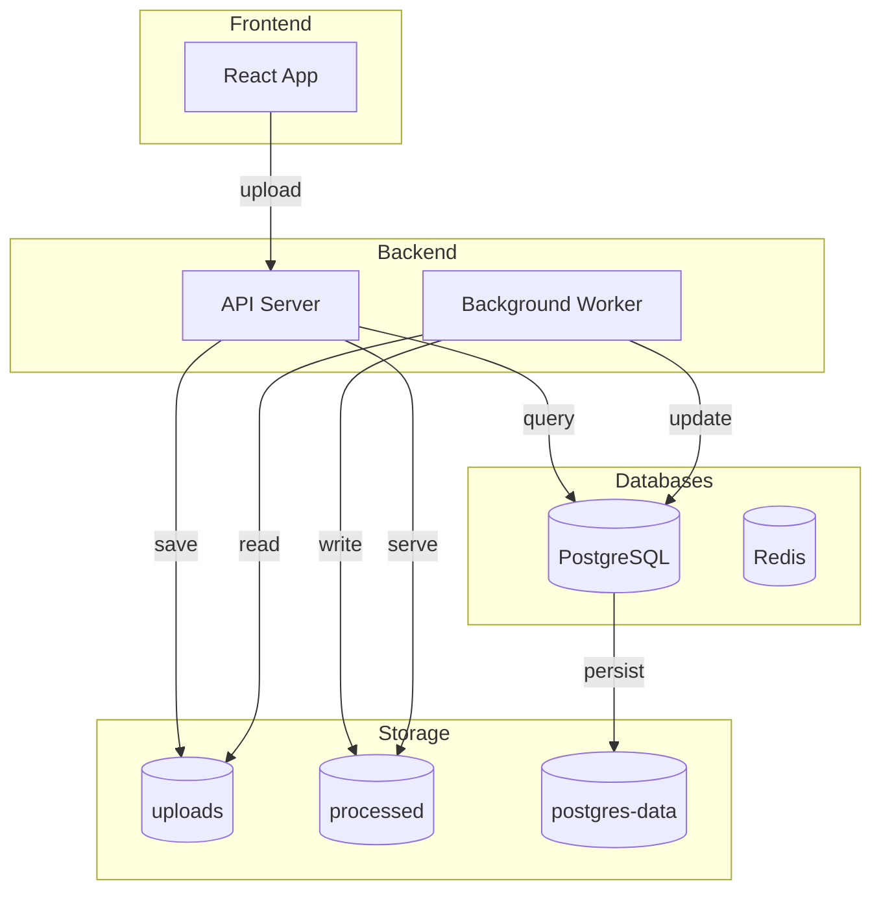
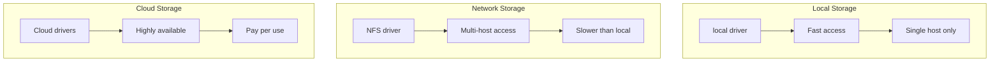

# How to Use Docker Volumes for Persistent Data

Author: [nawazdhandala](https://www.github.com/nawazdhandala)

Tags: Docker, Volumes, Storage, Containers, DevOps, Persistence

Description: A comprehensive guide to Docker volumes covering creation, management, and best practices for persisting data across container lifecycles, with practical examples for databases, file storage, and production deployments.

Containers are ephemeral by design. When a container stops or is removed, any data written inside it disappears. This works well for stateless applications, but databases, file uploads, configuration files, and application state need to survive container restarts. Docker volumes solve this problem by providing persistent storage that lives independently of container lifecycles.

---

## Understanding Docker Storage Options

Docker provides three main ways to persist data. Each has different characteristics suited to specific use cases.



### Named Volumes

Named volumes are the recommended approach for most production scenarios. Docker manages the storage location, permissions, and lifecycle. You reference them by name rather than path.

```bash
# Create a named volume that Docker will manage automatically
docker volume create myapp-data

# The volume exists independently of any container
docker volume ls
```

### Bind Mounts

Bind mounts map a specific host directory into the container. You have full control over the location, but you are responsible for permissions and backups.

```bash
# Mount a host directory directly into the container
# Changes in either location are immediately visible in both
docker run -v /home/user/data:/app/data myimage
```

### tmpfs Mounts

tmpfs mounts store data in memory only. Data is lost when the container stops, but this is useful for sensitive data that should never touch disk.

```bash
# Store temporary sensitive data in memory only
docker run --tmpfs /app/secrets myimage
```

---

## Creating and Managing Named Volumes

Named volumes provide the cleanest abstraction for persistent storage. Docker handles all the underlying filesystem details.

### Creating Volumes

The `docker volume create` command creates a new named volume. You can optionally specify a driver and options for advanced configurations.

```bash
# Create a basic named volume with default settings
docker volume create postgres-data

# Create a volume with specific labels for organization
docker volume create --label environment=production --label app=myapp myapp-data

# Create a volume with a specific driver (default is 'local')
docker volume create --driver local --opt type=none --opt device=/mnt/ssd/data --opt o=bind ssd-storage
```

### Listing and Inspecting Volumes

These commands help you understand what volumes exist and their configurations.

```bash
# List all volumes on the system
docker volume ls

# Filter volumes by label
docker volume ls --filter label=environment=production

# Get detailed information about a specific volume
docker volume inspect postgres-data
```

The inspect command returns JSON with details about the volume:

```json
[
    {
        "CreatedAt": "2026-02-02T10:30:00Z",
        "Driver": "local",
        "Labels": {
            "environment": "production",
            "app": "myapp"
        },
        "Mountpoint": "/var/lib/docker/volumes/postgres-data/_data",
        "Name": "postgres-data",
        "Options": {},
        "Scope": "local"
    }
]
```

### Removing Volumes

Unused volumes consume disk space. Clean them up carefully since deletion is permanent.

```bash
# Remove a specific volume (fails if volume is in use)
docker volume rm postgres-data

# Remove all unused volumes (not attached to any container)
docker volume prune

# Remove all unused volumes without confirmation prompt
docker volume prune -f

# Remove volumes along with the container
docker rm -v mycontainer
```

---

## Mounting Volumes to Containers

There are two syntaxes for mounting volumes: the legacy `-v` flag and the newer `--mount` flag. The `--mount` flag is more explicit and recommended for complex configurations.

### Using the -v Flag

The `-v` flag uses a colon-separated syntax: `source:destination:options`.

```bash
# Mount named volume 'mydata' to /data inside container
docker run -v mydata:/data myimage

# Mount with read-only access to prevent container modifications
docker run -v mydata:/data:ro myimage

# Mount multiple volumes to different paths
docker run -v config:/app/config -v logs:/app/logs -v data:/app/data myimage
```

### Using the --mount Flag

The `--mount` flag uses key-value pairs for clearer syntax, especially with multiple options.

```bash
# Mount a named volume using explicit key-value syntax
docker run --mount source=mydata,target=/data myimage

# Mount with read-only access
docker run --mount source=mydata,target=/data,readonly myimage

# Mount with volume driver options
docker run --mount source=mydata,target=/data,volume-driver=local,volume-opt=type=nfs,volume-opt=device=:/path/to/nfs myimage
```

### Automatic Volume Creation

If you reference a volume that does not exist, Docker creates it automatically.

```bash
# This creates 'newvolume' if it does not exist
docker run -v newvolume:/data myimage

# Verify the volume was created
docker volume ls | grep newvolume
```

---

## Docker Compose Volume Configuration

Docker Compose makes volume management declarative and reproducible. Define volumes once and reference them across multiple services.

### Basic Volume Configuration

This example shows a typical production setup with a web application and PostgreSQL database sharing volumes appropriately.

```yaml
# docker-compose.yml
version: "3.9"

services:
  web:
    image: myapp:latest
    volumes:
      # Named volume for uploaded files
      - uploads:/app/uploads
      # Named volume for application logs
      - logs:/app/logs
    depends_on:
      - db

  db:
    image: postgres:16
    volumes:
      # Named volume for database files
      - postgres-data:/var/lib/postgresql/data
    environment:
      POSTGRES_PASSWORD: secretpassword
      POSTGRES_DB: myapp

# Define named volumes at the bottom
volumes:
  uploads:
  logs:
  postgres-data:
```

### Volume Configuration Options

You can configure volumes with additional options for drivers, labels, and external references.

```yaml
volumes:
  # Basic named volume with default settings
  basic-volume:

  # Volume with labels for organization
  labeled-volume:
    labels:
      environment: production
      backup: daily

  # Volume using external driver (must be installed)
  nfs-volume:
    driver: local
    driver_opts:
      type: nfs
      o: addr=192.168.1.100,rw,nfsvers=4
      device: ":/exports/data"

  # Reference an existing volume created outside Compose
  external-volume:
    external: true
    name: my-preexisting-volume
```

### Sharing Volumes Between Services

Multiple containers can access the same volume for shared data or inter-service communication.

```yaml
services:
  # Producer writes files to shared volume
  producer:
    image: producer-app
    volumes:
      - shared-data:/data/output

  # Consumer reads files from shared volume
  consumer:
    image: consumer-app
    volumes:
      - shared-data:/data/input:ro  # Read-only access
    depends_on:
      - producer

  # Processor has read-write access
  processor:
    image: processor-app
    volumes:
      - shared-data:/data

volumes:
  shared-data:
```

---

## Volume Architecture and Data Flow

Understanding how data flows between containers and volumes helps you design better architectures.



---

## Practical Examples with Real Applications

These examples demonstrate volume usage with popular applications you will encounter in production environments.

### PostgreSQL Database

PostgreSQL stores all data in `/var/lib/postgresql/data`. Mount a volume there to persist your database.

```yaml
# docker-compose.yml for PostgreSQL with persistent storage
services:
  postgres:
    image: postgres:16
    container_name: postgres-db
    restart: unless-stopped
    volumes:
      # Main data directory - this is where all database files live
      - postgres-data:/var/lib/postgresql/data
      # Optional: mount initialization scripts
      - ./init-scripts:/docker-entrypoint-initdb.d:ro
    environment:
      POSTGRES_USER: appuser
      POSTGRES_PASSWORD: ${POSTGRES_PASSWORD}
      POSTGRES_DB: application
    healthcheck:
      test: ["CMD-SHELL", "pg_isready -U appuser -d application"]
      interval: 10s
      timeout: 5s
      retries: 5

volumes:
  postgres-data:
    labels:
      backup: daily
      retention: 30d
```

To verify data persists:

```bash
# Start the database and create some data
docker compose up -d
docker exec -it postgres-db psql -U appuser -d application -c "CREATE TABLE test (id serial, name text);"
docker exec -it postgres-db psql -U appuser -d application -c "INSERT INTO test (name) VALUES ('persistent');"

# Stop and remove the container
docker compose down

# Start again - data should persist
docker compose up -d
docker exec -it postgres-db psql -U appuser -d application -c "SELECT * FROM test;"
# Output shows: 1 | persistent
```

### Redis with Persistence

Redis can persist data using RDB snapshots or AOF logs. Configure volumes for both.

```yaml
services:
  redis:
    image: redis:7-alpine
    container_name: redis-cache
    restart: unless-stopped
    command: redis-server --appendonly yes --appendfsync everysec
    volumes:
      # Persist RDB snapshots and AOF files
      - redis-data:/data
    healthcheck:
      test: ["CMD", "redis-cli", "ping"]
      interval: 10s
      timeout: 5s
      retries: 5

volumes:
  redis-data:
```

### MongoDB with Authentication

MongoDB requires proper volume mounting and initialization for production use.

```yaml
services:
  mongodb:
    image: mongo:7
    container_name: mongodb
    restart: unless-stopped
    volumes:
      # Database files
      - mongo-data:/data/db
      # Config database
      - mongo-config:/data/configdb
      # Initialization scripts run once on first startup
      - ./mongo-init:/docker-entrypoint-initdb.d:ro
    environment:
      MONGO_INITDB_ROOT_USERNAME: admin
      MONGO_INITDB_ROOT_PASSWORD: ${MONGO_PASSWORD}
      MONGO_INITDB_DATABASE: application

volumes:
  mongo-data:
  mongo-config:
```

### Nginx with Static Files

Serve static files from a volume that can be updated independently of the container.

```yaml
services:
  nginx:
    image: nginx:alpine
    container_name: webserver
    restart: unless-stopped
    ports:
      - "80:80"
      - "443:443"
    volumes:
      # Static website files
      - static-files:/usr/share/nginx/html:ro
      # Custom nginx configuration
      - ./nginx.conf:/etc/nginx/nginx.conf:ro
      # SSL certificates
      - certs:/etc/nginx/certs:ro
      # Access logs
      - nginx-logs:/var/log/nginx

volumes:
  static-files:
  certs:
  nginx-logs:
```

---

## Volume Lifecycle Management

Understanding volume lifecycle helps you manage storage effectively and avoid data loss.



### Finding Dangling Volumes

Dangling volumes are not attached to any container and may be wasting disk space.

```bash
# List all dangling (unused) volumes
docker volume ls -f dangling=true

# Get total size of all volumes
docker system df -v | grep "Local Volumes" -A 100

# Detailed volume usage information
docker system df --verbose
```

### Volume Cleanup Script

This script identifies large unused volumes and optionally removes them with confirmation.

```bash
#!/bin/bash
# cleanup-volumes.sh - Find and optionally remove unused Docker volumes

echo "=== Dangling Volumes ==="
docker volume ls -f dangling=true

echo ""
echo "=== Volume Sizes ==="
for vol in $(docker volume ls -q); do
    # Get the mountpoint and calculate size
    mountpoint=$(docker volume inspect --format '{{ .Mountpoint }}' "$vol")
    if [ -d "$mountpoint" ]; then
        size=$(du -sh "$mountpoint" 2>/dev/null | cut -f1)
        echo "$vol: $size"
    fi
done

echo ""
read -p "Remove all dangling volumes? (y/N) " -n 1 -r
echo
if [[ $REPLY =~ ^[Yy]$ ]]; then
    docker volume prune -f
    echo "Dangling volumes removed"
fi
```

---

## Volume Permissions and Ownership

Permission issues are the most common problem with Docker volumes. Understanding how container users map to host users prevents these issues.

### The Permission Problem

Containers often run as non-root users for security, but volume permissions may not match.

```bash
# Create a volume and inspect its permissions
docker volume create testdata
docker run --rm -v testdata:/data alpine ls -la /data
# Shows: drwxr-xr-x root root

# Try to write as non-root user (uid 1000)
docker run --rm -u 1000:1000 -v testdata:/data alpine touch /data/test.txt
# Error: Permission denied
```

### Solution 1: Initialize Permissions

Run an initialization container to set correct permissions before the application starts.

```yaml
services:
  # Init container sets permissions, then exits
  init-permissions:
    image: alpine
    volumes:
      - appdata:/data
    command: chown -R 1000:1000 /data
    user: root

  # Application runs as non-root user
  app:
    image: myapp
    user: "1000:1000"
    volumes:
      - appdata:/data
    depends_on:
      init-permissions:
        condition: service_completed_successfully

volumes:
  appdata:
```

### Solution 2: Match Container UID

Build your container to use the same UID that owns the volume data.

```dockerfile
# Dockerfile
FROM node:20-alpine

# Create user with specific UID matching volume ownership
RUN addgroup -g 1000 appgroup && \
    adduser -u 1000 -G appgroup -s /bin/sh -D appuser

# Create and own the data directory
RUN mkdir -p /app/data && chown -R appuser:appgroup /app/data

USER appuser
WORKDIR /app

COPY --chown=appuser:appgroup . .

CMD ["node", "server.js"]
```

### Solution 3: Use fixuid for Dynamic UID Mapping

The fixuid tool adjusts container user UID at runtime to match the volume owner.

```dockerfile
FROM ubuntu:22.04

# Install fixuid
RUN apt-get update && apt-get install -y curl && \
    curl -SsL https://github.com/boxboat/fixuid/releases/download/v0.6.0/fixuid-0.6.0-linux-amd64.tar.gz | tar -C /usr/local/bin -xzf - && \
    chmod 4755 /usr/local/bin/fixuid && \
    mkdir -p /etc/fixuid && \
    printf "user: appuser\ngroup: appgroup\n" > /etc/fixuid/config.yml

RUN addgroup --gid 1000 appgroup && \
    adduser --uid 1000 --gid 1000 --disabled-password --gecos "" appuser

USER appuser:appgroup

ENTRYPOINT ["fixuid", "-q"]
CMD ["myapp"]
```

---

## Best Practices for Production

Follow these guidelines to avoid common pitfalls and ensure reliable persistent storage.

### 1. Always Use Named Volumes for Important Data

Named volumes are easier to backup, migrate, and manage than bind mounts or anonymous volumes.

```yaml
# Good: Named volume with descriptive name
volumes:
  - postgres-data:/var/lib/postgresql/data

# Avoid: Anonymous volume (hard to identify and backup)
volumes:
  - /var/lib/postgresql/data
```

### 2. Use Read-Only Mounts When Possible

If a container only needs to read data, mount the volume as read-only to prevent accidental modifications.

```yaml
services:
  reader:
    volumes:
      - shared-config:/config:ro
      - application-data:/data:ro
```

### 3. Label Volumes for Organization

Labels help you track which volumes belong to which applications and their backup requirements.

```yaml
volumes:
  critical-data:
    labels:
      application: payment-service
      environment: production
      backup-frequency: hourly
      retention-days: "90"
```

### 4. Separate Data by Lifecycle

Keep data with different lifecycles in separate volumes. Database data, logs, and cache have different backup and retention needs.

```yaml
volumes:
  # Critical: Database files need frequent backups
  db-data:
    labels:
      backup: hourly

  # Important: User uploads need daily backups
  uploads:
    labels:
      backup: daily

  # Temporary: Cache can be regenerated
  cache:
    labels:
      backup: none

  # Rotatable: Logs have short retention
  logs:
    labels:
      backup: weekly
      retention: 7d
```

### 5. Document Volume Purpose

Add comments in your docker-compose.yml explaining what each volume contains and its backup requirements.

```yaml
volumes:
  # PostgreSQL data directory
  # Backup: Daily via pg_dump, retained 30 days
  # Recovery: Restore from backup, replays WAL
  postgres-data:

  # User-uploaded files (images, documents)
  # Backup: Daily rsync to S3
  # Recovery: Restore from S3 bucket
  uploads:

  # Redis cache and session data
  # Backup: Not required (cache can be rebuilt)
  # Recovery: Starts empty, warms up over time
  redis-data:
```

---

## Common Volume Patterns

These patterns solve recurring challenges in containerized applications.

### Shared Configuration Volume

Distribute configuration across multiple services without duplicating files.

```yaml
services:
  config-loader:
    image: alpine
    volumes:
      - shared-config:/config
    command: |
      sh -c "
        echo 'DATABASE_URL=postgres://...' > /config/app.env
        echo 'REDIS_URL=redis://...' >> /config/app.env
      "

  api:
    volumes:
      - shared-config:/app/config:ro
    depends_on:
      - config-loader

  worker:
    volumes:
      - shared-config:/app/config:ro
    depends_on:
      - config-loader

volumes:
  shared-config:
```

### Sidecar Log Collection

A sidecar container reads logs from a shared volume and forwards them to a centralized logging system.

```yaml
services:
  app:
    image: myapp
    volumes:
      - app-logs:/var/log/app

  log-shipper:
    image: fluent/fluent-bit
    volumes:
      - app-logs:/var/log/app:ro
      - ./fluent-bit.conf:/fluent-bit/etc/fluent-bit.conf:ro
    depends_on:
      - app

volumes:
  app-logs:
```

### Development Hot Reload

Use bind mounts during development to see code changes immediately without rebuilding.

```yaml
# docker-compose.override.yml (development)
services:
  app:
    volumes:
      # Bind mount source code for hot reload
      - ./src:/app/src
      # Named volume for node_modules to avoid overwriting
      - node_modules:/app/node_modules

volumes:
  node_modules:
```

---

## Data Flow in Multi-Container Applications

This diagram shows how volumes enable data sharing in a typical microservices architecture.



---

## Troubleshooting Volume Issues

When volumes do not work as expected, use these techniques to diagnose problems.

### Volume Not Persisting Data

If data disappears after container restart, verify the volume is correctly mounted.

```bash
# Check if volume is mounted correctly
docker inspect mycontainer --format '{{ json .Mounts }}' | jq

# Verify data exists in the volume
docker run --rm -v myvolume:/data alpine ls -la /data

# Check container logs for write errors
docker logs mycontainer 2>&1 | grep -i "permission\|error\|denied"
```

### Permission Denied Errors

Permission issues are the most common volume problem. Check ownership and permissions.

```bash
# See what user the container runs as
docker exec mycontainer id

# Check volume directory permissions
docker run --rm -v myvolume:/data alpine ls -la /data

# Compare container user UID with volume owner UID
docker run --rm -v myvolume:/data alpine stat -c "%u:%g" /data
```

### Volume Full or Out of Space

Monitor volume usage to prevent space exhaustion.

```bash
# Check Docker disk usage summary
docker system df

# Get detailed volume sizes
docker system df -v

# Find large files in a specific volume
docker run --rm -v myvolume:/data alpine find /data -size +100M -exec ls -lh {} \;

# Check host filesystem space
df -h /var/lib/docker
```

### Data Corruption After Unexpected Shutdown

Databases can corrupt if containers are killed without proper shutdown. Always use graceful stops.

```bash
# Graceful stop with timeout (default 10 seconds)
docker stop mycontainer

# Increase timeout for large databases that need more shutdown time
docker stop -t 60 mycontainer

# Never use docker kill for database containers
# docker kill mycontainer  # Dangerous - can cause corruption
```

---

## Volume Driver Comparison

Different volume drivers suit different use cases. Choose based on your requirements.



### Local Driver

The default driver stores data on the local filesystem. Best for single-host deployments.

```bash
# Default local driver
docker volume create --driver local myvolume

# Local driver with specific mount options
docker volume create --driver local \
  --opt type=none \
  --opt device=/mnt/fastdisk/data \
  --opt o=bind \
  ssd-volume
```

### NFS Driver

NFS allows multiple hosts to access the same volume. Essential for Docker Swarm and multi-node setups.

```bash
# Create NFS-backed volume
docker volume create --driver local \
  --opt type=nfs \
  --opt o=addr=192.168.1.100,rw,nfsvers=4 \
  --opt device=:/exports/data \
  nfs-volume
```

### Cloud Provider Drivers

Major cloud providers offer volume plugins for their storage services.

```bash
# AWS EBS (requires docker-volume-netshare or similar plugin)
docker volume create --driver rexray/ebs \
  --opt size=100 \
  --opt volumetype=gp3 \
  aws-volume

# Azure Files
docker volume create --driver azure_file \
  --opt share_name=myshare \
  azure-volume
```

---

## Summary

Docker volumes are essential for running stateful applications in containers. Here are the key takeaways:

- **Use named volumes** for all important data. They are easier to manage, backup, and migrate than bind mounts or anonymous volumes.

- **Separate data by lifecycle**. Keep databases, uploads, logs, and cache in different volumes with appropriate backup strategies.

- **Handle permissions carefully**. Match container user UIDs with volume ownership, or use init containers to set correct permissions.

- **Always test persistence**. Verify data survives container removal before deploying to production.

- **Monitor volume usage**. Implement alerting for disk space to prevent outages from full volumes.

- **Document everything**. Label volumes and add comments explaining their purpose, backup requirements, and recovery procedures.

- **Use Docker Compose** for declarative volume management. It makes configurations reproducible and version-controlled.

Persistent storage transforms containers from ephemeral compute units into reliable data platforms. Master volumes, and you can containerize any stateful application with confidence.
