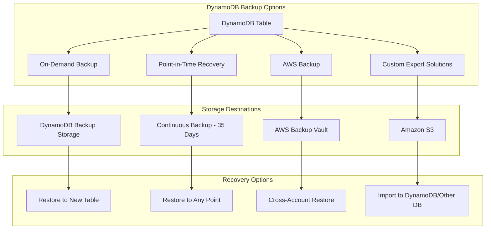
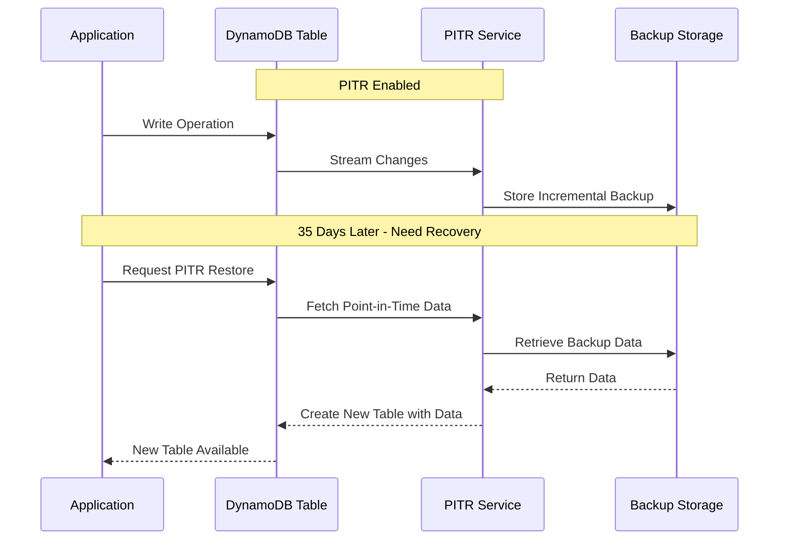
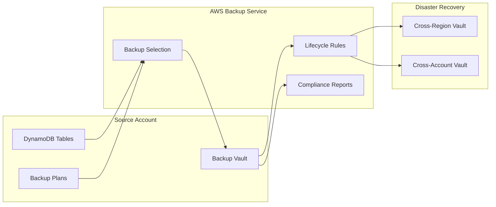
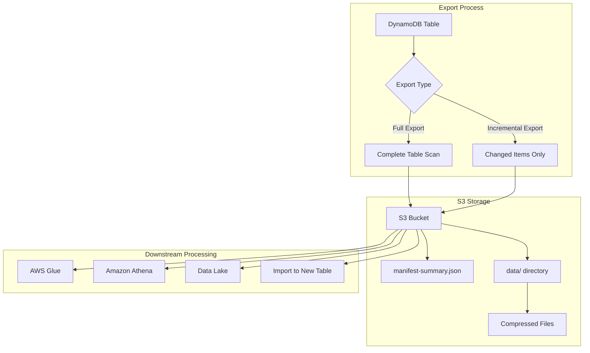
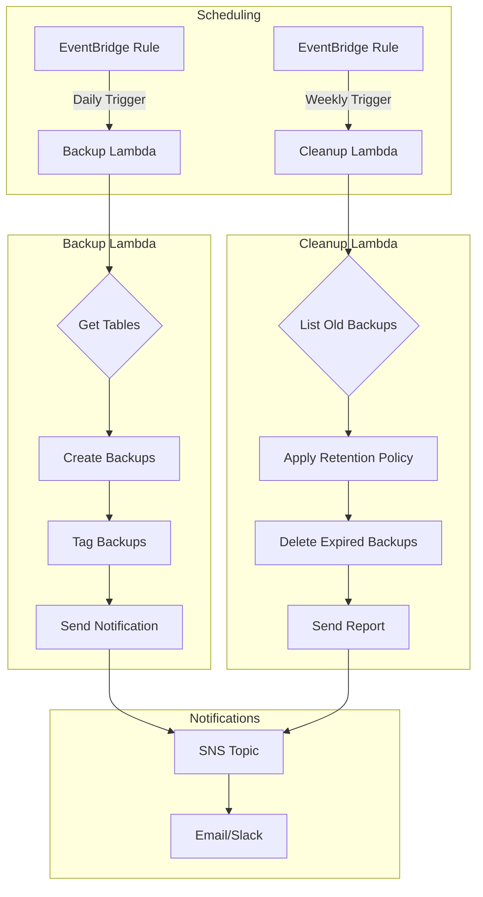
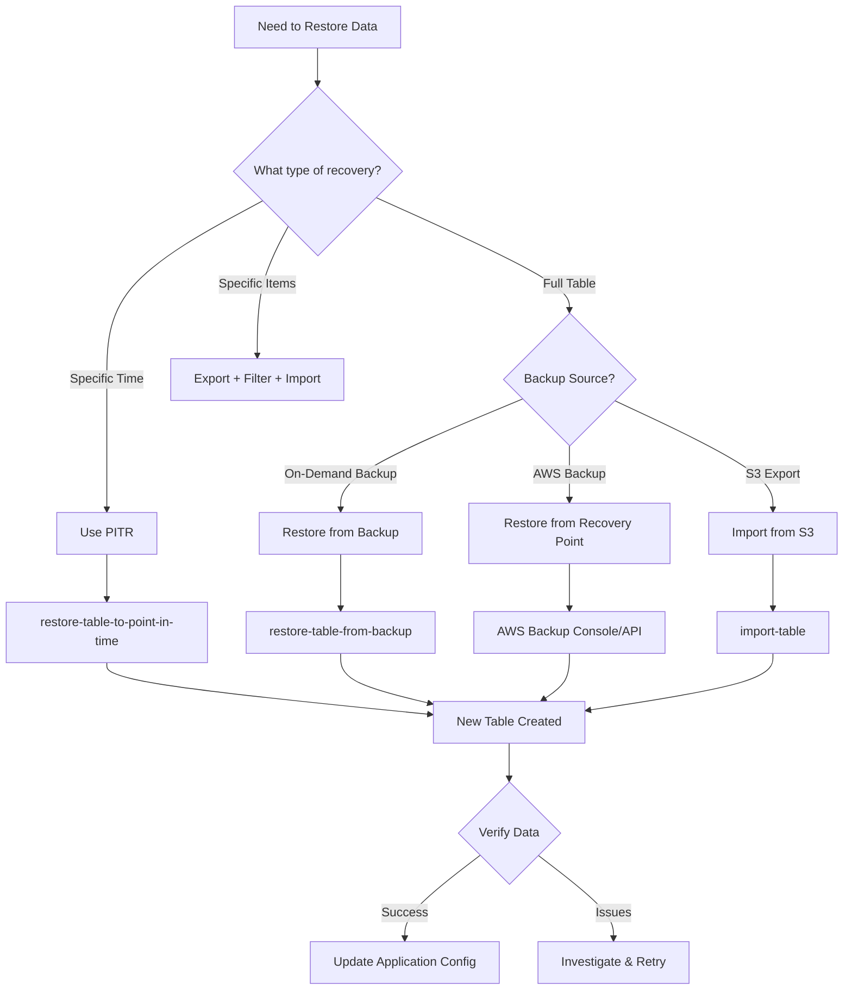

# How to Back Up DynamoDB Tables

Author: [nawazdhandala](https://www.github.com/nawazdhandala)

Tags: AWS, DynamoDB, Backup, NoSQL, Disaster Recovery, Cloud

Description: Learn multiple approaches to backing up DynamoDB tables from built-in AWS features to custom export solutions.

Amazon DynamoDB is a fully managed NoSQL database that powers some of the most demanding applications at any scale. While DynamoDB handles much of the operational overhead, protecting your data through proper backup strategies remains your responsibility. A robust backup strategy ensures business continuity, protects against accidental deletions, and helps meet compliance requirements.

In this guide, you will learn multiple approaches to backing up DynamoDB tables, from built-in AWS features to custom solutions for complex scenarios.

## Understanding DynamoDB Backup Options

DynamoDB offers several backup mechanisms, each suited for different use cases. The following diagram illustrates the backup landscape:



## On-Demand Backups

On-demand backups create full snapshots of your DynamoDB tables without consuming provisioned throughput. These backups persist until you explicitly delete them.

### Creating On-Demand Backups with AWS CLI

The following script creates an on-demand backup and waits for completion. It uses descriptive naming with timestamps for easy identification.

```bash
#!/bin/bash

# Configuration variables
TABLE_NAME="orders"
BACKUP_NAME="${TABLE_NAME}-backup-$(date +%Y%m%d-%H%M%S)"

# Create the backup
echo "Creating backup: ${BACKUP_NAME}"
BACKUP_ARN=$(aws dynamodb create-backup \
    --table-name "${TABLE_NAME}" \
    --backup-name "${BACKUP_NAME}" \
    --query 'BackupDetails.BackupArn' \
    --output text)

echo "Backup ARN: ${BACKUP_ARN}"

# Wait for backup to complete
echo "Waiting for backup to complete..."
while true; do
    STATUS=$(aws dynamodb describe-backup \
        --backup-arn "${BACKUP_ARN}" \
        --query 'BackupDescription.BackupDetails.BackupStatus' \
        --output text)

    if [ "${STATUS}" == "AVAILABLE" ]; then
        echo "Backup completed successfully!"
        break
    elif [ "${STATUS}" == "FAILED" ]; then
        echo "Backup failed!"
        exit 1
    fi

    echo "Current status: ${STATUS}. Waiting..."
    sleep 10
done

# Display backup details
aws dynamodb describe-backup \
    --backup-arn "${BACKUP_ARN}" \
    --query 'BackupDescription.BackupDetails'
```

### Creating On-Demand Backups with Python (Boto3)

Python provides more flexibility for programmatic backup management. The following class encapsulates backup operations with error handling and progress tracking.

```python
import boto3
import time
from datetime import datetime
from botocore.exceptions import ClientError

class DynamoDBBackupManager:
    """
    Manages DynamoDB backup operations including creation,
    monitoring, and listing of backups.
    """

    def __init__(self, region_name='us-east-1'):
        # Initialize the DynamoDB client with specified region
        self.dynamodb = boto3.client('dynamodb', region_name=region_name)

    def create_backup(self, table_name, backup_prefix='backup'):
        """
        Creates an on-demand backup for the specified table.
        Returns the backup ARN on success.
        """
        # Generate a unique backup name with timestamp
        timestamp = datetime.now().strftime('%Y%m%d-%H%M%S')
        backup_name = f"{backup_prefix}-{table_name}-{timestamp}"

        try:
            # Initiate the backup creation
            response = self.dynamodb.create_backup(
                TableName=table_name,
                BackupName=backup_name
            )

            backup_arn = response['BackupDetails']['BackupArn']
            print(f"Backup initiated: {backup_name}")
            print(f"Backup ARN: {backup_arn}")

            return backup_arn

        except ClientError as e:
            error_code = e.response['Error']['Code']
            if error_code == 'TableNotFoundException':
                print(f"Error: Table '{table_name}' does not exist")
            elif error_code == 'BackupInUseException':
                print(f"Error: A backup is already in progress for '{table_name}'")
            elif error_code == 'LimitExceededException':
                print("Error: Backup limit exceeded. Delete old backups first.")
            else:
                print(f"Error creating backup: {e}")
            raise

    def wait_for_backup(self, backup_arn, timeout_seconds=3600):
        """
        Waits for a backup to complete with progress updates.
        Raises TimeoutError if backup exceeds timeout.
        """
        start_time = time.time()

        while True:
            # Check if timeout exceeded
            elapsed = time.time() - start_time
            if elapsed > timeout_seconds:
                raise TimeoutError(
                    f"Backup did not complete within {timeout_seconds} seconds"
                )

            # Get current backup status
            response = self.dynamodb.describe_backup(BackupArn=backup_arn)
            status = response['BackupDescription']['BackupDetails']['BackupStatus']

            if status == 'AVAILABLE':
                # Backup completed successfully
                size_bytes = response['BackupDescription']['BackupDetails'].get(
                    'BackupSizeBytes', 0
                )
                print(f"Backup completed! Size: {size_bytes / (1024*1024):.2f} MB")
                return response['BackupDescription']

            elif status == 'FAILED':
                raise Exception("Backup failed")

            # Still in progress, wait before checking again
            print(f"Backup status: {status} (elapsed: {int(elapsed)}s)")
            time.sleep(30)

    def list_backups(self, table_name=None, limit=25):
        """
        Lists available backups, optionally filtered by table name.
        Returns a list of backup summaries.
        """
        params = {'Limit': limit}

        if table_name:
            params['TableName'] = table_name

        backups = []

        # Handle pagination for large backup lists
        while True:
            response = self.dynamodb.list_backups(**params)
            backups.extend(response.get('BackupSummaries', []))

            # Check for more results
            if 'LastEvaluatedBackupArn' in response:
                params['ExclusiveStartBackupArn'] = response['LastEvaluatedBackupArn']
            else:
                break

        return backups


# Example usage demonstrating the backup workflow
if __name__ == '__main__':
    manager = DynamoDBBackupManager(region_name='us-east-1')

    # Create a backup for the orders table
    backup_arn = manager.create_backup('orders', backup_prefix='daily')

    # Wait for completion with a 1-hour timeout
    backup_details = manager.wait_for_backup(backup_arn, timeout_seconds=3600)

    # List all backups for verification
    all_backups = manager.list_backups('orders')
    print(f"\nTotal backups for 'orders' table: {len(all_backups)}")
```

## Point-in-Time Recovery (PITR)

Point-in-Time Recovery provides continuous backups of your DynamoDB data, allowing you to restore to any second within the last 35 days. PITR protects against accidental writes or deletes.

### PITR Architecture



### Enabling and Using PITR

The following script demonstrates how to enable PITR, check its status, and perform a restore operation.

```python
import boto3
from datetime import datetime, timedelta, timezone
from botocore.exceptions import ClientError

class PITRManager:
    """
    Manages Point-in-Time Recovery operations for DynamoDB tables.
    Provides methods to enable, disable, and restore from PITR.
    """

    def __init__(self, region_name='us-east-1'):
        self.dynamodb = boto3.client('dynamodb', region_name=region_name)

    def enable_pitr(self, table_name):
        """
        Enables Point-in-Time Recovery for the specified table.
        PITR begins tracking changes immediately after enabling.
        """
        try:
            self.dynamodb.update_continuous_backups(
                TableName=table_name,
                PointInTimeRecoverySpecification={
                    'PointInTimeRecoveryEnabled': True
                }
            )
            print(f"PITR enabled for table: {table_name}")

            # Retrieve and display the earliest restore time
            status = self.get_pitr_status(table_name)
            if status.get('EarliestRestorableDateTime'):
                print(f"Earliest restore time: {status['EarliestRestorableDateTime']}")

            return True

        except ClientError as e:
            print(f"Failed to enable PITR: {e}")
            raise

    def get_pitr_status(self, table_name):
        """
        Retrieves the current PITR status including restore window.
        Returns a dictionary with PITR configuration details.
        """
        response = self.dynamodb.describe_continuous_backups(
            TableName=table_name
        )

        pitr_desc = response['ContinuousBackupsDescription']
        pitr_status = pitr_desc.get('PointInTimeRecoveryDescription', {})

        return {
            'Status': pitr_status.get('PointInTimeRecoveryStatus', 'DISABLED'),
            'EarliestRestorableDateTime': pitr_status.get('EarliestRestorableDateTime'),
            'LatestRestorableDateTime': pitr_status.get('LatestRestorableDateTime')
        }

    def restore_to_point_in_time(
        self,
        source_table_name,
        target_table_name,
        restore_datetime=None,
        use_latest=False
    ):
        """
        Restores a table to a specific point in time.
        Creates a new table with the restored data.

        Args:
            source_table_name: Name of the source table
            target_table_name: Name for the restored table
            restore_datetime: Specific datetime to restore to
            use_latest: If True, restores to the latest available point
        """
        restore_params = {
            'SourceTableName': source_table_name,
            'TargetTableName': target_table_name,
        }

        if use_latest:
            # Restore to the most recent recoverable point
            restore_params['UseLatestRestorableTime'] = True
            print(f"Restoring to latest available point...")
        elif restore_datetime:
            # Restore to a specific point in time
            restore_params['RestoreDateTime'] = restore_datetime
            print(f"Restoring to: {restore_datetime}")
        else:
            raise ValueError("Must specify restore_datetime or use_latest=True")

        try:
            response = self.dynamodb.restore_table_to_point_in_time(
                **restore_params
            )

            table_desc = response['TableDescription']
            print(f"Restore initiated!")
            print(f"Target table: {table_desc['TableName']}")
            print(f"Table status: {table_desc['TableStatus']}")

            return table_desc

        except ClientError as e:
            error_code = e.response['Error']['Code']
            if error_code == 'PointInTimeRecoveryUnavailableException':
                print("Error: PITR is not enabled for the source table")
            elif error_code == 'TableAlreadyExistsException':
                print(f"Error: Table '{target_table_name}' already exists")
            elif error_code == 'InvalidRestoreTimeException':
                print("Error: Restore time is outside the available window")
            else:
                print(f"Restore failed: {e}")
            raise


# Example: Enable PITR and perform a restore
if __name__ == '__main__':
    pitr_manager = PITRManager()

    # Enable PITR for a table
    pitr_manager.enable_pitr('orders')

    # Check the current PITR status
    status = pitr_manager.get_pitr_status('orders')
    print(f"\nPITR Status: {status['Status']}")
    print(f"Restore window: {status['EarliestRestorableDateTime']} to {status['LatestRestorableDateTime']}")

    # Restore to a point 2 hours ago
    restore_time = datetime.now(timezone.utc) - timedelta(hours=2)
    pitr_manager.restore_to_point_in_time(
        source_table_name='orders',
        target_table_name='orders-restored',
        restore_datetime=restore_time
    )
```

## AWS Backup Integration

AWS Backup provides a centralized service to manage backups across multiple AWS services, including DynamoDB. Using AWS Backup enables features like cross-account and cross-region backup, lifecycle policies, and compliance reporting.

### AWS Backup Architecture



### Setting Up AWS Backup with Terraform

Infrastructure as Code ensures consistent, repeatable backup configurations. The following Terraform module creates a comprehensive backup solution.

```hcl
# Provider configuration for AWS
terraform {
  required_providers {
    aws = {
      source  = "hashicorp/aws"
      version = "~> 5.0"
    }
  }
}

# Create a backup vault to store DynamoDB backups
# The vault uses AWS-managed encryption by default
resource "aws_backup_vault" "dynamodb_vault" {
  name = "dynamodb-backup-vault"

  # Optional: Use a custom KMS key for encryption
  # kms_key_arn = aws_kms_key.backup_key.arn

  tags = {
    Environment = "production"
    Purpose     = "DynamoDB backups"
  }
}

# Define the backup plan with schedules and lifecycle rules
resource "aws_backup_plan" "dynamodb_plan" {
  name = "dynamodb-daily-backup-plan"

  # Rule for daily backups retained for 30 days
  rule {
    rule_name         = "daily-backup"
    target_vault_name = aws_backup_vault.dynamodb_vault.name

    # Run backup daily at 3:00 AM UTC
    schedule = "cron(0 3 * * ? *)"

    # Start backup window and completion window
    start_window      = 60   # Minutes to start backup
    completion_window = 180  # Minutes to complete backup

    # Lifecycle configuration
    lifecycle {
      # Move to cold storage after 7 days
      cold_storage_after = 7
      # Delete backup after 30 days
      delete_after       = 30
    }

    # Copy backup to another region for disaster recovery
    copy_action {
      destination_vault_arn = aws_backup_vault.dr_vault.arn

      lifecycle {
        delete_after = 30
      }
    }

    # Recovery point tags for identification
    recovery_point_tags = {
      BackupType = "Daily"
      Automated  = "true"
    }
  }

  # Rule for weekly backups with longer retention
  rule {
    rule_name         = "weekly-backup"
    target_vault_name = aws_backup_vault.dynamodb_vault.name

    # Run backup every Sunday at 2:00 AM UTC
    schedule = "cron(0 2 ? * SUN *)"

    start_window      = 60
    completion_window = 240

    lifecycle {
      cold_storage_after = 30
      delete_after       = 365  # Keep weekly backups for 1 year
    }

    recovery_point_tags = {
      BackupType = "Weekly"
      Automated  = "true"
    }
  }

  tags = {
    Environment = "production"
  }
}

# IAM role for AWS Backup to access DynamoDB
resource "aws_iam_role" "backup_role" {
  name = "dynamodb-backup-role"

  assume_role_policy = jsonencode({
    Version = "2012-10-17"
    Statement = [
      {
        Action = "sts:AssumeRole"
        Effect = "Allow"
        Principal = {
          Service = "backup.amazonaws.com"
        }
      }
    ]
  })
}

# Attach the AWS managed policy for DynamoDB backup operations
resource "aws_iam_role_policy_attachment" "backup_policy" {
  policy_arn = "arn:aws:iam::aws:policy/service-role/AWSBackupServiceRolePolicyForBackup"
  role       = aws_iam_role.backup_role.name
}

# Attach restore policy for recovery operations
resource "aws_iam_role_policy_attachment" "restore_policy" {
  policy_arn = "arn:aws:iam::aws:policy/service-role/AWSBackupServiceRolePolicyForRestores"
  role       = aws_iam_role.backup_role.name
}

# Select which DynamoDB tables to backup using tags
resource "aws_backup_selection" "dynamodb_selection" {
  name         = "dynamodb-tables-selection"
  plan_id      = aws_backup_plan.dynamodb_plan.id
  iam_role_arn = aws_iam_role.backup_role.arn

  # Select all resources with the specified tag
  selection_tag {
    type  = "STRINGEQUALS"
    key   = "BackupEnabled"
    value = "true"
  }

  # Alternatively, specify explicit table ARNs
  # resources = [
  #   "arn:aws:dynamodb:us-east-1:123456789012:table/orders",
  #   "arn:aws:dynamodb:us-east-1:123456789012:table/customers"
  # ]
}

# Disaster recovery vault in another region
resource "aws_backup_vault" "dr_vault" {
  provider = aws.dr_region  # Assumes a provider alias for DR region
  name     = "dynamodb-dr-vault"

  tags = {
    Environment = "production"
    Purpose     = "Disaster Recovery"
  }
}

# Output the vault ARN for reference
output "backup_vault_arn" {
  value       = aws_backup_vault.dynamodb_vault.arn
  description = "ARN of the backup vault"
}

output "backup_plan_id" {
  value       = aws_backup_plan.dynamodb_plan.id
  description = "ID of the backup plan"
}
```

## Exporting DynamoDB to S3

For analytics, long-term archival, or migrating to other systems, exporting DynamoDB data to S3 provides maximum flexibility. DynamoDB supports native export to S3 in DynamoDB JSON or Amazon Ion formats.

### Export Architecture



### Implementing DynamoDB Export

The following Python class handles both full and incremental exports to S3 with comprehensive error handling.

```python
import boto3
import json
from datetime import datetime, timezone
from botocore.exceptions import ClientError

class DynamoDBExporter:
    """
    Handles exporting DynamoDB tables to S3 for analytics,
    archival, or migration purposes.
    """

    def __init__(self, region_name='us-east-1'):
        self.dynamodb = boto3.client('dynamodb', region_name=region_name)
        self.s3 = boto3.client('s3', region_name=region_name)

    def export_table_to_s3(
        self,
        table_arn,
        s3_bucket,
        s3_prefix='dynamodb-exports',
        export_format='DYNAMODB_JSON',
        export_type='FULL_EXPORT'
    ):
        """
        Exports a DynamoDB table to S3.

        Args:
            table_arn: ARN of the source DynamoDB table
            s3_bucket: Destination S3 bucket name
            s3_prefix: S3 key prefix for export files
            export_format: DYNAMODB_JSON or ION
            export_type: FULL_EXPORT or INCREMENTAL_EXPORT

        Returns:
            Export ARN for tracking the export job
        """
        # Generate a unique export prefix with timestamp
        timestamp = datetime.now(timezone.utc).strftime('%Y-%m-%d-%H%M%S')
        full_prefix = f"{s3_prefix}/{timestamp}"

        export_params = {
            'TableArn': table_arn,
            'S3Bucket': s3_bucket,
            'S3Prefix': full_prefix,
            'ExportFormat': export_format,
            'ExportType': export_type,
        }

        # For incremental exports, specify the time range
        if export_type == 'INCREMENTAL_EXPORT':
            # Export changes from the last 24 hours
            export_params['IncrementalExportSpecification'] = {
                'ExportFromTime': datetime.now(timezone.utc) - timedelta(days=1),
                'ExportToTime': datetime.now(timezone.utc),
                'ExportViewType': 'NEW_AND_OLD_IMAGES'  # Include both versions
            }

        try:
            response = self.dynamodb.export_table_to_point_in_time(
                **export_params
            )

            export_desc = response['ExportDescription']
            print(f"Export initiated successfully!")
            print(f"Export ARN: {export_desc['ExportArn']}")
            print(f"S3 destination: s3://{s3_bucket}/{full_prefix}/")
            print(f"Export status: {export_desc['ExportStatus']}")

            return export_desc['ExportArn']

        except ClientError as e:
            error_code = e.response['Error']['Code']
            if error_code == 'PointInTimeRecoveryUnavailableException':
                print("Error: PITR must be enabled for table exports")
            elif error_code == 'ExportConflictException':
                print("Error: An export is already in progress")
            else:
                print(f"Export failed: {e}")
            raise

    def get_export_status(self, export_arn):
        """
        Retrieves the current status of an export job.
        """
        response = self.dynamodb.describe_export(ExportArn=export_arn)
        export_desc = response['ExportDescription']

        return {
            'status': export_desc['ExportStatus'],
            'start_time': export_desc.get('StartTime'),
            'end_time': export_desc.get('EndTime'),
            'exported_items': export_desc.get('ExportedItemCount', 0),
            'exported_size_bytes': export_desc.get('ExportSizeBytes', 0),
            's3_bucket': export_desc.get('S3Bucket'),
            's3_prefix': export_desc.get('S3Prefix'),
            'failure_code': export_desc.get('FailureCode'),
            'failure_message': export_desc.get('FailureMessage')
        }

    def wait_for_export(self, export_arn, timeout_seconds=7200):
        """
        Waits for an export to complete and returns the final status.
        """
        import time
        start_time = time.time()

        while True:
            elapsed = time.time() - start_time
            if elapsed > timeout_seconds:
                raise TimeoutError(
                    f"Export did not complete within {timeout_seconds} seconds"
                )

            status = self.get_export_status(export_arn)

            if status['status'] == 'COMPLETED':
                print(f"\nExport completed successfully!")
                print(f"Items exported: {status['exported_items']:,}")
                print(f"Size: {status['exported_size_bytes'] / (1024*1024):.2f} MB")
                return status

            elif status['status'] == 'FAILED':
                raise Exception(
                    f"Export failed: {status['failure_code']} - {status['failure_message']}"
                )

            print(f"Export status: {status['status']} (elapsed: {int(elapsed)}s)")
            time.sleep(60)


# Example: Full table export to S3
if __name__ == '__main__':
    exporter = DynamoDBExporter()

    # Export the orders table to S3
    export_arn = exporter.export_table_to_s3(
        table_arn='arn:aws:dynamodb:us-east-1:123456789012:table/orders',
        s3_bucket='my-dynamodb-exports',
        s3_prefix='orders',
        export_format='DYNAMODB_JSON'
    )

    # Wait for completion
    final_status = exporter.wait_for_export(export_arn)
    print(f"\nExport files available at: s3://{final_status['s3_bucket']}/{final_status['s3_prefix']}/")
```

## Automated Backup Solution with Lambda

For complex backup requirements, a Lambda-based solution provides flexibility for custom scheduling, notifications, and cleanup policies.

### Lambda Backup Architecture



### Lambda Function for Automated Backups

The following Lambda function creates backups for all tables matching specific criteria and handles retention automatically.

```python
import boto3
import json
import os
from datetime import datetime, timezone, timedelta
from botocore.exceptions import ClientError

# Initialize AWS clients
dynamodb = boto3.client('dynamodb')
sns = boto3.client('sns')

# Configuration from environment variables
BACKUP_PREFIX = os.environ.get('BACKUP_PREFIX', 'automated')
RETENTION_DAYS = int(os.environ.get('RETENTION_DAYS', '30'))
SNS_TOPIC_ARN = os.environ.get('SNS_TOPIC_ARN', '')
TABLE_TAG_KEY = os.environ.get('TABLE_TAG_KEY', 'BackupEnabled')
TABLE_TAG_VALUE = os.environ.get('TABLE_TAG_VALUE', 'true')


def lambda_handler(event, context):
    """
    Main Lambda handler that orchestrates the backup process.
    Creates backups for tagged tables and cleans up old backups.
    """
    results = {
        'tables_processed': 0,
        'backups_created': [],
        'backups_deleted': [],
        'errors': []
    }

    try:
        # Get all tables that should be backed up
        tables = get_backup_eligible_tables()
        results['tables_processed'] = len(tables)

        # Create backups for each table
        for table_name in tables:
            try:
                backup_arn = create_backup(table_name)
                results['backups_created'].append({
                    'table': table_name,
                    'backup_arn': backup_arn
                })
            except Exception as e:
                results['errors'].append({
                    'table': table_name,
                    'operation': 'create_backup',
                    'error': str(e)
                })

        # Clean up old backups
        deleted = cleanup_old_backups()
        results['backups_deleted'] = deleted

        # Send notification
        send_notification(results)

        return {
            'statusCode': 200,
            'body': json.dumps(results, default=str)
        }

    except Exception as e:
        error_result = {
            'statusCode': 500,
            'error': str(e)
        }
        send_notification(error_result, is_error=True)
        raise


def get_backup_eligible_tables():
    """
    Returns a list of table names that have the backup tag enabled.
    Handles pagination for accounts with many tables.
    """
    eligible_tables = []
    paginator = dynamodb.get_paginator('list_tables')

    for page in paginator.paginate():
        for table_name in page['TableNames']:
            # Check if the table has the backup tag
            try:
                response = dynamodb.describe_table(TableName=table_name)
                table_arn = response['Table']['TableArn']

                # Get tags for the table
                tags_response = dynamodb.list_tags_of_resource(
                    ResourceArn=table_arn
                )

                # Check for the backup enabled tag
                for tag in tags_response.get('Tags', []):
                    if tag['Key'] == TABLE_TAG_KEY and tag['Value'] == TABLE_TAG_VALUE:
                        eligible_tables.append(table_name)
                        break

            except ClientError as e:
                print(f"Error checking table {table_name}: {e}")
                continue

    return eligible_tables


def create_backup(table_name):
    """
    Creates a backup for the specified table with standard naming convention.
    Returns the backup ARN.
    """
    timestamp = datetime.now(timezone.utc).strftime('%Y%m%d-%H%M%S')
    backup_name = f"{BACKUP_PREFIX}-{table_name}-{timestamp}"

    response = dynamodb.create_backup(
        TableName=table_name,
        BackupName=backup_name
    )

    backup_arn = response['BackupDetails']['BackupArn']
    print(f"Created backup for {table_name}: {backup_name}")

    return backup_arn


def cleanup_old_backups():
    """
    Deletes backups older than the retention period.
    Only deletes backups created by this automation (matching prefix).
    """
    deleted_backups = []
    cutoff_date = datetime.now(timezone.utc) - timedelta(days=RETENTION_DAYS)

    # List all backups created by this automation
    paginator = dynamodb.get_paginator('list_backups')

    for page in paginator.paginate(BackupType='USER'):
        for backup in page.get('BackupSummaries', []):
            backup_name = backup['BackupName']
            backup_arn = backup['BackupArn']
            creation_date = backup['BackupCreationDateTime']

            # Check if backup matches our prefix and is old enough to delete
            if backup_name.startswith(BACKUP_PREFIX):
                if creation_date < cutoff_date:
                    try:
                        dynamodb.delete_backup(BackupArn=backup_arn)
                        deleted_backups.append({
                            'name': backup_name,
                            'arn': backup_arn,
                            'age_days': (datetime.now(timezone.utc) - creation_date).days
                        })
                        print(f"Deleted old backup: {backup_name}")
                    except ClientError as e:
                        print(f"Error deleting backup {backup_name}: {e}")

    return deleted_backups


def send_notification(results, is_error=False):
    """
    Sends a notification to SNS with the backup results.
    """
    if not SNS_TOPIC_ARN:
        return

    timestamp = datetime.now(timezone.utc).isoformat()

    if is_error:
        subject = "DynamoDB Backup FAILED"
        message = f"Backup job failed at {timestamp}\n\nError: {results.get('error')}"
    else:
        subject = "DynamoDB Backup Completed"
        message = f"""DynamoDB Backup Report - {timestamp}

Tables Processed: {results['tables_processed']}
Backups Created: {len(results['backups_created'])}
Backups Deleted: {len(results['backups_deleted'])}
Errors: {len(results['errors'])}

Created Backups:
{json.dumps(results['backups_created'], indent=2, default=str)}

Deleted Backups:
{json.dumps(results['backups_deleted'], indent=2, default=str)}

Errors:
{json.dumps(results['errors'], indent=2, default=str)}
"""

    try:
        sns.publish(
            TopicArn=SNS_TOPIC_ARN,
            Subject=subject,
            Message=message
        )
    except ClientError as e:
        print(f"Failed to send notification: {e}")
```

### CloudFormation Template for Lambda Deployment

Deploy the Lambda backup solution using CloudFormation.

```yaml
AWSTemplateFormatVersion: '2010-09-09'
Description: Automated DynamoDB Backup Solution

Parameters:
  BackupPrefix:
    Type: String
    Default: automated
    Description: Prefix for backup names

  RetentionDays:
    Type: Number
    Default: 30
    Description: Number of days to retain backups

  NotificationEmail:
    Type: String
    Description: Email address for backup notifications

Resources:
  # SNS Topic for notifications
  BackupNotificationTopic:
    Type: AWS::SNS::Topic
    Properties:
      TopicName: dynamodb-backup-notifications
      Subscription:
        - Protocol: email
          Endpoint: !Ref NotificationEmail

  # IAM Role for Lambda function
  BackupLambdaRole:
    Type: AWS::IAM::Role
    Properties:
      RoleName: dynamodb-backup-lambda-role
      AssumeRolePolicyDocument:
        Version: '2012-10-17'
        Statement:
          - Effect: Allow
            Principal:
              Service: lambda.amazonaws.com
            Action: sts:AssumeRole
      ManagedPolicyArns:
        - arn:aws:iam::aws:policy/service-role/AWSLambdaBasicExecutionRole
      Policies:
        - PolicyName: DynamoDBBackupPolicy
          PolicyDocument:
            Version: '2012-10-17'
            Statement:
              - Effect: Allow
                Action:
                  - dynamodb:ListTables
                  - dynamodb:DescribeTable
                  - dynamodb:ListTagsOfResource
                  - dynamodb:CreateBackup
                  - dynamodb:ListBackups
                  - dynamodb:DeleteBackup
                Resource: '*'
              - Effect: Allow
                Action:
                  - sns:Publish
                Resource: !Ref BackupNotificationTopic

  # Lambda Function
  BackupFunction:
    Type: AWS::Lambda::Function
    Properties:
      FunctionName: dynamodb-automated-backup
      Runtime: python3.11
      Handler: index.lambda_handler
      Role: !GetAtt BackupLambdaRole.Arn
      Timeout: 300
      MemorySize: 256
      Environment:
        Variables:
          BACKUP_PREFIX: !Ref BackupPrefix
          RETENTION_DAYS: !Ref RetentionDays
          SNS_TOPIC_ARN: !Ref BackupNotificationTopic
          TABLE_TAG_KEY: BackupEnabled
          TABLE_TAG_VALUE: 'true'
      Code:
        ZipFile: |
          # Paste the Lambda function code here
          # Or use an S3 bucket reference for larger functions

  # EventBridge Rule for daily backups
  DailyBackupRule:
    Type: AWS::Events::Rule
    Properties:
      Name: dynamodb-daily-backup
      Description: Triggers daily DynamoDB backups at 3 AM UTC
      ScheduleExpression: cron(0 3 * * ? *)
      State: ENABLED
      Targets:
        - Id: BackupLambdaTarget
          Arn: !GetAtt BackupFunction.Arn

  # Permission for EventBridge to invoke Lambda
  BackupLambdaPermission:
    Type: AWS::Lambda::Permission
    Properties:
      FunctionName: !Ref BackupFunction
      Action: lambda:InvokeFunction
      Principal: events.amazonaws.com
      SourceArn: !GetAtt DailyBackupRule.Arn

Outputs:
  LambdaFunctionArn:
    Description: ARN of the backup Lambda function
    Value: !GetAtt BackupFunction.Arn

  SNSTopicArn:
    Description: ARN of the notification SNS topic
    Value: !Ref BackupNotificationTopic
```

## Restoring from Backups

Understanding restoration is as important as creating backups. Different backup types have different restoration procedures.

### Restoration Decision Flow



### Comprehensive Restoration Script

The following script provides a complete restoration workflow with validation.

```python
import boto3
import time
from datetime import datetime, timezone
from botocore.exceptions import ClientError

class DynamoDBRestoreManager:
    """
    Manages DynamoDB table restoration from various backup sources.
    Includes validation and monitoring capabilities.
    """

    def __init__(self, region_name='us-east-1'):
        self.dynamodb = boto3.client('dynamodb', region_name=region_name)

    def restore_from_backup(self, backup_arn, target_table_name, **kwargs):
        """
        Restores a table from an on-demand backup.

        Args:
            backup_arn: ARN of the backup to restore from
            target_table_name: Name for the restored table
            **kwargs: Additional restore options (encryption, tags, etc.)

        Returns:
            Table description of the restored table
        """
        restore_params = {
            'TargetTableName': target_table_name,
            'BackupArn': backup_arn,
        }

        # Optional: Specify billing mode for restored table
        if 'billing_mode' in kwargs:
            restore_params['BillingModeOverride'] = kwargs['billing_mode']

        # Optional: Override provisioned throughput
        if 'provisioned_throughput' in kwargs:
            restore_params['ProvisionedThroughputOverride'] = kwargs['provisioned_throughput']

        # Optional: Override global secondary indexes
        if 'gsi_overrides' in kwargs:
            restore_params['GlobalSecondaryIndexOverride'] = kwargs['gsi_overrides']

        # Optional: Override local secondary indexes
        if 'lsi_overrides' in kwargs:
            restore_params['LocalSecondaryIndexOverride'] = kwargs['lsi_overrides']

        # Optional: Server-side encryption settings
        if 'sse_specification' in kwargs:
            restore_params['SSESpecificationOverride'] = kwargs['sse_specification']

        try:
            print(f"Initiating restore to table: {target_table_name}")
            response = self.dynamodb.restore_table_from_backup(**restore_params)

            table_desc = response['TableDescription']
            print(f"Restore initiated successfully!")
            print(f"Table ARN: {table_desc['TableArn']}")
            print(f"Initial status: {table_desc['TableStatus']}")

            return table_desc

        except ClientError as e:
            error_code = e.response['Error']['Code']
            if error_code == 'TableAlreadyExistsException':
                print(f"Error: Table '{target_table_name}' already exists")
            elif error_code == 'BackupNotFoundException':
                print(f"Error: Backup not found: {backup_arn}")
            elif error_code == 'BackupInUseException':
                print("Error: Backup is being used by another restore operation")
            else:
                print(f"Restore failed: {e}")
            raise

    def wait_for_table_active(self, table_name, timeout_seconds=1800):
        """
        Waits for a table to become active after restoration.
        """
        start_time = time.time()

        while True:
            elapsed = time.time() - start_time
            if elapsed > timeout_seconds:
                raise TimeoutError(
                    f"Table did not become active within {timeout_seconds} seconds"
                )

            try:
                response = self.dynamodb.describe_table(TableName=table_name)
                status = response['Table']['TableStatus']

                if status == 'ACTIVE':
                    print(f"\nTable '{table_name}' is now ACTIVE")
                    return response['Table']

                print(f"Table status: {status} (elapsed: {int(elapsed)}s)")
                time.sleep(30)

            except ClientError as e:
                if e.response['Error']['Code'] == 'ResourceNotFoundException':
                    print("Waiting for table to be created...")
                    time.sleep(30)
                else:
                    raise

    def validate_restore(self, original_table, restored_table, sample_size=100):
        """
        Validates restored data by comparing item counts and sampling.
        """
        print(f"\nValidating restore...")

        # Compare item counts
        original_count = self._get_item_count(original_table)
        restored_count = self._get_item_count(restored_table)

        print(f"Original table item count: {original_count:,}")
        print(f"Restored table item count: {restored_count:,}")

        if original_count != restored_count:
            print("WARNING: Item counts do not match!")
            return False

        # Sample validation - scan a few items and compare
        print(f"Sampling {sample_size} items for validation...")

        # Get sample from original table
        original_sample = self.dynamodb.scan(
            TableName=original_table,
            Limit=sample_size
        )['Items']

        # Verify each item exists in restored table
        table_desc = self.dynamodb.describe_table(TableName=original_table)
        key_schema = table_desc['Table']['KeySchema']
        key_names = [k['AttributeName'] for k in key_schema]

        mismatches = 0
        for item in original_sample:
            key = {k: item[k] for k in key_names}

            try:
                restored_item = self.dynamodb.get_item(
                    TableName=restored_table,
                    Key=key
                ).get('Item')

                if restored_item != item:
                    mismatches += 1

            except ClientError:
                mismatches += 1

        if mismatches > 0:
            print(f"WARNING: Found {mismatches} mismatched items in sample")
            return False

        print("Validation successful - all sampled items match")
        return True

    def _get_item_count(self, table_name):
        """
        Returns the approximate item count for a table.
        """
        response = self.dynamodb.describe_table(TableName=table_name)
        return response['Table']['ItemCount']


# Example: Complete restore workflow
if __name__ == '__main__':
    restore_manager = DynamoDBRestoreManager()

    # List available backups
    backups = boto3.client('dynamodb').list_backups(
        TableName='orders',
        BackupType='USER',
        Limit=5
    )

    print("Available backups:")
    for backup in backups['BackupSummaries']:
        print(f"  - {backup['BackupName']} ({backup['BackupCreationDateTime']})")

    # Select the most recent backup
    latest_backup = backups['BackupSummaries'][0]
    backup_arn = latest_backup['BackupArn']

    # Restore with custom settings
    restored_table = restore_manager.restore_from_backup(
        backup_arn=backup_arn,
        target_table_name='orders-restored',
        billing_mode='PAY_PER_REQUEST'  # Use on-demand pricing for restored table
    )

    # Wait for table to become active
    restore_manager.wait_for_table_active('orders-restored')

    # Validate the restore
    is_valid = restore_manager.validate_restore('orders', 'orders-restored')

    if is_valid:
        print("\nRestore completed and validated successfully!")
    else:
        print("\nRestore completed but validation found issues. Please investigate.")
```

## Best Practices and Recommendations

Following these best practices ensures your DynamoDB backup strategy remains effective and reliable.

### Backup Strategy Comparison

| Feature | On-Demand Backup | PITR | AWS Backup | S3 Export |
|---------|------------------|------|------------|-----------|
| Recovery Granularity | Full table | Second-level | Full table | Full table |
| Retention Period | Unlimited | 35 days | Configurable | Unlimited |
| Cross-Region | Manual copy | No | Automatic | Manual copy |
| Cross-Account | No | No | Yes | Yes |
| Cost | Per GB stored | Per GB stored | Per GB stored | Export cost + S3 |
| Restore Time | Minutes to hours | Minutes to hours | Minutes to hours | Hours |
| Custom Processing | No | No | No | Yes |

### Key Recommendations

1. **Enable PITR for all production tables** - Point-in-Time Recovery provides protection against accidental data modifications with minimal overhead.

2. **Implement multiple backup strategies** - Combine PITR for short-term recovery with on-demand or AWS Backup for long-term retention.

3. **Test restores regularly** - Schedule monthly restore tests to validate your backup integrity and familiarize your team with the process.

4. **Monitor backup costs** - Backup storage can add up quickly. Implement lifecycle policies to move old backups to cold storage or delete them.

5. **Document restoration procedures** - Create runbooks with step-by-step instructions for different recovery scenarios.

6. **Use tags consistently** - Apply backup-related tags to tables for automated backup selection and cost allocation.

7. **Set up alerting** - Configure CloudWatch alarms for backup failures and SNS notifications for backup completion.

## Conclusion

A comprehensive DynamoDB backup strategy combines multiple approaches to protect your data. On-demand backups provide flexibility for ad-hoc snapshots, PITR offers continuous protection for the past 35 days, AWS Backup centralizes management across accounts and regions, and S3 exports enable analytics and long-term archival.

Start by enabling PITR on your critical tables, then implement automated backups using AWS Backup or Lambda-based solutions. Regular testing of your restoration procedures ensures you can recover quickly when needed. By following the patterns and code examples in this guide, you can build a robust backup solution that meets your organization's recovery objectives.
