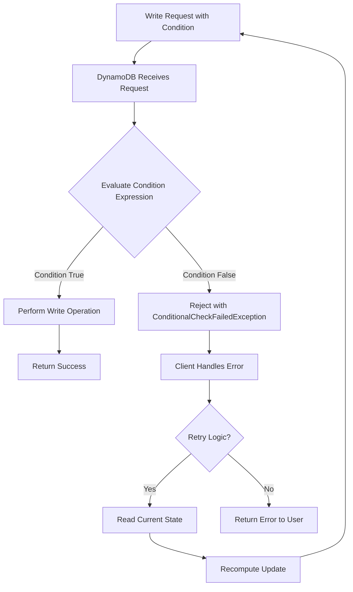
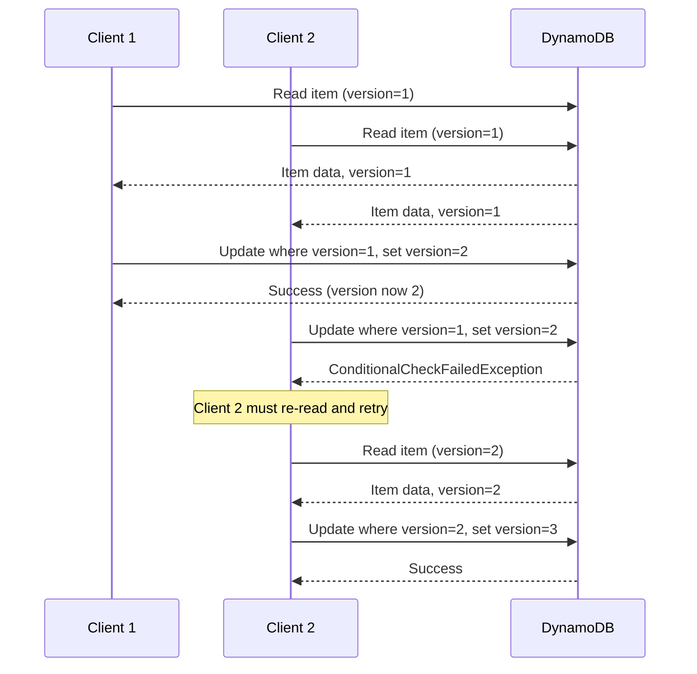
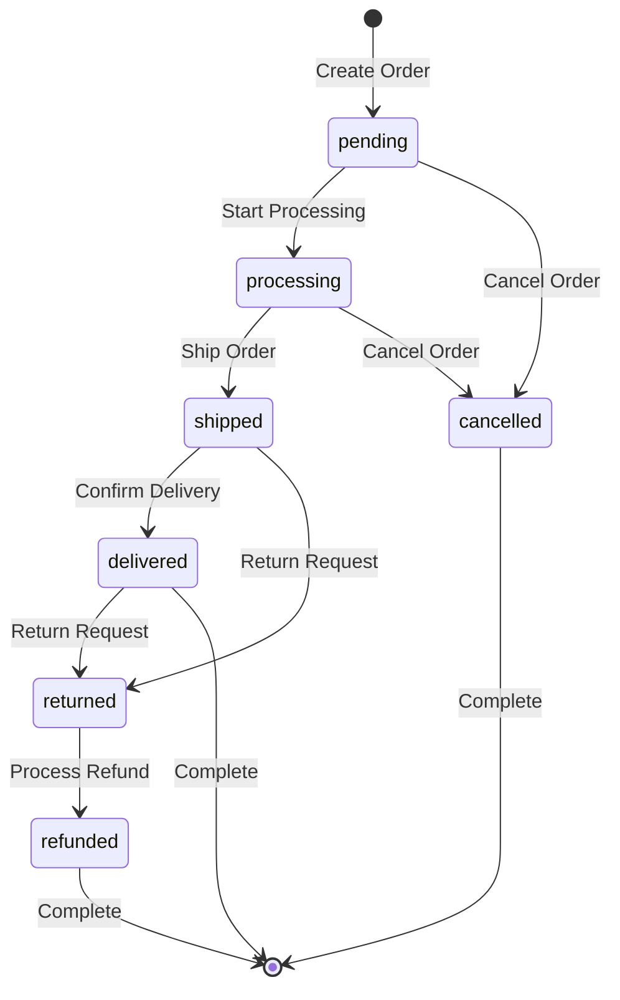
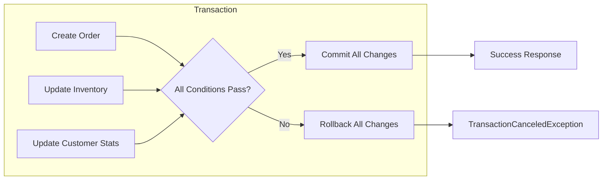
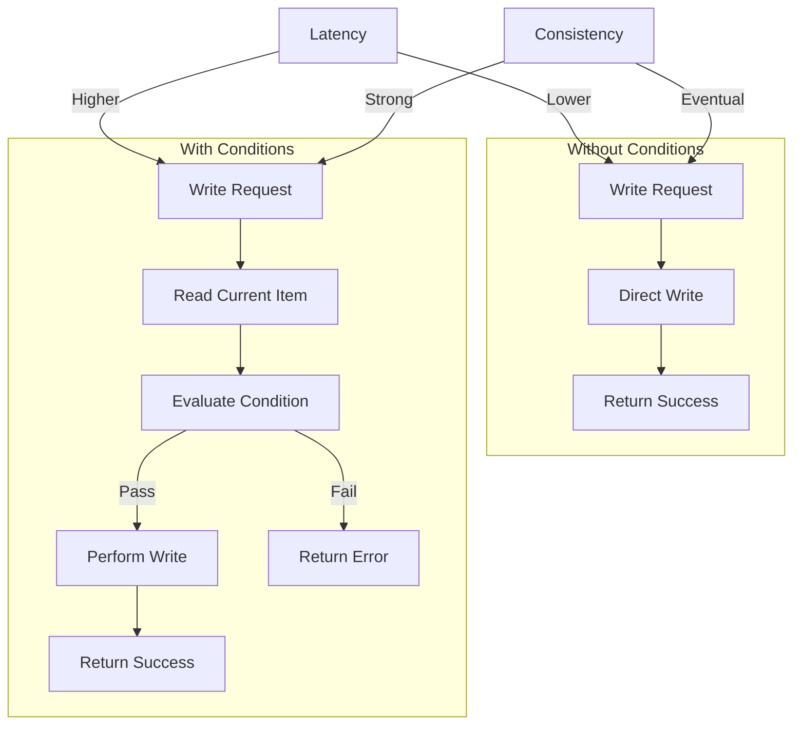

# How to Implement Conditional Writes in DynamoDB

Author: [nawazdhandala](https://www.github.com/nawazdhandala)

Tags: DynamoDB, AWS, NoSQL, Database, Concurrency, Conditional Writes

Description: Learn how to implement conditional writes in DynamoDB to prevent data races and ensure data integrity. Covers condition expressions, optimistic locking, atomic counters, and transaction patterns with practical code examples.

---

Conditional writes in DynamoDB allow you to perform write operations only when specific conditions are met. Without conditional writes, concurrent updates can overwrite each other, leading to lost data and inconsistent state. By adding conditions to your write operations, you can prevent race conditions and build robust applications that handle concurrent access correctly.

## Understanding Conditional Writes

DynamoDB evaluates your condition expression before performing the write operation. If the condition evaluates to true, the write proceeds. If the condition evaluates to false, DynamoDB rejects the write with a ConditionalCheckFailedException.

The following diagram illustrates the conditional write flow.



## Condition Expression Syntax

DynamoDB provides several comparison operators and functions for building condition expressions. Understanding these building blocks is essential for writing effective conditions.

### Comparison Operators

The following table summarizes the available comparison operators.

| Operator | Description | Example |
|----------|-------------|---------|
| = | Equal to | `status = :pending` |
| <> | Not equal to | `status <> :deleted` |
| < | Less than | `quantity < :max` |
| <= | Less than or equal | `price <= :budget` |
| > | Greater than | `version > :currentVersion` |
| >= | Greater than or equal | `timestamp >= :startTime` |
| BETWEEN | Range check | `price BETWEEN :min AND :max` |

### Condition Functions

DynamoDB provides several functions for more complex conditions.

The following code demonstrates the main condition functions.

```javascript
// attribute_exists - Check if an attribute is present
// Useful for ensuring you're updating an existing item, not creating a new one
const updateExisting = {
    TableName: 'Orders',
    Key: { orderId: { S: 'order-123' } },
    UpdateExpression: 'SET status = :newStatus',
    ConditionExpression: 'attribute_exists(orderId)',
    ExpressionAttributeValues: {
        ':newStatus': { S: 'processing' }
    }
};

// attribute_not_exists - Check if an attribute is absent
// Useful for preventing duplicate creation
const createNew = {
    TableName: 'Orders',
    Key: { orderId: { S: 'order-123' } },
    Item: {
        orderId: { S: 'order-123' },
        status: { S: 'pending' },
        createdAt: { S: new Date().toISOString() }
    },
    ConditionExpression: 'attribute_not_exists(orderId)'
};

// attribute_type - Check the data type of an attribute
// Useful for validation before updates
const checkType = {
    ConditionExpression: 'attribute_type(quantity, :type)',
    ExpressionAttributeValues: {
        ':type': { S: 'N' }  // N = Number
    }
};

// begins_with - Check if a string starts with a substring
// Useful for hierarchical data patterns
const checkPrefix = {
    ConditionExpression: 'begins_with(category, :prefix)',
    ExpressionAttributeValues: {
        ':prefix': { S: 'electronics/' }
    }
};

// contains - Check if a string contains a substring or list contains an element
// Useful for tag or permission checks
const checkContains = {
    ConditionExpression: 'contains(tags, :tag)',
    ExpressionAttributeValues: {
        ':tag': { S: 'featured' }
    }
};

// size - Get the size of a string, list, map, or binary attribute
// Useful for enforcing limits
const checkSize = {
    ConditionExpression: 'size(items) < :maxItems',
    ExpressionAttributeValues: {
        ':maxItems': { N: '100' }
    }
};
```

### Logical Operators

Combine multiple conditions using AND, OR, and NOT operators.

The following code shows how to build complex conditions.

```javascript
// AND - All conditions must be true
const andCondition = {
    ConditionExpression: 'status = :pending AND attribute_exists(customerId)',
    ExpressionAttributeValues: {
        ':pending': { S: 'pending' }
    }
};

// OR - At least one condition must be true
const orCondition = {
    ConditionExpression: 'status = :pending OR status = :processing',
    ExpressionAttributeValues: {
        ':pending': { S: 'pending' },
        ':processing': { S: 'processing' }
    }
};

// NOT - Negates a condition
const notCondition = {
    ConditionExpression: 'NOT status = :deleted',
    ExpressionAttributeValues: {
        ':deleted': { S: 'deleted' }
    }
};

// Combined complex condition
// Only allow update if: item exists, status is pending or processing, and not locked
const complexCondition = {
    ConditionExpression:
        'attribute_exists(orderId) AND (status = :pending OR status = :processing) AND NOT isLocked = :true',
    ExpressionAttributeValues: {
        ':pending': { S: 'pending' },
        ':processing': { S: 'processing' },
        ':true': { BOOL: true }
    }
};
```

## Implementing Optimistic Locking

Optimistic locking is a concurrency control pattern that uses version numbers to detect conflicts. Each item has a version attribute that increments with every update. Updates only succeed if the version matches, preventing lost updates.

The following diagram shows the optimistic locking flow.



The following code implements optimistic locking in JavaScript.

```javascript
const { DynamoDBClient } = require('@aws-sdk/client-dynamodb');
const {
    DynamoDBDocumentClient,
    GetCommand,
    UpdateCommand
} = require('@aws-sdk/lib-dynamodb');

const client = new DynamoDBClient({ region: 'us-east-1' });
const docClient = DynamoDBDocumentClient.from(client);

// OptimisticLock class encapsulates the retry logic for version-based updates
class OptimisticLock {
    constructor(tableName, maxRetries = 3) {
        this.tableName = tableName;
        this.maxRetries = maxRetries;
    }

    // Read an item and return it with its current version
    async read(key) {
        const command = new GetCommand({
            TableName: this.tableName,
            Key: key
        });

        const response = await docClient.send(command);
        return response.Item;
    }

    // Update an item with optimistic locking
    // The updateFn receives the current item and returns the update expression details
    async update(key, updateFn) {
        let retries = 0;

        while (retries < this.maxRetries) {
            try {
                // Read current state
                const currentItem = await this.read(key);

                if (!currentItem) {
                    throw new Error('Item not found');
                }

                const currentVersion = currentItem.version || 0;

                // Get update details from the provided function
                const { updateExpression, expressionAttributeValues, expressionAttributeNames } =
                    updateFn(currentItem);

                // Add version increment to update expression
                const fullUpdateExpression = `${updateExpression}, version = :newVersion`;
                const fullExpressionAttributeValues = {
                    ...expressionAttributeValues,
                    ':currentVersion': currentVersion,
                    ':newVersion': currentVersion + 1
                };

                // Perform conditional update
                const command = new UpdateCommand({
                    TableName: this.tableName,
                    Key: key,
                    UpdateExpression: fullUpdateExpression,
                    ConditionExpression: 'version = :currentVersion',
                    ExpressionAttributeValues: fullExpressionAttributeValues,
                    ExpressionAttributeNames: expressionAttributeNames,
                    ReturnValues: 'ALL_NEW'
                });

                const response = await docClient.send(command);
                return response.Attributes;

            } catch (error) {
                if (error.name === 'ConditionalCheckFailedException') {
                    retries++;
                    if (retries >= this.maxRetries) {
                        throw new Error(
                            `Failed to update after ${this.maxRetries} retries due to concurrent modifications`
                        );
                    }
                    // Exponential backoff before retry
                    await this.sleep(Math.pow(2, retries) * 100);
                } else {
                    throw error;
                }
            }
        }
    }

    sleep(ms) {
        return new Promise(resolve => setTimeout(resolve, ms));
    }
}

// Usage example: Updating an order status with optimistic locking
async function updateOrderStatus(orderId, newStatus) {
    const lock = new OptimisticLock('Orders');

    try {
        const updatedOrder = await lock.update(
            { orderId: orderId },
            (currentItem) => ({
                updateExpression: 'SET #status = :newStatus, updatedAt = :now',
                expressionAttributeValues: {
                    ':newStatus': newStatus,
                    ':now': new Date().toISOString()
                },
                expressionAttributeNames: {
                    '#status': 'status'  // status is a reserved word
                }
            })
        );

        console.log('Order updated successfully:', updatedOrder);
        return updatedOrder;
    } catch (error) {
        console.error('Failed to update order:', error.message);
        throw error;
    }
}

// Example invocation
updateOrderStatus('order-123', 'shipped');
```

## Preventing Duplicate Writes

A common requirement is ensuring an item is created only once. Without conditions, multiple requests could create duplicate entries or overwrite existing data.

The following code demonstrates idempotent item creation.

```javascript
const { DynamoDBDocumentClient, PutCommand } = require('@aws-sdk/lib-dynamodb');

// Create an item only if it does not already exist
async function createItemOnce(docClient, tableName, item, idAttribute) {
    const command = new PutCommand({
        TableName: tableName,
        Item: item,
        // Only succeed if the primary key does not exist
        ConditionExpression: `attribute_not_exists(${idAttribute})`,
        ReturnValues: 'NONE'
    });

    try {
        await docClient.send(command);
        return { created: true, item: item };
    } catch (error) {
        if (error.name === 'ConditionalCheckFailedException') {
            // Item already exists, which is fine for idempotent operations
            return { created: false, message: 'Item already exists' };
        }
        throw error;
    }
}

// Example: Creating an order with idempotency
async function createOrder(docClient, orderData) {
    const order = {
        orderId: orderData.orderId,
        customerId: orderData.customerId,
        items: orderData.items,
        totalAmount: orderData.totalAmount,
        status: 'pending',
        version: 1,
        createdAt: new Date().toISOString()
    };

    const result = await createItemOnce(docClient, 'Orders', order, 'orderId');

    if (result.created) {
        console.log('New order created:', order.orderId);
    } else {
        console.log('Order already exists, skipping creation');
    }

    return result;
}
```

## Implementing Atomic Counters with Conditions

Atomic counters allow incrementing values without reading first. Adding conditions makes these operations even more powerful.

The following code shows conditional atomic counter operations.

```javascript
const { UpdateCommand } = require('@aws-sdk/lib-dynamodb');

// Decrement inventory only if sufficient stock exists
async function decrementInventory(docClient, productId, quantity) {
    const command = new UpdateCommand({
        TableName: 'Products',
        Key: { productId: productId },
        // Atomically decrease the quantity
        UpdateExpression: 'SET inventory = inventory - :qty, lastUpdated = :now',
        // Only proceed if enough inventory exists
        ConditionExpression: 'inventory >= :qty',
        ExpressionAttributeValues: {
            ':qty': quantity,
            ':now': new Date().toISOString()
        },
        ReturnValues: 'ALL_NEW'
    });

    try {
        const response = await docClient.send(command);
        console.log('Inventory updated. New count:', response.Attributes.inventory);
        return { success: true, newInventory: response.Attributes.inventory };
    } catch (error) {
        if (error.name === 'ConditionalCheckFailedException') {
            return {
                success: false,
                error: 'Insufficient inventory',
                requestedQuantity: quantity
            };
        }
        throw error;
    }
}

// Increment a counter with an upper limit
async function incrementWithLimit(docClient, tableName, key, counterAttr, limit) {
    const command = new UpdateCommand({
        TableName: tableName,
        Key: key,
        UpdateExpression: `SET ${counterAttr} = ${counterAttr} + :one`,
        // Only increment if below the limit
        ConditionExpression: `${counterAttr} < :limit`,
        ExpressionAttributeValues: {
            ':one': 1,
            ':limit': limit
        },
        ReturnValues: 'ALL_NEW'
    });

    try {
        const response = await docClient.send(command);
        return {
            success: true,
            newValue: response.Attributes[counterAttr]
        };
    } catch (error) {
        if (error.name === 'ConditionalCheckFailedException') {
            return {
                success: false,
                error: `Counter has reached the limit of ${limit}`
            };
        }
        throw error;
    }
}

// Example: Rate limiting with conditional counters
async function checkRateLimit(docClient, userId, maxRequestsPerMinute) {
    const minuteKey = new Date().toISOString().slice(0, 16); // YYYY-MM-DDTHH:MM

    const result = await incrementWithLimit(
        docClient,
        'RateLimits',
        {
            userId: userId,
            timeWindow: minuteKey
        },
        'requestCount',
        maxRequestsPerMinute
    );

    if (!result.success) {
        return { allowed: false, reason: 'Rate limit exceeded' };
    }

    return { allowed: true, currentCount: result.newValue };
}
```

## State Machine Transitions

Many applications need to enforce valid state transitions. Conditional writes ensure state changes follow the correct sequence.

The following diagram shows an order state machine.



The following code implements state machine transitions with conditional writes.

```javascript
const { UpdateCommand } = require('@aws-sdk/lib-dynamodb');

// Define valid state transitions
const ORDER_TRANSITIONS = {
    pending: ['processing', 'cancelled'],
    processing: ['shipped', 'cancelled'],
    shipped: ['delivered', 'returned'],
    delivered: ['returned'],
    returned: ['refunded'],
    cancelled: [],
    refunded: []
};

// Transition an order to a new state with validation
async function transitionOrderState(docClient, orderId, newState, metadata = {}) {
    // Get valid source states for the target state
    const validSourceStates = Object.entries(ORDER_TRANSITIONS)
        .filter(([_, targets]) => targets.includes(newState))
        .map(([source, _]) => source);

    if (validSourceStates.length === 0) {
        throw new Error(`No valid transitions to state: ${newState}`);
    }

    // Build condition expression to check current state
    const conditionParts = validSourceStates.map((_, index) => `#status = :state${index}`);
    const conditionExpression = `(${conditionParts.join(' OR ')}) AND attribute_exists(orderId)`;

    // Build expression attribute values
    const expressionAttributeValues = {
        ':newState': newState,
        ':now': new Date().toISOString(),
        ':transition': {
            from: 'CURRENT_STATE',  // Placeholder, actual value set by DynamoDB
            to: newState,
            timestamp: new Date().toISOString(),
            ...metadata
        }
    };

    validSourceStates.forEach((state, index) => {
        expressionAttributeValues[`:state${index}`] = state;
    });

    const command = new UpdateCommand({
        TableName: 'Orders',
        Key: { orderId: orderId },
        UpdateExpression:
            'SET #status = :newState, updatedAt = :now, lastTransition = :transition',
        ConditionExpression: conditionExpression,
        ExpressionAttributeNames: {
            '#status': 'status'
        },
        ExpressionAttributeValues: expressionAttributeValues,
        ReturnValues: 'ALL_NEW'
    });

    try {
        const response = await docClient.send(command);
        console.log(`Order ${orderId} transitioned to ${newState}`);
        return {
            success: true,
            order: response.Attributes
        };
    } catch (error) {
        if (error.name === 'ConditionalCheckFailedException') {
            return {
                success: false,
                error: `Invalid state transition to ${newState}. Valid source states: ${validSourceStates.join(', ')}`
            };
        }
        throw error;
    }
}

// Usage example with transition validation
async function shipOrder(docClient, orderId, trackingNumber) {
    return await transitionOrderState(docClient, orderId, 'shipped', {
        trackingNumber: trackingNumber,
        shippedBy: 'warehouse-01'
    });
}
```

## Using Transactions for Complex Operations

When multiple items need to be updated atomically, use DynamoDB transactions. Transactions support conditional writes across multiple items.

The following diagram illustrates a transactional order placement.



The following code implements a transactional order placement.

```javascript
const { DynamoDBClient } = require('@aws-sdk/client-dynamodb');
const {
    DynamoDBDocumentClient,
    TransactWriteCommand
} = require('@aws-sdk/lib-dynamodb');

const client = new DynamoDBClient({ region: 'us-east-1' });
const docClient = DynamoDBDocumentClient.from(client);

// Place an order with transactional guarantees
async function placeOrder(orderData) {
    const orderId = `order-${Date.now()}-${Math.random().toString(36).slice(2, 11)}`;
    const timestamp = new Date().toISOString();

    // Build transaction items
    const transactItems = [];

    // Create the order - ensure no duplicate
    transactItems.push({
        Put: {
            TableName: 'Orders',
            Item: {
                orderId: orderId,
                customerId: orderData.customerId,
                items: orderData.items,
                totalAmount: orderData.totalAmount,
                status: 'pending',
                createdAt: timestamp
            },
            ConditionExpression: 'attribute_not_exists(orderId)'
        }
    });

    // Update inventory for each item
    for (const item of orderData.items) {
        transactItems.push({
            Update: {
                TableName: 'Products',
                Key: { productId: item.productId },
                UpdateExpression: 'SET inventory = inventory - :qty',
                ConditionExpression: 'inventory >= :qty AND attribute_exists(productId)',
                ExpressionAttributeValues: {
                    ':qty': item.quantity
                }
            }
        });
    }

    // Update customer order count
    transactItems.push({
        Update: {
            TableName: 'Customers',
            Key: { customerId: orderData.customerId },
            UpdateExpression:
                'SET orderCount = if_not_exists(orderCount, :zero) + :one, lastOrderAt = :now',
            ExpressionAttributeValues: {
                ':zero': 0,
                ':one': 1,
                ':now': timestamp
            }
        }
    });

    const command = new TransactWriteCommand({
        TransactItems: transactItems
    });

    try {
        await docClient.send(command);
        console.log('Order placed successfully:', orderId);
        return { success: true, orderId: orderId };
    } catch (error) {
        if (error.name === 'TransactionCanceledException') {
            // Identify which condition failed
            const reasons = error.CancellationReasons || [];
            const failedItems = reasons
                .map((reason, index) => ({
                    index,
                    code: reason.Code,
                    message: reason.Message
                }))
                .filter(item => item.code !== 'None');

            console.error('Transaction failed:', failedItems);

            // Provide meaningful error message
            if (failedItems.some(item => item.index > 0 && item.index <= orderData.items.length)) {
                return {
                    success: false,
                    error: 'Insufficient inventory for one or more items'
                };
            }

            return {
                success: false,
                error: 'Transaction failed',
                details: failedItems
            };
        }
        throw error;
    }
}

// Example usage
async function main() {
    const result = await placeOrder({
        customerId: 'cust-123',
        items: [
            { productId: 'prod-001', quantity: 2 },
            { productId: 'prod-002', quantity: 1 }
        ],
        totalAmount: 149.99
    });

    console.log('Result:', result);
}
```

## Handling Conditional Check Failures

Proper error handling is essential when working with conditional writes. Your application should gracefully handle failures and implement appropriate retry strategies.

The following code demonstrates comprehensive error handling.

```javascript
const {
    ConditionalCheckFailedException,
    TransactionCanceledException,
    ProvisionedThroughputExceededException
} = require('@aws-sdk/client-dynamodb');

// Retry configuration
const RETRY_CONFIG = {
    maxRetries: 3,
    baseDelayMs: 100,
    maxDelayMs: 5000
};

// Calculate exponential backoff delay with jitter
function calculateDelay(retryCount, config) {
    const exponentialDelay = config.baseDelayMs * Math.pow(2, retryCount);
    const jitter = Math.random() * exponentialDelay * 0.1;
    return Math.min(exponentialDelay + jitter, config.maxDelayMs);
}

// Execute a conditional write with retry logic
async function executeWithRetry(operation, options = {}) {
    const config = { ...RETRY_CONFIG, ...options };
    let lastError;

    for (let attempt = 0; attempt <= config.maxRetries; attempt++) {
        try {
            return await operation();
        } catch (error) {
            lastError = error;

            // Handle different error types
            if (error.name === 'ConditionalCheckFailedException') {
                // Condition failed - this is expected behavior, not a retry candidate
                // unless the operation needs to re-read and retry
                if (config.onConditionFailed) {
                    const shouldRetry = await config.onConditionFailed(error, attempt);
                    if (shouldRetry) {
                        const delay = calculateDelay(attempt, config);
                        await sleep(delay);
                        continue;
                    }
                }
                throw new ConditionalWriteError(
                    'Condition check failed',
                    error,
                    { retryable: false }
                );
            }

            if (error.name === 'TransactionCanceledException') {
                const reasons = error.CancellationReasons || [];
                throw new TransactionError(
                    'Transaction was cancelled',
                    error,
                    reasons
                );
            }

            if (error.name === 'ProvisionedThroughputExceededException') {
                // Throughput exceeded - should retry with backoff
                if (attempt < config.maxRetries) {
                    const delay = calculateDelay(attempt, config);
                    console.warn(`Throughput exceeded, retrying in ${delay}ms...`);
                    await sleep(delay);
                    continue;
                }
            }

            // Unknown error, rethrow
            throw error;
        }
    }

    throw lastError;
}

// Custom error classes for better error handling
class ConditionalWriteError extends Error {
    constructor(message, cause, metadata = {}) {
        super(message);
        this.name = 'ConditionalWriteError';
        this.cause = cause;
        this.retryable = metadata.retryable || false;
    }
}

class TransactionError extends Error {
    constructor(message, cause, cancellationReasons) {
        super(message);
        this.name = 'TransactionError';
        this.cause = cause;
        this.cancellationReasons = cancellationReasons;
    }

    // Get human-readable failure reasons
    getFailureDetails() {
        return this.cancellationReasons
            .map((reason, index) => ({
                itemIndex: index,
                code: reason.Code,
                failed: reason.Code !== 'None'
            }))
            .filter(item => item.failed);
    }
}

function sleep(ms) {
    return new Promise(resolve => setTimeout(resolve, ms));
}

// Usage example with comprehensive error handling
async function updateWithErrorHandling(docClient, orderId, updates) {
    try {
        const result = await executeWithRetry(
            async () => {
                // Your conditional write operation here
                return await updateOrderWithCondition(docClient, orderId, updates);
            },
            {
                maxRetries: 3,
                onConditionFailed: async (error, attempt) => {
                    // Re-read the current state and decide if retry makes sense
                    const currentOrder = await getOrder(docClient, orderId);

                    // Retry if the order is in a transient state
                    if (currentOrder && currentOrder.status === 'processing') {
                        console.log(`Order in processing state, retry attempt ${attempt + 1}`);
                        return true;
                    }

                    return false;
                }
            }
        );

        return { success: true, data: result };

    } catch (error) {
        if (error instanceof ConditionalWriteError) {
            return {
                success: false,
                error: 'Update condition not met',
                retryable: error.retryable
            };
        }

        if (error instanceof TransactionError) {
            return {
                success: false,
                error: 'Transaction failed',
                details: error.getFailureDetails()
            };
        }

        throw error;
    }
}
```

## Best Practices

Following these guidelines will help you implement conditional writes effectively.

### Use Specific Conditions

Broad conditions lead to unnecessary failures. Be precise about what you are checking.

```javascript
// Too broad - may fail unexpectedly
const broadCondition = {
    ConditionExpression: 'attribute_exists(orderId)'
};

// More specific - clearly states the business rule
const specificCondition = {
    ConditionExpression:
        'attribute_exists(orderId) AND #status IN (:pending, :processing) AND isLocked <> :true',
    ExpressionAttributeNames: { '#status': 'status' },
    ExpressionAttributeValues: {
        ':pending': 'pending',
        ':processing': 'processing',
        ':true': true
    }
};
```

### Include Version for Complex Updates

Always use versioning for items that receive concurrent updates.

```javascript
// Add version checking to all complex updates
const versionedUpdate = {
    UpdateExpression: 'SET #data = :newData, version = version + :one',
    ConditionExpression: 'version = :expectedVersion',
    ExpressionAttributeNames: { '#data': 'data' },
    ExpressionAttributeValues: {
        ':newData': newData,
        ':one': 1,
        ':expectedVersion': currentVersion
    }
};
```

### Design for Idempotency

Conditional writes should support idempotent operations for safe retries.

```javascript
// Idempotent operation using request ID
async function idempotentOperation(docClient, requestId, operationData) {
    const command = new UpdateCommand({
        TableName: 'Operations',
        Key: { requestId: requestId },
        UpdateExpression: 'SET #result = :result, processedAt = :now',
        // Only process if not already processed
        ConditionExpression: 'attribute_not_exists(processedAt)',
        ExpressionAttributeNames: { '#result': 'result' },
        ExpressionAttributeValues: {
            ':result': operationData,
            ':now': new Date().toISOString()
        }
    });

    try {
        await docClient.send(command);
        return { processed: true };
    } catch (error) {
        if (error.name === 'ConditionalCheckFailedException') {
            // Already processed, return cached result
            return { processed: false, message: 'Already processed' };
        }
        throw error;
    }
}
```

## Performance Considerations

Conditional writes add evaluation overhead but provide strong consistency guarantees. Keep these factors in mind.

The following diagram shows the performance tradeoffs.



Key performance tips include keeping condition expressions simple, using specific attribute paths rather than scanning entire documents, and batching related operations into transactions when possible.

## Conclusion

Conditional writes in DynamoDB are essential for building reliable applications that handle concurrent access correctly. By using condition expressions, optimistic locking, and transactions, you can prevent data races, enforce business rules, and maintain data integrity. Start with simple conditions and add complexity as needed, always ensuring your error handling covers the various failure scenarios.

For monitoring DynamoDB performance and tracking conditional write failures, consider using [OneUptime](https://oneuptime.com) to set up alerts and dashboards that give you visibility into your database operations and help you identify issues before they impact users.
