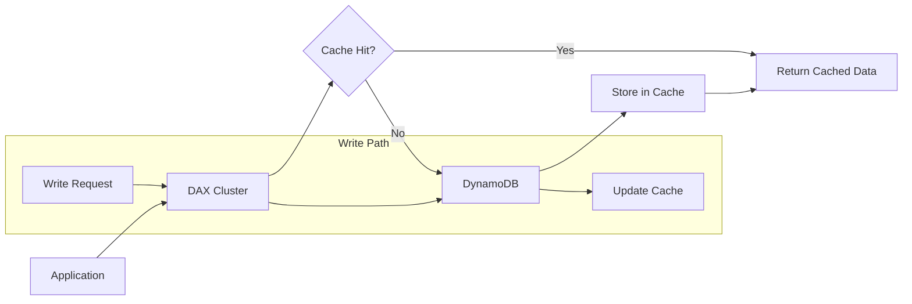
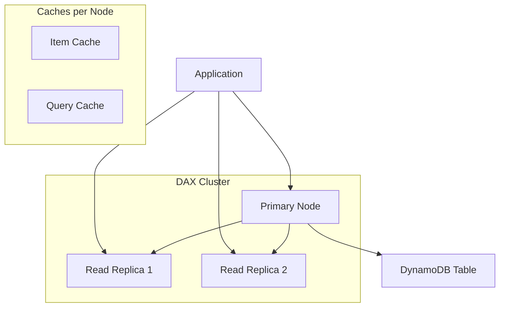
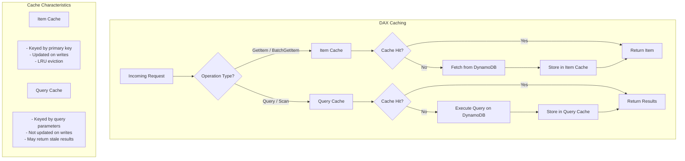
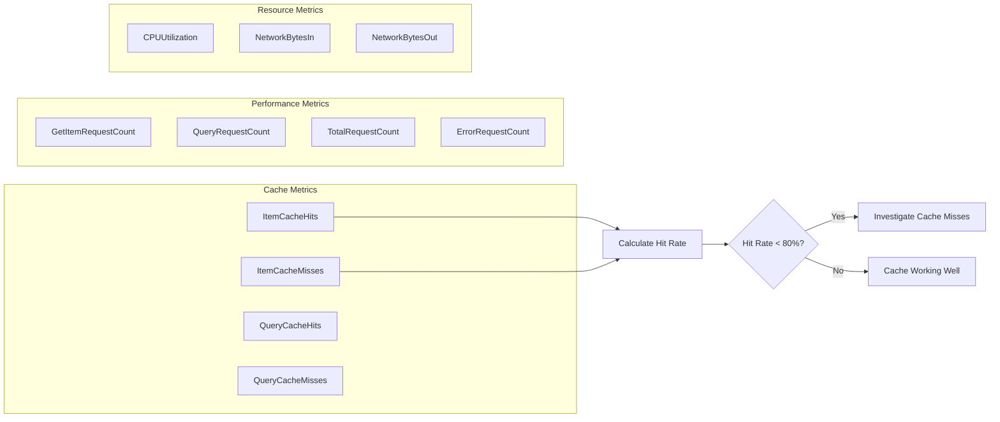
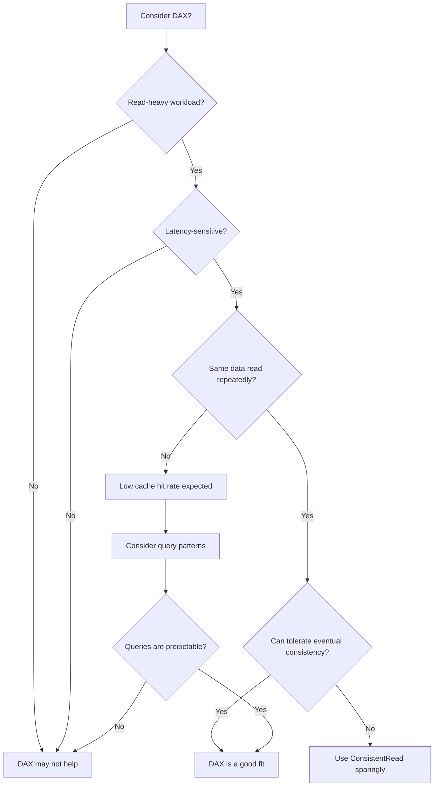

# How to Use DynamoDB Accelerator (DAX)

Author: [nawazdhandala](https://github.com/nawazdhandala)

Tags: AWS, DynamoDB, DAX, Caching, Performance, NoSQL, Database

Description: Learn how to use DynamoDB Accelerator (DAX) to add microsecond read performance to your DynamoDB tables. Covers cluster setup, SDK integration, cache behaviors, write-through strategies, and production best practices.

---

DynamoDB Accelerator (DAX) is a fully managed, in-memory cache for Amazon DynamoDB that delivers up to 10x performance improvement for read-heavy workloads. Latency drops from single-digit milliseconds to microseconds, even at millions of requests per second. DAX is API-compatible with DynamoDB, meaning you can add caching with minimal code changes.

## How DAX Works

DAX sits between your application and DynamoDB, handling caching automatically. Write operations flow through to DynamoDB and update the cache (write-through). Read operations check the cache first and only hit DynamoDB on cache misses.



## DAX Architecture

A DAX cluster consists of one or more nodes distributed across Availability Zones. The primary node handles writes and replicates to read replicas. Each node maintains its own item cache and query cache.



## Setting Up a DAX Cluster

Before creating a DAX cluster, you need to configure the proper IAM role, security groups, and subnet group. The following sections walk through each step.

### IAM Role for DAX

DAX requires an IAM role with permissions to access your DynamoDB tables. Create a service role that allows DAX to perform operations on your behalf.

```json
{
  "Version": "2012-10-17",
  "Statement": [
    {
      "Effect": "Allow",
      "Action": [
        "dynamodb:DescribeTable",
        "dynamodb:GetItem",
        "dynamodb:PutItem",
        "dynamodb:UpdateItem",
        "dynamodb:DeleteItem",
        "dynamodb:Query",
        "dynamodb:Scan",
        "dynamodb:BatchGetItem",
        "dynamodb:BatchWriteItem"
      ],
      "Resource": [
        "arn:aws:dynamodb:us-east-1:123456789012:table/YourTable",
        "arn:aws:dynamodb:us-east-1:123456789012:table/YourTable/index/*"
      ]
    }
  ]
}
```

### Create DAX Cluster with AWS CLI

The following command creates a three-node DAX cluster with encryption enabled. Adjust the node type based on your workload requirements.

```bash
# Create a subnet group for DAX
# Subnets should be in different Availability Zones for high availability
aws dax create-subnet-group \
    --subnet-group-name my-dax-subnet-group \
    --subnet-ids subnet-12345678 subnet-87654321 subnet-abcdef12

# Create a parameter group for custom cache settings
# TTL values control how long items stay in cache
aws dax create-parameter-group \
    --parameter-group-name my-dax-params \
    --description "Custom DAX parameters"

# Modify TTL settings (in milliseconds)
# Item TTL: how long individual items stay cached
# Query TTL: how long query results stay cached
aws dax update-parameter-group \
    --parameter-group-name my-dax-params \
    --parameter-name-values \
        "ParameterName=record-ttl-millis,ParameterValue=300000" \
        "ParameterName=query-ttl-millis,ParameterValue=300000"

# Create the DAX cluster
aws dax create-cluster \
    --cluster-name my-dax-cluster \
    --node-type dax.r5.large \
    --replication-factor 3 \
    --iam-role-arn arn:aws:iam::123456789012:role/DAXServiceRole \
    --subnet-group my-dax-subnet-group \
    --parameter-group my-dax-params \
    --sse-specification Enabled=true \
    --tags Key=Environment,Value=Production
```

### Create DAX Cluster with CloudFormation

Infrastructure as code provides repeatability and version control for your DAX cluster configuration.

```yaml
# CloudFormation template for DAX cluster
# Includes IAM role, subnet group, and cluster with encryption
AWSTemplateFormatVersion: '2010-09-09'
Description: DynamoDB DAX Cluster

Parameters:
  VpcId:
    Type: AWS::EC2::VPC::Id
    Description: VPC for DAX cluster
  SubnetIds:
    Type: List<AWS::EC2::Subnet::Id>
    Description: Subnets for DAX cluster (multi-AZ recommended)
  DynamoDBTableArn:
    Type: String
    Description: ARN of the DynamoDB table to cache

Resources:
  # IAM role that DAX assumes to access DynamoDB
  DAXRole:
    Type: AWS::IAM::Role
    Properties:
      RoleName: DAXServiceRole
      AssumeRolePolicyDocument:
        Version: '2012-10-17'
        Statement:
          - Effect: Allow
            Principal:
              Service: dax.amazonaws.com
            Action: sts:AssumeRole
      Policies:
        - PolicyName: DAXDynamoDBAccess
          PolicyDocument:
            Version: '2012-10-17'
            Statement:
              - Effect: Allow
                Action:
                  - dynamodb:DescribeTable
                  - dynamodb:GetItem
                  - dynamodb:PutItem
                  - dynamodb:UpdateItem
                  - dynamodb:DeleteItem
                  - dynamodb:Query
                  - dynamodb:Scan
                  - dynamodb:BatchGetItem
                  - dynamodb:BatchWriteItem
                Resource:
                  - !Ref DynamoDBTableArn
                  - !Sub "${DynamoDBTableArn}/index/*"

  # Security group controls network access to DAX
  DAXSecurityGroup:
    Type: AWS::EC2::SecurityGroup
    Properties:
      GroupDescription: Security group for DAX cluster
      VpcId: !Ref VpcId
      SecurityGroupIngress:
        # Port 8111 is the unencrypted endpoint
        - IpProtocol: tcp
          FromPort: 8111
          ToPort: 8111
          CidrIp: 10.0.0.0/8
        # Port 9111 is the encrypted endpoint
        - IpProtocol: tcp
          FromPort: 9111
          ToPort: 9111
          CidrIp: 10.0.0.0/8

  # Subnet group defines where DAX nodes are placed
  DAXSubnetGroup:
    Type: AWS::DAX::SubnetGroup
    Properties:
      SubnetGroupName: my-dax-subnet-group
      SubnetIds: !Ref SubnetIds
      Description: Subnet group for DAX cluster

  # Parameter group for cache TTL settings
  DAXParameterGroup:
    Type: AWS::DAX::ParameterGroup
    Properties:
      ParameterGroupName: my-dax-params
      Description: Custom DAX parameters
      ParameterNameValues:
        record-ttl-millis: '300000'
        query-ttl-millis: '300000'

  # The DAX cluster itself
  DAXCluster:
    Type: AWS::DAX::Cluster
    Properties:
      ClusterName: my-dax-cluster
      NodeType: dax.r5.large
      ReplicationFactor: 3
      IAMRoleARN: !GetAtt DAXRole.Arn
      SubnetGroupName: !Ref DAXSubnetGroup
      ParameterGroupName: !Ref DAXParameterGroup
      SecurityGroupIds:
        - !Ref DAXSecurityGroup
      SSESpecification:
        SSEEnabled: true

Outputs:
  ClusterEndpoint:
    Description: DAX cluster endpoint
    Value: !GetAtt DAXCluster.ClusterDiscoveryEndpoint
```

## Connecting to DAX from Node.js

The DAX SDK is a drop-in replacement for the DynamoDB SDK. Update your client initialization to use the DAX endpoint instead of DynamoDB directly.

### Install the DAX Client

```bash
# Install the DAX client for Node.js
npm install amazon-dax-client @aws-sdk/client-dynamodb
```

### Basic DAX Client Setup

The DAX client uses the cluster discovery endpoint to find all nodes. Connection pooling and failover happen automatically.

```javascript
// Import the DAX client - it wraps the standard DynamoDB client
const AmazonDaxClient = require('amazon-dax-client');
const { DynamoDBDocumentClient, GetCommand, PutCommand, QueryCommand } = require('@aws-sdk/lib-dynamodb');

// DAX endpoint from your cluster configuration
// Format: dax://cluster-name.region.amazonaws.com
const DAX_ENDPOINT = 'dax://my-dax-cluster.abc123.dax-clusters.us-east-1.amazonaws.com';

// Create DAX client with connection settings
// maxRetries handles transient failures
// connectTimeout prevents hanging on network issues
const daxClient = new AmazonDaxClient({
  endpoints: [DAX_ENDPOINT],
  region: 'us-east-1',
  maxRetries: 3,
  connectTimeout: 5000,
  requestTimeout: 60000,
});

// Wrap with DocumentClient for easier object handling
const docClient = DynamoDBDocumentClient.from(daxClient, {
  marshallOptions: {
    removeUndefinedValues: true,
  },
});

// GetItem example - served from cache on subsequent calls
async function getUser(userId) {
  const command = new GetCommand({
    TableName: 'Users',
    Key: { userId },
  });

  const result = await docClient.send(command);
  return result.Item;
}

// PutItem example - writes to DynamoDB and updates cache
async function createUser(user) {
  const command = new PutCommand({
    TableName: 'Users',
    Item: {
      userId: user.id,
      email: user.email,
      name: user.name,
      createdAt: new Date().toISOString(),
    },
  });

  await docClient.send(command);
  return user;
}

// Query example - results cached based on query-ttl-millis
async function getUsersByStatus(status) {
  const command = new QueryCommand({
    TableName: 'Users',
    IndexName: 'StatusIndex',
    KeyConditionExpression: 'status = :status',
    ExpressionAttributeValues: {
      ':status': status,
    },
  });

  const result = await docClient.send(command);
  return result.Items;
}
```

### Fallback to DynamoDB

A resilient application should fall back to DynamoDB if DAX becomes unavailable. Handle connection errors gracefully and route requests directly to DynamoDB when needed.

```javascript
const AmazonDaxClient = require('amazon-dax-client');
const { DynamoDBClient } = require('@aws-sdk/client-dynamodb');
const { DynamoDBDocumentClient, GetCommand } = require('@aws-sdk/lib-dynamodb');

// Factory function creates appropriate client based on availability
// Checks DAX health and falls back to DynamoDB on failure
class ResilientDynamoClient {
  constructor(config) {
    this.daxEndpoint = config.daxEndpoint;
    this.region = config.region;
    this.useDax = true;
    this.daxClient = null;
    this.dynamoClient = null;
    this.healthCheckInterval = null;
  }

  // Initialize both clients - DAX as primary, DynamoDB as fallback
  async initialize() {
    // Create direct DynamoDB client as fallback
    const rawDynamoClient = new DynamoDBClient({ region: this.region });
    this.dynamoClient = DynamoDBDocumentClient.from(rawDynamoClient);

    // Try to create DAX client
    try {
      const rawDaxClient = new AmazonDaxClient({
        endpoints: [this.daxEndpoint],
        region: this.region,
        maxRetries: 2,
        connectTimeout: 3000,
      });
      this.daxClient = DynamoDBDocumentClient.from(rawDaxClient);

      // Verify DAX is reachable with a simple operation
      await this.healthCheck();
      console.log('DAX client initialized successfully');
    } catch (error) {
      console.warn('DAX unavailable, using DynamoDB directly:', error.message);
      this.useDax = false;
    }

    // Periodic health check to detect DAX recovery
    this.healthCheckInterval = setInterval(() => this.healthCheck(), 30000);
  }

  // Health check determines which client to use
  async healthCheck() {
    if (!this.daxClient) return;

    try {
      // Simple DescribeTable call to verify connectivity
      await this.daxClient.send(new GetCommand({
        TableName: 'HealthCheck',
        Key: { id: 'ping' },
      }));
      this.useDax = true;
    } catch (error) {
      // Ignore item not found errors - we just want connectivity check
      if (error.name === 'ResourceNotFoundException') {
        this.useDax = true;
      } else {
        console.warn('DAX health check failed:', error.message);
        this.useDax = false;
      }
    }
  }

  // Get the active client - DAX if available, otherwise DynamoDB
  getClient() {
    return this.useDax && this.daxClient ? this.daxClient : this.dynamoClient;
  }

  // Execute command with automatic fallback on DAX failure
  async send(command) {
    if (this.useDax && this.daxClient) {
      try {
        return await this.daxClient.send(command);
      } catch (error) {
        // Only fallback on connection errors, not application errors
        if (this.isConnectionError(error)) {
          console.warn('DAX request failed, falling back to DynamoDB:', error.message);
          this.useDax = false;
          return await this.dynamoClient.send(command);
        }
        throw error;
      }
    }
    return await this.dynamoClient.send(command);
  }

  // Determine if error is a connection issue vs application error
  isConnectionError(error) {
    const connectionErrors = [
      'NoEndpointsAvailableError',
      'DaxClientError',
      'ECONNREFUSED',
      'ETIMEDOUT',
      'ENOTFOUND',
    ];
    return connectionErrors.some(e =>
      error.name?.includes(e) || error.message?.includes(e)
    );
  }

  // Cleanup on shutdown
  close() {
    if (this.healthCheckInterval) {
      clearInterval(this.healthCheckInterval);
    }
  }
}

// Usage
const client = new ResilientDynamoClient({
  daxEndpoint: 'dax://my-cluster.abc123.dax-clusters.us-east-1.amazonaws.com',
  region: 'us-east-1',
});

await client.initialize();

const result = await client.send(new GetCommand({
  TableName: 'Users',
  Key: { userId: '123' },
}));
```

## Connecting to DAX from Python

The Python DAX client follows the same patterns as the boto3 DynamoDB client.

### Install the DAX Client

```bash
# Install the DAX client for Python
pip install amazon-dax-client boto3
```

### Python DAX Client Setup

```python
# Python DAX client setup with connection pooling
# Uses the same API as boto3 DynamoDB resource
import amazondax
import boto3
from botocore.config import Config

# Create DAX client with connection settings
# cluster_endpoint is your DAX cluster's discovery endpoint
dax_client = amazondax.AmazonDaxClient.resource(
    endpoint_url='dax://my-dax-cluster.abc123.dax-clusters.us-east-1.amazonaws.com',
    region_name='us-east-1',
)

# Get table reference - same as boto3
users_table = dax_client.Table('Users')


def get_user(user_id: str) -> dict:
    """
    Get a user by ID - served from DAX cache on subsequent calls.
    First call fetches from DynamoDB and populates cache.
    """
    response = users_table.get_item(
        Key={'userId': user_id}
    )
    return response.get('Item')


def create_user(user: dict) -> dict:
    """
    Create a new user - writes to DynamoDB and updates DAX cache.
    Cache is updated via write-through, ensuring consistency.
    """
    users_table.put_item(
        Item={
            'userId': user['id'],
            'email': user['email'],
            'name': user['name'],
            'status': 'active',
        }
    )
    return user


def query_users_by_status(status: str) -> list:
    """
    Query users by status using GSI.
    Query results are cached based on query-ttl-millis setting.
    """
    response = users_table.query(
        IndexName='StatusIndex',
        KeyConditionExpression='#status = :status',
        ExpressionAttributeNames={'#status': 'status'},
        ExpressionAttributeValues={':status': status},
    )
    return response.get('Items', [])


def batch_get_users(user_ids: list) -> list:
    """
    Batch get multiple users in a single request.
    Each item is cached individually in DAX.
    """
    response = dax_client.batch_get_item(
        RequestItems={
            'Users': {
                'Keys': [{'userId': uid} for uid in user_ids]
            }
        }
    )
    return response.get('Responses', {}).get('Users', [])
```

### Python Fallback Implementation

```python
# Resilient Python client with automatic fallback
# Tries DAX first, falls back to DynamoDB on connection failure
import amazondax
import boto3
import logging
from threading import Lock

logger = logging.getLogger(__name__)


class ResilientDynamoClient:
    """
    DynamoDB client with DAX caching and automatic fallback.
    Monitors DAX health and switches to direct DynamoDB access
    when DAX is unavailable.
    """

    def __init__(self, dax_endpoint: str, region: str):
        self.dax_endpoint = dax_endpoint
        self.region = region
        self.use_dax = True
        self.lock = Lock()
        self._init_clients()

    def _init_clients(self):
        """Initialize both DAX and DynamoDB clients."""
        # Direct DynamoDB client as fallback
        self.dynamo_resource = boto3.resource(
            'dynamodb',
            region_name=self.region,
        )

        # DAX client as primary
        try:
            self.dax_resource = amazondax.AmazonDaxClient.resource(
                endpoint_url=self.dax_endpoint,
                region_name=self.region,
            )
            logger.info('DAX client initialized successfully')
        except Exception as e:
            logger.warning(f'Failed to initialize DAX client: {e}')
            self.dax_resource = None
            self.use_dax = False

    def table(self, table_name: str):
        """Get table reference from appropriate client."""
        if self.use_dax and self.dax_resource:
            return self.dax_resource.Table(table_name)
        return self.dynamo_resource.Table(table_name)

    def execute_with_fallback(self, operation, *args, **kwargs):
        """
        Execute operation with automatic fallback.
        Catches DAX connection errors and retries with DynamoDB.
        """
        if self.use_dax and self.dax_resource:
            try:
                return operation(*args, **kwargs)
            except Exception as e:
                if self._is_connection_error(e):
                    logger.warning(f'DAX error, falling back to DynamoDB: {e}')
                    with self.lock:
                        self.use_dax = False
                    # Retry with DynamoDB
                    return operation(*args, **kwargs)
                raise

        return operation(*args, **kwargs)

    def _is_connection_error(self, error: Exception) -> bool:
        """Check if error indicates DAX connectivity issue."""
        error_str = str(error).lower()
        connection_indicators = [
            'connection',
            'endpoint',
            'timeout',
            'unavailable',
        ]
        return any(ind in error_str for ind in connection_indicators)


# Usage example
client = ResilientDynamoClient(
    dax_endpoint='dax://my-cluster.abc123.dax-clusters.us-east-1.amazonaws.com',
    region='us-east-1',
)

users_table = client.table('Users')
user = users_table.get_item(Key={'userId': '123'})
```

## Understanding DAX Caching Behavior

DAX maintains two separate caches with different characteristics. Understanding these helps you optimize your caching strategy.



### Item Cache vs Query Cache

| Feature | Item Cache | Query Cache |
|---------|-----------|-------------|
| **Scope** | Individual items | Query/Scan results |
| **Key** | Table + Primary Key | Query parameters hash |
| **Updated on writes** | Yes (write-through) | No |
| **Staleness risk** | Low | Higher |
| **Best for** | Point lookups | Repeated identical queries |

### Cache Invalidation Patterns

Query cache results can become stale because writes do not invalidate query cache entries. Handle query cache staleness with appropriate TTL settings and application-level strategies.

```javascript
// Cache invalidation strategies for DAX
// Different approaches for different consistency requirements

class CacheAwareRepository {
  constructor(daxClient, dynamoClient, tableName) {
    this.daxClient = daxClient;
    this.dynamoClient = dynamoClient; // Direct DynamoDB for consistent reads
    this.tableName = tableName;
  }

  // Standard read - uses DAX cache
  // Good for: frequently accessed, tolerance for slightly stale data
  async getItem(key) {
    const command = new GetCommand({
      TableName: this.tableName,
      Key: key,
    });
    return await this.daxClient.send(command);
  }

  // Consistent read - bypasses DAX cache
  // Good for: critical data that must be current
  async getItemConsistent(key) {
    const command = new GetCommand({
      TableName: this.tableName,
      Key: key,
      ConsistentRead: true,
    });
    // Use direct DynamoDB client for consistent reads
    // DAX does not cache ConsistentRead results
    return await this.dynamoClient.send(command);
  }

  // Write with cache-aware read-after-write
  // Prevents returning stale data immediately after write
  async updateItem(key, updates) {
    const command = new UpdateCommand({
      TableName: this.tableName,
      Key: key,
      ...updates,
      ReturnValues: 'ALL_NEW',
    });

    // Write goes through DAX (updates item cache)
    const result = await this.daxClient.send(command);

    // Return the updated item from the response
    // No need for separate read - we have fresh data
    return result.Attributes;
  }

  // Query with freshness control
  // Allows application to control cache behavior
  async queryItems(params, options = {}) {
    const { bypassCache = false } = options;

    const command = new QueryCommand({
      TableName: this.tableName,
      ...params,
    });

    if (bypassCache) {
      // Go direct to DynamoDB for fresh results
      return await this.dynamoClient.send(command);
    }

    // Use DAX query cache
    return await this.daxClient.send(command);
  }
}

// Usage patterns
const repo = new CacheAwareRepository(daxClient, dynamoClient, 'Orders');

// Normal read - cache is fine
const order = await repo.getItem({ orderId: '123' });

// Need absolutely current data - use consistent read
const currentBalance = await repo.getItemConsistent({ userId: 'user123' });

// After a write, get fresh list
await repo.updateItem({ orderId: '123' }, { status: 'shipped' });
const freshOrders = await repo.queryItems(
  { KeyConditionExpression: 'userId = :uid', ... },
  { bypassCache: true }
);
```

## Monitoring DAX Performance

CloudWatch metrics help you understand cache efficiency and identify optimization opportunities.

### Key Metrics to Monitor



### CloudWatch Dashboard Setup

Create a dashboard to visualize DAX performance and cache efficiency.

```javascript
// CloudWatch dashboard definition for DAX monitoring
// Tracks cache hit rates, latency, and resource utilization
const dashboardBody = {
  widgets: [
    {
      type: 'metric',
      x: 0,
      y: 0,
      width: 12,
      height: 6,
      properties: {
        title: 'Cache Hit Rate',
        region: 'us-east-1',
        metrics: [
          // Calculate item cache hit rate as percentage
          [
            { expression: '100 * m1 / (m1 + m2)', label: 'Item Cache Hit Rate', id: 'e1' }
          ],
          [
            'AWS/DAX', 'ItemCacheHits', 'ClusterName', 'my-dax-cluster',
            { id: 'm1', visible: false }
          ],
          [
            'AWS/DAX', 'ItemCacheMisses', 'ClusterName', 'my-dax-cluster',
            { id: 'm2', visible: false }
          ],
          // Calculate query cache hit rate
          [
            { expression: '100 * m3 / (m3 + m4)', label: 'Query Cache Hit Rate', id: 'e2' }
          ],
          [
            'AWS/DAX', 'QueryCacheHits', 'ClusterName', 'my-dax-cluster',
            { id: 'm3', visible: false }
          ],
          [
            'AWS/DAX', 'QueryCacheMisses', 'ClusterName', 'my-dax-cluster',
            { id: 'm4', visible: false }
          ],
        ],
        period: 60,
        stat: 'Sum',
        yAxis: { left: { min: 0, max: 100 } },
      },
    },
    {
      type: 'metric',
      x: 12,
      y: 0,
      width: 12,
      height: 6,
      properties: {
        title: 'Request Latency',
        region: 'us-east-1',
        metrics: [
          [
            'AWS/DAX', 'ClientConnections', 'ClusterName', 'my-dax-cluster',
            { stat: 'Average' }
          ],
        ],
        period: 60,
      },
    },
    {
      type: 'metric',
      x: 0,
      y: 6,
      width: 12,
      height: 6,
      properties: {
        title: 'Request Count by Type',
        region: 'us-east-1',
        metrics: [
          ['AWS/DAX', 'GetItemRequestCount', 'ClusterName', 'my-dax-cluster'],
          ['AWS/DAX', 'QueryRequestCount', 'ClusterName', 'my-dax-cluster'],
          ['AWS/DAX', 'PutItemRequestCount', 'ClusterName', 'my-dax-cluster'],
          ['AWS/DAX', 'UpdateItemRequestCount', 'ClusterName', 'my-dax-cluster'],
        ],
        period: 60,
        stat: 'Sum',
      },
    },
    {
      type: 'metric',
      x: 12,
      y: 6,
      width: 12,
      height: 6,
      properties: {
        title: 'CPU and Memory',
        region: 'us-east-1',
        metrics: [
          [
            'AWS/DAX', 'CPUUtilization', 'ClusterName', 'my-dax-cluster',
            { stat: 'Average' }
          ],
        ],
        period: 60,
        yAxis: { left: { min: 0, max: 100 } },
      },
    },
  ],
};
```

### CloudWatch Alarms

Set up alarms for critical conditions that require attention.

```javascript
// CloudWatch alarms for DAX cluster health
// Alerts on low cache hit rates and high error rates
const alarms = [
  {
    AlarmName: 'DAX-LowItemCacheHitRate',
    AlarmDescription: 'Item cache hit rate below 80%',
    MetricName: 'ItemCacheHits',
    Namespace: 'AWS/DAX',
    Statistic: 'Sum',
    Period: 300,
    EvaluationPeriods: 3,
    Threshold: 80,
    ComparisonOperator: 'LessThanThreshold',
    // Uses math expression to calculate hit rate
    Metrics: [
      {
        Id: 'hits',
        MetricStat: {
          Metric: {
            Namespace: 'AWS/DAX',
            MetricName: 'ItemCacheHits',
            Dimensions: [{ Name: 'ClusterName', Value: 'my-dax-cluster' }],
          },
          Period: 300,
          Stat: 'Sum',
        },
      },
      {
        Id: 'misses',
        MetricStat: {
          Metric: {
            Namespace: 'AWS/DAX',
            MetricName: 'ItemCacheMisses',
            Dimensions: [{ Name: 'ClusterName', Value: 'my-dax-cluster' }],
          },
          Period: 300,
          Stat: 'Sum',
        },
      },
      {
        Id: 'hitRate',
        Expression: '100 * hits / (hits + misses)',
        ReturnData: true,
      },
    ],
  },
  {
    AlarmName: 'DAX-HighErrorRate',
    AlarmDescription: 'Error rate exceeds 5%',
    // Similar structure for error rate calculation
  },
  {
    AlarmName: 'DAX-HighCPU',
    AlarmDescription: 'CPU utilization above 80%',
    MetricName: 'CPUUtilization',
    Namespace: 'AWS/DAX',
    Statistic: 'Average',
    Period: 300,
    EvaluationPeriods: 3,
    Threshold: 80,
    ComparisonOperator: 'GreaterThanThreshold',
    Dimensions: [{ Name: 'ClusterName', Value: 'my-dax-cluster' }],
  },
];
```

## Best Practices and Common Pitfalls

### When to Use DAX



### DAX Limitations to Consider

| Limitation | Impact | Workaround |
|------------|--------|------------|
| **VPC-only** | Cannot access from internet | Use VPN or PrivateLink |
| **Query cache staleness** | Writes do not invalidate queries | Use appropriate TTL, bypass cache after writes |
| **Consistent reads not cached** | No benefit for ConsistentRead | Minimize consistent reads |
| **Scan operations** | Full table scans bypass cache effectively | Avoid Scan, use Query |
| **Large items** | Items > 64KB not cached | Keep items small |

### Configuration Recommendations

```javascript
// DAX configuration recommendations based on workload type
// Adjust these settings based on your specific requirements

const configurations = {
  // High-read, low-write workload (content delivery, product catalog)
  readHeavy: {
    nodeType: 'dax.r5.large',
    replicationFactor: 3,
    parameterGroup: {
      'record-ttl-millis': 3600000, // 1 hour - items change infrequently
      'query-ttl-millis': 300000,   // 5 minutes - queries more dynamic
    },
  },

  // Balanced read/write (user sessions, shopping carts)
  balanced: {
    nodeType: 'dax.r5.large',
    replicationFactor: 3,
    parameterGroup: {
      'record-ttl-millis': 300000,  // 5 minutes
      'query-ttl-millis': 60000,    // 1 minute - fresher query results
    },
  },

  // High-throughput (gaming leaderboards, real-time analytics)
  highThroughput: {
    nodeType: 'dax.r5.xlarge', // More memory for cache
    replicationFactor: 5,      // More read replicas
    parameterGroup: {
      'record-ttl-millis': 60000,   // 1 minute - data changes frequently
      'query-ttl-millis': 30000,    // 30 seconds
    },
  },
};
```

### Security Best Practices

```javascript
// Security configuration for DAX
// Encryption, network isolation, and access control

const securityConfig = {
  // Enable encryption at rest
  sseSpecification: {
    enabled: true,
  },

  // Enable encryption in transit
  clusterEndpointEncryptionType: 'TLS',

  // VPC configuration for network isolation
  vpc: {
    // Place DAX in private subnets only
    subnetType: 'private',
    // Restrict security group to application subnets
    securityGroupRules: {
      inbound: [
        {
          protocol: 'tcp',
          port: 9111, // Encrypted endpoint
          source: 'application-security-group',
        },
      ],
      outbound: [
        {
          protocol: 'tcp',
          port: 443, // For DynamoDB access
          destination: 'dynamodb-vpc-endpoint',
        },
      ],
    },
  },

  // IAM policy - least privilege
  iamPolicy: {
    // Only allow access to specific tables
    resources: [
      'arn:aws:dynamodb:*:*:table/AllowedTable1',
      'arn:aws:dynamodb:*:*:table/AllowedTable2',
    ],
    // Only allow needed operations
    actions: [
      'dynamodb:GetItem',
      'dynamodb:PutItem',
      'dynamodb:Query',
      // Exclude Scan if not needed
    ],
  },
};
```

## Summary

DynamoDB Accelerator provides microsecond read latency with minimal code changes. Key points to remember:

| Aspect | Recommendation |
|--------|----------------|
| **Use case** | Read-heavy, latency-sensitive workloads |
| **Client setup** | Use DAX SDK as drop-in replacement |
| **Fallback** | Always implement DynamoDB fallback |
| **TTL settings** | Match to your data freshness requirements |
| **Monitoring** | Track cache hit rates, set alarms |
| **Security** | Enable encryption, use private subnets |

DAX handles caching automatically through write-through for items and TTL-based expiration for queries. By understanding the two cache types and their behaviors, you can optimize your application for both performance and data freshness.
