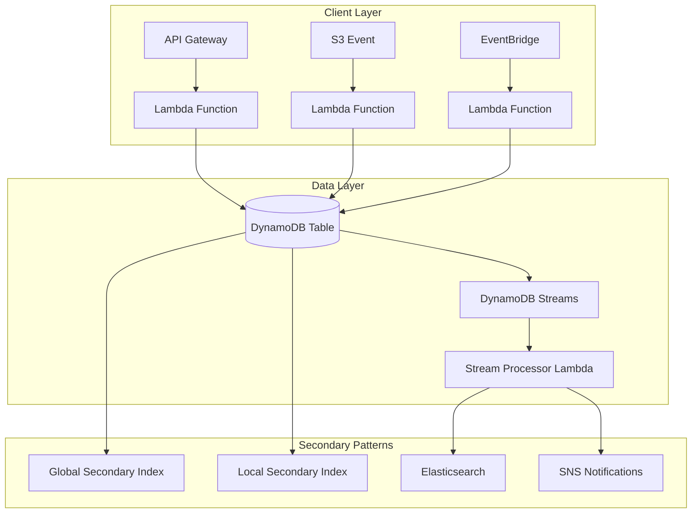
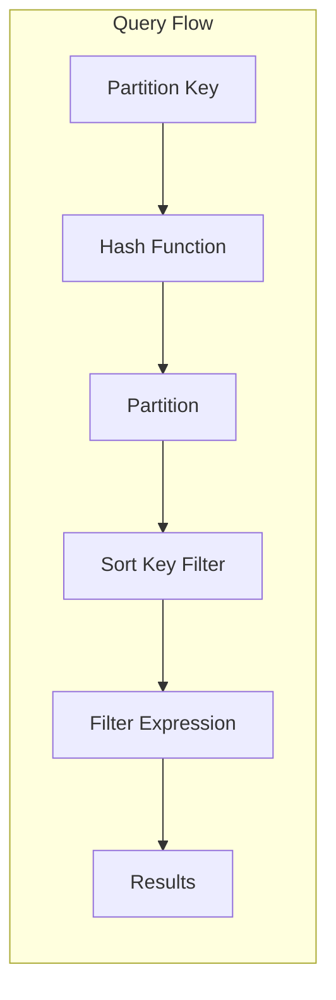
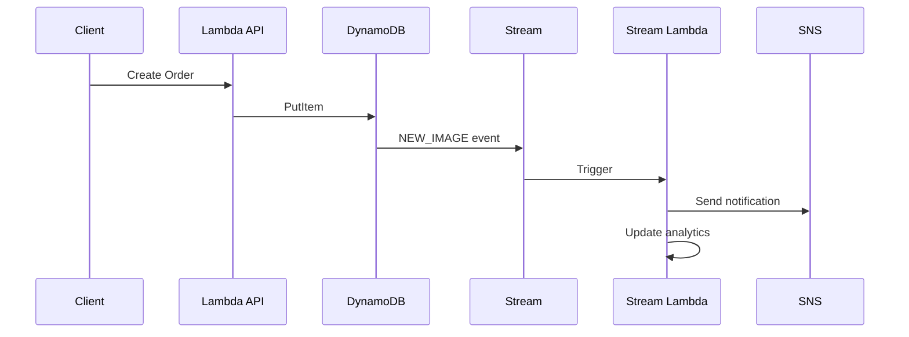

# How to Use DynamoDB with Lambda

Author: [nawazdhandala](https://github.com/nawazdhandala)

Tags: AWS, DynamoDB, Lambda, Serverless, Node.js, Python, Database

Description: Learn how to integrate Amazon DynamoDB with AWS Lambda functions for building scalable serverless applications, including CRUD operations, best practices, and performance optimization.

---

Amazon DynamoDB and AWS Lambda form a powerful combination for building serverless applications. DynamoDB provides millisecond latency at any scale, while Lambda offers compute without managing servers. Together, they enable you to build highly scalable, cost-effective backends.

## Architecture Overview

The following diagram illustrates how Lambda functions interact with DynamoDB in a typical serverless architecture.



## Setting Up DynamoDB Access

### IAM Permissions

Before your Lambda function can access DynamoDB, you need proper IAM permissions. Create an IAM role with the following policy attached.

```json
{
  "Version": "2012-10-17",
  "Statement": [
    {
      "Effect": "Allow",
      "Action": [
        "dynamodb:GetItem",
        "dynamodb:PutItem",
        "dynamodb:UpdateItem",
        "dynamodb:DeleteItem",
        "dynamodb:Query",
        "dynamodb:Scan",
        "dynamodb:BatchGetItem",
        "dynamodb:BatchWriteItem"
      ],
      "Resource": [
        "arn:aws:dynamodb:us-east-1:123456789012:table/YourTable",
        "arn:aws:dynamodb:us-east-1:123456789012:table/YourTable/index/*"
      ]
    }
  ]
}
```

### Node.js Setup

Install the AWS SDK v3 for modern, modular imports that reduce cold start times.

```bash
npm install @aws-sdk/client-dynamodb @aws-sdk/lib-dynamodb
```

The following code initializes the DynamoDB client with the Document Client wrapper, which simplifies working with JavaScript objects.

```javascript
// dynamodb-client.js
const { DynamoDBClient } = require('@aws-sdk/client-dynamodb');
const { DynamoDBDocumentClient } = require('@aws-sdk/lib-dynamodb');

// Create the base DynamoDB client
// Region is automatically picked up from Lambda environment
const client = new DynamoDBClient({
  // Reduce connection timeout for faster failures
  requestTimeout: 5000,
  // Reuse connections across invocations
  maxAttempts: 3,
});

// Wrap with Document Client for easier JavaScript object handling
// marshallOptions control how JS types convert to DynamoDB types
const docClient = DynamoDBDocumentClient.from(client, {
  marshallOptions: {
    // Remove undefined values from objects
    removeUndefinedValues: true,
    // Convert empty strings to null (DynamoDB doesn't support empty strings)
    convertEmptyValues: true,
  },
  unmarshallOptions: {
    // Return numbers as native JS numbers instead of strings
    wrapNumbers: false,
  },
});

module.exports = { docClient };
```

### Python Setup

Python Lambda functions can use boto3, which comes pre-installed in the Lambda runtime.

```python
# dynamodb_client.py
import boto3
from botocore.config import Config

# Configure retry behavior and timeouts
config = Config(
    # Retry up to 3 times with exponential backoff
    retries={
        'max_attempts': 3,
        'mode': 'adaptive'
    },
    # Connection timeout in seconds
    connect_timeout=5,
    # Read timeout in seconds
    read_timeout=10
)

# Create DynamoDB resource for high-level API
# The resource API provides a more Pythonic interface
dynamodb = boto3.resource('dynamodb', config=config)

# Create client for low-level API when needed
# The client API maps directly to DynamoDB operations
dynamodb_client = boto3.client('dynamodb', config=config)

def get_table(table_name):
    """Get a DynamoDB table resource."""
    return dynamodb.Table(table_name)
```

## CRUD Operations

### Create Item

The PutItem operation creates a new item or replaces an existing item entirely.

```javascript
// Node.js - Create item
const { PutCommand } = require('@aws-sdk/lib-dynamodb');
const { docClient } = require('./dynamodb-client');

async function createUser(user) {
  const params = {
    TableName: process.env.USERS_TABLE,
    Item: {
      // Partition key - unique identifier
      pk: `USER#${user.id}`,
      // Sort key - allows multiple items per partition
      sk: `PROFILE#${user.id}`,
      // Entity type for single-table design
      entityType: 'User',
      // User attributes
      id: user.id,
      email: user.email,
      name: user.name,
      // Timestamps in ISO format for readability
      createdAt: new Date().toISOString(),
      updatedAt: new Date().toISOString(),
      // TTL attribute for automatic expiration (Unix timestamp)
      ttl: Math.floor(Date.now() / 1000) + (365 * 24 * 60 * 60),
    },
    // Fail if item already exists (prevent overwrites)
    ConditionExpression: 'attribute_not_exists(pk)',
  };

  try {
    await docClient.send(new PutCommand(params));
    return { success: true, user: params.Item };
  } catch (error) {
    if (error.name === 'ConditionalCheckFailedException') {
      throw new Error('User already exists');
    }
    throw error;
  }
}

// Lambda handler
exports.handler = async (event) => {
  const user = JSON.parse(event.body);

  try {
    const result = await createUser(user);
    return {
      statusCode: 201,
      body: JSON.stringify(result),
    };
  } catch (error) {
    return {
      statusCode: error.message === 'User already exists' ? 409 : 500,
      body: JSON.stringify({ error: error.message }),
    };
  }
};
```

Python implementation for creating items follows a similar pattern.

```python
# Python - Create item
import json
import os
from datetime import datetime, timezone
from decimal import Decimal
from dynamodb_client import get_table

def create_user(user):
    """Create a new user in DynamoDB."""
    table = get_table(os.environ['USERS_TABLE'])

    # Build the item with keys and attributes
    item = {
        'pk': f"USER#{user['id']}",
        'sk': f"PROFILE#{user['id']}",
        'entityType': 'User',
        'id': user['id'],
        'email': user['email'],
        'name': user['name'],
        'createdAt': datetime.now(timezone.utc).isoformat(),
        'updatedAt': datetime.now(timezone.utc).isoformat(),
    }

    try:
        # Use condition to prevent overwriting existing users
        table.put_item(
            Item=item,
            ConditionExpression='attribute_not_exists(pk)'
        )
        return {'success': True, 'user': item}
    except table.meta.client.exceptions.ConditionalCheckFailedException:
        raise ValueError('User already exists')

def handler(event, context):
    """Lambda handler for user creation."""
    user = json.loads(event['body'])

    try:
        result = create_user(user)
        return {
            'statusCode': 201,
            'body': json.dumps(result, default=str)
        }
    except ValueError as e:
        return {
            'statusCode': 409,
            'body': json.dumps({'error': str(e)})
        }
    except Exception as e:
        return {
            'statusCode': 500,
            'body': json.dumps({'error': str(e)})
        }
```

### Read Item

GetItem retrieves a single item by its primary key. For single-table designs, you need both partition key and sort key.

```javascript
// Node.js - Read item
const { GetCommand } = require('@aws-sdk/lib-dynamodb');
const { docClient } = require('./dynamodb-client');

async function getUser(userId) {
  const params = {
    TableName: process.env.USERS_TABLE,
    Key: {
      pk: `USER#${userId}`,
      sk: `PROFILE#${userId}`,
    },
    // Only retrieve specific attributes to reduce data transfer
    ProjectionExpression: 'id, email, #name, createdAt',
    // 'name' is a reserved word, so use expression attribute names
    ExpressionAttributeNames: {
      '#name': 'name',
    },
    // Use eventual consistency for lower latency and cost
    // Set to true for strongly consistent reads when needed
    ConsistentRead: false,
  };

  const result = await docClient.send(new GetCommand(params));

  if (!result.Item) {
    return null;
  }

  return result.Item;
}

exports.handler = async (event) => {
  const userId = event.pathParameters.id;

  const user = await getUser(userId);

  if (!user) {
    return {
      statusCode: 404,
      body: JSON.stringify({ error: 'User not found' }),
    };
  }

  return {
    statusCode: 200,
    body: JSON.stringify(user),
  };
};
```

### Update Item

UpdateItem modifies existing attributes or adds new ones without replacing the entire item.

```javascript
// Node.js - Update item
const { UpdateCommand } = require('@aws-sdk/lib-dynamodb');
const { docClient } = require('./dynamodb-client');

async function updateUser(userId, updates) {
  // Build update expression dynamically
  const updateParts = [];
  const expressionAttributeNames = {};
  const expressionAttributeValues = {};

  // Always update the updatedAt timestamp
  updates.updatedAt = new Date().toISOString();

  // Iterate over update fields and build expressions
  Object.entries(updates).forEach(([key, value], index) => {
    const attrName = `#attr${index}`;
    const attrValue = `:val${index}`;

    updateParts.push(`${attrName} = ${attrValue}`);
    expressionAttributeNames[attrName] = key;
    expressionAttributeValues[attrValue] = value;
  });

  const params = {
    TableName: process.env.USERS_TABLE,
    Key: {
      pk: `USER#${userId}`,
      sk: `PROFILE#${userId}`,
    },
    UpdateExpression: `SET ${updateParts.join(', ')}`,
    ExpressionAttributeNames: expressionAttributeNames,
    ExpressionAttributeValues: expressionAttributeValues,
    // Only update if item exists
    ConditionExpression: 'attribute_exists(pk)',
    // Return the updated item
    ReturnValues: 'ALL_NEW',
  };

  try {
    const result = await docClient.send(new UpdateCommand(params));
    return result.Attributes;
  } catch (error) {
    if (error.name === 'ConditionalCheckFailedException') {
      throw new Error('User not found');
    }
    throw error;
  }
}

exports.handler = async (event) => {
  const userId = event.pathParameters.id;
  const updates = JSON.parse(event.body);

  // Prevent updating primary key fields
  delete updates.pk;
  delete updates.sk;
  delete updates.id;

  try {
    const user = await updateUser(userId, updates);
    return {
      statusCode: 200,
      body: JSON.stringify(user),
    };
  } catch (error) {
    return {
      statusCode: error.message === 'User not found' ? 404 : 500,
      body: JSON.stringify({ error: error.message }),
    };
  }
};
```

### Delete Item

DeleteItem removes an item from the table. Use conditions to ensure the item exists before deletion.

```javascript
// Node.js - Delete item
const { DeleteCommand } = require('@aws-sdk/lib-dynamodb');
const { docClient } = require('./dynamodb-client');

async function deleteUser(userId) {
  const params = {
    TableName: process.env.USERS_TABLE,
    Key: {
      pk: `USER#${userId}`,
      sk: `PROFILE#${userId}`,
    },
    // Only delete if item exists
    ConditionExpression: 'attribute_exists(pk)',
    // Return deleted item for confirmation
    ReturnValues: 'ALL_OLD',
  };

  try {
    const result = await docClient.send(new DeleteCommand(params));
    return result.Attributes;
  } catch (error) {
    if (error.name === 'ConditionalCheckFailedException') {
      throw new Error('User not found');
    }
    throw error;
  }
}

exports.handler = async (event) => {
  const userId = event.pathParameters.id;

  try {
    const deletedUser = await deleteUser(userId);
    return {
      statusCode: 200,
      body: JSON.stringify({ deleted: deletedUser }),
    };
  } catch (error) {
    return {
      statusCode: error.message === 'User not found' ? 404 : 500,
      body: JSON.stringify({ error: error.message }),
    };
  }
};
```

## Query Operations

Query is the most efficient way to retrieve multiple items. It requires a partition key and optionally filters on the sort key.



The following example demonstrates querying for all orders belonging to a specific user.

```javascript
// Node.js - Query items
const { QueryCommand } = require('@aws-sdk/lib-dynamodb');
const { docClient } = require('./dynamodb-client');

async function getUserOrders(userId, options = {}) {
  const params = {
    TableName: process.env.ORDERS_TABLE,
    // Key condition must include partition key
    // Sort key conditions are optional but efficient
    KeyConditionExpression: 'pk = :pk AND begins_with(sk, :skPrefix)',
    ExpressionAttributeValues: {
      ':pk': `USER#${userId}`,
      ':skPrefix': 'ORDER#',
    },
    // Scan in descending order to get newest first
    ScanIndexForward: false,
    // Limit results per query
    Limit: options.limit || 20,
  };

  // Add filter for order status if specified
  if (options.status) {
    params.FilterExpression = '#status = :status';
    params.ExpressionAttributeNames = { '#status': 'status' };
    params.ExpressionAttributeValues[':status'] = options.status;
  }

  // Handle pagination with exclusive start key
  if (options.lastKey) {
    params.ExclusiveStartKey = JSON.parse(
      Buffer.from(options.lastKey, 'base64').toString()
    );
  }

  const result = await docClient.send(new QueryCommand(params));

  // Create pagination token if more results exist
  let nextKey = null;
  if (result.LastEvaluatedKey) {
    nextKey = Buffer.from(
      JSON.stringify(result.LastEvaluatedKey)
    ).toString('base64');
  }

  return {
    items: result.Items,
    nextKey,
    count: result.Count,
  };
}

exports.handler = async (event) => {
  const userId = event.pathParameters.id;
  const { limit, status, nextKey } = event.queryStringParameters || {};

  const result = await getUserOrders(userId, {
    limit: parseInt(limit) || 20,
    status,
    lastKey: nextKey,
  });

  return {
    statusCode: 200,
    body: JSON.stringify(result),
  };
};
```

### Using Global Secondary Indexes

GSIs allow querying on non-primary key attributes. The following example queries orders by status across all users.

```javascript
// Node.js - Query with GSI
const { QueryCommand } = require('@aws-sdk/lib-dynamodb');
const { docClient } = require('./dynamodb-client');

async function getOrdersByStatus(status, dateRange) {
  const params = {
    TableName: process.env.ORDERS_TABLE,
    // Specify the GSI name
    IndexName: 'GSI1-status-createdAt',
    KeyConditionExpression: 'GSI1PK = :status AND GSI1SK BETWEEN :start AND :end',
    ExpressionAttributeValues: {
      ':status': `STATUS#${status}`,
      ':start': dateRange.start,
      ':end': dateRange.end,
    },
    // GSIs don't support consistent reads
    // All attributes are projected unless configured otherwise
    ScanIndexForward: false,
    Limit: 100,
  };

  const result = await docClient.send(new QueryCommand(params));
  return result.Items;
}

exports.handler = async (event) => {
  const { status } = event.pathParameters;
  const { startDate, endDate } = event.queryStringParameters || {};

  const orders = await getOrdersByStatus(status, {
    start: startDate || new Date(Date.now() - 7 * 24 * 60 * 60 * 1000).toISOString(),
    end: endDate || new Date().toISOString(),
  });

  return {
    statusCode: 200,
    body: JSON.stringify({ orders }),
  };
};
```

## Batch Operations

Batch operations are essential for handling multiple items efficiently while reducing Lambda execution time.

```javascript
// Node.js - Batch write
const { BatchWriteCommand } = require('@aws-sdk/lib-dynamodb');
const { docClient } = require('./dynamodb-client');

async function batchCreateItems(items) {
  // DynamoDB limits batch writes to 25 items
  const BATCH_SIZE = 25;
  const results = [];

  // Split items into batches
  for (let i = 0; i < items.length; i += BATCH_SIZE) {
    const batch = items.slice(i, i + BATCH_SIZE);

    const params = {
      RequestItems: {
        [process.env.TABLE_NAME]: batch.map(item => ({
          PutRequest: {
            Item: item,
          },
        })),
      },
    };

    let response = await docClient.send(new BatchWriteCommand(params));

    // Handle unprocessed items with exponential backoff
    let retries = 0;
    while (
      response.UnprocessedItems &&
      Object.keys(response.UnprocessedItems).length > 0 &&
      retries < 5
    ) {
      // Exponential backoff: 50ms, 100ms, 200ms, 400ms, 800ms
      await new Promise(resolve =>
        setTimeout(resolve, Math.pow(2, retries) * 50)
      );

      response = await docClient.send(new BatchWriteCommand({
        RequestItems: response.UnprocessedItems,
      }));

      retries++;
    }

    if (response.UnprocessedItems &&
        Object.keys(response.UnprocessedItems).length > 0) {
      results.push({ unprocessed: response.UnprocessedItems });
    }
  }

  return results;
}
```

Batch get operations retrieve multiple items in a single request.

```javascript
// Node.js - Batch get
const { BatchGetCommand } = require('@aws-sdk/lib-dynamodb');
const { docClient } = require('./dynamodb-client');

async function batchGetUsers(userIds) {
  // DynamoDB limits batch gets to 100 items
  const BATCH_SIZE = 100;
  const allItems = [];

  for (let i = 0; i < userIds.length; i += BATCH_SIZE) {
    const batch = userIds.slice(i, i + BATCH_SIZE);

    const params = {
      RequestItems: {
        [process.env.USERS_TABLE]: {
          Keys: batch.map(id => ({
            pk: `USER#${id}`,
            sk: `PROFILE#${id}`,
          })),
          // Only retrieve needed attributes
          ProjectionExpression: 'id, email, #name',
          ExpressionAttributeNames: { '#name': 'name' },
        },
      },
    };

    let response = await docClient.send(new BatchGetCommand(params));

    // Add retrieved items to results
    const items = response.Responses[process.env.USERS_TABLE] || [];
    allItems.push(...items);

    // Handle unprocessed keys with retry
    let retries = 0;
    while (
      response.UnprocessedKeys &&
      Object.keys(response.UnprocessedKeys).length > 0 &&
      retries < 5
    ) {
      await new Promise(resolve =>
        setTimeout(resolve, Math.pow(2, retries) * 50)
      );

      response = await docClient.send(new BatchGetCommand({
        RequestItems: response.UnprocessedKeys,
      }));

      const retryItems = response.Responses[process.env.USERS_TABLE] || [];
      allItems.push(...retryItems);

      retries++;
    }
  }

  return allItems;
}
```

## DynamoDB Streams with Lambda

DynamoDB Streams capture item-level changes and trigger Lambda functions for event-driven architectures.



The following Lambda function processes DynamoDB Stream events.

```javascript
// Node.js - Stream processor
const { unmarshall } = require('@aws-sdk/util-dynamodb');

exports.handler = async (event) => {
  // Process each record in the stream batch
  for (const record of event.Records) {
    // Event types: INSERT, MODIFY, REMOVE
    const eventName = record.eventName;

    // Get the new and old images based on stream configuration
    const newImage = record.dynamodb.NewImage
      ? unmarshall(record.dynamodb.NewImage)
      : null;
    const oldImage = record.dynamodb.OldImage
      ? unmarshall(record.dynamodb.OldImage)
      : null;

    console.log('Processing stream record:', {
      eventName,
      keys: record.dynamodb.Keys,
    });

    try {
      switch (eventName) {
        case 'INSERT':
          await handleInsert(newImage);
          break;
        case 'MODIFY':
          await handleModify(newImage, oldImage);
          break;
        case 'REMOVE':
          await handleRemove(oldImage);
          break;
      }
    } catch (error) {
      // Log error but continue processing other records
      // Consider sending to DLQ for failed records
      console.error('Error processing record:', error);
      throw error; // Rethrow to mark batch as failed
    }
  }

  return { processed: event.Records.length };
};

async function handleInsert(item) {
  if (item.entityType === 'Order') {
    // Send order confirmation email
    await sendOrderConfirmation(item);
    // Update inventory
    await updateInventory(item.items, 'decrease');
  }
}

async function handleModify(newItem, oldItem) {
  if (newItem.entityType === 'Order') {
    // Check if status changed
    if (newItem.status !== oldItem.status) {
      await sendStatusUpdate(newItem);
    }
  }
}

async function handleRemove(item) {
  if (item.entityType === 'Order' && item.status === 'cancelled') {
    // Restore inventory for cancelled orders
    await updateInventory(item.items, 'increase');
  }
}
```

## Transactions

DynamoDB transactions ensure all-or-nothing operations across multiple items.

```javascript
// Node.js - Transactional operations
const { TransactWriteCommand, TransactGetCommand } = require('@aws-sdk/lib-dynamodb');
const { docClient } = require('./dynamodb-client');

async function transferFunds(fromAccountId, toAccountId, amount) {
  const timestamp = new Date().toISOString();
  const transactionId = `TXN#${Date.now()}`;

  const params = {
    TransactItems: [
      // Debit from source account
      {
        Update: {
          TableName: process.env.ACCOUNTS_TABLE,
          Key: {
            pk: `ACCOUNT#${fromAccountId}`,
            sk: 'BALANCE',
          },
          UpdateExpression: 'SET balance = balance - :amount, updatedAt = :ts',
          ConditionExpression: 'balance >= :amount',
          ExpressionAttributeValues: {
            ':amount': amount,
            ':ts': timestamp,
          },
        },
      },
      // Credit to destination account
      {
        Update: {
          TableName: process.env.ACCOUNTS_TABLE,
          Key: {
            pk: `ACCOUNT#${toAccountId}`,
            sk: 'BALANCE',
          },
          UpdateExpression: 'SET balance = balance + :amount, updatedAt = :ts',
          ConditionExpression: 'attribute_exists(pk)',
          ExpressionAttributeValues: {
            ':amount': amount,
            ':ts': timestamp,
          },
        },
      },
      // Record transaction for source
      {
        Put: {
          TableName: process.env.ACCOUNTS_TABLE,
          Item: {
            pk: `ACCOUNT#${fromAccountId}`,
            sk: transactionId,
            type: 'DEBIT',
            amount: amount,
            counterparty: toAccountId,
            timestamp,
          },
        },
      },
      // Record transaction for destination
      {
        Put: {
          TableName: process.env.ACCOUNTS_TABLE,
          Item: {
            pk: `ACCOUNT#${toAccountId}`,
            sk: transactionId,
            type: 'CREDIT',
            amount: amount,
            counterparty: fromAccountId,
            timestamp,
          },
        },
      },
    ],
  };

  try {
    await docClient.send(new TransactWriteCommand(params));
    return { success: true, transactionId };
  } catch (error) {
    if (error.name === 'TransactionCanceledException') {
      // Check which condition failed
      const reasons = error.CancellationReasons;
      if (reasons[0].Code === 'ConditionalCheckFailed') {
        throw new Error('Insufficient balance');
      }
      if (reasons[1].Code === 'ConditionalCheckFailed') {
        throw new Error('Destination account not found');
      }
    }
    throw error;
  }
}
```

## Performance Optimization

### Connection Reuse

Lambda containers can be reused across invocations. Initialize the DynamoDB client outside the handler to reuse connections.

```javascript
// Initialize OUTSIDE the handler for connection reuse
const { DynamoDBClient } = require('@aws-sdk/client-dynamodb');
const { DynamoDBDocumentClient, GetCommand } = require('@aws-sdk/lib-dynamodb');

// Configure keep-alive for connection reuse
const client = new DynamoDBClient({
  // Enable HTTP keep-alive
  keepAlive: true,
});

const docClient = DynamoDBDocumentClient.from(client);

// Handler reuses the client from the container
exports.handler = async (event) => {
  const result = await docClient.send(new GetCommand({
    TableName: process.env.TABLE_NAME,
    Key: { pk: event.id, sk: 'DATA' },
  }));

  return result.Item;
};
```

### Reduce Cold Starts

Minimize dependencies and use provisioned concurrency for latency-sensitive functions.

```yaml
# serverless.yml
functions:
  getUser:
    handler: handlers/users.get
    provisionedConcurrency: 5
    memorySize: 256
    environment:
      TABLE_NAME: ${self:custom.tableName}
```

### Projection Expressions

Only retrieve the attributes you need to reduce data transfer and read capacity consumption.

```javascript
// Inefficient - retrieves entire item
const result = await docClient.send(new GetCommand({
  TableName: 'Users',
  Key: { pk: 'USER#123', sk: 'PROFILE' },
}));

// Efficient - retrieves only needed attributes
const result = await docClient.send(new GetCommand({
  TableName: 'Users',
  Key: { pk: 'USER#123', sk: 'PROFILE' },
  ProjectionExpression: 'id, email, #name',
  ExpressionAttributeNames: { '#name': 'name' },
}));
```

## Error Handling

Implement comprehensive error handling for DynamoDB operations.

```javascript
// Node.js - Error handling patterns
const {
  ProvisionedThroughputExceededException,
  ResourceNotFoundException,
  ConditionalCheckFailedException,
  TransactionCanceledException,
  ServiceUnavailableException,
} = require('@aws-sdk/client-dynamodb');

class DynamoDBError extends Error {
  constructor(message, code, retryable = false) {
    super(message);
    this.code = code;
    this.retryable = retryable;
  }
}

async function withRetry(operation, maxRetries = 3) {
  let lastError;

  for (let attempt = 0; attempt < maxRetries; attempt++) {
    try {
      return await operation();
    } catch (error) {
      lastError = error;

      // Non-retryable errors
      if (error instanceof ConditionalCheckFailedException) {
        throw new DynamoDBError(
          'Condition check failed',
          'CONDITION_FAILED',
          false
        );
      }

      if (error instanceof ResourceNotFoundException) {
        throw new DynamoDBError(
          'Table or index not found',
          'RESOURCE_NOT_FOUND',
          false
        );
      }

      // Retryable errors with backoff
      if (
        error instanceof ProvisionedThroughputExceededException ||
        error instanceof ServiceUnavailableException
      ) {
        const delay = Math.pow(2, attempt) * 100;
        console.warn(`Retrying after ${delay}ms due to: ${error.message}`);
        await new Promise(resolve => setTimeout(resolve, delay));
        continue;
      }

      // Unknown error - don't retry
      throw error;
    }
  }

  throw lastError;
}

// Usage
exports.handler = async (event) => {
  try {
    const result = await withRetry(async () => {
      return await docClient.send(new GetCommand({
        TableName: process.env.TABLE_NAME,
        Key: { pk: event.id, sk: 'DATA' },
      }));
    });

    return {
      statusCode: 200,
      body: JSON.stringify(result.Item),
    };
  } catch (error) {
    if (error instanceof DynamoDBError) {
      return {
        statusCode: error.code === 'CONDITION_FAILED' ? 409 : 500,
        body: JSON.stringify({ error: error.message }),
      };
    }

    return {
      statusCode: 500,
      body: JSON.stringify({ error: 'Internal server error' }),
    };
  }
};
```

## Infrastructure as Code

Define your DynamoDB table and Lambda function using AWS SAM.

```yaml
# template.yaml
AWSTemplateFormatVersion: '2010-09-09'
Transform: AWS::Serverless-2016-10-31

Globals:
  Function:
    Runtime: nodejs18.x
    Timeout: 30
    MemorySize: 256
    Environment:
      Variables:
        TABLE_NAME: !Ref UsersTable

Resources:
  UsersTable:
    Type: AWS::DynamoDB::Table
    Properties:
      TableName: !Sub ${AWS::StackName}-users
      BillingMode: PAY_PER_REQUEST
      AttributeDefinitions:
        - AttributeName: pk
          AttributeType: S
        - AttributeName: sk
          AttributeType: S
        - AttributeName: GSI1PK
          AttributeType: S
        - AttributeName: GSI1SK
          AttributeType: S
      KeySchema:
        - AttributeName: pk
          KeyType: HASH
        - AttributeName: sk
          KeyType: RANGE
      GlobalSecondaryIndexes:
        - IndexName: GSI1
          KeySchema:
            - AttributeName: GSI1PK
              KeyType: HASH
            - AttributeName: GSI1SK
              KeyType: RANGE
          Projection:
            ProjectionType: ALL
      StreamSpecification:
        StreamViewType: NEW_AND_OLD_IMAGES
      TimeToLiveSpecification:
        AttributeName: ttl
        Enabled: true

  GetUserFunction:
    Type: AWS::Serverless::Function
    Properties:
      Handler: handlers/users.get
      Policies:
        - DynamoDBCrudPolicy:
            TableName: !Ref UsersTable
      Events:
        Api:
          Type: Api
          Properties:
            Path: /users/{id}
            Method: GET

  StreamProcessorFunction:
    Type: AWS::Serverless::Function
    Properties:
      Handler: handlers/stream.process
      Policies:
        - DynamoDBStreamReadPolicy:
            TableName: !Ref UsersTable
            StreamName: !GetAtt UsersTable.StreamArn
      Events:
        Stream:
          Type: DynamoDB
          Properties:
            Stream: !GetAtt UsersTable.StreamArn
            BatchSize: 100
            StartingPosition: TRIM_HORIZON
            MaximumRetryAttempts: 3
            BisectBatchOnFunctionError: true
```

## Summary

| Pattern | Use Case | Considerations |
|---------|----------|----------------|
| **Single Item Operations** | CRUD on individual records | Use condition expressions for safety |
| **Query** | Retrieve related items efficiently | Requires proper key design |
| **Batch Operations** | Bulk reads/writes | Handle unprocessed items |
| **Transactions** | Multi-item atomic operations | Limited to 100 items, higher latency |
| **Streams** | Event-driven processing | Configure appropriate batch size |
| **GSI** | Alternative access patterns | Additional cost, eventual consistency |

Building serverless applications with DynamoDB and Lambda requires understanding both services deeply. Proper key design, efficient queries, and robust error handling form the foundation of scalable applications. Start with on-demand capacity for unpredictable workloads and consider provisioned capacity with auto-scaling as patterns emerge.
