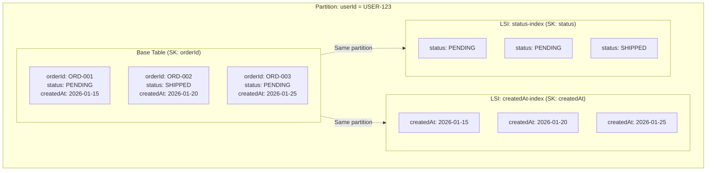
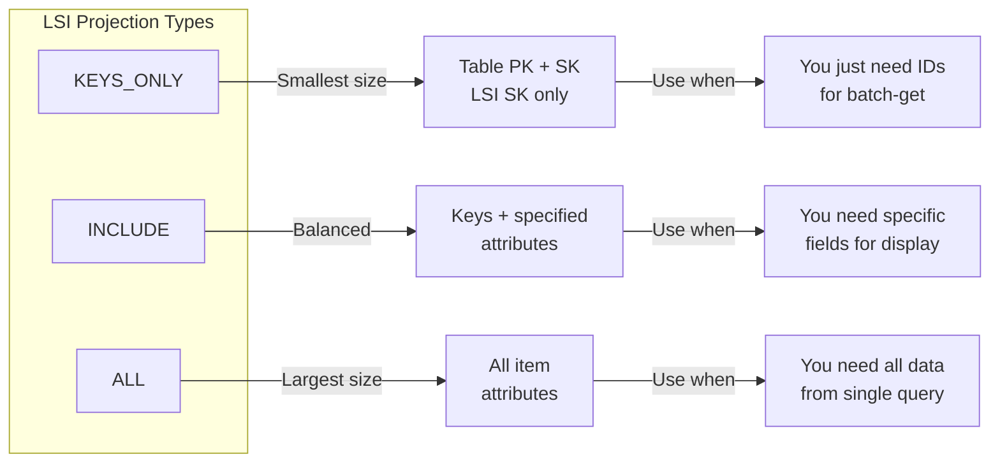
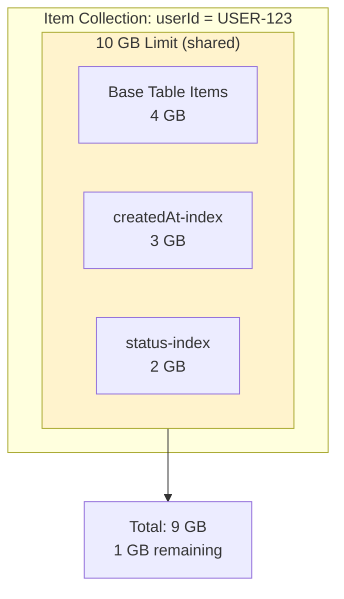

# How to Implement Local Secondary Indexes in DynamoDB

Author: [nawazdhandala](https://www.github.com/nawazdhandala)

Tags: AWS, DynamoDB, NoSQL, Database, Local Secondary Index, LSI, Cloud, Backend

Description: A practical guide to implementing DynamoDB Local Secondary Indexes (LSIs) for efficient queries with alternative sort keys while maintaining the same partition key.

---

DynamoDB tables have a primary key that defines how data is partitioned and sorted. But what happens when you need to sort the same data differently? You could create a Global Secondary Index, but that adds storage costs and introduces eventual consistency. Local Secondary Indexes (LSIs) offer an alternative: they let you query data with a different sort key while sharing the same partition key and providing strongly consistent reads.

## What is a Local Secondary Index?

A Local Secondary Index is an index that shares the same partition key as your base table but uses a different sort key. The "local" part means the index data lives in the same partition as the base table item, which enables strongly consistent reads and eliminates the replication delay you see with Global Secondary Indexes.



Key characteristics of LSIs:

- Share the same partition key as the base table
- Must be created when the table is created (cannot be added later)
- Support strongly consistent reads
- Share throughput capacity with the base table
- Limited to 5 LSIs per table
- Items in LSI count toward the 10 GB partition limit

## LSI vs GSI: When to Use Each

Understanding when to use Local Secondary Indexes versus Global Secondary Indexes is crucial for DynamoDB table design.

| Feature | Local Secondary Index | Global Secondary Index |
|---------|----------------------|------------------------|
| Partition Key | Same as base table | Can be different |
| Sort Key | Different from base table | Can be different |
| Creation Time | Table creation only | Anytime |
| Consistency | Strongly consistent available | Eventually consistent only |
| Throughput | Shared with base table | Separate capacity |
| Limit | 5 per table | 20 per table |
| Storage | Counts toward partition limit | Separate storage |

Use LSIs when:

- You need strongly consistent reads on the alternate sort key
- Your access patterns always include the partition key
- You are designing a new table and know your query patterns upfront
- You want to avoid the additional cost of GSI storage and throughput

Use GSIs when:

- You need to query by a completely different attribute
- You are adding indexes to an existing table
- You can tolerate eventual consistency
- Your data size exceeds partition limits

## Creating a Table with LSIs

LSIs must be defined at table creation time. Here is how to create a table with Local Secondary Indexes using the AWS CLI.

```bash
# Create a DynamoDB table with two Local Secondary Indexes
# The table stores orders with userId as partition key and orderId as sort key
# LSIs allow querying by createdAt or status within the same user partition

aws dynamodb create-table \
    --table-name Orders \
    --attribute-definitions \
        AttributeName=userId,AttributeType=S \
        AttributeName=orderId,AttributeType=S \
        AttributeName=createdAt,AttributeType=S \
        AttributeName=status,AttributeType=S \
    --key-schema \
        AttributeName=userId,KeyType=HASH \
        AttributeName=orderId,KeyType=RANGE \
    --local-secondary-indexes \
        "[
            {
                \"IndexName\": \"createdAt-index\",
                \"KeySchema\": [
                    {\"AttributeName\": \"userId\", \"KeyType\": \"HASH\"},
                    {\"AttributeName\": \"createdAt\", \"KeyType\": \"RANGE\"}
                ],
                \"Projection\": {
                    \"ProjectionType\": \"ALL\"
                }
            },
            {
                \"IndexName\": \"status-index\",
                \"KeySchema\": [
                    {\"AttributeName\": \"userId\", \"KeyType\": \"HASH\"},
                    {\"AttributeName\": \"status\", \"KeyType\": \"RANGE\"}
                ],
                \"Projection\": {
                    \"ProjectionType\": \"INCLUDE\",
                    \"NonKeyAttributes\": [\"total\", \"customerName\"]
                }
            }
        ]" \
    --billing-mode PAY_PER_REQUEST
```

## Creating LSIs with CloudFormation

For infrastructure as code, here is the same table defined in CloudFormation.

```yaml
# CloudFormation template for DynamoDB table with Local Secondary Indexes
# This creates an Orders table with LSIs for querying by date and status

AWSTemplateFormatVersion: '2010-09-09'
Description: Orders table with Local Secondary Indexes

Resources:
  OrdersTable:
    Type: AWS::DynamoDB::Table
    Properties:
      TableName: Orders
      BillingMode: PAY_PER_REQUEST

      # Define all attributes used in keys (table keys + LSI sort keys)
      # Note: You only need to define attributes used in key schemas
      AttributeDefinitions:
        - AttributeName: userId
          AttributeType: S
        - AttributeName: orderId
          AttributeType: S
        - AttributeName: createdAt
          AttributeType: S
        - AttributeName: status
          AttributeType: S

      # Primary key for base table
      KeySchema:
        - AttributeName: userId
          KeyType: HASH
        - AttributeName: orderId
          KeyType: RANGE

      # Local Secondary Index definitions
      # Each LSI must have the same partition key as the table
      LocalSecondaryIndexes:
        # LSI for querying orders by creation date within a user
        - IndexName: createdAt-index
          KeySchema:
            - AttributeName: userId
              KeyType: HASH
            - AttributeName: createdAt
              KeyType: RANGE
          Projection:
            ProjectionType: ALL

        # LSI for querying orders by status within a user
        # Using INCLUDE projection to reduce storage costs
        - IndexName: status-index
          KeySchema:
            - AttributeName: userId
              KeyType: HASH
            - AttributeName: status
              KeyType: RANGE
          Projection:
            ProjectionType: INCLUDE
            NonKeyAttributes:
              - total
              - customerName
              - orderId

Outputs:
  TableName:
    Description: Name of the DynamoDB table
    Value: !Ref OrdersTable
  TableArn:
    Description: ARN of the DynamoDB table
    Value: !GetAtt OrdersTable.Arn
```

## Querying LSIs with Node.js

Once your table has LSIs, you can query them using the AWS SDK. The key difference from base table queries is specifying the IndexName.

```javascript
// query-orders-by-date.js
// Query orders for a user sorted by creation date using LSI

const { DynamoDBClient } = require('@aws-sdk/client-dynamodb');
const {
    DynamoDBDocumentClient,
    QueryCommand
} = require('@aws-sdk/lib-dynamodb');

// Initialize the DynamoDB Document Client
const client = new DynamoDBClient({ region: 'us-east-1' });
const docClient = DynamoDBDocumentClient.from(client);

/**
 * Get orders for a user within a date range, sorted by creation date.
 * Uses the createdAt-index LSI for efficient sorting.
 */
async function getOrdersByDateRange(userId, startDate, endDate) {
    const params = {
        TableName: 'Orders',
        // Specify the LSI name to query
        IndexName: 'createdAt-index',
        // Partition key is required, sort key condition uses the LSI sort key
        KeyConditionExpression: 'userId = :userId AND createdAt BETWEEN :start AND :end',
        ExpressionAttributeValues: {
            ':userId': userId,
            ':start': startDate,
            ':end': endDate
        },
        // Return results in descending order (newest first)
        ScanIndexForward: false
    };

    try {
        const response = await docClient.send(new QueryCommand(params));
        console.log(`Found ${response.Count} orders for user ${userId}`);
        return response.Items;
    } catch (error) {
        console.error('Query failed:', error.message);
        throw error;
    }
}

/**
 * Get the most recent N orders for a user.
 * Uses LSI with ScanIndexForward=false and Limit.
 */
async function getRecentOrders(userId, limit = 10) {
    const params = {
        TableName: 'Orders',
        IndexName: 'createdAt-index',
        KeyConditionExpression: 'userId = :userId',
        ExpressionAttributeValues: {
            ':userId': userId
        },
        // Get newest orders first
        ScanIndexForward: false,
        // Limit results
        Limit: limit
    };

    const response = await docClient.send(new QueryCommand(params));
    return response.Items;
}

// Example usage
async function main() {
    // Get orders from January 2026
    const orders = await getOrdersByDateRange(
        'USER-12345',
        '2026-01-01T00:00:00Z',
        '2026-01-31T23:59:59Z'
    );

    orders.forEach(order => {
        console.log(`${order.createdAt}: Order ${order.orderId} - $${order.total}`);
    });

    // Get 5 most recent orders
    const recent = await getRecentOrders('USER-12345', 5);
    console.log('Recent orders:', recent.map(o => o.orderId));
}

main();
```

## Querying LSIs with Strongly Consistent Reads

One of the main advantages of LSIs is support for strongly consistent reads. This guarantees you see the most recent write.

```javascript
// consistent-read-example.js
// Query LSI with strongly consistent reads

const { QueryCommand } = require('@aws-sdk/lib-dynamodb');

/**
 * Get orders with a specific status using strongly consistent reads.
 * Use this when you need to see updates immediately after writes.
 */
async function getOrdersByStatusConsistent(userId, status) {
    const params = {
        TableName: 'Orders',
        IndexName: 'status-index',
        KeyConditionExpression: 'userId = :userId AND #status = :status',
        // Use expression attribute names for reserved words
        ExpressionAttributeNames: {
            '#status': 'status'
        },
        ExpressionAttributeValues: {
            ':userId': userId,
            ':status': status
        },
        // Enable strongly consistent reads
        // This is NOT available with GSIs
        ConsistentRead: true
    };

    const response = await docClient.send(new QueryCommand(params));
    return response.Items;
}

/**
 * Update order status and immediately query the LSI.
 * Strongly consistent read ensures we see the update.
 */
async function updateAndVerifyStatus(userId, orderId, newStatus) {
    // Update the order status
    await docClient.send(new UpdateCommand({
        TableName: 'Orders',
        Key: { userId, orderId },
        UpdateExpression: 'SET #status = :status, updatedAt = :now',
        ExpressionAttributeNames: { '#status': 'status' },
        ExpressionAttributeValues: {
            ':status': newStatus,
            ':now': new Date().toISOString()
        }
    }));

    // Immediately query with consistent read
    // No need to wait for replication like with GSIs
    const orders = await getOrdersByStatusConsistent(userId, newStatus);

    // The updated order will be in the results
    const updated = orders.find(o => o.orderId === orderId);
    console.log(`Order ${orderId} status verified: ${updated.status}`);

    return updated;
}
```

## Querying LSIs with Python

Here is the equivalent Python code using boto3.

```python
# query_lsi.py
# Query DynamoDB Local Secondary Indexes with Python

import boto3
from boto3.dynamodb.conditions import Key
from datetime import datetime, timedelta
from typing import List, Optional

def get_dynamodb_table():
    """Initialize DynamoDB table resource."""
    dynamodb = boto3.resource('dynamodb', region_name='us-east-1')
    return dynamodb.Table('Orders')


def get_orders_by_date_range(
    user_id: str,
    start_date: str,
    end_date: str,
    ascending: bool = False
) -> List[dict]:
    """
    Query orders for a user within a date range using the createdAt LSI.

    Args:
        user_id: The user's unique identifier
        start_date: ISO format start date
        end_date: ISO format end date
        ascending: If True, return oldest first; if False, newest first

    Returns:
        List of order items sorted by creation date
    """
    table = get_dynamodb_table()

    response = table.query(
        IndexName='createdAt-index',
        KeyConditionExpression=(
            Key('userId').eq(user_id) &
            Key('createdAt').between(start_date, end_date)
        ),
        ScanIndexForward=ascending
    )

    print(f"Found {response['Count']} orders for user {user_id}")
    return response['Items']


def get_orders_by_status(
    user_id: str,
    status: str,
    consistent_read: bool = False
) -> List[dict]:
    """
    Query orders with a specific status using the status LSI.

    Args:
        user_id: The user's unique identifier
        status: Order status to filter by (e.g., 'PENDING', 'SHIPPED')
        consistent_read: Enable strongly consistent reads

    Returns:
        List of orders with the specified status
    """
    table = get_dynamodb_table()

    response = table.query(
        IndexName='status-index',
        KeyConditionExpression=(
            Key('userId').eq(user_id) &
            Key('status').eq(status)
        ),
        # Strongly consistent reads are available with LSIs
        ConsistentRead=consistent_read
    )

    return response['Items']


def get_recent_orders(user_id: str, limit: int = 10) -> List[dict]:
    """
    Get the most recent orders for a user.

    Uses the createdAt LSI with descending sort to efficiently
    retrieve the newest orders without scanning all items.
    """
    table = get_dynamodb_table()

    response = table.query(
        IndexName='createdAt-index',
        KeyConditionExpression=Key('userId').eq(user_id),
        ScanIndexForward=False,  # Descending order
        Limit=limit
    )

    return response['Items']


def get_orders_with_pagination(
    user_id: str,
    page_size: int = 25,
    last_key: Optional[dict] = None
) -> tuple:
    """
    Paginate through orders using the createdAt LSI.

    Returns:
        Tuple of (items, last_evaluated_key)
    """
    table = get_dynamodb_table()

    query_params = {
        'IndexName': 'createdAt-index',
        'KeyConditionExpression': Key('userId').eq(user_id),
        'ScanIndexForward': False,
        'Limit': page_size
    }

    # Continue from previous page if we have a pagination token
    if last_key:
        query_params['ExclusiveStartKey'] = last_key

    response = table.query(**query_params)

    return response['Items'], response.get('LastEvaluatedKey')


if __name__ == '__main__':
    # Example: Get orders from the last 30 days
    end = datetime.utcnow().isoformat() + 'Z'
    start = (datetime.utcnow() - timedelta(days=30)).isoformat() + 'Z'

    orders = get_orders_by_date_range('USER-12345', start, end)
    for order in orders:
        print(f"{order['createdAt']}: {order['orderId']} - ${order.get('total', 0)}")

    # Example: Get pending orders with consistent read
    pending = get_orders_by_status('USER-12345', 'PENDING', consistent_read=True)
    print(f"\nPending orders: {len(pending)}")
```

## Projection Types for LSIs

Like GSIs, LSIs support three projection types that control which attributes are copied to the index.



Important consideration: Unlike GSIs where fetching non-projected attributes requires a separate GetItem call, LSIs can fetch non-projected attributes from the base table automatically. However, this consumes additional read capacity.

```javascript
// projection-fetch-example.js
// Demonstrate fetching non-projected attributes from LSI

const { QueryCommand } = require('@aws-sdk/lib-dynamodb');

/**
 * Query an LSI and request attributes not in the projection.
 * DynamoDB will fetch them from the base table automatically,
 * but this consumes additional read capacity units.
 */
async function getOrdersWithAllAttributes(userId) {
    // Assume status-index only projects: userId, status, orderId, total, customerName
    // We want to also get shippingAddress which is not projected

    const params = {
        TableName: 'Orders',
        IndexName: 'status-index',
        KeyConditionExpression: 'userId = :userId AND #status = :status',
        ExpressionAttributeNames: {
            '#status': 'status'
        },
        ExpressionAttributeValues: {
            ':userId': userId,
            ':status': 'PENDING'
        },
        // Request attributes not in the projection
        // DynamoDB fetches these from the base table
        ProjectionExpression: 'orderId, #status, total, shippingAddress'
    };

    const response = await docClient.send(new QueryCommand(params));

    // Note: Each item fetch from base table costs additional RCUs
    // For large result sets, consider using ALL projection or
    // doing a batch get after the initial query

    return response.Items;
}
```

## Understanding the 10 GB Partition Limit

LSIs share storage with the base table within each partition. This means all items with the same partition key (in both the table and all LSIs) must fit within 10 GB. This is called the "item collection" limit.



To monitor this limit:

```python
# monitor_item_collection.py
# Monitor item collection size to prevent hitting the 10 GB limit

import boto3

def check_item_collection_size(table_name: str, partition_key_value: str) -> dict:
    """
    Check the size of an item collection (all items with the same partition key).

    Returns size information to help monitor the 10 GB limit.
    """
    dynamodb = boto3.client('dynamodb', region_name='us-east-1')

    # Query with ReturnConsumedCapacity to get size metrics
    response = dynamodb.query(
        TableName=table_name,
        KeyConditionExpression='userId = :pk',
        ExpressionAttributeValues={
            ':pk': {'S': partition_key_value}
        },
        Select='COUNT',
        ReturnConsumedCapacity='INDEXES'
    )

    # The ConsumedCapacity includes size information
    consumed = response.get('ConsumedCapacity', {})

    return {
        'partition_key': partition_key_value,
        'item_count': response['Count'],
        'consumed_capacity': consumed
    }


def enable_item_collection_metrics(table_name: str):
    """
    Enable CloudWatch metrics for item collection size.
    This helps monitor partitions approaching the 10 GB limit.
    """
    cloudwatch = boto3.client('cloudwatch', region_name='us-east-1')

    # Create an alarm for large item collections
    cloudwatch.put_metric_alarm(
        AlarmName=f'{table_name}-ItemCollectionSize-Warning',
        MetricName='ItemCollectionSizeBytes',
        Namespace='AWS/DynamoDB',
        Dimensions=[
            {'Name': 'TableName', 'Value': table_name}
        ],
        Statistic='Maximum',
        Period=300,
        EvaluationPeriods=1,
        # Alert at 8 GB (80% of limit)
        Threshold=8 * 1024 * 1024 * 1024,
        ComparisonOperator='GreaterThanThreshold',
        AlarmDescription='Item collection approaching 10 GB limit'
    )

    print(f"Created alarm for {table_name} item collection size")
```

## Best Practices for LSI Design

### 1. Plan LSIs Before Table Creation

Since LSIs cannot be added after table creation, analyze all your access patterns upfront.

```javascript
// access-pattern-analysis.js
// Document access patterns to determine LSI needs

const accessPatterns = {
    baseTable: {
        description: 'Get specific order by userId + orderId',
        keyCondition: 'userId = :pk AND orderId = :sk',
        frequency: 'High',
        needsConsistentRead: true
    },

    lsi1: {
        name: 'createdAt-index',
        description: 'Get user orders sorted by date',
        keyCondition: 'userId = :pk AND createdAt BETWEEN :start AND :end',
        frequency: 'Medium',
        needsConsistentRead: true,
        // LSI is appropriate because:
        // - Same partition key as base table
        // - Needs strongly consistent reads
        // - Known at table creation time
        recommendation: 'LSI'
    },

    lsi2: {
        name: 'status-index',
        description: 'Get user orders by status',
        keyCondition: 'userId = :pk AND status = :status',
        frequency: 'High',
        needsConsistentRead: true,
        recommendation: 'LSI'
    },

    // This pattern needs a GSI, not LSI
    gsi1: {
        name: 'email-index',
        description: 'Find orders by customer email',
        keyCondition: 'email = :pk',
        frequency: 'Low',
        needsConsistentRead: false,
        // GSI because partition key is different from base table
        recommendation: 'GSI'
    }
};
```

### 2. Choose Appropriate Projection Types

```yaml
# projection-strategy.yaml
# Guide for choosing LSI projection types

LocalSecondaryIndexes:
  # Use KEYS_ONLY when you just need to identify items
  # and will fetch full items separately
  - IndexName: audit-index
    Projection:
      ProjectionType: KEYS_ONLY
    UseCase: "Find order IDs for audit, then batch-get full items"

  # Use INCLUDE for specific query result requirements
  # Reduces storage while providing needed data
  - IndexName: status-index
    Projection:
      ProjectionType: INCLUDE
      NonKeyAttributes:
        - total
        - customerName
        - itemCount
    UseCase: "Display order summary in status dashboard"

  # Use ALL when queries need complete item data
  # and you want to avoid fetching from base table
  - IndexName: createdAt-index
    Projection:
      ProjectionType: ALL
    UseCase: "Order history page showing full order details"
```

### 3. Handle Sparse LSI Keys

Items without the LSI sort key attribute are not included in the index. Use this intentionally to create sparse indexes.

```python
# sparse_lsi_example.py
# Use sparse LSI to index only specific items

def create_featured_order(user_id: str, order_id: str, featured_until: str):
    """
    Add a featuredAt attribute to include order in the featured-index LSI.
    Orders without this attribute are not indexed.
    """
    table = get_dynamodb_table()

    table.update_item(
        Key={'userId': user_id, 'orderId': order_id},
        UpdateExpression='SET featuredAt = :featured, featuredUntil = :until',
        ExpressionAttributeValues={
            ':featured': datetime.utcnow().isoformat() + 'Z',
            ':until': featured_until
        }
    )


def remove_from_featured(user_id: str, order_id: str):
    """
    Remove the featuredAt attribute to exclude order from featured-index LSI.
    """
    table = get_dynamodb_table()

    table.update_item(
        Key={'userId': user_id, 'orderId': order_id},
        UpdateExpression='REMOVE featuredAt, featuredUntil'
    )


def get_featured_orders(user_id: str) -> list:
    """
    Query only featured orders using the sparse featured-index LSI.
    This is more efficient than scanning all orders with a filter.
    """
    table = get_dynamodb_table()

    response = table.query(
        IndexName='featured-index',
        KeyConditionExpression=Key('userId').eq(user_id)
    )

    return response['Items']
```

## Common Mistakes to Avoid

| Mistake | Problem | Solution |
|---------|---------|----------|
| Trying to add LSI to existing table | Operation fails | Plan LSIs during table design phase |
| Using LSI when partition key differs | Not possible | Use GSI for different partition keys |
| Ignoring 10 GB item collection limit | Write failures | Monitor collection size, distribute data |
| Projecting ALL when not needed | Higher storage costs | Use INCLUDE with specific attributes |
| Not using ConsistentRead when needed | Stale data | Set ConsistentRead: true for critical queries |
| Creating too many LSIs | Reaching 5 LSI limit | Consolidate similar access patterns |

## Monitoring LSI Performance

Set up CloudWatch alarms to monitor LSI health.

```python
# monitor_lsi.py
# Set up monitoring for Local Secondary Indexes

import boto3

def setup_lsi_monitoring(table_name: str):
    """
    Create CloudWatch alarms for LSI monitoring.
    """
    cloudwatch = boto3.client('cloudwatch', region_name='us-east-1')

    # Monitor read throttling
    cloudwatch.put_metric_alarm(
        AlarmName=f'{table_name}-LSI-ReadThrottle',
        MetricName='ReadThrottleEvents',
        Namespace='AWS/DynamoDB',
        Dimensions=[
            {'Name': 'TableName', 'Value': table_name}
        ],
        Statistic='Sum',
        Period=60,
        EvaluationPeriods=1,
        Threshold=1,
        ComparisonOperator='GreaterThanOrEqualToThreshold',
        AlarmDescription='LSI read throttling detected'
    )

    # Monitor consumed read capacity
    cloudwatch.put_metric_alarm(
        AlarmName=f'{table_name}-LSI-HighReadCapacity',
        MetricName='ConsumedReadCapacityUnits',
        Namespace='AWS/DynamoDB',
        Dimensions=[
            {'Name': 'TableName', 'Value': table_name}
        ],
        Statistic='Sum',
        Period=300,
        EvaluationPeriods=2,
        Threshold=1000,  # Adjust based on your baseline
        ComparisonOperator='GreaterThanThreshold',
        AlarmDescription='High LSI read capacity consumption'
    )

    print(f"Created monitoring alarms for {table_name}")


def get_lsi_metrics(table_name: str, index_name: str, hours: int = 1) -> dict:
    """
    Get CloudWatch metrics for an LSI.
    """
    cloudwatch = boto3.client('cloudwatch', region_name='us-east-1')

    end_time = datetime.utcnow()
    start_time = end_time - timedelta(hours=hours)

    metrics = {}

    for metric_name in ['ConsumedReadCapacityUnits', 'ReadThrottleEvents']:
        response = cloudwatch.get_metric_statistics(
            Namespace='AWS/DynamoDB',
            MetricName=metric_name,
            Dimensions=[
                {'Name': 'TableName', 'Value': table_name},
                {'Name': 'LocalSecondaryIndexName', 'Value': index_name}
            ],
            StartTime=start_time,
            EndTime=end_time,
            Period=300,
            Statistics=['Sum', 'Average']
        )

        metrics[metric_name] = response['Datapoints']

    return metrics
```

## Summary

Local Secondary Indexes provide an efficient way to query DynamoDB data with alternative sort keys while maintaining the same partition key. They offer strongly consistent reads, share throughput with the base table, and must be planned during table creation.

Key takeaways:

- LSIs share the partition key with the base table but use a different sort key
- They must be created when the table is created (maximum 5 per table)
- Strongly consistent reads are supported, unlike GSIs
- All items in an LSI share the 10 GB item collection limit with the base table
- Choose projection types carefully to balance storage costs and query flexibility
- Use sparse indexes to efficiently query subsets of your data

Plan your LSIs based on access patterns that require sorting within the same partition key. For queries that need a different partition key, use Global Secondary Indexes instead.

---

Need to monitor your DynamoDB tables and LSI performance in production? [OneUptime](https://oneuptime.com) provides comprehensive infrastructure monitoring, alerting, and incident management to help you keep your database-powered applications running smoothly. Track query latencies, capacity utilization, and throttling events in one unified platform.
