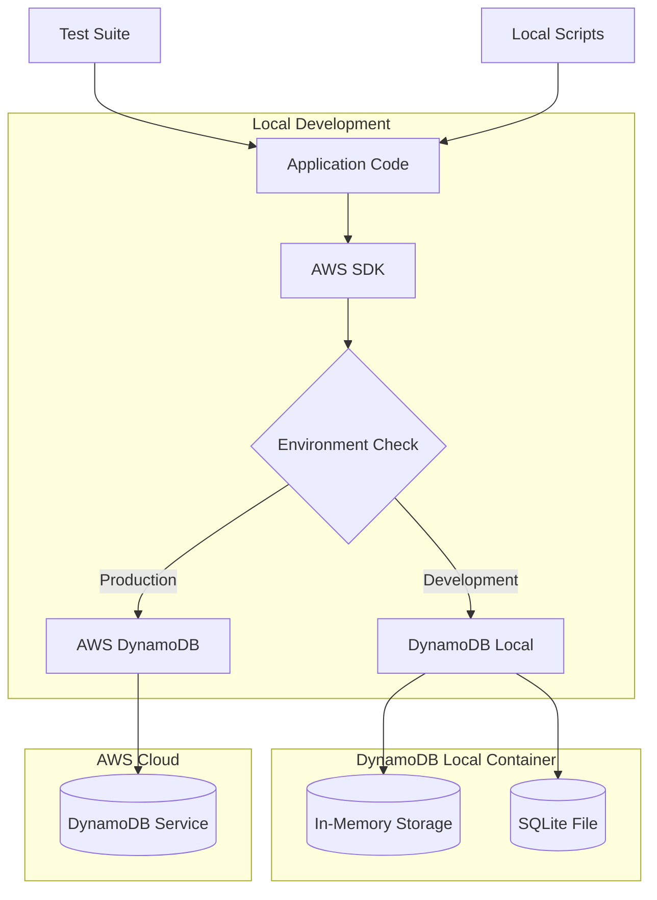
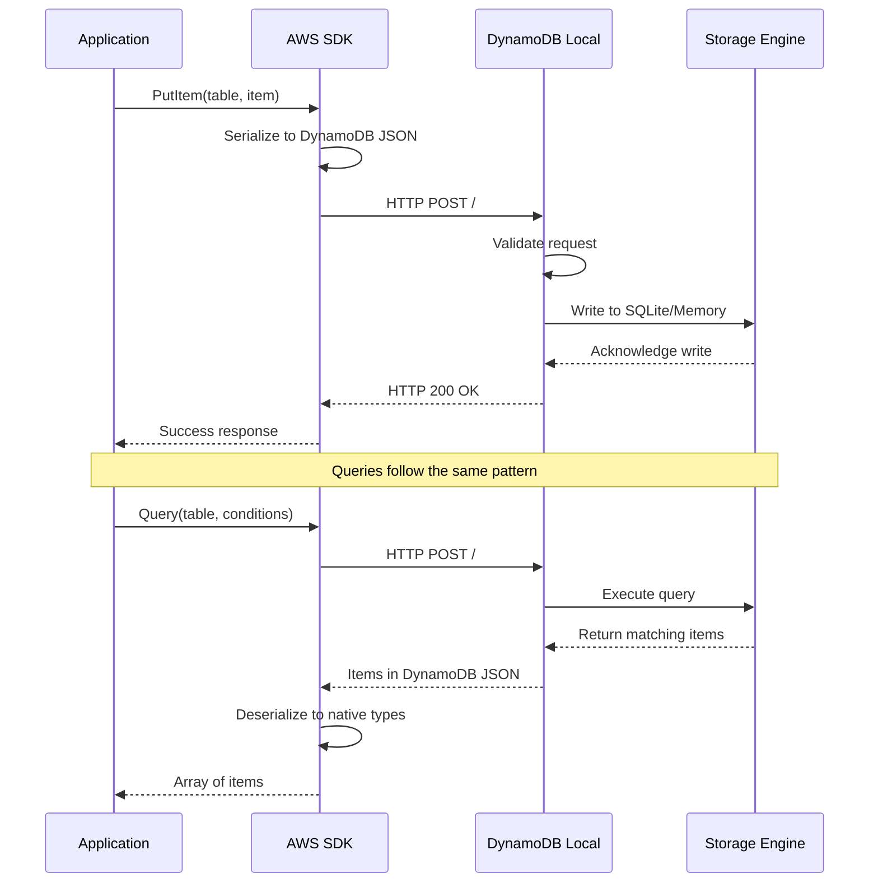
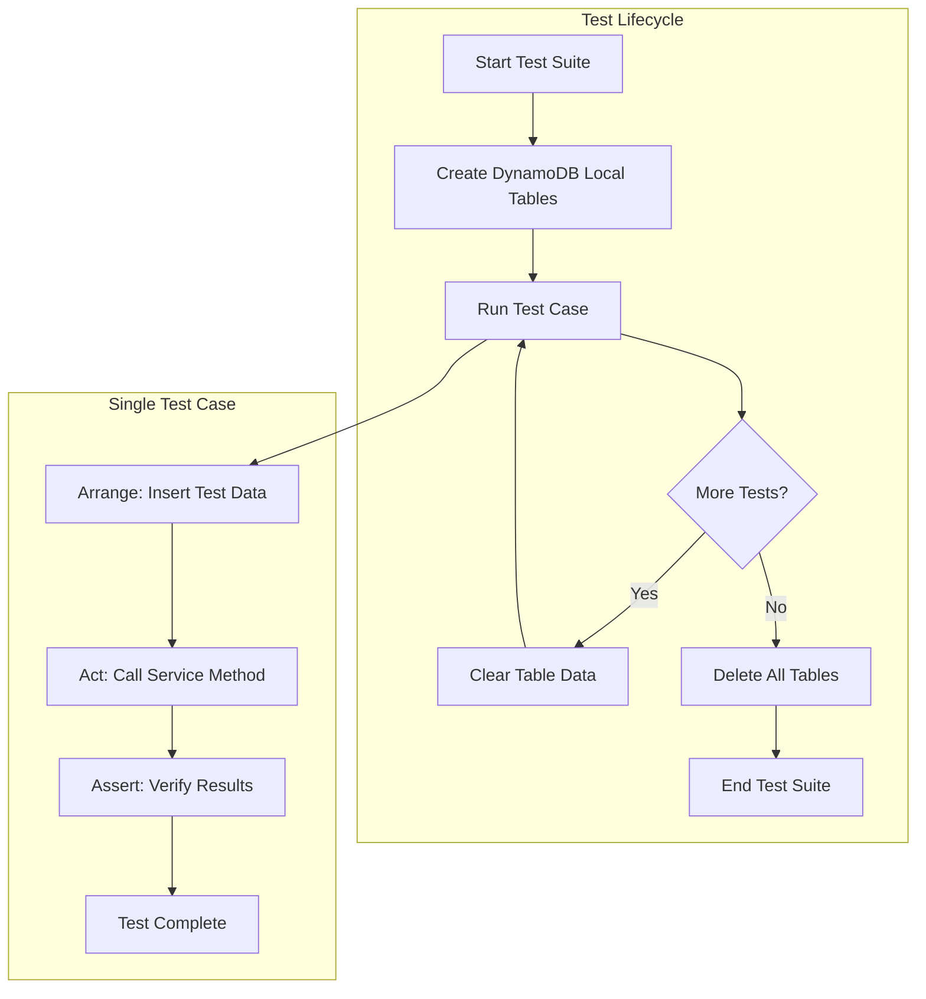
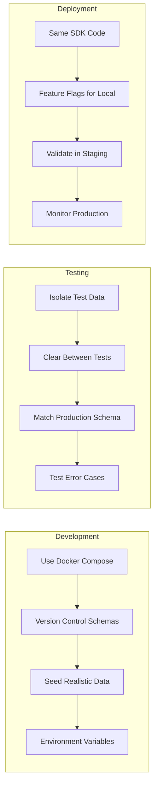

# How to Use DynamoDB Local for Development

Author: [nawazdhandala](https://github.com/nawazdhandala)

Tags: DynamoDB, AWS, Database, Local Development, Docker, NoSQL, Testing

Description: Learn how to set up and use DynamoDB Local for faster, cost-free development and testing. Covers Docker setup, AWS SDK configuration, table management, data seeding, and integration testing patterns.

---

> Developing against AWS DynamoDB in the cloud means waiting for network round trips and accumulating costs with every test run. DynamoDB Local eliminates both problems by running a fully functional DynamoDB instance on your machine.

DynamoDB Local is an official AWS tool that simulates the DynamoDB service on your local computer. Your application code interacts with DynamoDB Local using the same AWS SDK calls it would use in production, making it easy to develop, debug, and test without touching AWS infrastructure.

---

## Why Use DynamoDB Local?

Cloud-based development has limitations that slow down your workflow:

- **Cost accumulation**: Every read and write operation costs money, and test suites can rack up significant charges
- **Network latency**: Round trips to AWS add 50-200ms to every operation
- **Rate limiting**: Heavy testing can trigger throttling, breaking test reliability
- **Team isolation**: Multiple developers sharing tables leads to data conflicts

DynamoDB Local solves these problems:

- **Zero cost**: Run unlimited operations without any AWS charges
- **Instant responses**: Sub-millisecond latency for all operations
- **Complete isolation**: Each developer has their own independent database
- **Offline capable**: Work on planes, trains, or anywhere without internet

---

## Architecture Overview

Understanding how DynamoDB Local fits into your development workflow helps you configure it correctly.



The AWS SDK connects to DynamoDB Local by overriding the endpoint URL. All table operations, queries, and scans work identically to the cloud service, with minor exceptions documented by AWS.

---

## Setting Up DynamoDB Local with Docker

Docker provides the simplest way to run DynamoDB Local. The official Amazon image requires no configuration.

Pull and run the DynamoDB Local container with this command, which maps port 8000 for SDK connections.

```bash
# Pull the official Amazon DynamoDB Local image
docker pull amazon/dynamodb-local

# Run DynamoDB Local with in-memory storage (data lost on restart)
docker run -d \
  --name dynamodb-local \
  -p 8000:8000 \
  amazon/dynamodb-local

# Verify the container is running
docker ps | grep dynamodb-local
```

For persistent storage during development, mount a volume to preserve data between container restarts.

```bash
# Create a directory for DynamoDB data
mkdir -p ~/dynamodb-data

# Run with persistent storage using SQLite backend
docker run -d \
  --name dynamodb-local-persistent \
  -p 8000:8000 \
  -v ~/dynamodb-data:/home/dynamodblocal/data \
  amazon/dynamodb-local \
  -jar DynamoDBLocal.jar -sharedDb -dbPath /home/dynamodblocal/data
```

The `-sharedDb` flag stores all tables in a single database file, simplifying data management. Without this flag, DynamoDB Local creates separate files for each access key and region combination.

---

## Docker Compose Configuration

For projects with multiple services, Docker Compose manages DynamoDB Local alongside your application containers.

Create a docker-compose.yml file that defines the DynamoDB Local service and any dependent applications.

```yaml
# docker-compose.yml - DynamoDB Local development environment
version: '3.8'

services:
  dynamodb-local:
    image: amazon/dynamodb-local:latest
    container_name: dynamodb-local
    ports:
      - "8000:8000"
    # Use in-memory storage for fast test execution
    command: -jar DynamoDBLocal.jar -inMemory -sharedDb
    healthcheck:
      test: ["CMD-SHELL", "curl -f http://localhost:8000 || exit 1"]
      interval: 10s
      timeout: 5s
      retries: 3
    networks:
      - app-network

  # Your application service
  app:
    build: .
    depends_on:
      dynamodb-local:
        condition: service_healthy
    environment:
      - AWS_ACCESS_KEY_ID=local
      - AWS_SECRET_ACCESS_KEY=local
      - AWS_REGION=us-east-1
      - DYNAMODB_ENDPOINT=http://dynamodb-local:8000
    networks:
      - app-network

  # Admin UI for visualizing tables (optional)
  dynamodb-admin:
    image: aaronshaf/dynamodb-admin
    container_name: dynamodb-admin
    ports:
      - "8001:8001"
    environment:
      - DYNAMO_ENDPOINT=http://dynamodb-local:8000
    depends_on:
      - dynamodb-local
    networks:
      - app-network

networks:
  app-network:
    driver: bridge
```

Start the entire stack with a single command.

```bash
# Start all services
docker-compose up -d

# View logs
docker-compose logs -f dynamodb-local

# Stop all services
docker-compose down
```

---

## Configuring the AWS SDK

Your application needs to connect to DynamoDB Local during development while still supporting production AWS connections. Environment-based configuration makes this seamless.

Configure the AWS SDK v3 for JavaScript/TypeScript to use DynamoDB Local when the endpoint environment variable is set.

```javascript
// config/dynamodb.js - DynamoDB client configuration
const { DynamoDBClient } = require('@aws-sdk/client-dynamodb');
const { DynamoDBDocumentClient } = require('@aws-sdk/lib-dynamodb');

function createDynamoDBClient() {
  // Base configuration for the DynamoDB client
  const config = {
    region: process.env.AWS_REGION || 'us-east-1',
  };

  // Override endpoint for local development
  // When DYNAMODB_ENDPOINT is set, connect to DynamoDB Local
  if (process.env.DYNAMODB_ENDPOINT) {
    config.endpoint = process.env.DYNAMODB_ENDPOINT;
    // Local credentials - can be any non-empty string
    config.credentials = {
      accessKeyId: process.env.AWS_ACCESS_KEY_ID || 'local',
      secretAccessKey: process.env.AWS_SECRET_ACCESS_KEY || 'local',
    };
  }

  // Create the low-level DynamoDB client
  const client = new DynamoDBClient(config);

  // Wrap with DocumentClient for easier JSON handling
  // The marshallOptions convert JavaScript types to DynamoDB types automatically
  const documentClient = DynamoDBDocumentClient.from(client, {
    marshallOptions: {
      removeUndefinedValues: true,  // Ignore undefined values in objects
      convertEmptyValues: false,     // Do not convert empty strings to null
    },
    unmarshallOptions: {
      wrapNumbers: false,  // Return numbers as JavaScript numbers, not strings
    },
  });

  return { client, documentClient };
}

module.exports = { createDynamoDBClient };
```

For Python applications using boto3, configure the client similarly with environment-based endpoint override.

```python
# config/dynamodb.py - DynamoDB client configuration for Python
import os
import boto3
from botocore.config import Config

def create_dynamodb_client():
    """
    Create a DynamoDB client that connects to either
    DynamoDB Local (development) or AWS (production).
    """
    # Configuration for retry behavior and timeouts
    config = Config(
        retries={'max_attempts': 3, 'mode': 'standard'},
        connect_timeout=5,
        read_timeout=30,
    )

    # Check if we should connect to DynamoDB Local
    endpoint_url = os.environ.get('DYNAMODB_ENDPOINT')

    if endpoint_url:
        # Development mode - connect to DynamoDB Local
        client = boto3.client(
            'dynamodb',
            endpoint_url=endpoint_url,
            region_name=os.environ.get('AWS_REGION', 'us-east-1'),
            # Local credentials - any non-empty values work
            aws_access_key_id=os.environ.get('AWS_ACCESS_KEY_ID', 'local'),
            aws_secret_access_key=os.environ.get('AWS_SECRET_ACCESS_KEY', 'local'),
            config=config,
        )
    else:
        # Production mode - use IAM credentials from environment or instance role
        client = boto3.client(
            'dynamodb',
            region_name=os.environ.get('AWS_REGION', 'us-east-1'),
            config=config,
        )

    return client


def create_dynamodb_resource():
    """
    Create a DynamoDB resource for higher-level table operations.
    """
    endpoint_url = os.environ.get('DYNAMODB_ENDPOINT')

    if endpoint_url:
        resource = boto3.resource(
            'dynamodb',
            endpoint_url=endpoint_url,
            region_name=os.environ.get('AWS_REGION', 'us-east-1'),
            aws_access_key_id=os.environ.get('AWS_ACCESS_KEY_ID', 'local'),
            aws_secret_access_key=os.environ.get('AWS_SECRET_ACCESS_KEY', 'local'),
        )
    else:
        resource = boto3.resource(
            'dynamodb',
            region_name=os.environ.get('AWS_REGION', 'us-east-1'),
        )

    return resource
```

---

## Data Flow with DynamoDB Local

Understanding the request flow helps debug connection issues and optimize performance.



All communication uses HTTP on port 8000. The SDK handles serialization between JavaScript/Python objects and DynamoDB's JSON format automatically.

---

## Creating Tables Programmatically

Your application should create tables automatically during development setup. Define table schemas in code for version control and reproducibility.

Create a table setup script that defines your schema and indexes in a reusable format.

```javascript
// scripts/create-tables.js - Create DynamoDB tables for development
const { DynamoDBClient, CreateTableCommand, DescribeTableCommand } = require('@aws-sdk/client-dynamodb');

// Table definitions - modify these to match your application schema
const tableDefinitions = [
  {
    TableName: 'Users',
    KeySchema: [
      { AttributeName: 'userId', KeyType: 'HASH' },  // Partition key
    ],
    AttributeDefinitions: [
      { AttributeName: 'userId', AttributeType: 'S' },
      { AttributeName: 'email', AttributeType: 'S' },
      { AttributeName: 'createdAt', AttributeType: 'S' },
    ],
    // Global Secondary Index for querying by email
    GlobalSecondaryIndexes: [
      {
        IndexName: 'EmailIndex',
        KeySchema: [
          { AttributeName: 'email', KeyType: 'HASH' },
        ],
        Projection: { ProjectionType: 'ALL' },
        ProvisionedThroughput: { ReadCapacityUnits: 5, WriteCapacityUnits: 5 },
      },
    ],
    ProvisionedThroughput: { ReadCapacityUnits: 5, WriteCapacityUnits: 5 },
  },
  {
    TableName: 'Orders',
    KeySchema: [
      { AttributeName: 'userId', KeyType: 'HASH' },    // Partition key
      { AttributeName: 'orderId', KeyType: 'RANGE' },  // Sort key
    ],
    AttributeDefinitions: [
      { AttributeName: 'userId', AttributeType: 'S' },
      { AttributeName: 'orderId', AttributeType: 'S' },
      { AttributeName: 'status', AttributeType: 'S' },
      { AttributeName: 'createdAt', AttributeType: 'S' },
    ],
    // GSI for querying orders by status
    GlobalSecondaryIndexes: [
      {
        IndexName: 'StatusIndex',
        KeySchema: [
          { AttributeName: 'status', KeyType: 'HASH' },
          { AttributeName: 'createdAt', KeyType: 'RANGE' },
        ],
        Projection: { ProjectionType: 'ALL' },
        ProvisionedThroughput: { ReadCapacityUnits: 5, WriteCapacityUnits: 5 },
      },
    ],
    ProvisionedThroughput: { ReadCapacityUnits: 5, WriteCapacityUnits: 5 },
  },
  {
    TableName: 'Sessions',
    KeySchema: [
      { AttributeName: 'sessionId', KeyType: 'HASH' },
    ],
    AttributeDefinitions: [
      { AttributeName: 'sessionId', AttributeType: 'S' },
    ],
    // Enable TTL for automatic session expiration
    TimeToLiveSpecification: {
      Enabled: true,
      AttributeName: 'expiresAt',
    },
    ProvisionedThroughput: { ReadCapacityUnits: 5, WriteCapacityUnits: 5 },
  },
];

async function createTables() {
  const client = new DynamoDBClient({
    endpoint: process.env.DYNAMODB_ENDPOINT || 'http://localhost:8000',
    region: 'us-east-1',
    credentials: {
      accessKeyId: 'local',
      secretAccessKey: 'local',
    },
  });

  for (const tableDefinition of tableDefinitions) {
    const tableName = tableDefinition.TableName;

    try {
      // Check if table already exists
      await client.send(new DescribeTableCommand({ TableName: tableName }));
      console.log(`Table ${tableName} already exists, skipping creation`);
    } catch (error) {
      if (error.name === 'ResourceNotFoundException') {
        // Table does not exist, create it
        console.log(`Creating table: ${tableName}`);
        await client.send(new CreateTableCommand(tableDefinition));
        console.log(`Table ${tableName} created successfully`);
      } else {
        throw error;
      }
    }
  }

  console.log('All tables ready');
}

// Run if executed directly
if (require.main === module) {
  createTables().catch(console.error);
}

module.exports = { createTables, tableDefinitions };
```

---

## Seeding Test Data

Populate your local database with realistic test data to enable meaningful development and testing.

```javascript
// scripts/seed-data.js - Seed DynamoDB Local with test data
const { DynamoDBDocumentClient, PutCommand, BatchWriteCommand } = require('@aws-sdk/lib-dynamodb');
const { DynamoDBClient } = require('@aws-sdk/client-dynamodb');
const { v4: uuidv4 } = require('uuid');

// Create document client for easier data handling
const client = new DynamoDBClient({
  endpoint: process.env.DYNAMODB_ENDPOINT || 'http://localhost:8000',
  region: 'us-east-1',
  credentials: { accessKeyId: 'local', secretAccessKey: 'local' },
});

const docClient = DynamoDBDocumentClient.from(client);

// Generate realistic test users
function generateUsers(count) {
  const users = [];
  const domains = ['example.com', 'test.org', 'sample.net'];

  for (let i = 0; i < count; i++) {
    const firstName = ['Alice', 'Bob', 'Carol', 'David', 'Eve'][i % 5];
    const lastName = ['Smith', 'Johnson', 'Williams', 'Brown', 'Jones'][Math.floor(i / 5) % 5];

    users.push({
      userId: uuidv4(),
      email: `${firstName.toLowerCase()}.${lastName.toLowerCase()}${i}@${domains[i % 3]}`,
      firstName,
      lastName,
      createdAt: new Date(Date.now() - Math.random() * 365 * 24 * 60 * 60 * 1000).toISOString(),
      status: ['active', 'inactive', 'pending'][i % 3],
      preferences: {
        notifications: i % 2 === 0,
        theme: ['light', 'dark'][i % 2],
      },
    });
  }

  return users;
}

// Generate orders for users
function generateOrders(users) {
  const orders = [];
  const statuses = ['pending', 'processing', 'shipped', 'delivered', 'cancelled'];

  users.forEach(user => {
    // Each user gets 1-5 orders
    const orderCount = Math.floor(Math.random() * 5) + 1;

    for (let i = 0; i < orderCount; i++) {
      orders.push({
        userId: user.userId,
        orderId: uuidv4(),
        status: statuses[Math.floor(Math.random() * statuses.length)],
        createdAt: new Date(Date.now() - Math.random() * 90 * 24 * 60 * 60 * 1000).toISOString(),
        total: parseFloat((Math.random() * 500 + 10).toFixed(2)),
        items: [
          {
            productId: `PROD-${Math.floor(Math.random() * 1000)}`,
            name: `Product ${i + 1}`,
            quantity: Math.floor(Math.random() * 5) + 1,
            price: parseFloat((Math.random() * 100 + 5).toFixed(2)),
          },
        ],
      });
    }
  });

  return orders;
}

// Batch write items in groups of 25 (DynamoDB limit)
async function batchWriteItems(tableName, items) {
  const batchSize = 25;

  for (let i = 0; i < items.length; i += batchSize) {
    const batch = items.slice(i, i + batchSize);

    const requestItems = {
      [tableName]: batch.map(item => ({
        PutRequest: { Item: item },
      })),
    };

    await docClient.send(new BatchWriteCommand({ RequestItems: requestItems }));
    console.log(`Wrote ${Math.min(i + batchSize, items.length)}/${items.length} items to ${tableName}`);
  }
}

async function seedDatabase() {
  console.log('Seeding database with test data...\n');

  // Generate and insert users
  const users = generateUsers(50);
  console.log(`Generated ${users.length} users`);
  await batchWriteItems('Users', users);

  // Generate and insert orders
  const orders = generateOrders(users);
  console.log(`\nGenerated ${orders.length} orders`);
  await batchWriteItems('Orders', orders);

  // Create some test sessions
  const sessions = users.slice(0, 10).map(user => ({
    sessionId: uuidv4(),
    userId: user.userId,
    createdAt: new Date().toISOString(),
    expiresAt: Math.floor(Date.now() / 1000) + 3600,  // Expires in 1 hour (Unix timestamp)
    userAgent: 'Mozilla/5.0 (Test Browser)',
  }));

  console.log(`\nGenerated ${sessions.length} sessions`);
  await batchWriteItems('Sessions', sessions);

  console.log('\nDatabase seeding complete!');
}

// Run if executed directly
if (require.main === module) {
  seedDatabase().catch(console.error);
}

module.exports = { seedDatabase, generateUsers, generateOrders };
```

---

## CRUD Operations Example

Build a complete data access layer that works seamlessly with both DynamoDB Local and production AWS.

```javascript
// services/user-service.js - User data access layer
const { DynamoDBDocumentClient, GetCommand, PutCommand, UpdateCommand, DeleteCommand, QueryCommand } = require('@aws-sdk/lib-dynamodb');
const { DynamoDBClient } = require('@aws-sdk/client-dynamodb');
const { v4: uuidv4 } = require('uuid');

class UserService {
  constructor() {
    // Create client based on environment
    const clientConfig = {
      region: process.env.AWS_REGION || 'us-east-1',
    };

    if (process.env.DYNAMODB_ENDPOINT) {
      clientConfig.endpoint = process.env.DYNAMODB_ENDPOINT;
      clientConfig.credentials = {
        accessKeyId: 'local',
        secretAccessKey: 'local',
      };
    }

    const client = new DynamoDBClient(clientConfig);
    this.docClient = DynamoDBDocumentClient.from(client);
    this.tableName = 'Users';
  }

  // Create a new user
  async createUser(userData) {
    const user = {
      userId: uuidv4(),
      ...userData,
      createdAt: new Date().toISOString(),
      updatedAt: new Date().toISOString(),
    };

    await this.docClient.send(new PutCommand({
      TableName: this.tableName,
      Item: user,
      // Prevent overwriting existing users with same ID
      ConditionExpression: 'attribute_not_exists(userId)',
    }));

    return user;
  }

  // Get user by ID
  async getUserById(userId) {
    const result = await this.docClient.send(new GetCommand({
      TableName: this.tableName,
      Key: { userId },
    }));

    return result.Item || null;
  }

  // Get user by email using GSI
  async getUserByEmail(email) {
    const result = await this.docClient.send(new QueryCommand({
      TableName: this.tableName,
      IndexName: 'EmailIndex',
      KeyConditionExpression: 'email = :email',
      ExpressionAttributeValues: {
        ':email': email,
      },
    }));

    return result.Items?.[0] || null;
  }

  // Update user attributes
  async updateUser(userId, updates) {
    // Build update expression dynamically
    const updateParts = [];
    const expressionAttributeNames = {};
    const expressionAttributeValues = {};

    Object.entries(updates).forEach(([key, value], index) => {
      const nameKey = `#attr${index}`;
      const valueKey = `:val${index}`;

      updateParts.push(`${nameKey} = ${valueKey}`);
      expressionAttributeNames[nameKey] = key;
      expressionAttributeValues[valueKey] = value;
    });

    // Always update the updatedAt timestamp
    updateParts.push('#updatedAt = :updatedAt');
    expressionAttributeNames['#updatedAt'] = 'updatedAt';
    expressionAttributeValues[':updatedAt'] = new Date().toISOString();

    const result = await this.docClient.send(new UpdateCommand({
      TableName: this.tableName,
      Key: { userId },
      UpdateExpression: `SET ${updateParts.join(', ')}`,
      ExpressionAttributeNames: expressionAttributeNames,
      ExpressionAttributeValues: expressionAttributeValues,
      ReturnValues: 'ALL_NEW',
    }));

    return result.Attributes;
  }

  // Delete user
  async deleteUser(userId) {
    await this.docClient.send(new DeleteCommand({
      TableName: this.tableName,
      Key: { userId },
    }));

    return true;
  }

  // List users with pagination
  async listUsers(limit = 20, lastEvaluatedKey = null) {
    const params = {
      TableName: this.tableName,
      Limit: limit,
    };

    if (lastEvaluatedKey) {
      params.ExclusiveStartKey = lastEvaluatedKey;
    }

    const result = await this.docClient.send(new ScanCommand(params));

    return {
      users: result.Items,
      lastKey: result.LastEvaluatedKey,
      hasMore: !!result.LastEvaluatedKey,
    };
  }
}

module.exports = { UserService };
```

---

## Integration Testing Patterns

DynamoDB Local enables fast, reliable integration tests without AWS dependencies. Set up a test harness that creates isolated tables for each test run.

```javascript
// tests/helpers/dynamodb-test-helper.js - Test setup utilities
const { DynamoDBClient, CreateTableCommand, DeleteTableCommand, ListTablesCommand } = require('@aws-sdk/client-dynamodb');
const { DynamoDBDocumentClient } = require('@aws-sdk/lib-dynamodb');
const { tableDefinitions } = require('../../scripts/create-tables');

class DynamoDBTestHelper {
  constructor() {
    this.client = new DynamoDBClient({
      endpoint: 'http://localhost:8000',
      region: 'us-east-1',
      credentials: {
        accessKeyId: 'local',
        secretAccessKey: 'local',
      },
    });
    this.docClient = DynamoDBDocumentClient.from(this.client);
  }

  // Create all tables before tests
  async setupTables() {
    for (const definition of tableDefinitions) {
      try {
        await this.client.send(new CreateTableCommand(definition));
      } catch (error) {
        if (error.name !== 'ResourceInUseException') {
          throw error;
        }
        // Table already exists, which is fine
      }
    }
  }

  // Delete all tables after tests
  async teardownTables() {
    const listResult = await this.client.send(new ListTablesCommand({}));

    for (const tableName of listResult.TableNames || []) {
      await this.client.send(new DeleteTableCommand({ TableName: tableName }));
    }
  }

  // Clear all items from a table without deleting the table
  async clearTable(tableName) {
    const { ScanCommand, BatchWriteCommand } = require('@aws-sdk/lib-dynamodb');

    // Get all items
    const scanResult = await this.docClient.send(new ScanCommand({
      TableName: tableName,
    }));

    if (!scanResult.Items || scanResult.Items.length === 0) {
      return;
    }

    // Delete in batches of 25
    const keySchema = tableDefinitions
      .find(t => t.TableName === tableName)
      ?.KeySchema || [];

    const keyAttributes = keySchema.map(k => k.AttributeName);

    const deleteRequests = scanResult.Items.map(item => ({
      DeleteRequest: {
        Key: Object.fromEntries(keyAttributes.map(attr => [attr, item[attr]])),
      },
    }));

    for (let i = 0; i < deleteRequests.length; i += 25) {
      const batch = deleteRequests.slice(i, i + 25);
      await this.docClient.send(new BatchWriteCommand({
        RequestItems: { [tableName]: batch },
      }));
    }
  }
}

module.exports = { DynamoDBTestHelper };
```

Write tests that use the helper for proper setup and teardown.

```javascript
// tests/user-service.test.js - Integration tests for UserService
const { DynamoDBTestHelper } = require('./helpers/dynamodb-test-helper');
const { UserService } = require('../services/user-service');

describe('UserService', () => {
  let helper;
  let userService;

  // Set environment for DynamoDB Local
  beforeAll(async () => {
    process.env.DYNAMODB_ENDPOINT = 'http://localhost:8000';
    helper = new DynamoDBTestHelper();
    await helper.setupTables();
  });

  // Clean up tables after all tests
  afterAll(async () => {
    await helper.teardownTables();
  });

  // Clear data between tests for isolation
  beforeEach(async () => {
    await helper.clearTable('Users');
    userService = new UserService();
  });

  describe('createUser', () => {
    it('should create a new user with generated ID', async () => {
      const userData = {
        email: 'test@example.com',
        firstName: 'Test',
        lastName: 'User',
      };

      const user = await userService.createUser(userData);

      expect(user.userId).toBeDefined();
      expect(user.email).toBe('test@example.com');
      expect(user.createdAt).toBeDefined();
    });

    it('should not allow duplicate user IDs', async () => {
      const userData = {
        email: 'test@example.com',
        firstName: 'Test',
        lastName: 'User',
      };

      await userService.createUser(userData);

      // Attempting to create with same ID should fail
      // Note: In practice, UUIDs are unique, but this tests the condition
    });
  });

  describe('getUserById', () => {
    it('should retrieve an existing user', async () => {
      const created = await userService.createUser({
        email: 'find@example.com',
        firstName: 'Find',
        lastName: 'Me',
      });

      const found = await userService.getUserById(created.userId);

      expect(found).not.toBeNull();
      expect(found.email).toBe('find@example.com');
    });

    it('should return null for non-existent user', async () => {
      const found = await userService.getUserById('non-existent-id');

      expect(found).toBeNull();
    });
  });

  describe('getUserByEmail', () => {
    it('should find user by email using GSI', async () => {
      await userService.createUser({
        email: 'gsi-test@example.com',
        firstName: 'GSI',
        lastName: 'Test',
      });

      const found = await userService.getUserByEmail('gsi-test@example.com');

      expect(found).not.toBeNull();
      expect(found.firstName).toBe('GSI');
    });
  });

  describe('updateUser', () => {
    it('should update user attributes', async () => {
      const user = await userService.createUser({
        email: 'update@example.com',
        firstName: 'Before',
        lastName: 'Update',
      });

      const updated = await userService.updateUser(user.userId, {
        firstName: 'After',
        status: 'active',
      });

      expect(updated.firstName).toBe('After');
      expect(updated.status).toBe('active');
      expect(updated.lastName).toBe('Update');  // Unchanged
    });
  });

  describe('deleteUser', () => {
    it('should remove user from database', async () => {
      const user = await userService.createUser({
        email: 'delete@example.com',
        firstName: 'Delete',
        lastName: 'Me',
      });

      await userService.deleteUser(user.userId);

      const found = await userService.getUserById(user.userId);
      expect(found).toBeNull();
    });
  });
});
```

---

## Testing Workflow Visualization

A well-structured test workflow ensures consistent and reliable test execution.



---

## Using the AWS CLI with DynamoDB Local

The AWS CLI can interact with DynamoDB Local for ad-hoc queries and debugging. Override the endpoint for local operations.

```bash
# List tables in DynamoDB Local
aws dynamodb list-tables --endpoint-url http://localhost:8000

# Scan a table to see all items
aws dynamodb scan \
  --table-name Users \
  --endpoint-url http://localhost:8000

# Query items with a specific key
aws dynamodb query \
  --table-name Orders \
  --key-condition-expression "userId = :uid" \
  --expression-attribute-values '{":uid": {"S": "user-123"}}' \
  --endpoint-url http://localhost:8000

# Put a single item
aws dynamodb put-item \
  --table-name Users \
  --item '{"userId": {"S": "cli-user"}, "email": {"S": "cli@example.com"}}' \
  --endpoint-url http://localhost:8000

# Delete an item
aws dynamodb delete-item \
  --table-name Users \
  --key '{"userId": {"S": "cli-user"}}' \
  --endpoint-url http://localhost:8000

# Describe table schema
aws dynamodb describe-table \
  --table-name Users \
  --endpoint-url http://localhost:8000
```

Create a shell alias to simplify repeated use.

```bash
# Add to ~/.bashrc or ~/.zshrc
alias ddb-local='aws dynamodb --endpoint-url http://localhost:8000'

# Usage
ddb-local list-tables
ddb-local scan --table-name Users
```

---

## Debugging and Troubleshooting

Common issues and their solutions when working with DynamoDB Local.

**Connection refused errors**

```bash
# Verify the container is running
docker ps | grep dynamodb-local

# Check if the port is accessible
curl http://localhost:8000

# Verify no port conflicts
lsof -i :8000
```

**Table not found errors**

```javascript
// Check if tables exist before operations
const { ListTablesCommand } = require('@aws-sdk/client-dynamodb');

async function debugTables(client) {
  const result = await client.send(new ListTablesCommand({}));
  console.log('Available tables:', result.TableNames);
}
```

**Data not persisting between restarts**

```bash
# Use the persistent storage configuration
docker run -d \
  --name dynamodb-local \
  -p 8000:8000 \
  -v ~/dynamodb-data:/home/dynamodblocal/data \
  amazon/dynamodb-local \
  -jar DynamoDBLocal.jar -sharedDb -dbPath /home/dynamodblocal/data

# Verify data directory is populated
ls -la ~/dynamodb-data
```

**Differences from production DynamoDB**

```javascript
// DynamoDB Local has some differences from the production service:
// 1. No IAM authentication (any credentials work)
// 2. No VPC endpoints
// 3. Capacity limits are not enforced
// 4. Global tables not supported
// 5. Some advanced features may behave differently

// Add a check in your code to log the environment
console.log(`DynamoDB mode: ${process.env.DYNAMODB_ENDPOINT ? 'LOCAL' : 'AWS'}`);
```

---

## Environment Configuration

Maintain separate configuration files for different environments to keep your setup organized.

```javascript
// config/environments.js - Environment-specific DynamoDB configuration
const environments = {
  development: {
    endpoint: 'http://localhost:8000',
    region: 'us-east-1',
    credentials: {
      accessKeyId: 'local',
      secretAccessKey: 'local',
    },
    tablePrefix: 'dev_',
  },
  test: {
    endpoint: 'http://localhost:8000',
    region: 'us-east-1',
    credentials: {
      accessKeyId: 'local',
      secretAccessKey: 'local',
    },
    tablePrefix: 'test_',
  },
  staging: {
    // No endpoint - uses AWS
    region: process.env.AWS_REGION || 'us-east-1',
    // Credentials from environment or IAM role
    tablePrefix: 'staging_',
  },
  production: {
    region: process.env.AWS_REGION || 'us-east-1',
    tablePrefix: '',  // No prefix in production
  },
};

function getConfig() {
  const env = process.env.NODE_ENV || 'development';
  return environments[env] || environments.development;
}

module.exports = { getConfig, environments };
```

---

## Best Practices Summary

Following these practices ensures a smooth development experience with DynamoDB Local.



Key recommendations:

1. **Keep schemas in code**: Version control your table definitions alongside application code
2. **Use environment variables**: Never hardcode endpoints or credentials
3. **Automate setup**: Scripts should create tables and seed data automatically
4. **Test edge cases**: Local testing is cheap, so test error handling thoroughly
5. **Match production**: Keep local table schemas identical to production
6. **Clean test state**: Clear data between tests for reliable results
7. **Document differences**: Note any DynamoDB Local limitations affecting your app

---

## Conclusion

DynamoDB Local transforms your development workflow by removing cloud dependencies and costs. Your team can iterate faster with instant database operations, run comprehensive test suites without accumulating AWS charges, and work offline when needed.

Start by setting up Docker Compose with DynamoDB Local, create scripts to manage tables and seed data, and configure your SDK to switch endpoints based on environment. Your application code stays the same whether it connects to DynamoDB Local or AWS, ensuring a smooth path from development to production.

The time invested in setting up a proper local development environment pays dividends through faster feedback loops, more reliable tests, and reduced cloud costs during development.

---

*Building applications with DynamoDB requires visibility into performance and errors across all environments. [OneUptime](https://oneuptime.com) provides comprehensive monitoring for your DynamoDB operations, tracking latency, throughput, and errors whether you are testing locally or running in production. Get alerts before performance issues affect your users.*

**Related Reading:**

- [How to Implement Keyset Pagination for Large Datasets](https://oneuptime.com/blog/post/2026-02-02-keyset-pagination/view)
- [How to Design Search Endpoints](https://oneuptime.com/blog/post/2026-02-02-search-endpoints-design/view)
