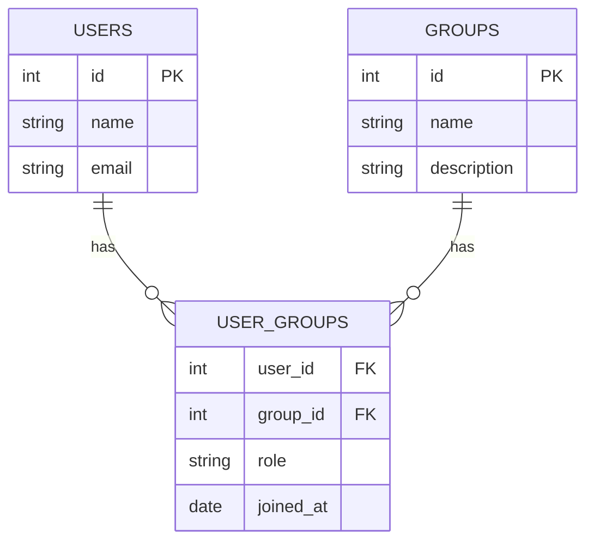
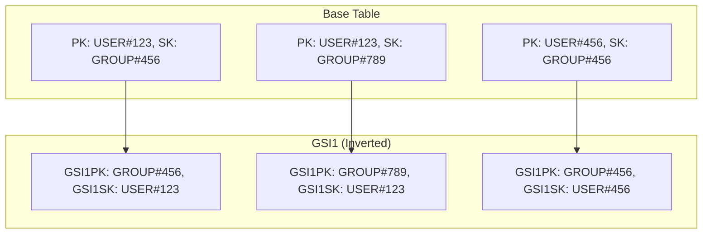
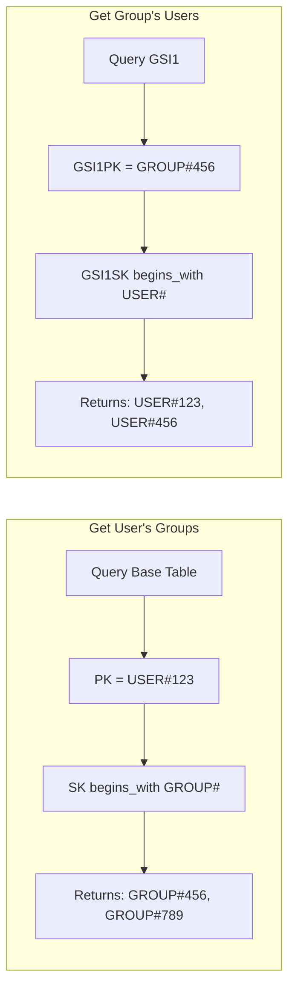
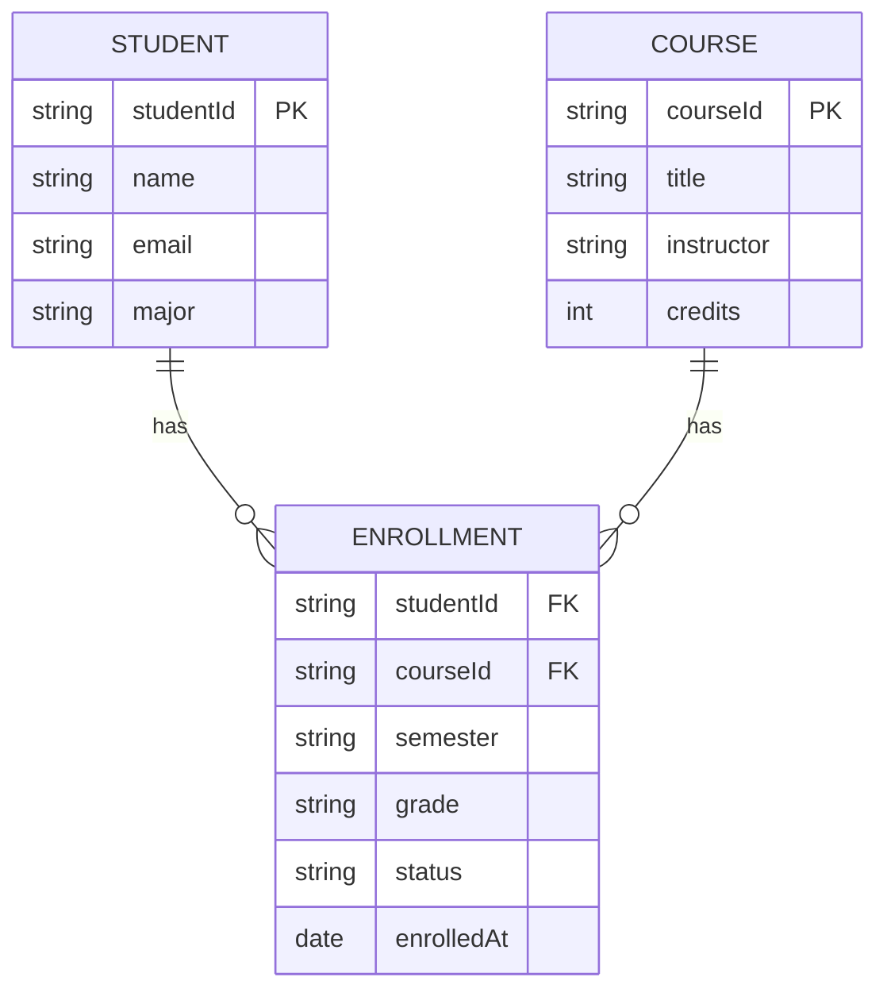
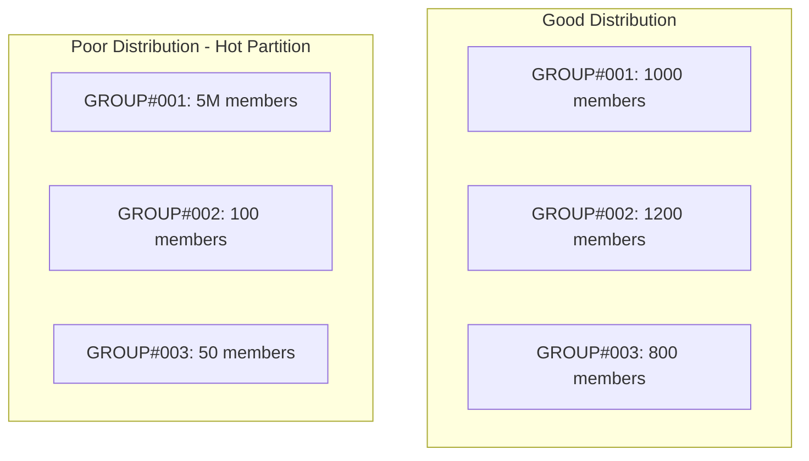

# How to Model Many-to-Many Relationships in DynamoDB

Author: [nawazdhandala](https://www.github.com/nawazdhandala)

Tags: DynamoDB, AWS, NoSQL, Data Modeling, Many-to-Many, Database Design, Adjacency List, Serverless

Description: A comprehensive guide to modeling many-to-many relationships in DynamoDB using adjacency lists, GSIs, and composite keys. Learn practical patterns for users and groups, products and categories, and students and courses.

---

Many-to-many relationships are common in application data models. Users belong to multiple groups. Products appear in multiple categories. Students enroll in multiple courses. In relational databases, you create a junction table with foreign keys. In DynamoDB, you need different strategies because there are no joins.

This guide covers practical patterns for modeling many-to-many relationships in DynamoDB with working code examples you can adapt for your applications.

---

## Table of Contents

1. Understanding the Challenge
2. The Adjacency List Pattern
3. Implementing Users and Groups
4. Bidirectional Queries with GSIs
5. Products and Categories Example
6. Handling Relationship Metadata
7. Batch Operations for Relationships
8. Students and Courses with Enrollment Data
9. Querying Relationship Counts
10. Deleting Relationships Safely
11. Performance Considerations
12. Common Pitfalls and Solutions

---

## 1. Understanding the Challenge

In a relational database, you model many-to-many relationships with three tables:



When you need all groups for a user, you join the tables. When you need all users in a group, you join in the other direction. The database handles the complexity.

DynamoDB does not support joins. You have two options:

1. Make multiple queries and join in your application code (slow and expensive)
2. Structure your data so both directions of the query are efficient (the DynamoDB way)

The adjacency list pattern lets you query both directions efficiently.

---

## 2. The Adjacency List Pattern

The adjacency list pattern stores relationships as items where one entity references another. By using both the partition key and sort key strategically, you can query from either side of the relationship.

### Core Concept

Store relationship items with this structure:

```
PK: USER#123
SK: GROUP#456
```

This item represents "User 123 belongs to Group 456." To query all groups for a user, you query with `PK = USER#123` and filter sort keys starting with `GROUP#`.

To query the reverse direction (all users in a group), you need a Global Secondary Index (GSI) that inverts the keys:

```
GSI1PK: GROUP#456
GSI1SK: USER#123
```

### Visual Representation



---

## 3. Implementing Users and Groups

Let us build a complete implementation for a users and groups system.

### Table Design

| Item Type | PK | SK | GSI1PK | GSI1SK | Attributes |
|-----------|----|----|--------|--------|------------|
| User | USER#\<userId\> | PROFILE | | | name, email, createdAt |
| Group | GROUP#\<groupId\> | INFO | | | name, description, createdAt |
| Membership | USER#\<userId\> | GROUP#\<groupId\> | GROUP#\<groupId\> | USER#\<userId\> | role, joinedAt |

### Setting Up the DynamoDB Client

This code initializes the AWS SDK v3 DynamoDB client with document client wrapper for easier JSON handling.

```typescript
// dynamodb-client.ts
import { DynamoDBClient } from "@aws-sdk/client-dynamodb";
import {
  DynamoDBDocumentClient,
  PutCommand,
  GetCommand,
  QueryCommand,
  DeleteCommand,
  BatchWriteCommand,
  TransactWriteCommand,
} from "@aws-sdk/lib-dynamodb";

// Create the low-level DynamoDB client
const client = new DynamoDBClient({
  region: process.env.AWS_REGION || "us-east-1",
});

// Wrap with document client for automatic marshalling/unmarshalling
export const docClient = DynamoDBDocumentClient.from(client, {
  marshallOptions: {
    removeUndefinedValues: true,
  },
});

export const TABLE_NAME = process.env.DYNAMODB_TABLE || "ManyToManyTable";
```

### Creating a User

This function creates a user profile item with the partition key identifying the user and sort key set to PROFILE.

```typescript
// user-repository.ts
import { PutCommand } from "@aws-sdk/lib-dynamodb";
import { docClient, TABLE_NAME } from "./dynamodb-client";

interface User {
  userId: string;
  name: string;
  email: string;
}

export async function createUser(user: User): Promise<void> {
  await docClient.send(
    new PutCommand({
      TableName: TABLE_NAME,
      Item: {
        // Partition key identifies the user
        PK: `USER#${user.userId}`,
        // Sort key identifies this as the profile record
        SK: "PROFILE",
        entityType: "User",
        userId: user.userId,
        name: user.name,
        email: user.email,
        createdAt: new Date().toISOString(),
      },
      // Prevent overwriting existing users
      ConditionExpression: "attribute_not_exists(PK)",
    })
  );
}
```

### Creating a Group

This function creates a group info item following the same pattern as users.

```typescript
// group-repository.ts
import { PutCommand } from "@aws-sdk/lib-dynamodb";
import { docClient, TABLE_NAME } from "./dynamodb-client";

interface Group {
  groupId: string;
  name: string;
  description: string;
}

export async function createGroup(group: Group): Promise<void> {
  await docClient.send(
    new PutCommand({
      TableName: TABLE_NAME,
      Item: {
        // Partition key identifies the group
        PK: `GROUP#${group.groupId}`,
        // Sort key identifies this as the info record
        SK: "INFO",
        entityType: "Group",
        groupId: group.groupId,
        name: group.name,
        description: group.description,
        createdAt: new Date().toISOString(),
      },
      ConditionExpression: "attribute_not_exists(PK)",
    })
  );
}
```

### Adding a User to a Group

This function creates the membership relationship item with GSI keys for bidirectional querying.

```typescript
// membership-repository.ts
import { PutCommand } from "@aws-sdk/lib-dynamodb";
import { docClient, TABLE_NAME } from "./dynamodb-client";

interface Membership {
  userId: string;
  groupId: string;
  role: string;
}

export async function addUserToGroup(membership: Membership): Promise<void> {
  await docClient.send(
    new PutCommand({
      TableName: TABLE_NAME,
      Item: {
        // Base table keys: query user's groups
        PK: `USER#${membership.userId}`,
        SK: `GROUP#${membership.groupId}`,
        // GSI keys: query group's users (inverted)
        GSI1PK: `GROUP#${membership.groupId}`,
        GSI1SK: `USER#${membership.userId}`,
        // Relationship metadata
        entityType: "Membership",
        userId: membership.userId,
        groupId: membership.groupId,
        role: membership.role,
        joinedAt: new Date().toISOString(),
      },
    })
  );
}
```

---

## 4. Bidirectional Queries with GSIs

The power of the adjacency list pattern comes from querying both directions efficiently.

### Getting All Groups for a User

This function queries the base table to find all groups a user belongs to.

```typescript
// membership-repository.ts (continued)
import { QueryCommand } from "@aws-sdk/lib-dynamodb";

interface GroupMembership {
  groupId: string;
  role: string;
  joinedAt: string;
}

export async function getUserGroups(userId: string): Promise<GroupMembership[]> {
  const response = await docClient.send(
    new QueryCommand({
      TableName: TABLE_NAME,
      // Query the user's partition
      KeyConditionExpression: "PK = :pk AND begins_with(SK, :skPrefix)",
      ExpressionAttributeValues: {
        ":pk": `USER#${userId}`,
        ":skPrefix": "GROUP#",
      },
    })
  );

  return (response.Items || []).map((item) => ({
    groupId: item.groupId,
    role: item.role,
    joinedAt: item.joinedAt,
  }));
}
```

### Getting All Users in a Group

This function queries the GSI to find all users in a specific group.

```typescript
// membership-repository.ts (continued)

interface UserMembership {
  userId: string;
  role: string;
  joinedAt: string;
}

export async function getGroupUsers(groupId: string): Promise<UserMembership[]> {
  const response = await docClient.send(
    new QueryCommand({
      TableName: TABLE_NAME,
      // Query the GSI with inverted keys
      IndexName: "GSI1",
      KeyConditionExpression: "GSI1PK = :gsi1pk AND begins_with(GSI1SK, :gsi1skPrefix)",
      ExpressionAttributeValues: {
        ":gsi1pk": `GROUP#${groupId}`,
        ":gsi1skPrefix": "USER#",
      },
    })
  );

  return (response.Items || []).map((item) => ({
    userId: item.userId,
    role: item.role,
    joinedAt: item.joinedAt,
  }));
}
```

### Query Flow Diagram



---

## 5. Products and Categories Example

Let us apply the same pattern to products and categories, a common e-commerce requirement.

### Data Model

| Item Type | PK | SK | GSI1PK | GSI1SK |
|-----------|----|----|--------|--------|
| Product | PRODUCT#\<productId\> | INFO | | |
| Category | CATEGORY#\<categoryId\> | INFO | | |
| Product-Category | PRODUCT#\<productId\> | CATEGORY#\<categoryId\> | CATEGORY#\<categoryId\> | PRODUCT#\<productId\> |

### Adding a Product to a Category

This function creates the relationship between a product and a category with optional display order.

```typescript
// product-category-repository.ts
import { PutCommand, QueryCommand } from "@aws-sdk/lib-dynamodb";
import { docClient, TABLE_NAME } from "./dynamodb-client";

interface ProductCategory {
  productId: string;
  categoryId: string;
  displayOrder?: number;
}

export async function addProductToCategory(pc: ProductCategory): Promise<void> {
  await docClient.send(
    new PutCommand({
      TableName: TABLE_NAME,
      Item: {
        // Base table: query product's categories
        PK: `PRODUCT#${pc.productId}`,
        SK: `CATEGORY#${pc.categoryId}`,
        // GSI: query category's products
        GSI1PK: `CATEGORY#${pc.categoryId}`,
        GSI1SK: `PRODUCT#${pc.productId}`,
        entityType: "ProductCategory",
        productId: pc.productId,
        categoryId: pc.categoryId,
        displayOrder: pc.displayOrder || 0,
        addedAt: new Date().toISOString(),
      },
    })
  );
}
```

### Getting Products in a Category

This function retrieves all products in a category, useful for category pages.

```typescript
// product-category-repository.ts (continued)

interface CategoryProduct {
  productId: string;
  displayOrder: number;
  addedAt: string;
}

export async function getCategoryProducts(
  categoryId: string
): Promise<CategoryProduct[]> {
  const response = await docClient.send(
    new QueryCommand({
      TableName: TABLE_NAME,
      IndexName: "GSI1",
      KeyConditionExpression: "GSI1PK = :gsi1pk AND begins_with(GSI1SK, :prefix)",
      ExpressionAttributeValues: {
        ":gsi1pk": `CATEGORY#${categoryId}`,
        ":prefix": "PRODUCT#",
      },
    })
  );

  return (response.Items || [])
    .map((item) => ({
      productId: item.productId,
      displayOrder: item.displayOrder,
      addedAt: item.addedAt,
    }))
    .sort((a, b) => a.displayOrder - b.displayOrder);
}
```

### Getting Categories for a Product

This function retrieves all categories a product belongs to, useful for product pages.

```typescript
// product-category-repository.ts (continued)

interface ProductCategoryInfo {
  categoryId: string;
  addedAt: string;
}

export async function getProductCategories(
  productId: string
): Promise<ProductCategoryInfo[]> {
  const response = await docClient.send(
    new QueryCommand({
      TableName: TABLE_NAME,
      KeyConditionExpression: "PK = :pk AND begins_with(SK, :prefix)",
      ExpressionAttributeValues: {
        ":pk": `PRODUCT#${productId}`,
        ":prefix": "CATEGORY#",
      },
    })
  );

  return (response.Items || []).map((item) => ({
    categoryId: item.categoryId,
    addedAt: item.addedAt,
  }));
}
```

---

## 6. Handling Relationship Metadata

Many-to-many relationships often carry metadata. A membership has a role. An enrollment has a grade. A product-category assignment has a display order.

### Storing Metadata in the Relationship Item

The relationship item is the perfect place to store this metadata.

```typescript
// Membership with rich metadata
{
  PK: "USER#123",
  SK: "GROUP#456",
  GSI1PK: "GROUP#456",
  GSI1SK: "USER#123",
  entityType: "Membership",
  userId: "123",
  groupId: "456",
  role: "admin",
  joinedAt: "2024-01-15T10:30:00Z",
  invitedBy: "USER#001",
  permissions: ["read", "write", "delete"],
  lastActiveAt: "2024-01-20T14:00:00Z"
}
```

### Updating Relationship Metadata

This function updates the role and permissions for a membership without recreating the item.

```typescript
// membership-repository.ts (continued)
import { UpdateCommand } from "@aws-sdk/lib-dynamodb";

export async function updateMembershipRole(
  userId: string,
  groupId: string,
  newRole: string,
  permissions: string[]
): Promise<void> {
  await docClient.send(
    new UpdateCommand({
      TableName: TABLE_NAME,
      Key: {
        PK: `USER#${userId}`,
        SK: `GROUP#${groupId}`,
      },
      UpdateExpression: "SET #role = :role, permissions = :permissions, updatedAt = :updatedAt",
      ExpressionAttributeNames: {
        "#role": "role",
      },
      ExpressionAttributeValues: {
        ":role": newRole,
        ":permissions": permissions,
        ":updatedAt": new Date().toISOString(),
      },
      // Ensure the membership exists before updating
      ConditionExpression: "attribute_exists(PK)",
    })
  );
}
```

---

## 7. Batch Operations for Relationships

When you need to add or remove multiple relationships at once, use batch operations for efficiency.

### Adding a User to Multiple Groups

This function adds a user to multiple groups in a single batch write operation.

```typescript
// membership-repository.ts (continued)
import { BatchWriteCommand } from "@aws-sdk/lib-dynamodb";

interface BulkMembership {
  groupId: string;
  role: string;
}

export async function addUserToMultipleGroups(
  userId: string,
  memberships: BulkMembership[]
): Promise<void> {
  // DynamoDB batch write accepts up to 25 items
  const BATCH_SIZE = 25;
  const now = new Date().toISOString();

  for (let i = 0; i < memberships.length; i += BATCH_SIZE) {
    const batch = memberships.slice(i, i + BATCH_SIZE);

    const putRequests = batch.map((m) => ({
      PutRequest: {
        Item: {
          PK: `USER#${userId}`,
          SK: `GROUP#${m.groupId}`,
          GSI1PK: `GROUP#${m.groupId}`,
          GSI1SK: `USER#${userId}`,
          entityType: "Membership",
          userId: userId,
          groupId: m.groupId,
          role: m.role,
          joinedAt: now,
        },
      },
    }));

    await docClient.send(
      new BatchWriteCommand({
        RequestItems: {
          [TABLE_NAME]: putRequests,
        },
      })
    );
  }
}
```

### Adding Multiple Users to a Group

This function adds multiple users to a single group, useful for bulk invitations.

```typescript
// membership-repository.ts (continued)

interface BulkUserMembership {
  userId: string;
  role: string;
}

export async function addMultipleUsersToGroup(
  groupId: string,
  users: BulkUserMembership[]
): Promise<void> {
  const BATCH_SIZE = 25;
  const now = new Date().toISOString();

  for (let i = 0; i < users.length; i += BATCH_SIZE) {
    const batch = users.slice(i, i + BATCH_SIZE);

    const putRequests = batch.map((u) => ({
      PutRequest: {
        Item: {
          PK: `USER#${u.userId}`,
          SK: `GROUP#${groupId}`,
          GSI1PK: `GROUP#${groupId}`,
          GSI1SK: `USER#${u.userId}`,
          entityType: "Membership",
          userId: u.userId,
          groupId: groupId,
          role: u.role,
          joinedAt: now,
        },
      },
    }));

    await docClient.send(
      new BatchWriteCommand({
        RequestItems: {
          [TABLE_NAME]: putRequests,
        },
      })
    );
  }
}
```

---

## 8. Students and Courses with Enrollment Data

Let us implement a more complex example: students enrolling in courses with grades and completion status.

### Data Model



### DynamoDB Table Design

| Item Type | PK | SK | GSI1PK | GSI1SK |
|-----------|----|----|--------|--------|
| Student | STUDENT#\<studentId\> | PROFILE | | |
| Course | COURSE#\<courseId\> | INFO | | |
| Enrollment | STUDENT#\<studentId\> | COURSE#\<semester\>#\<courseId\> | COURSE#\<courseId\> | ENROLLMENT#\<semester\>#\<studentId\> |

### Creating an Enrollment

This function creates an enrollment record with semester-based sorting for chronological queries.

```typescript
// enrollment-repository.ts
import { PutCommand, QueryCommand, UpdateCommand } from "@aws-sdk/lib-dynamodb";
import { docClient, TABLE_NAME } from "./dynamodb-client";

interface Enrollment {
  studentId: string;
  courseId: string;
  semester: string;
  status: "enrolled" | "completed" | "dropped";
  grade?: string;
}

export async function enrollStudent(enrollment: Enrollment): Promise<void> {
  await docClient.send(
    new PutCommand({
      TableName: TABLE_NAME,
      Item: {
        // Base table: query student's courses by semester
        PK: `STUDENT#${enrollment.studentId}`,
        SK: `COURSE#${enrollment.semester}#${enrollment.courseId}`,
        // GSI: query course's students by semester
        GSI1PK: `COURSE#${enrollment.courseId}`,
        GSI1SK: `ENROLLMENT#${enrollment.semester}#${enrollment.studentId}`,
        entityType: "Enrollment",
        studentId: enrollment.studentId,
        courseId: enrollment.courseId,
        semester: enrollment.semester,
        status: enrollment.status,
        grade: enrollment.grade,
        enrolledAt: new Date().toISOString(),
      },
    })
  );
}
```

### Getting a Student's Course History

This function retrieves all courses a student has taken, sorted by semester.

```typescript
// enrollment-repository.ts (continued)

interface CourseEnrollment {
  courseId: string;
  semester: string;
  status: string;
  grade?: string;
  enrolledAt: string;
}

export async function getStudentCourses(
  studentId: string,
  semesterPrefix?: string
): Promise<CourseEnrollment[]> {
  const keyCondition = semesterPrefix
    ? "PK = :pk AND begins_with(SK, :skPrefix)"
    : "PK = :pk AND begins_with(SK, :skPrefix)";

  const response = await docClient.send(
    new QueryCommand({
      TableName: TABLE_NAME,
      KeyConditionExpression: keyCondition,
      ExpressionAttributeValues: {
        ":pk": `STUDENT#${studentId}`,
        ":skPrefix": semesterPrefix ? `COURSE#${semesterPrefix}` : "COURSE#",
      },
      // Most recent semesters first
      ScanIndexForward: false,
    })
  );

  return (response.Items || []).map((item) => ({
    courseId: item.courseId,
    semester: item.semester,
    status: item.status,
    grade: item.grade,
    enrolledAt: item.enrolledAt,
  }));
}
```

### Getting Course Roster

This function retrieves all students enrolled in a course for a specific semester.

```typescript
// enrollment-repository.ts (continued)

interface StudentEnrollment {
  studentId: string;
  semester: string;
  status: string;
  grade?: string;
  enrolledAt: string;
}

export async function getCourseRoster(
  courseId: string,
  semester: string
): Promise<StudentEnrollment[]> {
  const response = await docClient.send(
    new QueryCommand({
      TableName: TABLE_NAME,
      IndexName: "GSI1",
      KeyConditionExpression: "GSI1PK = :gsi1pk AND begins_with(GSI1SK, :prefix)",
      ExpressionAttributeValues: {
        ":gsi1pk": `COURSE#${courseId}`,
        ":prefix": `ENROLLMENT#${semester}`,
      },
    })
  );

  return (response.Items || []).map((item) => ({
    studentId: item.studentId,
    semester: item.semester,
    status: item.status,
    grade: item.grade,
    enrolledAt: item.enrolledAt,
  }));
}
```

### Recording a Grade

This function updates the grade for an enrollment when the course is completed.

```typescript
// enrollment-repository.ts (continued)

export async function recordGrade(
  studentId: string,
  courseId: string,
  semester: string,
  grade: string
): Promise<void> {
  await docClient.send(
    new UpdateCommand({
      TableName: TABLE_NAME,
      Key: {
        PK: `STUDENT#${studentId}`,
        SK: `COURSE#${semester}#${courseId}`,
      },
      UpdateExpression: "SET grade = :grade, #status = :status, completedAt = :completedAt",
      ExpressionAttributeNames: {
        "#status": "status",
      },
      ExpressionAttributeValues: {
        ":grade": grade,
        ":status": "completed",
        ":completedAt": new Date().toISOString(),
      },
      ConditionExpression: "attribute_exists(PK)",
    })
  );
}
```

---

## 9. Querying Relationship Counts

Sometimes you need to count relationships without fetching all items.

### Counting Groups for a User

This function counts how many groups a user belongs to without retrieving all membership data.

```typescript
// membership-repository.ts (continued)

export async function countUserGroups(userId: string): Promise<number> {
  const response = await docClient.send(
    new QueryCommand({
      TableName: TABLE_NAME,
      KeyConditionExpression: "PK = :pk AND begins_with(SK, :prefix)",
      ExpressionAttributeValues: {
        ":pk": `USER#${userId}`,
        ":prefix": "GROUP#",
      },
      // Only return the count, not the items
      Select: "COUNT",
    })
  );

  return response.Count || 0;
}
```

### Counting Users in a Group

This function counts group members using the GSI.

```typescript
// membership-repository.ts (continued)

export async function countGroupUsers(groupId: string): Promise<number> {
  const response = await docClient.send(
    new QueryCommand({
      TableName: TABLE_NAME,
      IndexName: "GSI1",
      KeyConditionExpression: "GSI1PK = :gsi1pk AND begins_with(GSI1SK, :prefix)",
      ExpressionAttributeValues: {
        ":gsi1pk": `GROUP#${groupId}`,
        ":prefix": "USER#",
      },
      Select: "COUNT",
    })
  );

  return response.Count || 0;
}
```

### Maintaining Denormalized Counts

For frequently accessed counts, store them on the entity itself and update with transactions.

```typescript
// membership-repository.ts (continued)
import { TransactWriteCommand } from "@aws-sdk/lib-dynamodb";

export async function addUserToGroupWithCount(
  userId: string,
  groupId: string,
  role: string
): Promise<void> {
  await docClient.send(
    new TransactWriteCommand({
      TransactItems: [
        // Create the membership
        {
          Put: {
            TableName: TABLE_NAME,
            Item: {
              PK: `USER#${userId}`,
              SK: `GROUP#${groupId}`,
              GSI1PK: `GROUP#${groupId}`,
              GSI1SK: `USER#${userId}`,
              entityType: "Membership",
              userId,
              groupId,
              role,
              joinedAt: new Date().toISOString(),
            },
            // Prevent duplicate membership
            ConditionExpression: "attribute_not_exists(PK)",
          },
        },
        // Increment the group's member count
        {
          Update: {
            TableName: TABLE_NAME,
            Key: {
              PK: `GROUP#${groupId}`,
              SK: "INFO",
            },
            UpdateExpression: "SET memberCount = if_not_exists(memberCount, :zero) + :one",
            ExpressionAttributeValues: {
              ":zero": 0,
              ":one": 1,
            },
          },
        },
      ],
    })
  );
}
```

---

## 10. Deleting Relationships Safely

Removing relationships requires care to maintain data consistency.

### Removing a User from a Group

This function removes a single membership relationship.

```typescript
// membership-repository.ts (continued)
import { DeleteCommand } from "@aws-sdk/lib-dynamodb";

export async function removeUserFromGroup(
  userId: string,
  groupId: string
): Promise<void> {
  await docClient.send(
    new DeleteCommand({
      TableName: TABLE_NAME,
      Key: {
        PK: `USER#${userId}`,
        SK: `GROUP#${groupId}`,
      },
      // Only delete if it exists
      ConditionExpression: "attribute_exists(PK)",
    })
  );
}
```

### Removing All Group Memberships When Deleting a Group

This function removes all memberships when a group is deleted to prevent orphaned relationships.

```typescript
// membership-repository.ts (continued)

export async function deleteGroupWithMemberships(groupId: string): Promise<void> {
  // First, get all memberships for this group
  const memberships = await getGroupUsers(groupId);

  // Delete memberships in batches
  const BATCH_SIZE = 25;

  for (let i = 0; i < memberships.length; i += BATCH_SIZE) {
    const batch = memberships.slice(i, i + BATCH_SIZE);

    const deleteRequests = batch.map((m) => ({
      DeleteRequest: {
        Key: {
          PK: `USER#${m.userId}`,
          SK: `GROUP#${groupId}`,
        },
      },
    }));

    await docClient.send(
      new BatchWriteCommand({
        RequestItems: {
          [TABLE_NAME]: deleteRequests,
        },
      })
    );
  }

  // Finally, delete the group itself
  await docClient.send(
    new DeleteCommand({
      TableName: TABLE_NAME,
      Key: {
        PK: `GROUP#${groupId}`,
        SK: "INFO",
      },
    })
  );
}
```

### Using Transactions for Consistent Deletes

This function uses a transaction to remove a membership and decrement the count atomically.

```typescript
// membership-repository.ts (continued)

export async function removeUserFromGroupWithCount(
  userId: string,
  groupId: string
): Promise<void> {
  await docClient.send(
    new TransactWriteCommand({
      TransactItems: [
        // Delete the membership
        {
          Delete: {
            TableName: TABLE_NAME,
            Key: {
              PK: `USER#${userId}`,
              SK: `GROUP#${groupId}`,
            },
            ConditionExpression: "attribute_exists(PK)",
          },
        },
        // Decrement the group's member count
        {
          Update: {
            TableName: TABLE_NAME,
            Key: {
              PK: `GROUP#${groupId}`,
              SK: "INFO",
            },
            UpdateExpression: "SET memberCount = memberCount - :one",
            ExpressionAttributeValues: {
              ":one": 1,
            },
            ConditionExpression: "memberCount > :zero",
            ExpressionAttributeValues: {
              ":one": 1,
              ":zero": 0,
            },
          },
        },
      ],
    })
  );
}
```

---

## 11. Performance Considerations

### Partition Key Distribution

Ensure your partition keys distribute data evenly. If one group has millions of members, queries against that partition will be slower.



### GSI Projection Strategies

Choose your GSI projection carefully to balance storage and query flexibility.

| Projection | Use Case | Trade-off |
|------------|----------|-----------|
| KEYS_ONLY | Need IDs only, fetch details separately | Lowest storage, extra queries |
| INCLUDE | Need specific attributes | Moderate storage |
| ALL | Need all attributes | Highest storage, no extra queries |

### Sparse Indexes for Filtering

Use sparse indexes to create filtered views. Only items with the GSI attribute appear in the index.

```typescript
// Only active memberships appear in this GSI
{
  PK: "USER#123",
  SK: "GROUP#456",
  // Only set GSI2PK when membership is active
  GSI2PK: "ACTIVE_MEMBERSHIP",
  GSI2SK: "USER#123#GROUP#456",
  status: "active"
}
```

---

## 12. Common Pitfalls and Solutions

### Pitfall 1: Forgetting the GSI

Without a GSI, you can only query one direction efficiently. Always create the inverted index for true many-to-many support.

```typescript
// Without GSI: requires expensive scan to find users in a group
// With GSI: efficient query in both directions
```

### Pitfall 2: Hot Partitions in GSI

If your GSI partition key has uneven distribution, some partitions become hot. Consider adding a suffix to spread the load.

```typescript
// BAD: All relationships for popular group hit one GSI partition
GSI1PK: "GROUP#popular-group"

// BETTER: Shard the GSI partition key for large groups
GSI1PK: "GROUP#popular-group#SHARD#3"  // Random shard 0-9
```

### Pitfall 3: Inconsistent Deletes

When deleting an entity, always clean up its relationships. Use transactions or DynamoDB Streams for cleanup.

### Pitfall 4: Over-Normalizing

Do not create separate items for each attribute. Store relationship metadata directly on the relationship item.

```typescript
// BAD: Separate item for each attribute
{ PK: "MEMBERSHIP#123#456", SK: "ROLE", value: "admin" }
{ PK: "MEMBERSHIP#123#456", SK: "JOINED_AT", value: "2024-01-15" }

// GOOD: All attributes on one item
{ PK: "USER#123", SK: "GROUP#456", role: "admin", joinedAt: "2024-01-15" }
```

### Pitfall 5: Not Handling Large Result Sets

When a query might return many items, implement pagination.

```typescript
export async function getGroupUsersPage(
  groupId: string,
  limit: number,
  lastKey?: Record<string, any>
): Promise<{
  users: UserMembership[];
  nextKey?: Record<string, any>;
}> {
  const response = await docClient.send(
    new QueryCommand({
      TableName: TABLE_NAME,
      IndexName: "GSI1",
      KeyConditionExpression: "GSI1PK = :gsi1pk",
      ExpressionAttributeValues: {
        ":gsi1pk": `GROUP#${groupId}`,
      },
      Limit: limit,
      ExclusiveStartKey: lastKey,
    })
  );

  return {
    users: (response.Items || []).map((item) => ({
      userId: item.userId,
      role: item.role,
      joinedAt: item.joinedAt,
    })),
    nextKey: response.LastEvaluatedKey,
  };
}
```

---

## Summary

Modeling many-to-many relationships in DynamoDB requires a different mindset than relational databases. The key principles are:

1. **Use the adjacency list pattern** - Store relationships as items with composite keys
2. **Create a GSI for the inverse direction** - Enable efficient queries from both sides
3. **Store metadata on relationship items** - Keep related data together
4. **Use transactions for consistency** - When updating multiple items atomically
5. **Plan for scale** - Consider partition distribution and pagination from the start

The patterns shown here work for users and groups, products and categories, students and courses, and any other many-to-many relationship you need to model.

---

## Further Reading

- [DynamoDB Best Practices](https://docs.aws.amazon.com/amazondynamodb/latest/developerguide/best-practices.html)
- [Adjacency List Design Pattern](https://docs.aws.amazon.com/amazondynamodb/latest/developerguide/bp-adjacency-graphs.html)
- [DynamoDB Single-Table Design](/blog/2026-01-26-dynamodb-single-table-design)
- [DynamoDB Global Secondary Indexes](/blog/2026-01-26-dynamodb-global-secondary-indexes)

---

*Managing complex data relationships in production? [OneUptime](https://oneuptime.com) provides comprehensive monitoring for your DynamoDB tables, including capacity metrics, throttling alerts, and latency tracking. Catch performance issues before they impact your users.*
