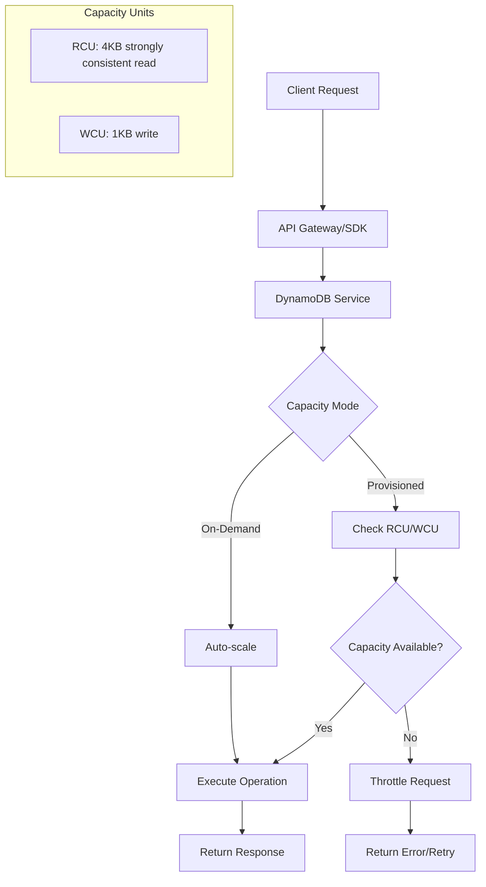
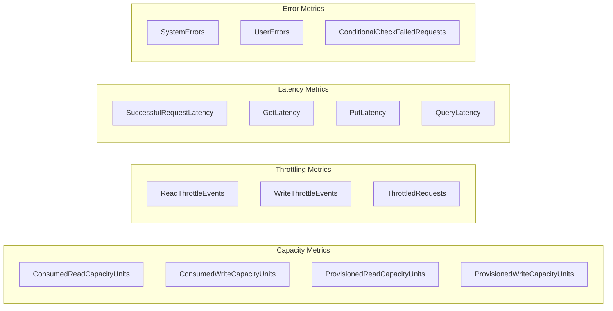
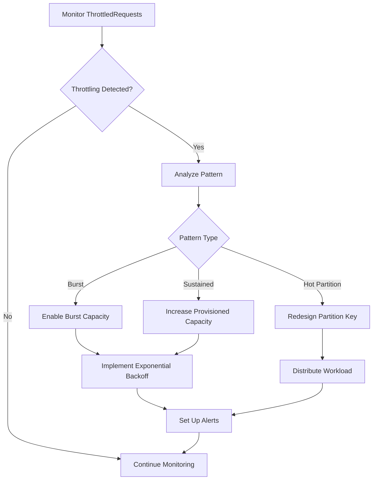
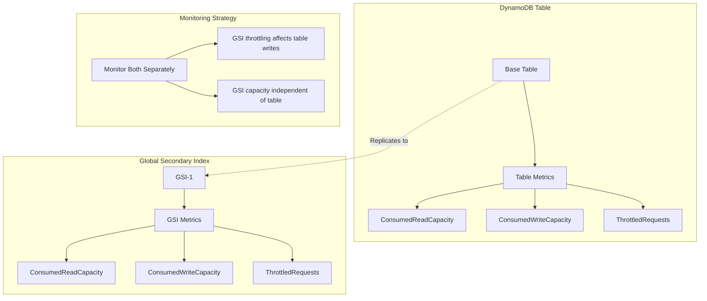

# How to Monitor DynamoDB Performance

Author: [nawazdhandala](https://www.github.com/nawazdhandala)

Tags: DynamoDB, AWS, Monitoring, Performance, NoSQL, CloudWatch, Observability

Description: Learn how to monitor Amazon DynamoDB performance effectively. This guide covers key metrics, CloudWatch integration, capacity planning, throttling detection, and alerting strategies for production workloads.

---

Amazon DynamoDB is a fully managed NoSQL database that scales automatically, but proper monitoring is essential to ensure optimal performance and cost efficiency. Without visibility into your DynamoDB tables, you risk throttling, latency spikes, and unexpected costs. This guide provides practical techniques to monitor and optimize your DynamoDB workloads.

## Understanding DynamoDB Performance Model

Before diving into monitoring, understanding how DynamoDB handles capacity and performance is crucial. DynamoDB operates on a provisioned or on-demand capacity model, where read and write operations consume capacity units.

The following diagram illustrates the DynamoDB performance architecture.



## Key Metrics to Monitor

DynamoDB exposes several critical metrics through CloudWatch. Understanding these metrics helps you identify performance issues before they impact users.

The following diagram shows the metric categories you should track.



## Setting Up CloudWatch Monitoring

CloudWatch provides native integration with DynamoDB. You can access metrics, create dashboards, and set up alarms without additional tooling.

The following code demonstrates how to query DynamoDB metrics using the AWS CLI.

```bash
# Query consumed read capacity units for the last hour
# Replace 'your-table-name' with your actual DynamoDB table name
# The period is set to 300 seconds (5 minutes) for granular data
aws cloudwatch get-metric-statistics \
    --namespace AWS/DynamoDB \
    --metric-name ConsumedReadCapacityUnits \
    --dimensions Name=TableName,Value=your-table-name \
    --start-time $(date -u -d '1 hour ago' +%Y-%m-%dT%H:%M:%SZ) \
    --end-time $(date -u +%Y-%m-%dT%H:%M:%SZ) \
    --period 300 \
    --statistics Sum Average Maximum

# Query throttled requests to detect capacity issues
# Non-zero values indicate your table needs more capacity
aws cloudwatch get-metric-statistics \
    --namespace AWS/DynamoDB \
    --metric-name ThrottledRequests \
    --dimensions Name=TableName,Value=your-table-name \
    --start-time $(date -u -d '1 hour ago' +%Y-%m-%dT%H:%M:%SZ) \
    --end-time $(date -u +%Y-%m-%dT%H:%M:%SZ) \
    --period 300 \
    --statistics Sum
```

The following Python script creates a comprehensive DynamoDB monitoring dashboard.

```python
import boto3
from datetime import datetime, timedelta

# Initialize CloudWatch client
# Ensure your AWS credentials are configured with appropriate permissions
cloudwatch = boto3.client('cloudwatch', region_name='us-east-1')
dynamodb = boto3.client('dynamodb', region_name='us-east-1')

def get_table_metrics(table_name, hours=1):
    """
    Retrieve key DynamoDB metrics for a specified table.

    Args:
        table_name: Name of the DynamoDB table to monitor
        hours: Number of hours to look back for metrics

    Returns:
        Dictionary containing capacity, latency, and error metrics
    """
    end_time = datetime.utcnow()
    start_time = end_time - timedelta(hours=hours)

    # Define the metrics we want to collect
    # Each metric has a specific meaning for performance analysis
    metrics_to_fetch = [
        {
            'name': 'ConsumedReadCapacityUnits',
            'stat': 'Sum',
            'description': 'Total RCU consumed'
        },
        {
            'name': 'ConsumedWriteCapacityUnits',
            'stat': 'Sum',
            'description': 'Total WCU consumed'
        },
        {
            'name': 'ThrottledRequests',
            'stat': 'Sum',
            'description': 'Number of throttled requests'
        },
        {
            'name': 'SuccessfulRequestLatency',
            'stat': 'Average',
            'description': 'Average latency in milliseconds'
        },
        {
            'name': 'SystemErrors',
            'stat': 'Sum',
            'description': 'Server-side errors'
        }
    ]

    results = {}

    for metric in metrics_to_fetch:
        response = cloudwatch.get_metric_statistics(
            Namespace='AWS/DynamoDB',
            MetricName=metric['name'],
            Dimensions=[
                {'Name': 'TableName', 'Value': table_name}
            ],
            StartTime=start_time,
            EndTime=end_time,
            Period=300,  # 5-minute intervals
            Statistics=[metric['stat']]
        )

        # Extract datapoints and sort by timestamp
        datapoints = sorted(
            response['Datapoints'],
            key=lambda x: x['Timestamp']
        )

        results[metric['name']] = {
            'description': metric['description'],
            'datapoints': datapoints,
            'statistic': metric['stat']
        }

    return results


def calculate_utilization(table_name):
    """
    Calculate capacity utilization percentage for provisioned tables.
    High utilization (>80%) indicates potential throttling risk.

    Args:
        table_name: Name of the DynamoDB table

    Returns:
        Dictionary with read and write utilization percentages
    """
    # Get table description to find provisioned capacity
    table_info = dynamodb.describe_table(TableName=table_name)
    table = table_info['Table']

    provisioned_read = table['ProvisionedThroughput']['ReadCapacityUnits']
    provisioned_write = table['ProvisionedThroughput']['WriteCapacityUnits']

    # Get consumed capacity for the last 5 minutes
    end_time = datetime.utcnow()
    start_time = end_time - timedelta(minutes=5)

    # Fetch consumed read capacity
    read_response = cloudwatch.get_metric_statistics(
        Namespace='AWS/DynamoDB',
        MetricName='ConsumedReadCapacityUnits',
        Dimensions=[{'Name': 'TableName', 'Value': table_name}],
        StartTime=start_time,
        EndTime=end_time,
        Period=300,
        Statistics=['Sum']
    )

    # Fetch consumed write capacity
    write_response = cloudwatch.get_metric_statistics(
        Namespace='AWS/DynamoDB',
        MetricName='ConsumedWriteCapacityUnits',
        Dimensions=[{'Name': 'TableName', 'Value': table_name}],
        StartTime=start_time,
        EndTime=end_time,
        Period=300,
        Statistics=['Sum']
    )

    # Calculate average consumed per second over the period
    # Divide by 300 seconds to get per-second rate
    consumed_read = 0
    consumed_write = 0

    if read_response['Datapoints']:
        consumed_read = read_response['Datapoints'][0]['Sum'] / 300

    if write_response['Datapoints']:
        consumed_write = write_response['Datapoints'][0]['Sum'] / 300

    return {
        'read_utilization': (consumed_read / provisioned_read * 100) if provisioned_read > 0 else 0,
        'write_utilization': (consumed_write / provisioned_write * 100) if provisioned_write > 0 else 0,
        'provisioned_read': provisioned_read,
        'provisioned_write': provisioned_write,
        'consumed_read': consumed_read,
        'consumed_write': consumed_write
    }


# Example usage
if __name__ == '__main__':
    table_name = 'your-table-name'

    # Get metrics for the last hour
    metrics = get_table_metrics(table_name, hours=1)

    print(f"Metrics for table: {table_name}")
    print("-" * 50)

    for metric_name, data in metrics.items():
        print(f"\n{metric_name} ({data['description']}):")
        if data['datapoints']:
            latest = data['datapoints'][-1]
            print(f"  Latest value: {latest[data['statistic']]:.2f}")
        else:
            print("  No data available")

    # Calculate utilization
    utilization = calculate_utilization(table_name)
    print(f"\nCapacity Utilization:")
    print(f"  Read: {utilization['read_utilization']:.1f}%")
    print(f"  Write: {utilization['write_utilization']:.1f}%")
```

## Detecting and Handling Throttling

Throttling occurs when your requests exceed the provisioned capacity. Detecting throttling early prevents application failures and poor user experience.

The following diagram shows the throttling detection and response flow.



The following code implements throttling detection and automatic alerting.

```python
import boto3
from datetime import datetime, timedelta

cloudwatch = boto3.client('cloudwatch', region_name='us-east-1')
sns = boto3.client('sns', region_name='us-east-1')

def create_throttling_alarm(table_name, sns_topic_arn, threshold=1):
    """
    Create a CloudWatch alarm that triggers when throttling occurs.

    Args:
        table_name: DynamoDB table to monitor
        sns_topic_arn: SNS topic ARN for notifications
        threshold: Number of throttled requests to trigger alarm

    The alarm uses a 1-minute period for quick detection.
    Setting threshold to 1 catches even occasional throttling.
    """
    alarm_name = f'DynamoDB-Throttling-{table_name}'

    cloudwatch.put_metric_alarm(
        AlarmName=alarm_name,
        AlarmDescription=f'Throttling detected on DynamoDB table {table_name}',
        MetricName='ThrottledRequests',
        Namespace='AWS/DynamoDB',
        Dimensions=[
            {'Name': 'TableName', 'Value': table_name}
        ],
        Statistic='Sum',
        Period=60,  # Check every minute
        EvaluationPeriods=1,  # Alert on first occurrence
        Threshold=threshold,
        ComparisonOperator='GreaterThanOrEqualToThreshold',
        AlarmActions=[sns_topic_arn],
        OKActions=[sns_topic_arn],
        TreatMissingData='notBreaching'
    )

    print(f"Created throttling alarm: {alarm_name}")
    return alarm_name


def create_capacity_utilization_alarm(table_name, sns_topic_arn, utilization_threshold=80):
    """
    Create alarms for high capacity utilization to prevent throttling.

    Args:
        table_name: DynamoDB table to monitor
        sns_topic_arn: SNS topic ARN for notifications
        utilization_threshold: Percentage threshold (default 80%)

    High utilization warnings help you scale before throttling occurs.
    """
    # Get current provisioned capacity
    dynamodb = boto3.client('dynamodb', region_name='us-east-1')
    table_info = dynamodb.describe_table(TableName=table_name)
    table = table_info['Table']

    provisioned_read = table['ProvisionedThroughput']['ReadCapacityUnits']
    provisioned_write = table['ProvisionedThroughput']['WriteCapacityUnits']

    # Calculate threshold values (capacity per 5 minutes at utilization%)
    # Multiply by 300 seconds and by utilization percentage
    read_threshold = provisioned_read * 300 * (utilization_threshold / 100)
    write_threshold = provisioned_write * 300 * (utilization_threshold / 100)

    # Create read capacity alarm
    cloudwatch.put_metric_alarm(
        AlarmName=f'DynamoDB-HighReadUtilization-{table_name}',
        AlarmDescription=f'Read capacity utilization above {utilization_threshold}%',
        MetricName='ConsumedReadCapacityUnits',
        Namespace='AWS/DynamoDB',
        Dimensions=[{'Name': 'TableName', 'Value': table_name}],
        Statistic='Sum',
        Period=300,
        EvaluationPeriods=3,  # Alert if high for 15 minutes
        Threshold=read_threshold,
        ComparisonOperator='GreaterThanThreshold',
        AlarmActions=[sns_topic_arn],
        TreatMissingData='notBreaching'
    )

    # Create write capacity alarm
    cloudwatch.put_metric_alarm(
        AlarmName=f'DynamoDB-HighWriteUtilization-{table_name}',
        AlarmDescription=f'Write capacity utilization above {utilization_threshold}%',
        MetricName='ConsumedWriteCapacityUnits',
        Namespace='AWS/DynamoDB',
        Dimensions=[{'Name': 'TableName', 'Value': table_name}],
        Statistic='Sum',
        Period=300,
        EvaluationPeriods=3,
        Threshold=write_threshold,
        ComparisonOperator='GreaterThanThreshold',
        AlarmActions=[sns_topic_arn],
        TreatMissingData='notBreaching'
    )

    print(f"Created capacity utilization alarms for {table_name}")
    print(f"  Read threshold: {read_threshold:.0f} RCU per 5 minutes")
    print(f"  Write threshold: {write_threshold:.0f} WCU per 5 minutes")
```

## Monitoring Latency

Latency monitoring helps identify slow queries and network issues. DynamoDB typically provides single-digit millisecond latency, so any deviation indicates a problem.

The following code sets up latency monitoring with percentile tracking.

```python
import boto3
from datetime import datetime, timedelta

cloudwatch = boto3.client('cloudwatch', region_name='us-east-1')

def get_latency_percentiles(table_name, operation='GetItem', hours=1):
    """
    Retrieve latency percentiles for a specific DynamoDB operation.

    Args:
        table_name: DynamoDB table to monitor
        operation: Operation type (GetItem, PutItem, Query, Scan)
        hours: Time range for analysis

    Returns:
        Dictionary with p50, p90, p99 latency values

    Percentiles help identify tail latency issues that averages hide.
    """
    end_time = datetime.utcnow()
    start_time = end_time - timedelta(hours=hours)

    # DynamoDB provides operation-specific latency metrics
    # Format: SuccessfulRequestLatency with Operation dimension
    response = cloudwatch.get_metric_statistics(
        Namespace='AWS/DynamoDB',
        MetricName='SuccessfulRequestLatency',
        Dimensions=[
            {'Name': 'TableName', 'Value': table_name},
            {'Name': 'Operation', 'Value': operation}
        ],
        StartTime=start_time,
        EndTime=end_time,
        Period=300,
        ExtendedStatistics=['p50', 'p90', 'p99']
    )

    if not response['Datapoints']:
        return None

    # Get the most recent datapoint
    latest = sorted(response['Datapoints'], key=lambda x: x['Timestamp'])[-1]

    return {
        'p50': latest['ExtendedStatistics']['p50'],
        'p90': latest['ExtendedStatistics']['p90'],
        'p99': latest['ExtendedStatistics']['p99'],
        'timestamp': latest['Timestamp']
    }


def create_latency_alarm(table_name, sns_topic_arn, threshold_ms=100):
    """
    Create an alarm for high latency on DynamoDB operations.

    Args:
        table_name: DynamoDB table to monitor
        sns_topic_arn: SNS topic for notifications
        threshold_ms: Latency threshold in milliseconds

    Normal DynamoDB latency is under 10ms. A 100ms threshold
    catches significant degradation while avoiding false alarms.
    """
    cloudwatch.put_metric_alarm(
        AlarmName=f'DynamoDB-HighLatency-{table_name}',
        AlarmDescription=f'DynamoDB latency exceeded {threshold_ms}ms',
        MetricName='SuccessfulRequestLatency',
        Namespace='AWS/DynamoDB',
        Dimensions=[{'Name': 'TableName', 'Value': table_name}],
        Statistic='Average',
        Period=60,
        EvaluationPeriods=5,  # 5 minutes of high latency
        Threshold=threshold_ms,
        ComparisonOperator='GreaterThanThreshold',
        AlarmActions=[sns_topic_arn],
        TreatMissingData='notBreaching'
    )

    print(f"Created latency alarm for {table_name}")
    print(f"  Threshold: {threshold_ms}ms average over 5 minutes")


def analyze_latency_by_operation(table_name, hours=24):
    """
    Analyze latency across all DynamoDB operations to identify slow patterns.

    Args:
        table_name: DynamoDB table to analyze
        hours: Time range for analysis

    Returns:
        Dictionary mapping operations to their latency statistics

    Comparing latency across operations helps identify
    problematic query patterns or access patterns.
    """
    operations = ['GetItem', 'PutItem', 'UpdateItem', 'DeleteItem', 'Query', 'Scan']
    results = {}

    for operation in operations:
        percentiles = get_latency_percentiles(table_name, operation, hours)
        if percentiles:
            results[operation] = percentiles

    # Sort by p99 latency to highlight slowest operations
    sorted_results = dict(
        sorted(results.items(), key=lambda x: x[1]['p99'], reverse=True)
    )

    return sorted_results


# Example usage
if __name__ == '__main__':
    table_name = 'your-table-name'

    # Analyze latency by operation
    latency_analysis = analyze_latency_by_operation(table_name, hours=24)

    print(f"Latency Analysis for {table_name} (last 24 hours)")
    print("-" * 60)
    print(f"{'Operation':<15} {'P50 (ms)':<12} {'P90 (ms)':<12} {'P99 (ms)':<12}")
    print("-" * 60)

    for operation, stats in latency_analysis.items():
        print(f"{operation:<15} {stats['p50']:<12.2f} {stats['p90']:<12.2f} {stats['p99']:<12.2f}")
```

## Monitoring Global Secondary Indexes

Global Secondary Indexes (GSIs) have their own capacity and can become bottlenecks. Monitoring GSIs separately is essential for maintaining performance.

The following diagram shows the relationship between tables and GSIs for monitoring.



The following code monitors GSI performance alongside the base table.

```python
import boto3
from datetime import datetime, timedelta

dynamodb = boto3.client('dynamodb', region_name='us-east-1')
cloudwatch = boto3.client('cloudwatch', region_name='us-east-1')

def get_table_gsis(table_name):
    """
    Retrieve all Global Secondary Indexes for a DynamoDB table.

    Args:
        table_name: DynamoDB table name

    Returns:
        List of GSI names with their provisioned capacity
    """
    response = dynamodb.describe_table(TableName=table_name)
    table = response['Table']

    gsis = []
    if 'GlobalSecondaryIndexes' in table:
        for gsi in table['GlobalSecondaryIndexes']:
            gsis.append({
                'name': gsi['IndexName'],
                'status': gsi['IndexStatus'],
                'provisioned_read': gsi['ProvisionedThroughput']['ReadCapacityUnits'],
                'provisioned_write': gsi['ProvisionedThroughput']['WriteCapacityUnits']
            })

    return gsis


def get_gsi_metrics(table_name, gsi_name, hours=1):
    """
    Retrieve metrics for a specific Global Secondary Index.

    Args:
        table_name: DynamoDB table name
        gsi_name: Name of the GSI to monitor
        hours: Time range for metrics

    Returns:
        Dictionary with GSI-specific metrics

    GSI metrics require an additional dimension for the index name.
    """
    end_time = datetime.utcnow()
    start_time = end_time - timedelta(hours=hours)

    metrics = {}

    # GSI consumed read capacity
    read_response = cloudwatch.get_metric_statistics(
        Namespace='AWS/DynamoDB',
        MetricName='ConsumedReadCapacityUnits',
        Dimensions=[
            {'Name': 'TableName', 'Value': table_name},
            {'Name': 'GlobalSecondaryIndexName', 'Value': gsi_name}
        ],
        StartTime=start_time,
        EndTime=end_time,
        Period=300,
        Statistics=['Sum', 'Average', 'Maximum']
    )

    # GSI consumed write capacity
    write_response = cloudwatch.get_metric_statistics(
        Namespace='AWS/DynamoDB',
        MetricName='ConsumedWriteCapacityUnits',
        Dimensions=[
            {'Name': 'TableName', 'Value': table_name},
            {'Name': 'GlobalSecondaryIndexName', 'Value': gsi_name}
        ],
        StartTime=start_time,
        EndTime=end_time,
        Period=300,
        Statistics=['Sum', 'Average', 'Maximum']
    )

    # GSI throttled requests - critical for identifying GSI bottlenecks
    throttle_response = cloudwatch.get_metric_statistics(
        Namespace='AWS/DynamoDB',
        MetricName='ThrottledRequests',
        Dimensions=[
            {'Name': 'TableName', 'Value': table_name},
            {'Name': 'GlobalSecondaryIndexName', 'Value': gsi_name}
        ],
        StartTime=start_time,
        EndTime=end_time,
        Period=300,
        Statistics=['Sum']
    )

    return {
        'read_capacity': read_response['Datapoints'],
        'write_capacity': write_response['Datapoints'],
        'throttled_requests': throttle_response['Datapoints']
    }


def monitor_all_gsis(table_name):
    """
    Generate a comprehensive report of all GSI performance.

    Args:
        table_name: DynamoDB table to analyze

    Returns:
        List of GSI reports with capacity and throttling data

    GSI throttling can block writes to the base table,
    making GSI monitoring critical for write-heavy workloads.
    """
    gsis = get_table_gsis(table_name)
    reports = []

    for gsi in gsis:
        metrics = get_gsi_metrics(table_name, gsi['name'], hours=1)

        # Calculate total throttled requests
        total_throttled = sum(
            dp['Sum'] for dp in metrics['throttled_requests']
        ) if metrics['throttled_requests'] else 0

        # Calculate average consumed capacity
        avg_read = 0
        avg_write = 0

        if metrics['read_capacity']:
            avg_read = sum(dp['Average'] for dp in metrics['read_capacity']) / len(metrics['read_capacity'])

        if metrics['write_capacity']:
            avg_write = sum(dp['Average'] for dp in metrics['write_capacity']) / len(metrics['write_capacity'])

        report = {
            'gsi_name': gsi['name'],
            'status': gsi['status'],
            'provisioned_read': gsi['provisioned_read'],
            'provisioned_write': gsi['provisioned_write'],
            'avg_consumed_read': avg_read,
            'avg_consumed_write': avg_write,
            'total_throttled': total_throttled,
            'read_utilization': (avg_read / gsi['provisioned_read'] * 100) if gsi['provisioned_read'] > 0 else 0,
            'write_utilization': (avg_write / gsi['provisioned_write'] * 100) if gsi['provisioned_write'] > 0 else 0
        }

        reports.append(report)

    return reports


# Example usage
if __name__ == '__main__':
    table_name = 'your-table-name'

    gsi_reports = monitor_all_gsis(table_name)

    print(f"GSI Performance Report for {table_name}")
    print("=" * 80)

    for report in gsi_reports:
        print(f"\nIndex: {report['gsi_name']} (Status: {report['status']})")
        print(f"  Read Capacity:  {report['avg_consumed_read']:.1f} / {report['provisioned_read']} ({report['read_utilization']:.1f}%)")
        print(f"  Write Capacity: {report['avg_consumed_write']:.1f} / {report['provisioned_write']} ({report['write_utilization']:.1f}%)")
        print(f"  Throttled Requests: {report['total_throttled']:.0f}")

        if report['total_throttled'] > 0:
            print("  WARNING: Throttling detected - consider increasing GSI capacity")
```

## Implementing Application-Level Monitoring

CloudWatch metrics provide service-level visibility, but application-level monitoring gives you deeper insights into how your code interacts with DynamoDB.

The following code implements a DynamoDB client wrapper with built-in monitoring.

```python
import boto3
import time
from functools import wraps
from typing import Callable, Any
import logging

# Configure logging for DynamoDB operations
logging.basicConfig(level=logging.INFO)
logger = logging.getLogger('dynamodb_monitor')

class MonitoredDynamoDB:
    """
    A wrapper around the DynamoDB client that adds monitoring capabilities.

    Tracks latency, errors, and consumed capacity for all operations.
    Integrates with your observability stack for comprehensive monitoring.
    """

    def __init__(self, table_name: str, region: str = 'us-east-1'):
        """
        Initialize the monitored DynamoDB client.

        Args:
            table_name: Default table for operations
            region: AWS region for DynamoDB
        """
        self.dynamodb = boto3.resource('dynamodb', region_name=region)
        self.table = self.dynamodb.Table(table_name)
        self.table_name = table_name

        # Metrics storage for local aggregation
        self.metrics = {
            'operations': {},
            'errors': [],
            'latency_samples': []
        }

    def _track_operation(self, operation: str) -> Callable:
        """
        Decorator to track DynamoDB operation metrics.

        Args:
            operation: Name of the DynamoDB operation

        Returns:
            Decorated function with monitoring
        """
        def decorator(func: Callable) -> Callable:
            @wraps(func)
            def wrapper(*args, **kwargs) -> Any:
                start_time = time.time()
                error_occurred = False
                consumed_capacity = None

                try:
                    # Add ReturnConsumedCapacity to track actual usage
                    kwargs['ReturnConsumedCapacity'] = 'TOTAL'
                    result = func(*args, **kwargs)

                    # Extract consumed capacity from response
                    if hasattr(result, 'get'):
                        consumed_capacity = result.get('ConsumedCapacity', {})

                    return result

                except Exception as e:
                    error_occurred = True
                    self._record_error(operation, str(e))
                    raise

                finally:
                    # Calculate latency in milliseconds
                    latency_ms = (time.time() - start_time) * 1000
                    self._record_metrics(
                        operation=operation,
                        latency_ms=latency_ms,
                        error=error_occurred,
                        consumed_capacity=consumed_capacity
                    )

            return wrapper
        return decorator

    def _record_metrics(self, operation: str, latency_ms: float,
                        error: bool, consumed_capacity: dict = None):
        """
        Record operation metrics for later analysis.

        Args:
            operation: DynamoDB operation name
            latency_ms: Operation latency in milliseconds
            error: Whether an error occurred
            consumed_capacity: Capacity units consumed
        """
        # Initialize operation metrics if needed
        if operation not in self.metrics['operations']:
            self.metrics['operations'][operation] = {
                'count': 0,
                'errors': 0,
                'total_latency': 0,
                'max_latency': 0,
                'total_rcu': 0,
                'total_wcu': 0
            }

        op_metrics = self.metrics['operations'][operation]
        op_metrics['count'] += 1
        op_metrics['total_latency'] += latency_ms
        op_metrics['max_latency'] = max(op_metrics['max_latency'], latency_ms)

        if error:
            op_metrics['errors'] += 1

        if consumed_capacity:
            op_metrics['total_rcu'] += consumed_capacity.get('ReadCapacityUnits', 0)
            op_metrics['total_wcu'] += consumed_capacity.get('WriteCapacityUnits', 0)

        # Store latency sample for percentile calculation
        self.metrics['latency_samples'].append({
            'operation': operation,
            'latency_ms': latency_ms,
            'timestamp': time.time()
        })

        # Log slow operations for immediate visibility
        if latency_ms > 100:
            logger.warning(
                f"Slow DynamoDB operation: {operation} took {latency_ms:.2f}ms"
            )

    def _record_error(self, operation: str, error_message: str):
        """
        Record error details for debugging.

        Args:
            operation: DynamoDB operation that failed
            error_message: Error description
        """
        self.metrics['errors'].append({
            'operation': operation,
            'message': error_message,
            'timestamp': time.time()
        })

        logger.error(f"DynamoDB error in {operation}: {error_message}")

    def get_item(self, key: dict) -> dict:
        """
        Get an item from DynamoDB with monitoring.

        Args:
            key: Primary key of the item to retrieve

        Returns:
            Retrieved item or empty dict if not found
        """
        @self._track_operation('GetItem')
        def _get_item(Key, ReturnConsumedCapacity):
            return self.table.get_item(
                Key=Key,
                ReturnConsumedCapacity=ReturnConsumedCapacity
            )

        response = _get_item(Key=key)
        return response.get('Item', {})

    def put_item(self, item: dict) -> dict:
        """
        Put an item into DynamoDB with monitoring.

        Args:
            item: Item data to store

        Returns:
            DynamoDB response
        """
        @self._track_operation('PutItem')
        def _put_item(Item, ReturnConsumedCapacity):
            return self.table.put_item(
                Item=Item,
                ReturnConsumedCapacity=ReturnConsumedCapacity
            )

        return _put_item(Item=item)

    def query(self, **kwargs) -> list:
        """
        Query DynamoDB with monitoring.

        Args:
            **kwargs: Query parameters (KeyConditionExpression, etc.)

        Returns:
            List of matching items
        """
        @self._track_operation('Query')
        def _query(**query_kwargs):
            return self.table.query(**query_kwargs)

        response = _query(**kwargs)
        return response.get('Items', [])

    def get_metrics_summary(self) -> dict:
        """
        Generate a summary of collected metrics.

        Returns:
            Dictionary with operation statistics and error counts
        """
        summary = {'operations': {}}

        for operation, metrics in self.metrics['operations'].items():
            count = metrics['count']
            summary['operations'][operation] = {
                'count': count,
                'error_rate': (metrics['errors'] / count * 100) if count > 0 else 0,
                'avg_latency_ms': (metrics['total_latency'] / count) if count > 0 else 0,
                'max_latency_ms': metrics['max_latency'],
                'total_rcu': metrics['total_rcu'],
                'total_wcu': metrics['total_wcu']
            }

        summary['total_errors'] = len(self.metrics['errors'])
        summary['recent_errors'] = self.metrics['errors'][-5:]  # Last 5 errors

        return summary


# Example usage demonstrating the monitored client
if __name__ == '__main__':
    # Create monitored DynamoDB client
    db = MonitoredDynamoDB('your-table-name')

    # Perform operations - metrics are tracked automatically
    db.put_item({'pk': 'user#123', 'sk': 'profile', 'name': 'John'})
    db.get_item({'pk': 'user#123', 'sk': 'profile'})

    # Get metrics summary
    summary = db.get_metrics_summary()

    print("Operation Metrics:")
    for op, metrics in summary['operations'].items():
        print(f"  {op}:")
        print(f"    Count: {metrics['count']}")
        print(f"    Avg Latency: {metrics['avg_latency_ms']:.2f}ms")
        print(f"    Error Rate: {metrics['error_rate']:.1f}%")
```

## Setting Up a Comprehensive Monitoring Dashboard

A well-designed dashboard provides at-a-glance visibility into DynamoDB health. The following CloudFormation template creates a complete monitoring stack.

The following code defines a CloudWatch dashboard for DynamoDB monitoring.

```yaml
# CloudFormation template for DynamoDB monitoring dashboard
# Deploy with: aws cloudformation create-stack --stack-name dynamodb-monitoring --template-body file://dashboard.yaml

AWSTemplateFormatVersion: '2010-09-09'
Description: DynamoDB Monitoring Dashboard and Alarms

Parameters:
  TableName:
    Type: String
    Description: Name of the DynamoDB table to monitor

  AlertEmail:
    Type: String
    Description: Email address for alert notifications

Resources:
  # SNS Topic for alerts
  AlertTopic:
    Type: AWS::SNS::Topic
    Properties:
      TopicName: !Sub '${TableName}-dynamodb-alerts'
      Subscription:
        - Protocol: email
          Endpoint: !Ref AlertEmail

  # Throttling alarm - triggers immediately on any throttling
  ThrottlingAlarm:
    Type: AWS::CloudWatch::Alarm
    Properties:
      AlarmName: !Sub '${TableName}-throttling'
      AlarmDescription: DynamoDB throttling detected
      MetricName: ThrottledRequests
      Namespace: AWS/DynamoDB
      Dimensions:
        - Name: TableName
          Value: !Ref TableName
      Statistic: Sum
      Period: 60
      EvaluationPeriods: 1
      Threshold: 1
      ComparisonOperator: GreaterThanOrEqualToThreshold
      AlarmActions:
        - !Ref AlertTopic
      TreatMissingData: notBreaching

  # High latency alarm - sustained high latency indicates problems
  HighLatencyAlarm:
    Type: AWS::CloudWatch::Alarm
    Properties:
      AlarmName: !Sub '${TableName}-high-latency'
      AlarmDescription: DynamoDB latency exceeds threshold
      MetricName: SuccessfulRequestLatency
      Namespace: AWS/DynamoDB
      Dimensions:
        - Name: TableName
          Value: !Ref TableName
      Statistic: Average
      Period: 60
      EvaluationPeriods: 5
      Threshold: 50
      ComparisonOperator: GreaterThanThreshold
      AlarmActions:
        - !Ref AlertTopic
      TreatMissingData: notBreaching

  # System errors alarm - server-side errors need immediate attention
  SystemErrorsAlarm:
    Type: AWS::CloudWatch::Alarm
    Properties:
      AlarmName: !Sub '${TableName}-system-errors'
      AlarmDescription: DynamoDB system errors detected
      MetricName: SystemErrors
      Namespace: AWS/DynamoDB
      Dimensions:
        - Name: TableName
          Value: !Ref TableName
      Statistic: Sum
      Period: 60
      EvaluationPeriods: 1
      Threshold: 1
      ComparisonOperator: GreaterThanOrEqualToThreshold
      AlarmActions:
        - !Ref AlertTopic
      TreatMissingData: notBreaching

  # CloudWatch Dashboard
  MonitoringDashboard:
    Type: AWS::CloudWatch::Dashboard
    Properties:
      DashboardName: !Sub '${TableName}-monitoring'
      DashboardBody: !Sub |
        {
          "widgets": [
            {
              "type": "metric",
              "x": 0,
              "y": 0,
              "width": 12,
              "height": 6,
              "properties": {
                "title": "Capacity Utilization",
                "metrics": [
                  ["AWS/DynamoDB", "ConsumedReadCapacityUnits", "TableName", "${TableName}", {"label": "Read Consumed"}],
                  [".", "ConsumedWriteCapacityUnits", ".", ".", {"label": "Write Consumed"}],
                  [".", "ProvisionedReadCapacityUnits", ".", ".", {"label": "Read Provisioned", "stat": "Average"}],
                  [".", "ProvisionedWriteCapacityUnits", ".", ".", {"label": "Write Provisioned", "stat": "Average"}]
                ],
                "period": 300,
                "stat": "Sum",
                "region": "${AWS::Region}"
              }
            },
            {
              "type": "metric",
              "x": 12,
              "y": 0,
              "width": 12,
              "height": 6,
              "properties": {
                "title": "Throttled Requests",
                "metrics": [
                  ["AWS/DynamoDB", "ReadThrottleEvents", "TableName", "${TableName}", {"label": "Read Throttles"}],
                  [".", "WriteThrottleEvents", ".", ".", {"label": "Write Throttles"}],
                  [".", "ThrottledRequests", ".", ".", {"label": "Total Throttles"}]
                ],
                "period": 60,
                "stat": "Sum",
                "region": "${AWS::Region}"
              }
            },
            {
              "type": "metric",
              "x": 0,
              "y": 6,
              "width": 12,
              "height": 6,
              "properties": {
                "title": "Request Latency",
                "metrics": [
                  ["AWS/DynamoDB", "SuccessfulRequestLatency", "TableName", "${TableName}", "Operation", "GetItem", {"label": "GetItem"}],
                  ["...", "PutItem", {"label": "PutItem"}],
                  ["...", "Query", {"label": "Query"}],
                  ["...", "Scan", {"label": "Scan"}]
                ],
                "period": 60,
                "stat": "Average",
                "region": "${AWS::Region}"
              }
            },
            {
              "type": "metric",
              "x": 12,
              "y": 6,
              "width": 12,
              "height": 6,
              "properties": {
                "title": "Errors",
                "metrics": [
                  ["AWS/DynamoDB", "SystemErrors", "TableName", "${TableName}", {"label": "System Errors"}],
                  [".", "UserErrors", ".", ".", {"label": "User Errors"}],
                  [".", "ConditionalCheckFailedRequests", ".", ".", {"label": "Conditional Check Failures"}]
                ],
                "period": 60,
                "stat": "Sum",
                "region": "${AWS::Region}"
              }
            }
          ]
        }

Outputs:
  DashboardURL:
    Description: URL to the CloudWatch Dashboard
    Value: !Sub 'https://${AWS::Region}.console.aws.amazon.com/cloudwatch/home?region=${AWS::Region}#dashboards:name=${TableName}-monitoring'

  AlertTopicArn:
    Description: SNS Topic ARN for alerts
    Value: !Ref AlertTopic
```

## Best Practices for DynamoDB Monitoring

Effective DynamoDB monitoring requires a structured approach. The following practices help you maintain visibility and quickly respond to issues.

### 1. Set Up Proactive Alerting

Configure alerts before problems occur. Alert on capacity utilization above 70% to give yourself time to scale before throttling happens.

### 2. Monitor at Multiple Levels

Combine CloudWatch metrics, application-level monitoring, and business metrics. CloudWatch shows what DynamoDB does, but application metrics show what your users experience.

### 3. Track Cost Alongside Performance

DynamoDB costs correlate directly with capacity consumption. Monitoring both helps you optimize for performance and cost simultaneously.

### 4. Use Contributor Insights

Enable DynamoDB Contributor Insights to identify hot keys and access patterns. Hot partitions cause throttling even when overall capacity seems sufficient.

The following code enables Contributor Insights on a table.

```bash
# Enable Contributor Insights for identifying hot keys
# Helps detect uneven access patterns that cause partition throttling
aws dynamodb update-contributor-insights \
    --table-name your-table-name \
    --contributor-insights-action ENABLE

# Check Contributor Insights status
aws dynamodb describe-contributor-insights \
    --table-name your-table-name
```

### 5. Implement Retry Logic with Monitoring

Track retry attempts alongside successful operations. High retry rates indicate capacity issues even when requests eventually succeed.

The following code implements retry logic with metric tracking.

```python
import time
import random
from botocore.exceptions import ClientError
import boto3

dynamodb = boto3.resource('dynamodb', region_name='us-east-1')

def exponential_backoff_with_jitter(attempt: int, base_delay: float = 0.1) -> float:
    """
    Calculate delay with exponential backoff and jitter.

    Args:
        attempt: Current retry attempt number (0-based)
        base_delay: Base delay in seconds

    Returns:
        Delay time in seconds

    Jitter prevents thundering herd when multiple clients retry simultaneously.
    """
    # Calculate exponential delay: base_delay * 2^attempt
    exponential_delay = base_delay * (2 ** attempt)

    # Add random jitter between 0 and exponential_delay
    jitter = random.uniform(0, exponential_delay)

    # Cap maximum delay at 30 seconds
    return min(exponential_delay + jitter, 30)


def write_with_retry(table_name: str, item: dict, max_retries: int = 5) -> dict:
    """
    Write an item to DynamoDB with automatic retry on throttling.

    Args:
        table_name: DynamoDB table name
        item: Item to write
        max_retries: Maximum number of retry attempts

    Returns:
        Dictionary with operation result and retry metrics

    Tracks retry metrics to help identify capacity issues.
    """
    table = dynamodb.Table(table_name)
    metrics = {
        'attempts': 0,
        'retries': 0,
        'total_delay': 0,
        'success': False
    }

    for attempt in range(max_retries + 1):
        metrics['attempts'] += 1

        try:
            response = table.put_item(
                Item=item,
                ReturnConsumedCapacity='TOTAL'
            )

            metrics['success'] = True
            metrics['consumed_wcu'] = response.get('ConsumedCapacity', {}).get('WriteCapacityUnits', 0)

            return metrics

        except ClientError as e:
            error_code = e.response['Error']['Code']

            # Only retry on throttling or transient errors
            if error_code in ['ProvisionedThroughputExceededException', 'ThrottlingException']:
                if attempt < max_retries:
                    delay = exponential_backoff_with_jitter(attempt)
                    metrics['retries'] += 1
                    metrics['total_delay'] += delay

                    print(f"Throttled on attempt {attempt + 1}, retrying in {delay:.2f}s")
                    time.sleep(delay)
                else:
                    # Exhausted retries
                    metrics['error'] = 'Max retries exceeded due to throttling'
                    return metrics
            else:
                # Non-retryable error
                metrics['error'] = f'{error_code}: {e.response["Error"]["Message"]}'
                return metrics

    return metrics


# Example usage
if __name__ == '__main__':
    result = write_with_retry(
        'your-table-name',
        {'pk': 'test#1', 'sk': 'data', 'value': 'example'}
    )

    print(f"Operation completed:")
    print(f"  Success: {result['success']}")
    print(f"  Attempts: {result['attempts']}")
    print(f"  Retries: {result['retries']}")
    print(f"  Total delay: {result['total_delay']:.2f}s")

    if result['retries'] > 0:
        print("  WARNING: Retries occurred - consider increasing capacity")
```

## Conclusion

Monitoring DynamoDB effectively requires attention to capacity metrics, latency patterns, and application-level behavior. Start with CloudWatch metrics and alarms for basic visibility, then add application-level monitoring for deeper insights.

Key takeaways:

1. Monitor throttling proactively - alert before capacity is exhausted
2. Track latency percentiles, not just averages - P99 reveals tail latency issues
3. Monitor GSIs separately - they can bottleneck your entire table
4. Implement application-level tracking - understand how your code interacts with DynamoDB
5. Use Contributor Insights - identify hot keys before they cause problems

With proper monitoring in place, you can maintain DynamoDB performance, control costs, and respond quickly when issues arise.
