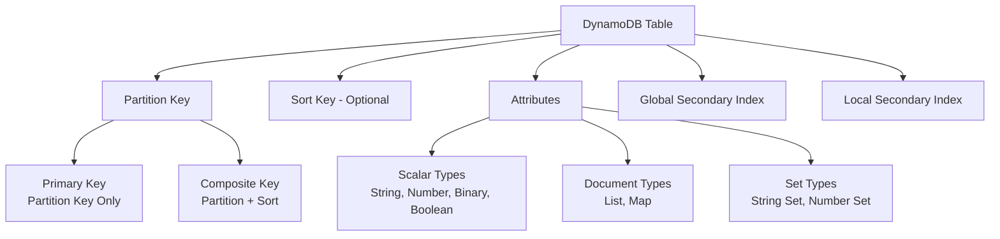
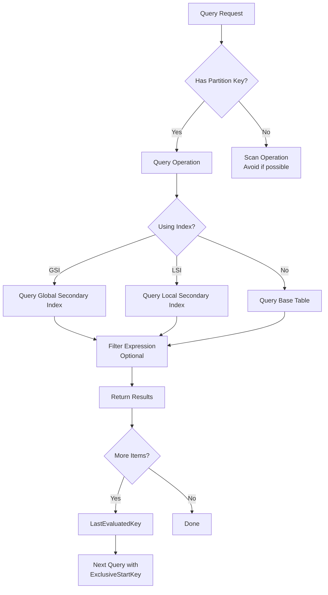
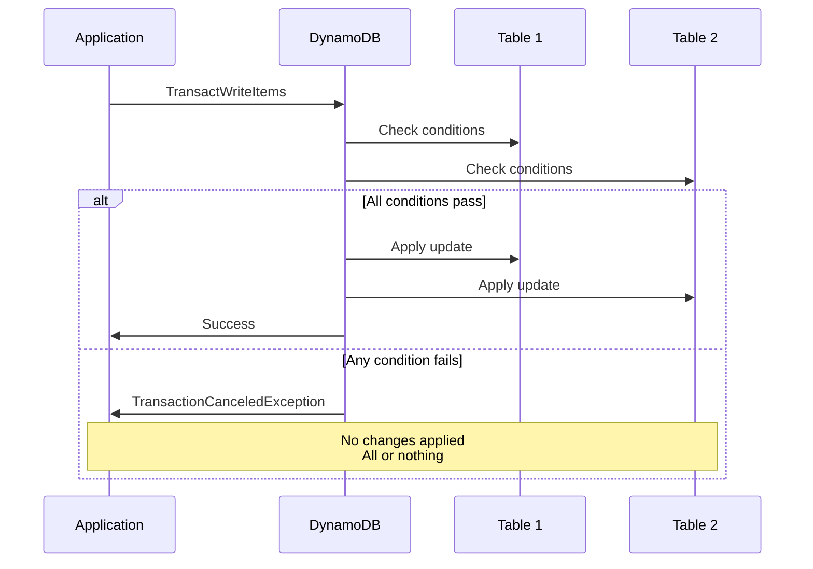
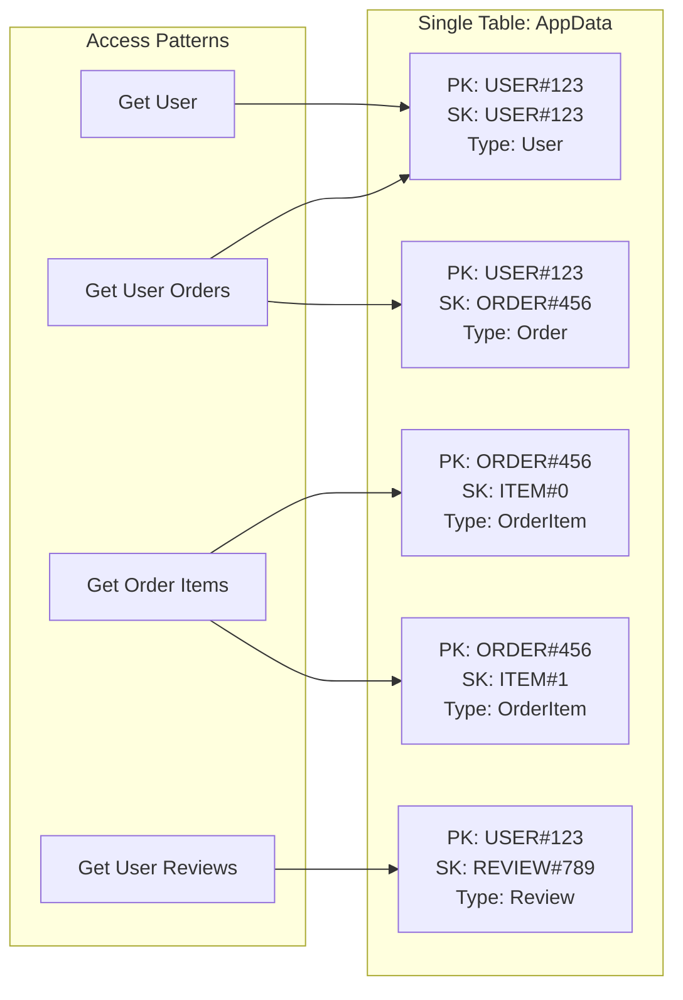

# How to Use DynamoDB with Node.js

Author: [nawazdhandala](https://github.com/nawazdhandala)

Tags: DynamoDB, Node.js, AWS, NoSQL, Database, Serverless

Description: Learn how to use Amazon DynamoDB with Node.js, covering setup, CRUD operations, queries, indexes, transactions, and best practices for building scalable applications.

---

Amazon DynamoDB is a fully managed NoSQL database service that provides fast and predictable performance with seamless scalability. When combined with Node.js, you get a powerful stack for building serverless and scalable applications. Understanding DynamoDB's data model and access patterns is essential for designing efficient applications.

## Understanding DynamoDB Concepts

Before diving into code, let's understand the key concepts that make DynamoDB different from traditional databases.



## Setting Up the AWS SDK

### Installation

Install the AWS SDK v3 for JavaScript, which provides modular packages for better tree-shaking and smaller bundle sizes.

```bash
npm install @aws-sdk/client-dynamodb @aws-sdk/lib-dynamodb @aws-sdk/util-dynamodb
```

### Client Configuration

Create a DynamoDB client with proper configuration. The DocumentClient simplifies working with JavaScript objects by automatically marshalling and unmarshalling DynamoDB attribute values.

```javascript
// dynamodb-client.js
const { DynamoDBClient } = require('@aws-sdk/client-dynamodb');
const { DynamoDBDocumentClient } = require('@aws-sdk/lib-dynamodb');

// Create the base DynamoDB client with region configuration
const client = new DynamoDBClient({
  region: process.env.AWS_REGION || 'us-east-1',
  // For local development with DynamoDB Local
  ...(process.env.DYNAMODB_ENDPOINT && {
    endpoint: process.env.DYNAMODB_ENDPOINT,
    credentials: {
      accessKeyId: 'local',
      secretAccessKey: 'local',
    },
  }),
});

// Wrap with DocumentClient for easier JavaScript object handling
// translateConfig options simplify empty value handling
const docClient = DynamoDBDocumentClient.from(client, {
  marshallOptions: {
    // Remove undefined values from objects
    removeUndefinedValues: true,
    // Convert empty strings to null (DynamoDB does not support empty strings)
    convertEmptyValues: true,
  },
  unmarshallOptions: {
    // Return numbers as native JavaScript numbers instead of strings
    wrapNumbers: false,
  },
});

module.exports = { client, docClient };
```

### Environment Configuration

Set up your environment variables for AWS credentials and region settings.

```bash
# .env file
AWS_REGION=us-east-1
AWS_ACCESS_KEY_ID=your_access_key
AWS_SECRET_ACCESS_KEY=your_secret_key

# For local development with DynamoDB Local
DYNAMODB_ENDPOINT=http://localhost:8000
```

## Creating Tables

### Table Design

Design your table schema carefully, as DynamoDB requires you to define the primary key at creation time. Consider your access patterns before choosing partition and sort keys.

```javascript
// create-table.js
const { CreateTableCommand } = require('@aws-sdk/client-dynamodb');
const { client } = require('./dynamodb-client');

async function createUsersTable() {
  const params = {
    TableName: 'Users',
    // Define the key schema - partition key and optional sort key
    KeySchema: [
      { AttributeName: 'userId', KeyType: 'HASH' },  // Partition key
    ],
    // Define attribute types for keys and indexes only
    AttributeDefinitions: [
      { AttributeName: 'userId', AttributeType: 'S' },  // S = String
      { AttributeName: 'email', AttributeType: 'S' },
    ],
    // On-demand billing scales automatically
    BillingMode: 'PAY_PER_REQUEST',
    // Global Secondary Index for querying by email
    GlobalSecondaryIndexes: [
      {
        IndexName: 'EmailIndex',
        KeySchema: [
          { AttributeName: 'email', KeyType: 'HASH' },
        ],
        // Project all attributes to the index
        Projection: { ProjectionType: 'ALL' },
      },
    ],
  };

  try {
    const command = new CreateTableCommand(params);
    const result = await client.send(command);
    console.log('Table created:', result.TableDescription.TableName);
    return result;
  } catch (error) {
    if (error.name === 'ResourceInUseException') {
      console.log('Table already exists');
    } else {
      throw error;
    }
  }
}

// Create a table with composite primary key for time-series data
async function createOrdersTable() {
  const params = {
    TableName: 'Orders',
    KeySchema: [
      { AttributeName: 'customerId', KeyType: 'HASH' },   // Partition key
      { AttributeName: 'orderId', KeyType: 'RANGE' },     // Sort key
    ],
    AttributeDefinitions: [
      { AttributeName: 'customerId', AttributeType: 'S' },
      { AttributeName: 'orderId', AttributeType: 'S' },
      { AttributeName: 'orderDate', AttributeType: 'S' },
      { AttributeName: 'status', AttributeType: 'S' },
    ],
    BillingMode: 'PAY_PER_REQUEST',
    // Local Secondary Index - same partition key, different sort key
    LocalSecondaryIndexes: [
      {
        IndexName: 'OrderDateIndex',
        KeySchema: [
          { AttributeName: 'customerId', KeyType: 'HASH' },
          { AttributeName: 'orderDate', KeyType: 'RANGE' },
        ],
        Projection: { ProjectionType: 'ALL' },
      },
    ],
    // Global Secondary Index - query orders by status across all customers
    GlobalSecondaryIndexes: [
      {
        IndexName: 'StatusIndex',
        KeySchema: [
          { AttributeName: 'status', KeyType: 'HASH' },
          { AttributeName: 'orderDate', KeyType: 'RANGE' },
        ],
        Projection: {
          ProjectionType: 'INCLUDE',
          NonKeyAttributes: ['customerId', 'total'],
        },
      },
    ],
  };

  const command = new CreateTableCommand(params);
  return await client.send(command);
}
```

## Basic CRUD Operations

### Creating Items

Insert items into DynamoDB using the PutItem operation. Each item must include the primary key attributes.

```javascript
// crud-operations.js
const { PutCommand, GetCommand, UpdateCommand, DeleteCommand } = require('@aws-sdk/lib-dynamodb');
const { docClient } = require('./dynamodb-client');

// Create a new user - PutItem replaces the entire item if it exists
async function createUser(user) {
  const params = {
    TableName: 'Users',
    Item: {
      userId: user.id,
      email: user.email,
      name: user.name,
      createdAt: new Date().toISOString(),
      updatedAt: new Date().toISOString(),
      // DynamoDB supports nested objects
      profile: {
        avatar: user.avatar || null,
        bio: user.bio || null,
        settings: {
          notifications: true,
          theme: 'dark',
        },
      },
      // Store arrays as Lists
      tags: user.tags || [],
    },
    // Prevent overwriting existing items
    ConditionExpression: 'attribute_not_exists(userId)',
  };

  try {
    const command = new PutCommand(params);
    await docClient.send(command);
    return { success: true, userId: user.id };
  } catch (error) {
    if (error.name === 'ConditionalCheckFailedException') {
      throw new Error('User already exists');
    }
    throw error;
  }
}

// Create order with composite key
async function createOrder(order) {
  const orderId = `ORD-${Date.now()}-${Math.random().toString(36).substr(2, 9)}`;

  const params = {
    TableName: 'Orders',
    Item: {
      customerId: order.customerId,
      orderId: orderId,
      orderDate: new Date().toISOString(),
      status: 'pending',
      items: order.items,
      total: order.items.reduce((sum, item) => sum + (item.price * item.quantity), 0),
      shippingAddress: order.shippingAddress,
    },
  };

  const command = new PutCommand(params);
  await docClient.send(command);
  return { orderId, ...params.Item };
}
```

### Reading Items

Retrieve items using GetItem for direct key lookups, which provides consistent, single-digit millisecond performance.

```javascript
// Get a single item by primary key - fast and efficient
async function getUser(userId) {
  const params = {
    TableName: 'Users',
    Key: { userId },
    // Use consistent read for most recent data (costs more RCUs)
    ConsistentRead: true,
  };

  const command = new GetCommand(params);
  const result = await docClient.send(command);
  return result.Item || null;
}

// Get order by composite key
async function getOrder(customerId, orderId) {
  const params = {
    TableName: 'Orders',
    Key: {
      customerId,
      orderId,
    },
    // Select specific attributes to reduce data transfer
    ProjectionExpression: 'orderId, #status, total, orderDate',
    // Use ExpressionAttributeNames for reserved words
    ExpressionAttributeNames: {
      '#status': 'status',
    },
  };

  const command = new GetCommand(params);
  const result = await docClient.send(command);
  return result.Item || null;
}
```

### Updating Items

Update specific attributes without replacing the entire item using UpdateItem with update expressions.

```javascript
// Update specific attributes - more efficient than PutItem for partial updates
async function updateUser(userId, updates) {
  // Build update expression dynamically
  const updateExpressions = [];
  const expressionAttributeNames = {};
  const expressionAttributeValues = {};

  Object.entries(updates).forEach(([key, value], index) => {
    const attrName = `#attr${index}`;
    const attrValue = `:val${index}`;

    updateExpressions.push(`${attrName} = ${attrValue}`);
    expressionAttributeNames[attrName] = key;
    expressionAttributeValues[attrValue] = value;
  });

  // Always update the updatedAt timestamp
  updateExpressions.push('#updatedAt = :updatedAt');
  expressionAttributeNames['#updatedAt'] = 'updatedAt';
  expressionAttributeValues[':updatedAt'] = new Date().toISOString();

  const params = {
    TableName: 'Users',
    Key: { userId },
    UpdateExpression: `SET ${updateExpressions.join(', ')}`,
    ExpressionAttributeNames: expressionAttributeNames,
    ExpressionAttributeValues: expressionAttributeValues,
    // Return the updated item
    ReturnValues: 'ALL_NEW',
    // Ensure item exists before updating
    ConditionExpression: 'attribute_exists(userId)',
  };

  try {
    const command = new UpdateCommand(params);
    const result = await docClient.send(command);
    return result.Attributes;
  } catch (error) {
    if (error.name === 'ConditionalCheckFailedException') {
      throw new Error('User not found');
    }
    throw error;
  }
}

// Update order status with optimistic locking
async function updateOrderStatus(customerId, orderId, newStatus, expectedVersion) {
  const params = {
    TableName: 'Orders',
    Key: { customerId, orderId },
    UpdateExpression: 'SET #status = :newStatus, #version = :newVersion, updatedAt = :updatedAt',
    ExpressionAttributeNames: {
      '#status': 'status',
      '#version': 'version',
    },
    ExpressionAttributeValues: {
      ':newStatus': newStatus,
      ':newVersion': expectedVersion + 1,
      ':expectedVersion': expectedVersion,
      ':updatedAt': new Date().toISOString(),
    },
    // Optimistic locking - only update if version matches
    ConditionExpression: '#version = :expectedVersion',
    ReturnValues: 'ALL_NEW',
  };

  const command = new UpdateCommand(params);
  return await docClient.send(command);
}

// Atomic counter increment
async function incrementViewCount(userId) {
  const params = {
    TableName: 'Users',
    Key: { userId },
    // ADD creates the attribute if it does not exist
    UpdateExpression: 'ADD viewCount :inc',
    ExpressionAttributeValues: {
      ':inc': 1,
    },
    ReturnValues: 'UPDATED_NEW',
  };

  const command = new UpdateCommand(params);
  const result = await docClient.send(command);
  return result.Attributes.viewCount;
}
```

### Deleting Items

Remove items from the table using DeleteItem with optional conditions.

```javascript
// Delete item with condition
async function deleteUser(userId, expectedEmail) {
  const params = {
    TableName: 'Users',
    Key: { userId },
    // Only delete if email matches - prevents accidental deletion
    ConditionExpression: 'email = :email',
    ExpressionAttributeValues: {
      ':email': expectedEmail,
    },
    // Return deleted item for logging or undo functionality
    ReturnValues: 'ALL_OLD',
  };

  try {
    const command = new DeleteCommand(params);
    const result = await docClient.send(command);
    return result.Attributes;
  } catch (error) {
    if (error.name === 'ConditionalCheckFailedException') {
      throw new Error('Email mismatch or user not found');
    }
    throw error;
  }
}
```

## Querying Data

### Query Operations

Query is the most efficient way to retrieve multiple items when you know the partition key. Use filter expressions to refine results after the query.

```javascript
// query-operations.js
const { QueryCommand, ScanCommand } = require('@aws-sdk/lib-dynamodb');
const { docClient } = require('./dynamodb-client');

// Query orders for a specific customer
async function getCustomerOrders(customerId, options = {}) {
  const params = {
    TableName: 'Orders',
    // KeyConditionExpression must include the partition key
    KeyConditionExpression: 'customerId = :customerId',
    ExpressionAttributeValues: {
      ':customerId': customerId,
    },
    // Sort by orderId descending (newest first)
    ScanIndexForward: false,
    // Limit results for pagination
    Limit: options.limit || 20,
  };

  // Add sort key condition for date range
  if (options.startDate && options.endDate) {
    params.KeyConditionExpression += ' AND orderId BETWEEN :start AND :end';
    params.ExpressionAttributeValues[':start'] = options.startDate;
    params.ExpressionAttributeValues[':end'] = options.endDate;
  }

  // Filter by status (applied after query, still consumes RCUs)
  if (options.status) {
    params.FilterExpression = '#status = :status';
    params.ExpressionAttributeNames = { '#status': 'status' };
    params.ExpressionAttributeValues[':status'] = options.status;
  }

  // Continue from last evaluated key for pagination
  if (options.lastKey) {
    params.ExclusiveStartKey = options.lastKey;
  }

  const command = new QueryCommand(params);
  const result = await docClient.send(command);

  return {
    items: result.Items,
    lastKey: result.LastEvaluatedKey,
    count: result.Count,
  };
}

// Query using Local Secondary Index - orders by date for a customer
async function getCustomerOrdersByDate(customerId, startDate, endDate) {
  const params = {
    TableName: 'Orders',
    IndexName: 'OrderDateIndex',
    KeyConditionExpression: 'customerId = :customerId AND orderDate BETWEEN :start AND :end',
    ExpressionAttributeValues: {
      ':customerId': customerId,
      ':start': startDate,
      ':end': endDate,
    },
    ScanIndexForward: false,
  };

  const command = new QueryCommand(params);
  const result = await docClient.send(command);
  return result.Items;
}

// Query using Global Secondary Index - orders by status
async function getOrdersByStatus(status, limit = 50) {
  const params = {
    TableName: 'Orders',
    IndexName: 'StatusIndex',
    KeyConditionExpression: '#status = :status',
    ExpressionAttributeNames: {
      '#status': 'status',
    },
    ExpressionAttributeValues: {
      ':status': status,
    },
    Limit: limit,
    ScanIndexForward: false,
  };

  const command = new QueryCommand(params);
  const result = await docClient.send(command);
  return result.Items;
}
```

### Query Flow Diagram



### Pagination

Handle large result sets with cursor-based pagination using LastEvaluatedKey.

```javascript
// Paginate through all results
async function getAllCustomerOrders(customerId) {
  const allOrders = [];
  let lastKey = null;

  do {
    const params = {
      TableName: 'Orders',
      KeyConditionExpression: 'customerId = :customerId',
      ExpressionAttributeValues: {
        ':customerId': customerId,
      },
      Limit: 100,
      ...(lastKey && { ExclusiveStartKey: lastKey }),
    };

    const command = new QueryCommand(params);
    const result = await docClient.send(command);

    allOrders.push(...result.Items);
    lastKey = result.LastEvaluatedKey;
  } while (lastKey);

  return allOrders;
}

// API endpoint with pagination
async function listOrders(req, res) {
  const { customerId } = req.params;
  const { cursor, limit = 20 } = req.query;

  const params = {
    TableName: 'Orders',
    KeyConditionExpression: 'customerId = :customerId',
    ExpressionAttributeValues: {
      ':customerId': customerId,
    },
    Limit: Math.min(parseInt(limit), 100),
  };

  // Decode cursor from base64
  if (cursor) {
    try {
      params.ExclusiveStartKey = JSON.parse(Buffer.from(cursor, 'base64').toString());
    } catch (e) {
      return res.status(400).json({ error: 'Invalid cursor' });
    }
  }

  const command = new QueryCommand(params);
  const result = await docClient.send(command);

  // Encode next cursor
  const nextCursor = result.LastEvaluatedKey
    ? Buffer.from(JSON.stringify(result.LastEvaluatedKey)).toString('base64')
    : null;

  res.json({
    items: result.Items,
    nextCursor,
    hasMore: !!result.LastEvaluatedKey,
  });
}
```

## Batch Operations

### Batch Write

Write up to 25 items in a single request for better throughput.

```javascript
// batch-operations.js
const { BatchWriteCommand, BatchGetCommand } = require('@aws-sdk/lib-dynamodb');
const { docClient } = require('./dynamodb-client');

// Batch write with automatic retry for unprocessed items
async function batchWriteItems(items, tableName) {
  // DynamoDB limits batch writes to 25 items
  const BATCH_SIZE = 25;
  const batches = [];

  for (let i = 0; i < items.length; i += BATCH_SIZE) {
    batches.push(items.slice(i, i + BATCH_SIZE));
  }

  for (const batch of batches) {
    let unprocessedItems = {
      [tableName]: batch.map(item => ({
        PutRequest: { Item: item },
      })),
    };

    // Retry loop for unprocessed items
    let retries = 0;
    const maxRetries = 5;

    while (Object.keys(unprocessedItems).length > 0 && retries < maxRetries) {
      const params = {
        RequestItems: unprocessedItems,
      };

      const command = new BatchWriteCommand(params);
      const result = await docClient.send(command);

      unprocessedItems = result.UnprocessedItems || {};

      if (Object.keys(unprocessedItems).length > 0) {
        retries++;
        // Exponential backoff
        await new Promise(resolve => setTimeout(resolve, Math.pow(2, retries) * 100));
      }
    }

    if (Object.keys(unprocessedItems).length > 0) {
      throw new Error(`Failed to write ${Object.values(unprocessedItems).flat().length} items after ${maxRetries} retries`);
    }
  }

  return { success: true, itemCount: items.length };
}

// Batch delete items
async function batchDeleteItems(keys, tableName) {
  const BATCH_SIZE = 25;

  for (let i = 0; i < keys.length; i += BATCH_SIZE) {
    const batch = keys.slice(i, i + BATCH_SIZE);

    const params = {
      RequestItems: {
        [tableName]: batch.map(key => ({
          DeleteRequest: { Key: key },
        })),
      },
    };

    const command = new BatchWriteCommand(params);
    await docClient.send(command);
  }
}
```

### Batch Get

Retrieve up to 100 items across multiple tables in a single request.

```javascript
// Batch get items from multiple tables
async function batchGetItems(requests) {
  const BATCH_SIZE = 100;
  const results = {};

  // Initialize results for each table
  Object.keys(requests).forEach(table => {
    results[table] = [];
  });

  // Process in batches
  let allKeys = [];
  Object.entries(requests).forEach(([table, keys]) => {
    keys.forEach(key => {
      allKeys.push({ table, key });
    });
  });

  for (let i = 0; i < allKeys.length; i += BATCH_SIZE) {
    const batch = allKeys.slice(i, i + BATCH_SIZE);

    // Group by table
    const requestItems = {};
    batch.forEach(({ table, key }) => {
      if (!requestItems[table]) {
        requestItems[table] = { Keys: [] };
      }
      requestItems[table].Keys.push(key);
    });

    const params = { RequestItems: requestItems };
    const command = new BatchGetCommand(params);
    const result = await docClient.send(command);

    // Collect responses
    Object.entries(result.Responses || {}).forEach(([table, items]) => {
      results[table].push(...items);
    });

    // Handle unprocessed keys with retry
    if (result.UnprocessedKeys && Object.keys(result.UnprocessedKeys).length > 0) {
      const retryResult = await batchGetItems(
        Object.fromEntries(
          Object.entries(result.UnprocessedKeys).map(([table, { Keys }]) => [table, Keys])
        )
      );
      Object.entries(retryResult).forEach(([table, items]) => {
        results[table].push(...items);
      });
    }
  }

  return results;
}

// Usage example
async function getUsersWithOrders(userIds) {
  const results = await batchGetItems({
    Users: userIds.map(userId => ({ userId })),
    Orders: userIds.map(userId => ({ customerId: userId, orderId: 'latest' })),
  });

  return results;
}
```

## Transactions

### TransactWrite

Perform atomic writes across multiple items and tables with ACID guarantees.

```javascript
// transactions.js
const { TransactWriteCommand, TransactGetCommand } = require('@aws-sdk/lib-dynamodb');
const { docClient } = require('./dynamodb-client');

// Transfer credits between users atomically
async function transferCredits(fromUserId, toUserId, amount) {
  const params = {
    TransactItems: [
      {
        // Deduct from sender
        Update: {
          TableName: 'Users',
          Key: { userId: fromUserId },
          UpdateExpression: 'SET credits = credits - :amount',
          ConditionExpression: 'credits >= :amount',
          ExpressionAttributeValues: {
            ':amount': amount,
          },
        },
      },
      {
        // Add to receiver
        Update: {
          TableName: 'Users',
          Key: { userId: toUserId },
          UpdateExpression: 'SET credits = credits + :amount',
          ConditionExpression: 'attribute_exists(userId)',
          ExpressionAttributeValues: {
            ':amount': amount,
          },
        },
      },
      {
        // Record the transaction
        Put: {
          TableName: 'Transactions',
          Item: {
            transactionId: `TXN-${Date.now()}`,
            fromUserId,
            toUserId,
            amount,
            type: 'transfer',
            createdAt: new Date().toISOString(),
          },
        },
      },
    ],
  };

  try {
    const command = new TransactWriteCommand(params);
    await docClient.send(command);
    return { success: true };
  } catch (error) {
    if (error.name === 'TransactionCanceledException') {
      // Check which condition failed
      const reasons = error.CancellationReasons || [];
      if (reasons[0]?.Code === 'ConditionalCheckFailed') {
        throw new Error('Insufficient credits');
      }
      if (reasons[1]?.Code === 'ConditionalCheckFailed') {
        throw new Error('Recipient not found');
      }
    }
    throw error;
  }
}

// Create order with inventory check
async function createOrderWithInventory(order) {
  const orderId = `ORD-${Date.now()}`;
  const transactItems = [];

  // Add order creation
  transactItems.push({
    Put: {
      TableName: 'Orders',
      Item: {
        customerId: order.customerId,
        orderId,
        items: order.items,
        total: order.total,
        status: 'confirmed',
        createdAt: new Date().toISOString(),
      },
    },
  });

  // Decrement inventory for each item
  order.items.forEach(item => {
    transactItems.push({
      Update: {
        TableName: 'Products',
        Key: { productId: item.productId },
        UpdateExpression: 'SET inventory = inventory - :quantity',
        ConditionExpression: 'inventory >= :quantity',
        ExpressionAttributeValues: {
          ':quantity': item.quantity,
        },
      },
    });
  });

  const params = { TransactItems: transactItems };
  const command = new TransactWriteCommand(params);

  try {
    await docClient.send(command);
    return { orderId, status: 'confirmed' };
  } catch (error) {
    if (error.name === 'TransactionCanceledException') {
      throw new Error('Insufficient inventory for one or more items');
    }
    throw error;
  }
}
```

### Transaction Flow



## Time-to-Live (TTL)

### Configuring TTL

Automatically expire items after a specified time, useful for sessions, caches, and temporary data.

```javascript
// Enable TTL on a table (one-time setup via AWS Console or CLI)
// aws dynamodb update-time-to-live --table-name Sessions \
//   --time-to-live-specification "Enabled=true, AttributeName=expiresAt"

// Create item with TTL
async function createSession(userId, sessionData) {
  const sessionId = `SES-${Date.now()}-${Math.random().toString(36).substr(2, 9)}`;

  // TTL must be Unix timestamp in seconds
  const expiresAt = Math.floor(Date.now() / 1000) + (24 * 60 * 60); // 24 hours from now

  const params = {
    TableName: 'Sessions',
    Item: {
      sessionId,
      userId,
      data: sessionData,
      createdAt: new Date().toISOString(),
      expiresAt, // DynamoDB will automatically delete when this timestamp passes
    },
  };

  const command = new PutCommand(params);
  await docClient.send(command);
  return { sessionId, expiresAt: new Date(expiresAt * 1000).toISOString() };
}

// Extend session TTL
async function extendSession(sessionId, additionalSeconds) {
  const newExpiresAt = Math.floor(Date.now() / 1000) + additionalSeconds;

  const params = {
    TableName: 'Sessions',
    Key: { sessionId },
    UpdateExpression: 'SET expiresAt = :newExpiry',
    ConditionExpression: 'attribute_exists(sessionId) AND expiresAt > :now',
    ExpressionAttributeValues: {
      ':newExpiry': newExpiresAt,
      ':now': Math.floor(Date.now() / 1000),
    },
    ReturnValues: 'ALL_NEW',
  };

  const command = new UpdateCommand(params);
  return await docClient.send(command);
}
```

## Single-Table Design Pattern

### Modeling Relationships

Single-table design stores multiple entity types in one table, reducing the need for joins and improving performance.

```javascript
// single-table-design.js

// Entity prefixes for partition and sort keys
const ENTITY = {
  USER: 'USER',
  ORDER: 'ORDER',
  ORDER_ITEM: 'ITEM',
  REVIEW: 'REVIEW',
};

// Create user with single-table pattern
async function createUserSingleTable(userData) {
  const userId = `${ENTITY.USER}#${userData.id}`;

  const params = {
    TableName: 'AppData',
    Item: {
      PK: userId,                    // Partition key
      SK: userId,                    // Sort key (same for user entity)
      entityType: 'User',
      GSI1PK: `EMAIL#${userData.email}`,  // For email lookup
      GSI1SK: userId,
      email: userData.email,
      name: userData.name,
      createdAt: new Date().toISOString(),
    },
    ConditionExpression: 'attribute_not_exists(PK)',
  };

  const command = new PutCommand(params);
  await docClient.send(command);
  return { userId: userData.id };
}

// Create order with items in single table
async function createOrderSingleTable(orderData) {
  const orderId = `ORD-${Date.now()}`;
  const userId = `${ENTITY.USER}#${orderData.userId}`;
  const orderPK = `${ENTITY.ORDER}#${orderId}`;

  const transactItems = [
    // Order header
    {
      Put: {
        TableName: 'AppData',
        Item: {
          PK: userId,                    // User's orders grouped together
          SK: orderPK,                   // Sort by order ID
          entityType: 'Order',
          GSI1PK: orderPK,               // For direct order lookup
          GSI1SK: orderPK,
          orderId,
          status: 'pending',
          total: orderData.total,
          createdAt: new Date().toISOString(),
        },
      },
    },
  ];

  // Order items
  orderData.items.forEach((item, index) => {
    transactItems.push({
      Put: {
        TableName: 'AppData',
        Item: {
          PK: orderPK,                   // Group items under order
          SK: `${ENTITY.ORDER_ITEM}#${index}`,
          entityType: 'OrderItem',
          productId: item.productId,
          productName: item.name,
          quantity: item.quantity,
          price: item.price,
        },
      },
    });
  });

  const command = new TransactWriteCommand({ TransactItems: transactItems });
  await docClient.send(command);
  return { orderId };
}

// Get user with all orders
async function getUserWithOrders(userId) {
  const userPK = `${ENTITY.USER}#${userId}`;

  const params = {
    TableName: 'AppData',
    KeyConditionExpression: 'PK = :pk',
    ExpressionAttributeValues: {
      ':pk': userPK,
    },
  };

  const command = new QueryCommand(params);
  const result = await docClient.send(command);

  // Separate user and orders from results
  const user = result.Items.find(item => item.entityType === 'User');
  const orders = result.Items.filter(item => item.entityType === 'Order');

  return { user, orders };
}

// Get order with all items
async function getOrderWithItems(orderId) {
  const orderPK = `${ENTITY.ORDER}#${orderId}`;

  const params = {
    TableName: 'AppData',
    IndexName: 'GSI1',
    KeyConditionExpression: 'GSI1PK = :pk',
    ExpressionAttributeValues: {
      ':pk': orderPK,
    },
  };

  // Query GSI for order header
  const orderCommand = new QueryCommand(params);
  const orderResult = await docClient.send(orderCommand);

  // Query base table for order items
  const itemsParams = {
    TableName: 'AppData',
    KeyConditionExpression: 'PK = :pk AND begins_with(SK, :itemPrefix)',
    ExpressionAttributeValues: {
      ':pk': orderPK,
      ':itemPrefix': ENTITY.ORDER_ITEM,
    },
  };

  const itemsCommand = new QueryCommand(itemsParams);
  const itemsResult = await docClient.send(itemsCommand);

  return {
    order: orderResult.Items[0],
    items: itemsResult.Items,
  };
}
```

### Single-Table Data Model



## Error Handling and Best Practices

### Comprehensive Error Handling

Handle DynamoDB-specific errors appropriately in your application.

```javascript
// error-handling.js
const { ConditionalCheckFailedException, ProvisionedThroughputExceededException, ResourceNotFoundException } = require('@aws-sdk/client-dynamodb');

class DynamoDBError extends Error {
  constructor(message, code, originalError) {
    super(message);
    this.name = 'DynamoDBError';
    this.code = code;
    this.originalError = originalError;
  }
}

// Wrapper function with error handling
async function executeDynamoDBOperation(operation, operationName) {
  try {
    return await operation();
  } catch (error) {
    // Handle specific DynamoDB errors
    switch (error.name) {
      case 'ConditionalCheckFailedException':
        throw new DynamoDBError(
          'Condition check failed - item may not exist or condition was not met',
          'CONDITION_FAILED',
          error
        );

      case 'ProvisionedThroughputExceededException':
        // Implement retry with exponential backoff
        console.warn(`Throughput exceeded for ${operationName}, retrying...`);
        await sleep(1000);
        return executeDynamoDBOperation(operation, operationName);

      case 'ResourceNotFoundException':
        throw new DynamoDBError(
          'Table or index not found',
          'RESOURCE_NOT_FOUND',
          error
        );

      case 'ValidationException':
        throw new DynamoDBError(
          `Invalid request: ${error.message}`,
          'VALIDATION_ERROR',
          error
        );

      case 'TransactionCanceledException':
        const reasons = error.CancellationReasons?.map(r => r.Code).join(', ');
        throw new DynamoDBError(
          `Transaction cancelled: ${reasons}`,
          'TRANSACTION_CANCELLED',
          error
        );

      default:
        throw new DynamoDBError(
          `DynamoDB operation failed: ${error.message}`,
          'UNKNOWN_ERROR',
          error
        );
    }
  }
}

function sleep(ms) {
  return new Promise(resolve => setTimeout(resolve, ms));
}

// Usage with error handling
async function safeGetUser(userId) {
  return executeDynamoDBOperation(async () => {
    const params = {
      TableName: 'Users',
      Key: { userId },
    };
    const command = new GetCommand(params);
    const result = await docClient.send(command);
    return result.Item;
  }, 'getUser');
}
```

### Retry Logic with Exponential Backoff

Implement robust retry logic for transient failures.

```javascript
// retry-helper.js
async function withRetry(operation, options = {}) {
  const {
    maxRetries = 3,
    baseDelayMs = 100,
    maxDelayMs = 5000,
    retryableErrors = [
      'ProvisionedThroughputExceededException',
      'ThrottlingException',
      'InternalServerError',
      'ServiceUnavailable',
    ],
  } = options;

  let lastError;

  for (let attempt = 0; attempt <= maxRetries; attempt++) {
    try {
      return await operation();
    } catch (error) {
      lastError = error;

      if (!retryableErrors.includes(error.name)) {
        throw error;
      }

      if (attempt === maxRetries) {
        throw error;
      }

      // Calculate delay with exponential backoff and jitter
      const delay = Math.min(
        maxDelayMs,
        baseDelayMs * Math.pow(2, attempt) + Math.random() * 100
      );

      console.log(`Attempt ${attempt + 1} failed, retrying in ${delay}ms...`);
      await sleep(delay);
    }
  }

  throw lastError;
}

// Usage
async function reliableWrite(item) {
  return withRetry(async () => {
    const command = new PutCommand({
      TableName: 'Users',
      Item: item,
    });
    return await docClient.send(command);
  });
}
```

## Testing with DynamoDB Local

### Local Development Setup

Use DynamoDB Local for development and testing without incurring AWS costs.

```javascript
// test-setup.js
const { DynamoDBClient, CreateTableCommand, DeleteTableCommand } = require('@aws-sdk/client-dynamodb');
const { DynamoDBDocumentClient } = require('@aws-sdk/lib-dynamodb');

// Create client for local DynamoDB
function createLocalClient() {
  const client = new DynamoDBClient({
    region: 'local',
    endpoint: 'http://localhost:8000',
    credentials: {
      accessKeyId: 'local',
      secretAccessKey: 'local',
    },
  });

  return DynamoDBDocumentClient.from(client);
}

// Test helper to create and cleanup tables
async function withTestTable(tableName, keySchema, testFn) {
  const client = new DynamoDBClient({
    region: 'local',
    endpoint: 'http://localhost:8000',
    credentials: { accessKeyId: 'local', secretAccessKey: 'local' },
  });

  // Create table
  try {
    await client.send(new CreateTableCommand({
      TableName: tableName,
      KeySchema: keySchema,
      AttributeDefinitions: keySchema.map(k => ({
        AttributeName: k.AttributeName,
        AttributeType: 'S',
      })),
      BillingMode: 'PAY_PER_REQUEST',
    }));
  } catch (error) {
    if (error.name !== 'ResourceInUseException') {
      throw error;
    }
  }

  try {
    await testFn(DynamoDBDocumentClient.from(client));
  } finally {
    // Cleanup
    await client.send(new DeleteTableCommand({ TableName: tableName }));
  }
}

// Jest test example
describe('User operations', () => {
  const tableName = 'TestUsers';

  beforeAll(async () => {
    // Setup code
  });

  test('should create and retrieve user', async () => {
    await withTestTable(
      tableName,
      [{ AttributeName: 'userId', KeyType: 'HASH' }],
      async (docClient) => {
        // Create user
        await docClient.send(new PutCommand({
          TableName: tableName,
          Item: { userId: 'test-1', name: 'Test User' },
        }));

        // Retrieve user
        const result = await docClient.send(new GetCommand({
          TableName: tableName,
          Key: { userId: 'test-1' },
        }));

        expect(result.Item.name).toBe('Test User');
      }
    );
  });
});
```

### Docker Compose for Local Development

Set up DynamoDB Local with Docker for consistent development environments.

```yaml
# docker-compose.yml
version: '3.8'
services:
  dynamodb-local:
    image: amazon/dynamodb-local:latest
    container_name: dynamodb-local
    ports:
      - "8000:8000"
    command: "-jar DynamoDBLocal.jar -sharedDb -dbPath /data"
    volumes:
      - dynamodb-data:/data
    healthcheck:
      test: ["CMD-SHELL", "curl -f http://localhost:8000 || exit 1"]
      interval: 10s
      timeout: 5s
      retries: 3

  dynamodb-admin:
    image: aaronshaf/dynamodb-admin
    container_name: dynamodb-admin
    ports:
      - "8001:8001"
    environment:
      - DYNAMO_ENDPOINT=http://dynamodb-local:8000
    depends_on:
      - dynamodb-local

volumes:
  dynamodb-data:
```

## Summary

| Operation | Use Case | Key Considerations |
|-----------|----------|-------------------|
| **PutItem** | Create or replace item | Include all required attributes |
| **GetItem** | Single item lookup | Requires full primary key |
| **UpdateItem** | Partial updates | Use update expressions |
| **DeleteItem** | Remove items | Add conditions for safety |
| **Query** | Multiple items, same partition | Most efficient for related data |
| **Scan** | Full table search | Avoid in production, use indexes |
| **BatchWrite** | Bulk operations | Up to 25 items per request |
| **TransactWrite** | ACID transactions | Up to 100 items, higher cost |

DynamoDB with Node.js provides a powerful foundation for building scalable applications. Key success factors include designing your data model around access patterns, using appropriate indexes, implementing proper error handling with retries, and leveraging transactions for data integrity. Start with a clear understanding of your query requirements before creating tables, as changing the primary key structure later requires recreating the table.
