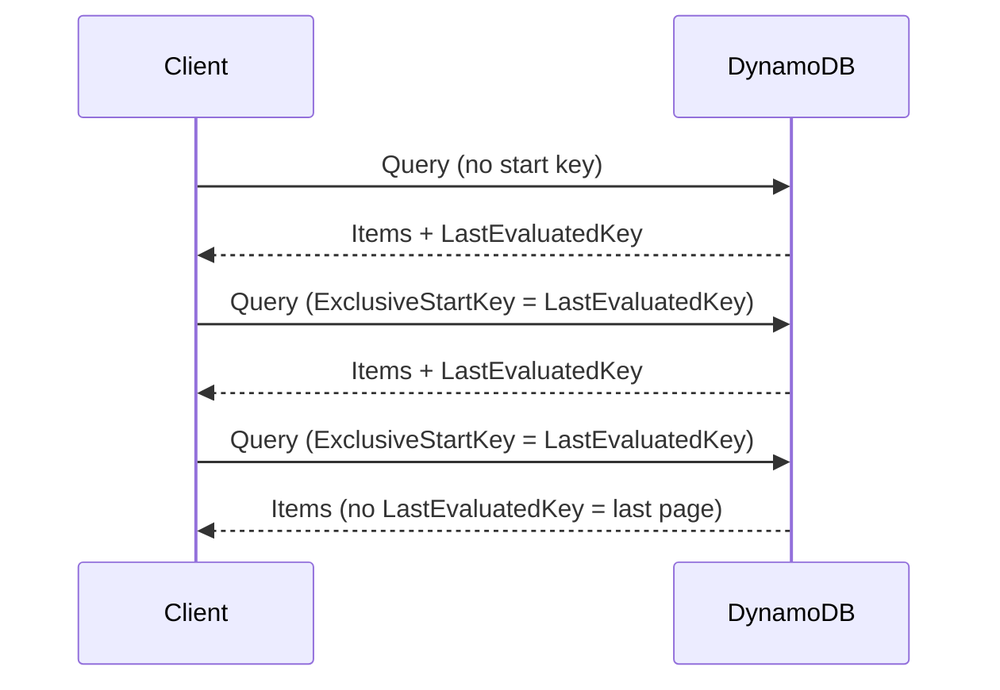
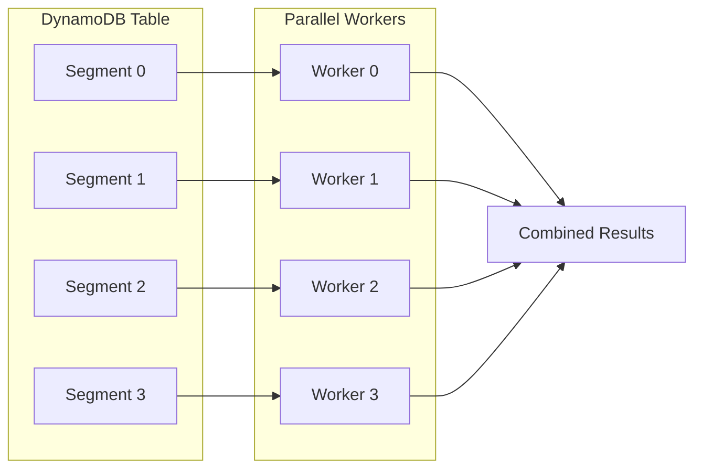
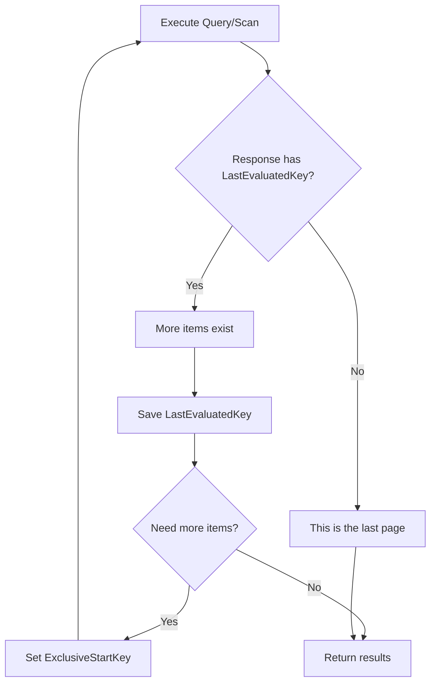

# How to Handle Pagination in DynamoDB

Author: [nawazdhandala](https://www.github.com/nawazdhandala)

Tags: DynamoDB, AWS, Pagination, NoSQL, Database, Node.js, Python, boto3, Serverless

Description: Learn how to implement efficient pagination in Amazon DynamoDB. This guide covers Query and Scan operations, exclusive start keys, cursor-based pagination, handling large datasets, and best practices for production applications.

---

> DynamoDB uses a different pagination model than traditional databases. Instead of offset-based pagination, it uses cursor-based pagination with exclusive start keys, which provides consistent performance regardless of dataset size.

Unlike SQL databases where you can use LIMIT and OFFSET, DynamoDB returns results in pages and provides a LastEvaluatedKey that you use to fetch the next page. This approach is more efficient for large datasets but requires a different implementation strategy.

---

## Understanding DynamoDB Pagination

DynamoDB pagination works through a token-based system.



Key concepts to understand:

- **LastEvaluatedKey**: Returned when more items exist beyond the current page
- **ExclusiveStartKey**: Pass the LastEvaluatedKey from the previous response to get the next page
- **Limit**: Maximum number of items to evaluate (not necessarily return after filtering)
- **No LastEvaluatedKey**: Indicates you have reached the final page

---

## Basic Pagination with Query (Node.js)

The Query operation retrieves items based on partition key and optional sort key conditions. Here is how to paginate through results.

```javascript
// Basic pagination with AWS SDK v3 for Node.js
// This function fetches a single page of results

const { DynamoDBClient } = require('@aws-sdk/client-dynamodb');
const {
  DynamoDBDocumentClient,
  QueryCommand
} = require('@aws-sdk/lib-dynamodb');

// Initialize the DynamoDB client
const client = new DynamoDBClient({ region: 'us-east-1' });
const docClient = DynamoDBDocumentClient.from(client);

async function queryWithPagination(userId, pageSize, exclusiveStartKey = null) {
  // Build the query parameters
  const params = {
    TableName: 'Orders',
    // Use KeyConditionExpression to query by partition key
    KeyConditionExpression: 'userId = :userId',
    ExpressionAttributeValues: {
      ':userId': userId
    },
    // Limit controls how many items to evaluate per request
    Limit: pageSize,
  };

  // If we have a start key from a previous page, include it
  // This tells DynamoDB where to resume reading
  if (exclusiveStartKey) {
    params.ExclusiveStartKey = exclusiveStartKey;
  }

  const response = await docClient.send(new QueryCommand(params));

  return {
    items: response.Items,
    // Return the key needed to fetch the next page
    // Will be undefined if this is the last page
    nextPageKey: response.LastEvaluatedKey,
    // Count of items returned in this page
    count: response.Count,
    // Count of items scanned before filtering
    scannedCount: response.ScannedCount
  };
}

// Example usage
async function main() {
  // First page - no start key
  const page1 = await queryWithPagination('user-123', 10);
  console.log('Page 1 items:', page1.items.length);

  // Second page - use the key from page 1
  if (page1.nextPageKey) {
    const page2 = await queryWithPagination('user-123', 10, page1.nextPageKey);
    console.log('Page 2 items:', page2.items.length);
  }
}
```

---

## Fetching All Items Across Pages

When you need all items matching a query, you must loop through all pages.

```javascript
// Fetch all items by iterating through all pages
// Use this when you need the complete result set

async function queryAllItems(userId) {
  const allItems = [];
  let exclusiveStartKey = null;

  // Keep querying until there are no more pages
  // A missing LastEvaluatedKey indicates the final page
  do {
    const params = {
      TableName: 'Orders',
      KeyConditionExpression: 'userId = :userId',
      ExpressionAttributeValues: {
        ':userId': userId
      },
      // Use a reasonable page size for efficiency
      // Larger values mean fewer round trips but more memory
      Limit: 100
    };

    if (exclusiveStartKey) {
      params.ExclusiveStartKey = exclusiveStartKey;
    }

    const response = await docClient.send(new QueryCommand(params));

    // Append items from this page to our collection
    allItems.push(...response.Items);

    // Update the start key for the next iteration
    exclusiveStartKey = response.LastEvaluatedKey;

    console.log(`Fetched ${response.Items.length} items, total: ${allItems.length}`);

  } while (exclusiveStartKey);

  return allItems;
}
```

---

## Pagination with Python (boto3)

Here is the equivalent implementation using Python and boto3.

```python
# DynamoDB pagination with boto3
# This module provides reusable pagination utilities

import boto3
from typing import Optional, Dict, Any, List, Generator
from boto3.dynamodb.conditions import Key

# Initialize the DynamoDB resource
dynamodb = boto3.resource('dynamodb', region_name='us-east-1')
table = dynamodb.Table('Orders')


def query_single_page(
    user_id: str,
    page_size: int = 20,
    exclusive_start_key: Optional[Dict] = None
) -> Dict[str, Any]:
    """
    Query a single page of items from DynamoDB.

    Args:
        user_id: The partition key value to query
        page_size: Maximum items to return per page
        exclusive_start_key: Key from previous page to continue from

    Returns:
        Dictionary with items, next_page_key, and metadata
    """
    # Build query parameters
    query_params = {
        'KeyConditionExpression': Key('userId').eq(user_id),
        'Limit': page_size
    }

    # Include start key if provided
    if exclusive_start_key:
        query_params['ExclusiveStartKey'] = exclusive_start_key

    # Execute the query
    response = table.query(**query_params)

    return {
        'items': response.get('Items', []),
        'next_page_key': response.get('LastEvaluatedKey'),
        'count': response.get('Count', 0),
        'scanned_count': response.get('ScannedCount', 0)
    }


def query_all_items(user_id: str) -> List[Dict]:
    """
    Fetch all items for a user by iterating through all pages.

    Warning: Use with caution on large datasets as this loads
    all items into memory.
    """
    all_items = []
    exclusive_start_key = None

    while True:
        result = query_single_page(
            user_id=user_id,
            page_size=100,
            exclusive_start_key=exclusive_start_key
        )

        all_items.extend(result['items'])
        exclusive_start_key = result['next_page_key']

        # No more pages when next_page_key is None
        if not exclusive_start_key:
            break

    return all_items


def query_items_generator(user_id: str, page_size: int = 100) -> Generator:
    """
    Generator that yields items one at a time, fetching pages as needed.

    This is memory-efficient for processing large datasets as it
    only keeps one page in memory at a time.
    """
    exclusive_start_key = None

    while True:
        result = query_single_page(
            user_id=user_id,
            page_size=page_size,
            exclusive_start_key=exclusive_start_key
        )

        # Yield each item individually
        for item in result['items']:
            yield item

        exclusive_start_key = result['next_page_key']

        if not exclusive_start_key:
            break


# Example usage
if __name__ == '__main__':
    # Process items one at a time without loading all into memory
    for item in query_items_generator('user-123'):
        print(f"Processing order: {item.get('orderId')}")
```

---

## Scan Pagination

Scan operations examine every item in the table. They also support pagination but are generally less efficient than Query.

```javascript
// Paginated Scan operation
// Use Scan when you need to examine all items regardless of partition key

const { ScanCommand } = require('@aws-sdk/lib-dynamodb');

async function scanWithPagination(pageSize, exclusiveStartKey = null) {
  const params = {
    TableName: 'Orders',
    Limit: pageSize,
    // Optional: filter results after scanning
    // Note: FilterExpression is applied AFTER items are read
    // so you may get fewer items than Limit
    FilterExpression: 'orderStatus = :status',
    ExpressionAttributeValues: {
      ':status': 'COMPLETED'
    }
  };

  if (exclusiveStartKey) {
    params.ExclusiveStartKey = exclusiveStartKey;
  }

  const response = await docClient.send(new ScanCommand(params));

  return {
    items: response.Items,
    nextPageKey: response.LastEvaluatedKey,
    count: response.Count,
    scannedCount: response.ScannedCount
  };
}

// Scan all items across the entire table
async function scanAllItems() {
  const allItems = [];
  let exclusiveStartKey = null;

  do {
    const result = await scanWithPagination(100, exclusiveStartKey);
    allItems.push(...result.items);
    exclusiveStartKey = result.nextPageKey;
  } while (exclusiveStartKey);

  return allItems;
}
```

---

## Parallel Scan for Large Tables

For very large tables, you can use parallel scans to speed up data retrieval.

```javascript
// Parallel Scan divides the table into segments that can be
// scanned concurrently, improving throughput for large tables

async function parallelScan(totalSegments) {
  // Create an array of scan promises, one for each segment
  const segmentPromises = [];

  for (let segment = 0; segment < totalSegments; segment++) {
    // Each segment is scanned independently
    segmentPromises.push(scanSegment(segment, totalSegments));
  }

  // Wait for all segments to complete
  const segmentResults = await Promise.all(segmentPromises);

  // Combine results from all segments
  return segmentResults.flat();
}

async function scanSegment(segment, totalSegments) {
  const items = [];
  let exclusiveStartKey = null;

  do {
    const params = {
      TableName: 'Orders',
      // Segment identifies which portion of the table to scan
      Segment: segment,
      // TotalSegments is the total number of parallel scans
      TotalSegments: totalSegments,
      Limit: 100
    };

    if (exclusiveStartKey) {
      params.ExclusiveStartKey = exclusiveStartKey;
    }

    const response = await docClient.send(new ScanCommand(params));
    items.push(...response.Items);
    exclusiveStartKey = response.LastEvaluatedKey;

  } while (exclusiveStartKey);

  return items;
}

// Usage: scan with 4 parallel workers
// Choose segment count based on table size and provisioned capacity
const allItems = await parallelScan(4);
```

The parallel scan process can be visualized as follows.



---

## Building an API with Cursor-Based Pagination

For REST APIs, you typically need to encode the LastEvaluatedKey for the client.

```javascript
// API endpoint implementation with cursor-based pagination
// The cursor is a base64-encoded LastEvaluatedKey

const express = require('express');
const app = express();

// Encode the DynamoDB key as a URL-safe cursor
function encodeCursor(lastEvaluatedKey) {
  if (!lastEvaluatedKey) return null;
  // Convert to JSON and encode as base64
  const json = JSON.stringify(lastEvaluatedKey);
  return Buffer.from(json).toString('base64url');
}

// Decode the cursor back to a DynamoDB key
function decodeCursor(cursor) {
  if (!cursor) return null;
  try {
    const json = Buffer.from(cursor, 'base64url').toString('utf8');
    return JSON.parse(json);
  } catch (error) {
    throw new Error('Invalid cursor format');
  }
}

app.get('/api/users/:userId/orders', async (req, res) => {
  const { userId } = req.params;
  // Get pagination parameters from query string
  const pageSize = Math.min(parseInt(req.query.limit) || 20, 100);
  const cursor = req.query.cursor;

  try {
    // Decode the cursor if provided
    const exclusiveStartKey = decodeCursor(cursor);

    const params = {
      TableName: 'Orders',
      KeyConditionExpression: 'userId = :userId',
      ExpressionAttributeValues: {
        ':userId': userId
      },
      Limit: pageSize
    };

    if (exclusiveStartKey) {
      params.ExclusiveStartKey = exclusiveStartKey;
    }

    const response = await docClient.send(new QueryCommand(params));

    // Build the API response
    const result = {
      data: response.Items,
      pagination: {
        count: response.Count,
        // Encode the next page key as a cursor
        nextCursor: encodeCursor(response.LastEvaluatedKey),
        hasMore: !!response.LastEvaluatedKey
      }
    };

    res.json(result);

  } catch (error) {
    console.error('Query failed:', error);
    res.status(500).json({ error: 'Failed to fetch orders' });
  }
});
```

---

## Handling FilterExpression with Pagination

When using FilterExpression, be aware that filtering happens after items are read, which can result in fewer items than your Limit.

```javascript
// Pagination with filtering requires special handling
// You may need to continue fetching until you have enough items

async function queryWithFilter(userId, status, targetCount) {
  const items = [];
  let exclusiveStartKey = null;

  // Keep fetching until we have enough items or run out of data
  while (items.length < targetCount) {
    const params = {
      TableName: 'Orders',
      KeyConditionExpression: 'userId = :userId',
      // FilterExpression is applied after reading items
      FilterExpression: 'orderStatus = :status',
      ExpressionAttributeValues: {
        ':userId': userId,
        ':status': status
      },
      // Request more items than needed to account for filtering
      Limit: Math.min(targetCount * 2, 100)
    };

    if (exclusiveStartKey) {
      params.ExclusiveStartKey = exclusiveStartKey;
    }

    const response = await docClient.send(new QueryCommand(params));

    // Add items from this page (already filtered by DynamoDB)
    items.push(...response.Items);

    exclusiveStartKey = response.LastEvaluatedKey;

    // No more data available
    if (!exclusiveStartKey) break;
  }

  // Return only the requested number of items
  return {
    items: items.slice(0, targetCount),
    // Note: cursor handling becomes complex with filtering
    // Consider using a GSI with the filter attribute as partition key
    hasMore: items.length > targetCount || !!exclusiveStartKey
  };
}
```

---

## Bidirectional Pagination

DynamoDB only supports forward pagination natively. To implement backward pagination, you need to use ScanIndexForward.

```javascript
// Bidirectional pagination using ScanIndexForward
// This allows paginating both forward and backward through results

async function queryWithDirection(
  userId,
  pageSize,
  direction = 'forward',
  exclusiveStartKey = null
) {
  const params = {
    TableName: 'Orders',
    KeyConditionExpression: 'userId = :userId',
    ExpressionAttributeValues: {
      ':userId': userId
    },
    Limit: pageSize,
    // ScanIndexForward controls sort direction
    // true = ascending (oldest first), false = descending (newest first)
    ScanIndexForward: direction === 'forward'
  };

  if (exclusiveStartKey) {
    params.ExclusiveStartKey = exclusiveStartKey;
  }

  const response = await docClient.send(new QueryCommand(params));

  return {
    items: response.Items,
    nextKey: response.LastEvaluatedKey
  };
}

// For true bidirectional pagination, you need to track both ends
class BidirectionalPaginator {
  constructor(userId, pageSize) {
    this.userId = userId;
    this.pageSize = pageSize;
    this.pageKeys = []; // Stack of page start keys
    this.currentPage = 0;
  }

  async getNextPage() {
    const startKey = this.pageKeys[this.currentPage] || null;
    const result = await queryWithDirection(
      this.userId,
      this.pageSize,
      'forward',
      startKey
    );

    if (result.nextKey) {
      this.pageKeys[this.currentPage + 1] = result.nextKey;
    }

    this.currentPage++;
    return result.items;
  }

  async getPreviousPage() {
    if (this.currentPage <= 1) {
      // Already at first page
      return this.getFirstPage();
    }

    this.currentPage -= 2;
    return this.getNextPage();
  }

  async getFirstPage() {
    this.pageKeys = [];
    this.currentPage = 0;
    return this.getNextPage();
  }
}
```

---

## Pagination with Global Secondary Indexes

When querying a GSI, pagination works the same way but uses the GSI's key structure.

```javascript
// Pagination on a Global Secondary Index
// The ExclusiveStartKey must include both GSI keys and table keys

async function queryGSI(status, pageSize, exclusiveStartKey = null) {
  const params = {
    TableName: 'Orders',
    // Specify the index name
    IndexName: 'StatusIndex',
    KeyConditionExpression: 'orderStatus = :status',
    ExpressionAttributeValues: {
      ':status': status
    },
    Limit: pageSize
  };

  if (exclusiveStartKey) {
    // The start key for a GSI includes:
    // - GSI partition key
    // - GSI sort key (if any)
    // - Table partition key
    // - Table sort key (if any)
    params.ExclusiveStartKey = exclusiveStartKey;
  }

  const response = await docClient.send(new QueryCommand(params));

  return {
    items: response.Items,
    // The LastEvaluatedKey will contain all necessary key attributes
    nextPageKey: response.LastEvaluatedKey,
    count: response.Count
  };
}

// Example: paginate through all pending orders
async function getAllPendingOrders() {
  const allOrders = [];
  let nextKey = null;

  do {
    const result = await queryGSI('PENDING', 50, nextKey);
    allOrders.push(...result.items);
    nextKey = result.nextPageKey;
  } while (nextKey);

  return allOrders;
}
```

---

## Count Items Without Fetching Data

Sometimes you only need the count of items matching a query.

```python
# Count items efficiently without returning the actual data
# Useful for displaying total counts in UI

def count_items(user_id: str) -> int:
    """
    Count all items for a user without fetching the item data.
    Uses Select='COUNT' to minimize data transfer.
    """
    total_count = 0
    exclusive_start_key = None

    while True:
        query_params = {
            'KeyConditionExpression': Key('userId').eq(user_id),
            # Select COUNT returns only the count, not item data
            'Select': 'COUNT'
        }

        if exclusive_start_key:
            query_params['ExclusiveStartKey'] = exclusive_start_key

        response = table.query(**query_params)

        # Accumulate the count from each page
        total_count += response.get('Count', 0)
        exclusive_start_key = response.get('LastEvaluatedKey')

        if not exclusive_start_key:
            break

    return total_count


# Note: For very large datasets, consider maintaining a counter
# in a separate item that you update with each write operation
```

---

## Pagination Behavior Summary

The following diagram shows the decision flow for handling pagination responses.



---

## Best Practices

**1. Always Handle Pagination**

Never assume a single request will return all items. The 1MB response limit means you must always check for LastEvaluatedKey.

```javascript
// Bad: assumes all items are returned
const response = await docClient.send(new QueryCommand(params));
return response.Items; // May be incomplete!

// Good: handles pagination
let items = [];
let lastKey = null;
do {
  const response = await docClient.send(new QueryCommand({...params, ExclusiveStartKey: lastKey}));
  items.push(...response.Items);
  lastKey = response.LastEvaluatedKey;
} while (lastKey);
```

**2. Use Appropriate Page Sizes**

Balance between number of round trips and memory usage. Typical values range from 20-100 items per page.

**3. Implement Timeouts for Full Scans**

When iterating through all pages, implement safeguards against infinite loops or excessive runtime.

```javascript
async function safeQueryAll(params, maxIterations = 1000) {
  const items = [];
  let iterations = 0;
  let lastKey = null;

  do {
    if (iterations++ >= maxIterations) {
      throw new Error('Maximum iterations exceeded');
    }

    const response = await docClient.send(new QueryCommand({
      ...params,
      ExclusiveStartKey: lastKey
    }));

    items.push(...response.Items);
    lastKey = response.LastEvaluatedKey;

  } while (lastKey);

  return items;
}
```

**4. Consider Using GSIs for Common Access Patterns**

If you frequently filter on a specific attribute, create a GSI with that attribute as the partition key to avoid expensive scans with filters.

**5. Monitor Consumed Capacity**

Track read capacity consumption when paginating through large datasets.

```javascript
const params = {
  TableName: 'Orders',
  KeyConditionExpression: 'userId = :userId',
  ExpressionAttributeValues: { ':userId': userId },
  // Request capacity metrics
  ReturnConsumedCapacity: 'TOTAL'
};

const response = await docClient.send(new QueryCommand(params));
console.log('Consumed capacity:', response.ConsumedCapacity);
```

---

## Common Pitfalls

**Limit Does Not Guarantee Return Count**

The Limit parameter specifies how many items to evaluate, not how many to return. With FilterExpression, you may get fewer items than Limit.

**Cannot Skip Pages**

Unlike SQL OFFSET, you cannot jump to page N directly. You must traverse from the beginning or maintain a cache of page keys.

**Cursor Expiration**

DynamoDB does not have cursor timeouts, but the data may change between requests. The cursor points to a specific item, which may have been deleted.

**Large Item Sizes**

The 1MB limit applies to the total response size. With large items, you may get very few items per page even without a Limit.

---

## Monitoring Pagination Performance

Understanding how your pagination performs in production is crucial for maintaining a reliable application. You need visibility into query latency, consumed capacity, and pagination patterns across your services.

**Consider monitoring these key metrics:**

- Query and Scan latency per page
- Consumed read capacity units (RCUs)
- Number of pages per complete iteration
- Throttling events during pagination
- Error rates for pagination operations

With proper observability, you can identify slow queries, optimize page sizes, and ensure your DynamoDB pagination scales with your application.

---

## Conclusion

DynamoDB pagination is fundamentally different from traditional SQL pagination. The cursor-based approach using LastEvaluatedKey and ExclusiveStartKey provides consistent performance for large datasets but requires careful implementation. Always handle pagination in your code, use appropriate page sizes, and consider your access patterns when designing your table schema and indexes.

Ready to monitor your DynamoDB-powered applications? [OneUptime](https://oneuptime.com) provides comprehensive monitoring for serverless applications, including DynamoDB query performance tracking, latency monitoring, and alerting to keep your pagination running smoothly in production.
