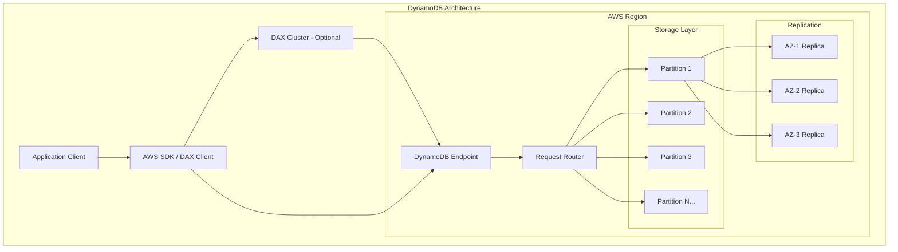
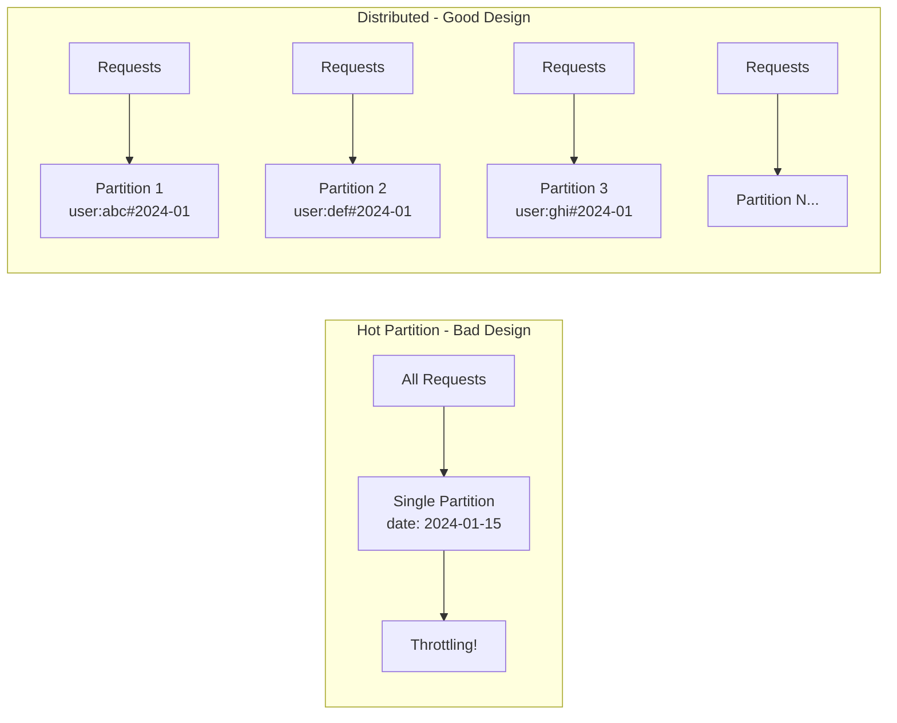
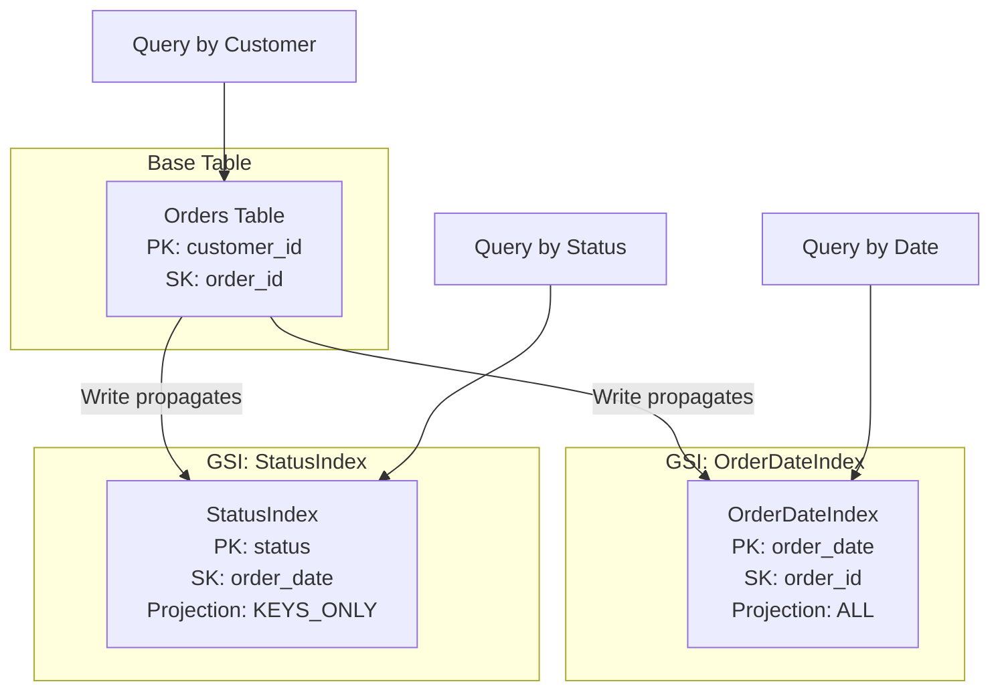
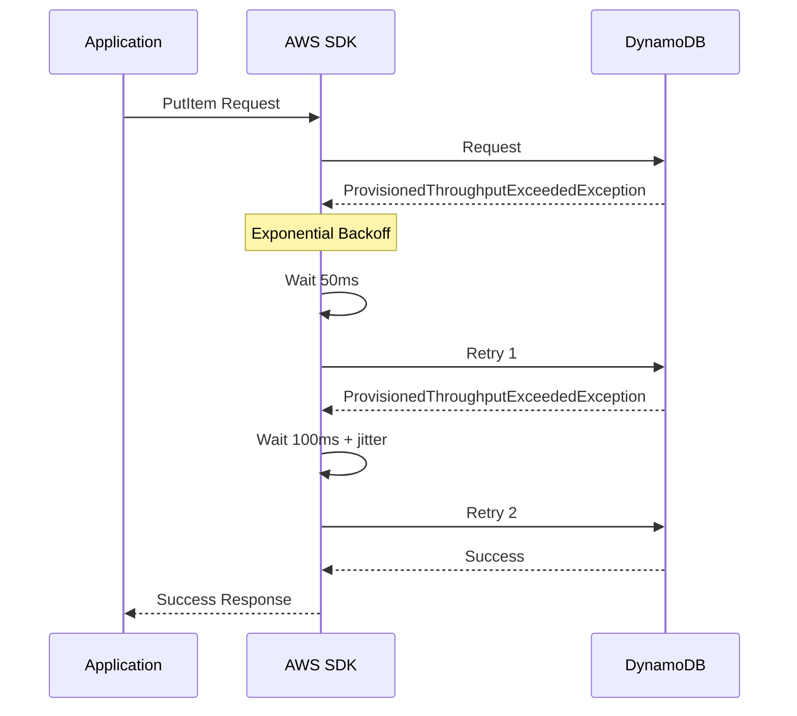
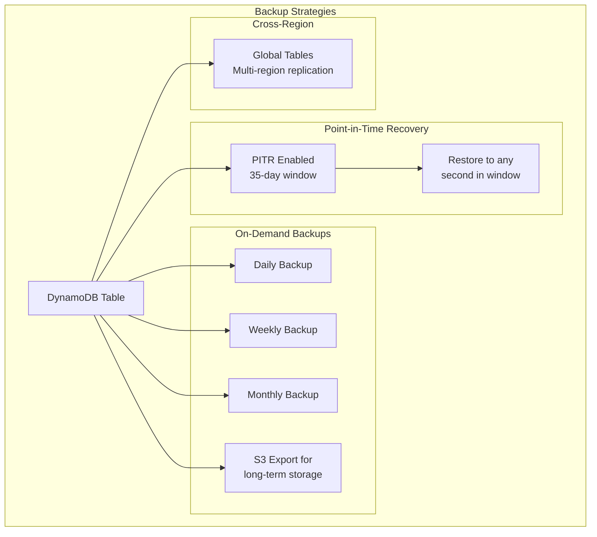
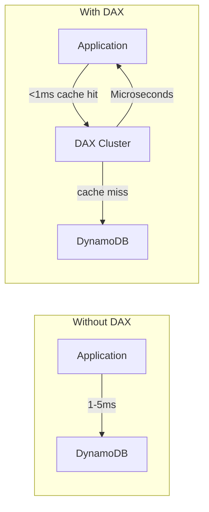

# How to Set Up DynamoDB for Production

Author: [nawazdhandala](https://github.com/nawazdhandala)

Tags: DynamoDB, AWS, NoSQL, Database, Production, Scaling

Description: Learn how to set up Amazon DynamoDB for production workloads, including capacity planning, partition key design, global secondary indexes, backup strategies, and monitoring best practices.

---

Amazon DynamoDB provides a fully managed NoSQL database service with consistent single-digit millisecond latency at any scale. Setting up DynamoDB correctly for production requires careful planning around capacity modes, partition key design, indexing strategies, and operational monitoring.

## DynamoDB Architecture Overview

Understanding DynamoDB's architecture helps you make better design decisions for production workloads.



## Capacity Planning

DynamoDB offers two capacity modes. Choosing the right mode impacts both cost and performance.

| Mode | Best For | Billing | Scaling |
|------|----------|---------|---------|
| **On-Demand** | Unpredictable workloads | Per-request | Automatic, instant |
| **Provisioned** | Predictable workloads | Per-hour capacity | Auto Scaling with lag |

### On-Demand Mode Configuration

On-demand mode automatically adapts to your traffic patterns without capacity planning.

The following Terraform configuration creates a DynamoDB table with on-demand capacity mode, encryption, and point-in-time recovery enabled for production use.

```hcl
# terraform/dynamodb.tf
resource "aws_dynamodb_table" "orders" {
  name         = "orders-production"
  billing_mode = "PAY_PER_REQUEST"

  # Primary key definition
  hash_key  = "customer_id"
  range_key = "order_id"

  # Attribute definitions for keys
  attribute {
    name = "customer_id"
    type = "S"
  }

  attribute {
    name = "order_id"
    type = "S"
  }

  attribute {
    name = "order_date"
    type = "S"
  }

  attribute {
    name = "status"
    type = "S"
  }

  # Global Secondary Index for querying by date
  global_secondary_index {
    name            = "OrderDateIndex"
    hash_key        = "order_date"
    range_key       = "order_id"
    projection_type = "ALL"
  }

  # Global Secondary Index for querying by status
  global_secondary_index {
    name            = "StatusIndex"
    hash_key        = "status"
    range_key       = "order_date"
    projection_type = "KEYS_ONLY"
  }

  # Enable encryption at rest using AWS managed key
  server_side_encryption {
    enabled = true
  }

  # Enable point-in-time recovery for data protection
  point_in_time_recovery {
    enabled = true
  }

  # TTL for automatic item expiration
  ttl {
    attribute_name = "expires_at"
    enabled        = true
  }

  tags = {
    Environment = "production"
    Service     = "order-service"
  }
}
```

### Provisioned Mode with Auto Scaling

Provisioned mode offers cost savings for predictable workloads. Auto Scaling adjusts capacity based on utilization.

The following configuration sets up provisioned capacity with auto scaling policies that maintain 70% target utilization.

```hcl
# terraform/dynamodb_provisioned.tf
resource "aws_dynamodb_table" "sessions" {
  name           = "sessions-production"
  billing_mode   = "PROVISIONED"
  read_capacity  = 100
  write_capacity = 50

  hash_key = "session_id"

  attribute {
    name = "session_id"
    type = "S"
  }

  ttl {
    attribute_name = "expires_at"
    enabled        = true
  }

  server_side_encryption {
    enabled = true
  }

  point_in_time_recovery {
    enabled = true
  }
}

# Auto Scaling for read capacity
resource "aws_appautoscaling_target" "sessions_read" {
  max_capacity       = 1000
  min_capacity       = 50
  resource_id        = "table/${aws_dynamodb_table.sessions.name}"
  scalable_dimension = "dynamodb:table:ReadCapacityUnits"
  service_namespace  = "dynamodb"
}

resource "aws_appautoscaling_policy" "sessions_read_policy" {
  name               = "DynamoDBReadAutoScaling"
  policy_type        = "TargetTrackingScaling"
  resource_id        = aws_appautoscaling_target.sessions_read.resource_id
  scalable_dimension = aws_appautoscaling_target.sessions_read.scalable_dimension
  service_namespace  = aws_appautoscaling_target.sessions_read.service_namespace

  target_tracking_scaling_policy_configuration {
    predefined_metric_specification {
      predefined_metric_type = "DynamoDBReadCapacityUtilization"
    }
    target_value       = 70.0
    scale_in_cooldown  = 60
    scale_out_cooldown = 60
  }
}

# Auto Scaling for write capacity
resource "aws_appautoscaling_target" "sessions_write" {
  max_capacity       = 500
  min_capacity       = 25
  resource_id        = "table/${aws_dynamodb_table.sessions.name}"
  scalable_dimension = "dynamodb:table:WriteCapacityUnits"
  service_namespace  = "dynamodb"
}

resource "aws_appautoscaling_policy" "sessions_write_policy" {
  name               = "DynamoDBWriteAutoScaling"
  policy_type        = "TargetTrackingScaling"
  resource_id        = aws_appautoscaling_target.sessions_write.resource_id
  scalable_dimension = aws_appautoscaling_target.sessions_write.scalable_dimension
  service_namespace  = aws_appautoscaling_target.sessions_write.service_namespace

  target_tracking_scaling_policy_configuration {
    predefined_metric_specification {
      predefined_metric_type = "DynamoDBWriteCapacityUtilization"
    }
    target_value       = 70.0
    scale_in_cooldown  = 60
    scale_out_cooldown = 60
  }
}
```

## Partition Key Design

Poor partition key design leads to hot partitions and throttling. DynamoDB distributes data across partitions based on the hash of the partition key.



### High-Cardinality Partition Keys

Design partition keys with high cardinality to distribute load evenly across partitions.

The following Node.js code demonstrates creating items with well-designed composite keys that ensure even distribution.

```javascript
// src/dynamodb/orders.js
const { DynamoDBClient } = require('@aws-sdk/client-dynamodb');
const {
  DynamoDBDocumentClient,
  PutCommand,
  QueryCommand,
  GetCommand
} = require('@aws-sdk/lib-dynamodb');
const { v4: uuidv4 } = require('uuid');

// Initialize the DynamoDB client with production settings
const client = new DynamoDBClient({
  region: process.env.AWS_REGION || 'us-east-1',
  maxAttempts: 3,
});

// Document client simplifies working with JavaScript objects
const docClient = DynamoDBDocumentClient.from(client, {
  marshallOptions: {
    removeUndefinedValues: true,
    convertEmptyValues: false,
  },
});

const TABLE_NAME = process.env.DYNAMODB_ORDERS_TABLE || 'orders-production';

// Create an order with a well-designed partition key
// Using customer_id as partition key ensures orders are distributed
// across partitions based on customer, avoiding hot spots
async function createOrder(customerId, orderData) {
  const orderId = `ORD_${Date.now()}_${uuidv4().slice(0, 8)}`;
  const now = new Date();

  const item = {
    // Partition key: customer_id provides good distribution
    customer_id: customerId,
    // Sort key: order_id allows efficient range queries
    order_id: orderId,
    // Additional attributes
    order_date: now.toISOString().split('T')[0],
    created_at: now.toISOString(),
    status: 'pending',
    ...orderData,
    // TTL attribute - set expiration 2 years from now
    expires_at: Math.floor(now.getTime() / 1000) + (2 * 365 * 24 * 60 * 60),
  };

  await docClient.send(new PutCommand({
    TableName: TABLE_NAME,
    Item: item,
    // Ensure we don't overwrite existing orders
    ConditionExpression: 'attribute_not_exists(order_id)',
  }));

  return item;
}

// Query orders for a specific customer
// The partition key (customer_id) targets a single partition
// for efficient retrieval
async function getCustomerOrders(customerId, options = {}) {
  const params = {
    TableName: TABLE_NAME,
    KeyConditionExpression: 'customer_id = :customerId',
    ExpressionAttributeValues: {
      ':customerId': customerId,
    },
    // Newest orders first
    ScanIndexForward: false,
    Limit: options.limit || 50,
  };

  // Optional: filter by date range using sort key
  if (options.startDate && options.endDate) {
    params.KeyConditionExpression += ' AND order_id BETWEEN :start AND :end';
    params.ExpressionAttributeValues[':start'] = `ORD_${new Date(options.startDate).getTime()}`;
    params.ExpressionAttributeValues[':end'] = `ORD_${new Date(options.endDate).getTime()}_z`;
  }

  const result = await docClient.send(new QueryCommand(params));
  return result.Items;
}

// Get a single order by its composite key
async function getOrder(customerId, orderId) {
  const result = await docClient.send(new GetCommand({
    TableName: TABLE_NAME,
    Key: {
      customer_id: customerId,
      order_id: orderId,
    },
  }));

  return result.Item;
}

module.exports = { createOrder, getCustomerOrders, getOrder };
```

### Write Sharding for High-Throughput Tables

When a single logical partition key receives too much traffic, add a random suffix to distribute writes.

The following code implements write sharding by appending a random shard number to the partition key.

```javascript
// src/dynamodb/metrics.js
const { DynamoDBDocumentClient, PutCommand, QueryCommand } = require('@aws-sdk/lib-dynamodb');

const SHARD_COUNT = 10;

// Generate a shard key for distributing writes across partitions
// Each metric type gets distributed across SHARD_COUNT partitions
function getShardKey(metricName) {
  const shardNumber = Math.floor(Math.random() * SHARD_COUNT);
  return `${metricName}#${shardNumber}`;
}

// Write a metric with sharding to avoid hot partitions
// High-frequency metrics like page views would overwhelm a single partition
async function writeMetric(docClient, tableName, metricName, value, timestamp) {
  const item = {
    // Sharded partition key distributes load across partitions
    metric_shard: getShardKey(metricName),
    // Sort key for time-series queries
    timestamp: timestamp || new Date().toISOString(),
    metric_name: metricName,
    value: value,
    // TTL: expire metrics after 90 days
    expires_at: Math.floor(Date.now() / 1000) + (90 * 24 * 60 * 60),
  };

  await docClient.send(new PutCommand({
    TableName: tableName,
    Item: item,
  }));
}

// Query metrics across all shards using parallel queries
// Aggregates results from all shards for a complete view
async function queryMetric(docClient, tableName, metricName, startTime, endTime) {
  // Query all shards in parallel
  const shardQueries = Array.from({ length: SHARD_COUNT }, (_, i) => {
    return docClient.send(new QueryCommand({
      TableName: tableName,
      KeyConditionExpression: 'metric_shard = :shard AND #ts BETWEEN :start AND :end',
      ExpressionAttributeNames: {
        '#ts': 'timestamp',
      },
      ExpressionAttributeValues: {
        ':shard': `${metricName}#${i}`,
        ':start': startTime,
        ':end': endTime,
      },
    }));
  });

  const results = await Promise.all(shardQueries);

  // Combine and sort results from all shards
  const allItems = results.flatMap(r => r.Items || []);
  return allItems.sort((a, b) => a.timestamp.localeCompare(b.timestamp));
}

module.exports = { writeMetric, queryMetric, SHARD_COUNT };
```

## Global Secondary Indexes (GSI)

Global Secondary Indexes enable efficient queries on non-key attributes. Plan GSIs carefully as they consume additional write capacity.



### Querying Global Secondary Indexes

The following code demonstrates querying GSIs for different access patterns.

```javascript
// src/dynamodb/orders-queries.js
const { DynamoDBDocumentClient, QueryCommand } = require('@aws-sdk/lib-dynamodb');

const TABLE_NAME = process.env.DYNAMODB_ORDERS_TABLE || 'orders-production';

// Query orders by date using the OrderDateIndex GSI
// Useful for generating daily reports or finding recent orders
async function getOrdersByDate(docClient, date, options = {}) {
  const params = {
    TableName: TABLE_NAME,
    IndexName: 'OrderDateIndex',
    KeyConditionExpression: 'order_date = :date',
    ExpressionAttributeValues: {
      ':date': date,
    },
    // Limit results for pagination
    Limit: options.limit || 100,
  };

  // Support pagination with exclusive start key
  if (options.lastEvaluatedKey) {
    params.ExclusiveStartKey = options.lastEvaluatedKey;
  }

  const result = await docClient.send(new QueryCommand(params));

  return {
    items: result.Items,
    lastEvaluatedKey: result.LastEvaluatedKey,
    hasMore: !!result.LastEvaluatedKey,
  };
}

// Query orders by status using the StatusIndex GSI
// Returns only keys for efficiency, then batch get full items if needed
async function getOrdersByStatus(docClient, status, options = {}) {
  const params = {
    TableName: TABLE_NAME,
    IndexName: 'StatusIndex',
    KeyConditionExpression: '#status = :status',
    ExpressionAttributeNames: {
      '#status': 'status',
    },
    ExpressionAttributeValues: {
      ':status': status,
    },
    // Filter by date range if provided
    ...(options.startDate && {
      KeyConditionExpression: '#status = :status AND order_date >= :startDate',
      ExpressionAttributeValues: {
        ':status': status,
        ':startDate': options.startDate,
      },
    }),
    Limit: options.limit || 100,
  };

  const result = await docClient.send(new QueryCommand(params));
  return result.Items;
}

// Paginate through all orders with a specific status
// Uses async generator for memory-efficient iteration
async function* iterateOrdersByStatus(docClient, status) {
  let lastEvaluatedKey = undefined;

  do {
    const params = {
      TableName: TABLE_NAME,
      IndexName: 'StatusIndex',
      KeyConditionExpression: '#status = :status',
      ExpressionAttributeNames: {
        '#status': 'status',
      },
      ExpressionAttributeValues: {
        ':status': status,
      },
      Limit: 100,
      ExclusiveStartKey: lastEvaluatedKey,
    };

    const result = await docClient.send(new QueryCommand(params));

    for (const item of result.Items || []) {
      yield item;
    }

    lastEvaluatedKey = result.LastEvaluatedKey;
  } while (lastEvaluatedKey);
}

module.exports = { getOrdersByDate, getOrdersByStatus, iterateOrdersByStatus };
```

## Error Handling and Retries

Production applications must handle DynamoDB errors gracefully, especially throttling and transient failures.



### Implementing Robust Error Handling

The following code implements comprehensive error handling with exponential backoff for DynamoDB operations.

```javascript
// src/dynamodb/client.js
const { DynamoDBClient } = require('@aws-sdk/client-dynamodb');
const {
  DynamoDBDocumentClient,
  PutCommand,
  UpdateCommand,
  DeleteCommand,
  TransactWriteCommand,
} = require('@aws-sdk/lib-dynamodb');

// Custom error classes for better error handling
class DynamoDBError extends Error {
  constructor(message, code, retryable) {
    super(message);
    this.name = 'DynamoDBError';
    this.code = code;
    this.retryable = retryable;
  }
}

class ThrottlingError extends DynamoDBError {
  constructor(message) {
    super(message, 'THROTTLING', true);
    this.name = 'ThrottlingError';
  }
}

class ConditionalCheckFailedError extends DynamoDBError {
  constructor(message) {
    super(message, 'CONDITIONAL_CHECK_FAILED', false);
    this.name = 'ConditionalCheckFailedError';
  }
}

// Create a DynamoDB client with production-ready settings
function createDynamoDBClient(options = {}) {
  const client = new DynamoDBClient({
    region: options.region || process.env.AWS_REGION || 'us-east-1',
    // SDK built-in retry configuration
    maxAttempts: options.maxAttempts || 5,
    retryMode: 'adaptive', // Adaptive retry mode handles throttling better
  });

  return DynamoDBDocumentClient.from(client, {
    marshallOptions: {
      removeUndefinedValues: true,
      convertEmptyValues: false,
    },
  });
}

// Execute a DynamoDB operation with custom retry logic
// Handles specific error types and implements exponential backoff
async function executeWithRetry(docClient, command, options = {}) {
  const maxRetries = options.maxRetries || 5;
  const baseDelay = options.baseDelay || 50;

  for (let attempt = 0; attempt <= maxRetries; attempt++) {
    try {
      return await docClient.send(command);
    } catch (error) {
      // Handle specific DynamoDB errors
      if (error.name === 'ConditionalCheckFailedException') {
        throw new ConditionalCheckFailedError(error.message);
      }

      // Check if error is retryable
      const isThrottling = error.name === 'ProvisionedThroughputExceededException' ||
                          error.name === 'ThrottlingException' ||
                          error.name === 'RequestLimitExceeded';

      const isTransient = error.name === 'InternalServerError' ||
                         error.name === 'ServiceUnavailable' ||
                         error.$metadata?.httpStatusCode >= 500;

      if ((isThrottling || isTransient) && attempt < maxRetries) {
        // Calculate delay with exponential backoff and jitter
        const delay = Math.min(
          baseDelay * Math.pow(2, attempt) + Math.random() * 100,
          10000 // Max 10 second delay
        );

        console.warn(`DynamoDB retry attempt ${attempt + 1}/${maxRetries} after ${delay}ms`, {
          error: error.name,
          table: command.input?.TableName,
        });

        await new Promise(resolve => setTimeout(resolve, delay));
        continue;
      }

      // Non-retryable error or max retries exceeded
      if (isThrottling) {
        throw new ThrottlingError(`Max retries exceeded: ${error.message}`);
      }

      throw new DynamoDBError(error.message, error.name, false);
    }
  }
}

module.exports = {
  createDynamoDBClient,
  executeWithRetry,
  DynamoDBError,
  ThrottlingError,
  ConditionalCheckFailedError,
};
```

## Transactions for Data Integrity

DynamoDB transactions ensure all-or-nothing execution for multiple operations across tables.

The following code demonstrates using transactions to maintain data consistency when updating related items.

```javascript
// src/dynamodb/transactions.js
const { TransactWriteCommand, TransactGetCommand } = require('@aws-sdk/lib-dynamodb');
const { executeWithRetry } = require('./client');

const ORDERS_TABLE = process.env.DYNAMODB_ORDERS_TABLE;
const INVENTORY_TABLE = process.env.DYNAMODB_INVENTORY_TABLE;

// Process an order with transactional writes
// Ensures order creation and inventory update happen atomically
async function processOrder(docClient, order) {
  const { customerId, orderId, items } = order;

  // Build transaction items for all inventory updates
  const transactItems = items.map(item => ({
    Update: {
      TableName: INVENTORY_TABLE,
      Key: { product_id: item.productId },
      UpdateExpression: 'SET quantity = quantity - :qty, updated_at = :now',
      ExpressionAttributeValues: {
        ':qty': item.quantity,
        ':now': new Date().toISOString(),
        ':zero': 0,
      },
      // Ensure sufficient inventory
      ConditionExpression: 'quantity >= :qty AND quantity > :zero',
    },
  }));

  // Add the order creation to the transaction
  transactItems.push({
    Put: {
      TableName: ORDERS_TABLE,
      Item: {
        customer_id: customerId,
        order_id: orderId,
        items: items,
        status: 'confirmed',
        created_at: new Date().toISOString(),
      },
      // Prevent duplicate orders
      ConditionExpression: 'attribute_not_exists(order_id)',
    },
  });

  try {
    await executeWithRetry(docClient, new TransactWriteCommand({
      TransactItems: transactItems,
      // Return item collection metrics for debugging
      ReturnConsumedCapacity: 'TOTAL',
    }));

    return { success: true, orderId };
  } catch (error) {
    if (error.name === 'TransactionCanceledException') {
      // Analyze cancellation reasons
      const reasons = error.CancellationReasons || [];
      const insufficientInventory = reasons.some(
        r => r.Code === 'ConditionalCheckFailed'
      );

      if (insufficientInventory) {
        return {
          success: false,
          error: 'INSUFFICIENT_INVENTORY',
          message: 'One or more items are out of stock',
        };
      }
    }
    throw error;
  }
}

// Transfer credits between accounts atomically
// Demonstrates a classic double-entry pattern with transactions
async function transferCredits(docClient, tableName, fromAccount, toAccount, amount) {
  const timestamp = new Date().toISOString();

  await executeWithRetry(docClient, new TransactWriteCommand({
    TransactItems: [
      {
        Update: {
          TableName: tableName,
          Key: { account_id: fromAccount },
          UpdateExpression: 'SET balance = balance - :amount, updated_at = :now',
          ExpressionAttributeValues: {
            ':amount': amount,
            ':now': timestamp,
            ':minBalance': amount, // Ensure sufficient balance
          },
          ConditionExpression: 'balance >= :minBalance',
        },
      },
      {
        Update: {
          TableName: tableName,
          Key: { account_id: toAccount },
          UpdateExpression: 'SET balance = balance + :amount, updated_at = :now',
          ExpressionAttributeValues: {
            ':amount': amount,
            ':now': timestamp,
          },
          ConditionExpression: 'attribute_exists(account_id)',
        },
      },
    ],
  }));
}

module.exports = { processOrder, transferCredits };
```

## Backup and Recovery Strategy

Production DynamoDB tables require comprehensive backup strategies for disaster recovery.



### Automated Backup Configuration

The following Terraform configuration sets up automated backups with retention policies.

```hcl
# terraform/dynamodb_backup.tf

# Enable point-in-time recovery on the table
resource "aws_dynamodb_table" "critical_data" {
  name         = "critical-data-production"
  billing_mode = "PAY_PER_REQUEST"
  hash_key     = "pk"
  range_key    = "sk"

  attribute {
    name = "pk"
    type = "S"
  }

  attribute {
    name = "sk"
    type = "S"
  }

  # Point-in-time recovery provides continuous backups
  point_in_time_recovery {
    enabled = true
  }

  server_side_encryption {
    enabled = true
  }
}

# AWS Backup plan for scheduled backups
resource "aws_backup_plan" "dynamodb_backup" {
  name = "dynamodb-production-backup"

  rule {
    rule_name         = "daily-backup"
    target_vault_name = aws_backup_vault.dynamodb.name
    schedule          = "cron(0 5 * * ? *)"  # Daily at 5 AM UTC

    lifecycle {
      delete_after = 35  # Keep daily backups for 35 days
    }

    copy_action {
      destination_vault_arn = aws_backup_vault.dynamodb_dr.arn
      lifecycle {
        delete_after = 90  # Keep DR copies for 90 days
      }
    }
  }

  rule {
    rule_name         = "weekly-backup"
    target_vault_name = aws_backup_vault.dynamodb.name
    schedule          = "cron(0 5 ? * SUN *)"  # Weekly on Sunday

    lifecycle {
      delete_after = 90  # Keep weekly backups for 90 days
    }
  }

  rule {
    rule_name         = "monthly-backup"
    target_vault_name = aws_backup_vault.dynamodb.name
    schedule          = "cron(0 5 1 * ? *)"  # Monthly on 1st

    lifecycle {
      cold_storage_after = 30  # Move to cold storage after 30 days
      delete_after       = 365 # Keep for 1 year
    }
  }
}

# Backup vault for storing backups
resource "aws_backup_vault" "dynamodb" {
  name        = "dynamodb-backup-vault"
  kms_key_arn = aws_kms_key.backup.arn
}

# DR vault in different region
resource "aws_backup_vault" "dynamodb_dr" {
  provider    = aws.dr_region
  name        = "dynamodb-backup-vault-dr"
  kms_key_arn = aws_kms_key.backup_dr.arn
}

# Backup selection - which resources to back up
resource "aws_backup_selection" "dynamodb_tables" {
  name         = "dynamodb-production-tables"
  plan_id      = aws_backup_plan.dynamodb_backup.id
  iam_role_arn = aws_iam_role.backup.arn

  selection_tag {
    type  = "STRINGEQUALS"
    key   = "Environment"
    value = "production"
  }
}

# IAM role for AWS Backup
resource "aws_iam_role" "backup" {
  name = "aws-backup-dynamodb-role"

  assume_role_policy = jsonencode({
    Version = "2012-10-17"
    Statement = [
      {
        Action = "sts:AssumeRole"
        Effect = "Allow"
        Principal = {
          Service = "backup.amazonaws.com"
        }
      }
    ]
  })
}

resource "aws_iam_role_policy_attachment" "backup" {
  policy_arn = "arn:aws:iam::aws:policy/service-role/AWSBackupServiceRolePolicyForBackup"
  role       = aws_iam_role.backup.name
}
```

## Monitoring and Alerting

Comprehensive monitoring helps identify issues before they impact users.

### CloudWatch Alarms Configuration

The following Terraform configuration creates essential CloudWatch alarms for DynamoDB monitoring.

```hcl
# terraform/dynamodb_monitoring.tf

# Throttled requests alarm - critical for production
resource "aws_cloudwatch_metric_alarm" "throttled_requests" {
  alarm_name          = "dynamodb-${var.table_name}-throttled-requests"
  comparison_operator = "GreaterThanThreshold"
  evaluation_periods  = 2
  metric_name         = "ThrottledRequests"
  namespace           = "AWS/DynamoDB"
  period              = 60
  statistic           = "Sum"
  threshold           = 10
  alarm_description   = "DynamoDB table experiencing throttling"

  dimensions = {
    TableName = var.table_name
  }

  alarm_actions = [var.sns_topic_arn]
  ok_actions    = [var.sns_topic_arn]
}

# System errors alarm
resource "aws_cloudwatch_metric_alarm" "system_errors" {
  alarm_name          = "dynamodb-${var.table_name}-system-errors"
  comparison_operator = "GreaterThanThreshold"
  evaluation_periods  = 1
  metric_name         = "SystemErrors"
  namespace           = "AWS/DynamoDB"
  period              = 60
  statistic           = "Sum"
  threshold           = 0
  alarm_description   = "DynamoDB system errors detected"

  dimensions = {
    TableName = var.table_name
  }

  alarm_actions = [var.sns_topic_arn]
}

# Read capacity utilization alarm for provisioned tables
resource "aws_cloudwatch_metric_alarm" "read_capacity_high" {
  count               = var.billing_mode == "PROVISIONED" ? 1 : 0
  alarm_name          = "dynamodb-${var.table_name}-read-capacity-high"
  comparison_operator = "GreaterThanThreshold"
  evaluation_periods  = 3
  metric_name         = "ConsumedReadCapacityUnits"
  namespace           = "AWS/DynamoDB"
  period              = 60
  statistic           = "Sum"
  threshold           = var.read_capacity * 60 * 0.8  # 80% of provisioned
  alarm_description   = "Read capacity utilization above 80%"

  dimensions = {
    TableName = var.table_name
  }

  alarm_actions = [var.sns_topic_arn]
}

# Latency alarm for production SLAs
resource "aws_cloudwatch_metric_alarm" "high_latency" {
  alarm_name          = "dynamodb-${var.table_name}-high-latency"
  comparison_operator = "GreaterThanThreshold"
  evaluation_periods  = 3
  metric_name         = "SuccessfulRequestLatency"
  namespace           = "AWS/DynamoDB"
  period              = 60
  extended_statistic  = "p99"
  threshold           = 50  # 50ms p99 latency
  alarm_description   = "DynamoDB p99 latency exceeds 50ms"

  dimensions = {
    TableName = var.table_name
    Operation = "GetItem"
  }

  alarm_actions = [var.sns_topic_arn]
}

# GSI throttling alarm
resource "aws_cloudwatch_metric_alarm" "gsi_throttled" {
  for_each            = toset(var.gsi_names)
  alarm_name          = "dynamodb-${var.table_name}-gsi-${each.value}-throttled"
  comparison_operator = "GreaterThanThreshold"
  evaluation_periods  = 2
  metric_name         = "ThrottledRequests"
  namespace           = "AWS/DynamoDB"
  period              = 60
  statistic           = "Sum"
  threshold           = 5
  alarm_description   = "GSI ${each.value} experiencing throttling"

  dimensions = {
    TableName          = var.table_name
    GlobalSecondaryIndexName = each.value
  }

  alarm_actions = [var.sns_topic_arn]
}
```

### Application-Level Metrics

The following code integrates DynamoDB metrics with application observability.

```javascript
// src/dynamodb/metrics.js
const { CloudWatchClient, PutMetricDataCommand } = require('@aws-sdk/client-cloudwatch');

const cloudwatch = new CloudWatchClient({ region: process.env.AWS_REGION });

// Metrics collector for DynamoDB operations
class DynamoDBMetrics {
  constructor(namespace = 'Application/DynamoDB') {
    this.namespace = namespace;
    this.buffer = [];
    this.flushInterval = 60000; // Flush every minute

    // Start periodic flush
    setInterval(() => this.flush(), this.flushInterval);
  }

  // Record a DynamoDB operation metric
  record(operation, table, duration, success, consumedCapacity = null) {
    const timestamp = new Date();

    // Duration metric
    this.buffer.push({
      MetricName: 'OperationDuration',
      Dimensions: [
        { Name: 'Operation', Value: operation },
        { Name: 'Table', Value: table },
      ],
      Timestamp: timestamp,
      Value: duration,
      Unit: 'Milliseconds',
    });

    // Success/failure metric
    this.buffer.push({
      MetricName: success ? 'SuccessCount' : 'ErrorCount',
      Dimensions: [
        { Name: 'Operation', Value: operation },
        { Name: 'Table', Value: table },
      ],
      Timestamp: timestamp,
      Value: 1,
      Unit: 'Count',
    });

    // Consumed capacity metric if available
    if (consumedCapacity) {
      this.buffer.push({
        MetricName: 'ConsumedCapacity',
        Dimensions: [
          { Name: 'Operation', Value: operation },
          { Name: 'Table', Value: table },
        ],
        Timestamp: timestamp,
        Value: consumedCapacity.CapacityUnits || 0,
        Unit: 'Count',
      });
    }
  }

  // Flush metrics to CloudWatch
  async flush() {
    if (this.buffer.length === 0) return;

    const metricsToSend = this.buffer.splice(0, 20); // CloudWatch limit

    try {
      await cloudwatch.send(new PutMetricDataCommand({
        Namespace: this.namespace,
        MetricData: metricsToSend,
      }));
    } catch (error) {
      console.error('Failed to publish DynamoDB metrics:', error);
      // Re-add metrics to buffer for retry (with limit)
      if (this.buffer.length < 1000) {
        this.buffer.unshift(...metricsToSend);
      }
    }
  }
}

// Wrap DynamoDB operations with metrics collection
function withMetrics(metrics, tableName) {
  return function(target, propertyKey, descriptor) {
    const originalMethod = descriptor.value;

    descriptor.value = async function(...args) {
      const start = Date.now();
      let success = true;
      let result;

      try {
        result = await originalMethod.apply(this, args);
        return result;
      } catch (error) {
        success = false;
        throw error;
      } finally {
        const duration = Date.now() - start;
        metrics.record(
          propertyKey,
          tableName,
          duration,
          success,
          result?.ConsumedCapacity
        );
      }
    };

    return descriptor;
  };
}

module.exports = { DynamoDBMetrics, withMetrics };
```

## DynamoDB Accelerator (DAX)

DAX provides microsecond latency for read-heavy workloads by caching frequently accessed data.



### DAX Client Configuration

The following code configures the DAX client for production use with fallback to standard DynamoDB.

```javascript
// src/dynamodb/dax-client.js
const { DynamoDBClient } = require('@aws-sdk/client-dynamodb');
const { DynamoDBDocumentClient } = require('@aws-sdk/lib-dynamodb');

// DAX client for Node.js
let AmazonDaxClient;
try {
  AmazonDaxClient = require('amazon-dax-client');
} catch (e) {
  // DAX client not available, will use standard client
}

// Create a client that uses DAX when available, falls back to DynamoDB
function createProductionClient(config = {}) {
  const daxEndpoint = process.env.DAX_ENDPOINT;

  // Use DAX if endpoint is configured and client is available
  if (daxEndpoint && AmazonDaxClient) {
    console.log('Using DAX cluster:', daxEndpoint);

    const daxClient = new AmazonDaxClient({
      endpoints: [daxEndpoint],
      region: process.env.AWS_REGION || 'us-east-1',
      // DAX-specific settings
      requestTimeout: config.requestTimeout || 60000,
      // Connection pool settings
      maxPendingConnectionsPerEndpoint: config.maxPending || 10,
      maxRetries: config.maxRetries || 2,
    });

    return DynamoDBDocumentClient.from(daxClient, {
      marshallOptions: {
        removeUndefinedValues: true,
      },
    });
  }

  // Fallback to standard DynamoDB client
  console.log('Using standard DynamoDB client');

  const client = new DynamoDBClient({
    region: process.env.AWS_REGION || 'us-east-1',
    maxAttempts: 3,
  });

  return DynamoDBDocumentClient.from(client, {
    marshallOptions: {
      removeUndefinedValues: true,
    },
  });
}

// Health check for DAX cluster
async function checkDAXHealth(docClient, tableName) {
  try {
    const start = Date.now();
    // Simple read to verify DAX is working
    await docClient.send({
      TableName: tableName,
      Key: { pk: '__health_check__' },
    });

    return {
      healthy: true,
      latency: Date.now() - start,
    };
  } catch (error) {
    return {
      healthy: false,
      error: error.message,
    };
  }
}

module.exports = { createProductionClient, checkDAXHealth };
```

## Production Checklist

Before deploying DynamoDB to production, verify these essential configurations:

| Category | Item | Status |
|----------|------|--------|
| **Capacity** | Capacity mode selected (on-demand or provisioned) | Required |
| **Capacity** | Auto Scaling configured (if provisioned) | Required |
| **Security** | Encryption at rest enabled | Required |
| **Security** | IAM policies follow least privilege | Required |
| **Security** | VPC endpoints configured | Recommended |
| **Backup** | Point-in-time recovery enabled | Required |
| **Backup** | AWS Backup plan configured | Required |
| **Backup** | Cross-region backup enabled | Recommended |
| **Monitoring** | CloudWatch alarms configured | Required |
| **Monitoring** | Throttling alerts enabled | Required |
| **Monitoring** | Latency monitoring enabled | Required |
| **Design** | Partition key has high cardinality | Required |
| **Design** | GSI capacity matches access patterns | Required |
| **Design** | TTL configured for expiring data | Recommended |

## Summary

Setting up DynamoDB for production requires careful attention to capacity planning, partition key design, and operational monitoring. Key takeaways include:

- Choose between on-demand and provisioned capacity based on traffic predictability
- Design partition keys with high cardinality to avoid hot partitions
- Use write sharding for high-throughput scenarios
- Implement comprehensive error handling with exponential backoff
- Enable point-in-time recovery and configure automated backups
- Set up CloudWatch alarms for throttling, errors, and latency
- Consider DAX for read-heavy workloads requiring microsecond latency

Following these practices ensures your DynamoDB tables can handle production workloads reliably while maintaining cost efficiency.
