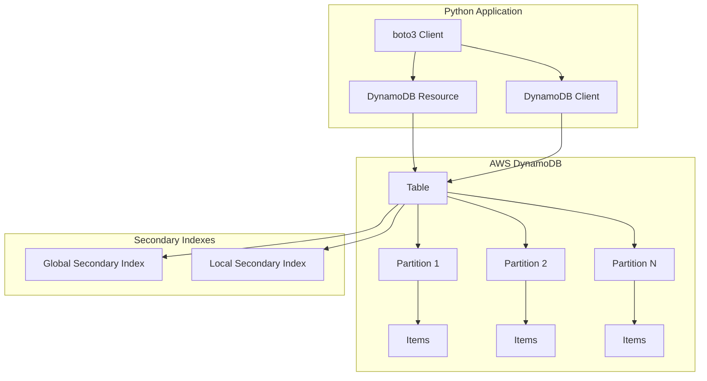
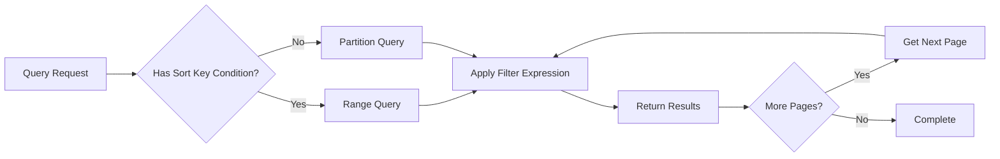
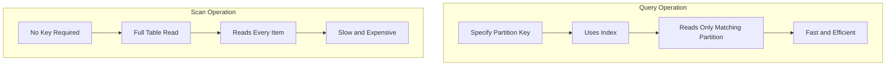
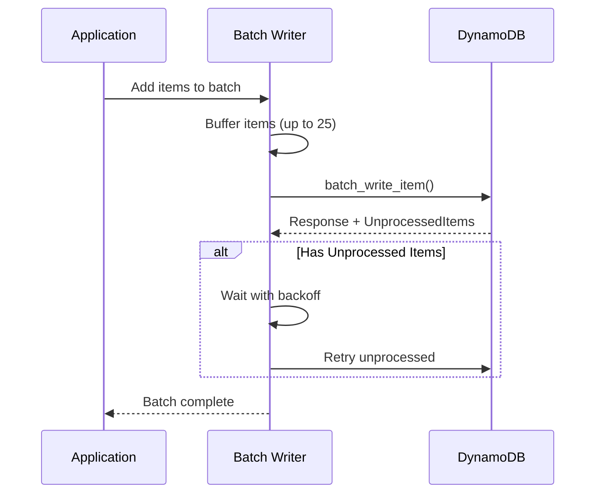
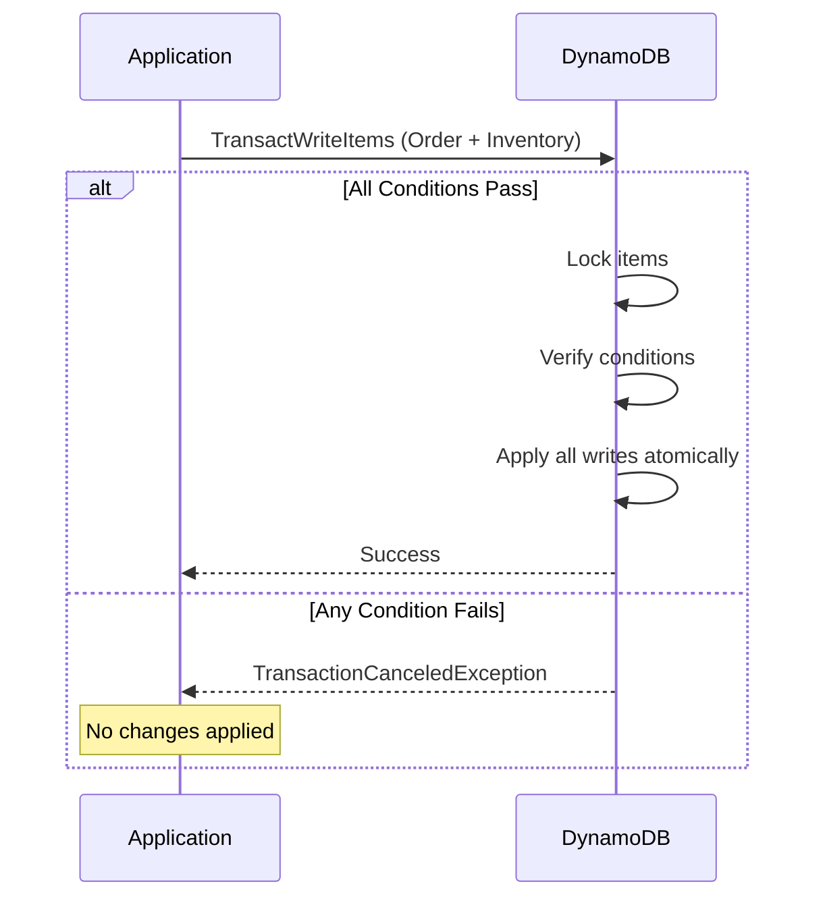
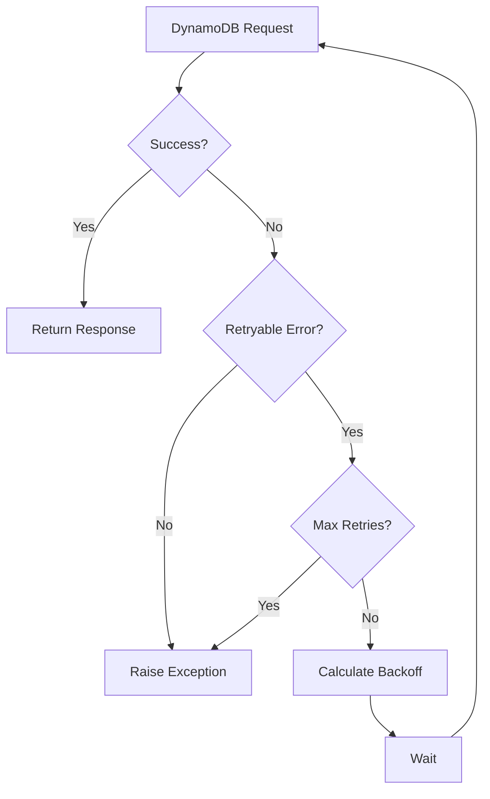
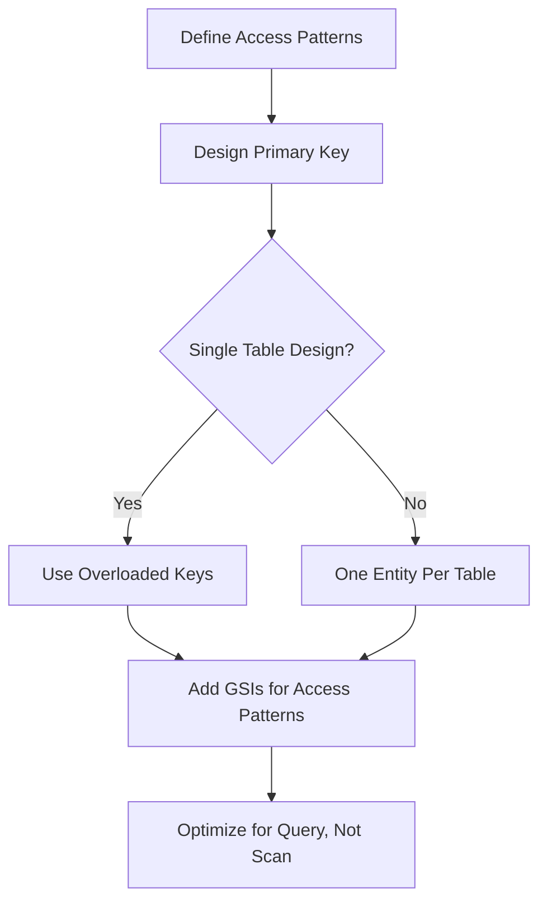

# How to Use DynamoDB with Python (boto3)

Author: [nawazdhandala](https://www.github.com/nawazdhandala)

Tags: DynamoDB, Python, boto3, AWS, NoSQL, Database, Serverless

Description: Learn how to use Amazon DynamoDB with Python using the boto3 library. Covers table creation, CRUD operations, querying, scanning, batch operations, and best practices for building scalable applications.

---

> DynamoDB is a fully managed NoSQL database service that provides fast and predictable performance with seamless scalability. When combined with Python's boto3 library, you get a powerful toolkit for building serverless and scalable applications. Here you will learn practical patterns for working with DynamoDB effectively.

Working with DynamoDB requires understanding its unique data model and access patterns. Unlike traditional relational databases, DynamoDB uses partition keys and sort keys to organize data, and charges based on read and write capacity units. Mastering these concepts is essential for building cost-effective and performant applications.

---

## Architecture Overview



---

## Setting Up boto3 for DynamoDB

### Installation

```bash
pip install boto3
```

### Basic Configuration

The following code demonstrates how to configure boto3 for DynamoDB access. You can use either the resource interface for high-level operations or the client interface for low-level control.

```python
# dynamodb_setup.py
# Import boto3 and configure AWS credentials
import boto3
from botocore.config import Config
import os

def get_dynamodb_resource():
    """
    Get a DynamoDB resource with configured settings.
    Uses environment variables for credentials in production.
    """
    # Configure retry behavior and timeouts
    config = Config(
        retries={
            'max_attempts': 3,  # Retry failed requests up to 3 times
            'mode': 'adaptive'  # Use adaptive retry mode for better handling
        },
        connect_timeout=5,  # Connection timeout in seconds
        read_timeout=10     # Read timeout in seconds
    )

    # Create DynamoDB resource with region and config
    dynamodb = boto3.resource(
        'dynamodb',
        region_name=os.getenv('AWS_REGION', 'us-east-1'),
        config=config
    )

    return dynamodb


def get_dynamodb_client():
    """
    Get a low-level DynamoDB client for advanced operations.
    Provides more control over request formatting.
    """
    client = boto3.client(
        'dynamodb',
        region_name=os.getenv('AWS_REGION', 'us-east-1')
    )

    return client


# For local development with DynamoDB Local
def get_local_dynamodb():
    """
    Connect to DynamoDB Local for development and testing.
    Requires DynamoDB Local running on port 8000.
    """
    dynamodb = boto3.resource(
        'dynamodb',
        endpoint_url='http://localhost:8000',  # Local endpoint
        region_name='us-east-1',
        aws_access_key_id='dummy',      # Dummy credentials for local
        aws_secret_access_key='dummy'
    )

    return dynamodb
```

---

## Creating and Managing Tables

### Table Creation

The following example shows how to create a DynamoDB table with a composite primary key. The partition key distributes data across partitions, while the sort key enables range queries within a partition.

```python
# create_table.py
# Create DynamoDB tables with proper key schema and provisioned capacity
import boto3
from botocore.exceptions import ClientError

def create_orders_table(dynamodb=None):
    """
    Create an orders table with partition key (customer_id) and sort key (order_id).
    Includes a Global Secondary Index for querying by order status.
    """
    if not dynamodb:
        dynamodb = boto3.resource('dynamodb')

    try:
        # Define table schema with key attributes and indexes
        table = dynamodb.create_table(
            TableName='Orders',
            KeySchema=[
                {
                    'AttributeName': 'customer_id',  # Partition key
                    'KeyType': 'HASH'
                },
                {
                    'AttributeName': 'order_id',     # Sort key
                    'KeyType': 'RANGE'
                }
            ],
            AttributeDefinitions=[
                {
                    'AttributeName': 'customer_id',
                    'AttributeType': 'S'  # String type
                },
                {
                    'AttributeName': 'order_id',
                    'AttributeType': 'S'
                },
                {
                    'AttributeName': 'status',
                    'AttributeType': 'S'
                },
                {
                    'AttributeName': 'created_at',
                    'AttributeType': 'S'  # ISO 8601 timestamp string
                }
            ],
            GlobalSecondaryIndexes=[
                {
                    'IndexName': 'StatusIndex',
                    'KeySchema': [
                        {'AttributeName': 'status', 'KeyType': 'HASH'},
                        {'AttributeName': 'created_at', 'KeyType': 'RANGE'}
                    ],
                    'Projection': {
                        'ProjectionType': 'ALL'  # Include all attributes
                    },
                    'ProvisionedThroughput': {
                        'ReadCapacityUnits': 5,
                        'WriteCapacityUnits': 5
                    }
                }
            ],
            ProvisionedThroughput={
                'ReadCapacityUnits': 10,   # Read capacity units
                'WriteCapacityUnits': 10   # Write capacity units
            },
            Tags=[
                {'Key': 'Environment', 'Value': 'production'},
                {'Key': 'Application', 'Value': 'order-service'}
            ]
        )

        # Wait for table to be created before proceeding
        table.wait_until_exists()
        print(f"Table {table.table_name} created successfully")

        return table

    except ClientError as e:
        if e.response['Error']['Code'] == 'ResourceInUseException':
            print("Table already exists")
            return dynamodb.Table('Orders')
        raise


def create_on_demand_table(dynamodb=None):
    """
    Create a table with on-demand capacity mode.
    Best for unpredictable workloads or new applications.
    """
    if not dynamodb:
        dynamodb = boto3.resource('dynamodb')

    table = dynamodb.create_table(
        TableName='Sessions',
        KeySchema=[
            {'AttributeName': 'session_id', 'KeyType': 'HASH'}
        ],
        AttributeDefinitions=[
            {'AttributeName': 'session_id', 'AttributeType': 'S'}
        ],
        BillingMode='PAY_PER_REQUEST',  # On-demand pricing
        TimeToLiveSpecification={
            'Enabled': True,
            'AttributeName': 'expires_at'  # TTL attribute for auto-deletion
        }
    )

    table.wait_until_exists()
    return table
```

### Table Operations

Managing table settings allows you to adjust capacity, enable features like Time to Live, and monitor table status.

```python
# table_operations.py
# Manage DynamoDB table settings and status
import boto3

def update_table_capacity(table_name, read_units, write_units):
    """
    Update provisioned capacity for a table.
    Use when traffic patterns change significantly.
    """
    dynamodb = boto3.resource('dynamodb')
    table = dynamodb.Table(table_name)

    # Update throughput settings
    table.update(
        ProvisionedThroughput={
            'ReadCapacityUnits': read_units,
            'WriteCapacityUnits': write_units
        }
    )

    print(f"Updated capacity to {read_units} RCU, {write_units} WCU")


def enable_ttl(table_name, ttl_attribute):
    """
    Enable Time to Live on a table for automatic item expiration.
    Items with expired TTL are deleted within 48 hours.
    """
    client = boto3.client('dynamodb')

    response = client.update_time_to_live(
        TableName=table_name,
        TimeToLiveSpecification={
            'Enabled': True,
            'AttributeName': ttl_attribute  # Attribute containing expiry timestamp
        }
    )

    return response


def get_table_info(table_name):
    """
    Get detailed information about a table including indexes and capacity.
    """
    dynamodb = boto3.resource('dynamodb')
    table = dynamodb.Table(table_name)

    # Load table metadata
    table.load()

    info = {
        'name': table.table_name,
        'status': table.table_status,
        'item_count': table.item_count,
        'size_bytes': table.table_size_bytes,
        'creation_date': str(table.creation_date_time),
        'key_schema': table.key_schema,
        'billing_mode': table.billing_mode_summary
    }

    # Include GSI information if present
    if table.global_secondary_indexes:
        info['global_secondary_indexes'] = [
            {
                'name': gsi['IndexName'],
                'status': gsi['IndexStatus'],
                'key_schema': gsi['KeySchema']
            }
            for gsi in table.global_secondary_indexes
        ]

    return info
```

---

## CRUD Operations

### Creating Items

The following examples demonstrate how to insert items into DynamoDB. You can use put_item for simple inserts or add conditions to prevent overwriting existing items.

```python
# crud_operations.py
# Basic CRUD operations for DynamoDB items
import boto3
from botocore.exceptions import ClientError
from datetime import datetime
from decimal import Decimal
import uuid

def get_table():
    """Get reference to Orders table."""
    dynamodb = boto3.resource('dynamodb')
    return dynamodb.Table('Orders')


def create_order(customer_id, items, total_amount):
    """
    Create a new order in DynamoDB.
    Uses condition expression to prevent duplicate order IDs.
    """
    table = get_table()

    # Generate unique order ID with timestamp prefix for sortability
    order_id = f"ORD-{datetime.utcnow().strftime('%Y%m%d')}-{uuid.uuid4().hex[:8]}"

    order = {
        'customer_id': customer_id,
        'order_id': order_id,
        'items': items,
        'total_amount': Decimal(str(total_amount)),  # Use Decimal for precision
        'status': 'pending',
        'created_at': datetime.utcnow().isoformat() + 'Z',
        'updated_at': datetime.utcnow().isoformat() + 'Z'
    }

    try:
        # Put item with condition to prevent overwrites
        table.put_item(
            Item=order,
            ConditionExpression='attribute_not_exists(order_id)'  # Only insert if new
        )

        print(f"Order {order_id} created successfully")
        return order

    except ClientError as e:
        if e.response['Error']['Code'] == 'ConditionalCheckFailedException':
            print("Order already exists")
            return None
        raise


def create_order_with_return(customer_id, items, total_amount):
    """
    Create an order and return the previous item if it existed.
    Useful for understanding what was overwritten.
    """
    table = get_table()

    order_id = f"ORD-{datetime.utcnow().strftime('%Y%m%d')}-{uuid.uuid4().hex[:8]}"

    response = table.put_item(
        Item={
            'customer_id': customer_id,
            'order_id': order_id,
            'items': items,
            'total_amount': Decimal(str(total_amount)),
            'status': 'pending',
            'created_at': datetime.utcnow().isoformat() + 'Z'
        },
        ReturnValues='ALL_OLD'  # Return previous item if overwritten
    )

    # Check if an item was overwritten
    if 'Attributes' in response:
        print("Previous order was overwritten")

    return order_id
```

### Reading Items

Reading items from DynamoDB can be done with get_item for single items or batch operations for multiple items.

```python
# read_operations.py
# Read items from DynamoDB
import boto3
from boto3.dynamodb.conditions import Key, Attr

def get_table():
    """Get reference to Orders table."""
    dynamodb = boto3.resource('dynamodb')
    return dynamodb.Table('Orders')


def get_order(customer_id, order_id):
    """
    Get a single order by its composite primary key.
    Uses consistent read for up-to-date data.
    """
    table = get_table()

    response = table.get_item(
        Key={
            'customer_id': customer_id,
            'order_id': order_id
        },
        ConsistentRead=True  # Get latest data, uses more RCU
    )

    # Return item if found, None otherwise
    return response.get('Item')


def get_order_projection(customer_id, order_id, attributes):
    """
    Get specific attributes from an order to reduce data transfer.
    Use when you only need certain fields.
    """
    table = get_table()

    response = table.get_item(
        Key={
            'customer_id': customer_id,
            'order_id': order_id
        },
        ProjectionExpression=', '.join(attributes)  # Only return specified attributes
    )

    return response.get('Item')


def batch_get_orders(order_keys):
    """
    Get multiple orders in a single request.
    More efficient than multiple get_item calls.
    """
    dynamodb = boto3.resource('dynamodb')

    # BatchGetItem accepts up to 100 keys per request
    response = dynamodb.batch_get_item(
        RequestItems={
            'Orders': {
                'Keys': order_keys,  # List of key dicts
                'ConsistentRead': False  # Eventually consistent for better performance
            }
        }
    )

    orders = response.get('Responses', {}).get('Orders', [])

    # Handle unprocessed keys (retry if needed)
    unprocessed = response.get('UnprocessedKeys', {})
    if unprocessed:
        print(f"Warning: {len(unprocessed)} keys were not processed")

    return orders


def check_order_exists(customer_id, order_id):
    """
    Check if an order exists without fetching all attributes.
    Uses projection to minimize data transfer.
    """
    table = get_table()

    response = table.get_item(
        Key={
            'customer_id': customer_id,
            'order_id': order_id
        },
        ProjectionExpression='order_id'  # Only fetch the key attribute
    )

    return 'Item' in response
```

### Updating Items

Update operations in DynamoDB allow you to modify specific attributes without replacing the entire item. Conditional updates ensure data integrity in concurrent scenarios.

```python
# update_operations.py
# Update items in DynamoDB with various patterns
import boto3
from botocore.exceptions import ClientError
from datetime import datetime
from decimal import Decimal

def get_table():
    """Get reference to Orders table."""
    dynamodb = boto3.resource('dynamodb')
    return dynamodb.Table('Orders')


def update_order_status(customer_id, order_id, new_status):
    """
    Update order status with timestamp.
    Returns the updated item.
    """
    table = get_table()

    response = table.update_item(
        Key={
            'customer_id': customer_id,
            'order_id': order_id
        },
        UpdateExpression='SET #status = :status, updated_at = :updated_at',
        ExpressionAttributeNames={
            '#status': 'status'  # Use placeholder because 'status' is reserved
        },
        ExpressionAttributeValues={
            ':status': new_status,
            ':updated_at': datetime.utcnow().isoformat() + 'Z'
        },
        ReturnValues='ALL_NEW'  # Return the updated item
    )

    return response.get('Attributes')


def update_with_condition(customer_id, order_id, new_status, expected_status):
    """
    Update order status only if current status matches expected.
    Implements optimistic locking pattern.
    """
    table = get_table()

    try:
        response = table.update_item(
            Key={
                'customer_id': customer_id,
                'order_id': order_id
            },
            UpdateExpression='SET #status = :new_status, updated_at = :updated_at',
            ConditionExpression='#status = :expected_status',  # Only update if condition met
            ExpressionAttributeNames={
                '#status': 'status'
            },
            ExpressionAttributeValues={
                ':new_status': new_status,
                ':expected_status': expected_status,
                ':updated_at': datetime.utcnow().isoformat() + 'Z'
            },
            ReturnValues='ALL_NEW'
        )

        return response.get('Attributes')

    except ClientError as e:
        if e.response['Error']['Code'] == 'ConditionalCheckFailedException':
            print(f"Status is not '{expected_status}', update rejected")
            return None
        raise


def increment_order_quantity(customer_id, order_id, item_index, increment):
    """
    Atomically increment a quantity in a nested list item.
    Useful for updating item quantities in orders.
    """
    table = get_table()

    response = table.update_item(
        Key={
            'customer_id': customer_id,
            'order_id': order_id
        },
        UpdateExpression=f'SET items[{item_index}].quantity = items[{item_index}].quantity + :inc',
        ExpressionAttributeValues={
            ':inc': increment
        },
        ReturnValues='UPDATED_NEW'  # Return only updated attributes
    )

    return response.get('Attributes')


def add_item_to_order(customer_id, order_id, new_item):
    """
    Add a new item to the order's items list.
    Uses list_append to add without reading first.
    """
    table = get_table()

    response = table.update_item(
        Key={
            'customer_id': customer_id,
            'order_id': order_id
        },
        UpdateExpression='SET items = list_append(items, :new_item), updated_at = :updated_at',
        ExpressionAttributeValues={
            ':new_item': [new_item],  # list_append requires a list
            ':updated_at': datetime.utcnow().isoformat() + 'Z'
        },
        ReturnValues='ALL_NEW'
    )

    return response.get('Attributes')


def add_or_update_attribute(customer_id, order_id, attr_name, attr_value):
    """
    Add a new attribute or update existing one.
    Uses if_not_exists to set default for new attributes.
    """
    table = get_table()

    response = table.update_item(
        Key={
            'customer_id': customer_id,
            'order_id': order_id
        },
        UpdateExpression='SET #attr = :val, updated_at = :updated_at',
        ExpressionAttributeNames={
            '#attr': attr_name
        },
        ExpressionAttributeValues={
            ':val': attr_value,
            ':updated_at': datetime.utcnow().isoformat() + 'Z'
        },
        ReturnValues='ALL_NEW'
    )

    return response.get('Attributes')
```

### Deleting Items

Delete operations can include conditions to ensure you only delete items that match certain criteria.

```python
# delete_operations.py
# Delete items from DynamoDB
import boto3
from botocore.exceptions import ClientError

def get_table():
    """Get reference to Orders table."""
    dynamodb = boto3.resource('dynamodb')
    return dynamodb.Table('Orders')


def delete_order(customer_id, order_id):
    """
    Delete an order and return the deleted item.
    """
    table = get_table()

    response = table.delete_item(
        Key={
            'customer_id': customer_id,
            'order_id': order_id
        },
        ReturnValues='ALL_OLD'  # Return the deleted item
    )

    deleted_item = response.get('Attributes')

    if deleted_item:
        print(f"Deleted order: {order_id}")
    else:
        print(f"Order {order_id} not found")

    return deleted_item


def delete_if_cancelled(customer_id, order_id):
    """
    Delete order only if status is 'cancelled'.
    Prevents accidental deletion of active orders.
    """
    table = get_table()

    try:
        response = table.delete_item(
            Key={
                'customer_id': customer_id,
                'order_id': order_id
            },
            ConditionExpression='#status = :cancelled',
            ExpressionAttributeNames={
                '#status': 'status'
            },
            ExpressionAttributeValues={
                ':cancelled': 'cancelled'
            },
            ReturnValues='ALL_OLD'
        )

        return response.get('Attributes')

    except ClientError as e:
        if e.response['Error']['Code'] == 'ConditionalCheckFailedException':
            print("Order is not cancelled, deletion prevented")
            return None
        raise


def batch_delete_orders(order_keys):
    """
    Delete multiple orders in a single batch request.
    More efficient than individual delete calls.
    """
    dynamodb = boto3.resource('dynamodb')
    table = dynamodb.Table('Orders')

    # Use batch_writer for efficient batch operations
    with table.batch_writer() as batch:
        for key in order_keys:
            batch.delete_item(Key=key)

    print(f"Deleted {len(order_keys)} orders")
```

---

## Querying Data

### Query Operation Flow



### Query Operations

Queries are the most efficient way to retrieve data from DynamoDB when you know the partition key. You can further refine results using sort key conditions and filter expressions.

```python
# query_operations.py
# Query DynamoDB with various patterns
import boto3
from boto3.dynamodb.conditions import Key, Attr
from datetime import datetime, timedelta

def get_table():
    """Get reference to Orders table."""
    dynamodb = boto3.resource('dynamodb')
    return dynamodb.Table('Orders')


def get_customer_orders(customer_id, limit=None):
    """
    Get all orders for a customer.
    Returns orders sorted by order_id (sort key).
    """
    table = get_table()

    params = {
        'KeyConditionExpression': Key('customer_id').eq(customer_id)
    }

    if limit:
        params['Limit'] = limit

    response = table.query(**params)

    return response.get('Items', [])


def get_customer_orders_in_range(customer_id, start_order_id, end_order_id):
    """
    Get orders within a specific order ID range.
    Uses BETWEEN for sort key range query.
    """
    table = get_table()

    response = table.query(
        KeyConditionExpression=(
            Key('customer_id').eq(customer_id) &
            Key('order_id').between(start_order_id, end_order_id)
        )
    )

    return response.get('Items', [])


def get_recent_orders(customer_id, prefix):
    """
    Get orders with order_id starting with a specific prefix.
    Useful for date-based prefixes like 'ORD-20260201'.
    """
    table = get_table()

    response = table.query(
        KeyConditionExpression=(
            Key('customer_id').eq(customer_id) &
            Key('order_id').begins_with(prefix)
        )
    )

    return response.get('Items', [])


def get_filtered_orders(customer_id, status_filter):
    """
    Get orders with filter on non-key attributes.
    Note: Filters apply after query, so RCU consumption is based on pre-filter data.
    """
    table = get_table()

    response = table.query(
        KeyConditionExpression=Key('customer_id').eq(customer_id),
        FilterExpression=Attr('status').eq(status_filter)  # Post-query filter
    )

    return response.get('Items', [])


def get_orders_descending(customer_id, limit=10):
    """
    Get most recent orders first by reversing sort order.
    Useful for showing latest orders to users.
    """
    table = get_table()

    response = table.query(
        KeyConditionExpression=Key('customer_id').eq(customer_id),
        ScanIndexForward=False,  # Descending order by sort key
        Limit=limit
    )

    return response.get('Items', [])


def get_orders_with_projection(customer_id, attributes):
    """
    Get orders with only specific attributes.
    Reduces data transfer and RCU consumption.
    """
    table = get_table()

    response = table.query(
        KeyConditionExpression=Key('customer_id').eq(customer_id),
        ProjectionExpression=', '.join(attributes)
    )

    return response.get('Items', [])


def query_with_pagination(customer_id, page_size=25):
    """
    Query with pagination to handle large result sets.
    Yields items one page at a time.
    """
    table = get_table()

    # Initial query
    response = table.query(
        KeyConditionExpression=Key('customer_id').eq(customer_id),
        Limit=page_size
    )

    yield response.get('Items', [])

    # Continue while there are more pages
    while 'LastEvaluatedKey' in response:
        response = table.query(
            KeyConditionExpression=Key('customer_id').eq(customer_id),
            Limit=page_size,
            ExclusiveStartKey=response['LastEvaluatedKey']  # Resume from last key
        )

        yield response.get('Items', [])


def query_secondary_index(status, created_after):
    """
    Query using a Global Secondary Index.
    Allows querying by non-primary-key attributes.
    """
    table = get_table()

    response = table.query(
        IndexName='StatusIndex',  # Use the GSI
        KeyConditionExpression=(
            Key('status').eq(status) &
            Key('created_at').gt(created_after)  # Greater than
        )
    )

    return response.get('Items', [])
```

---

## Scanning Tables

### Scan vs Query



### Scan Operations

Scans read every item in a table and should be used sparingly. They are useful for analytics, data exports, or when you need to process all items.

```python
# scan_operations.py
# Scan DynamoDB tables with various patterns
import boto3
from boto3.dynamodb.conditions import Attr
from concurrent.futures import ThreadPoolExecutor
import math

def get_table():
    """Get reference to Orders table."""
    dynamodb = boto3.resource('dynamodb')
    return dynamodb.Table('Orders')


def scan_all_orders():
    """
    Scan entire table with pagination.
    Use only for analytics or data export.
    """
    table = get_table()
    items = []

    response = table.scan()
    items.extend(response.get('Items', []))

    # Handle pagination
    while 'LastEvaluatedKey' in response:
        response = table.scan(
            ExclusiveStartKey=response['LastEvaluatedKey']
        )
        items.extend(response.get('Items', []))

    return items


def scan_with_filter(min_amount):
    """
    Scan with filter expression.
    Note: Filter applies after scan, all items are still read.
    """
    table = get_table()
    items = []

    response = table.scan(
        FilterExpression=Attr('total_amount').gte(min_amount)
    )
    items.extend(response.get('Items', []))

    while 'LastEvaluatedKey' in response:
        response = table.scan(
            FilterExpression=Attr('total_amount').gte(min_amount),
            ExclusiveStartKey=response['LastEvaluatedKey']
        )
        items.extend(response.get('Items', []))

    return items


def parallel_scan(total_segments=4):
    """
    Perform parallel scan using multiple segments.
    Significantly faster for large tables.
    """
    table = get_table()

    def scan_segment(segment):
        """Scan a single segment of the table."""
        items = []

        response = table.scan(
            Segment=segment,
            TotalSegments=total_segments
        )
        items.extend(response.get('Items', []))

        while 'LastEvaluatedKey' in response:
            response = table.scan(
                Segment=segment,
                TotalSegments=total_segments,
                ExclusiveStartKey=response['LastEvaluatedKey']
            )
            items.extend(response.get('Items', []))

        return items

    # Execute segments in parallel
    all_items = []
    with ThreadPoolExecutor(max_workers=total_segments) as executor:
        futures = [executor.submit(scan_segment, i) for i in range(total_segments)]
        for future in futures:
            all_items.extend(future.result())

    return all_items


def scan_generator(page_size=100):
    """
    Generator that yields items one at a time.
    Memory efficient for processing large tables.
    """
    table = get_table()

    response = table.scan(Limit=page_size)

    for item in response.get('Items', []):
        yield item

    while 'LastEvaluatedKey' in response:
        response = table.scan(
            Limit=page_size,
            ExclusiveStartKey=response['LastEvaluatedKey']
        )

        for item in response.get('Items', []):
            yield item


def count_items_by_status():
    """
    Count items grouped by status using scan.
    For large tables, consider using DynamoDB Streams instead.
    """
    table = get_table()
    counts = {}

    response = table.scan(
        ProjectionExpression='#status',  # Only fetch status to minimize RCU
        ExpressionAttributeNames={'#status': 'status'}
    )

    def count_items(items):
        for item in items:
            status = item.get('status', 'unknown')
            counts[status] = counts.get(status, 0) + 1

    count_items(response.get('Items', []))

    while 'LastEvaluatedKey' in response:
        response = table.scan(
            ProjectionExpression='#status',
            ExpressionAttributeNames={'#status': 'status'},
            ExclusiveStartKey=response['LastEvaluatedKey']
        )
        count_items(response.get('Items', []))

    return counts
```

---

## Batch Operations

### Batch Write Flow



### Batch Operations

Batch operations allow you to read or write multiple items in a single request, significantly reducing network overhead.

```python
# batch_operations.py
# Efficient batch operations for DynamoDB
import boto3
from decimal import Decimal
from datetime import datetime
import uuid
import time

def get_table():
    """Get reference to Orders table."""
    dynamodb = boto3.resource('dynamodb')
    return dynamodb.Table('Orders')


def batch_write_orders(orders):
    """
    Write multiple orders using batch_writer context manager.
    Automatically handles batching and retries.
    """
    table = get_table()

    # batch_writer handles chunking into 25-item batches
    with table.batch_writer() as batch:
        for order in orders:
            batch.put_item(Item=order)

    print(f"Wrote {len(orders)} orders in batch")


def batch_write_with_overwrite_protection(orders):
    """
    Batch write with automatic deduplication.
    Prevents writing the same key twice in a batch.
    """
    table = get_table()

    # Enable overwrite_by_pkeys to deduplicate within batch
    with table.batch_writer(overwrite_by_pkeys=['customer_id', 'order_id']) as batch:
        for order in orders:
            batch.put_item(Item=order)


def batch_get_orders(keys):
    """
    Get multiple orders by their keys in a single request.
    """
    dynamodb = boto3.resource('dynamodb')

    # batch_get_item supports up to 100 keys
    response = dynamodb.batch_get_item(
        RequestItems={
            'Orders': {
                'Keys': keys,
                'ProjectionExpression': 'customer_id, order_id, #status, total_amount',
                'ExpressionAttributeNames': {'#status': 'status'}
            }
        }
    )

    return response.get('Responses', {}).get('Orders', [])


def batch_get_with_retry(keys, max_retries=3):
    """
    Batch get with automatic retry for unprocessed keys.
    Handles partial failures gracefully.
    """
    dynamodb = boto3.resource('dynamodb')
    all_items = []
    remaining_keys = keys.copy()
    retries = 0

    while remaining_keys and retries < max_retries:
        response = dynamodb.batch_get_item(
            RequestItems={
                'Orders': {
                    'Keys': remaining_keys
                }
            }
        )

        # Collect successfully retrieved items
        all_items.extend(response.get('Responses', {}).get('Orders', []))

        # Check for unprocessed keys
        unprocessed = response.get('UnprocessedKeys', {}).get('Orders', {}).get('Keys', [])

        if unprocessed:
            remaining_keys = unprocessed
            retries += 1
            # Exponential backoff
            time.sleep(2 ** retries * 0.1)
        else:
            remaining_keys = []

    if remaining_keys:
        print(f"Warning: {len(remaining_keys)} keys could not be retrieved")

    return all_items


def batch_delete_old_orders(customer_id, cutoff_date):
    """
    Delete orders older than cutoff date using batch writer.
    First queries for items, then batch deletes them.
    """
    table = get_table()

    # Query for orders to delete
    response = table.query(
        KeyConditionExpression='customer_id = :cid',
        FilterExpression='created_at < :cutoff',
        ExpressionAttributeValues={
            ':cid': customer_id,
            ':cutoff': cutoff_date
        },
        ProjectionExpression='customer_id, order_id'  # Only need keys for deletion
    )

    items_to_delete = response.get('Items', [])

    # Batch delete the items
    with table.batch_writer() as batch:
        for item in items_to_delete:
            batch.delete_item(Key={
                'customer_id': item['customer_id'],
                'order_id': item['order_id']
            })

    return len(items_to_delete)


def migrate_items_between_tables(source_table_name, dest_table_name, transform_func=None):
    """
    Migrate items from one table to another with optional transformation.
    Useful for schema migrations or data restructuring.
    """
    dynamodb = boto3.resource('dynamodb')
    source = dynamodb.Table(source_table_name)
    dest = dynamodb.Table(dest_table_name)

    migrated_count = 0

    # Scan source table
    response = source.scan()

    while True:
        items = response.get('Items', [])

        # Transform items if function provided
        if transform_func:
            items = [transform_func(item) for item in items]

        # Write to destination
        with dest.batch_writer() as batch:
            for item in items:
                batch.put_item(Item=item)
                migrated_count += 1

        # Check for more pages
        if 'LastEvaluatedKey' not in response:
            break

        response = source.scan(
            ExclusiveStartKey=response['LastEvaluatedKey']
        )

    return migrated_count
```

---

## Transactions

### Transaction Flow



### Transaction Operations

Transactions provide ACID guarantees across multiple items and tables. Use them when you need all-or-nothing semantics.

```python
# transaction_operations.py
# DynamoDB transactions for atomic multi-item operations
import boto3
from botocore.exceptions import ClientError
from datetime import datetime
from decimal import Decimal

def get_client():
    """Get DynamoDB client for transaction operations."""
    return boto3.client('dynamodb')


def create_order_with_inventory_update(customer_id, order_id, items, total_amount):
    """
    Create order and update inventory atomically.
    Either both succeed or both fail.
    """
    client = get_client()

    # Build transaction items
    transact_items = [
        # Create the order
        {
            'Put': {
                'TableName': 'Orders',
                'Item': {
                    'customer_id': {'S': customer_id},
                    'order_id': {'S': order_id},
                    'items': {'L': [{'M': {'sku': {'S': i['sku']}, 'quantity': {'N': str(i['quantity'])}}} for i in items]},
                    'total_amount': {'N': str(total_amount)},
                    'status': {'S': 'pending'},
                    'created_at': {'S': datetime.utcnow().isoformat() + 'Z'}
                },
                'ConditionExpression': 'attribute_not_exists(order_id)'  # Prevent duplicates
            }
        }
    ]

    # Add inventory decrements for each item
    for item in items:
        transact_items.append({
            'Update': {
                'TableName': 'Inventory',
                'Key': {
                    'sku': {'S': item['sku']}
                },
                'UpdateExpression': 'SET quantity = quantity - :qty',
                'ConditionExpression': 'quantity >= :qty',  # Ensure sufficient stock
                'ExpressionAttributeValues': {
                    ':qty': {'N': str(item['quantity'])}
                }
            }
        })

    try:
        client.transact_write_items(TransactItems=transact_items)
        print(f"Order {order_id} created with inventory updated")
        return True

    except ClientError as e:
        if e.response['Error']['Code'] == 'TransactionCanceledException':
            # Check which condition failed
            reasons = e.response.get('CancellationReasons', [])
            for i, reason in enumerate(reasons):
                if reason.get('Code') == 'ConditionalCheckFailed':
                    if i == 0:
                        print("Order already exists")
                    else:
                        print(f"Insufficient inventory for item {i}")
            return False
        raise


def transfer_between_accounts(from_account, to_account, amount):
    """
    Transfer money between accounts atomically.
    Both debit and credit happen together or not at all.
    """
    client = get_client()

    try:
        client.transact_write_items(
            TransactItems=[
                # Debit from source account
                {
                    'Update': {
                        'TableName': 'Accounts',
                        'Key': {'account_id': {'S': from_account}},
                        'UpdateExpression': 'SET balance = balance - :amount',
                        'ConditionExpression': 'balance >= :amount',  # Prevent overdraft
                        'ExpressionAttributeValues': {
                            ':amount': {'N': str(amount)}
                        }
                    }
                },
                # Credit to destination account
                {
                    'Update': {
                        'TableName': 'Accounts',
                        'Key': {'account_id': {'S': to_account}},
                        'UpdateExpression': 'SET balance = balance + :amount',
                        'ConditionExpression': 'attribute_exists(account_id)',  # Ensure account exists
                        'ExpressionAttributeValues': {
                            ':amount': {'N': str(amount)}
                        }
                    }
                }
            ]
        )

        return True

    except ClientError as e:
        if e.response['Error']['Code'] == 'TransactionCanceledException':
            print("Transfer failed: insufficient funds or invalid account")
            return False
        raise


def transact_get_items(keys):
    """
    Read multiple items atomically with consistent snapshot.
    All items reflect the same point in time.
    """
    client = get_client()

    transact_items = [
        {
            'Get': {
                'TableName': 'Orders',
                'Key': {
                    'customer_id': {'S': key['customer_id']},
                    'order_id': {'S': key['order_id']}
                }
            }
        }
        for key in keys
    ]

    response = client.transact_get_items(TransactItems=transact_items)

    # Extract items from response
    items = []
    for resp in response.get('Responses', []):
        if 'Item' in resp:
            items.append(resp['Item'])

    return items


def idempotent_order_creation(customer_id, order_id, idempotency_key, order_data):
    """
    Create order idempotently using transaction.
    Safe to retry without creating duplicates.
    """
    client = get_client()

    try:
        client.transact_write_items(
            TransactItems=[
                # Record idempotency key
                {
                    'Put': {
                        'TableName': 'IdempotencyKeys',
                        'Item': {
                            'idempotency_key': {'S': idempotency_key},
                            'order_id': {'S': order_id},
                            'created_at': {'S': datetime.utcnow().isoformat() + 'Z'},
                            'ttl': {'N': str(int(datetime.utcnow().timestamp()) + 86400)}  # 24h TTL
                        },
                        'ConditionExpression': 'attribute_not_exists(idempotency_key)'
                    }
                },
                # Create the order
                {
                    'Put': {
                        'TableName': 'Orders',
                        'Item': {
                            'customer_id': {'S': customer_id},
                            'order_id': {'S': order_id},
                            **{k: {'S': str(v)} for k, v in order_data.items()}
                        }
                    }
                }
            ]
        )

        return {'status': 'created', 'order_id': order_id}

    except ClientError as e:
        if e.response['Error']['Code'] == 'TransactionCanceledException':
            # Idempotency key already exists, return existing order
            return {'status': 'duplicate', 'order_id': order_id}
        raise
```

---

## Error Handling and Retry Logic

### Retry Strategy



### Error Handling Patterns

Proper error handling is crucial for building resilient applications. DynamoDB has specific error codes that indicate whether retrying is appropriate.

```python
# error_handling.py
# Robust error handling for DynamoDB operations
import boto3
from botocore.exceptions import ClientError, BotoCoreError
import time
import random
from functools import wraps
from typing import TypeVar, Callable

T = TypeVar('T')


class DynamoDBError(Exception):
    """Base exception for DynamoDB operations."""
    pass


class ThrottlingError(DynamoDBError):
    """Raised when requests are throttled."""
    pass


class ConditionalCheckError(DynamoDBError):
    """Raised when a conditional check fails."""
    pass


class ItemNotFoundError(DynamoDBError):
    """Raised when an item is not found."""
    pass


def handle_dynamodb_error(error: ClientError):
    """
    Convert DynamoDB errors to appropriate exceptions.
    """
    error_code = error.response['Error']['Code']
    error_message = error.response['Error']['Message']

    if error_code in ['ProvisionedThroughputExceededException', 'ThrottlingException']:
        raise ThrottlingError(f"Request throttled: {error_message}")

    elif error_code == 'ConditionalCheckFailedException':
        raise ConditionalCheckError(f"Condition check failed: {error_message}")

    elif error_code == 'ResourceNotFoundException':
        raise DynamoDBError(f"Resource not found: {error_message}")

    elif error_code == 'ValidationException':
        raise DynamoDBError(f"Validation error: {error_message}")

    else:
        raise DynamoDBError(f"DynamoDB error ({error_code}): {error_message}")


def exponential_backoff(attempt: int, base_delay: float = 0.1, max_delay: float = 10.0) -> float:
    """
    Calculate delay with exponential backoff and jitter.
    Jitter prevents thundering herd when many clients retry.
    """
    delay = min(base_delay * (2 ** attempt), max_delay)
    jitter = random.uniform(0, delay * 0.1)  # Add up to 10% jitter
    return delay + jitter


def retry_with_backoff(
    max_retries: int = 5,
    retryable_errors: tuple = ('ProvisionedThroughputExceededException', 'ThrottlingException')
):
    """
    Decorator that adds retry logic with exponential backoff.
    Only retries on specified errors.
    """
    def decorator(func: Callable[..., T]) -> Callable[..., T]:
        @wraps(func)
        def wrapper(*args, **kwargs) -> T:
            last_error = None

            for attempt in range(max_retries + 1):
                try:
                    return func(*args, **kwargs)

                except ClientError as e:
                    error_code = e.response['Error']['Code']

                    if error_code not in retryable_errors:
                        handle_dynamodb_error(e)  # Non-retryable, raise immediately

                    last_error = e

                    if attempt < max_retries:
                        delay = exponential_backoff(attempt)
                        print(f"Retry {attempt + 1}/{max_retries} after {delay:.2f}s")
                        time.sleep(delay)

            # Max retries exceeded
            raise ThrottlingError(f"Max retries exceeded: {last_error}")

        return wrapper
    return decorator


# Example usage of the retry decorator
@retry_with_backoff(max_retries=3)
def get_order_with_retry(table, customer_id, order_id):
    """
    Get order with automatic retry on throttling.
    """
    response = table.get_item(
        Key={
            'customer_id': customer_id,
            'order_id': order_id
        }
    )

    item = response.get('Item')
    if not item:
        raise ItemNotFoundError(f"Order {order_id} not found")

    return item


def safe_batch_write(table, items, max_retries=5):
    """
    Batch write with handling for unprocessed items.
    Retries with backoff until all items are written.
    """
    dynamodb = boto3.resource('dynamodb')

    # Convert to request format
    put_requests = [{'PutRequest': {'Item': item}} for item in items]

    for attempt in range(max_retries):
        try:
            response = dynamodb.meta.client.batch_write_item(
                RequestItems={table.table_name: put_requests}
            )

            # Check for unprocessed items
            unprocessed = response.get('UnprocessedItems', {}).get(table.table_name, [])

            if not unprocessed:
                return True  # All items written successfully

            # Retry unprocessed items
            put_requests = unprocessed
            delay = exponential_backoff(attempt)
            print(f"{len(unprocessed)} items unprocessed, retrying after {delay:.2f}s")
            time.sleep(delay)

        except ClientError as e:
            error_code = e.response['Error']['Code']

            if error_code in ['ProvisionedThroughputExceededException', 'ThrottlingException']:
                delay = exponential_backoff(attempt)
                print(f"Throttled, retrying after {delay:.2f}s")
                time.sleep(delay)
            else:
                raise

    raise DynamoDBError(f"Failed to write all items after {max_retries} retries")


class DynamoDBClient:
    """
    Wrapper class with built-in error handling and retries.
    """

    def __init__(self, table_name, max_retries=3):
        self.dynamodb = boto3.resource('dynamodb')
        self.table = self.dynamodb.Table(table_name)
        self.max_retries = max_retries

    def get_item(self, key, consistent_read=False):
        """Get item with error handling."""
        for attempt in range(self.max_retries + 1):
            try:
                response = self.table.get_item(
                    Key=key,
                    ConsistentRead=consistent_read
                )
                return response.get('Item')

            except ClientError as e:
                if self._should_retry(e, attempt):
                    continue
                handle_dynamodb_error(e)

        raise ThrottlingError("Max retries exceeded")

    def put_item(self, item, condition=None):
        """Put item with error handling."""
        for attempt in range(self.max_retries + 1):
            try:
                params = {'Item': item}
                if condition:
                    params['ConditionExpression'] = condition

                self.table.put_item(**params)
                return True

            except ClientError as e:
                if self._should_retry(e, attempt):
                    continue
                handle_dynamodb_error(e)

        raise ThrottlingError("Max retries exceeded")

    def _should_retry(self, error, attempt):
        """Check if error is retryable and we have retries left."""
        error_code = error.response['Error']['Code']
        retryable = error_code in ['ProvisionedThroughputExceededException', 'ThrottlingException']

        if retryable and attempt < self.max_retries:
            delay = exponential_backoff(attempt)
            time.sleep(delay)
            return True

        return False
```

---

## Best Practices

### Data Modeling Tips



### Best Practices Implementation

Following best practices ensures your DynamoDB implementation is efficient, cost-effective, and maintainable.

```python
# best_practices.py
# DynamoDB best practices implementation
import boto3
from decimal import Decimal
from datetime import datetime
import hashlib
import json


# 1. Use Decimal for numeric precision
def create_order_with_decimal(customer_id, amount):
    """
    Always use Decimal for monetary values.
    Floats can cause precision issues in DynamoDB.
    """
    table = boto3.resource('dynamodb').Table('Orders')

    # Convert float to Decimal via string to preserve precision
    precise_amount = Decimal(str(amount))

    table.put_item(Item={
        'customer_id': customer_id,
        'order_id': f"ORD-{datetime.utcnow().strftime('%Y%m%d%H%M%S')}",
        'amount': precise_amount  # Stored with full precision
    })


# 2. Design for query patterns
class OrderRepository:
    """
    Repository pattern with access patterns as methods.
    Each method maps to a specific query pattern.
    """

    def __init__(self):
        self.dynamodb = boto3.resource('dynamodb')
        self.table = self.dynamodb.Table('Orders')

    def get_by_customer(self, customer_id, limit=100):
        """Access pattern: Get all orders for a customer."""
        return self.table.query(
            KeyConditionExpression='customer_id = :cid',
            ExpressionAttributeValues={':cid': customer_id},
            Limit=limit
        ).get('Items', [])

    def get_by_status(self, status, limit=100):
        """Access pattern: Get orders by status (uses GSI)."""
        return self.table.query(
            IndexName='StatusIndex',
            KeyConditionExpression='#status = :status',
            ExpressionAttributeNames={'#status': 'status'},
            ExpressionAttributeValues={':status': status},
            Limit=limit
        ).get('Items', [])

    def get_recent_by_customer(self, customer_id, days=30):
        """Access pattern: Get recent orders for a customer."""
        cutoff = (datetime.utcnow() - timedelta(days=days)).isoformat() + 'Z'

        return self.table.query(
            KeyConditionExpression='customer_id = :cid AND created_at > :cutoff',
            ExpressionAttributeValues={
                ':cid': customer_id,
                ':cutoff': cutoff
            }
        ).get('Items', [])


# 3. Use write sharding for hot partitions
def get_sharded_partition_key(base_key, shard_count=10):
    """
    Add a shard suffix to distribute writes across partitions.
    Prevents hot partition issues for high-write workloads.
    """
    # Use hash to deterministically assign shard
    hash_value = int(hashlib.md5(base_key.encode()).hexdigest(), 16)
    shard = hash_value % shard_count

    return f"{base_key}#{shard}"


def query_all_shards(table, base_key, shard_count=10):
    """
    Query all shards when reading sharded data.
    Executes parallel queries for each shard.
    """
    from concurrent.futures import ThreadPoolExecutor

    def query_shard(shard):
        return table.query(
            KeyConditionExpression='pk = :pk',
            ExpressionAttributeValues={':pk': f"{base_key}#{shard}"}
        ).get('Items', [])

    all_items = []
    with ThreadPoolExecutor(max_workers=shard_count) as executor:
        futures = [executor.submit(query_shard, i) for i in range(shard_count)]
        for future in futures:
            all_items.extend(future.result())

    return all_items


# 4. Implement optimistic locking with version numbers
def update_with_version(table, key, updates, current_version):
    """
    Update item only if version matches.
    Prevents lost updates in concurrent scenarios.
    """
    from botocore.exceptions import ClientError

    try:
        table.update_item(
            Key=key,
            UpdateExpression='SET #data = :data, version = :new_version',
            ConditionExpression='version = :current_version',
            ExpressionAttributeNames={'#data': 'data'},
            ExpressionAttributeValues={
                ':data': updates,
                ':current_version': current_version,
                ':new_version': current_version + 1
            }
        )
        return True

    except ClientError as e:
        if e.response['Error']['Code'] == 'ConditionalCheckFailedException':
            print("Concurrent modification detected, please retry")
            return False
        raise


# 5. Use sparse indexes effectively
def create_item_with_sparse_index(table, item, is_featured=False):
    """
    Only add index attribute when item should be in index.
    Sparse indexes reduce storage and improve query performance.
    """
    if is_featured:
        item['featured'] = 'Y'  # Only featured items have this attribute

    table.put_item(Item=item)


# 6. Implement proper pagination
def paginated_query(table, customer_id, page_size=25, start_key=None):
    """
    Return page of results with next page token.
    Use for API pagination.
    """
    params = {
        'KeyConditionExpression': 'customer_id = :cid',
        'ExpressionAttributeValues': {':cid': customer_id},
        'Limit': page_size
    }

    if start_key:
        # Decode the pagination token
        params['ExclusiveStartKey'] = json.loads(start_key)

    response = table.query(**params)

    result = {
        'items': response.get('Items', []),
        'count': len(response.get('Items', []))
    }

    # Create next page token if more items exist
    if 'LastEvaluatedKey' in response:
        result['next_page_token'] = json.dumps(response['LastEvaluatedKey'])

    return result


# 7. Use projections to reduce data transfer
def get_order_summary(table, customer_id, order_id):
    """
    Fetch only needed attributes to minimize RCU usage.
    """
    response = table.get_item(
        Key={
            'customer_id': customer_id,
            'order_id': order_id
        },
        ProjectionExpression='order_id, #status, total_amount, created_at',
        ExpressionAttributeNames={'#status': 'status'}
    )

    return response.get('Item')


# 8. Implement TTL for automatic cleanup
def create_session_with_ttl(table, session_id, user_id, ttl_hours=24):
    """
    Create session with automatic expiration.
    DynamoDB deletes expired items automatically.
    """
    from datetime import timedelta

    expires_at = int((datetime.utcnow() + timedelta(hours=ttl_hours)).timestamp())

    table.put_item(Item={
        'session_id': session_id,
        'user_id': user_id,
        'created_at': datetime.utcnow().isoformat() + 'Z',
        'expires_at': expires_at  # Unix timestamp for TTL
    })
```

---

## Complete Application Example

The following example brings together all concepts into a complete order management service with proper error handling, transactions, and observability.

```python
# order_service.py
# Complete order management service using DynamoDB
import boto3
from botocore.exceptions import ClientError
from decimal import Decimal
from datetime import datetime
from typing import List, Dict, Optional
import uuid
import logging

# Configure logging
logging.basicConfig(level=logging.INFO)
logger = logging.getLogger(__name__)


class OrderService:
    """
    Complete order service with CRUD, queries, and transactions.
    Demonstrates production-ready DynamoDB patterns.
    """

    def __init__(self, table_name='Orders', region='us-east-1'):
        self.dynamodb = boto3.resource('dynamodb', region_name=region)
        self.table = self.dynamodb.Table(table_name)
        self.client = boto3.client('dynamodb', region_name=region)

    def create_order(
        self,
        customer_id: str,
        items: List[Dict],
        shipping_address: Dict
    ) -> Dict:
        """
        Create a new order with validation and error handling.
        Returns the created order or raises an exception.
        """
        # Validate input
        if not items:
            raise ValueError("Order must contain at least one item")

        # Calculate total
        total = sum(
            Decimal(str(item['price'])) * item['quantity']
            for item in items
        )

        # Generate order ID
        order_id = f"ORD-{datetime.utcnow().strftime('%Y%m%d')}-{uuid.uuid4().hex[:8].upper()}"

        order = {
            'customer_id': customer_id,
            'order_id': order_id,
            'items': items,
            'total_amount': total,
            'shipping_address': shipping_address,
            'status': 'pending',
            'created_at': datetime.utcnow().isoformat() + 'Z',
            'updated_at': datetime.utcnow().isoformat() + 'Z',
            'version': 1  # For optimistic locking
        }

        try:
            self.table.put_item(
                Item=order,
                ConditionExpression='attribute_not_exists(order_id)'
            )

            logger.info(f"Order created: {order_id} for customer {customer_id}")
            return order

        except ClientError as e:
            logger.error(f"Failed to create order: {e}")
            raise

    def get_order(self, customer_id: str, order_id: str) -> Optional[Dict]:
        """
        Get a single order by composite key.
        """
        response = self.table.get_item(
            Key={
                'customer_id': customer_id,
                'order_id': order_id
            }
        )

        return response.get('Item')

    def get_customer_orders(
        self,
        customer_id: str,
        limit: int = 50,
        start_key: Optional[Dict] = None
    ) -> Dict:
        """
        Get paginated orders for a customer.
        """
        params = {
            'KeyConditionExpression': 'customer_id = :cid',
            'ExpressionAttributeValues': {':cid': customer_id},
            'ScanIndexForward': False,  # Newest first
            'Limit': limit
        }

        if start_key:
            params['ExclusiveStartKey'] = start_key

        response = self.table.query(**params)

        return {
            'orders': response.get('Items', []),
            'last_key': response.get('LastEvaluatedKey')
        }

    def update_status(
        self,
        customer_id: str,
        order_id: str,
        new_status: str,
        expected_version: int
    ) -> Optional[Dict]:
        """
        Update order status with optimistic locking.
        """
        valid_transitions = {
            'pending': ['confirmed', 'cancelled'],
            'confirmed': ['shipped', 'cancelled'],
            'shipped': ['delivered'],
            'delivered': [],
            'cancelled': []
        }

        try:
            response = self.table.update_item(
                Key={
                    'customer_id': customer_id,
                    'order_id': order_id
                },
                UpdateExpression='''
                    SET #status = :new_status,
                        updated_at = :updated_at,
                        version = version + :inc
                ''',
                ConditionExpression='version = :expected_version',
                ExpressionAttributeNames={
                    '#status': 'status'
                },
                ExpressionAttributeValues={
                    ':new_status': new_status,
                    ':updated_at': datetime.utcnow().isoformat() + 'Z',
                    ':expected_version': expected_version,
                    ':inc': 1
                },
                ReturnValues='ALL_NEW'
            )

            logger.info(f"Order {order_id} status updated to {new_status}")
            return response.get('Attributes')

        except ClientError as e:
            if e.response['Error']['Code'] == 'ConditionalCheckFailedException':
                logger.warning(f"Version conflict for order {order_id}")
                return None
            raise

    def add_item_to_order(
        self,
        customer_id: str,
        order_id: str,
        item: Dict
    ) -> Optional[Dict]:
        """
        Add item to existing order if status allows.
        """
        try:
            response = self.table.update_item(
                Key={
                    'customer_id': customer_id,
                    'order_id': order_id
                },
                UpdateExpression='''
                    SET items = list_append(items, :new_item),
                        total_amount = total_amount + :item_total,
                        updated_at = :updated_at
                ''',
                ConditionExpression='#status = :pending_status',
                ExpressionAttributeNames={
                    '#status': 'status'
                },
                ExpressionAttributeValues={
                    ':new_item': [item],
                    ':item_total': Decimal(str(item['price'])) * item['quantity'],
                    ':updated_at': datetime.utcnow().isoformat() + 'Z',
                    ':pending_status': 'pending'
                },
                ReturnValues='ALL_NEW'
            )

            return response.get('Attributes')

        except ClientError as e:
            if e.response['Error']['Code'] == 'ConditionalCheckFailedException':
                logger.warning(f"Cannot modify order {order_id} - not in pending status")
                return None
            raise

    def cancel_order_with_refund(
        self,
        customer_id: str,
        order_id: str,
        refund_amount: Decimal
    ) -> bool:
        """
        Cancel order and record refund atomically.
        """
        try:
            self.client.transact_write_items(
                TransactItems=[
                    # Update order status
                    {
                        'Update': {
                            'TableName': self.table.table_name,
                            'Key': {
                                'customer_id': {'S': customer_id},
                                'order_id': {'S': order_id}
                            },
                            'UpdateExpression': 'SET #status = :cancelled, cancelled_at = :now',
                            'ConditionExpression': '#status IN (:pending, :confirmed)',
                            'ExpressionAttributeNames': {'#status': 'status'},
                            'ExpressionAttributeValues': {
                                ':cancelled': {'S': 'cancelled'},
                                ':pending': {'S': 'pending'},
                                ':confirmed': {'S': 'confirmed'},
                                ':now': {'S': datetime.utcnow().isoformat() + 'Z'}
                            }
                        }
                    },
                    # Create refund record
                    {
                        'Put': {
                            'TableName': 'Refunds',
                            'Item': {
                                'refund_id': {'S': f"REF-{uuid.uuid4().hex[:8].upper()}"},
                                'order_id': {'S': order_id},
                                'customer_id': {'S': customer_id},
                                'amount': {'N': str(refund_amount)},
                                'status': {'S': 'pending'},
                                'created_at': {'S': datetime.utcnow().isoformat() + 'Z'}
                            }
                        }
                    }
                ]
            )

            logger.info(f"Order {order_id} cancelled with refund")
            return True

        except ClientError as e:
            if e.response['Error']['Code'] == 'TransactionCanceledException':
                logger.warning(f"Cannot cancel order {order_id}")
                return False
            raise

    def get_orders_by_status(self, status: str, limit: int = 100) -> List[Dict]:
        """
        Query orders by status using GSI.
        """
        response = self.table.query(
            IndexName='StatusIndex',
            KeyConditionExpression='#status = :status',
            ExpressionAttributeNames={'#status': 'status'},
            ExpressionAttributeValues={':status': status},
            Limit=limit
        )

        return response.get('Items', [])


# Usage example
if __name__ == '__main__':
    service = OrderService()

    # Create an order
    order = service.create_order(
        customer_id='CUST-001',
        items=[
            {'sku': 'WIDGET-A', 'name': 'Widget A', 'price': 29.99, 'quantity': 2},
            {'sku': 'GADGET-B', 'name': 'Gadget B', 'price': 49.99, 'quantity': 1}
        ],
        shipping_address={
            'street': '123 Main St',
            'city': 'Seattle',
            'state': 'WA',
            'zip': '98101'
        }
    )

    print(f"Created order: {order['order_id']}")

    # Update status
    updated = service.update_status(
        customer_id='CUST-001',
        order_id=order['order_id'],
        new_status='confirmed',
        expected_version=1
    )

    if updated:
        print(f"Order status: {updated['status']}")

    # Get customer orders
    result = service.get_customer_orders('CUST-001')
    print(f"Customer has {len(result['orders'])} orders")
```

---

## Summary

Working with DynamoDB and Python's boto3 library provides a powerful combination for building scalable applications. Key takeaways include:

1. **Use the right interface** - Resource API for high-level operations, Client API for advanced control
2. **Design for access patterns** - Plan your key schema and indexes based on how you query data
3. **Handle errors properly** - Implement retry logic with exponential backoff for throttling
4. **Use transactions wisely** - For operations requiring atomicity across items
5. **Optimize for cost** - Use projections, appropriate capacity modes, and TTL for cleanup

---

*Ready to monitor your DynamoDB-powered applications? [OneUptime](https://oneuptime.com) provides comprehensive monitoring for serverless and cloud-native applications with automatic alerting and incident management.*

**Related Reading:**
- [How to Design Search Endpoints](https://oneuptime.com/blog/post/2026-02-02-search-endpoints-design/view)
- [Python Health Checks for Kubernetes](https://oneuptime.com/blog/post/2025-01-06-python-health-checks-kubernetes/view)
- [FastAPI Rate Limiting](https://oneuptime.com/blog/post/2025-01-06-fastapi-rate-limiting/view)
