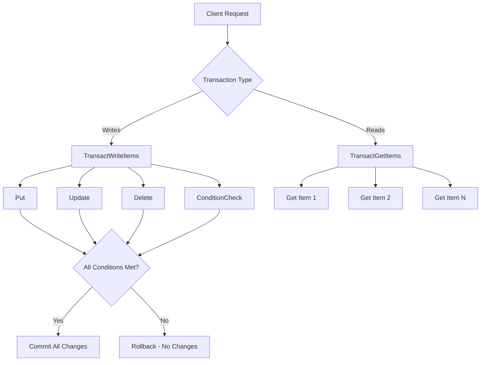
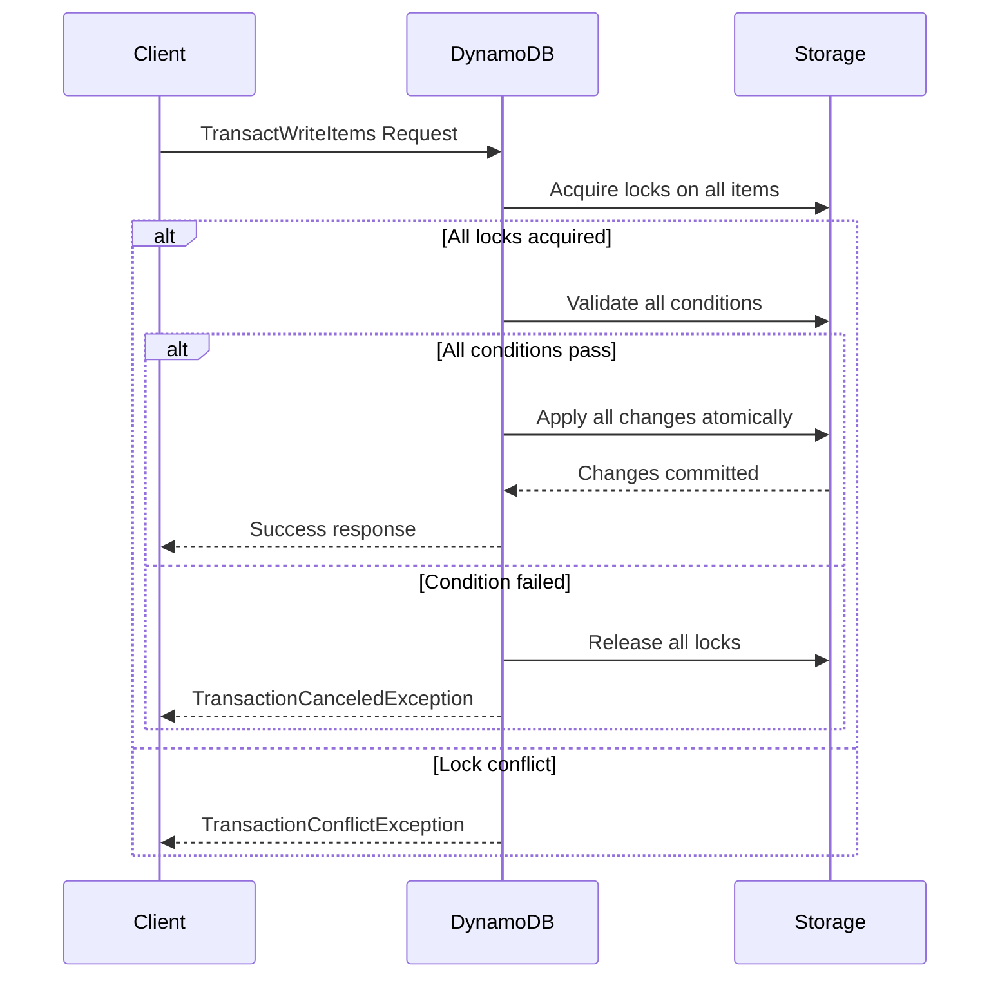
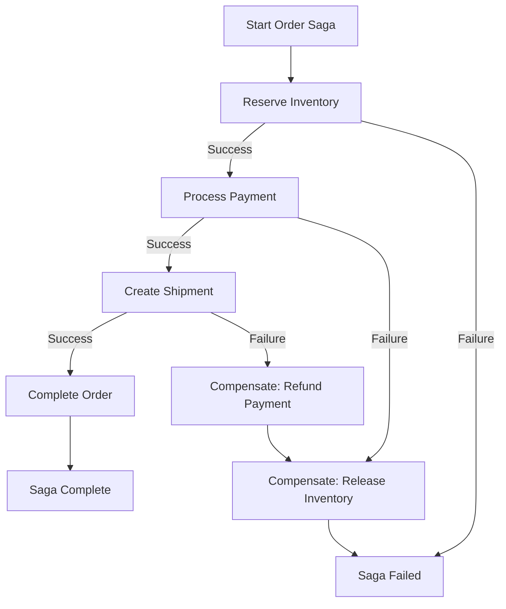

# How to Implement Transactions in DynamoDB

Author: [nawazdhandala](https://github.com/nawazdhandala)

Tags: DynamoDB, AWS, NoSQL, Transactions, Database, Serverless

Description: Learn how to implement ACID transactions in DynamoDB using TransactWriteItems and TransactGetItems. Covers multi-item operations, error handling, conditional writes, and best practices for building reliable applications.

---

DynamoDB transactions provide ACID (Atomicity, Consistency, Isolation, Durability) guarantees for operations spanning multiple items and tables. Unlike traditional relational databases, DynamoDB requires a different mental model for transactions. You can group up to 100 actions in a single transaction, and either all succeed or all fail together.

## Why Use DynamoDB Transactions?

| Scenario | Without Transactions | With Transactions |
|----------|---------------------|-------------------|
| **Bank transfer** | Partial updates possible | All-or-nothing guarantee |
| **Order placement** | Inventory and order out of sync | Consistent state always |
| **User signup** | Duplicate records possible | Atomic creation across tables |
| **Counter updates** | Race conditions | Serialized execution |

## Transaction Concepts

DynamoDB provides two transaction APIs: `TransactWriteItems` for write operations and `TransactGetItems` for consistent reads across multiple items.



## Basic Write Transaction

A TransactWriteItems request groups multiple write operations. Each operation can include conditions that must be true for the transaction to succeed. If any condition fails, the entire transaction is cancelled.

```javascript
// AWS SDK v3 - Basic transaction transferring funds between accounts
// All operations succeed together or none are applied
import { DynamoDBClient } from '@aws-sdk/client-dynamodb';
import {
  DynamoDBDocumentClient,
  TransactWriteCommand,
} from '@aws-sdk/lib-dynamodb';

const client = new DynamoDBClient({ region: 'us-east-1' });
const docClient = DynamoDBDocumentClient.from(client);

async function transferFunds(fromAccount, toAccount, amount) {
  const params = {
    TransactItems: [
      {
        // Deduct from source account
        // Condition ensures sufficient balance exists
        Update: {
          TableName: 'Accounts',
          Key: { accountId: fromAccount },
          UpdateExpression: 'SET balance = balance - :amount',
          ConditionExpression: 'balance >= :amount',
          ExpressionAttributeValues: {
            ':amount': amount,
          },
        },
      },
      {
        // Add to destination account
        // No condition needed - deposit always allowed
        Update: {
          TableName: 'Accounts',
          Key: { accountId: toAccount },
          UpdateExpression: 'SET balance = balance + :amount',
          ExpressionAttributeValues: {
            ':amount': amount,
          },
        },
      },
    ],
  };

  try {
    await docClient.send(new TransactWriteCommand(params));
    console.log('Transfer successful');
    return { success: true };
  } catch (error) {
    if (error.name === 'TransactionCanceledException') {
      // Check which condition failed
      const reasons = error.CancellationReasons;
      console.error('Transaction cancelled:', reasons);
      return { success: false, reasons };
    }
    throw error;
  }
}

// Usage
await transferFunds('ACC-001', 'ACC-002', 100);
```

## Transaction with Multiple Tables

Transactions can span multiple tables, which is useful for maintaining consistency across different entity types. An e-commerce order placement demonstrates updating inventory, creating an order, and logging the event atomically.

```javascript
// E-commerce order placement spanning three tables:
// Products (inventory), Orders (order record), and AuditLog (event tracking)
async function placeOrder(userId, items, orderId) {
  const timestamp = new Date().toISOString();
  const transactItems = [];

  // Reserve inventory for each item in the order
  for (const item of items) {
    transactItems.push({
      Update: {
        TableName: 'Products',
        Key: { productId: item.productId },
        UpdateExpression: 'SET inventory = inventory - :qty, reservedQty = reservedQty + :qty',
        // Ensure sufficient inventory exists
        ConditionExpression: 'inventory >= :qty',
        ExpressionAttributeValues: {
          ':qty': item.quantity,
        },
      },
    });
  }

  // Create the order record
  transactItems.push({
    Put: {
      TableName: 'Orders',
      Item: {
        orderId: orderId,
        PK: `USER#${userId}`,
        SK: `ORDER#${orderId}`,
        userId: userId,
        items: items,
        status: 'PENDING',
        createdAt: timestamp,
        totalAmount: items.reduce((sum, item) => sum + item.price * item.quantity, 0),
      },
      // Prevent duplicate orders with same ID
      ConditionExpression: 'attribute_not_exists(orderId)',
    },
  });

  // Create audit log entry
  transactItems.push({
    Put: {
      TableName: 'AuditLog',
      Item: {
        PK: `ORDER#${orderId}`,
        SK: `EVENT#${timestamp}`,
        eventType: 'ORDER_PLACED',
        userId: userId,
        details: { items, orderId },
        timestamp: timestamp,
      },
    },
  });

  try {
    await docClient.send(new TransactWriteCommand({ TransactItems: transactItems }));
    return { success: true, orderId };
  } catch (error) {
    if (error.name === 'TransactionCanceledException') {
      // Identify which item had insufficient inventory
      const failedIndex = error.CancellationReasons.findIndex(
        (reason) => reason.Code === 'ConditionalCheckFailed'
      );

      if (failedIndex !== -1 && failedIndex < items.length) {
        return {
          success: false,
          error: 'INSUFFICIENT_INVENTORY',
          productId: items[failedIndex].productId,
        };
      }

      return { success: false, error: 'ORDER_EXISTS' };
    }
    throw error;
  }
}
```

## Consistent Read Transactions

TransactGetItems provides strongly consistent reads across multiple items. All items are read at a single point in time, ensuring you see a consistent snapshot of your data.

```javascript
// Read user profile, their current order, and account balance atomically
// Useful when displaying a dashboard that must show consistent data
async function getUserDashboard(userId, currentOrderId) {
  const params = {
    TransactItems: [
      {
        Get: {
          TableName: 'Users',
          Key: { userId: userId },
        },
      },
      {
        Get: {
          TableName: 'Orders',
          Key: {
            PK: `USER#${userId}`,
            SK: `ORDER#${currentOrderId}`,
          },
        },
      },
      {
        Get: {
          TableName: 'Accounts',
          Key: { accountId: userId },
        },
      },
    ],
  };

  const { Responses } = await docClient.send(new TransactGetCommand(params));

  return {
    user: Responses[0].Item,
    currentOrder: Responses[1].Item,
    account: Responses[2].Item,
  };
}
```

## Condition Checks Without Modifications

ConditionCheck allows you to verify an item's state without modifying it. Use it when a transaction depends on another item's value even though you are not updating that item.

```javascript
// Approve an order only if the user's account is in good standing
// The account itself is not modified, just checked
async function approveOrder(orderId, userId) {
  const params = {
    TransactItems: [
      {
        // Verify account status without modifying it
        ConditionCheck: {
          TableName: 'Accounts',
          Key: { accountId: userId },
          ConditionExpression: 'accountStatus = :active AND #type <> :suspended',
          ExpressionAttributeNames: {
            '#type': 'type',
          },
          ExpressionAttributeValues: {
            ':active': 'ACTIVE',
            ':suspended': 'SUSPENDED',
          },
        },
      },
      {
        // Update order status to approved
        Update: {
          TableName: 'Orders',
          Key: {
            PK: `USER#${userId}`,
            SK: `ORDER#${orderId}`,
          },
          UpdateExpression: 'SET #status = :approved, approvedAt = :timestamp',
          ConditionExpression: '#status = :pending',
          ExpressionAttributeNames: {
            '#status': 'status',
          },
          ExpressionAttributeValues: {
            ':approved': 'APPROVED',
            ':pending': 'PENDING',
            ':timestamp': new Date().toISOString(),
          },
        },
      },
    ],
  };

  await docClient.send(new TransactWriteCommand(params));
}
```

## Idempotent Transactions

Client tokens make transactions idempotent. Sending the same transaction with the same token multiple times has the same effect as sending it once. DynamoDB remembers the result for 10 minutes.

```javascript
// Generate a deterministic token from the operation parameters
// Retrying with the same token returns the same result
import { createHash } from 'crypto';

function generateClientToken(operation, params) {
  const data = JSON.stringify({ operation, params, timestamp: Math.floor(Date.now() / 60000) });
  return createHash('sha256').update(data).digest('hex').substring(0, 36);
}

async function idempotentTransfer(fromAccount, toAccount, amount, requestId) {
  // Use request ID as client token for idempotency
  const clientToken = requestId || generateClientToken('transfer', { fromAccount, toAccount, amount });

  const params = {
    ClientRequestToken: clientToken,
    TransactItems: [
      {
        Update: {
          TableName: 'Accounts',
          Key: { accountId: fromAccount },
          UpdateExpression: 'SET balance = balance - :amount',
          ConditionExpression: 'balance >= :amount',
          ExpressionAttributeValues: { ':amount': amount },
        },
      },
      {
        Update: {
          TableName: 'Accounts',
          Key: { accountId: toAccount },
          UpdateExpression: 'SET balance = balance + :amount',
          ExpressionAttributeValues: { ':amount': amount },
        },
      },
    ],
  };

  // Safe to retry - same token returns same result
  await docClient.send(new TransactWriteCommand(params));
}
```

## Transaction Flow

Understanding how DynamoDB processes transactions helps with debugging and optimization.



## Handling Transaction Errors

Transactions can fail for various reasons. Proper error handling distinguishes between retryable and non-retryable failures.

```javascript
// Comprehensive error handler for DynamoDB transactions
// Differentiates between retryable conflicts and business logic failures
async function executeWithRetry(transactItems, maxRetries = 3) {
  let lastError;

  for (let attempt = 1; attempt <= maxRetries; attempt++) {
    try {
      await docClient.send(new TransactWriteCommand({ TransactItems: transactItems }));
      return { success: true };
    } catch (error) {
      lastError = error;

      // Non-retryable errors - fail immediately
      if (error.name === 'ValidationException') {
        return {
          success: false,
          retryable: false,
          error: 'Invalid transaction structure',
          details: error.message,
        };
      }

      if (error.name === 'TransactionCanceledException') {
        const reasons = error.CancellationReasons || [];

        // Check if any condition failed (business logic failure)
        const conditionFailed = reasons.some(
          (r) => r.Code === 'ConditionalCheckFailed'
        );

        if (conditionFailed) {
          return {
            success: false,
            retryable: false,
            error: 'Condition check failed',
            reasons: reasons.map((r) => r.Code),
          };
        }

        // TransactionConflict is retryable
        const hasConflict = reasons.some(
          (r) => r.Code === 'TransactionConflict'
        );

        if (hasConflict && attempt < maxRetries) {
          // Exponential backoff with jitter
          const delay = Math.min(100 * Math.pow(2, attempt) + Math.random() * 100, 5000);
          console.log(`Transaction conflict, retrying in ${delay}ms (attempt ${attempt})`);
          await new Promise((resolve) => setTimeout(resolve, delay));
          continue;
        }
      }

      // Throttling is retryable
      if (error.name === 'ProvisionedThroughputExceededException') {
        if (attempt < maxRetries) {
          const delay = Math.min(100 * Math.pow(2, attempt), 5000);
          await new Promise((resolve) => setTimeout(resolve, delay));
          continue;
        }
      }
    }
  }

  return {
    success: false,
    retryable: true,
    error: 'Max retries exceeded',
    lastError: lastError?.message,
  };
}
```

## Optimistic Locking with Versions

Combine transactions with version numbers to implement optimistic concurrency control. Each update increments the version, and the condition ensures no concurrent modification occurred.

```javascript
// Optimistic locking prevents lost updates from concurrent modifications
// Version number must match expected value for update to succeed
async function updateWithOptimisticLock(tableName, key, updates, expectedVersion) {
  const updateExpressions = [];
  const expressionValues = {
    ':expectedVersion': expectedVersion,
    ':newVersion': expectedVersion + 1,
  };
  const expressionNames = {};

  // Build update expression from provided updates
  Object.entries(updates).forEach(([field, value], index) => {
    const attrName = `#field${index}`;
    const attrValue = `:value${index}`;
    expressionNames[attrName] = field;
    expressionValues[attrValue] = value;
    updateExpressions.push(`${attrName} = ${attrValue}`);
  });

  // Always increment version
  updateExpressions.push('#version = :newVersion');
  expressionNames['#version'] = 'version';

  const params = {
    TransactItems: [
      {
        Update: {
          TableName: tableName,
          Key: key,
          UpdateExpression: `SET ${updateExpressions.join(', ')}`,
          // Version must match for update to proceed
          ConditionExpression: '#version = :expectedVersion',
          ExpressionAttributeNames: expressionNames,
          ExpressionAttributeValues: expressionValues,
          ReturnValuesOnConditionCheckFailure: 'ALL_OLD',
        },
      },
    ],
  };

  try {
    await docClient.send(new TransactWriteCommand(params));
    return { success: true, newVersion: expectedVersion + 1 };
  } catch (error) {
    if (error.name === 'TransactionCanceledException') {
      // Another process modified the item - caller should refetch and retry
      return {
        success: false,
        error: 'VERSION_MISMATCH',
        message: 'Item was modified by another process',
      };
    }
    throw error;
  }
}

// Usage example
const result = await updateWithOptimisticLock(
  'Products',
  { productId: 'PROD-123' },
  { price: 29.99, description: 'Updated description' },
  5  // Expected version
);

if (!result.success && result.error === 'VERSION_MISMATCH') {
  // Refetch the item and retry with new version
  console.log('Concurrent modification detected, refetching...');
}
```

## Saga Pattern for Complex Workflows

For workflows exceeding transaction limits or requiring external service calls, implement the saga pattern with compensating transactions.



```javascript
// Saga orchestrator for multi-step workflows
// Each step has a corresponding compensation action for rollback
class OrderSaga {
  constructor(docClient) {
    this.docClient = docClient;
    this.completedSteps = [];
  }

  async execute(orderData) {
    try {
      // Step 1: Reserve inventory
      await this.reserveInventory(orderData);
      this.completedSteps.push('RESERVE_INVENTORY');

      // Step 2: Process payment (external service)
      await this.processPayment(orderData);
      this.completedSteps.push('PROCESS_PAYMENT');

      // Step 3: Create shipment record
      await this.createShipment(orderData);
      this.completedSteps.push('CREATE_SHIPMENT');

      // Step 4: Finalize order
      await this.finalizeOrder(orderData);

      return { success: true, orderId: orderData.orderId };
    } catch (error) {
      console.error('Saga failed at step:', this.completedSteps.length + 1, error);
      await this.compensate(orderData);
      return { success: false, error: error.message, failedAt: this.completedSteps.length + 1 };
    }
  }

  async compensate(orderData) {
    // Execute compensations in reverse order
    const compensations = [...this.completedSteps].reverse();

    for (const step of compensations) {
      try {
        switch (step) {
          case 'CREATE_SHIPMENT':
            await this.cancelShipment(orderData);
            break;
          case 'PROCESS_PAYMENT':
            await this.refundPayment(orderData);
            break;
          case 'RESERVE_INVENTORY':
            await this.releaseInventory(orderData);
            break;
        }
        console.log(`Compensated: ${step}`);
      } catch (compError) {
        // Log compensation failure for manual intervention
        console.error(`Compensation failed for ${step}:`, compError);
        await this.logCompensationFailure(orderData, step, compError);
      }
    }
  }

  async reserveInventory(orderData) {
    const transactItems = orderData.items.map((item) => ({
      Update: {
        TableName: 'Products',
        Key: { productId: item.productId },
        UpdateExpression: 'SET inventory = inventory - :qty, reserved = reserved + :qty',
        ConditionExpression: 'inventory >= :qty',
        ExpressionAttributeValues: { ':qty': item.quantity },
      },
    }));

    await this.docClient.send(new TransactWriteCommand({ TransactItems: transactItems }));
  }

  async releaseInventory(orderData) {
    const transactItems = orderData.items.map((item) => ({
      Update: {
        TableName: 'Products',
        Key: { productId: item.productId },
        UpdateExpression: 'SET inventory = inventory + :qty, reserved = reserved - :qty',
        ExpressionAttributeValues: { ':qty': item.quantity },
      },
    }));

    await this.docClient.send(new TransactWriteCommand({ TransactItems: transactItems }));
  }

  async processPayment(orderData) {
    // External payment service call
    const response = await fetch('https://payments.example.com/charge', {
      method: 'POST',
      headers: { 'Content-Type': 'application/json' },
      body: JSON.stringify({
        orderId: orderData.orderId,
        amount: orderData.totalAmount,
        customerId: orderData.userId,
      }),
    });

    if (!response.ok) {
      throw new Error('Payment failed');
    }

    return response.json();
  }

  async refundPayment(orderData) {
    await fetch('https://payments.example.com/refund', {
      method: 'POST',
      headers: { 'Content-Type': 'application/json' },
      body: JSON.stringify({ orderId: orderData.orderId }),
    });
  }

  async createShipment(orderData) {
    await this.docClient.send(
      new TransactWriteCommand({
        TransactItems: [
          {
            Put: {
              TableName: 'Shipments',
              Item: {
                shipmentId: `SHIP-${orderData.orderId}`,
                orderId: orderData.orderId,
                status: 'PENDING',
                createdAt: new Date().toISOString(),
              },
            },
          },
        ],
      })
    );
  }

  async cancelShipment(orderData) {
    await this.docClient.send(
      new TransactWriteCommand({
        TransactItems: [
          {
            Update: {
              TableName: 'Shipments',
              Key: { shipmentId: `SHIP-${orderData.orderId}` },
              UpdateExpression: 'SET #status = :cancelled',
              ExpressionAttributeNames: { '#status': 'status' },
              ExpressionAttributeValues: { ':cancelled': 'CANCELLED' },
            },
          },
        ],
      })
    );
  }

  async finalizeOrder(orderData) {
    await this.docClient.send(
      new TransactWriteCommand({
        TransactItems: [
          {
            Update: {
              TableName: 'Orders',
              Key: {
                PK: `USER#${orderData.userId}`,
                SK: `ORDER#${orderData.orderId}`,
              },
              UpdateExpression: 'SET #status = :confirmed, confirmedAt = :timestamp',
              ExpressionAttributeNames: { '#status': 'status' },
              ExpressionAttributeValues: {
                ':confirmed': 'CONFIRMED',
                ':timestamp': new Date().toISOString(),
              },
            },
          },
        ],
      })
    );
  }

  async logCompensationFailure(orderData, step, error) {
    await this.docClient.send(
      new TransactWriteCommand({
        TransactItems: [
          {
            Put: {
              TableName: 'CompensationFailures',
              Item: {
                orderId: orderData.orderId,
                step: step,
                error: error.message,
                timestamp: new Date().toISOString(),
                requiresManualIntervention: true,
              },
            },
          },
        ],
      })
    );
  }
}
```

## Transaction Limits and Best Practices

DynamoDB transactions have specific limits that affect design decisions.

| Limit | Value | Workaround |
|-------|-------|------------|
| Max items per transaction | 100 | Batch into multiple transactions or use saga pattern |
| Max request size | 4 MB | Reduce item sizes or split operations |
| Max item size | 400 KB | Store large data in S3, reference in DynamoDB |
| Idempotency window | 10 minutes | Use consistent client tokens |

```javascript
// Helper to batch large operations into multiple transactions
// Respects the 100 item limit per transaction
async function batchedTransaction(items, batchSize = 25) {
  const batches = [];

  for (let i = 0; i < items.length; i += batchSize) {
    batches.push(items.slice(i, i + batchSize));
  }

  const results = [];

  for (const batch of batches) {
    try {
      await docClient.send(new TransactWriteCommand({ TransactItems: batch }));
      results.push({ success: true, count: batch.length });
    } catch (error) {
      results.push({ success: false, error: error.message });
      // Decide whether to continue or abort remaining batches
      break;
    }
  }

  return results;
}
```

## Monitoring Transactions

Track transaction metrics to identify performance issues and optimize your access patterns.

```javascript
// Wrapper that logs transaction metrics to CloudWatch or your monitoring system
async function monitoredTransaction(name, transactItems) {
  const startTime = Date.now();
  const itemCount = transactItems.length;

  try {
    await docClient.send(new TransactWriteCommand({ TransactItems: transactItems }));

    const duration = Date.now() - startTime;

    // Log success metrics
    console.log(JSON.stringify({
      metric: 'TransactionSuccess',
      name: name,
      itemCount: itemCount,
      durationMs: duration,
    }));

    return { success: true, duration };
  } catch (error) {
    const duration = Date.now() - startTime;

    // Log failure metrics with error classification
    console.log(JSON.stringify({
      metric: 'TransactionFailure',
      name: name,
      itemCount: itemCount,
      durationMs: duration,
      errorType: error.name,
      errorMessage: error.message,
    }));

    throw error;
  }
}
```

## Summary

| Concept | When to Use |
|---------|-------------|
| **TransactWriteItems** | Atomic writes across multiple items or tables |
| **TransactGetItems** | Consistent reads of multiple items at same point in time |
| **ConditionCheck** | Verify item state without modification |
| **Client tokens** | Idempotent transactions for safe retries |
| **Optimistic locking** | Prevent lost updates from concurrent modifications |
| **Saga pattern** | Complex workflows exceeding transaction limits |

DynamoDB transactions enable building reliable applications with strong consistency guarantees. By combining atomic operations with proper error handling, idempotency, and compensation patterns, you can implement complex business logic while maintaining data integrity across your distributed system.
