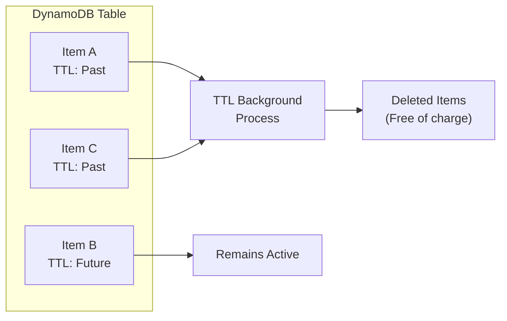
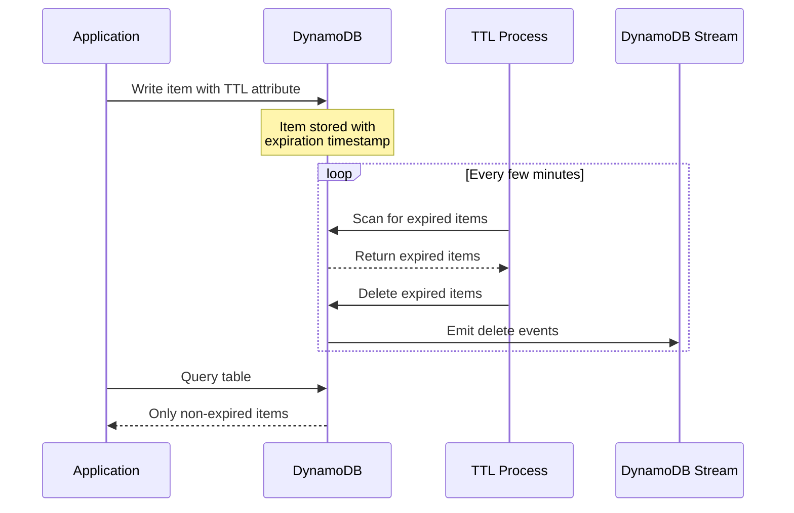
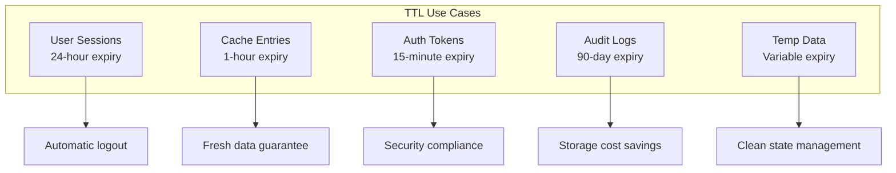
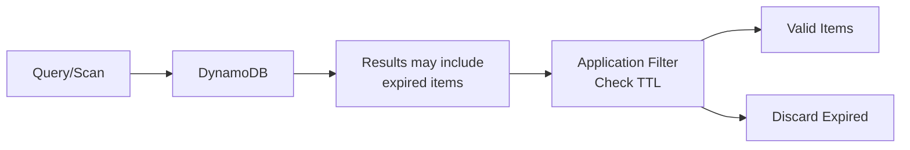
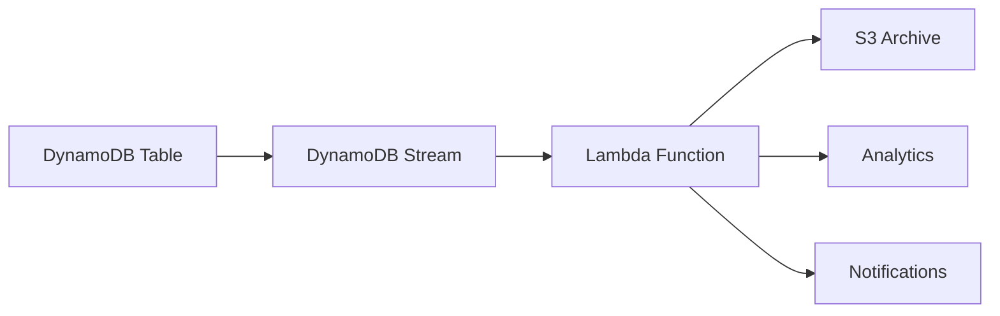
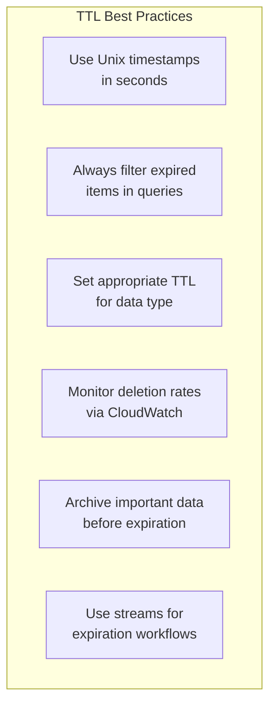

# How to Implement TTL (Time to Live) in DynamoDB

Author: [nawazdhandala](https://www.github.com/nawazdhandala)

Tags: DynamoDB, AWS, TTL, NoSQL, Database, Data Management, Serverless

Description: Learn how to implement Time to Live (TTL) in Amazon DynamoDB to automatically expire and delete items. Covers configuration, best practices, use cases, and monitoring strategies for efficient data lifecycle management.

---

> Storing data forever is expensive and often unnecessary. DynamoDB TTL lets you automatically expire items without paying for delete operations or writing cleanup code. Set an expiration timestamp, and DynamoDB handles the rest.

Managing data lifecycle manually leads to bloated tables and increased costs. TTL automates cleanup efficiently.

---

## What is DynamoDB TTL?



TTL is a feature that automatically deletes items from your DynamoDB table when their specified timestamp expires. AWS runs a background process that scans for expired items and removes them at no additional cost.

---

## How TTL Works



Key characteristics of DynamoDB TTL:

- TTL values must be stored as Unix epoch timestamps in seconds
- Items typically expire within 48 hours of the TTL timestamp
- Expired items may still appear in queries until deletion completes
- Deletions are free and do not consume write capacity
- TTL deletions can be streamed to DynamoDB Streams or Kinesis

---

## Enabling TTL on a Table

### Using AWS CLI

Enable TTL on an existing table by specifying the attribute name that contains your expiration timestamps:

```bash
# Enable TTL on the 'sessions' table using 'expirationTime' as the TTL attribute
aws dynamodb update-time-to-live \
    --table-name sessions \
    --time-to-live-specification \
        "Enabled=true, AttributeName=expirationTime"
```

### Using AWS CloudFormation

Define TTL configuration in your CloudFormation template to enable it during table creation:

```yaml
# cloudformation-template.yaml
Resources:
  SessionsTable:
    Type: AWS::DynamoDB::Table
    Properties:
      TableName: sessions
      AttributeDefinitions:
        - AttributeName: sessionId
          AttributeType: S
      KeySchema:
        - AttributeName: sessionId
          KeyType: HASH
      BillingMode: PAY_PER_REQUEST
      # TTL configuration - specify the attribute containing expiration timestamps
      TimeToLiveSpecification:
        AttributeName: expirationTime
        Enabled: true
```

### Using Terraform

Configure TTL in your Terraform infrastructure code for automated provisioning:

```hcl
# main.tf
resource "aws_dynamodb_table" "sessions" {
  name         = "sessions"
  billing_mode = "PAY_PER_REQUEST"
  hash_key     = "sessionId"

  attribute {
    name = "sessionId"
    type = "S"
  }

  # Enable TTL with the specified attribute name
  # Items will be deleted when current time exceeds the attribute value
  ttl {
    attribute_name = "expirationTime"
    enabled        = true
  }
}
```

---

## Writing Items with TTL

### Python (Boto3)

Create items with a TTL attribute containing a Unix timestamp representing when the item should expire:

```python
# session_manager.py
import boto3
import time
from datetime import datetime, timedelta

# Initialize DynamoDB client
dynamodb = boto3.resource('dynamodb')
table = dynamodb.Table('sessions')

def create_session(user_id: str, session_data: dict, ttl_hours: int = 24):
    """
    Create a new session with automatic expiration.

    Args:
        user_id: Unique identifier for the user
        session_data: Dictionary containing session information
        ttl_hours: Number of hours until the session expires (default 24)

    Returns:
        The session ID of the created session
    """
    import uuid

    session_id = str(uuid.uuid4())

    # Calculate expiration time as Unix epoch timestamp in seconds
    # DynamoDB TTL requires timestamps in seconds, not milliseconds
    current_time = int(time.time())
    expiration_time = current_time + (ttl_hours * 3600)

    # Store the item with TTL attribute
    table.put_item(
        Item={
            'sessionId': session_id,
            'userId': user_id,
            'data': session_data,
            'createdAt': current_time,
            # The TTL attribute - DynamoDB will delete this item
            # when current time exceeds this value
            'expirationTime': expiration_time
        }
    )

    return session_id


def extend_session(session_id: str, additional_hours: int = 24):
    """
    Extend an existing session's TTL by updating the expiration timestamp.

    Args:
        session_id: The session to extend
        additional_hours: Hours to add to current expiration time
    """
    new_expiration = int(time.time()) + (additional_hours * 3600)

    # Update only the TTL attribute to extend session lifetime
    table.update_item(
        Key={'sessionId': session_id},
        UpdateExpression='SET expirationTime = :exp',
        ExpressionAttributeValues={
            ':exp': new_expiration
        }
    )
```

### Node.js (AWS SDK v3)

Implement TTL in Node.js applications using the AWS SDK version 3:

```javascript
// sessionManager.js
import { DynamoDBClient } from "@aws-sdk/client-dynamodb";
import {
    DynamoDBDocumentClient,
    PutCommand,
    UpdateCommand
} from "@aws-sdk/lib-dynamodb";
import { v4 as uuidv4 } from "uuid";

// Create DynamoDB client with document client wrapper for easier item handling
const client = new DynamoDBClient({ region: "us-east-1" });
const docClient = DynamoDBDocumentClient.from(client);

const TABLE_NAME = "sessions";

/**
 * Create a new session with automatic TTL expiration.
 *
 * @param {string} userId - User identifier
 * @param {object} sessionData - Session payload
 * @param {number} ttlHours - Hours until expiration (default: 24)
 * @returns {Promise<string>} Session ID
 */
async function createSession(userId, sessionData, ttlHours = 24) {
    const sessionId = uuidv4();

    // Calculate Unix timestamp in seconds for TTL
    // JavaScript Date.now() returns milliseconds, so divide by 1000
    const currentTime = Math.floor(Date.now() / 1000);
    const expirationTime = currentTime + (ttlHours * 3600);

    const command = new PutCommand({
        TableName: TABLE_NAME,
        Item: {
            sessionId,
            userId,
            data: sessionData,
            createdAt: currentTime,
            // TTL attribute - item deleted after this timestamp
            expirationTime
        }
    });

    await docClient.send(command);
    return sessionId;
}

/**
 * Refresh a session by extending its TTL.
 * Call this on user activity to keep sessions alive.
 *
 * @param {string} sessionId - Session to refresh
 * @param {number} ttlHours - New TTL from current time
 */
async function refreshSession(sessionId, ttlHours = 24) {
    const newExpiration = Math.floor(Date.now() / 1000) + (ttlHours * 3600);

    const command = new UpdateCommand({
        TableName: TABLE_NAME,
        Key: { sessionId },
        UpdateExpression: "SET expirationTime = :exp, lastActivityAt = :now",
        ExpressionAttributeValues: {
            ":exp": newExpiration,
            ":now": Math.floor(Date.now() / 1000)
        }
    });

    await docClient.send(command);
}

export { createSession, refreshSession };
```

### Go

Implement TTL functionality in Go applications using the AWS SDK:

```go
// session_manager.go
package sessions

import (
    "context"
    "time"

    "github.com/aws/aws-sdk-go-v2/aws"
    "github.com/aws/aws-sdk-go-v2/feature/dynamodb/attributevalue"
    "github.com/aws/aws-sdk-go-v2/service/dynamodb"
    "github.com/google/uuid"
)

// Session represents a user session with TTL support
type Session struct {
    SessionID      string                 `dynamodbav:"sessionId"`
    UserID         string                 `dynamodbav:"userId"`
    Data           map[string]interface{} `dynamodbav:"data"`
    CreatedAt      int64                  `dynamodbav:"createdAt"`
    // ExpirationTime is the Unix timestamp when this session expires
    // DynamoDB will automatically delete items past this time
    ExpirationTime int64                  `dynamodbav:"expirationTime"`
}

// SessionManager handles session CRUD operations
type SessionManager struct {
    client    *dynamodb.Client
    tableName string
}

// NewSessionManager creates a new session manager instance
func NewSessionManager(client *dynamodb.Client, tableName string) *SessionManager {
    return &SessionManager{
        client:    client,
        tableName: tableName,
    }
}

// CreateSession creates a new session with TTL
// ttlDuration specifies how long until the session expires
func (sm *SessionManager) CreateSession(
    ctx context.Context,
    userID string,
    data map[string]interface{},
    ttlDuration time.Duration,
) (string, error) {
    sessionID := uuid.New().String()
    currentTime := time.Now().Unix()

    // Calculate expiration as Unix timestamp in seconds
    // Add TTL duration to current time
    expirationTime := currentTime + int64(ttlDuration.Seconds())

    session := Session{
        SessionID:      sessionID,
        UserID:         userID,
        Data:           data,
        CreatedAt:      currentTime,
        ExpirationTime: expirationTime,
    }

    // Marshal session struct to DynamoDB attribute values
    item, err := attributevalue.MarshalMap(session)
    if err != nil {
        return "", err
    }

    _, err = sm.client.PutItem(ctx, &dynamodb.PutItemInput{
        TableName: aws.String(sm.tableName),
        Item:      item,
    })

    if err != nil {
        return "", err
    }

    return sessionID, nil
}

// ExtendSession updates the TTL for an existing session
func (sm *SessionManager) ExtendSession(
    ctx context.Context,
    sessionID string,
    additionalDuration time.Duration,
) error {
    newExpiration := time.Now().Unix() + int64(additionalDuration.Seconds())

    _, err := sm.client.UpdateItem(ctx, &dynamodb.UpdateItemInput{
        TableName: aws.String(sm.tableName),
        Key: map[string]types.AttributeValue{
            "sessionId": &types.AttributeValueMemberS{Value: sessionID},
        },
        UpdateExpression: aws.String("SET expirationTime = :exp"),
        ExpressionAttributeValues: map[string]types.AttributeValue{
            ":exp": &types.AttributeValueMemberN{
                Value: strconv.FormatInt(newExpiration, 10),
            },
        },
    })

    return err
}
```

---

## Common TTL Use Cases



### Session Management

Automatically expire user sessions after a period of inactivity:

```python
# session_with_sliding_expiry.py
import boto3
import time

dynamodb = boto3.resource('dynamodb')
table = dynamodb.Table('sessions')

def get_session_with_refresh(session_id: str, refresh_threshold_minutes: int = 5):
    """
    Retrieve a session and optionally refresh its TTL.
    Implements sliding expiration - active sessions stay alive.

    Args:
        session_id: Session identifier
        refresh_threshold_minutes: Refresh TTL if less than this time remains

    Returns:
        Session data if valid, None if expired or not found
    """
    current_time = int(time.time())

    # Fetch the session from DynamoDB
    response = table.get_item(
        Key={'sessionId': session_id}
    )

    if 'Item' not in response:
        return None

    session = response['Item']
    expiration_time = session.get('expirationTime', 0)

    # Check if session has already expired
    # Note: Expired items may still exist until TTL process removes them
    if expiration_time < current_time:
        return None

    # Calculate remaining time until expiration
    remaining_seconds = expiration_time - current_time
    remaining_minutes = remaining_seconds / 60

    # Refresh TTL if close to expiration (sliding window pattern)
    # Keeps active sessions alive without explicit renewal
    if remaining_minutes < refresh_threshold_minutes:
        new_expiration = current_time + (24 * 3600)  # Extend by 24 hours

        table.update_item(
            Key={'sessionId': session_id},
            UpdateExpression='SET expirationTime = :exp, lastAccessAt = :now',
            ExpressionAttributeValues={
                ':exp': new_expiration,
                ':now': current_time
            }
        )

        session['expirationTime'] = new_expiration

    return session
```

### Temporary Data Storage

Store temporary data like OTP codes or verification tokens with automatic cleanup:

```python
# verification_codes.py
import boto3
import time
import secrets
import string

dynamodb = boto3.resource('dynamodb')
table = dynamodb.Table('verification_codes')

def generate_verification_code(
    user_id: str,
    code_type: str = 'email',
    ttl_minutes: int = 15
) -> str:
    """
    Generate a verification code with automatic expiration.
    Perfect for email verification, password reset, or 2FA codes.

    Args:
        user_id: User requesting verification
        code_type: Type of verification (email, phone, password_reset)
        ttl_minutes: Minutes until code expires

    Returns:
        The generated verification code
    """
    # Generate a 6-digit numeric code
    code = ''.join(secrets.choice(string.digits) for _ in range(6))

    current_time = int(time.time())
    # Short TTL for security - codes expire quickly
    expiration_time = current_time + (ttl_minutes * 60)

    # Store with composite key to allow multiple code types per user
    table.put_item(
        Item={
            'userId': user_id,
            'codeType': code_type,
            'code': code,
            'createdAt': current_time,
            # TTL ensures codes are automatically cleaned up
            # No need to manually delete expired codes
            'expirationTime': expiration_time,
            'attempts': 0,  # Track verification attempts
            'maxAttempts': 3
        }
    )

    return code


def verify_code(user_id: str, code_type: str, submitted_code: str) -> bool:
    """
    Verify a submitted code and invalidate it on success.

    Args:
        user_id: User submitting the code
        code_type: Type of verification
        submitted_code: Code to verify

    Returns:
        True if code is valid, False otherwise
    """
    current_time = int(time.time())

    response = table.get_item(
        Key={
            'userId': user_id,
            'codeType': code_type
        }
    )

    if 'Item' not in response:
        return False

    stored = response['Item']

    # Check expiration manually for immediate validation
    # TTL deletion can be delayed, so always check timestamp
    if stored['expirationTime'] < current_time:
        return False

    # Check attempt limit to prevent brute force
    if stored['attempts'] >= stored['maxAttempts']:
        return False

    if stored['code'] == submitted_code:
        # Delete the code immediately after successful verification
        # Prevents code reuse
        table.delete_item(
            Key={
                'userId': user_id,
                'codeType': code_type
            }
        )
        return True

    # Increment failed attempt counter
    table.update_item(
        Key={
            'userId': user_id,
            'codeType': code_type
        },
        UpdateExpression='SET attempts = attempts + :inc',
        ExpressionAttributeValues={':inc': 1}
    )

    return False
```

### Cache with Automatic Invalidation

Implement a caching layer with TTL-based automatic invalidation:

```python
# dynamodb_cache.py
import boto3
import time
import json
import hashlib
from typing import Any, Optional, Callable

dynamodb = boto3.resource('dynamodb')
table = dynamodb.Table('cache')

class DynamoDBCache:
    """
    A caching layer using DynamoDB with automatic TTL expiration.
    Useful for caching API responses, computed results, or external data.
    """

    def __init__(self, default_ttl_seconds: int = 3600):
        """
        Initialize cache with default TTL.

        Args:
            default_ttl_seconds: Default cache duration (1 hour)
        """
        self.default_ttl = default_ttl_seconds
        self.table = dynamodb.Table('cache')

    def _generate_key(self, namespace: str, identifier: str) -> str:
        """Generate a consistent cache key from namespace and identifier."""
        raw_key = f"{namespace}:{identifier}"
        # Hash long keys to stay within DynamoDB key size limits
        if len(raw_key) > 256:
            return f"{namespace}:{hashlib.sha256(identifier.encode()).hexdigest()}"
        return raw_key

    def get(self, namespace: str, identifier: str) -> Optional[Any]:
        """
        Retrieve an item from cache.

        Args:
            namespace: Cache namespace (e.g., 'user_profile', 'api_response')
            identifier: Unique identifier within namespace

        Returns:
            Cached value if found and not expired, None otherwise
        """
        cache_key = self._generate_key(namespace, identifier)
        current_time = int(time.time())

        response = self.table.get_item(
            Key={'cacheKey': cache_key}
        )

        if 'Item' not in response:
            return None

        item = response['Item']

        # Always check expiration - TTL deletion can be delayed
        if item.get('expirationTime', 0) < current_time:
            return None

        # Deserialize the cached value from JSON
        return json.loads(item['value'])

    def set(
        self,
        namespace: str,
        identifier: str,
        value: Any,
        ttl_seconds: Optional[int] = None
    ):
        """
        Store an item in cache with TTL.

        Args:
            namespace: Cache namespace
            identifier: Unique identifier
            value: Value to cache (must be JSON serializable)
            ttl_seconds: Custom TTL, or use default if not specified
        """
        cache_key = self._generate_key(namespace, identifier)
        current_time = int(time.time())
        ttl = ttl_seconds if ttl_seconds is not None else self.default_ttl

        self.table.put_item(
            Item={
                'cacheKey': cache_key,
                'namespace': namespace,
                'value': json.dumps(value),
                'createdAt': current_time,
                # TTL handles automatic cleanup
                'expirationTime': current_time + ttl
            }
        )

    def get_or_set(
        self,
        namespace: str,
        identifier: str,
        factory: Callable[[], Any],
        ttl_seconds: Optional[int] = None
    ) -> Any:
        """
        Get from cache or compute and cache the result.

        Args:
            namespace: Cache namespace
            identifier: Unique identifier
            factory: Function to call if cache miss
            ttl_seconds: TTL for cached result

        Returns:
            Cached or freshly computed value
        """
        # Try to get from cache first
        cached = self.get(namespace, identifier)
        if cached is not None:
            return cached

        # Cache miss - compute the value
        value = factory()

        # Store in cache for future requests
        self.set(namespace, identifier, value, ttl_seconds)

        return value


# Usage example
cache = DynamoDBCache(default_ttl_seconds=3600)

def get_user_profile(user_id: str) -> dict:
    """Fetch user profile with caching."""
    return cache.get_or_set(
        namespace='user_profile',
        identifier=user_id,
        factory=lambda: fetch_profile_from_database(user_id),
        ttl_seconds=300  # Cache for 5 minutes
    )
```

---

## Handling Expired Items in Queries



Expired items may still appear in query results until the TTL background process deletes them. Always filter results:

```python
# query_with_ttl_filter.py
import boto3
import time
from boto3.dynamodb.conditions import Key, Attr

dynamodb = boto3.resource('dynamodb')
table = dynamodb.Table('sessions')

def get_active_sessions(user_id: str) -> list:
    """
    Query sessions for a user, filtering out expired items.

    Important: Even with TTL enabled, expired items may appear in results
    until the background deletion process runs (up to 48 hours delay).
    Always filter on the application side for accurate results.

    Args:
        user_id: User identifier

    Returns:
        List of active (non-expired) sessions
    """
    current_time = int(time.time())

    # Query with a filter expression to exclude expired items
    # Filtering happens server-side, reducing data transfer
    response = table.query(
        IndexName='userId-index',
        KeyConditionExpression=Key('userId').eq(user_id),
        # Filter to only return items where TTL is in the future
        FilterExpression=Attr('expirationTime').gt(current_time)
    )

    return response.get('Items', [])


def scan_active_items(table_name: str, ttl_attribute: str = 'expirationTime') -> list:
    """
    Scan table for all active (non-expired) items.
    Use sparingly - scans are expensive on large tables.

    Args:
        table_name: Name of the DynamoDB table
        ttl_attribute: Name of the TTL attribute

    Returns:
        List of all non-expired items
    """
    table = dynamodb.Table(table_name)
    current_time = int(time.time())

    items = []
    last_evaluated_key = None

    # Paginate through all items
    while True:
        scan_kwargs = {
            'FilterExpression': Attr(ttl_attribute).gt(current_time)
        }

        if last_evaluated_key:
            scan_kwargs['ExclusiveStartKey'] = last_evaluated_key

        response = table.scan(**scan_kwargs)
        items.extend(response.get('Items', []))

        # Check if there are more pages
        last_evaluated_key = response.get('LastEvaluatedKey')
        if not last_evaluated_key:
            break

    return items
```

---

## Streaming TTL Deletions



Capture TTL deletions using DynamoDB Streams for auditing, analytics, or triggering workflows:

```python
# ttl_deletion_handler.py
import json
import boto3
from datetime import datetime

s3 = boto3.client('s3')
sns = boto3.client('sns')

ARCHIVE_BUCKET = 'expired-items-archive'
ALERT_TOPIC_ARN = 'arn:aws:sns:us-east-1:123456789:expiration-alerts'

def lambda_handler(event, context):
    """
    Lambda function triggered by DynamoDB Stream.
    Processes TTL deletions for auditing and archival.

    TTL deletions have a specific signature in the stream:
    - eventName is 'REMOVE'
    - userIdentity contains principalId 'dynamodb.amazonaws.com'

    Args:
        event: DynamoDB Stream event containing records
        context: Lambda context

    Returns:
        Processing summary
    """
    processed_count = 0
    archived_count = 0

    for record in event['Records']:
        # Only process deletion events
        if record['eventName'] != 'REMOVE':
            continue

        # Check if deletion was caused by TTL
        # TTL deletions have a specific user identity
        user_identity = record.get('userIdentity', {})
        is_ttl_deletion = (
            user_identity.get('type') == 'Service' and
            user_identity.get('principalId') == 'dynamodb.amazonaws.com'
        )

        if not is_ttl_deletion:
            # Manual deletion, not TTL - skip or handle differently
            continue

        # Extract the deleted item data
        old_image = record.get('dynamodb', {}).get('OldImage', {})
        if not old_image:
            continue

        # Convert DynamoDB format to regular dict
        deleted_item = deserialize_dynamodb_item(old_image)

        # Archive the deleted item to S3 for compliance/auditing
        archive_item(deleted_item)
        archived_count += 1

        # Optionally send notifications for certain item types
        if should_notify(deleted_item):
            send_expiration_notification(deleted_item)

        processed_count += 1

    return {
        'processed': processed_count,
        'archived': archived_count
    }


def deserialize_dynamodb_item(dynamodb_item: dict) -> dict:
    """Convert DynamoDB item format to regular Python dict."""
    from boto3.dynamodb.types import TypeDeserializer
    deserializer = TypeDeserializer()

    return {
        key: deserializer.deserialize(value)
        for key, value in dynamodb_item.items()
    }


def archive_item(item: dict):
    """Archive expired item to S3 for long-term storage."""
    # Create a time-based key for organization
    timestamp = datetime.utcnow()
    key = f"expired/{timestamp.year}/{timestamp.month:02d}/{timestamp.day:02d}/"
    key += f"{item.get('sessionId', 'unknown')}.json"

    s3.put_object(
        Bucket=ARCHIVE_BUCKET,
        Key=key,
        Body=json.dumps(item, default=str),
        ContentType='application/json'
    )


def should_notify(item: dict) -> bool:
    """Determine if expiration notification should be sent."""
    # Example: Notify for premium user sessions
    return item.get('userTier') == 'premium'


def send_expiration_notification(item: dict):
    """Send notification about expired item."""
    sns.publish(
        TopicArn=ALERT_TOPIC_ARN,
        Subject='Session Expired',
        Message=json.dumps({
            'type': 'session_expired',
            'userId': item.get('userId'),
            'sessionId': item.get('sessionId'),
            'expiredAt': item.get('expirationTime')
        })
    )
```

Enable DynamoDB Streams on your table to capture TTL deletions:

```bash
# Enable streams with OLD_IMAGE to capture deleted item data
aws dynamodb update-table \
    --table-name sessions \
    --stream-specification \
        StreamEnabled=true,StreamViewType=OLD_IMAGE
```

---

## Monitoring TTL Operations

### CloudWatch Metrics

Monitor TTL deletions using CloudWatch metrics to track expiration patterns:

```python
# ttl_monitoring.py
import boto3
from datetime import datetime, timedelta

cloudwatch = boto3.client('cloudwatch')

def get_ttl_deletion_metrics(table_name: str, hours: int = 24) -> dict:
    """
    Retrieve TTL deletion metrics from CloudWatch.

    DynamoDB publishes TTL metrics automatically:
    - TimeToLiveDeletedItemCount: Number of items deleted by TTL

    Args:
        table_name: DynamoDB table name
        hours: Number of hours to look back

    Returns:
        Dictionary containing deletion metrics
    """
    end_time = datetime.utcnow()
    start_time = end_time - timedelta(hours=hours)

    response = cloudwatch.get_metric_statistics(
        Namespace='AWS/DynamoDB',
        MetricName='TimeToLiveDeletedItemCount',
        Dimensions=[
            {
                'Name': 'TableName',
                'Value': table_name
            }
        ],
        StartTime=start_time,
        EndTime=end_time,
        Period=3600,  # 1 hour granularity
        Statistics=['Sum']
    )

    # Sort datapoints by timestamp
    datapoints = sorted(
        response['Datapoints'],
        key=lambda x: x['Timestamp']
    )

    total_deleted = sum(dp['Sum'] for dp in datapoints)

    return {
        'table_name': table_name,
        'period_hours': hours,
        'total_deleted': int(total_deleted),
        'hourly_breakdown': [
            {
                'timestamp': dp['Timestamp'].isoformat(),
                'count': int(dp['Sum'])
            }
            for dp in datapoints
        ]
    }


def create_ttl_alarm(table_name: str, threshold: int = 10000):
    """
    Create CloudWatch alarm for unusual TTL deletion rates.
    High deletion rates might indicate issues or attacks.

    Args:
        table_name: DynamoDB table name
        threshold: Deletions per hour to trigger alarm
    """
    cloudwatch.put_metric_alarm(
        AlarmName=f'{table_name}-high-ttl-deletions',
        ComparisonOperator='GreaterThanThreshold',
        EvaluationPeriods=1,
        MetricName='TimeToLiveDeletedItemCount',
        Namespace='AWS/DynamoDB',
        Period=3600,
        Statistic='Sum',
        Threshold=threshold,
        AlarmDescription=f'High TTL deletion rate on {table_name}',
        Dimensions=[
            {
                'Name': 'TableName',
                'Value': table_name
            }
        ],
        AlarmActions=[
            'arn:aws:sns:us-east-1:123456789:alerts'
        ]
    )
```

---

## Best Practices



### 1. Timestamp Format

Always use Unix epoch timestamps in seconds, not milliseconds:

```python
# Correct - seconds
expiration_time = int(time.time()) + 3600

# Incorrect - milliseconds (will expire in year 55000+)
expiration_time = int(time.time() * 1000) + 3600000
```

### 2. Filter Expired Items

Never rely solely on TTL for data freshness in queries:

```python
# Always include TTL filter in queries
current_time = int(time.time())
response = table.query(
    KeyConditionExpression=Key('pk').eq(pk_value),
    FilterExpression=Attr('expirationTime').gt(current_time)
)
```

### 3. Choose Appropriate TTL Values

Match TTL to your data lifecycle requirements:

| Data Type | Recommended TTL |
|-----------|----------------|
| Session tokens | 24 hours |
| Password reset links | 15 minutes |
| Email verification | 24-48 hours |
| Shopping cart | 7-30 days |
| Audit logs | 90-365 days |
| Cache entries | 5-60 minutes |

### 4. Handle TTL Attribute Absence

Not all items may have a TTL attribute set:

```python
def is_item_expired(item: dict, ttl_attribute: str = 'expirationTime') -> bool:
    """
    Check if an item is expired.
    Items without TTL attribute are considered non-expiring.
    """
    ttl_value = item.get(ttl_attribute)

    # No TTL set - item never expires
    if ttl_value is None:
        return False

    current_time = int(time.time())
    return ttl_value < current_time
```

---

## Troubleshooting

### Items Not Being Deleted

If items are not being deleted after TTL expiration:

1. **Verify TTL is enabled** on the table
2. **Check timestamp format** - must be Unix seconds, not milliseconds
3. **Wait up to 48 hours** - TTL deletion is not immediate
4. **Verify attribute name** matches the configured TTL attribute

```bash
# Check TTL status on a table
aws dynamodb describe-time-to-live --table-name sessions
```

### TTL Attribute Not Found

Ensure the TTL attribute exists and contains a valid number:

```python
# Validate TTL attribute before querying
def validate_ttl_setup(table_name: str, sample_key: dict):
    """Verify TTL is properly configured on items."""
    table = dynamodb.Table(table_name)

    response = table.get_item(Key=sample_key)
    if 'Item' not in response:
        print("Item not found")
        return

    item = response['Item']
    ttl_value = item.get('expirationTime')

    if ttl_value is None:
        print("ERROR: TTL attribute 'expirationTime' not found on item")
    elif not isinstance(ttl_value, (int, float)):
        print(f"ERROR: TTL value is not a number: {type(ttl_value)}")
    elif ttl_value > 9999999999:
        print("WARNING: TTL value appears to be in milliseconds, not seconds")
    else:
        expiry_date = datetime.fromtimestamp(ttl_value)
        print(f"TTL configured correctly. Item expires: {expiry_date}")
```

---

## Conclusion

DynamoDB TTL provides automatic data lifecycle management without additional infrastructure or code complexity. Key takeaways:

- **Automatic cleanup** - no manual deletion jobs required
- **Cost efficient** - TTL deletions are free
- **Flexible** - set different TTL values per item
- **Observable** - use Streams to capture deletions

Implementing TTL correctly reduces storage costs and keeps your tables clean. Start with session data or temporary tokens, then expand to other use cases as needed.

---

*Need to monitor your DynamoDB tables? [OneUptime](https://oneuptime.com) provides comprehensive AWS monitoring with CloudWatch integration and custom alerting for TTL metrics.*
