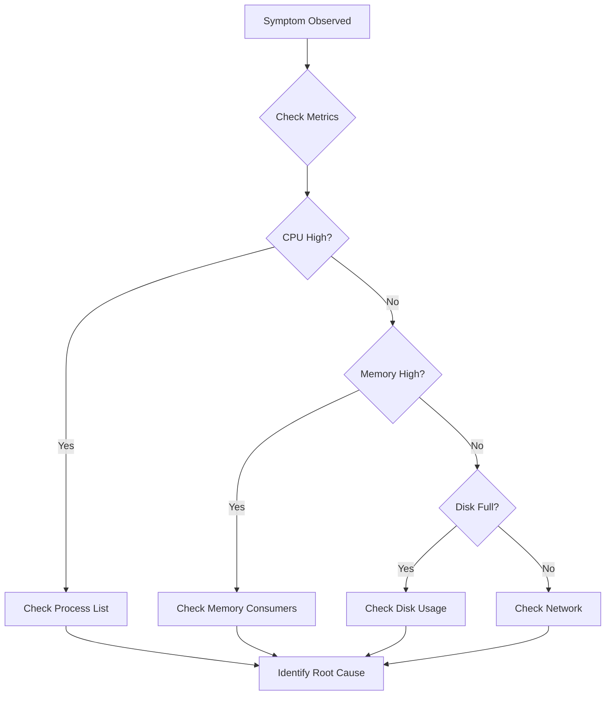
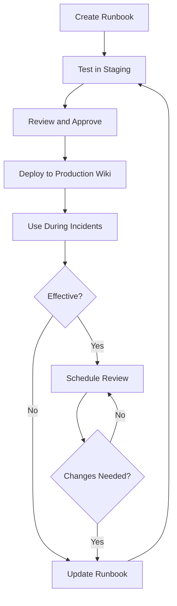

# How to Create Effective Runbooks

Author: [nawazdhandala](https://www.github.com/nawazdhandala)

Tags: SRE, Runbooks, Operations, Incident Management, Site Reliability Engineering, Documentation, DevOps

Description: A complete guide to creating runbooks that reduce incident response time, including templates, automation strategies, and real-world examples for common operational scenarios.

---

Every minute during an incident costs money, reputation, and team morale. Runbooks are your first line of defense against prolonged outages. They transform chaos into structured response, enabling any engineer to resolve issues quickly, even at 3 AM when the original system author is unavailable.

This guide walks you through creating runbooks that actually work. Not the kind that gather dust in a wiki, but living documents that your team reaches for during every incident.

## What is a Runbook?

A runbook is a documented procedure for completing a specific operational task. Unlike general documentation, runbooks are action-oriented. They guide an operator through a series of steps to achieve a defined outcome.


Runbooks differ from other documentation types:

| Document Type | Purpose | When Used |
|--------------|---------|-----------|
| Runbook | Step-by-step operational procedure | During incidents or routine operations |
| Playbook | Strategic guidance for scenarios | Planning and decision-making |
| Wiki Page | General knowledge and context | Learning and onboarding |
| README | Project overview and setup | Development and deployment |

## Types of Runbooks You Need

Organizations typically need runbooks in four categories.

### Diagnostic Runbooks

These help operators investigate and identify the root cause of an issue. They do not fix the problem directly but guide the investigation process.



### Remediation Runbooks

These provide specific steps to fix known issues. When an alert fires, the corresponding remediation runbook tells the operator exactly what to do.

### Deployment Runbooks

These guide operators through deployment procedures, rollbacks, and release verification. They are especially important for systems that cannot use fully automated deployments.

### Maintenance Runbooks

These cover routine operational tasks like certificate rotation, database maintenance, backup verification, and capacity planning procedures.

## Essential Components of Every Runbook

Every effective runbook contains these core sections. Consistency across runbooks helps operators find information quickly during high-pressure situations.

### Metadata Header

Start every runbook with essential metadata that helps operators quickly determine if they have the right document.

The following metadata header example shows the critical information every runbook needs at the top.

```yaml
---
title: Database Primary Failover
id: RB-DB-001
version: 2.3.0
last_updated: 2026-01-28
last_tested: 2026-01-15
owner: Database Team
slack_channel: "#database-incidents"
pagerduty_service: database-primary
estimated_duration: 15-30 minutes
risk_level: high
requires_approval: true
---
```

### Trigger Conditions

Clearly define when this runbook should be used. Include alert names, error messages, and observable symptoms.

The trigger conditions section helps operators quickly determine if this runbook matches their situation.

```markdown
## When to Use This Runbook

### Triggering Alerts
- `DatabasePrimaryUnreachable` - PagerDuty
- `ReplicationLagCritical` - Prometheus
- `ConnectionPoolExhausted` - Application logs

### Observable Symptoms
- Application returns 500 errors on write operations
- Read replicas show increasing replication lag
- Connection timeouts in application logs

### When NOT to Use
- If only read replicas are affected, see RB-DB-002
- If the issue is network-related, see RB-NET-001
- If this is a planned maintenance, see RB-DB-010
```

### Prerequisites

List everything the operator needs before starting. Access requirements, tools, and preliminary checks all belong here.

This prerequisite checklist ensures operators have everything needed before beginning the procedure.

```markdown
## Prerequisites

### Required Access
- [ ] SSH access to database servers (verify: `ssh db-primary-01.prod`)
- [ ] Database admin credentials (stored in Vault at `secret/database/admin`)
- [ ] Access to failover dashboard at https://internal.example.com/db-failover

### Required Tools
- [ ] psql client installed
- [ ] kubectl configured for production cluster
- [ ] Vault CLI authenticated

### Pre-Flight Checks
- [ ] Confirm incident channel is open: #database-incidents
- [ ] Notify incident commander: @oncall-ic
- [ ] Verify current replication status before proceeding
```

### Step-by-Step Procedure

This is the core of your runbook. Each step must be specific, executable, and verifiable.

The following example demonstrates how to structure individual steps with commands, expected output, and error handling.

```markdown
## Procedure

### Step 1: Assess Current State

Check the replication status on the primary database. This determines if failover is necessary.

Run this command to check replication health:

```bash
# Connect to primary and check replication status
psql -h db-primary-01.prod.internal -U admin -d postgres -c \
  "SELECT client_addr, state, sent_lsn, write_lsn,
   flush_lsn, replay_lsn,
   pg_wal_lsn_diff(sent_lsn, replay_lsn) AS replication_lag_bytes
   FROM pg_stat_replication;"
```

**Expected Output (Healthy):**
```
 client_addr  |   state   | replication_lag_bytes
--------------+-----------+----------------------
 10.0.1.52    | streaming |                 1024
 10.0.1.53    | streaming |                  512
```

**Expected Output (Problem):**
```
 client_addr  |   state    | replication_lag_bytes
--------------+------------+----------------------
 10.0.1.52    | catchup    |            104857600
 10.0.1.53    | startup    |                    0
```

**If replication_lag_bytes exceeds 100MB:** Proceed to Step 2.
**If all replicas show state='streaming' with low lag:** Investigate other causes before failover.

### Step 2: Initiate Controlled Failover

Stop writes to the primary to allow replicas to catch up.

Run this command to prevent new connections to the primary:

```bash
# Block new connections to primary
psql -h db-primary-01.prod.internal -U admin -d postgres -c \
  "ALTER SYSTEM SET max_connections = 0;"

# Reload configuration
psql -h db-primary-01.prod.internal -U admin -d postgres -c \
  "SELECT pg_reload_conf();"
```

**Expected Output:**
```
ALTER SYSTEM
 pg_reload_conf
----------------
 t
```

Wait 30 seconds for existing transactions to complete.

### Step 3: Promote Standby to Primary

Execute the promotion command on the standby server designated for failover.

SSH into the standby and run the promotion command:

```bash
# Connect to standby server
ssh admin@db-standby-01.prod.internal

# Promote standby to primary
sudo -u postgres pg_ctl promote -D /var/lib/postgresql/14/main
```

**Expected Output:**
```
waiting for server to promote.... done
server promoted
```

**If you see "server is not in standby mode":**
The server may have already been promoted. Verify with:

```bash
psql -c "SELECT pg_is_in_recovery();"
```

Returns `f` for primary, `t` for standby.
```

### Verification Steps

After completing the procedure, verify success with specific checks.

These verification steps confirm the procedure completed successfully and the system is functioning correctly.

```markdown
## Verification

### Immediate Verification (within 5 minutes)

1. **Verify new primary accepts writes:**

```bash
psql -h db-primary-02.prod.internal -U admin -d postgres -c \
  "CREATE TABLE failover_test_$(date +%s) (id int);
   DROP TABLE failover_test_$(date +%s);"
```

Expected: Query completes without error.

2. **Verify application connectivity:**

```bash
curl -s https://api.example.com/health | jq '.database'
```

Expected: `"status": "connected"`

3. **Verify monitoring shows healthy state:**

Check Grafana dashboard: https://grafana.example.com/d/database-health

### Extended Verification (within 30 minutes)

- [ ] Replication established to remaining standbys
- [ ] Application error rate returned to baseline
- [ ] No customer reports of data issues
```

### Escalation Paths

Define when and how to escalate if the runbook does not resolve the issue.

The escalation section ensures operators know when to seek additional help.

```markdown
## Escalation

### Escalate Immediately If:
- Failover does not complete within 30 minutes
- Data inconsistency detected between old and new primary
- Application cannot connect after successful failover
- Multiple standbys fail to reconnect

### Escalation Contacts:

| Condition | Contact | Method |
|-----------|---------|--------|
| Technical escalation | Database Team Lead | PagerDuty: database-leads |
| Business impact | VP Engineering | Slack: @vp-eng |
| Security concern | Security Team | PagerDuty: security-oncall |

### Information to Include When Escalating:
- Timestamp when procedure started
- Current step number
- Error messages encountered
- Actions already attempted
```

### Rollback Procedure

Every runbook that makes changes needs a rollback plan.

The rollback section provides steps to undo changes if the procedure causes additional problems.

```markdown
## Rollback

If failover causes additional issues, use this procedure to restore the previous primary.

**Warning:** Rollback may result in data loss for writes made to the new primary.

### Rollback Steps:

1. Stop the newly promoted primary:

```bash
ssh admin@db-primary-02.prod.internal
sudo systemctl stop postgresql
```

2. Restore connectivity to original primary:

```bash
ssh admin@db-primary-01.prod.internal
psql -U admin -d postgres -c "ALTER SYSTEM RESET max_connections;"
psql -U admin -d postgres -c "SELECT pg_reload_conf();"
```

3. Verify original primary accepts connections:

```bash
psql -h db-primary-01.prod.internal -U admin -c "SELECT 1;"
```

4. Update DNS or load balancer to point to original primary.
```

## Writing Clear and Actionable Steps

The quality of your runbook depends on how you write individual steps. Here are patterns that work.

### Use Imperative Voice

Tell the operator what to do, not what they might consider doing.

This example shows the difference between unclear and clear instruction writing.

```markdown
# Unclear
You may want to check the logs for any errors that might indicate the root cause.

# Clear
Check the application logs for errors. Run:
```bash
kubectl logs -l app=api-server --tail=100 --since=15m
```
```

### Include Expected Outputs

Every command should show what success and failure look like.

Including expected outputs helps operators verify they are on the right track.

```bash
# Check service health
systemctl status nginx
```

**Expected output (healthy):**
```
nginx.service - A high performance web server
   Loaded: loaded (/lib/systemd/system/nginx.service; enabled)
   Active: active (running) since Mon 2026-01-28 10:00:00 UTC
```

**Expected output (problem):**
```
nginx.service - A high performance web server
   Loaded: loaded (/lib/systemd/system/nginx.service; enabled)
   Active: failed (Result: exit-code) since Mon 2026-01-28 10:00:00 UTC
```

### Handle Edge Cases

Real incidents rarely follow the happy path. Document what to do when things go wrong.

Edge case handling prevents operators from getting stuck when unexpected situations occur.

```markdown
### If the service fails to start:

Check the nginx error log:

```bash
tail -50 /var/log/nginx/error.log
```

**Common errors and solutions:**

| Error | Cause | Solution |
|-------|-------|----------|
| "Address already in use" | Port 80 occupied | `sudo lsof -i :80` and stop conflicting process |
| "could not open error log file" | Permission issue | `sudo chown -R www-data:www-data /var/log/nginx` |
| "unknown directive" | Config syntax error | `nginx -t` to identify line number |
```

### Make Commands Copy-Paste Ready

Operators should be able to copy commands directly. Avoid placeholders that require mental substitution during an incident.

Commands should be ready to execute without modification during high-pressure incidents.

```markdown
# Instead of this:
ssh $USER@$SERVER

# Write this:
ssh admin@api-server-01.prod.internal

# Or if variables are necessary, define them explicitly:
```bash
# Set environment variables first
export ENV="prod"
export REGION="us-east-1"

# Then use them in commands
kubectl --context=${REGION}-${ENV} get pods -l app=api
```
```

## Creating Runbooks for Common Scenarios

Here are templates for runbooks you likely need.

### High CPU Usage Runbook Template

This diagnostic runbook helps operators identify the cause of high CPU usage.

```markdown
# High CPU Usage Investigation

## Metadata
- **ID:** RB-SYS-001
- **Last Updated:** 2026-01-28
- **Owner:** Platform Team

## Trigger
- Alert: `HighCPUUsage` (CPU > 80% for 5 minutes)
- Observable: System slowness, increased latency

## Procedure

### Step 1: Identify High CPU Processes

Connect to the affected host and identify CPU-heavy processes:

```bash
ssh admin@${HOSTNAME}
top -bn1 -o %CPU | head -20
```

**Expected output:** List of processes sorted by CPU usage.

### Step 2: Check for Known CPU-Intensive Operations

Verify if any expected operations are running:

```bash
# Check for running backups
pgrep -a backup

# Check for batch jobs
systemctl status batch-processor
```

### Step 3: Analyze Process Behavior

For the top CPU-consuming process, gather details:

```bash
# Get process details
ps aux | grep ${PID}

# Check open files
lsof -p ${PID} | head -50

# Check process threads
ps -T -p ${PID}
```

### Step 4: Determine Action

Based on findings:

| Finding | Action |
|---------|--------|
| Backup running | Wait for completion or reschedule |
| Runaway process | Restart the service (see step 5) |
| Legitimate load | Scale horizontally |
| Unknown process | Escalate to security |

### Step 5: Restart Service (if needed)

```bash
sudo systemctl restart ${SERVICE_NAME}
```

Verify service health:

```bash
systemctl status ${SERVICE_NAME}
```
```

### Service Deployment Runbook Template

This deployment runbook guides operators through a controlled service deployment.

```markdown
# Service Deployment Runbook

## Metadata
- **ID:** RB-DEP-001
- **Last Updated:** 2026-01-28
- **Owner:** DevOps Team
- **Risk Level:** Medium

## Prerequisites

- [ ] Change approved in change management system
- [ ] Deployment window confirmed
- [ ] Rollback plan verified
- [ ] Monitoring dashboards ready

## Pre-Deployment Checks

### Step 1: Verify Current State

Record current version and health:

```bash
kubectl get deployment api-server -o jsonpath='{.spec.template.spec.containers[0].image}'
```

Check current pod health:

```bash
kubectl get pods -l app=api-server
```

**All pods should show Running and Ready.**

### Step 2: Verify New Image

Confirm the new image exists and is scannable:

```bash
# Check image exists
docker manifest inspect registry.example.com/api-server:${NEW_VERSION}

# Check vulnerability scan passed
curl -s https://harbor.example.com/api/v2.0/projects/api/repositories/api-server/artifacts/${NEW_VERSION}/scan | jq '.severity'
```

## Deployment Procedure

### Step 3: Update Deployment

Apply the new deployment configuration:

```bash
kubectl set image deployment/api-server \
  api-server=registry.example.com/api-server:${NEW_VERSION} \
  --record
```

### Step 4: Monitor Rollout

Watch the rollout progress:

```bash
kubectl rollout status deployment/api-server --timeout=300s
```

**Expected output:**
```
deployment "api-server" successfully rolled out
```

### Step 5: Verify New Version

Confirm pods are running the new version:

```bash
kubectl get pods -l app=api-server -o jsonpath='{.items[*].spec.containers[0].image}'
```

## Post-Deployment Verification

### Step 6: Health Checks

```bash
# Check endpoint health
curl -s https://api.example.com/health | jq '.'

# Check error rate
curl -s "https://prometheus.example.com/api/v1/query?query=rate(http_requests_total{status=~'5..'}[5m])" | jq '.data.result[0].value[1]'
```

**Error rate should be below 0.01 (1%).**

## Rollback

If issues are detected:

```bash
kubectl rollout undo deployment/api-server
kubectl rollout status deployment/api-server --timeout=300s
```
```

### Certificate Rotation Runbook Template

This maintenance runbook guides operators through TLS certificate rotation.

```markdown
# TLS Certificate Rotation

## Metadata
- **ID:** RB-SEC-001
- **Last Updated:** 2026-01-28
- **Owner:** Security Team
- **Risk Level:** High
- **Requires Approval:** Yes

## Trigger
- Alert: `CertificateExpiringSoon` (< 30 days to expiration)
- Scheduled: Quarterly rotation

## Prerequisites

- [ ] New certificate obtained from CA
- [ ] Certificate chain validated
- [ ] Change window approved
- [ ] Rollback certificate available

## Pre-Rotation Checks

### Step 1: Verify New Certificate

Validate the new certificate:

```bash
# Check certificate dates
openssl x509 -in new-cert.pem -noout -dates

# Verify certificate chain
openssl verify -CAfile ca-bundle.pem new-cert.pem

# Check certificate matches private key
openssl x509 -noout -modulus -in new-cert.pem | md5sum
openssl rsa -noout -modulus -in new-key.pem | md5sum
```

**Both md5sums must match.**

## Rotation Procedure

### Step 2: Backup Current Certificate

```bash
kubectl get secret tls-certificate -o yaml > tls-certificate-backup-$(date +%Y%m%d).yaml
```

### Step 3: Update Kubernetes Secret

```bash
kubectl create secret tls tls-certificate \
  --cert=new-cert.pem \
  --key=new-key.pem \
  --dry-run=client -o yaml | kubectl apply -f -
```

### Step 4: Reload Ingress Controller

```bash
kubectl rollout restart deployment/ingress-nginx-controller -n ingress-nginx
kubectl rollout status deployment/ingress-nginx-controller -n ingress-nginx
```

## Verification

### Step 5: Verify Certificate in Use

```bash
echo | openssl s_client -connect api.example.com:443 -servername api.example.com 2>/dev/null | openssl x509 -noout -dates
```

**Not After date should match new certificate.**

## Rollback

If issues occur:

```bash
kubectl apply -f tls-certificate-backup-$(date +%Y%m%d).yaml
kubectl rollout restart deployment/ingress-nginx-controller -n ingress-nginx
```
```

## Automating Runbook Execution

While runbooks start as documentation, many can be partially or fully automated. The key is progressive automation.


### Level 1: Documented Commands

Start with runbooks that contain copy-paste commands. This is better than having no documentation.

### Level 2: Script Collection

Package related commands into scripts that operators can run.

This script collects diagnostic information for the database team.

```bash
#!/bin/bash
# db-diagnostics.sh - Collect database diagnostic information

set -e

echo "=== Database Diagnostics ==="
echo "Timestamp: $(date -u +%Y-%m-%dT%H:%M:%SZ)"
echo ""

echo "=== Replication Status ==="
psql -h $DB_HOST -U admin -d postgres -c \
  "SELECT client_addr, state, sent_lsn, replay_lsn FROM pg_stat_replication;"

echo ""
echo "=== Connection Statistics ==="
psql -h $DB_HOST -U admin -d postgres -c \
  "SELECT state, count(*) FROM pg_stat_activity GROUP BY state;"

echo ""
echo "=== Long Running Queries ==="
psql -h $DB_HOST -U admin -d postgres -c \
  "SELECT pid, now() - pg_stat_activity.query_start AS duration, query
   FROM pg_stat_activity
   WHERE (now() - pg_stat_activity.query_start) > interval '5 minutes'
   AND state != 'idle';"

echo ""
echo "=== Disk Usage ==="
psql -h $DB_HOST -U admin -d postgres -c \
  "SELECT pg_size_pretty(pg_database_size(current_database())) as db_size;"
```

### Level 3: Orchestrated Workflow

Connect scripts into workflows with proper error handling and notifications.

This Python script orchestrates the database failover workflow with proper error handling and notifications.

```python
#!/usr/bin/env python3
"""
Database Failover Orchestrator

This script automates the database failover process with proper
error handling, notifications, and audit logging.
"""

import subprocess
import logging
import sys
from datetime import datetime
from typing import Tuple

# Configure logging to capture all operations for audit purposes
logging.basicConfig(
    level=logging.INFO,
    format='%(asctime)s - %(levelname)s - %(message)s',
    handlers=[
        logging.FileHandler(f'/var/log/failover/failover-{datetime.now().strftime("%Y%m%d-%H%M%S")}.log'),
        logging.StreamHandler()
    ]
)
logger = logging.getLogger(__name__)

class DatabaseFailover:
    """
    Manages database failover operations with proper validation
    and rollback capabilities.
    """

    def __init__(self, primary_host: str, standby_host: str):
        """
        Initialize the failover handler with primary and standby hosts.

        Args:
            primary_host: Current primary database hostname
            standby_host: Standby database to promote
        """
        self.primary_host = primary_host
        self.standby_host = standby_host
        self.rollback_steps = []

    def check_prerequisites(self) -> bool:
        """
        Verify all prerequisites are met before starting failover.
        Returns True if all checks pass, False otherwise.
        """
        logger.info("Checking prerequisites...")

        # Verify connectivity to both hosts
        checks = [
            self._check_host_connectivity(self.primary_host),
            self._check_host_connectivity(self.standby_host),
            self._check_replication_status(),
        ]

        return all(checks)

    def _check_host_connectivity(self, host: str) -> bool:
        """
        Verify SSH connectivity to a database host.
        """
        try:
            result = subprocess.run(
                ['ssh', '-o', 'ConnectTimeout=5', f'admin@{host}', 'echo ok'],
                capture_output=True,
                text=True,
                timeout=10
            )
            if result.returncode == 0:
                logger.info(f"Connectivity to {host}: OK")
                return True
            else:
                logger.error(f"Cannot connect to {host}: {result.stderr}")
                return False
        except subprocess.TimeoutExpired:
            logger.error(f"Connection to {host} timed out")
            return False

    def _check_replication_status(self) -> bool:
        """
        Verify replication is functioning before failover.
        """
        logger.info("Checking replication status...")
        # Implementation details omitted for brevity
        return True

    def execute_failover(self) -> Tuple[bool, str]:
        """
        Execute the complete failover procedure.

        Returns:
            Tuple of (success: bool, message: str)
        """
        if not self.check_prerequisites():
            return False, "Prerequisites check failed"

        try:
            # Step 1: Block new connections
            logger.info("Step 1: Blocking new connections to primary")
            self._block_connections()
            self.rollback_steps.append(self._unblock_connections)

            # Step 2: Wait for transactions to complete
            logger.info("Step 2: Waiting for transactions to complete")
            self._wait_for_transactions()

            # Step 3: Promote standby
            logger.info("Step 3: Promoting standby to primary")
            self._promote_standby()

            # Step 4: Update DNS
            logger.info("Step 4: Updating DNS records")
            self._update_dns()

            # Step 5: Verify
            logger.info("Step 5: Verifying failover success")
            if self._verify_failover():
                logger.info("Failover completed successfully")
                return True, "Failover completed successfully"
            else:
                raise Exception("Failover verification failed")

        except Exception as e:
            logger.error(f"Failover failed: {e}")
            self._execute_rollback()
            return False, f"Failover failed: {e}"

    def _execute_rollback(self):
        """
        Execute rollback steps in reverse order.
        """
        logger.warning("Executing rollback...")
        for step in reversed(self.rollback_steps):
            try:
                step()
            except Exception as e:
                logger.error(f"Rollback step failed: {e}")

    # Additional helper methods would be implemented here
    def _block_connections(self): pass
    def _unblock_connections(self): pass
    def _wait_for_transactions(self): pass
    def _promote_standby(self): pass
    def _update_dns(self): pass
    def _verify_failover(self) -> bool: return True


if __name__ == "__main__":
    if len(sys.argv) != 3:
        print("Usage: failover.py <primary_host> <standby_host>")
        sys.exit(1)

    failover = DatabaseFailover(sys.argv[1], sys.argv[2])
    success, message = failover.execute_failover()

    if success:
        print(f"SUCCESS: {message}")
        sys.exit(0)
    else:
        print(f"FAILED: {message}")
        sys.exit(1)
```

### Level 4: Self-Healing Automation

The final level integrates automated remediation with your monitoring system.

This Kubernetes operator watches for specific conditions and automatically executes remediation.

```yaml
# Example: Kubernetes operator for automatic remediation
apiVersion: monitoring.coreos.com/v1
kind: PrometheusRule
metadata:
  name: auto-remediation-rules
spec:
  groups:
    - name: auto-remediation
      rules:
        # This rule triggers automatic pod restart when memory exceeds threshold
        - alert: HighMemoryUsage
          expr: |
            container_memory_usage_bytes / container_spec_memory_limit_bytes > 0.9
          for: 5m
          labels:
            severity: warning
            # This label triggers the remediation controller
            auto_remediate: "restart-pod"
          annotations:
            summary: "Container memory usage above 90%"
            runbook_url: "https://runbooks.example.com/RB-K8S-001"
```

## Runbook Lifecycle Management

Creating runbooks is only the beginning. Keeping them accurate requires ongoing effort.



### Testing Runbooks

Untested runbooks are unreliable. Build testing into your workflow.

**Game Days:** Schedule monthly sessions where the team executes runbooks against intentionally broken staging environments.

**New Engineer Validation:** Have new team members follow runbooks during onboarding. Fresh eyes catch unclear instructions.

**Chaos Engineering:** When you inject failures in chaos experiments, the corresponding runbook should resolve them.

### Maintaining Currency

Systems change, but documentation often does not. Use these strategies to keep runbooks current.

**Change-Triggered Reviews:** When infrastructure changes, flag affected runbooks for review.

This CI/CD configuration example automatically flags runbooks when related infrastructure changes.

```yaml
# .github/workflows/runbook-review.yml
name: Flag Runbook Reviews

on:
  push:
    paths:
      - 'terraform/**'
      - 'kubernetes/**'

jobs:
  check-runbooks:
    runs-on: ubuntu-latest
    steps:
      - uses: actions/checkout@v4

      - name: Check for affected runbooks
        run: |
          # Map infrastructure paths to runbook IDs
          CHANGED_PATHS=$(git diff --name-only HEAD~1)

          if echo "$CHANGED_PATHS" | grep -q "terraform/database"; then
            echo "Database infrastructure changed"
            echo "Review needed: RB-DB-001, RB-DB-002, RB-DB-003"
            # Create review ticket or send notification
          fi

          if echo "$CHANGED_PATHS" | grep -q "kubernetes/ingress"; then
            echo "Ingress configuration changed"
            echo "Review needed: RB-NET-001, RB-SEC-001"
          fi
```

**Post-Incident Reviews:** After every incident where a runbook was used, ask:

- Did the runbook help resolve the incident?
- Were any steps unclear or outdated?
- Did we discover steps that should be added?

**Scheduled Reviews:** Even without changes, review runbooks quarterly. Add ownership and review dates to your metadata.

## Runbook Repository Organization

As your runbook collection grows, organization becomes critical.

### Naming Conventions

Use consistent naming that sorts logically and indicates purpose.

```
{service}-{action}-{scope}.md

Examples:
database-failover-primary.md
database-recovery-replica.md
kubernetes-restart-deployment.md
kubernetes-scale-nodes.md
network-troubleshoot-connectivity.md
security-rotate-certificates.md
```

### Directory Structure

Organize runbooks by service or function.

```
runbooks/
  database/
    RB-DB-001-primary-failover.md
    RB-DB-002-replica-recovery.md
    RB-DB-003-backup-restore.md
  kubernetes/
    RB-K8S-001-pod-restart.md
    RB-K8S-002-node-drain.md
    RB-K8S-003-cluster-upgrade.md
  network/
    RB-NET-001-connectivity.md
    RB-NET-002-dns-issues.md
  security/
    RB-SEC-001-certificate-rotation.md
    RB-SEC-002-credential-rotation.md
  _templates/
    diagnostic-template.md
    remediation-template.md
    deployment-template.md
```

### Searchability

Make runbooks findable by including symptoms and error messages.

This keywords section helps operators find the right runbook when searching for error messages.

```markdown
## Keywords and Search Terms

### Alert Names
- DatabasePrimaryUnreachable
- ReplicationLagCritical
- ConnectionPoolExhausted

### Error Messages
- "FATAL: the database system is not yet accepting connections"
- "could not connect to server: Connection refused"
- "psql: error: connection to server failed"
- "remaining connection slots are reserved"

### Symptoms
- Write operations failing
- Increased latency on read operations
- Application 500 errors
- Connection timeouts
```

## Getting Started

You do not need perfect runbooks on day one. Start with impact.

1. **List your top 5 incidents** from the past quarter
2. **Create a runbook** for each incident type
3. **Test each runbook** the next time that incident occurs
4. **Iterate** based on what worked and what did not

A simple runbook that works is better than a comprehensive one that does not exist.

The goal is not documentation for its own sake. The goal is faster incident resolution with less stress. Build runbooks that serve that purpose, and your on-call engineers will thank you at 3 AM.

## Conclusion

Effective runbooks are a cornerstone of operational excellence. They reduce mean time to resolution, decrease stress during incidents, and enable knowledge sharing across your team. By following the structure and practices outlined in this guide, you can create runbooks that your team will actually use.

Remember these key principles:

- **Be specific:** Every step should tell the operator exactly what to do
- **Include verification:** Show what success and failure look like
- **Plan for failure:** Include rollback procedures and edge case handling
- **Keep them current:** Test regularly and update after every use
- **Automate progressively:** Move from documentation to scripts to self-healing

Start small, iterate based on real-world usage, and build a runbook library that makes incidents manageable rather than chaotic.
