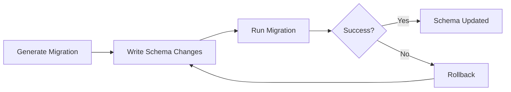
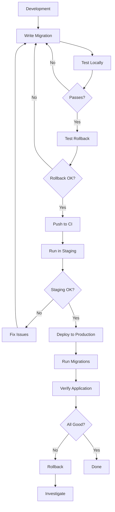

# How to Handle Database Migrations with Ecto

Author: [nawazdhandala](https://www.github.com/nawazdhandala)

Tags: Elixir, Ecto, Database, Migrations, PostgreSQL

Description: Learn how to create, run, and manage database migrations in Elixir applications using Ecto, including rollbacks, data migrations, and production deployment strategies.

---

> Database migrations are the backbone of schema evolution in any serious application. Ecto makes migrations straightforward, but there are plenty of gotchas when you're deploying to production. This guide covers everything from basic migrations to advanced patterns for zero-downtime deployments.

If you're building Elixir applications with Ecto, you'll spend a lot of time working with migrations. Getting them right means smooth deployments. Getting them wrong means 3 AM phone calls and angry customers.

---

## Understanding Ecto Migrations

Ecto migrations are Elixir modules that define changes to your database schema. Each migration has a unique timestamp and contains `up` and `down` functions (or a single `change` function that handles both).



### Migration Lifecycle

| Phase | Command | Description |
|-------|---------|-------------|
| Create | `mix ecto.gen.migration` | Generate a new migration file |
| Run | `mix ecto.migrate` | Apply pending migrations |
| Rollback | `mix ecto.rollback` | Revert the last migration |
| Status | `mix ecto.migrations` | Check migration status |

---

## Creating Your First Migration

Generate a new migration using the Mix task. This creates a timestamped file in your `priv/repo/migrations` directory.

```bash
# Generate a migration to create a users table
mix ecto.gen.migration create_users
```

This creates a file like `priv/repo/migrations/20260202120000_create_users.exs`. Open it and define your schema changes.

```elixir
# priv/repo/migrations/20260202120000_create_users.exs
# Migration to create the users table with common fields
defmodule MyApp.Repo.Migrations.CreateUsers do
  use Ecto.Migration

  def change do
    # The change/0 function handles both up and down migrations
    # Ecto can automatically reverse most operations
    create table(:users) do
      add :email, :string, null: false
      add :name, :string
      add :password_hash, :string
      add :role, :string, default: "user"
      add :active, :boolean, default: true

      # Adds inserted_at and updated_at timestamp columns
      timestamps()
    end

    # Create a unique index on email for fast lookups and constraint
    create unique_index(:users, [:email])

    # Create an index on role for common query patterns
    create index(:users, [:role])
  end
end
```

---

## Using Up and Down Functions

For more complex migrations where Ecto can't automatically determine the reverse operation, use explicit `up` and `down` functions.

```elixir
# priv/repo/migrations/20260202130000_add_user_metadata.exs
# Migration that requires explicit up/down for custom SQL
defmodule MyApp.Repo.Migrations.AddUserMetadata do
  use Ecto.Migration

  def up do
    # Add a JSONB column for flexible metadata storage
    alter table(:users) do
      add :metadata, :map, default: %{}
    end

    # Create a GIN index for efficient JSONB queries
    # This index type is PostgreSQL-specific
    execute """
    CREATE INDEX users_metadata_gin_idx ON users USING GIN (metadata)
    """

    # Backfill existing rows with empty metadata
    execute """
    UPDATE users SET metadata = '{}' WHERE metadata IS NULL
    """
  end

  def down do
    # Remove the GIN index first
    execute """
    DROP INDEX IF EXISTS users_metadata_gin_idx
    """

    # Then remove the column
    alter table(:users) do
      remove :metadata
    end
  end
end
```

---

## Common Migration Operations

### Adding and Removing Columns

When adding columns to existing tables, always consider default values and null constraints carefully. Adding a non-nullable column without a default will fail if the table has existing rows.

```elixir
# priv/repo/migrations/20260202140000_add_profile_fields.exs
# Add multiple columns to an existing table
defmodule MyApp.Repo.Migrations.AddProfileFields do
  use Ecto.Migration

  def change do
    alter table(:users) do
      # Add nullable column - safe for existing rows
      add :bio, :text

      # Add with default - also safe for existing rows
      add :notification_preferences, :map, default: %{email: true, sms: false}

      # Add a foreign key reference
      add :organization_id, references(:organizations, on_delete: :nilify_all)
    end

    # Index the foreign key for join performance
    create index(:users, [:organization_id])
  end
end
```

### Creating Tables with References

When creating tables with foreign keys, define the relationship clearly and specify what happens on delete.

```elixir
# priv/repo/migrations/20260202150000_create_posts.exs
# Create a posts table with user relationship
defmodule MyApp.Repo.Migrations.CreatePosts do
  use Ecto.Migration

  def change do
    create table(:posts) do
      add :title, :string, null: false
      add :body, :text
      add :slug, :string, null: false
      add :published_at, :utc_datetime
      add :view_count, :integer, default: 0

      # Foreign key to users - delete posts when user is deleted
      add :author_id, references(:users, on_delete: :delete_all), null: false

      timestamps()
    end

    # Unique constraint on slug for URL-friendly identifiers
    create unique_index(:posts, [:slug])

    # Composite index for common query: published posts by author
    create index(:posts, [:author_id, :published_at])

    # Partial index for only published posts - smaller and faster
    create index(:posts, [:published_at],
      where: "published_at IS NOT NULL",
      name: :posts_published_at_partial_idx
    )
  end
end
```

### Working with Enums

PostgreSQL enums provide type safety at the database level. Create them in migrations for columns with a fixed set of values.

```elixir
# priv/repo/migrations/20260202160000_add_post_status.exs
# Create a PostgreSQL enum type and use it in a column
defmodule MyApp.Repo.Migrations.AddPostStatus do
  use Ecto.Migration

  def up do
    # Create the enum type first
    execute """
    CREATE TYPE post_status AS ENUM ('draft', 'review', 'published', 'archived')
    """

    # Add the column using the enum type
    alter table(:posts) do
      add :status, :post_status, default: "draft", null: false
    end

    # Index for filtering by status
    create index(:posts, [:status])
  end

  def down do
    alter table(:posts) do
      remove :status
    end

    # Drop the enum type after removing the column
    execute "DROP TYPE post_status"
  end
end
```

---

## Data Migrations

Sometimes you need to migrate data, not just schema. Use Ecto queries directly in migrations, but be careful with large datasets.

```elixir
# priv/repo/migrations/20260202170000_split_name_field.exs
# Split the name field into first_name and last_name
defmodule MyApp.Repo.Migrations.SplitNameField do
  use Ecto.Migration

  # Import Ecto.Query for data manipulation
  import Ecto.Query

  def up do
    # Add the new columns first
    alter table(:users) do
      add :first_name, :string
      add :last_name, :string
    end

    # Flush to ensure the columns exist before we use them
    flush()

    # Migrate data in batches to avoid memory issues
    # Use raw SQL for better performance on large tables
    execute """
    UPDATE users
    SET
      first_name = split_part(name, ' ', 1),
      last_name = CASE
        WHEN position(' ' in name) > 0
        THEN substring(name from position(' ' in name) + 1)
        ELSE NULL
      END
    WHERE name IS NOT NULL
    """

    # Now we can safely remove the old column
    alter table(:users) do
      remove :name
    end
  end

  def down do
    # Add the old column back
    alter table(:users) do
      add :name, :string
    end

    flush()

    # Combine first and last name back into name
    execute """
    UPDATE users
    SET name = CONCAT_WS(' ', first_name, last_name)
    """

    # Remove the new columns
    alter table(:users) do
      remove :first_name
      remove :last_name
    end
  end
end
```

---

## Safe Migrations for Production

Running migrations in production requires extra care. Here are patterns for zero-downtime deployments.

### Adding Columns Safely

Never add a column with a non-null constraint and no default in one migration. Split it into multiple steps.

```elixir
# Step 1: Add the column as nullable
# priv/repo/migrations/20260202180000_add_subscription_tier_step1.exs
defmodule MyApp.Repo.Migrations.AddSubscriptionTierStep1 do
  use Ecto.Migration

  def change do
    alter table(:users) do
      # Add as nullable first - this is safe
      add :subscription_tier, :string
    end
  end
end
```

```elixir
# Step 2: Backfill existing data (run after deploying step 1)
# priv/repo/migrations/20260202180100_add_subscription_tier_step2.exs
defmodule MyApp.Repo.Migrations.AddSubscriptionTierStep2 do
  use Ecto.Migration

  def up do
    # Backfill in batches for large tables
    execute """
    UPDATE users
    SET subscription_tier = 'free'
    WHERE subscription_tier IS NULL
    """
  end

  def down do
    # Nothing to reverse - data migration only
    :ok
  end
end
```

```elixir
# Step 3: Add the constraint (run after step 2 is verified)
# priv/repo/migrations/20260202180200_add_subscription_tier_step3.exs
defmodule MyApp.Repo.Migrations.AddSubscriptionTierStep3 do
  use Ecto.Migration

  def up do
    # Now safe to add the not-null constraint
    alter table(:users) do
      modify :subscription_tier, :string, null: false, default: "free"
    end
  end

  def down do
    alter table(:users) do
      modify :subscription_tier, :string, null: true, default: nil
    end
  end
end
```

### Adding Indexes Concurrently

Large tables can lock during index creation. Use PostgreSQL's concurrent index creation to avoid blocking writes.

```elixir
# priv/repo/migrations/20260202190000_add_search_index.exs
# Add an index concurrently to avoid table locks
defmodule MyApp.Repo.Migrations.AddSearchIndex do
  use Ecto.Migration

  # Disable DDL transactions - required for concurrent index creation
  @disable_ddl_transaction true
  @disable_migration_lock true

  def up do
    # CONCURRENTLY prevents locking the table during index creation
    # This is essential for large production tables
    execute """
    CREATE INDEX CONCURRENTLY IF NOT EXISTS posts_search_idx
    ON posts USING GIN (to_tsvector('english', title || ' ' || body))
    """
  end

  def down do
    # Also drop concurrently to avoid locks
    execute """
    DROP INDEX CONCURRENTLY IF EXISTS posts_search_idx
    """
  end
end
```

---

## Running Migrations

### Development

In development, run migrations directly with Mix.

```bash
# Run all pending migrations
mix ecto.migrate

# Rollback the last migration
mix ecto.rollback

# Rollback multiple migrations
mix ecto.rollback --step 3

# Check migration status
mix ecto.migrations

# Reset the database (drop, create, migrate)
mix ecto.reset
```

### Production with Releases

In production releases, use the release commands or run migrations programmatically.

```elixir
# lib/my_app/release.ex
# Module for running migrations in production releases
defmodule MyApp.Release do
  @moduledoc """
  Release tasks for database management.
  Run with: bin/my_app eval "MyApp.Release.migrate()"
  """

  @app :my_app

  def migrate do
    # Load the application without starting it
    load_app()

    # Get the list of repos from config
    for repo <- repos() do
      # Run all pending migrations
      {:ok, _, _} = Ecto.Migrator.with_repo(repo, &Ecto.Migrator.run(&1, :up, all: true))
    end
  end

  def rollback(repo, version) do
    load_app()
    {:ok, _, _} = Ecto.Migrator.with_repo(repo, &Ecto.Migrator.run(&1, :down, to: version))
  end

  defp repos do
    Application.fetch_env!(@app, :ecto_repos)
  end

  defp load_app do
    Application.load(@app)
  end
end
```

Run migrations in production:

```bash
# Using the release binary
bin/my_app eval "MyApp.Release.migrate()"

# Or with a startup script
#!/bin/bash
bin/my_app eval "MyApp.Release.migrate()"
bin/my_app start
```

---

## Migration Best Practices

### 1. Always Test Rollbacks

Before deploying, verify that your migration can be rolled back cleanly.

```bash
# Run migration
mix ecto.migrate

# Test rollback
mix ecto.rollback

# Run again to verify
mix ecto.migrate
```

### 2. Keep Migrations Small and Focused

Each migration should do one logical thing. This makes rollbacks safer and debugging easier.

```elixir
# Good: One focused migration
defmodule MyApp.Repo.Migrations.AddUserEmailVerification do
  use Ecto.Migration

  def change do
    alter table(:users) do
      add :email_verified, :boolean, default: false
      add :email_verification_token, :string
      add :email_verified_at, :utc_datetime
    end

    create index(:users, [:email_verification_token])
  end
end
```

### 3. Use Timestamps Consistently

Always use UTC timestamps for consistency across time zones.

```elixir
# In your migration
timestamps(type: :utc_datetime)

# Or with microseconds for high precision
timestamps(type: :utc_datetime_usec)
```

### 4. Document Complex Migrations

Add comments explaining why a migration is structured a certain way, especially for production safety patterns.

```elixir
defmodule MyApp.Repo.Migrations.RefactorUserSettings do
  use Ecto.Migration

  @moduledoc """
  This migration splits user settings into a separate table.

  Deployment steps:
  1. Deploy with this migration (creates new table)
  2. Deploy code that writes to both old and new locations
  3. Run backfill script (separate from migration)
  4. Deploy code that reads from new location
  5. Deploy migration to remove old columns
  """

  def change do
    # Migration code here
  end
end
```

### 5. Handle Large Data Carefully

For tables with millions of rows, batch your updates to avoid long-running transactions.

```elixir
# priv/repo/migrations/20260202200000_backfill_user_slugs.exs
# Backfill slugs in batches for large tables
defmodule MyApp.Repo.Migrations.BackfillUserSlugs do
  use Ecto.Migration

  def up do
    # Process in batches of 10,000 rows
    execute """
    DO $$
    DECLARE
      batch_size INTEGER := 10000;
      affected INTEGER;
    BEGIN
      LOOP
        UPDATE users
        SET slug = lower(replace(name, ' ', '-'))
        WHERE id IN (
          SELECT id FROM users
          WHERE slug IS NULL
          LIMIT batch_size
          FOR UPDATE SKIP LOCKED
        );

        GET DIAGNOSTICS affected = ROW_COUNT;
        EXIT WHEN affected = 0;

        -- Commit each batch
        COMMIT;
      END LOOP;
    END $$;
    """
  end

  def down do
    execute "UPDATE users SET slug = NULL"
  end
end
```

---

## Migration Workflow Diagram



---

## Troubleshooting Common Issues

### Migration Already Run

If you see "migration already run" but the schema doesn't match:

```bash
# Check the schema_migrations table
psql -d my_app_dev -c "SELECT * FROM schema_migrations ORDER BY version"

# If needed, manually remove a migration record (use with caution!)
psql -d my_app_dev -c "DELETE FROM schema_migrations WHERE version = 20260202120000"
```

### Lock Timeout

If migrations hang, another process might be holding a lock:

```sql
-- Check for blocking queries
SELECT pid, state, query, wait_event_type, wait_event
FROM pg_stat_activity
WHERE state != 'idle';

-- Terminate a blocking process (use with caution!)
SELECT pg_terminate_backend(pid);
```

### Column Already Exists

Use `if_not_exists` to make migrations idempotent:

```elixir
def change do
  alter table(:users) do
    # This won't fail if column already exists
    add_if_not_exists :new_column, :string
  end

  # For indexes
  create_if_not_exists index(:users, [:new_column])
end
```

---

## Conclusion

Ecto migrations provide a powerful way to evolve your database schema alongside your application code. The key takeaways:

- Use `change/0` for simple, reversible migrations
- Use `up/0` and `down/0` for complex migrations that need explicit rollback logic
- Split risky changes into multiple smaller migrations
- Always test rollbacks before deploying
- Use concurrent index creation for large production tables
- Batch data migrations to avoid long-running transactions

With these patterns, you can confidently deploy database changes without downtime or data loss.

---

*Need to monitor your Elixir application's database performance? [OneUptime](https://oneuptime.com) provides comprehensive monitoring with OpenTelemetry integration, helping you track migration performance and catch database issues before they impact users.*
