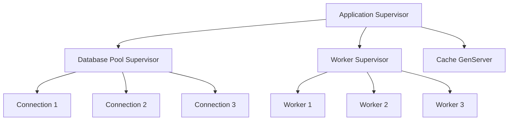
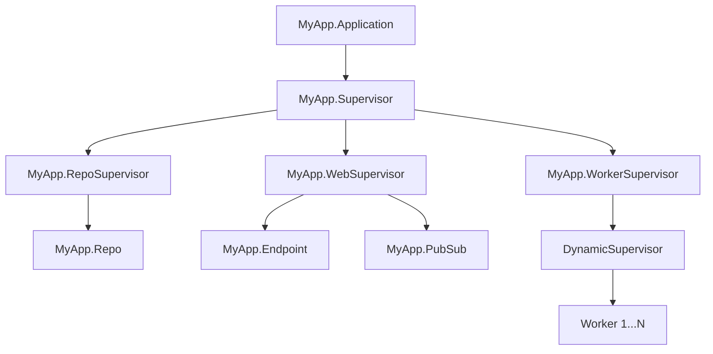

# How to Use Supervisors for Fault Tolerance

Author: [nawazdhandala](https://www.github.com/nawazdhandala)

Tags: Elixir, Supervisors, OTP, Fault Tolerance, Resilience

Description: Learn how to build self-healing Elixir applications using OTP Supervisors with practical examples of supervision strategies, restart policies, and process hierarchies.

---

One of the biggest selling points of Elixir and Erlang is their approach to fault tolerance: "let it crash." Instead of writing defensive code that tries to handle every possible error, you let processes fail and rely on Supervisors to restart them automatically. This philosophy has powered telecom systems with nine-nines uptime for decades.

Let's explore how to use Supervisors effectively in your Elixir applications.

## What Is a Supervisor?

A Supervisor is a specialized process that monitors other processes (called children). When a child process crashes, the Supervisor detects it and restarts it according to a defined strategy. This creates self-healing systems where temporary failures don't bring down your entire application.

The following diagram shows a typical supervision tree structure:



## Creating a Basic Supervisor

The simplest way to create a Supervisor is using the `Supervisor` module. This example defines a supervisor that manages a single GenServer worker. The `start_link/1` function initializes the supervisor, and `init/1` configures which children to supervise.

```elixir
defmodule MyApp.Supervisor do
  # Use the Supervisor behaviour to get supervision capabilities
  use Supervisor

  # Public API to start the supervisor process
  # This function is typically called from your application's start callback
  def start_link(opts) do
    Supervisor.start_link(__MODULE__, opts, name: __MODULE__)
  end

  # Callback that defines which children this supervisor manages
  # The supervisor calls this when it starts up
  @impl true
  def init(_opts) do
    # Define the list of child processes to supervise
    children = [
      # Each child spec tells the supervisor how to start and manage the process
      {MyApp.Worker, []},
      {MyApp.Cache, [name: MyApp.Cache]}
    ]

    # Start children in order and restart them according to :one_for_one strategy
    # :one_for_one means if one child crashes, only that child is restarted
    Supervisor.init(children, strategy: :one_for_one)
  end
end
```

## Understanding Supervision Strategies

Elixir provides four supervision strategies, each suited for different scenarios. Picking the right one depends on whether your child processes are independent or have dependencies between them.

| Strategy | Behavior | Best For |
|----------|----------|----------|
| `:one_for_one` | Only restart the crashed child | Independent workers with no shared state |
| `:one_for_all` | Restart all children when one crashes | Tightly coupled processes that depend on each other |
| `:rest_for_one` | Restart the crashed child and all children started after it | Sequential dependencies (e.g., producer before consumer) |
| `:simple_one_for_one` | Deprecated, use DynamicSupervisor | Dynamic pools of identical workers |

### One-for-One Strategy

Use this when children are completely independent. If your web scrapers each handle different URLs, one crashing shouldn't affect the others.

```elixir
# One-for-one is ideal when children don't depend on each other
# A database pool and a cache can restart independently
Supervisor.init(children, strategy: :one_for_one)
```

### One-for-All Strategy

When children share state or have circular dependencies, use `:one_for_all`. If one fails, the others likely have corrupted state too.

This example shows a trading system where the order book, risk calculator, and trade executor must stay in sync. If any one fails, restarting all three ensures consistent state.

```elixir
defmodule TradingSystem.Supervisor do
  use Supervisor

  def start_link(opts) do
    Supervisor.start_link(__MODULE__, opts, name: __MODULE__)
  end

  @impl true
  def init(_opts) do
    children = [
      # These three processes share state and must restart together
      # If the order book crashes, risk calculations become invalid
      {TradingSystem.OrderBook, []},
      {TradingSystem.RiskCalculator, []},
      {TradingSystem.TradeExecutor, []}
    ]

    # All children restart when any one crashes
    # This ensures state consistency across tightly coupled processes
    Supervisor.init(children, strategy: :one_for_all)
  end
end
```

### Rest-for-One Strategy

Use this for sequential dependencies. The children that started after the crashed one probably depend on it.

```elixir
defmodule Pipeline.Supervisor do
  use Supervisor

  def start_link(opts) do
    Supervisor.start_link(__MODULE__, opts, name: __MODULE__)
  end

  @impl true
  def init(_opts) do
    # Children are started in order: Database first, then Cache, then API
    # If Database crashes, Cache and API are also restarted (they depend on it)
    # If Cache crashes, only Cache and API restart (Database stays running)
    children = [
      {Pipeline.Database, []},
      {Pipeline.Cache, []},
      {Pipeline.API, []}
    ]

    # Restart crashed child and all children started after it
    Supervisor.init(children, strategy: :rest_for_one)
  end
end
```

## Configuring Restart Policies

Beyond strategies, you can fine-tune how individual children restart using child specifications. This gives you granular control over restart behavior.

```elixir
defmodule MyApp.Supervisor do
  use Supervisor

  def start_link(opts) do
    Supervisor.start_link(__MODULE__, opts, name: __MODULE__)
  end

  @impl true
  def init(_opts) do
    children = [
      # Permanent: always restart (default for most workers)
      # Use for critical processes that must always be running
      %{
        id: MyApp.CriticalWorker,
        start: {MyApp.CriticalWorker, :start_link, [[]]},
        restart: :permanent
      },

      # Temporary: never restart
      # Use for one-off tasks like sending a single email
      %{
        id: MyApp.OneOffTask,
        start: {MyApp.OneOffTask, :start_link, [[]]},
        restart: :temporary
      },

      # Transient: only restart if it terminates abnormally
      # Use for tasks that should complete successfully, like batch jobs
      %{
        id: MyApp.BatchProcessor,
        start: {MyApp.BatchProcessor, :start_link, [[]]},
        restart: :transient
      }
    ]

    Supervisor.init(children, strategy: :one_for_one)
  end
end
```

## Using DynamicSupervisor for Runtime Children

Sometimes you don't know upfront how many children you need. DynamicSupervisor lets you add and remove children at runtime, perfect for connection pools or per-user processes.

This example creates a supervisor for WebSocket connections. Each time a user connects, we spawn a new handler process under this supervisor.

```elixir
defmodule MyApp.ConnectionSupervisor do
  # DynamicSupervisor allows adding children at runtime
  use DynamicSupervisor

  def start_link(opts) do
    DynamicSupervisor.start_link(__MODULE__, opts, name: __MODULE__)
  end

  @impl true
  def init(_opts) do
    # DynamicSupervisor only supports :one_for_one strategy
    # max_children limits how many processes can run simultaneously
    DynamicSupervisor.init(
      strategy: :one_for_one,
      max_children: 1000
    )
  end

  # Public API to spawn a new connection handler at runtime
  # Called when a user establishes a WebSocket connection
  def start_connection(user_id, socket) do
    # Define the child spec for this specific connection
    child_spec = {MyApp.ConnectionHandler, [user_id: user_id, socket: socket]}

    # Start the child under our supervisor
    # Returns {:ok, pid} on success or {:error, reason} on failure
    DynamicSupervisor.start_child(__MODULE__, child_spec)
  end

  # Gracefully terminate a connection when user disconnects
  def stop_connection(pid) do
    DynamicSupervisor.terminate_child(__MODULE__, pid)
  end
end
```

## Building Supervision Trees

Real applications use hierarchies of supervisors, where supervisors supervise other supervisors. This isolates failures to specific subsystems.



Here's how to structure a multi-level supervision tree. The top-level application supervisor starts three subsystem supervisors, each responsible for its own domain.

```elixir
defmodule MyApp.Application do
  use Application

  @impl true
  def start(_type, _args) do
    children = [
      # Database subsystem - has its own supervisor for connection pooling
      MyApp.RepoSupervisor,

      # Web subsystem - supervises endpoint and pubsub
      MyApp.WebSupervisor,

      # Background worker subsystem - uses DynamicSupervisor for job workers
      MyApp.WorkerSupervisor
    ]

    # Top-level supervisor uses rest_for_one because web depends on database
    # If database supervisor crashes, web supervisor restarts too
    opts = [strategy: :rest_for_one, name: MyApp.Supervisor]
    Supervisor.start_link(children, opts)
  end
end
```

## Setting Maximum Restart Intensity

By default, a supervisor allows 3 restarts within 5 seconds before giving up. If restarts exceed this threshold, the supervisor itself terminates, escalating the failure to its parent.

```elixir
@impl true
def init(_opts) do
  children = [
    {MyApp.FlakyService, []}
  ]

  # max_restarts: how many restarts allowed within max_seconds
  # If exceeded, this supervisor terminates and its parent handles it
  # These values prevent infinite restart loops from consuming resources
  Supervisor.init(children,
    strategy: :one_for_one,
    max_restarts: 5,      # Allow 5 restarts...
    max_seconds: 60       # ...within 60 seconds before giving up
  )
end
```

Tuning these values requires balancing two concerns:
- Too low: supervisor gives up on transient failures that would have resolved
- Too high: supervisor keeps restarting a fundamentally broken process

## Handling Initialization Failures

Sometimes a child process can't start because of missing configuration or unavailable dependencies. Use the `:ignore` return value to skip starting a process conditionally.

```elixir
defmodule MyApp.OptionalFeature do
  use GenServer

  def start_link(opts) do
    # Check if this feature is enabled in configuration
    if Application.get_env(:my_app, :feature_enabled, false) do
      GenServer.start_link(__MODULE__, opts, name: __MODULE__)
    else
      # Return :ignore to tell supervisor "this is expected, don't restart"
      # The supervisor treats this as a successful start
      :ignore
    end
  end

  @impl true
  def init(opts) do
    # Perform any necessary setup
    {:ok, %{opts: opts}}
  end
end
```

## Graceful Shutdown

When a supervisor stops, it terminates children in reverse start order. You can customize the shutdown timeout for each child.

```elixir
# Give the process 30 seconds to clean up before force-killing it
%{
  id: MyApp.SlowShutdownWorker,
  start: {MyApp.SlowShutdownWorker, :start_link, [[]]},
  shutdown: 30_000  # 30 seconds in milliseconds
}

# For supervisor children, use :infinity to let them shut down their subtree
%{
  id: MyApp.SubSupervisor,
  start: {MyApp.SubSupervisor, :start_link, [[]]},
  type: :supervisor,
  shutdown: :infinity  # Wait indefinitely for clean shutdown
}
```

## Debugging Supervisor Trees

Use these functions to inspect your supervision tree at runtime:

```elixir
# List all children of a supervisor with their status
# Returns list of {id, pid, type, modules} tuples
Supervisor.which_children(MyApp.Supervisor)

# Get statistics about a supervisor
# Shows specs count, active count, supervisors count, workers count
Supervisor.count_children(MyApp.Supervisor)

# Check if a specific child is running
# Returns pid if found, nil if not
Process.whereis(MyApp.Worker)
```

For a visual tree view, use Observer in IEx:

```elixir
# Start the Observer GUI to visualize your supervision tree
:observer.start()
```

## Best Practices

1. **Keep supervisors simple** - They should only define children and strategy, no business logic
2. **Fail fast** - Don't try to recover inside processes, let them crash and restart fresh
3. **Isolate failure domains** - Group related processes under the same supervisor
4. **Use Registry for naming** - Instead of hardcoding names, use Registry for dynamic processes
5. **Test restart behavior** - Kill processes in tests to verify the system recovers correctly

```elixir
# Example test that verifies supervisor restarts a crashed worker
test "supervisor restarts crashed worker" do
  # Get the worker PID
  worker_pid = Process.whereis(MyApp.Worker)

  # Kill the worker process abnormally
  Process.exit(worker_pid, :kill)

  # Give the supervisor time to restart it
  Process.sleep(100)

  # Verify a new worker is running
  new_worker_pid = Process.whereis(MyApp.Worker)
  assert new_worker_pid != nil
  assert new_worker_pid != worker_pid
end
```

---

Supervisors are the foundation of fault-tolerant Elixir systems. By structuring your application as a supervision tree with appropriate strategies and restart policies, you build software that recovers automatically from failures. Combined with proper monitoring, this approach significantly reduces downtime and on-call burden.

*Want to monitor your Elixir applications and get alerted when supervisors are restarting processes too frequently? [OneUptime](https://oneuptime.com) provides observability and incident management to help you track the health of your fault-tolerant systems.*
