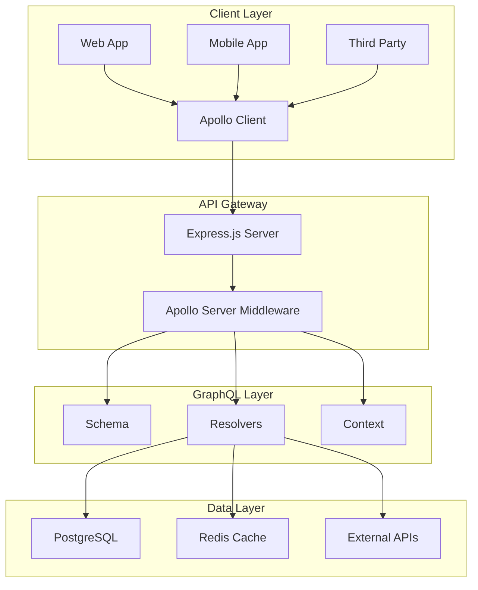
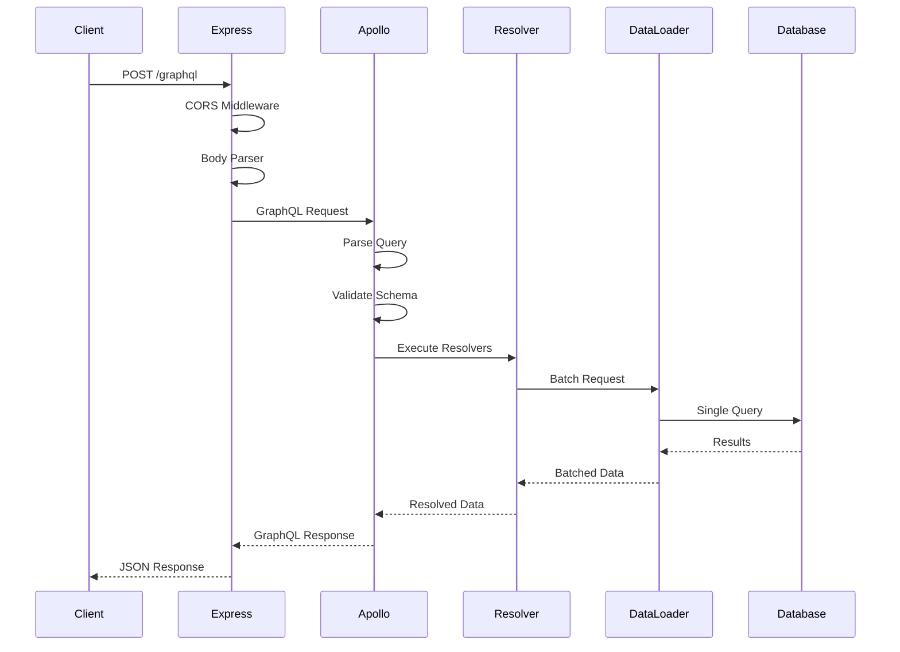
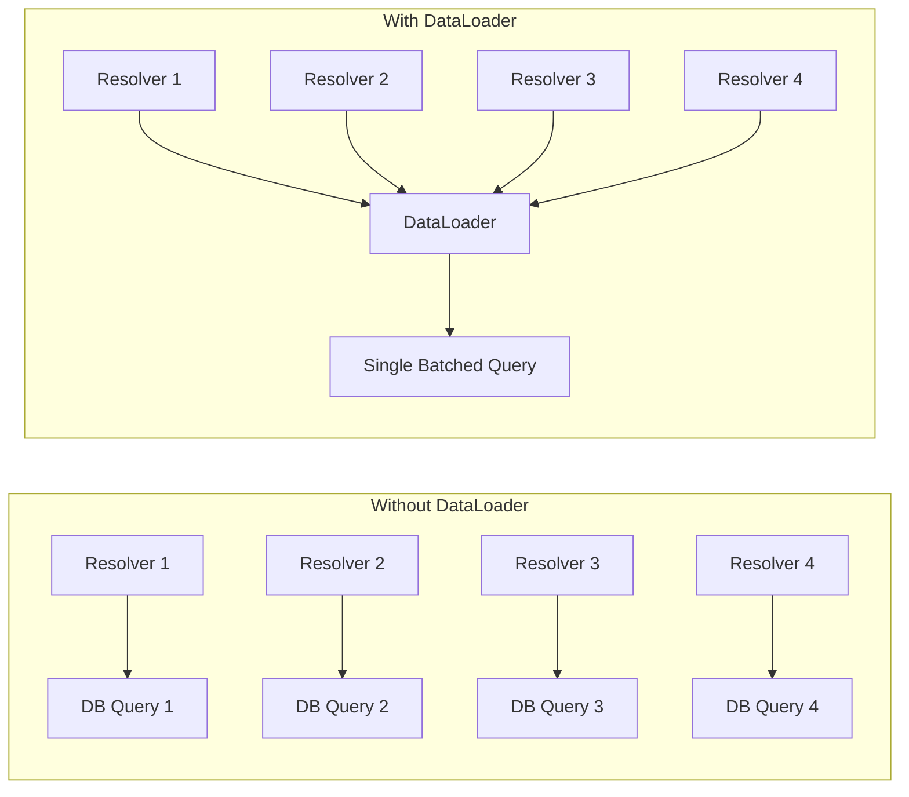
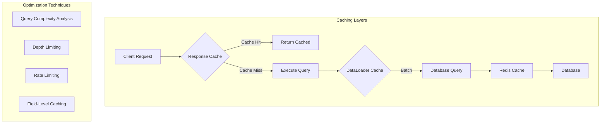

# How to Build GraphQL APIs with Express and Apollo

Author: [nawazdhandala](https://www.github.com/nawazdhandala)

Tags: Express.js, Node.js, GraphQL, Apollo, API Development, Backend, JavaScript

Description: Learn how to build robust GraphQL APIs using Express.js and Apollo Server. This comprehensive guide covers project setup, schema design, resolver implementation, database integration, authentication, real-time subscriptions, testing, and deployment best practices.

---

> GraphQL is a query language for APIs and a runtime for fulfilling those queries with your existing data. GraphQL provides a complete and understandable description of the data in your API, gives clients the power to ask for exactly what they need and nothing more, makes it easier to evolve APIs over time, and enables powerful developer tools.

Building a GraphQL API with Express and Apollo Server combines the flexibility of GraphQL with the robust middleware ecosystem of Express.js. This guide walks you through creating a production-ready GraphQL API from scratch, covering everything from initial setup to deployment considerations.

## Why Choose Express with Apollo Server?

Before diving into implementation, let us understand why this combination is powerful.



**Express.js Benefits:**
- Mature middleware ecosystem for logging, security, and compression
- Easy integration with existing REST endpoints
- Flexible routing and request handling
- Large community and extensive documentation

**Apollo Server Benefits:**
- Built-in GraphQL Playground for development
- Automatic schema validation and introspection
- Plugin system for monitoring and caching
- Excellent TypeScript support

## Project Setup and Dependencies

Let us start by creating a new Node.js project and installing the required dependencies.

```bash
# Create a new directory and initialize the project
mkdir graphql-api && cd graphql-api
npm init -y

# Install production dependencies
npm install express @apollo/server graphql cors body-parser dotenv

# Install development dependencies
npm install --save-dev nodemon typescript @types/node @types/express ts-node
```

The following code creates a basic project structure that keeps your code organized and maintainable as the project grows.

```bash
# Create the project directory structure
mkdir -p src/{schema,resolvers,models,middleware,utils,datasources}
touch src/index.js src/schema/typeDefs.js src/resolvers/index.js
```

Your project structure should look like this:

```
graphql-api/
├── src/
│   ├── index.js
│   ├── schema/
│   │   └── typeDefs.js
│   ├── resolvers/
│   │   └── index.js
│   ├── models/
│   ├── middleware/
│   ├── utils/
│   └── datasources/
├── package.json
└── .env
```

## Setting Up the Express Server with Apollo

This foundational code creates an Express server integrated with Apollo Server. The async function ensures Apollo Server starts before we apply the middleware.

```javascript
// src/index.js
const express = require('express');
const { ApolloServer } = require('@apollo/server');
const { expressMiddleware } = require('@apollo/server/express4');
const { ApolloServerPluginDrainHttpServer } = require('@apollo/server/plugin/drainHttpServer');
const http = require('http');
const cors = require('cors');
const bodyParser = require('body-parser');
require('dotenv').config();

// Import schema and resolvers
const typeDefs = require('./schema/typeDefs');
const resolvers = require('./resolvers');

async function startServer() {
  // Create Express application instance
  const app = express();

  // Create HTTP server for WebSocket support later
  const httpServer = http.createServer(app);

  // Initialize Apollo Server with schema and resolvers
  const server = new ApolloServer({
    typeDefs,
    resolvers,
    // Plugin for graceful shutdown
    plugins: [ApolloServerPluginDrainHttpServer({ httpServer })],
    // Enable introspection for development
    introspection: process.env.NODE_ENV !== 'production',
  });

  // Start Apollo Server before applying middleware
  await server.start();

  // Health check endpoint for container orchestration
  app.get('/health', (req, res) => {
    res.status(200).json({
      status: 'healthy',
      timestamp: new Date().toISOString()
    });
  });

  // Apply middleware to Express
  // Order matters: CORS first, then body parser, then GraphQL
  app.use(
    '/graphql',
    cors({
      origin: process.env.ALLOWED_ORIGINS?.split(',') || '*',
      credentials: true,
    }),
    bodyParser.json({ limit: '10mb' }),
    expressMiddleware(server, {
      // Context function runs for every request
      context: async ({ req, res }) => ({
        token: req.headers.authorization || '',
        req,
        res,
      }),
    })
  );

  // Start the server
  const PORT = process.env.PORT || 4000;
  httpServer.listen(PORT, () => {
    console.log(`Server ready at http://localhost:${PORT}/graphql`);
    console.log(`Health check at http://localhost:${PORT}/health`);
  });
}

// Handle startup errors gracefully
startServer().catch((error) => {
  console.error('Failed to start server:', error);
  process.exit(1);
});
```

## Designing the GraphQL Schema

A well-designed schema is the foundation of a good GraphQL API. The following schema defines types for a blog platform with users, posts, and comments.

```javascript
// src/schema/typeDefs.js
const typeDefs = `#graphql
  """
  Custom scalar for handling date and time values.
  Serializes to ISO 8601 string format.
  """
  scalar DateTime

  """
  Represents a user in the system.
  Users can create posts and comments.
  """
  type User {
    id: ID!
    email: String!
    username: String!
    displayName: String
    avatarUrl: String
    bio: String
    posts: [Post!]!
    comments: [Comment!]!
    createdAt: DateTime!
    updatedAt: DateTime!
  }

  """
  Represents a blog post created by a user.
  Posts can be in draft or published state.
  """
  type Post {
    id: ID!
    title: String!
    slug: String!
    content: String!
    excerpt: String
    coverImageUrl: String
    published: Boolean!
    author: User!
    comments: [Comment!]!
    tags: [String!]!
    viewCount: Int!
    createdAt: DateTime!
    updatedAt: DateTime!
    publishedAt: DateTime
  }

  """
  Represents a comment on a post.
  Comments can be nested for threaded discussions.
  """
  type Comment {
    id: ID!
    content: String!
    author: User!
    post: Post!
    parentComment: Comment
    replies: [Comment!]!
    createdAt: DateTime!
    updatedAt: DateTime!
  }

  """
  Authentication response containing token and user data.
  """
  type AuthPayload {
    token: String!
    user: User!
    expiresAt: DateTime!
  }

  """
  Pagination information for list queries.
  """
  type PageInfo {
    hasNextPage: Boolean!
    hasPreviousPage: Boolean!
    startCursor: String
    endCursor: String
    totalCount: Int!
  }

  """
  Paginated list of posts with cursor-based pagination.
  """
  type PostConnection {
    edges: [PostEdge!]!
    pageInfo: PageInfo!
  }

  type PostEdge {
    cursor: String!
    node: Post!
  }

  # Input types for mutations
  # Using input types keeps mutations organized and type-safe

  input CreateUserInput {
    email: String!
    username: String!
    password: String!
    displayName: String
    bio: String
  }

  input UpdateUserInput {
    displayName: String
    bio: String
    avatarUrl: String
  }

  input CreatePostInput {
    title: String!
    content: String!
    excerpt: String
    coverImageUrl: String
    published: Boolean = false
    tags: [String!] = []
  }

  input UpdatePostInput {
    title: String
    content: String
    excerpt: String
    coverImageUrl: String
    published: Boolean
    tags: [String!]
  }

  input CreateCommentInput {
    postId: ID!
    content: String!
    parentCommentId: ID
  }

  input PostFilterInput {
    published: Boolean
    authorId: ID
    tag: String
    searchTerm: String
  }

  input PaginationInput {
    first: Int = 10
    after: String
    last: Int
    before: String
  }

  # Root Query type defines all read operations
  type Query {
    # User queries
    me: User
    user(id: ID!): User
    userByUsername(username: String!): User

    # Post queries
    post(id: ID!): Post
    postBySlug(slug: String!): Post
    posts(filter: PostFilterInput, pagination: PaginationInput): PostConnection!

    # Search functionality
    searchPosts(query: String!, limit: Int = 10): [Post!]!

    # Comment queries
    comment(id: ID!): Comment
    commentsByPost(postId: ID!, limit: Int = 50): [Comment!]!
  }

  # Root Mutation type defines all write operations
  type Mutation {
    # Authentication mutations
    register(input: CreateUserInput!): AuthPayload!
    login(email: String!, password: String!): AuthPayload!
    logout: Boolean!
    refreshToken: AuthPayload!

    # User mutations
    updateProfile(input: UpdateUserInput!): User!
    deleteAccount: Boolean!

    # Post mutations
    createPost(input: CreatePostInput!): Post!
    updatePost(id: ID!, input: UpdatePostInput!): Post!
    deletePost(id: ID!): Boolean!
    publishPost(id: ID!): Post!
    unpublishPost(id: ID!): Post!

    # Comment mutations
    createComment(input: CreateCommentInput!): Comment!
    updateComment(id: ID!, content: String!): Comment!
    deleteComment(id: ID!): Boolean!
  }

  # Subscription type for real-time updates
  type Subscription {
    postCreated: Post!
    postUpdated(id: ID!): Post!
    commentAdded(postId: ID!): Comment!
  }
`;

module.exports = typeDefs;
```

## Understanding the GraphQL Request Flow

The following diagram illustrates how a GraphQL request flows through the system, from client to database and back.



## Implementing Resolvers

Resolvers are functions that populate the data for fields in your schema. They connect your GraphQL types to your data sources.

```javascript
// src/resolvers/index.js
const { GraphQLScalarType, Kind } = require('graphql');
const { GraphQLError } = require('graphql');

// Custom DateTime scalar for handling dates consistently
const dateTimeScalar = new GraphQLScalarType({
  name: 'DateTime',
  description: 'DateTime custom scalar type representing ISO 8601 date strings',

  // Serialize: Convert outgoing Date to ISO string
  serialize(value) {
    if (value instanceof Date) {
      return value.toISOString();
    }
    if (typeof value === 'string') {
      return new Date(value).toISOString();
    }
    throw new Error('DateTime cannot represent an invalid date-time-string');
  },

  // Parse value: Convert incoming ISO string to Date
  parseValue(value) {
    const date = new Date(value);
    if (isNaN(date.getTime())) {
      throw new Error('DateTime cannot represent an invalid date-time-string');
    }
    return date;
  },

  // Parse literal: Convert AST literal to Date
  parseLiteral(ast) {
    if (ast.kind === Kind.STRING) {
      const date = new Date(ast.value);
      if (isNaN(date.getTime())) {
        throw new Error('DateTime cannot represent an invalid date-time-string');
      }
      return date;
    }
    return null;
  },
});

const resolvers = {
  // Register the custom scalar
  DateTime: dateTimeScalar,

  // Query resolvers handle read operations
  Query: {
    // Fetch the currently authenticated user
    me: async (_, __, { user, dataSources }) => {
      if (!user) return null;
      return dataSources.userAPI.findById(user.id);
    },

    // Fetch a user by their ID
    user: async (_, { id }, { dataSources }) => {
      return dataSources.userAPI.findById(id);
    },

    // Fetch a user by their username
    userByUsername: async (_, { username }, { dataSources }) => {
      return dataSources.userAPI.findByUsername(username);
    },

    // Fetch a single post by ID
    post: async (_, { id }, { dataSources }) => {
      return dataSources.postAPI.findById(id);
    },

    // Fetch a post by its URL slug
    postBySlug: async (_, { slug }, { dataSources }) => {
      return dataSources.postAPI.findBySlug(slug);
    },

    // Fetch paginated posts with optional filters
    posts: async (_, { filter, pagination }, { dataSources }) => {
      const { first = 10, after } = pagination || {};

      // Decode cursor if provided
      const cursor = after ? decodeCursor(after) : null;

      // Fetch posts with filters
      const result = await dataSources.postAPI.findMany({
        filter,
        limit: first + 1, // Fetch one extra to check for next page
        cursor,
      });

      // Determine if there are more pages
      const hasNextPage = result.length > first;
      const edges = result.slice(0, first).map((post) => ({
        cursor: encodeCursor(post.id),
        node: post,
      }));

      return {
        edges,
        pageInfo: {
          hasNextPage,
          hasPreviousPage: !!after,
          startCursor: edges[0]?.cursor || null,
          endCursor: edges[edges.length - 1]?.cursor || null,
          totalCount: await dataSources.postAPI.count(filter),
        },
      };
    },

    // Full-text search for posts
    searchPosts: async (_, { query, limit }, { dataSources }) => {
      return dataSources.postAPI.search(query, limit);
    },

    // Fetch a comment by ID
    comment: async (_, { id }, { dataSources }) => {
      return dataSources.commentAPI.findById(id);
    },

    // Fetch all comments for a post
    commentsByPost: async (_, { postId, limit }, { dataSources }) => {
      return dataSources.commentAPI.findByPostId(postId, limit);
    },
  },

  // Mutation resolvers handle write operations
  Mutation: {
    // User registration with validation
    register: async (_, { input }, { dataSources }) => {
      const { email, username, password, displayName, bio } = input;

      // Check for existing user
      const existingUser = await dataSources.userAPI.findByEmail(email);
      if (existingUser) {
        throw new GraphQLError('Email already registered', {
          extensions: { code: 'BAD_USER_INPUT', field: 'email' },
        });
      }

      const existingUsername = await dataSources.userAPI.findByUsername(username);
      if (existingUsername) {
        throw new GraphQLError('Username already taken', {
          extensions: { code: 'BAD_USER_INPUT', field: 'username' },
        });
      }

      // Create user and generate token
      const user = await dataSources.userAPI.create({
        email,
        username,
        password,
        displayName,
        bio,
      });

      const token = generateToken(user);
      const expiresAt = new Date(Date.now() + 7 * 24 * 60 * 60 * 1000); // 7 days

      return { token, user, expiresAt };
    },

    // User login with credentials
    login: async (_, { email, password }, { dataSources }) => {
      const user = await dataSources.userAPI.findByEmail(email);

      if (!user) {
        throw new GraphQLError('Invalid credentials', {
          extensions: { code: 'UNAUTHENTICATED' },
        });
      }

      const validPassword = await dataSources.userAPI.verifyPassword(
        user,
        password
      );

      if (!validPassword) {
        throw new GraphQLError('Invalid credentials', {
          extensions: { code: 'UNAUTHENTICATED' },
        });
      }

      const token = generateToken(user);
      const expiresAt = new Date(Date.now() + 7 * 24 * 60 * 60 * 1000);

      return { token, user, expiresAt };
    },

    // Create a new blog post
    createPost: async (_, { input }, { user, dataSources, pubsub }) => {
      // Require authentication
      requireAuth(user);

      const { title, content, excerpt, coverImageUrl, published, tags } = input;

      // Generate URL-friendly slug from title
      const slug = generateSlug(title);

      const post = await dataSources.postAPI.create({
        title,
        slug,
        content,
        excerpt: excerpt || content.substring(0, 200),
        coverImageUrl,
        published,
        tags,
        authorId: user.id,
        publishedAt: published ? new Date() : null,
      });

      // Publish event for subscribers if post is published
      if (published && pubsub) {
        pubsub.publish('POST_CREATED', { postCreated: post });
      }

      return post;
    },

    // Update an existing post
    updatePost: async (_, { id, input }, { user, dataSources, pubsub }) => {
      requireAuth(user);

      // Verify ownership
      const existingPost = await dataSources.postAPI.findById(id);
      if (!existingPost) {
        throw new GraphQLError('Post not found', {
          extensions: { code: 'NOT_FOUND' },
        });
      }

      if (existingPost.authorId !== user.id) {
        throw new GraphQLError('Not authorized to update this post', {
          extensions: { code: 'FORBIDDEN' },
        });
      }

      // Handle publishing status change
      const updateData = { ...input };
      if (input.published && !existingPost.published) {
        updateData.publishedAt = new Date();
      }

      const post = await dataSources.postAPI.update(id, updateData);

      // Publish update event
      if (pubsub) {
        pubsub.publish(`POST_UPDATED_${id}`, { postUpdated: post });
      }

      return post;
    },

    // Delete a post
    deletePost: async (_, { id }, { user, dataSources }) => {
      requireAuth(user);

      const post = await dataSources.postAPI.findById(id);
      if (!post) {
        throw new GraphQLError('Post not found', {
          extensions: { code: 'NOT_FOUND' },
        });
      }

      if (post.authorId !== user.id) {
        throw new GraphQLError('Not authorized to delete this post', {
          extensions: { code: 'FORBIDDEN' },
        });
      }

      await dataSources.postAPI.delete(id);
      return true;
    },

    // Create a comment on a post
    createComment: async (_, { input }, { user, dataSources, pubsub }) => {
      requireAuth(user);

      const { postId, content, parentCommentId } = input;

      // Verify post exists
      const post = await dataSources.postAPI.findById(postId);
      if (!post) {
        throw new GraphQLError('Post not found', {
          extensions: { code: 'NOT_FOUND' },
        });
      }

      // Verify parent comment exists if provided
      if (parentCommentId) {
        const parentComment = await dataSources.commentAPI.findById(parentCommentId);
        if (!parentComment || parentComment.postId !== postId) {
          throw new GraphQLError('Parent comment not found', {
            extensions: { code: 'NOT_FOUND' },
          });
        }
      }

      const comment = await dataSources.commentAPI.create({
        postId,
        content,
        authorId: user.id,
        parentCommentId,
      });

      // Publish event for real-time updates
      if (pubsub) {
        pubsub.publish(`COMMENT_ADDED_${postId}`, { commentAdded: comment });
      }

      return comment;
    },

    // Update profile for authenticated user
    updateProfile: async (_, { input }, { user, dataSources }) => {
      requireAuth(user);
      return dataSources.userAPI.update(user.id, input);
    },

    // Logout - invalidate token on client side
    logout: async (_, __, { user }) => {
      // Token invalidation typically handled client-side
      // For server-side invalidation, use a token blacklist
      return true;
    },
  },

  // Field resolvers for User type
  User: {
    // Fetch all posts authored by this user
    posts: async (user, _, { dataSources }) => {
      return dataSources.postAPI.findByAuthorId(user.id);
    },

    // Fetch all comments authored by this user
    comments: async (user, _, { dataSources }) => {
      return dataSources.commentAPI.findByAuthorId(user.id);
    },
  },

  // Field resolvers for Post type
  Post: {
    // Fetch the author of this post
    author: async (post, _, { loaders }) => {
      // Use DataLoader for batching
      return loaders.userLoader.load(post.authorId);
    },

    // Fetch all comments on this post
    comments: async (post, _, { dataSources }) => {
      return dataSources.commentAPI.findByPostId(post.id);
    },
  },

  // Field resolvers for Comment type
  Comment: {
    // Fetch the author of this comment
    author: async (comment, _, { loaders }) => {
      return loaders.userLoader.load(comment.authorId);
    },

    // Fetch the post this comment belongs to
    post: async (comment, _, { dataSources }) => {
      return dataSources.postAPI.findById(comment.postId);
    },

    // Fetch the parent comment if this is a reply
    parentComment: async (comment, _, { dataSources }) => {
      if (!comment.parentCommentId) return null;
      return dataSources.commentAPI.findById(comment.parentCommentId);
    },

    // Fetch all replies to this comment
    replies: async (comment, _, { dataSources }) => {
      return dataSources.commentAPI.findByParentId(comment.id);
    },
  },

  // Subscription resolvers
  Subscription: {
    postCreated: {
      subscribe: (_, __, { pubsub }) => {
        return pubsub.asyncIterator(['POST_CREATED']);
      },
    },

    postUpdated: {
      subscribe: (_, { id }, { pubsub }) => {
        return pubsub.asyncIterator([`POST_UPDATED_${id}`]);
      },
    },

    commentAdded: {
      subscribe: (_, { postId }, { pubsub }) => {
        return pubsub.asyncIterator([`COMMENT_ADDED_${postId}`]);
      },
    },
  },
};

// Helper function to require authentication
function requireAuth(user) {
  if (!user) {
    throw new GraphQLError('Authentication required', {
      extensions: { code: 'UNAUTHENTICATED' },
    });
  }
}

// Helper function to generate URL slugs
function generateSlug(title) {
  return title
    .toLowerCase()
    .replace(/[^a-z0-9]+/g, '-')
    .replace(/(^-|-$)/g, '');
}

// Helper function to encode cursor for pagination
function encodeCursor(id) {
  return Buffer.from(`cursor:${id}`).toString('base64');
}

// Helper function to decode cursor for pagination
function decodeCursor(cursor) {
  const decoded = Buffer.from(cursor, 'base64').toString('utf8');
  return decoded.replace('cursor:', '');
}

// Placeholder for token generation - implement with JWT
function generateToken(user) {
  const jwt = require('jsonwebtoken');
  return jwt.sign(
    { id: user.id, email: user.email },
    process.env.JWT_SECRET || 'your-secret-key',
    { expiresIn: '7d' }
  );
}

module.exports = resolvers;
```

## Implementing DataLoader for Efficient Data Fetching

DataLoader prevents the N+1 query problem by batching and caching database requests. The following implementation shows how to create DataLoaders for your data sources.



The following code implements DataLoader for efficient user fetching across multiple resolvers.

```javascript
// src/datasources/loaders.js
const DataLoader = require('dataloader');

// Create a DataLoader for batching user fetches
function createUserLoader(userAPI) {
  return new DataLoader(
    async (userIds) => {
      // Fetch all users in a single query
      const users = await userAPI.findByIds(userIds);

      // Create a map for O(1) lookup
      const userMap = new Map();
      users.forEach((user) => {
        userMap.set(user.id, user);
      });

      // Return users in the same order as the input IDs
      // This is a DataLoader requirement
      return userIds.map((id) => userMap.get(id) || null);
    },
    {
      // Cache results within a single request
      cache: true,
      // Maximum batch size to prevent oversized queries
      maxBatchSize: 100,
    }
  );
}

// Create a DataLoader for batching post fetches by author
function createPostsByAuthorLoader(postAPI) {
  return new DataLoader(
    async (authorIds) => {
      // Fetch all posts for all authors in a single query
      const posts = await postAPI.findByAuthorIds(authorIds);

      // Group posts by author ID
      const postsByAuthor = new Map();
      authorIds.forEach((id) => postsByAuthor.set(id, []));

      posts.forEach((post) => {
        const authorPosts = postsByAuthor.get(post.authorId);
        if (authorPosts) {
          authorPosts.push(post);
        }
      });

      // Return posts arrays in the same order as input IDs
      return authorIds.map((id) => postsByAuthor.get(id) || []);
    },
    { cache: true }
  );
}

// Create a DataLoader for batching comment counts
function createCommentCountLoader(commentAPI) {
  return new DataLoader(
    async (postIds) => {
      // Get comment counts for all posts in a single query
      const counts = await commentAPI.countByPostIds(postIds);

      // Create a map for lookup
      const countMap = new Map(counts.map((c) => [c.postId, c.count]));

      // Return counts in the same order as input IDs
      return postIds.map((id) => countMap.get(id) || 0);
    },
    { cache: true }
  );
}

// Factory function to create all loaders for a request
function createLoaders(dataSources) {
  return {
    userLoader: createUserLoader(dataSources.userAPI),
    postsByAuthorLoader: createPostsByAuthorLoader(dataSources.postAPI),
    commentCountLoader: createCommentCountLoader(dataSources.commentAPI),
  };
}

module.exports = { createLoaders };
```

## Authentication and Authorization

Implementing secure authentication is crucial for any API. The following code shows how to handle JWT-based authentication in your GraphQL context.

```javascript
// src/middleware/auth.js
const jwt = require('jsonwebtoken');
const { GraphQLError } = require('graphql');

// Extract and verify JWT token from request headers
function getUserFromToken(token) {
  if (!token) return null;

  try {
    // Remove 'Bearer ' prefix if present
    const cleanToken = token.startsWith('Bearer ')
      ? token.slice(7)
      : token;

    // Verify and decode the token
    const decoded = jwt.verify(
      cleanToken,
      process.env.JWT_SECRET || 'your-secret-key'
    );

    return {
      id: decoded.id,
      email: decoded.email,
    };
  } catch (error) {
    // Token is invalid or expired
    // Return null rather than throwing to allow unauthenticated queries
    return null;
  }
}

// Create authentication directive for schema-level protection
function createAuthDirective() {
  return {
    typeDefs: `
      directive @auth(requires: Role = USER) on FIELD_DEFINITION

      enum Role {
        ADMIN
        USER
        GUEST
      }
    `,

    transformer: (schema) => {
      // Transform schema to add auth checks to fields with @auth directive
      return mapSchema(schema, {
        [MapperKind.OBJECT_FIELD]: (fieldConfig) => {
          const authDirective = getDirective(schema, fieldConfig, 'auth')?.[0];

          if (authDirective) {
            const { resolve = defaultFieldResolver } = fieldConfig;
            const requiredRole = authDirective.requires || 'USER';

            fieldConfig.resolve = async function (source, args, context, info) {
              // Check if user is authenticated
              if (!context.user) {
                throw new GraphQLError('Authentication required', {
                  extensions: {
                    code: 'UNAUTHENTICATED',
                    http: { status: 401 },
                  },
                });
              }

              // Check role if needed
              if (requiredRole === 'ADMIN' && !context.user.isAdmin) {
                throw new GraphQLError('Admin access required', {
                  extensions: {
                    code: 'FORBIDDEN',
                    http: { status: 403 },
                  },
                });
              }

              return resolve(source, args, context, info);
            };
          }

          return fieldConfig;
        },
      });
    },
  };
}

// Middleware to extract user from request
async function authMiddleware(req, dataSources) {
  const token = req.headers.authorization || '';
  const tokenUser = getUserFromToken(token);

  if (!tokenUser) return null;

  // Fetch full user data from database
  const user = await dataSources.userAPI.findById(tokenUser.id);

  return user;
}

module.exports = {
  getUserFromToken,
  createAuthDirective,
  authMiddleware,
};
```

## Setting Up Real-Time Subscriptions

GraphQL subscriptions enable real-time updates through WebSocket connections. The following code integrates subscriptions with your Express and Apollo server.

```javascript
// src/index.js (updated with subscriptions)
const express = require('express');
const { ApolloServer } = require('@apollo/server');
const { expressMiddleware } = require('@apollo/server/express4');
const { ApolloServerPluginDrainHttpServer } = require('@apollo/server/plugin/drainHttpServer');
const { makeExecutableSchema } = require('@graphql-tools/schema');
const { WebSocketServer } = require('ws');
const { useServer } = require('graphql-ws/lib/use/ws');
const { PubSub } = require('graphql-subscriptions');
const http = require('http');
const cors = require('cors');
const bodyParser = require('body-parser');

const typeDefs = require('./schema/typeDefs');
const resolvers = require('./resolvers');
const { createLoaders } = require('./datasources/loaders');
const { getUserFromToken } = require('./middleware/auth');

// Create PubSub instance for publishing events
const pubsub = new PubSub();

async function startServer() {
  const app = express();
  const httpServer = http.createServer(app);

  // Create executable schema
  const schema = makeExecutableSchema({ typeDefs, resolvers });

  // Set up WebSocket server for subscriptions
  const wsServer = new WebSocketServer({
    server: httpServer,
    path: '/graphql',
  });

  // Configure graphql-ws server
  const serverCleanup = useServer(
    {
      schema,
      // Context for WebSocket connections
      context: async (ctx) => {
        // Get token from connection params
        const token = ctx.connectionParams?.authorization || '';
        const user = getUserFromToken(token);

        return {
          user,
          pubsub,
        };
      },
      // Handle connection lifecycle
      onConnect: async (ctx) => {
        console.log('WebSocket client connected');
        // Optionally validate connection here
        return true;
      },
      onDisconnect: async (ctx) => {
        console.log('WebSocket client disconnected');
      },
    },
    wsServer
  );

  // Create Apollo Server
  const server = new ApolloServer({
    schema,
    plugins: [
      // Proper shutdown for HTTP server
      ApolloServerPluginDrainHttpServer({ httpServer }),
      // Proper shutdown for WebSocket server
      {
        async serverWillStart() {
          return {
            async drainServer() {
              await serverCleanup.dispose();
            },
          };
        },
      },
    ],
  });

  await server.start();

  // Health check endpoint
  app.get('/health', (req, res) => {
    res.json({ status: 'healthy' });
  });

  // Apply Express middleware
  app.use(
    '/graphql',
    cors(),
    bodyParser.json(),
    expressMiddleware(server, {
      context: async ({ req }) => {
        const token = req.headers.authorization || '';
        const user = getUserFromToken(token);

        // Create fresh DataLoaders for each request
        const dataSources = createDataSources();
        const loaders = createLoaders(dataSources);

        return {
          user,
          dataSources,
          loaders,
          pubsub,
        };
      },
    })
  );

  const PORT = process.env.PORT || 4000;
  httpServer.listen(PORT, () => {
    console.log(`HTTP server ready at http://localhost:${PORT}/graphql`);
    console.log(`WebSocket server ready at ws://localhost:${PORT}/graphql`);
  });
}

startServer();
```

## Error Handling Best Practices

Proper error handling improves API usability and debugging. The following code demonstrates structured error handling with custom error classes.

```javascript
// src/utils/errors.js
const { GraphQLError } = require('graphql');

// Base custom error class for application errors
class AppError extends GraphQLError {
  constructor(message, code, statusCode = 400, additionalInfo = {}) {
    super(message, {
      extensions: {
        code,
        http: { status: statusCode },
        ...additionalInfo,
      },
    });
  }
}

// Resource not found error
class NotFoundError extends AppError {
  constructor(resource, identifier) {
    super(
      `${resource} not found`,
      'NOT_FOUND',
      404,
      { resource, identifier }
    );
  }
}

// Validation error with field information
class ValidationError extends AppError {
  constructor(message, field, value) {
    super(
      message,
      'VALIDATION_ERROR',
      400,
      { field, providedValue: value }
    );
  }
}

// Authentication required error
class AuthenticationError extends AppError {
  constructor(message = 'Authentication required') {
    super(message, 'UNAUTHENTICATED', 401);
  }
}

// Authorization error for insufficient permissions
class ForbiddenError extends AppError {
  constructor(message = 'Insufficient permissions') {
    super(message, 'FORBIDDEN', 403);
  }
}

// Rate limiting error
class RateLimitError extends AppError {
  constructor(retryAfter = 60) {
    super(
      'Too many requests',
      'RATE_LIMITED',
      429,
      { retryAfter }
    );
  }
}

// Input validation helper
function validateInput(input, rules) {
  const errors = [];

  for (const [field, validators] of Object.entries(rules)) {
    const value = input[field];

    for (const validator of validators) {
      const error = validator(value, field);
      if (error) {
        errors.push(error);
      }
    }
  }

  if (errors.length > 0) {
    throw new GraphQLError('Validation failed', {
      extensions: {
        code: 'VALIDATION_ERROR',
        validationErrors: errors,
      },
    });
  }
}

// Common validators
const validators = {
  required: (value, field) => {
    if (value === undefined || value === null || value === '') {
      return { field, message: `${field} is required` };
    }
    return null;
  },

  email: (value, field) => {
    const emailRegex = /^[^\s@]+@[^\s@]+\.[^\s@]+$/;
    if (value && !emailRegex.test(value)) {
      return { field, message: `${field} must be a valid email address` };
    }
    return null;
  },

  minLength: (min) => (value, field) => {
    if (value && value.length < min) {
      return { field, message: `${field} must be at least ${min} characters` };
    }
    return null;
  },

  maxLength: (max) => (value, field) => {
    if (value && value.length > max) {
      return { field, message: `${field} must be at most ${max} characters` };
    }
    return null;
  },
};

module.exports = {
  AppError,
  NotFoundError,
  ValidationError,
  AuthenticationError,
  ForbiddenError,
  RateLimitError,
  validateInput,
  validators,
};
```

## Configuring Apollo Server for Production

The following configuration optimizes Apollo Server for production environments with caching, monitoring, and security features.

```javascript
// src/config/apollo.js
const { ApolloServer } = require('@apollo/server');
const { ApolloServerPluginLandingPageDisabled } = require('@apollo/server/plugin/disabled');
const { ApolloServerPluginLandingPageLocalDefault } = require('@apollo/server/plugin/landingPage/default');

function createApolloServer(schema, options = {}) {
  const isProduction = process.env.NODE_ENV === 'production';

  return new ApolloServer({
    schema,

    // Disable introspection in production for security
    introspection: !isProduction,

    // Configure plugins based on environment
    plugins: [
      // Disable playground in production
      isProduction
        ? ApolloServerPluginLandingPageDisabled()
        : ApolloServerPluginLandingPageLocalDefault(),

      // Custom logging plugin
      {
        async requestDidStart(requestContext) {
          const startTime = Date.now();

          return {
            async didResolveOperation(context) {
              // Log operation name for tracking
              console.log({
                type: 'operation',
                name: context.operationName,
                timestamp: new Date().toISOString(),
              });
            },

            async willSendResponse(context) {
              const duration = Date.now() - startTime;

              // Log response metrics
              console.log({
                type: 'response',
                operationName: context.operationName,
                duration,
                errors: context.errors?.length || 0,
              });

              // Track slow queries
              if (duration > 1000) {
                console.warn({
                  type: 'slow_query',
                  operationName: context.operationName,
                  duration,
                });
              }
            },

            async didEncounterErrors(context) {
              // Log all errors for debugging
              for (const error of context.errors) {
                console.error({
                  type: 'error',
                  message: error.message,
                  path: error.path,
                  code: error.extensions?.code,
                  stack: isProduction ? undefined : error.stack,
                });
              }
            },
          };
        },
      },

      // Include any additional plugins
      ...(options.plugins || []),
    ],

    // Format errors for clients
    formatError: (formattedError, error) => {
      // Always log the full error server-side
      console.error('GraphQL Error:', error);

      // In production, hide internal error details
      if (isProduction) {
        // Keep custom error codes and messages
        if (formattedError.extensions?.code) {
          return {
            message: formattedError.message,
            extensions: {
              code: formattedError.extensions.code,
            },
          };
        }

        // Hide unexpected errors
        return {
          message: 'An unexpected error occurred',
          extensions: {
            code: 'INTERNAL_SERVER_ERROR',
          },
        };
      }

      // In development, return full error
      return formattedError;
    },
  });
}

module.exports = { createApolloServer };
```

## Testing Your GraphQL API

Comprehensive testing ensures your API works correctly. The following examples demonstrate unit and integration testing approaches.

```javascript
// tests/resolvers.test.js
const { ApolloServer } = require('@apollo/server');
const typeDefs = require('../src/schema/typeDefs');
const resolvers = require('../src/resolvers');

describe('Post Resolvers', () => {
  let server;
  let mockDataSources;

  beforeEach(() => {
    // Create mock data sources
    mockDataSources = {
      postAPI: {
        findById: jest.fn(),
        create: jest.fn(),
        findMany: jest.fn(),
        count: jest.fn(),
      },
      userAPI: {
        findById: jest.fn(),
      },
      commentAPI: {
        findByPostId: jest.fn(),
      },
    };

    server = new ApolloServer({
      typeDefs,
      resolvers,
    });
  });

  describe('Query.post', () => {
    it('should return a post by ID', async () => {
      const mockPost = {
        id: '1',
        title: 'Test Post',
        content: 'Test content',
        authorId: 'user-1',
        published: true,
        createdAt: new Date(),
        updatedAt: new Date(),
      };

      mockDataSources.postAPI.findById.mockResolvedValue(mockPost);

      const response = await server.executeOperation(
        {
          query: `
            query GetPost($id: ID!) {
              post(id: $id) {
                id
                title
                content
                published
              }
            }
          `,
          variables: { id: '1' },
        },
        {
          contextValue: {
            dataSources: mockDataSources,
            user: null,
            loaders: {
              userLoader: { load: jest.fn() },
            },
          },
        }
      );

      expect(response.body.singleResult.errors).toBeUndefined();
      expect(response.body.singleResult.data.post).toEqual({
        id: '1',
        title: 'Test Post',
        content: 'Test content',
        published: true,
      });
    });

    it('should return null for non-existent post', async () => {
      mockDataSources.postAPI.findById.mockResolvedValue(null);

      const response = await server.executeOperation(
        {
          query: `
            query GetPost($id: ID!) {
              post(id: $id) {
                id
                title
              }
            }
          `,
          variables: { id: 'non-existent' },
        },
        {
          contextValue: {
            dataSources: mockDataSources,
            user: null,
            loaders: {
              userLoader: { load: jest.fn() },
            },
          },
        }
      );

      expect(response.body.singleResult.errors).toBeUndefined();
      expect(response.body.singleResult.data.post).toBeNull();
    });
  });

  describe('Mutation.createPost', () => {
    it('should create a post when authenticated', async () => {
      const mockUser = { id: 'user-1', email: 'test@example.com' };
      const mockPost = {
        id: 'new-post-1',
        title: 'New Post',
        slug: 'new-post',
        content: 'New content',
        authorId: 'user-1',
        published: false,
        createdAt: new Date(),
        updatedAt: new Date(),
      };

      mockDataSources.postAPI.create.mockResolvedValue(mockPost);

      const response = await server.executeOperation(
        {
          query: `
            mutation CreatePost($input: CreatePostInput!) {
              createPost(input: $input) {
                id
                title
                slug
                published
              }
            }
          `,
          variables: {
            input: {
              title: 'New Post',
              content: 'New content',
            },
          },
        },
        {
          contextValue: {
            dataSources: mockDataSources,
            user: mockUser,
            loaders: {
              userLoader: { load: jest.fn() },
            },
          },
        }
      );

      expect(response.body.singleResult.errors).toBeUndefined();
      expect(response.body.singleResult.data.createPost.title).toBe('New Post');
    });

    it('should reject unauthenticated requests', async () => {
      const response = await server.executeOperation(
        {
          query: `
            mutation CreatePost($input: CreatePostInput!) {
              createPost(input: $input) {
                id
                title
              }
            }
          `,
          variables: {
            input: {
              title: 'New Post',
              content: 'New content',
            },
          },
        },
        {
          contextValue: {
            dataSources: mockDataSources,
            user: null, // No authenticated user
            loaders: {
              userLoader: { load: jest.fn() },
            },
          },
        }
      );

      expect(response.body.singleResult.errors).toBeDefined();
      expect(response.body.singleResult.errors[0].extensions.code).toBe('UNAUTHENTICATED');
    });
  });
});
```

## Integration Testing with Supertest

The following code demonstrates end-to-end testing of your GraphQL API.

```javascript
// tests/integration.test.js
const request = require('supertest');
const { createTestApp } = require('./helpers/testApp');

describe('GraphQL API Integration', () => {
  let app;
  let authToken;
  let testUserId;

  beforeAll(async () => {
    app = await createTestApp();
  });

  describe('Authentication Flow', () => {
    it('should register a new user', async () => {
      const response = await request(app)
        .post('/graphql')
        .send({
          query: `
            mutation Register($input: CreateUserInput!) {
              register(input: $input) {
                token
                user {
                  id
                  email
                  username
                }
              }
            }
          `,
          variables: {
            input: {
              email: 'test@example.com',
              username: 'testuser',
              password: 'securePassword123',
              displayName: 'Test User',
            },
          },
        });

      expect(response.status).toBe(200);
      expect(response.body.errors).toBeUndefined();
      expect(response.body.data.register.token).toBeDefined();
      expect(response.body.data.register.user.email).toBe('test@example.com');

      authToken = response.body.data.register.token;
      testUserId = response.body.data.register.user.id;
    });

    it('should login with valid credentials', async () => {
      const response = await request(app)
        .post('/graphql')
        .send({
          query: `
            mutation Login($email: String!, $password: String!) {
              login(email: $email, password: $password) {
                token
                user {
                  id
                  email
                }
              }
            }
          `,
          variables: {
            email: 'test@example.com',
            password: 'securePassword123',
          },
        });

      expect(response.status).toBe(200);
      expect(response.body.errors).toBeUndefined();
      expect(response.body.data.login.token).toBeDefined();
    });

    it('should reject login with invalid credentials', async () => {
      const response = await request(app)
        .post('/graphql')
        .send({
          query: `
            mutation Login($email: String!, $password: String!) {
              login(email: $email, password: $password) {
                token
              }
            }
          `,
          variables: {
            email: 'test@example.com',
            password: 'wrongPassword',
          },
        });

      expect(response.body.errors).toBeDefined();
      expect(response.body.errors[0].extensions.code).toBe('UNAUTHENTICATED');
    });
  });

  describe('Post Operations', () => {
    let postId;

    it('should create a post when authenticated', async () => {
      const response = await request(app)
        .post('/graphql')
        .set('Authorization', `Bearer ${authToken}`)
        .send({
          query: `
            mutation CreatePost($input: CreatePostInput!) {
              createPost(input: $input) {
                id
                title
                slug
                content
                published
                author {
                  id
                  username
                }
              }
            }
          `,
          variables: {
            input: {
              title: 'My First Post',
              content: 'This is the content of my first post.',
              published: true,
              tags: ['testing', 'graphql'],
            },
          },
        });

      expect(response.status).toBe(200);
      expect(response.body.errors).toBeUndefined();
      expect(response.body.data.createPost.title).toBe('My First Post');
      expect(response.body.data.createPost.author.username).toBe('testuser');

      postId = response.body.data.createPost.id;
    });

    it('should fetch the created post', async () => {
      const response = await request(app)
        .post('/graphql')
        .send({
          query: `
            query GetPost($id: ID!) {
              post(id: $id) {
                id
                title
                content
                author {
                  username
                }
              }
            }
          `,
          variables: { id: postId },
        });

      expect(response.status).toBe(200);
      expect(response.body.data.post.title).toBe('My First Post');
    });

    it('should fetch paginated posts', async () => {
      const response = await request(app)
        .post('/graphql')
        .send({
          query: `
            query GetPosts($pagination: PaginationInput, $filter: PostFilterInput) {
              posts(pagination: $pagination, filter: $filter) {
                edges {
                  cursor
                  node {
                    id
                    title
                  }
                }
                pageInfo {
                  hasNextPage
                  totalCount
                }
              }
            }
          `,
          variables: {
            pagination: { first: 10 },
            filter: { published: true },
          },
        });

      expect(response.status).toBe(200);
      expect(response.body.data.posts.edges).toBeDefined();
      expect(response.body.data.posts.pageInfo.totalCount).toBeGreaterThan(0);
    });
  });
});
```

## Performance Optimization Strategies

The following diagram shows how caching and optimization work together in a GraphQL API.



The following code implements query complexity analysis to prevent resource-intensive queries.

```javascript
// src/middleware/complexity.js
const depthLimit = require('graphql-depth-limit');
const { createComplexityLimitRule } = require('graphql-validation-complexity');

// Configure validation rules for query protection
function getValidationRules() {
  return [
    // Limit query depth to prevent deeply nested queries
    // A depth of 10 covers most legitimate use cases
    depthLimit(10),

    // Limit query complexity based on field costs
    createComplexityLimitRule(1000, {
      // Callback when cost is calculated
      onCost: (cost) => {
        if (cost > 500) {
          console.warn(`High complexity query: ${cost}`);
        }
      },

      // Custom cost calculation for specific types
      scalarCost: 1,
      objectCost: 2,
      listFactor: 10, // Multiply cost by this for list fields

      // Define custom costs for expensive fields
      fieldCostFn: (fieldInfo) => {
        // Posts list is expensive
        if (fieldInfo.fieldName === 'posts') {
          return 5;
        }
        // Search is very expensive
        if (fieldInfo.fieldName === 'searchPosts') {
          return 20;
        }
        return 1;
      },
    }),
  ];
}

module.exports = { getValidationRules };
```

## Rate Limiting Implementation

The following code adds rate limiting to protect your API from abuse.

```javascript
// src/middleware/rateLimit.js
const rateLimit = require('express-rate-limit');
const RedisStore = require('rate-limit-redis');
const Redis = require('ioredis');

// Create Redis client for distributed rate limiting
const redis = new Redis(process.env.REDIS_URL);

// General rate limiter for all requests
const generalLimiter = rateLimit({
  // Use Redis for distributed rate limiting
  store: new RedisStore({
    sendCommand: (...args) => redis.call(...args),
  }),

  // 100 requests per 15 minutes
  windowMs: 15 * 60 * 1000,
  max: 100,

  // Return rate limit info in headers
  standardHeaders: true,
  legacyHeaders: false,

  // Custom handler for rate limit exceeded
  handler: (req, res) => {
    res.status(429).json({
      errors: [{
        message: 'Too many requests, please try again later',
        extensions: {
          code: 'RATE_LIMITED',
          retryAfter: Math.ceil(req.rateLimit.resetTime / 1000),
        },
      }],
    });
  },

  // Custom key generator based on user or IP
  keyGenerator: (req) => {
    // Use user ID if authenticated, otherwise use IP
    const user = req.user;
    return user ? `user:${user.id}` : `ip:${req.ip}`;
  },
});

// Stricter limiter for mutations
const mutationLimiter = rateLimit({
  store: new RedisStore({
    sendCommand: (...args) => redis.call(...args),
  }),

  // 20 mutations per minute
  windowMs: 60 * 1000,
  max: 20,

  // Only apply to mutations
  skip: (req) => {
    const query = req.body?.query || '';
    return !query.trim().startsWith('mutation');
  },

  standardHeaders: true,
  legacyHeaders: false,
});

module.exports = {
  generalLimiter,
  mutationLimiter,
};
```

## Deployment Checklist

Before deploying your GraphQL API to production, ensure you have addressed the following items:

| Category | Item | Description |
|----------|------|-------------|
| Security | Disable introspection | Prevent schema exposure in production |
| Security | Implement rate limiting | Protect against abuse and DDoS |
| Security | Validate input | Sanitize all user input |
| Security | Use HTTPS | Encrypt all traffic |
| Performance | Enable response caching | Cache frequent queries |
| Performance | Use DataLoader | Batch database queries |
| Performance | Limit query complexity | Prevent expensive queries |
| Monitoring | Add logging | Track requests and errors |
| Monitoring | Set up alerts | Monitor error rates and latency |
| Reliability | Health checks | Enable container orchestration |
| Reliability | Graceful shutdown | Handle SIGTERM properly |

## Production Server Configuration

The following code shows a production-ready server configuration with all best practices applied.

```javascript
// src/production.js
const express = require('express');
const { ApolloServer } = require('@apollo/server');
const { expressMiddleware } = require('@apollo/server/express4');
const { ApolloServerPluginDrainHttpServer } = require('@apollo/server/plugin/drainHttpServer');
const http = require('http');
const cors = require('cors');
const helmet = require('helmet');
const compression = require('compression');

const { generalLimiter, mutationLimiter } = require('./middleware/rateLimit');
const { getValidationRules } = require('./middleware/complexity');
const { createApolloServer } = require('./config/apollo');
const schema = require('./schema');

async function startProductionServer() {
  const app = express();
  const httpServer = http.createServer(app);

  // Security headers
  app.use(helmet({
    contentSecurityPolicy: false, // Disable for GraphQL Playground
  }));

  // Compression for responses
  app.use(compression());

  // Trust proxy for rate limiting behind load balancer
  app.set('trust proxy', 1);

  // Health check endpoint
  app.get('/health', (req, res) => {
    res.json({ status: 'healthy', timestamp: new Date().toISOString() });
  });

  // Readiness check endpoint
  app.get('/ready', async (req, res) => {
    try {
      // Check database connection
      await checkDatabaseConnection();
      res.json({ status: 'ready' });
    } catch (error) {
      res.status(503).json({ status: 'not ready', error: error.message });
    }
  });

  // Create Apollo Server
  const server = createApolloServer(schema, {
    plugins: [ApolloServerPluginDrainHttpServer({ httpServer })],
    validationRules: getValidationRules(),
  });

  await server.start();

  // Apply GraphQL endpoint with all middleware
  app.use(
    '/graphql',
    cors({
      origin: process.env.ALLOWED_ORIGINS?.split(','),
      credentials: true,
    }),
    generalLimiter,
    mutationLimiter,
    express.json({ limit: '1mb' }),
    expressMiddleware(server, {
      context: async ({ req }) => createContext(req),
    })
  );

  // Graceful shutdown handling
  const shutdown = async () => {
    console.log('Shutting down gracefully...');

    // Stop accepting new connections
    httpServer.close(() => {
      console.log('HTTP server closed');
    });

    // Wait for existing requests to complete
    await server.stop();

    // Close database connections
    await closeDatabaseConnection();

    process.exit(0);
  };

  process.on('SIGTERM', shutdown);
  process.on('SIGINT', shutdown);

  const PORT = process.env.PORT || 4000;
  httpServer.listen(PORT, () => {
    console.log(`Production server running on port ${PORT}`);
  });
}

startProductionServer();
```

## Summary

Building GraphQL APIs with Express and Apollo Server provides a powerful foundation for modern applications. This guide covered the essential aspects of creating a production-ready API:

1. **Project Setup**: Organizing your code with a clear directory structure and installing the right dependencies
2. **Schema Design**: Creating well-documented types, queries, mutations, and subscriptions
3. **Resolver Implementation**: Writing efficient resolvers with proper error handling
4. **DataLoader Integration**: Preventing N+1 queries through batching
5. **Authentication**: Implementing JWT-based authentication with context
6. **Real-Time Updates**: Setting up GraphQL subscriptions with WebSockets
7. **Testing**: Writing comprehensive unit and integration tests
8. **Production Configuration**: Applying security, rate limiting, and monitoring

The combination of Express.js middleware ecosystem with Apollo Server's GraphQL capabilities gives you flexibility and power. You can incrementally adopt GraphQL alongside existing REST endpoints, integrate with your current authentication system, and scale as your application grows.

For monitoring your GraphQL APIs in production, consider using [OneUptime](https://oneuptime.com) to track query performance, error rates, and overall API health with comprehensive observability features.
