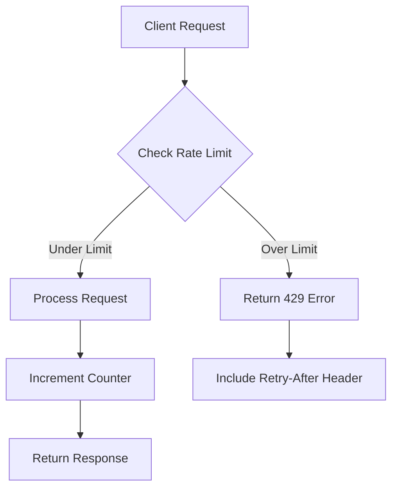
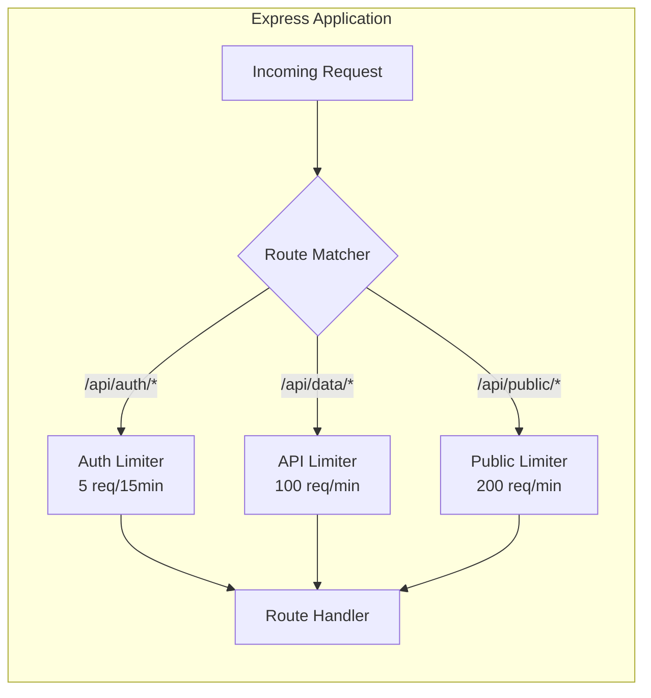
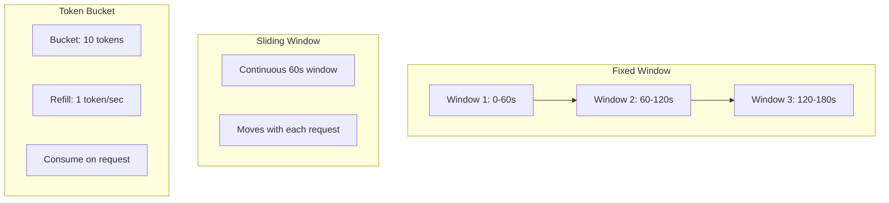
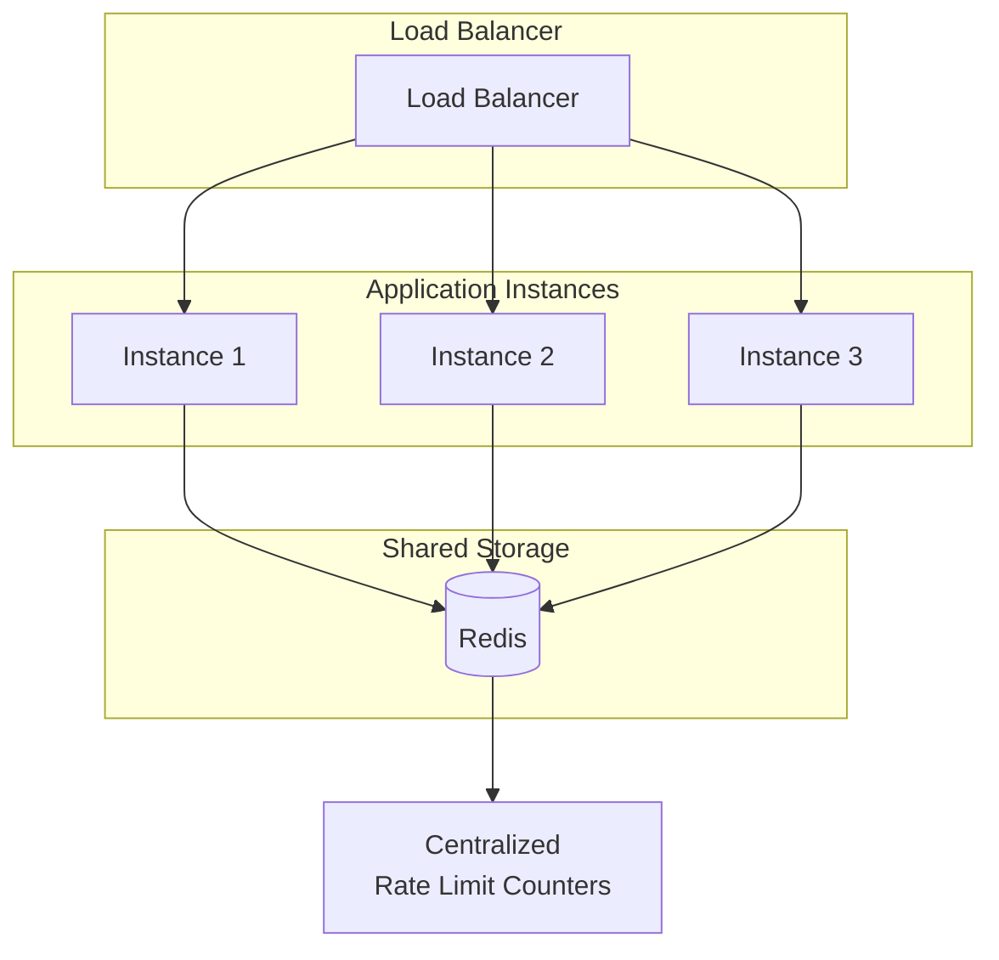
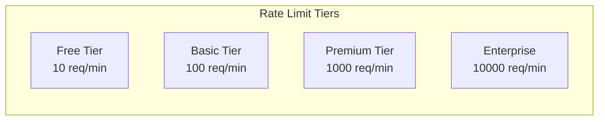

# How to Add Rate Limiting to Express APIs

Author: [nawazdhandala](https://github.com/nawazdhandala)

Tags: Express.js, Rate Limiting, API, Node.js

Description: A comprehensive guide to implementing rate limiting in Express.js APIs. Learn how to protect your endpoints from abuse, configure different limiting strategies, and implement production-ready rate limiting with Redis for distributed systems.

---

> Rate limiting is your first line of defense against API abuse. Without it, a single malicious actor or misconfigured client can overwhelm your servers, degrade performance for legitimate users, and drive up infrastructure costs. This guide walks you through implementing robust rate limiting in Express.js applications.

APIs face constant threats from various sources: automated bots scraping data, brute force attacks on authentication endpoints, accidental infinite loops in client applications, and deliberate denial-of-service attacks. Rate limiting provides a straightforward mechanism to mitigate these risks by controlling how many requests a client can make within a specified time window.

---

## Understanding Rate Limiting

Rate limiting restricts the number of requests a client can make to your API within a defined time period. When a client exceeds this limit, the server responds with a 429 (Too Many Requests) status code.

### How Rate Limiting Works



### Why Rate Limiting Matters

| Threat Type | Without Rate Limiting | With Rate Limiting |
|-------------|----------------------|-------------------|
| Brute Force Attacks | Unlimited password attempts | Limited to safe threshold |
| DDoS Attacks | Server overwhelmed | Traffic controlled |
| API Scraping | Data harvested freely | Access restricted |
| Resource Exhaustion | Costs spiral | Predictable usage |
| Accidental Loops | System crashes | Graceful degradation |

---

## Getting Started with express-rate-limit

The `express-rate-limit` package is the most popular and battle-tested solution for rate limiting in Express applications. It provides a simple middleware that tracks request counts and enforces limits.

### Installation

Install the package using npm or yarn:

```bash
npm install express-rate-limit
```

Or with yarn:

```bash
yarn add express-rate-limit
```

### Basic Implementation

This example creates a simple rate limiter that allows 100 requests per 15-minute window for each IP address:

```javascript
// server.js
// Import required modules
const express = require('express');
const rateLimit = require('express-rate-limit');

// Create Express application
const app = express();

// Configure the rate limiter middleware
// This limiter allows 100 requests per 15 minutes per IP
const limiter = rateLimit({
    // Time window in milliseconds (15 minutes)
    windowMs: 15 * 60 * 1000,

    // Maximum number of requests allowed per window
    max: 100,

    // Response message when limit is exceeded
    message: {
        status: 429,
        error: 'Too many requests',
        message: 'You have exceeded the rate limit. Please try again later.'
    },

    // Enable standard rate limit headers (RateLimit-*)
    standardHeaders: true,

    // Disable legacy X-RateLimit-* headers
    legacyHeaders: false
});

// Apply rate limiter to all routes
app.use(limiter);

// Define your API routes
app.get('/api/data', (req, res) => {
    res.json({ message: 'Hello, World!' });
});

// Start the server
const PORT = process.env.PORT || 3000;
app.listen(PORT, () => {
    console.log(`Server running on port ${PORT}`);
});
```

---

## Understanding Rate Limit Headers

When rate limiting is active, your API should communicate limit information to clients through HTTP headers. This allows clients to implement backoff strategies and avoid hitting limits.

### Standard Headers

The `express-rate-limit` package supports both standard and legacy header formats:

| Header | Description | Example |
|--------|-------------|---------|
| `RateLimit-Limit` | Maximum requests allowed | 100 |
| `RateLimit-Remaining` | Requests remaining in window | 95 |
| `RateLimit-Reset` | Seconds until window resets | 900 |
| `Retry-After` | Seconds to wait (on 429) | 60 |

### Header Configuration Example

This example shows how to configure headers for maximum client compatibility:

```javascript
// rate-limit-config.js
// Configure rate limiter with detailed header options
const rateLimit = require('express-rate-limit');

const limiter = rateLimit({
    windowMs: 60 * 1000, // 1 minute
    max: 60, // 60 requests per minute

    // Enable standard headers (recommended)
    standardHeaders: true,

    // Optionally keep legacy headers for older clients
    legacyHeaders: true,

    // Custom header behavior
    headers: true,

    // Custom function to generate Retry-After value
    // Returns seconds until the client can retry
    handler: (req, res, next, options) => {
        res.status(429).json({
            error: 'Too Many Requests',
            message: `Rate limit exceeded. Try again in ${Math.ceil(options.windowMs / 1000)} seconds.`,
            retryAfter: Math.ceil(options.windowMs / 1000)
        });
    }
});

module.exports = limiter;
```

---

## Route-Specific Rate Limiting

Different endpoints have different security requirements. Authentication endpoints need stricter limits than read-only data endpoints. You can apply different rate limiters to different routes.

### Rate Limiting Architecture



### Implementation

This example demonstrates applying different rate limits to different route groups:

```javascript
// app.js
// Import required modules
const express = require('express');
const rateLimit = require('express-rate-limit');

const app = express();

// Parse JSON request bodies
app.use(express.json());

// Create strict rate limiter for authentication routes
// Prevents brute force attacks by limiting login attempts
const authLimiter = rateLimit({
    windowMs: 15 * 60 * 1000, // 15 minutes
    max: 5, // Only 5 attempts per window
    message: {
        error: 'Too many authentication attempts',
        message: 'Please wait 15 minutes before trying again'
    },
    // Do not count successful requests against the limit
    skipSuccessfulRequests: true,
    standardHeaders: true,
    legacyHeaders: false
});

// Create moderate rate limiter for general API routes
// Balances usability with protection
const apiLimiter = rateLimit({
    windowMs: 60 * 1000, // 1 minute
    max: 100, // 100 requests per minute
    message: {
        error: 'API rate limit exceeded',
        message: 'Too many requests, please slow down'
    },
    standardHeaders: true,
    legacyHeaders: false
});

// Create lenient rate limiter for public endpoints
// Allows higher traffic for non-sensitive data
const publicLimiter = rateLimit({
    windowMs: 60 * 1000, // 1 minute
    max: 200, // 200 requests per minute
    message: {
        error: 'Rate limit exceeded'
    },
    standardHeaders: true,
    legacyHeaders: false
});

// Apply limiters to specific route groups
// Order matters: more specific routes should come first
app.use('/api/auth', authLimiter);
app.use('/api/v1', apiLimiter);
app.use('/public', publicLimiter);

// Authentication routes
app.post('/api/auth/login', (req, res) => {
    // Login logic here
    res.json({ token: 'jwt-token-here' });
});

app.post('/api/auth/register', (req, res) => {
    // Registration logic here
    res.json({ message: 'User registered' });
});

// Protected API routes
app.get('/api/v1/users', (req, res) => {
    res.json({ users: [] });
});

// Public routes
app.get('/public/health', (req, res) => {
    res.json({ status: 'healthy' });
});

const PORT = process.env.PORT || 3000;
app.listen(PORT, () => {
    console.log(`Server running on port ${PORT}`);
});
```

---

## Rate Limiting Algorithms

Understanding the algorithms behind rate limiting helps you choose the right approach for your use case.

### Algorithm Comparison



### Algorithm Comparison Table

| Algorithm | Pros | Cons | Best Use Case |
|-----------|------|------|---------------|
| Fixed Window | Simple, low memory | Burst at boundaries | Basic protection |
| Sliding Window Log | Very accurate | High memory usage | Small user base |
| Sliding Window Counter | Accurate, efficient | Slightly complex | Most production APIs |
| Token Bucket | Allows bursts | More complex | APIs needing burst capacity |
| Leaky Bucket | Smooth output | No burst allowed | Consistent rate requirements |

### Fixed Window Implementation

The fixed window algorithm is the simplest approach. It divides time into fixed windows and counts requests within each window:

```javascript
// fixed-window-limiter.js
// Custom fixed window rate limiter implementation
class FixedWindowLimiter {
    constructor(options) {
        // Time window duration in milliseconds
        this.windowMs = options.windowMs || 60000;
        // Maximum requests allowed per window
        this.maxRequests = options.maxRequests || 100;
        // Store for tracking requests per client
        this.windows = new Map();
    }

    // Generate a unique key for the current window
    getWindowKey(identifier) {
        // Calculate window start time
        const windowStart = Math.floor(Date.now() / this.windowMs);
        return `${identifier}:${windowStart}`;
    }

    // Check if a request is allowed and record it
    isAllowed(identifier) {
        const key = this.getWindowKey(identifier);
        const current = this.windows.get(key) || 0;

        // Check if limit exceeded
        if (current >= this.maxRequests) {
            return {
                allowed: false,
                remaining: 0,
                resetTime: this.getResetTime()
            };
        }

        // Increment counter
        this.windows.set(key, current + 1);

        // Periodically clean up old windows to prevent memory leaks
        if (Math.random() < 0.01) {
            this.cleanup();
        }

        return {
            allowed: true,
            remaining: this.maxRequests - current - 1,
            resetTime: this.getResetTime()
        };
    }

    // Calculate when the current window resets
    getResetTime() {
        const windowStart = Math.floor(Date.now() / this.windowMs) * this.windowMs;
        return windowStart + this.windowMs;
    }

    // Remove expired window entries
    cleanup() {
        const currentWindow = Math.floor(Date.now() / this.windowMs);

        for (const [key] of this.windows) {
            const [, windowNum] = key.split(':');
            // Remove windows older than 2 periods
            if (parseInt(windowNum) < currentWindow - 1) {
                this.windows.delete(key);
            }
        }
    }
}

// Create Express middleware from the limiter
function createFixedWindowMiddleware(options) {
    const limiter = new FixedWindowLimiter(options);

    return (req, res, next) => {
        // Use IP address as client identifier
        const identifier = req.ip;
        const result = limiter.isAllowed(identifier);

        // Set rate limit headers
        res.set('RateLimit-Limit', options.maxRequests);
        res.set('RateLimit-Remaining', Math.max(0, result.remaining));
        res.set('RateLimit-Reset', Math.ceil(result.resetTime / 1000));

        if (!result.allowed) {
            const retryAfter = Math.ceil((result.resetTime - Date.now()) / 1000);
            res.set('Retry-After', retryAfter);

            return res.status(429).json({
                error: 'Too Many Requests',
                message: 'Rate limit exceeded',
                retryAfter: retryAfter
            });
        }

        next();
    };
}

module.exports = { FixedWindowLimiter, createFixedWindowMiddleware };
```

### Token Bucket Implementation

The token bucket algorithm allows for controlled bursts while maintaining an average rate:

```javascript
// token-bucket-limiter.js
// Token bucket rate limiter implementation
class TokenBucketLimiter {
    constructor(options) {
        // Maximum number of tokens (burst capacity)
        this.bucketSize = options.bucketSize || 10;
        // Tokens added per second
        this.refillRate = options.refillRate || 1;
        // Store for client buckets
        this.buckets = new Map();
    }

    // Get or create a bucket for a client
    getBucket(identifier) {
        if (!this.buckets.has(identifier)) {
            this.buckets.set(identifier, {
                tokens: this.bucketSize,
                lastRefill: Date.now()
            });
        }
        return this.buckets.get(identifier);
    }

    // Refill tokens based on elapsed time
    refillBucket(bucket) {
        const now = Date.now();
        const timePassed = (now - bucket.lastRefill) / 1000;
        const tokensToAdd = timePassed * this.refillRate;

        // Add tokens but do not exceed bucket size
        bucket.tokens = Math.min(
            this.bucketSize,
            bucket.tokens + tokensToAdd
        );
        bucket.lastRefill = now;
    }

    // Attempt to consume tokens for a request
    consume(identifier, tokensRequired = 1) {
        const bucket = this.getBucket(identifier);
        this.refillBucket(bucket);

        if (bucket.tokens >= tokensRequired) {
            bucket.tokens -= tokensRequired;
            return {
                allowed: true,
                remaining: Math.floor(bucket.tokens),
                retryAfter: 0
            };
        }

        // Calculate wait time for required tokens
        const tokensNeeded = tokensRequired - bucket.tokens;
        const waitTime = tokensNeeded / this.refillRate;

        return {
            allowed: false,
            remaining: 0,
            retryAfter: Math.ceil(waitTime)
        };
    }

    // Clean up idle buckets to prevent memory leaks
    cleanup(maxIdleSeconds = 3600) {
        const now = Date.now();
        const maxIdleMs = maxIdleSeconds * 1000;

        for (const [identifier, bucket] of this.buckets) {
            if (now - bucket.lastRefill > maxIdleMs) {
                this.buckets.delete(identifier);
            }
        }
    }
}

// Create Express middleware from token bucket limiter
function createTokenBucketMiddleware(options) {
    const limiter = new TokenBucketLimiter(options);

    // Set up periodic cleanup every hour
    setInterval(() => limiter.cleanup(), 3600000);

    return (req, res, next) => {
        const identifier = req.ip;
        // Allow different endpoints to cost different amounts
        const cost = req.rateLimitCost || 1;
        const result = limiter.consume(identifier, cost);

        res.set('RateLimit-Limit', options.bucketSize);
        res.set('RateLimit-Remaining', result.remaining);

        if (!result.allowed) {
            res.set('Retry-After', result.retryAfter);

            return res.status(429).json({
                error: 'Too Many Requests',
                message: 'Rate limit exceeded',
                retryAfter: result.retryAfter
            });
        }

        next();
    };
}

module.exports = { TokenBucketLimiter, createTokenBucketMiddleware };
```

---

## Distributed Rate Limiting with Redis

When running multiple instances of your application (for scalability or high availability), in-memory rate limiting becomes ineffective because each instance maintains its own counter. Redis provides a shared store that all instances can use.

### Distributed Architecture



### Installation

Install the required packages:

```bash
npm install express-rate-limit rate-limit-redis ioredis
```

### Redis Store Implementation

This example configures rate limiting with Redis for distributed deployments:

```javascript
// redis-rate-limit.js
// Distributed rate limiting with Redis
const express = require('express');
const rateLimit = require('express-rate-limit');
const RedisStore = require('rate-limit-redis');
const Redis = require('ioredis');

// Create Express application
const app = express();

// Initialize Redis client with connection options
const redis = new Redis({
    host: process.env.REDIS_HOST || 'localhost',
    port: process.env.REDIS_PORT || 6379,
    password: process.env.REDIS_PASSWORD || undefined,
    // Enable TLS for production
    tls: process.env.NODE_ENV === 'production' ? {} : undefined,
    // Retry strategy for connection failures
    retryStrategy: (times) => {
        const delay = Math.min(times * 50, 2000);
        return delay;
    }
});

// Handle Redis connection events
redis.on('connect', () => {
    console.log('Connected to Redis');
});

redis.on('error', (err) => {
    console.error('Redis connection error:', err);
});

// Create rate limiter with Redis store
const limiter = rateLimit({
    windowMs: 15 * 60 * 1000, // 15 minutes
    max: 100, // Limit each IP to 100 requests per window

    // Use Redis store for distributed rate limiting
    store: new RedisStore({
        // Function to execute Redis commands
        sendCommand: (...args) => redis.call(...args),
        // Prefix for Redis keys
        prefix: 'rl:'
    }),

    // Customize response for rate limited requests
    message: {
        error: 'Too many requests',
        message: 'Please try again later'
    },

    standardHeaders: true,
    legacyHeaders: false
});

// Apply rate limiter globally
app.use(limiter);

// API routes
app.get('/api/data', (req, res) => {
    res.json({ message: 'Success' });
});

// Graceful shutdown
process.on('SIGTERM', async () => {
    console.log('Shutting down gracefully');
    await redis.quit();
    process.exit(0);
});

const PORT = process.env.PORT || 3000;
app.listen(PORT, () => {
    console.log(`Server running on port ${PORT}`);
});
```

### Custom Redis Rate Limiter

For more control, you can implement a custom Redis-based rate limiter:

```javascript
// custom-redis-limiter.js
// Custom sliding window rate limiter using Redis
const Redis = require('ioredis');

class RedisSlidingWindowLimiter {
    constructor(redis, options) {
        this.redis = redis;
        this.windowMs = options.windowMs || 60000;
        this.maxRequests = options.maxRequests || 100;
        this.keyPrefix = options.keyPrefix || 'ratelimit:';
    }

    // Check if request is allowed using sliding window algorithm
    async isAllowed(identifier) {
        const now = Date.now();
        const windowStart = now - this.windowMs;
        const key = `${this.keyPrefix}${identifier}`;

        // Use Redis transaction for atomic operations
        const pipeline = this.redis.pipeline();

        // Remove entries outside the current window
        pipeline.zremrangebyscore(key, '-inf', windowStart);

        // Count current entries in window
        pipeline.zcard(key);

        // Add current request with timestamp as score
        pipeline.zadd(key, now, `${now}-${Math.random()}`);

        // Set key expiration slightly longer than window
        pipeline.expire(key, Math.ceil(this.windowMs / 1000) + 1);

        // Execute all commands atomically
        const results = await pipeline.exec();

        // Get the count before adding current request
        const currentCount = results[1][1];

        // Check if limit is exceeded
        if (currentCount >= this.maxRequests) {
            return {
                allowed: false,
                remaining: 0,
                resetTime: now + this.windowMs
            };
        }

        return {
            allowed: true,
            remaining: this.maxRequests - currentCount - 1,
            resetTime: now + this.windowMs
        };
    }
}

// Create Express middleware
function createRedisSlidingWindowMiddleware(redis, options) {
    const limiter = new RedisSlidingWindowLimiter(redis, options);

    return async (req, res, next) => {
        try {
            const identifier = req.ip;
            const result = await limiter.isAllowed(identifier);

            res.set('RateLimit-Limit', options.maxRequests);
            res.set('RateLimit-Remaining', Math.max(0, result.remaining));
            res.set('RateLimit-Reset', Math.ceil(result.resetTime / 1000));

            if (!result.allowed) {
                const retryAfter = Math.ceil((result.resetTime - Date.now()) / 1000);
                res.set('Retry-After', retryAfter);

                return res.status(429).json({
                    error: 'Too Many Requests',
                    retryAfter: retryAfter
                });
            }

            next();
        } catch (error) {
            // Log error but allow request on Redis failure
            // This prevents rate limiting from blocking all requests if Redis is down
            console.error('Rate limit check failed:', error);
            next();
        }
    };
}

module.exports = { RedisSlidingWindowLimiter, createRedisSlidingWindowMiddleware };
```

---

## User-Based Rate Limiting

IP-based rate limiting can be problematic when multiple users share the same IP address (corporate networks, universities, public WiFi). User-based rate limiting provides fairer limits by tracking authenticated users individually.

### Implementation

This example shows how to implement rate limiting based on user identity:

```javascript
// user-rate-limit.js
// User-based rate limiting with fallback to IP
const express = require('express');
const rateLimit = require('express-rate-limit');
const RedisStore = require('rate-limit-redis');
const Redis = require('ioredis');

const app = express();
const redis = new Redis();

app.use(express.json());

// Mock authentication middleware
// In production, replace with your actual auth middleware
const authenticate = (req, res, next) => {
    const authHeader = req.headers.authorization;
    if (authHeader && authHeader.startsWith('Bearer ')) {
        // Decode and verify token (simplified for example)
        req.user = {
            id: 'user-123',
            tier: 'premium',
            role: 'user'
        };
    }
    next();
};

// Create user-based rate limiter
const userLimiter = rateLimit({
    windowMs: 60 * 1000, // 1 minute
    max: 100, // Default limit

    // Generate key based on user ID or fall back to IP
    keyGenerator: (req) => {
        if (req.user && req.user.id) {
            return `user:${req.user.id}`;
        }
        return `ip:${req.ip}`;
    },

    // Skip rate limiting for admin users
    skip: (req) => {
        return req.user && req.user.role === 'admin';
    },

    store: new RedisStore({
        sendCommand: (...args) => redis.call(...args),
        prefix: 'user-rl:'
    }),

    standardHeaders: true,
    legacyHeaders: false
});

// Apply authentication before rate limiting
app.use(authenticate);
app.use('/api', userLimiter);

app.get('/api/profile', (req, res) => {
    res.json({ user: req.user });
});

const PORT = process.env.PORT || 3000;
app.listen(PORT);
```

---

## Tiered Rate Limiting

Different user tiers (free, basic, premium, enterprise) should have different rate limits. This allows you to offer differentiated service levels and monetize API access.

### Tier Configuration



### Implementation

This example implements tiered rate limiting with configurable limits per tier:

```javascript
// tiered-rate-limit.js
// Tiered rate limiting based on user subscription level
const express = require('express');
const Redis = require('ioredis');

const app = express();
const redis = new Redis();

app.use(express.json());

// Define rate limit tiers
const RATE_LIMIT_TIERS = {
    free: {
        windowMs: 60 * 1000,
        maxRequests: 10,
        description: 'Free tier'
    },
    basic: {
        windowMs: 60 * 1000,
        maxRequests: 100,
        description: 'Basic tier'
    },
    premium: {
        windowMs: 60 * 1000,
        maxRequests: 1000,
        description: 'Premium tier'
    },
    enterprise: {
        windowMs: 60 * 1000,
        maxRequests: 10000,
        description: 'Enterprise tier'
    }
};

// Tiered rate limiter class
class TieredRateLimiter {
    constructor(redis, tiers) {
        this.redis = redis;
        this.tiers = tiers;
    }

    async isAllowed(identifier, tierName) {
        const tier = this.tiers[tierName] || this.tiers.free;
        const key = `tiered:${tierName}:${identifier}`;
        const now = Date.now();
        const windowStart = now - tier.windowMs;

        // Use Redis transaction
        const pipeline = this.redis.pipeline();
        pipeline.zremrangebyscore(key, '-inf', windowStart);
        pipeline.zcard(key);
        pipeline.zadd(key, now, `${now}-${Math.random()}`);
        pipeline.expire(key, Math.ceil(tier.windowMs / 1000) + 1);

        const results = await pipeline.exec();
        const currentCount = results[1][1];

        return {
            allowed: currentCount < tier.maxRequests,
            remaining: Math.max(0, tier.maxRequests - currentCount - 1),
            limit: tier.maxRequests,
            tier: tierName,
            resetTime: now + tier.windowMs
        };
    }
}

const tieredLimiter = new TieredRateLimiter(redis, RATE_LIMIT_TIERS);

// Mock authentication middleware
const authenticate = (req, res, next) => {
    // In production, decode JWT or lookup user
    const apiKey = req.headers['x-api-key'];

    if (apiKey === 'premium-key') {
        req.user = { id: 'user-1', tier: 'premium' };
    } else if (apiKey === 'basic-key') {
        req.user = { id: 'user-2', tier: 'basic' };
    } else {
        req.user = { id: req.ip, tier: 'free' };
    }

    next();
};

// Tiered rate limit middleware
const tieredRateLimitMiddleware = async (req, res, next) => {
    try {
        const identifier = req.user.id;
        const tier = req.user.tier;
        const result = await tieredLimiter.isAllowed(identifier, tier);

        // Set headers
        res.set('RateLimit-Limit', result.limit);
        res.set('RateLimit-Remaining', result.remaining);
        res.set('RateLimit-Reset', Math.ceil(result.resetTime / 1000));
        res.set('X-RateLimit-Tier', result.tier);

        if (!result.allowed) {
            const retryAfter = Math.ceil((result.resetTime - Date.now()) / 1000);
            res.set('Retry-After', retryAfter);

            return res.status(429).json({
                error: 'Rate limit exceeded',
                tier: result.tier,
                limit: result.limit,
                retryAfter: retryAfter,
                upgradeUrl: '/pricing'
            });
        }

        next();
    } catch (error) {
        console.error('Tiered rate limit error:', error);
        next();
    }
};

// Apply middlewares
app.use(authenticate);
app.use('/api', tieredRateLimitMiddleware);

app.get('/api/data', (req, res) => {
    res.json({
        data: 'Success',
        tier: req.user.tier
    });
});

const PORT = process.env.PORT || 3000;
app.listen(PORT);
```

---

## Cost-Based Rate Limiting

Not all API endpoints consume the same resources. A simple read operation costs less than a complex report generation. Cost-based rate limiting assigns different "costs" to different endpoints, allowing you to more accurately reflect resource usage.

### Implementation

This example implements cost-based rate limiting where different endpoints consume different amounts from a daily budget:

```javascript
// cost-based-rate-limit.js
// Cost-based rate limiting with daily budgets
const express = require('express');
const Redis = require('ioredis');

const app = express();
const redis = new Redis();

app.use(express.json());

// Define endpoint costs
const ENDPOINT_COSTS = {
    'GET /api/users': 1,
    'GET /api/users/:id': 1,
    'POST /api/users': 5,
    'PUT /api/users/:id': 3,
    'DELETE /api/users/:id': 2,
    'GET /api/reports': 10,
    'POST /api/reports/generate': 50,
    'POST /api/ai/analyze': 100
};

// Default daily budgets per tier
const DAILY_BUDGETS = {
    free: 100,
    basic: 1000,
    premium: 10000,
    enterprise: 100000
};

class CostBasedRateLimiter {
    constructor(redis, budgets) {
        this.redis = redis;
        this.budgets = budgets;
    }

    // Get the current date string for daily tracking
    getDateKey() {
        return new Date().toISOString().split('T')[0];
    }

    async consume(identifier, tier, cost) {
        const dateKey = this.getDateKey();
        const key = `budget:${dateKey}:${identifier}`;
        const budget = this.budgets[tier] || this.budgets.free;

        // Increment usage atomically
        const currentUsage = await this.redis.incrby(key, cost);

        // Set expiration if this is the first request today
        if (currentUsage === cost) {
            // Expire at end of day plus buffer
            await this.redis.expire(key, 86400 + 3600);
        }

        const remaining = budget - currentUsage;

        return {
            allowed: currentUsage <= budget,
            used: currentUsage,
            remaining: Math.max(0, remaining),
            budget: budget,
            cost: cost,
            resetsAt: this.getResetTime()
        };
    }

    getResetTime() {
        const now = new Date();
        const tomorrow = new Date(now);
        tomorrow.setDate(tomorrow.getDate() + 1);
        tomorrow.setHours(0, 0, 0, 0);
        return tomorrow.toISOString();
    }
}

const costLimiter = new CostBasedRateLimiter(redis, DAILY_BUDGETS);

// Get endpoint cost
function getEndpointCost(req) {
    // Match route pattern
    const pattern = `${req.method} ${req.route?.path || req.path}`;
    return ENDPOINT_COSTS[pattern] || 1;
}

// Mock authentication
const authenticate = (req, res, next) => {
    req.user = { id: 'user-123', tier: 'basic' };
    next();
};

// Cost-based rate limit middleware
const costBasedMiddleware = async (req, res, next) => {
    try {
        const cost = getEndpointCost(req);
        const result = await costLimiter.consume(
            req.user.id,
            req.user.tier,
            cost
        );

        // Set informative headers
        res.set('X-Budget-Limit', result.budget);
        res.set('X-Budget-Remaining', result.remaining);
        res.set('X-Budget-Used', result.used);
        res.set('X-Request-Cost', result.cost);
        res.set('X-Budget-Reset', result.resetsAt);

        if (!result.allowed) {
            return res.status(429).json({
                error: 'Daily budget exceeded',
                used: result.used,
                budget: result.budget,
                cost: result.cost,
                resetsAt: result.resetsAt,
                upgradeUrl: '/pricing'
            });
        }

        next();
    } catch (error) {
        console.error('Cost-based rate limit error:', error);
        next();
    }
};

app.use(authenticate);
app.use('/api', costBasedMiddleware);

// Define routes
app.get('/api/users', (req, res) => {
    res.json({ users: [] });
});

app.post('/api/reports/generate', (req, res) => {
    res.json({ report: 'Generated' });
});

const PORT = process.env.PORT || 3000;
app.listen(PORT);
```

---

## Handling Rate Limit Responses

Proper error handling improves the client experience and helps developers debug issues.

### Custom Error Handler

This example shows how to implement a custom error handler for rate limit responses:

```javascript
// rate-limit-handler.js
// Custom rate limit error handling
const express = require('express');
const rateLimit = require('express-rate-limit');

const app = express();

// Custom handler with detailed error information
const customHandler = (req, res, next, options) => {
    // Log the rate limit event for monitoring
    console.log({
        event: 'rate_limit_exceeded',
        ip: req.ip,
        path: req.path,
        method: req.method,
        userAgent: req.get('User-Agent'),
        timestamp: new Date().toISOString()
    });

    // Calculate retry time
    const retryAfter = Math.ceil(options.windowMs / 1000);

    // Send detailed error response
    res.status(429).json({
        error: {
            code: 'RATE_LIMIT_EXCEEDED',
            message: 'You have exceeded the rate limit for this endpoint',
            details: {
                limit: options.max,
                windowMs: options.windowMs,
                retryAfter: retryAfter
            }
        },
        meta: {
            timestamp: new Date().toISOString(),
            path: req.path,
            method: req.method
        },
        links: {
            documentation: 'https://api.example.com/docs/rate-limits',
            status: 'https://status.example.com'
        }
    });
};

// Create limiter with custom handler
const limiter = rateLimit({
    windowMs: 60 * 1000,
    max: 100,
    handler: customHandler,
    standardHeaders: true,
    legacyHeaders: false
});

app.use('/api', limiter);

app.get('/api/data', (req, res) => {
    res.json({ data: 'Success' });
});

const PORT = process.env.PORT || 3000;
app.listen(PORT);
```

---

## Monitoring and Logging

Effective monitoring helps you understand rate limiting patterns and tune your configuration.

### Comprehensive Monitoring Setup

```javascript
// rate-limit-monitoring.js
// Rate limit monitoring and logging
const express = require('express');
const rateLimit = require('express-rate-limit');

const app = express();

// Metrics collector (could be Prometheus, StatsD, etc.)
const metrics = {
    requestsTotal: 0,
    requestsAllowed: 0,
    requestsBlocked: 0,

    record(allowed) {
        this.requestsTotal++;
        if (allowed) {
            this.requestsAllowed++;
        } else {
            this.requestsBlocked++;
        }
    },

    getStats() {
        return {
            total: this.requestsTotal,
            allowed: this.requestsAllowed,
            blocked: this.requestsBlocked,
            blockRate: this.requestsTotal > 0
                ? (this.requestsBlocked / this.requestsTotal * 100).toFixed(2) + '%'
                : '0%'
        };
    }
};

// Create limiter with monitoring hooks
const monitoredLimiter = rateLimit({
    windowMs: 60 * 1000,
    max: 100,

    // Called when a client first hits the rate limit
    onLimitReached: (req, res, options) => {
        console.warn({
            event: 'rate_limit_reached',
            ip: req.ip,
            path: req.path,
            limit: options.max,
            window: options.windowMs,
            timestamp: new Date().toISOString()
        });
    },

    // Custom handler to track blocked requests
    handler: (req, res, next, options) => {
        metrics.record(false);

        res.status(429).json({
            error: 'Rate limit exceeded',
            retryAfter: Math.ceil(options.windowMs / 1000)
        });
    },

    // Custom key generator with logging
    keyGenerator: (req) => {
        const key = req.ip;
        metrics.record(true);
        return key;
    },

    standardHeaders: true,
    legacyHeaders: false
});

app.use('/api', monitoredLimiter);

// Metrics endpoint for monitoring systems
app.get('/metrics', (req, res) => {
    res.json({
        rateLimit: metrics.getStats(),
        timestamp: new Date().toISOString()
    });
});

app.get('/api/data', (req, res) => {
    res.json({ data: 'Success' });
});

const PORT = process.env.PORT || 3000;
app.listen(PORT);
```

---

## Best Practices

### 1. Choose the Right Algorithm

Select your rate limiting algorithm based on your specific needs:

- **Fixed Window**: Simple applications with predictable traffic
- **Sliding Window**: Most production APIs requiring accuracy
- **Token Bucket**: APIs that need to allow legitimate burst traffic

### 2. Set Appropriate Limits

Start conservative and adjust based on actual usage patterns:

```javascript
// Start with these baseline limits and adjust
const RECOMMENDED_LIMITS = {
    // Authentication: Prevent brute force
    auth: { windowMs: 15 * 60 * 1000, max: 5 },

    // General API: Balance usability and protection
    api: { windowMs: 60 * 1000, max: 100 },

    // Search/Heavy operations: Limit resource-intensive endpoints
    heavy: { windowMs: 60 * 1000, max: 10 },

    // Webhooks: Allow higher limits for automated systems
    webhooks: { windowMs: 60 * 1000, max: 1000 }
};
```

### 3. Always Return Headers

Help clients implement proper backoff strategies:

```javascript
// Always include these headers in responses
const setRateLimitHeaders = (res, limit, remaining, resetTime) => {
    res.set({
        'RateLimit-Limit': limit,
        'RateLimit-Remaining': remaining,
        'RateLimit-Reset': Math.ceil(resetTime / 1000),
        // On 429 responses, also include:
        'Retry-After': Math.ceil((resetTime - Date.now()) / 1000)
    });
};
```

### 4. Implement Graceful Degradation

Do not let rate limiting failures block legitimate traffic:

```javascript
// Fail open when rate limit service is unavailable
const rateLimitMiddleware = async (req, res, next) => {
    try {
        const result = await checkRateLimit(req.ip);
        if (!result.allowed) {
            return res.status(429).json({ error: 'Rate limited' });
        }
        next();
    } catch (error) {
        // Log the error but allow the request
        console.error('Rate limit check failed:', error);
        next();
    }
};
```

### 5. Exempt Health Checks

Do not rate limit health check endpoints used by load balancers:

```javascript
const limiter = rateLimit({
    windowMs: 60 * 1000,
    max: 100,
    skip: (req) => {
        // Skip rate limiting for health checks
        const exemptPaths = ['/health', '/ready', '/live', '/metrics'];
        return exemptPaths.includes(req.path);
    }
});
```

### 6. Consider Allowlists

Allow trusted clients to bypass rate limits:

```javascript
// Allowlist configuration
const ALLOWLISTED_IPS = [
    '10.0.0.0/8',      // Internal network
    '192.168.1.0/24',  // Office network
];

const ALLOWLISTED_API_KEYS = [
    'trusted-partner-key-1',
    'internal-service-key-1'
];

const limiter = rateLimit({
    windowMs: 60 * 1000,
    max: 100,
    skip: (req) => {
        // Check IP allowlist
        if (isIpAllowlisted(req.ip, ALLOWLISTED_IPS)) {
            return true;
        }
        // Check API key allowlist
        const apiKey = req.headers['x-api-key'];
        if (ALLOWLISTED_API_KEYS.includes(apiKey)) {
            return true;
        }
        return false;
    }
});
```

---

## Testing Rate Limits

### Manual Testing

Use curl to test your rate limits:

```bash
# Test rate limit by sending multiple requests
for i in {1..10}; do
  curl -i http://localhost:3000/api/data
  echo ""
done
```

### Automated Testing

This example shows how to write tests for rate limiting behavior:

```javascript
// rate-limit.test.js
// Testing rate limits with Jest and Supertest
const request = require('supertest');
const express = require('express');
const rateLimit = require('express-rate-limit');

describe('Rate Limiting', () => {
    let app;

    beforeEach(() => {
        app = express();

        const limiter = rateLimit({
            windowMs: 1000, // 1 second for testing
            max: 3,
            message: { error: 'Rate limited' }
        });

        app.use('/api', limiter);
        app.get('/api/test', (req, res) => {
            res.json({ success: true });
        });
    });

    test('allows requests under limit', async () => {
        const response = await request(app).get('/api/test');
        expect(response.status).toBe(200);
        expect(response.headers['ratelimit-remaining']).toBe('2');
    });

    test('blocks requests over limit', async () => {
        // Make requests up to limit
        for (let i = 0; i < 3; i++) {
            await request(app).get('/api/test');
        }

        // Next request should be blocked
        const response = await request(app).get('/api/test');
        expect(response.status).toBe(429);
        expect(response.body.error).toBe('Rate limited');
    });

    test('resets after window expires', async () => {
        // Exhaust limit
        for (let i = 0; i < 3; i++) {
            await request(app).get('/api/test');
        }

        // Wait for window to reset
        await new Promise(resolve => setTimeout(resolve, 1100));

        // Should be allowed again
        const response = await request(app).get('/api/test');
        expect(response.status).toBe(200);
    });
});
```

---

## Conclusion

Rate limiting is essential for protecting your Express.js APIs from abuse and ensuring fair resource allocation. Key takeaways:

- **Start with express-rate-limit** for simple use cases
- **Use Redis** for distributed deployments
- **Implement tiered limits** for differentiated service levels
- **Always return rate limit headers** to help clients
- **Monitor and log** rate limit events for optimization
- **Test thoroughly** to ensure limits work as expected

By implementing robust rate limiting, you protect your infrastructure, provide a fair experience for all users, and create opportunities for monetization through tiered access.

---

*Need to monitor your rate limiting in production? [OneUptime](https://oneuptime.com) provides comprehensive API monitoring with alerting for rate limit spikes and anomalies.*

**Related Reading:**
- [How to Build REST APIs with Express.js](https://oneuptime.com/blog/post/2026-01-25-create-rest-apis-expressjs)
- [How to Implement Rate Limiting in FastAPI](https://oneuptime.com/blog/post/2025-01-06-fastapi-rate-limiting)
