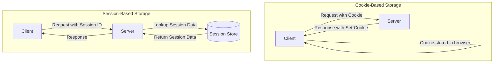
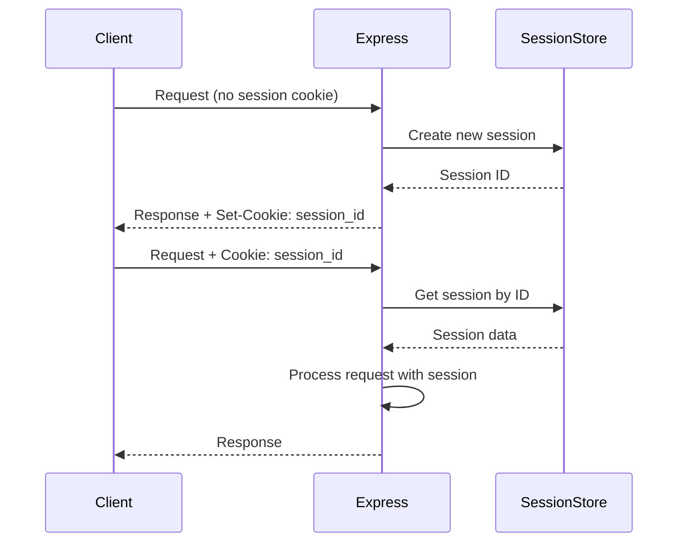
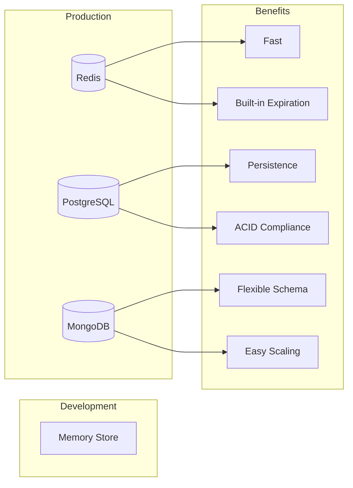
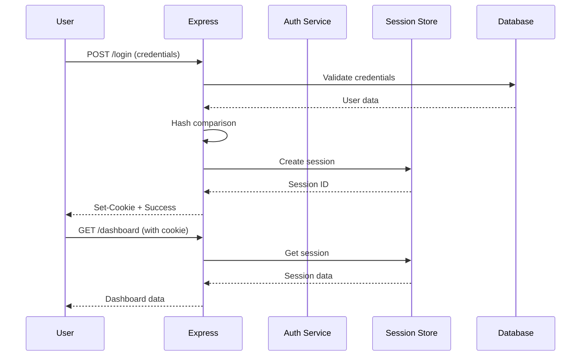

# How to Handle Sessions and Cookies in Express

Author: [nawazdhandala](https://github.com/nawazdhandala)

Tags: Express.js, Sessions, Cookies, Node.js, Authentication, Security

Description: A comprehensive guide to handling sessions and cookies in Express.js applications. Learn how to implement secure session management, configure cookies properly, use different session stores, and follow security best practices for production deployments.

---

> Sessions and cookies form the foundation of stateful web applications. Understanding how to manage them properly in Express.js is essential for building secure authentication systems, maintaining user state, and delivering personalized experiences. This guide covers everything from basic cookie handling to production-ready session management with Redis.

HTTP is a stateless protocol, meaning each request is independent and has no memory of previous interactions. Sessions and cookies solve this by allowing servers to identify users across multiple requests. While cookies store small pieces of data on the client, sessions store data on the server and use a cookie to identify the session.

---

## Understanding Sessions and Cookies

Before diving into implementation, let us understand the difference between sessions and cookies and when to use each.

### Sessions vs Cookies



### When to Use Each

| Feature | Cookies | Sessions |
|---------|---------|----------|
| Storage Location | Client browser | Server-side |
| Size Limit | 4KB per cookie | Unlimited (server memory) |
| Security | Data visible to client | Data hidden from client |
| Scalability | Stateless, easy to scale | Requires shared store |
| Use Cases | Preferences, tracking | Authentication, sensitive data |

---

## Working with Cookies in Express

Express provides built-in cookie handling through the `cookie-parser` middleware. Cookies are useful for storing non-sensitive user preferences and tracking information.

### Installation

Install the cookie-parser package:

```bash
npm install cookie-parser
```

### Basic Cookie Operations

This example demonstrates setting, reading, and deleting cookies in Express:

```javascript
// app.js
// Basic cookie handling in Express
const express = require('express');
const cookieParser = require('cookie-parser');

// Create Express application
const app = express();

// Enable cookie parsing middleware
// This parses the Cookie header and populates req.cookies
app.use(cookieParser());

// Route to set a basic cookie
// Cookies are sent to the client via the Set-Cookie response header
app.get('/set-cookie', (req, res) => {
    // Set a simple cookie with key-value pair
    // By default, cookies are session cookies (deleted when browser closes)
    res.cookie('username', 'john_doe');

    res.json({ message: 'Cookie has been set' });
});

// Route to read cookies from the request
// The cookie-parser middleware makes cookies available in req.cookies
app.get('/read-cookies', (req, res) => {
    // Access all cookies as an object
    const cookies = req.cookies;

    // Access a specific cookie
    const username = req.cookies.username;

    res.json({
        allCookies: cookies,
        username: username || 'No username cookie found'
    });
});

// Route to delete a cookie
// Clearing a cookie removes it from the client browser
app.get('/clear-cookie', (req, res) => {
    // Clear the cookie by name
    // This sends a Set-Cookie header with an expired date
    res.clearCookie('username');

    res.json({ message: 'Cookie has been cleared' });
});

// Start the server
const PORT = process.env.PORT || 3000;
app.listen(PORT, () => {
    console.log(`Server running on port ${PORT}`);
});
```

### Cookie Options

Cookies support various options that control their behavior and security. Understanding these options is critical for building secure applications.

```javascript
// cookie-options.js
// Configuring cookie options for security and functionality
const express = require('express');
const cookieParser = require('cookie-parser');

const app = express();
app.use(cookieParser());

// Route demonstrating all cookie options
app.get('/set-secure-cookie', (req, res) => {
    // Cookie options explained:
    const cookieOptions = {
        // maxAge: Cookie lifetime in milliseconds
        // After this time, the browser automatically deletes the cookie
        maxAge: 24 * 60 * 60 * 1000, // 24 hours

        // expires: Specific expiration date
        // Alternative to maxAge, sets absolute expiration
        // expires: new Date(Date.now() + 86400000),

        // httpOnly: Prevents JavaScript access to the cookie
        // Critical for security - prevents XSS attacks from stealing cookies
        httpOnly: true,

        // secure: Cookie only sent over HTTPS
        // Always enable in production to prevent cookie theft over HTTP
        secure: process.env.NODE_ENV === 'production',

        // sameSite: Controls cross-site request behavior
        // 'strict' - Cookie only sent for same-site requests
        // 'lax' - Cookie sent for same-site and top-level navigations
        // 'none' - Cookie sent for all requests (requires secure: true)
        sameSite: 'strict',

        // path: URL path where cookie is valid
        // Cookie only sent for requests to this path and subpaths
        path: '/',

        // domain: Domain where cookie is valid
        // Allows sharing cookies across subdomains
        // domain: '.example.com'
    };

    // Set cookie with security options
    res.cookie('session_token', 'abc123xyz', cookieOptions);

    res.json({ message: 'Secure cookie set' });
});

// Route demonstrating different cookie configurations
app.get('/set-multiple-cookies', (req, res) => {
    // Preference cookie - longer lived, accessible to JavaScript
    // Good for UI preferences that need client-side access
    res.cookie('theme', 'dark', {
        maxAge: 365 * 24 * 60 * 60 * 1000, // 1 year
        httpOnly: false, // Allow JavaScript access
        sameSite: 'lax'
    });

    // Authentication cookie - short lived, secure
    // Never accessible to JavaScript for security
    res.cookie('auth_token', 'secure-token-value', {
        maxAge: 60 * 60 * 1000, // 1 hour
        httpOnly: true,
        secure: process.env.NODE_ENV === 'production',
        sameSite: 'strict'
    });

    // Remember me cookie - longer authentication
    // Only set when user explicitly requests it
    res.cookie('remember_me', 'user_123', {
        maxAge: 30 * 24 * 60 * 60 * 1000, // 30 days
        httpOnly: true,
        secure: process.env.NODE_ENV === 'production',
        sameSite: 'strict'
    });

    res.json({ message: 'Multiple cookies set with different configurations' });
});

const PORT = process.env.PORT || 3000;
app.listen(PORT);
```

### Signed Cookies

Signed cookies provide integrity verification. If someone tampers with the cookie value, Express will detect it and reject the cookie.

```javascript
// signed-cookies.js
// Using signed cookies for tamper detection
const express = require('express');
const cookieParser = require('cookie-parser');

const app = express();

// Initialize cookie-parser with a secret for signing
// The secret should be a long, random string stored in environment variables
const COOKIE_SECRET = process.env.COOKIE_SECRET || 'your-super-secret-key';
app.use(cookieParser(COOKIE_SECRET));

// Route to set a signed cookie
// Signed cookies include a cryptographic signature
app.get('/set-signed-cookie', (req, res) => {
    // The third argument (true) indicates this is a signed cookie
    // Express will append a signature based on the secret
    res.cookie('user_id', '12345', {
        signed: true, // Enable signing
        httpOnly: true,
        maxAge: 24 * 60 * 60 * 1000
    });

    res.json({ message: 'Signed cookie set' });
});

// Route to read a signed cookie
// Signed cookies are accessed via req.signedCookies, not req.cookies
app.get('/read-signed-cookie', (req, res) => {
    // req.signedCookies contains verified signed cookies
    // If a cookie was tampered with, it will not appear here
    const userId = req.signedCookies.user_id;

    // req.cookies still contains unsigned cookies
    // Tampered signed cookies will appear as false in req.signedCookies

    if (userId) {
        res.json({ userId: userId, verified: true });
    } else {
        res.status(401).json({
            error: 'No valid signed cookie found',
            message: 'Cookie may be missing or tampered with'
        });
    }
});

// Middleware to verify signed cookie on protected routes
const requireSignedCookie = (req, res, next) => {
    const userId = req.signedCookies.user_id;

    if (!userId) {
        return res.status(401).json({
            error: 'Authentication required',
            message: 'Valid signed cookie not found'
        });
    }

    // Attach user ID to request for downstream handlers
    req.userId = userId;
    next();
};

// Protected route using signed cookie verification
app.get('/protected', requireSignedCookie, (req, res) => {
    res.json({
        message: 'Access granted',
        userId: req.userId
    });
});

const PORT = process.env.PORT || 3000;
app.listen(PORT);
```

---

## Session Management with express-session

While cookies are useful for simple data storage, sessions provide a more secure and flexible way to manage user state. The `express-session` middleware stores session data on the server and only sends a session ID to the client.

### Session Architecture



### Installation

Install express-session:

```bash
npm install express-session
```

### Basic Session Setup

This example shows how to configure sessions in Express:

```javascript
// session-basic.js
// Basic session configuration in Express
const express = require('express');
const session = require('express-session');

const app = express();

// Parse JSON request bodies
app.use(express.json());

// Configure session middleware
app.use(session({
    // Secret used to sign the session ID cookie
    // Use a long, random string in production
    // Store in environment variables, never in code
    secret: process.env.SESSION_SECRET || 'your-secret-key',

    // resave: Forces session to be saved back to the store
    // Set to false if your store implements the touch method
    // Prevents unnecessary writes and race conditions
    resave: false,

    // saveUninitialized: Forces uninitialized sessions to be saved
    // Set to false to comply with laws requiring user consent
    // Also reduces storage usage for anonymous users
    saveUninitialized: false,

    // Cookie configuration for the session ID
    cookie: {
        // httpOnly: Prevents client-side JavaScript access
        httpOnly: true,

        // secure: Only send cookie over HTTPS
        // Set based on environment
        secure: process.env.NODE_ENV === 'production',

        // maxAge: Session lifetime in milliseconds
        // Sessions expire after this time of inactivity
        maxAge: 24 * 60 * 60 * 1000, // 24 hours

        // sameSite: CSRF protection
        sameSite: 'strict'
    },

    // name: Custom name for the session cookie
    // Default is 'connect.sid'
    // Changing this obscures the fact you are using Express
    name: 'sessionId'
}));

// Route to create or update session data
app.post('/login', (req, res) => {
    const { username, userId } = req.body;

    // Store user information in the session
    // This data is stored on the server, not in the cookie
    req.session.user = {
        id: userId,
        username: username,
        loginTime: new Date().toISOString()
    };

    // Mark session as authenticated
    req.session.authenticated = true;

    res.json({
        message: 'Login successful',
        sessionID: req.sessionID
    });
});

// Route to read session data
app.get('/profile', (req, res) => {
    // Check if user is authenticated
    if (!req.session.authenticated) {
        return res.status(401).json({ error: 'Not authenticated' });
    }

    // Access stored session data
    res.json({
        user: req.session.user,
        sessionID: req.sessionID
    });
});

// Route to destroy session (logout)
app.post('/logout', (req, res) => {
    // Destroy the session completely
    // This removes all session data and invalidates the session ID
    req.session.destroy((err) => {
        if (err) {
            return res.status(500).json({ error: 'Logout failed' });
        }

        // Clear the session cookie from the client
        res.clearCookie('sessionId');

        res.json({ message: 'Logged out successfully' });
    });
});

// Route to regenerate session ID
// Use this after privilege escalation (e.g., login) to prevent session fixation
app.post('/regenerate-session', (req, res) => {
    // Store current session data
    const sessionData = { ...req.session };

    // Regenerate creates a new session ID while preserving data
    req.session.regenerate((err) => {
        if (err) {
            return res.status(500).json({ error: 'Session regeneration failed' });
        }

        // Restore session data with new ID
        Object.assign(req.session, sessionData);

        res.json({
            message: 'Session regenerated',
            newSessionID: req.sessionID
        });
    });
});

const PORT = process.env.PORT || 3000;
app.listen(PORT, () => {
    console.log(`Server running on port ${PORT}`);
});
```

---

## Session Stores

By default, express-session uses in-memory storage, which is not suitable for production. Memory stores lose data on server restart and cannot be shared across multiple server instances. Production applications need a persistent session store.

### Session Store Comparison



### Redis Session Store

Redis is the most popular choice for session storage due to its speed and built-in expiration support.

```bash
npm install connect-redis ioredis
```

```javascript
// session-redis.js
// Production-ready session management with Redis
const express = require('express');
const session = require('express-session');
const RedisStore = require('connect-redis').default;
const Redis = require('ioredis');

const app = express();
app.use(express.json());

// Create Redis client with connection options
const redisClient = new Redis({
    host: process.env.REDIS_HOST || 'localhost',
    port: process.env.REDIS_PORT || 6379,
    password: process.env.REDIS_PASSWORD || undefined,

    // Enable TLS in production
    tls: process.env.NODE_ENV === 'production' ? {} : undefined,

    // Retry strategy for connection failures
    retryStrategy: (times) => {
        // Exponential backoff with max delay of 2 seconds
        const delay = Math.min(times * 50, 2000);
        return delay;
    },

    // Maximum retries before giving up
    maxRetriesPerRequest: 3
});

// Handle Redis connection events for monitoring
redisClient.on('connect', () => {
    console.log('Connected to Redis');
});

redisClient.on('error', (err) => {
    console.error('Redis connection error:', err);
});

redisClient.on('reconnecting', () => {
    console.log('Reconnecting to Redis...');
});

// Create Redis session store
const redisStore = new RedisStore({
    client: redisClient,

    // Prefix for session keys in Redis
    // Helps identify session keys in Redis
    prefix: 'sess:',

    // TTL in seconds (matches cookie maxAge)
    // Sessions automatically expire in Redis
    ttl: 86400, // 24 hours

    // Disable touch to reduce Redis writes
    // Touch updates the session expiration on each request
    disableTouch: false
});

// Configure session with Redis store
app.use(session({
    store: redisStore,
    secret: process.env.SESSION_SECRET || 'your-secret-key',
    resave: false,
    saveUninitialized: false,
    cookie: {
        httpOnly: true,
        secure: process.env.NODE_ENV === 'production',
        maxAge: 24 * 60 * 60 * 1000,
        sameSite: 'strict'
    },
    name: 'sessionId'
}));

// Login route
app.post('/login', (req, res) => {
    const { username, userId } = req.body;

    req.session.user = {
        id: userId,
        username: username,
        loginTime: new Date().toISOString()
    };
    req.session.authenticated = true;

    res.json({ message: 'Login successful' });
});

// Profile route
app.get('/profile', (req, res) => {
    if (!req.session.authenticated) {
        return res.status(401).json({ error: 'Not authenticated' });
    }

    res.json({ user: req.session.user });
});

// Logout route
app.post('/logout', (req, res) => {
    req.session.destroy((err) => {
        if (err) {
            return res.status(500).json({ error: 'Logout failed' });
        }
        res.clearCookie('sessionId');
        res.json({ message: 'Logged out successfully' });
    });
});

// Graceful shutdown handling
process.on('SIGTERM', async () => {
    console.log('Shutting down gracefully...');
    await redisClient.quit();
    process.exit(0);
});

const PORT = process.env.PORT || 3000;
app.listen(PORT, () => {
    console.log(`Server running on port ${PORT}`);
});
```

### PostgreSQL Session Store

For applications already using PostgreSQL, storing sessions in the database provides consistency and eliminates additional infrastructure.

```bash
npm install connect-pg-simple pg
```

```javascript
// session-postgresql.js
// Session management with PostgreSQL
const express = require('express');
const session = require('express-session');
const pgSession = require('connect-pg-simple')(session);
const { Pool } = require('pg');

const app = express();
app.use(express.json());

// Create PostgreSQL connection pool
const pool = new Pool({
    host: process.env.PG_HOST || 'localhost',
    port: process.env.PG_PORT || 5432,
    database: process.env.PG_DATABASE || 'myapp',
    user: process.env.PG_USER || 'postgres',
    password: process.env.PG_PASSWORD,

    // Connection pool settings
    max: 20, // Maximum connections in pool
    idleTimeoutMillis: 30000, // Close idle connections after 30s
    connectionTimeoutMillis: 2000 // Timeout for new connections
});

// Note: You need to create the session table in PostgreSQL
// Run this SQL before starting the application:
/*
CREATE TABLE "session" (
    "sid" varchar NOT NULL COLLATE "default",
    "sess" json NOT NULL,
    "expire" timestamp(6) NOT NULL
)
WITH (OIDS=FALSE);

ALTER TABLE "session" ADD CONSTRAINT "session_pkey" PRIMARY KEY ("sid");

CREATE INDEX "IDX_session_expire" ON "session" ("expire");
*/

// Configure session with PostgreSQL store
app.use(session({
    store: new pgSession({
        pool: pool,

        // Table name for sessions
        tableName: 'session',

        // Prune expired sessions periodically
        // Interval in seconds (default: 60)
        pruneSessionInterval: 60,

        // Custom error handler
        errorLog: (error) => {
            console.error('Session store error:', error);
        }
    }),
    secret: process.env.SESSION_SECRET || 'your-secret-key',
    resave: false,
    saveUninitialized: false,
    cookie: {
        httpOnly: true,
        secure: process.env.NODE_ENV === 'production',
        maxAge: 24 * 60 * 60 * 1000,
        sameSite: 'strict'
    },
    name: 'sessionId'
}));

// Routes (same as previous examples)
app.post('/login', (req, res) => {
    const { username, userId } = req.body;
    req.session.user = { id: userId, username: username };
    req.session.authenticated = true;
    res.json({ message: 'Login successful' });
});

app.get('/profile', (req, res) => {
    if (!req.session.authenticated) {
        return res.status(401).json({ error: 'Not authenticated' });
    }
    res.json({ user: req.session.user });
});

app.post('/logout', (req, res) => {
    req.session.destroy((err) => {
        if (err) {
            return res.status(500).json({ error: 'Logout failed' });
        }
        res.clearCookie('sessionId');
        res.json({ message: 'Logged out successfully' });
    });
});

const PORT = process.env.PORT || 3000;
app.listen(PORT, () => {
    console.log(`Server running on port ${PORT}`);
});
```

---

## Implementing Authentication with Sessions

Building a complete authentication system requires proper session management, password handling, and security measures.

### Authentication Flow



### Complete Authentication Example

This example demonstrates a production-ready authentication system:

```javascript
// auth-system.js
// Complete authentication system with sessions
const express = require('express');
const session = require('express-session');
const RedisStore = require('connect-redis').default;
const Redis = require('ioredis');
const bcrypt = require('bcrypt');
const crypto = require('crypto');

const app = express();
app.use(express.json());

// Redis setup
const redisClient = new Redis({
    host: process.env.REDIS_HOST || 'localhost',
    port: process.env.REDIS_PORT || 6379
});

const redisStore = new RedisStore({
    client: redisClient,
    prefix: 'sess:'
});

// Session configuration
app.use(session({
    store: redisStore,
    secret: process.env.SESSION_SECRET || 'your-super-secret-key',
    resave: false,
    saveUninitialized: false,
    cookie: {
        httpOnly: true,
        secure: process.env.NODE_ENV === 'production',
        maxAge: 24 * 60 * 60 * 1000,
        sameSite: 'strict'
    },
    name: 'sessionId'
}));

// Mock user database (replace with actual database)
const users = new Map();

// Helper function to hash passwords
async function hashPassword(password) {
    const saltRounds = 12;
    return await bcrypt.hash(password, saltRounds);
}

// Helper function to verify passwords
async function verifyPassword(password, hash) {
    return await bcrypt.compare(password, hash);
}

// Registration endpoint
app.post('/auth/register', async (req, res) => {
    try {
        const { email, password, name } = req.body;

        // Validate input
        if (!email || !password || !name) {
            return res.status(400).json({
                error: 'Missing required fields'
            });
        }

        // Check if user already exists
        if (users.has(email)) {
            return res.status(409).json({
                error: 'User already exists'
            });
        }

        // Hash password before storing
        const passwordHash = await hashPassword(password);

        // Create user
        const userId = crypto.randomUUID();
        const user = {
            id: userId,
            email: email,
            name: name,
            passwordHash: passwordHash,
            createdAt: new Date().toISOString()
        };

        users.set(email, user);

        res.status(201).json({
            message: 'Registration successful',
            userId: userId
        });

    } catch (error) {
        console.error('Registration error:', error);
        res.status(500).json({ error: 'Registration failed' });
    }
});

// Login endpoint
app.post('/auth/login', async (req, res) => {
    try {
        const { email, password } = req.body;

        // Validate input
        if (!email || !password) {
            return res.status(400).json({
                error: 'Email and password required'
            });
        }

        // Find user
        const user = users.get(email);
        if (!user) {
            // Use same message to prevent user enumeration
            return res.status(401).json({
                error: 'Invalid credentials'
            });
        }

        // Verify password
        const isValid = await verifyPassword(password, user.passwordHash);
        if (!isValid) {
            return res.status(401).json({
                error: 'Invalid credentials'
            });
        }

        // Regenerate session to prevent session fixation attacks
        req.session.regenerate((err) => {
            if (err) {
                console.error('Session regeneration error:', err);
                return res.status(500).json({ error: 'Login failed' });
            }

            // Store user info in session (never store password)
            req.session.user = {
                id: user.id,
                email: user.email,
                name: user.name
            };
            req.session.authenticated = true;
            req.session.loginTime = new Date().toISOString();

            // Save session before sending response
            req.session.save((err) => {
                if (err) {
                    console.error('Session save error:', err);
                    return res.status(500).json({ error: 'Login failed' });
                }

                res.json({
                    message: 'Login successful',
                    user: {
                        id: user.id,
                        email: user.email,
                        name: user.name
                    }
                });
            });
        });

    } catch (error) {
        console.error('Login error:', error);
        res.status(500).json({ error: 'Login failed' });
    }
});

// Authentication middleware
const requireAuth = (req, res, next) => {
    if (!req.session.authenticated) {
        return res.status(401).json({
            error: 'Authentication required',
            message: 'Please log in to access this resource'
        });
    }
    next();
};

// Protected profile endpoint
app.get('/auth/profile', requireAuth, (req, res) => {
    res.json({
        user: req.session.user,
        loginTime: req.session.loginTime
    });
});

// Update profile endpoint
app.put('/auth/profile', requireAuth, async (req, res) => {
    const { name } = req.body;

    if (name) {
        req.session.user.name = name;

        // Also update in database
        const user = users.get(req.session.user.email);
        if (user) {
            user.name = name;
        }
    }

    res.json({
        message: 'Profile updated',
        user: req.session.user
    });
});

// Logout endpoint
app.post('/auth/logout', (req, res) => {
    // Destroy the session
    req.session.destroy((err) => {
        if (err) {
            console.error('Logout error:', err);
            return res.status(500).json({ error: 'Logout failed' });
        }

        // Clear session cookie
        res.clearCookie('sessionId');

        res.json({ message: 'Logged out successfully' });
    });
});

// Logout from all devices
// This requires tracking session IDs per user
app.post('/auth/logout-all', requireAuth, async (req, res) => {
    const userEmail = req.session.user.email;

    try {
        // Get all session keys from Redis
        const keys = await redisClient.keys('sess:*');

        // Check each session and destroy if it belongs to this user
        for (const key of keys) {
            const sessionData = await redisClient.get(key);
            if (sessionData) {
                const session = JSON.parse(sessionData);
                if (session.user && session.user.email === userEmail) {
                    await redisClient.del(key);
                }
            }
        }

        // Clear current session cookie
        res.clearCookie('sessionId');

        res.json({ message: 'Logged out from all devices' });

    } catch (error) {
        console.error('Logout all error:', error);
        res.status(500).json({ error: 'Logout failed' });
    }
});

const PORT = process.env.PORT || 3000;
app.listen(PORT, () => {
    console.log(`Server running on port ${PORT}`);
});
```

---

## Session Security Best Practices

Securing sessions is critical for protecting user data and preventing attacks.

### Security Configuration

```javascript
// session-security.js
// Security-focused session configuration
const express = require('express');
const session = require('express-session');
const RedisStore = require('connect-redis').default;
const Redis = require('ioredis');
const helmet = require('helmet');
const rateLimit = require('express-rate-limit');

const app = express();

// Security middleware
// Helmet sets various HTTP headers for security
app.use(helmet());

// Parse JSON bodies
app.use(express.json());

// Redis client
const redisClient = new Redis({
    host: process.env.REDIS_HOST || 'localhost',
    port: process.env.REDIS_PORT || 6379
});

// Rate limiting for authentication routes
// Prevents brute force attacks
const authLimiter = rateLimit({
    windowMs: 15 * 60 * 1000, // 15 minutes
    max: 5, // 5 attempts per window
    message: {
        error: 'Too many attempts',
        message: 'Please try again in 15 minutes'
    },
    standardHeaders: true,
    legacyHeaders: false
});

// Apply rate limiting to auth routes
app.use('/auth/login', authLimiter);

// Production session configuration
const sessionConfig = {
    store: new RedisStore({
        client: redisClient,
        prefix: 'sess:',
        ttl: 86400
    }),

    // Use multiple secrets for rotation
    // First secret is used for signing new sessions
    // Additional secrets verify existing sessions during rotation
    secret: [
        process.env.SESSION_SECRET_NEW,
        process.env.SESSION_SECRET_OLD
    ].filter(Boolean),

    // Generate unique session IDs
    genid: () => {
        return require('crypto').randomUUID();
    },

    resave: false,
    saveUninitialized: false,

    cookie: {
        // Restrict cookie to HTTP only
        httpOnly: true,

        // Require HTTPS in production
        secure: process.env.NODE_ENV === 'production',

        // Strict same-site policy prevents CSRF
        sameSite: 'strict',

        // Session duration
        maxAge: 24 * 60 * 60 * 1000,

        // Cookie path
        path: '/',

        // Do not expose cookie name
        // Using a custom name hides Express usage
    },

    name: 'app.sid',

    // Rolling sessions extend expiration on activity
    rolling: true,

    // Proxy settings for applications behind load balancers
    proxy: process.env.NODE_ENV === 'production'
};

// Trust first proxy (for applications behind reverse proxy)
if (process.env.NODE_ENV === 'production') {
    app.set('trust proxy', 1);
}

app.use(session(sessionConfig));

// Session validation middleware
// Validates session integrity on each request
const validateSession = (req, res, next) => {
    if (req.session.authenticated) {
        // Check session age
        const loginTime = new Date(req.session.loginTime);
        const maxAge = 24 * 60 * 60 * 1000; // 24 hours

        if (Date.now() - loginTime.getTime() > maxAge) {
            // Session too old, force re-authentication
            return req.session.destroy((err) => {
                res.status(401).json({
                    error: 'Session expired',
                    message: 'Please log in again'
                });
            });
        }

        // Update last activity time
        req.session.lastActivity = new Date().toISOString();
    }
    next();
};

app.use(validateSession);

// IP binding for sensitive operations
const bindSessionToIP = (req, res, next) => {
    if (req.session.authenticated) {
        if (!req.session.ip) {
            // Store IP on first authenticated request
            req.session.ip = req.ip;
        } else if (req.session.ip !== req.ip) {
            // IP changed, possible session hijacking
            console.warn('Session IP mismatch:', {
                sessionIP: req.session.ip,
                requestIP: req.ip
            });

            // Destroy session and require re-authentication
            return req.session.destroy((err) => {
                res.status(401).json({
                    error: 'Session invalidated',
                    message: 'Please log in again'
                });
            });
        }
    }
    next();
};

// Apply IP binding to sensitive routes
app.use('/api/sensitive', bindSessionToIP);

// Example routes
app.post('/auth/login', (req, res) => {
    const { email, password } = req.body;

    // Validate credentials (simplified)
    if (email && password) {
        // Regenerate session ID to prevent fixation
        req.session.regenerate((err) => {
            if (err) {
                return res.status(500).json({ error: 'Login failed' });
            }

            req.session.user = { email: email };
            req.session.authenticated = true;
            req.session.loginTime = new Date().toISOString();
            req.session.ip = req.ip;

            req.session.save((err) => {
                if (err) {
                    return res.status(500).json({ error: 'Login failed' });
                }
                res.json({ message: 'Login successful' });
            });
        });
    } else {
        res.status(400).json({ error: 'Invalid credentials' });
    }
});

const PORT = process.env.PORT || 3000;
app.listen(PORT, () => {
    console.log(`Server running on port ${PORT}`);
});
```

### Common Security Threats and Mitigations

| Threat | Description | Mitigation |
|--------|-------------|------------|
| Session Fixation | Attacker sets session ID before login | Regenerate session after authentication |
| Session Hijacking | Attacker steals session cookie | Use HTTPS, httpOnly, secure flags |
| CSRF | Cross-site request forgery | Use sameSite cookies, CSRF tokens |
| XSS Cookie Theft | JavaScript steals cookies | Always use httpOnly flag |
| Session Enumeration | Guessing session IDs | Use cryptographically secure random IDs |

---

## Flash Messages

Flash messages are temporary session data that persists only for the next request. They are commonly used for displaying success or error messages after redirects.

```bash
npm install connect-flash
```

```javascript
// flash-messages.js
// Using flash messages for temporary notifications
const express = require('express');
const session = require('express-session');
const flash = require('connect-flash');

const app = express();
app.use(express.json());
app.use(express.urlencoded({ extended: true }));

// Session configuration (required for flash)
app.use(session({
    secret: 'your-secret-key',
    resave: false,
    saveUninitialized: false,
    cookie: { maxAge: 60000 }
}));

// Initialize flash middleware
app.use(flash());

// Make flash messages available to all views
app.use((req, res, next) => {
    res.locals.success = req.flash('success');
    res.locals.error = req.flash('error');
    res.locals.info = req.flash('info');
    next();
});

// Registration with flash message
app.post('/register', (req, res) => {
    const { email, password } = req.body;

    // Validation
    if (!email || !password) {
        // Set error flash message
        req.flash('error', 'Email and password are required');
        return res.redirect('/register');
    }

    // Process registration...

    // Set success flash message
    req.flash('success', 'Registration successful! Please log in.');
    res.redirect('/login');
});

// Login with flash message
app.post('/login', (req, res) => {
    const { email, password } = req.body;

    // Mock authentication
    if (email === 'user@example.com' && password === 'password') {
        req.flash('success', 'Welcome back!');
        return res.redirect('/dashboard');
    }

    req.flash('error', 'Invalid email or password');
    res.redirect('/login');
});

// API endpoint to get flash messages (for SPAs)
app.get('/api/flash', (req, res) => {
    res.json({
        success: req.flash('success'),
        error: req.flash('error'),
        info: req.flash('info')
    });
});

// Dashboard route showing flash messages
app.get('/dashboard', (req, res) => {
    const messages = {
        success: req.flash('success'),
        error: req.flash('error')
    };

    res.json({
        page: 'dashboard',
        messages: messages
    });
});

const PORT = process.env.PORT || 3000;
app.listen(PORT, () => {
    console.log(`Server running on port ${PORT}`);
});
```

---

## Testing Sessions and Cookies

Proper testing ensures your session management works correctly.

```javascript
// session.test.js
// Testing sessions with Jest and Supertest
const request = require('supertest');
const express = require('express');
const session = require('express-session');
const cookieParser = require('cookie-parser');

describe('Session and Cookie Handling', () => {
    let app;

    beforeEach(() => {
        app = express();
        app.use(express.json());
        app.use(cookieParser('test-secret'));
        app.use(session({
            secret: 'test-secret',
            resave: false,
            saveUninitialized: false,
            cookie: { maxAge: 60000 }
        }));

        // Test routes
        app.post('/login', (req, res) => {
            req.session.user = req.body.username;
            req.session.authenticated = true;
            res.json({ message: 'Logged in' });
        });

        app.get('/profile', (req, res) => {
            if (!req.session.authenticated) {
                return res.status(401).json({ error: 'Not authenticated' });
            }
            res.json({ user: req.session.user });
        });

        app.post('/logout', (req, res) => {
            req.session.destroy(() => {
                res.json({ message: 'Logged out' });
            });
        });

        app.get('/set-cookie', (req, res) => {
            res.cookie('test', 'value', { httpOnly: true });
            res.json({ message: 'Cookie set' });
        });
    });

    describe('Cookie Tests', () => {
        test('should set a cookie', async () => {
            const response = await request(app).get('/set-cookie');

            expect(response.status).toBe(200);
            expect(response.headers['set-cookie']).toBeDefined();
            expect(response.headers['set-cookie'][0]).toContain('test=value');
        });

        test('should set httpOnly flag', async () => {
            const response = await request(app).get('/set-cookie');

            expect(response.headers['set-cookie'][0]).toContain('HttpOnly');
        });
    });

    describe('Session Tests', () => {
        test('should create session on login', async () => {
            const agent = request.agent(app);

            const loginResponse = await agent
                .post('/login')
                .send({ username: 'testuser' });

            expect(loginResponse.status).toBe(200);
            expect(loginResponse.headers['set-cookie']).toBeDefined();
        });

        test('should maintain session across requests', async () => {
            const agent = request.agent(app);

            // Login first
            await agent
                .post('/login')
                .send({ username: 'testuser' });

            // Access protected route
            const profileResponse = await agent.get('/profile');

            expect(profileResponse.status).toBe(200);
            expect(profileResponse.body.user).toBe('testuser');
        });

        test('should deny access without session', async () => {
            const response = await request(app).get('/profile');

            expect(response.status).toBe(401);
        });

        test('should destroy session on logout', async () => {
            const agent = request.agent(app);

            // Login
            await agent
                .post('/login')
                .send({ username: 'testuser' });

            // Logout
            await agent.post('/logout');

            // Try accessing protected route
            const profileResponse = await agent.get('/profile');

            expect(profileResponse.status).toBe(401);
        });
    });
});
```

---

## Performance Optimization

Session management can impact application performance. Here are strategies to optimize session handling.

### Optimization Strategies

```javascript
// session-optimization.js
// Performance-optimized session configuration
const express = require('express');
const session = require('express-session');
const RedisStore = require('connect-redis').default;
const Redis = require('ioredis');

const app = express();
app.use(express.json());

// Create Redis cluster for high availability
const redisClient = new Redis.Cluster([
    { host: 'redis-node-1', port: 6379 },
    { host: 'redis-node-2', port: 6379 },
    { host: 'redis-node-3', port: 6379 }
], {
    redisOptions: {
        password: process.env.REDIS_PASSWORD
    },
    // Scale reads across replicas
    scaleReads: 'slave'
});

const redisStore = new RedisStore({
    client: redisClient,
    prefix: 'sess:',

    // Disable touch for read-heavy applications
    // Reduces Redis writes significantly
    disableTouch: true,

    // Shorter TTL for faster cleanup
    ttl: 3600 // 1 hour
});

// Optimized session configuration
app.use(session({
    store: redisStore,
    secret: process.env.SESSION_SECRET,
    resave: false,
    saveUninitialized: false,

    // Rolling: false reduces session saves
    // Only save when session data changes
    rolling: false,

    cookie: {
        httpOnly: true,
        secure: process.env.NODE_ENV === 'production',
        maxAge: 3600000, // 1 hour
        sameSite: 'strict'
    },
    name: 'sid'
}));

// Skip session for static assets and health checks
app.use((req, res, next) => {
    const skipPaths = ['/health', '/ready', '/metrics', '/static'];

    if (skipPaths.some(path => req.path.startsWith(path))) {
        return next();
    }

    // Only load session for routes that need it
    next();
});

// Lazy session loading middleware
// Only touch session store when session data is accessed
const lazySession = (req, res, next) => {
    let sessionLoaded = false;

    // Override session getter
    const originalSession = req.session;
    Object.defineProperty(req, 'session', {
        get: function() {
            if (!sessionLoaded) {
                sessionLoaded = true;
                console.log('Session accessed');
            }
            return originalSession;
        }
    });

    next();
};

// Health check (no session needed)
app.get('/health', (req, res) => {
    res.json({ status: 'healthy' });
});

// API routes
app.get('/api/data', (req, res) => {
    // Only access session if authentication required
    if (req.session.authenticated) {
        res.json({ data: 'authenticated data' });
    } else {
        res.json({ data: 'public data' });
    }
});

const PORT = process.env.PORT || 3000;
app.listen(PORT, () => {
    console.log(`Server running on port ${PORT}`);
});
```

---

## Best Practices Summary

### Cookie Best Practices

1. **Always use httpOnly** for sensitive cookies to prevent XSS attacks
2. **Enable secure flag** in production to require HTTPS
3. **Set sameSite to strict or lax** to prevent CSRF attacks
4. **Use signed cookies** for data integrity verification
5. **Set appropriate expiration** based on use case

### Session Best Practices

1. **Use a production-ready session store** like Redis or PostgreSQL
2. **Regenerate session ID after login** to prevent session fixation
3. **Set appropriate session timeout** based on security requirements
4. **Implement session validation** to detect anomalies
5. **Clean up expired sessions** regularly
6. **Use HTTPS exclusively** in production

### Security Checklist

```javascript
// Security configuration checklist
const securityChecklist = {
    cookies: {
        httpOnly: true,        // Prevent XSS cookie theft
        secure: true,          // HTTPS only
        sameSite: 'strict',    // CSRF protection
        signed: true           // Tamper detection
    },
    session: {
        regenerateOnLogin: true,    // Prevent fixation
        validateIP: true,           // Detect hijacking
        limitConcurrent: true,      // Limit active sessions
        auditLogging: true          // Track session events
    },
    infrastructure: {
        useHTTPS: true,             // Encrypt traffic
        trustProxy: true,           // Behind load balancer
        rateLimiting: true          // Prevent brute force
    }
};
```

---

## Conclusion

Proper session and cookie management is fundamental to building secure Express.js applications. Key takeaways:

- **Understand the difference** between cookies (client-side) and sessions (server-side)
- **Configure cookie options** carefully for security (httpOnly, secure, sameSite)
- **Use signed cookies** when you need integrity verification
- **Choose the right session store** for production (Redis recommended)
- **Implement security measures** like session regeneration and IP binding
- **Test thoroughly** to ensure authentication flows work correctly
- **Monitor session metrics** to detect anomalies and attacks

By following these practices, you can build robust authentication systems that protect user data while providing a seamless experience.

---

*Need to monitor your Express.js application sessions in production? [OneUptime](https://oneuptime.com) provides comprehensive application monitoring with alerting for authentication failures, session anomalies, and performance issues. Track session-related errors and get notified before they impact your users.*
