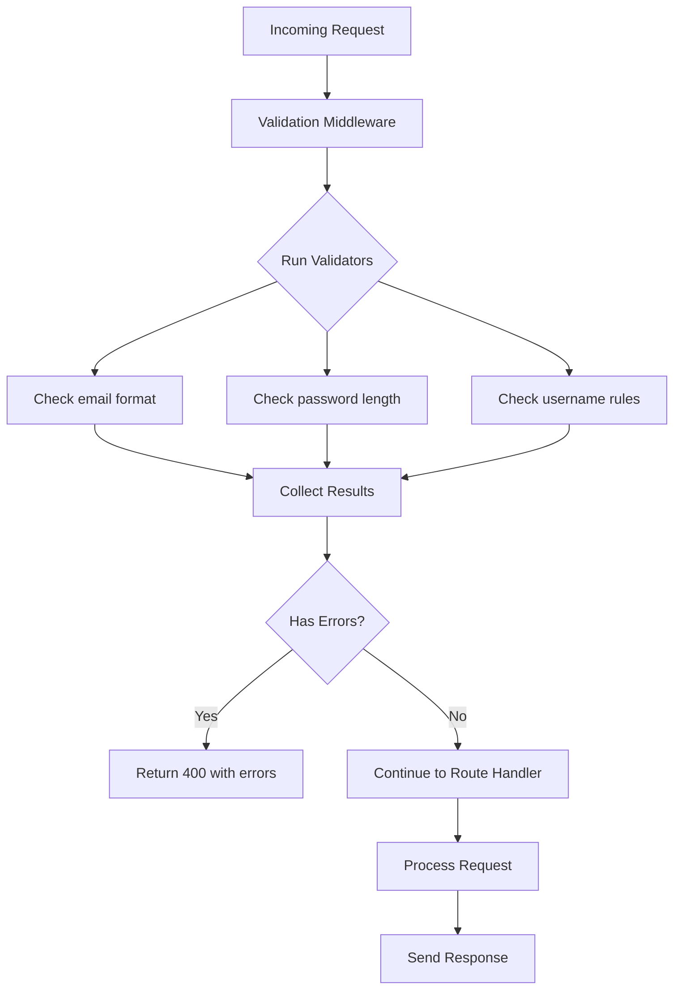

# How to Add Input Validation with express-validator

Author: [nawazdhandala](https://www.github.com/nawazdhandala)

Tags: Node.js, Express, Validation, Security, API

Description: Learn how to implement robust input validation in Express.js APIs using express-validator to protect your application from malicious data and ensure data integrity.

---

> Input validation is your first line of defense against security vulnerabilities and data corruption. Without proper validation, your API is exposed to SQL injection, XSS attacks, and data integrity issues. express-validator provides a clean, declarative approach to validating and sanitizing user input.

Every API that accepts user input needs validation. Trusting client-side validation alone is a recipe for disaster since attackers can easily bypass it.

---

## Why Use express-validator?

| Feature | Description |
|---------|-------------|
| **Declarative Syntax** | Chain validation rules in a readable way |
| **Built-in Validators** | 70+ validators for common use cases |
| **Custom Validators** | Easy to add your own validation logic |
| **Sanitization** | Clean and transform input data |
| **Error Handling** | Standardized error responses |
| **Type Safety** | TypeScript support out of the box |

---

## Getting Started

Install express-validator in your project:

```bash
npm install express-validator
```

---

## Basic Validation

Here is a simple example that validates user registration data with required fields and format checks:

```javascript
// routes/users.js
const express = require('express');
const { body, validationResult } = require('express-validator');
const router = express.Router();

// Define validation rules as middleware
// Each body() call validates a specific field from the request body
const registerValidation = [
  // Check that email exists and is a valid email format
  body('email')
    .isEmail()
    .withMessage('Please provide a valid email address')
    .normalizeEmail(),

  // Password must be at least 8 characters
  body('password')
    .isLength({ min: 8 })
    .withMessage('Password must be at least 8 characters long'),

  // Username is required and must be alphanumeric
  body('username')
    .trim()
    .isAlphanumeric()
    .withMessage('Username must contain only letters and numbers')
    .isLength({ min: 3, max: 20 })
    .withMessage('Username must be between 3 and 20 characters')
];

// Route handler with validation middleware
router.post('/register', registerValidation, (req, res) => {
  // Check for validation errors
  const errors = validationResult(req);

  if (!errors.isEmpty()) {
    // Return 400 with validation errors
    return res.status(400).json({
      success: false,
      errors: errors.array()
    });
  }

  // Validation passed, proceed with registration
  const { email, password, username } = req.body;

  // ... create user logic here

  res.status(201).json({
    success: true,
    message: 'User registered successfully'
  });
});

module.exports = router;
```

---

## Validation Flow

The following diagram shows how express-validator processes incoming requests:



---

## Common Validators

express-validator includes many built-in validators. Here are the most frequently used ones:

```javascript
// validators/common.js
const { body, param, query } = require('express-validator');

// String validators for text input
const stringValidators = [
  body('name')
    .trim()                          // Remove whitespace
    .notEmpty()                      // Must not be empty
    .withMessage('Name is required')
    .isLength({ max: 100 })          // Maximum length
    .escape(),                       // Prevent XSS by escaping HTML

  body('description')
    .optional()                      // Field is optional
    .trim()
    .isLength({ max: 500 })
    .withMessage('Description cannot exceed 500 characters')
];

// Number validators for numeric input
const numberValidators = [
  body('age')
    .isInt({ min: 0, max: 150 })     // Integer with range
    .withMessage('Age must be between 0 and 150'),

  body('price')
    .isFloat({ min: 0 })             // Positive float
    .withMessage('Price must be a positive number'),

  body('quantity')
    .isInt({ gt: 0 })                // Greater than zero
    .withMessage('Quantity must be at least 1')
];

// Date validators for temporal data
const dateValidators = [
  body('birthDate')
    .isISO8601()                     // ISO date format
    .withMessage('Invalid date format')
    .toDate(),                       // Convert to Date object

  body('startDate')
    .isISO8601()
    .custom((value, { req }) => {
      // Custom validation: start date must be in the future
      if (new Date(value) <= new Date()) {
        throw new Error('Start date must be in the future');
      }
      return true;
    })
];

// Boolean validators
const booleanValidators = [
  body('isActive')
    .isBoolean()
    .withMessage('isActive must be true or false')
    .toBoolean()                     // Convert string to boolean
];

module.exports = {
  stringValidators,
  numberValidators,
  dateValidators,
  booleanValidators
};
```

---

## Validating Different Request Parts

You can validate data from the request body, URL parameters, query strings, headers, and cookies:

```javascript
// routes/products.js
const { body, param, query, header, cookie } = require('express-validator');

// Validate URL parameters for resource identification
const getProductValidation = [
  // Validate :id in /products/:id
  param('id')
    .isMongoId()
    .withMessage('Invalid product ID format')
];

// Validate query strings for filtering and pagination
const listProductsValidation = [
  // Validate ?page=1&limit=10&sort=price
  query('page')
    .optional()
    .isInt({ min: 1 })
    .withMessage('Page must be a positive integer')
    .toInt(),

  query('limit')
    .optional()
    .isInt({ min: 1, max: 100 })
    .withMessage('Limit must be between 1 and 100')
    .toInt(),

  query('sort')
    .optional()
    .isIn(['price', 'name', 'createdAt', '-price', '-name', '-createdAt'])
    .withMessage('Invalid sort field')
];

// Validate headers for authentication or metadata
const headerValidation = [
  header('x-api-key')
    .notEmpty()
    .withMessage('API key is required'),

  header('content-type')
    .equals('application/json')
    .withMessage('Content-Type must be application/json')
];

// Validate request body for creating or updating resources
const createProductValidation = [
  body('name')
    .trim()
    .notEmpty()
    .withMessage('Product name is required')
    .isLength({ max: 200 }),

  body('price')
    .isFloat({ min: 0.01 })
    .withMessage('Price must be greater than 0'),

  body('category')
    .isIn(['electronics', 'clothing', 'books', 'food'])
    .withMessage('Invalid category'),

  body('tags')
    .optional()
    .isArray()
    .withMessage('Tags must be an array'),

  body('tags.*')
    .optional()
    .isString()
    .trim()
    .isLength({ max: 50 })
    .withMessage('Each tag must be a string under 50 characters')
];
```

---

## Custom Validators

When built-in validators are not enough, create custom validation logic:

```javascript
// validators/custom.js
const { body } = require('express-validator');
const User = require('../models/User');

// Custom validator to check if email is already registered
const uniqueEmailValidator = body('email')
  .custom(async (email) => {
    const existingUser = await User.findOne({ email });
    if (existingUser) {
      throw new Error('Email is already registered');
    }
    return true;
  });

// Custom validator for password confirmation
const passwordMatchValidator = body('confirmPassword')
  .custom((value, { req }) => {
    if (value !== req.body.password) {
      throw new Error('Passwords do not match');
    }
    return true;
  });

// Custom validator for conditional requirements
// If isPremium is true, planId is required
const conditionalValidator = body('planId')
  .if(body('isPremium').equals('true'))
  .notEmpty()
  .withMessage('Plan ID is required for premium users')
  .isMongoId()
  .withMessage('Invalid plan ID');

// Custom validator for complex business rules
const orderValidator = body('items')
  .isArray({ min: 1 })
  .withMessage('Order must contain at least one item')
  .custom((items) => {
    // Check total quantity does not exceed limit
    const totalQuantity = items.reduce((sum, item) => sum + item.quantity, 0);
    if (totalQuantity > 100) {
      throw new Error('Order cannot exceed 100 items total');
    }

    // Check for duplicate product IDs
    const productIds = items.map(item => item.productId);
    const uniqueIds = new Set(productIds);
    if (productIds.length !== uniqueIds.size) {
      throw new Error('Duplicate products in order');
    }

    return true;
  });

module.exports = {
  uniqueEmailValidator,
  passwordMatchValidator,
  conditionalValidator,
  orderValidator
};
```

---

## Sanitization

Sanitizers clean and transform input data before it reaches your application:

```javascript
// validators/sanitizers.js
const { body } = require('express-validator');

const sanitizationRules = [
  // Trim whitespace from strings
  body('username').trim(),

  // Normalize email to lowercase
  body('email').normalizeEmail({
    gmail_remove_dots: false,
    all_lowercase: true
  }),

  // Escape HTML to prevent XSS
  body('comment').escape(),

  // Convert to specific types
  body('age').toInt(),
  body('price').toFloat(),
  body('isActive').toBoolean(),
  body('createdAt').toDate(),

  // Custom sanitization
  body('phone')
    .customSanitizer((value) => {
      // Remove all non-digit characters
      return value.replace(/\D/g, '');
    }),

  body('tags')
    .customSanitizer((value) => {
      // Ensure tags is always an array
      if (!value) return [];
      if (typeof value === 'string') return [value];
      return value;
    })
];

module.exports = { sanitizationRules };
```

---

## Error Handling Middleware

Create a reusable middleware to handle validation errors consistently:

```javascript
// middleware/validateRequest.js
const { validationResult } = require('express-validator');

// Generic validation error handler
// Use this after validation rules to check results
const validateRequest = (req, res, next) => {
  const errors = validationResult(req);

  if (!errors.isEmpty()) {
    // Format errors for consistent API response
    const formattedErrors = errors.array().map(error => ({
      field: error.path,
      message: error.msg,
      value: error.value
    }));

    return res.status(400).json({
      success: false,
      message: 'Validation failed',
      errors: formattedErrors
    });
  }

  next();
};

// Alternative: throw error for global error handler
const validateRequestOrThrow = (req, res, next) => {
  const errors = validationResult(req);

  if (!errors.isEmpty()) {
    const error = new Error('Validation failed');
    error.statusCode = 400;
    error.errors = errors.array();
    throw error;
  }

  next();
};

module.exports = { validateRequest, validateRequestOrThrow };
```

---

## Organizing Validators

For larger applications, organize validators by domain:

```javascript
// validators/index.js
const { body, param, query } = require('express-validator');

// User validators
const userValidators = {
  create: [
    body('email').isEmail().normalizeEmail(),
    body('password').isLength({ min: 8 }),
    body('name').trim().notEmpty().isLength({ max: 100 })
  ],

  update: [
    param('id').isMongoId(),
    body('name').optional().trim().isLength({ max: 100 }),
    body('email').optional().isEmail().normalizeEmail()
  ],

  getById: [
    param('id').isMongoId().withMessage('Invalid user ID')
  ]
};

// Product validators
const productValidators = {
  create: [
    body('name').trim().notEmpty(),
    body('price').isFloat({ min: 0.01 }),
    body('category').isIn(['electronics', 'clothing', 'books'])
  ],

  list: [
    query('page').optional().isInt({ min: 1 }).toInt(),
    query('limit').optional().isInt({ min: 1, max: 100 }).toInt()
  ]
};

// Order validators
const orderValidators = {
  create: [
    body('items').isArray({ min: 1 }),
    body('items.*.productId').isMongoId(),
    body('items.*.quantity').isInt({ min: 1 }),
    body('shippingAddress').notEmpty()
  ]
};

module.exports = {
  userValidators,
  productValidators,
  orderValidators
};
```

---

## Using Validators in Routes

Apply organized validators to your routes:

```javascript
// routes/users.js
const express = require('express');
const router = express.Router();
const { userValidators } = require('../validators');
const { validateRequest } = require('../middleware/validateRequest');
const userController = require('../controllers/userController');

// Create user with validation
router.post(
  '/',
  userValidators.create,
  validateRequest,
  userController.create
);

// Update user with validation
router.put(
  '/:id',
  userValidators.update,
  validateRequest,
  userController.update
);

// Get user by ID with validation
router.get(
  '/:id',
  userValidators.getById,
  validateRequest,
  userController.getById
);

module.exports = router;
```

---

## Schema Validation

For complex objects, use checkSchema for cleaner code:

```javascript
// validators/schemas.js
const { checkSchema } = require('express-validator');

// Define validation schema as an object
// This is cleaner for complex validations
const userSchema = checkSchema({
  email: {
    in: ['body'],
    isEmail: {
      errorMessage: 'Invalid email format'
    },
    normalizeEmail: true
  },
  password: {
    in: ['body'],
    isLength: {
      options: { min: 8, max: 128 },
      errorMessage: 'Password must be 8-128 characters'
    },
    matches: {
      options: /^(?=.*[a-z])(?=.*[A-Z])(?=.*\d)/,
      errorMessage: 'Password must contain uppercase, lowercase, and number'
    }
  },
  username: {
    in: ['body'],
    trim: true,
    isAlphanumeric: {
      errorMessage: 'Username must be alphanumeric'
    },
    isLength: {
      options: { min: 3, max: 30 },
      errorMessage: 'Username must be 3-30 characters'
    },
    custom: {
      options: async (value) => {
        // Check uniqueness
        const User = require('../models/User');
        const exists = await User.findOne({ username: value });
        if (exists) {
          throw new Error('Username already taken');
        }
        return true;
      }
    }
  },
  age: {
    in: ['body'],
    optional: true,
    isInt: {
      options: { min: 13, max: 120 },
      errorMessage: 'Age must be between 13 and 120'
    },
    toInt: true
  }
});

// Product schema with nested validation
const productSchema = checkSchema({
  name: {
    in: ['body'],
    trim: true,
    notEmpty: {
      errorMessage: 'Product name is required'
    },
    isLength: {
      options: { max: 200 }
    }
  },
  price: {
    in: ['body'],
    isFloat: {
      options: { min: 0.01 },
      errorMessage: 'Price must be at least 0.01'
    },
    toFloat: true
  },
  'variants.*.size': {
    in: ['body'],
    optional: true,
    isIn: {
      options: [['S', 'M', 'L', 'XL']],
      errorMessage: 'Invalid size'
    }
  },
  'variants.*.color': {
    in: ['body'],
    optional: true,
    matches: {
      options: /^#[0-9A-Fa-f]{6}$/,
      errorMessage: 'Color must be a valid hex code'
    }
  }
});

module.exports = { userSchema, productSchema };
```

---

## Validation Patterns

### Pattern 1: Conditional Validation

Validate fields only when certain conditions are met:

```javascript
// Validate shipping address only for physical products
const orderValidation = [
  body('productType')
    .isIn(['physical', 'digital']),

  // Shipping address required only for physical products
  body('shippingAddress')
    .if(body('productType').equals('physical'))
    .notEmpty()
    .withMessage('Shipping address required for physical products'),

  // Download email required for digital products
  body('downloadEmail')
    .if(body('productType').equals('digital'))
    .isEmail()
    .withMessage('Email required for digital products')
];
```

### Pattern 2: Array Validation

Validate arrays and their elements:

```javascript
// Validate an array of items
const cartValidation = [
  // Ensure items is an array with at least one item
  body('items')
    .isArray({ min: 1, max: 50 })
    .withMessage('Cart must have 1-50 items'),

  // Validate each item in the array
  body('items.*.productId')
    .isMongoId()
    .withMessage('Invalid product ID'),

  body('items.*.quantity')
    .isInt({ min: 1, max: 10 })
    .withMessage('Quantity must be 1-10')
];
```

### Pattern 3: Dependent Field Validation

Validate fields that depend on each other:

```javascript
// End date must be after start date
const eventValidation = [
  body('startDate')
    .isISO8601()
    .toDate(),

  body('endDate')
    .isISO8601()
    .toDate()
    .custom((endDate, { req }) => {
      const startDate = new Date(req.body.startDate);
      if (endDate <= startDate) {
        throw new Error('End date must be after start date');
      }
      return true;
    })
];
```

---

## TypeScript Support

express-validator has built-in TypeScript support:

```typescript
// validators/types.ts
import { body, param, ValidationChain } from 'express-validator';
import { Request, Response, NextFunction } from 'express';

// Define validation chains with proper types
const createUserValidation: ValidationChain[] = [
  body('email').isEmail().normalizeEmail(),
  body('password').isLength({ min: 8 }),
  body('name').trim().notEmpty()
];

// Typed request handler with validated data
interface CreateUserRequest extends Request {
  body: {
    email: string;
    password: string;
    name: string;
  };
}

const createUser = async (
  req: CreateUserRequest,
  res: Response,
  next: NextFunction
): Promise<void> => {
  // req.body is now typed
  const { email, password, name } = req.body;

  // ... create user

  res.status(201).json({ success: true });
};

export { createUserValidation, createUser };
```

---

## Complete Example

Here is a complete Express application with validation:

```javascript
// app.js
const express = require('express');
const { body, param, validationResult } = require('express-validator');

const app = express();
app.use(express.json());

// Validation middleware factory
const validate = (validations) => {
  return async (req, res, next) => {
    // Run all validations
    await Promise.all(validations.map(validation => validation.run(req)));

    // Check results
    const errors = validationResult(req);
    if (errors.isEmpty()) {
      return next();
    }

    // Return errors
    res.status(400).json({
      success: false,
      errors: errors.array().map(err => ({
        field: err.path,
        message: err.msg
      }))
    });
  };
};

// User routes with validation
app.post('/api/users',
  validate([
    body('email')
      .isEmail()
      .withMessage('Valid email required')
      .normalizeEmail(),
    body('password')
      .isLength({ min: 8 })
      .withMessage('Password must be at least 8 characters')
      .matches(/\d/)
      .withMessage('Password must contain a number'),
    body('name')
      .trim()
      .notEmpty()
      .withMessage('Name is required')
      .escape()
  ]),
  (req, res) => {
    // Validation passed
    res.status(201).json({
      success: true,
      data: {
        email: req.body.email,
        name: req.body.name
      }
    });
  }
);

app.get('/api/users/:id',
  validate([
    param('id')
      .isMongoId()
      .withMessage('Invalid user ID')
  ]),
  (req, res) => {
    res.json({
      success: true,
      data: { id: req.params.id }
    });
  }
);

// Error handling middleware
app.use((err, req, res, next) => {
  console.error(err);
  res.status(500).json({
    success: false,
    message: 'Internal server error'
  });
});

const PORT = process.env.PORT || 3000;
app.listen(PORT, () => {
  console.log(`Server running on port ${PORT}`);
});
```

---

## Best Practices

| Practice | Description |
|----------|-------------|
| **Validate early** | Add validation as the first middleware |
| **Sanitize always** | Use trim, escape, and type converters |
| **Be specific** | Provide clear error messages |
| **Use schemas** | checkSchema for complex validations |
| **Validate all sources** | body, params, query, headers |
| **Test validation** | Write unit tests for validators |

---

## Conclusion

Input validation with express-validator provides a clean, declarative way to protect your Express APIs. Key takeaways:

- **Always validate** user input on the server side
- **Sanitize** data to prevent XSS and normalize formats
- **Use custom validators** for business logic
- **Organize validators** by domain for maintainability
- **Return clear errors** to help API consumers

With proper validation in place, your API is more secure and robust against malicious or malformed input.

---

*Building an Express API? [OneUptime](https://oneuptime.com) provides API monitoring, error tracking, and alerting to ensure your application stays healthy in production.*
