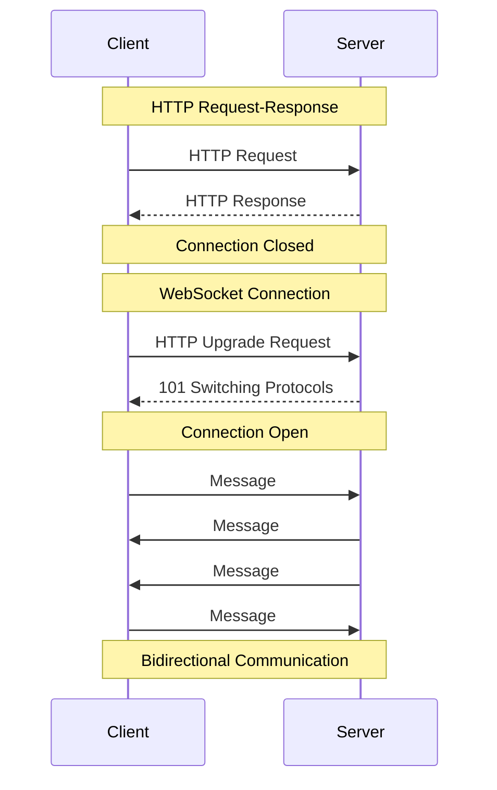
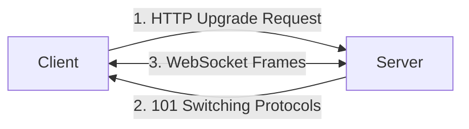
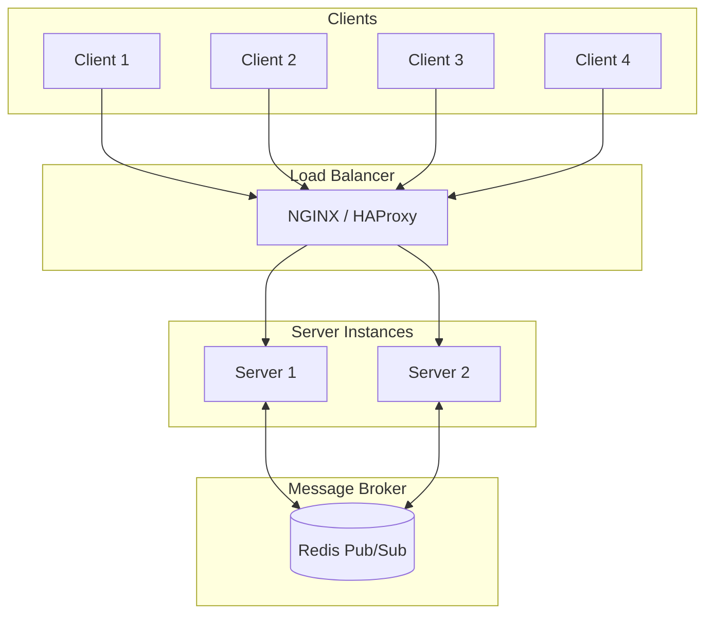

# How to Implement WebSockets with Express

Author: [nawazdhandala](https://github.com/nawazdhandala)

Tags: Express.js, Node.js, WebSockets, Real-time, Web Development, Backend

Description: A comprehensive guide to implementing WebSocket connections in Express.js applications for real-time bidirectional communication, including authentication, scaling patterns, and production best practices.

---

Real-time applications have become essential in modern web development. From live chat and notifications to collaborative editing and gaming, users expect instant updates without refreshing the page. WebSockets provide the foundation for this real-time communication by establishing persistent, bidirectional connections between clients and servers.

This guide walks you through implementing WebSockets in Express.js applications, covering everything from basic setup to production-ready patterns with authentication, error handling, and horizontal scaling.

## Understanding WebSockets

Before diving into implementation, let's understand what makes WebSockets different from traditional HTTP.

### HTTP vs WebSocket Communication

Traditional HTTP follows a request-response pattern. The client sends a request, the server responds, and the connection closes. For real-time updates, this requires techniques like polling (repeatedly asking the server for updates) or long-polling (holding connections open), both of which are inefficient.

WebSockets solve this by establishing a persistent connection that remains open, allowing both client and server to send messages at any time without the overhead of new connections.



### WebSocket Handshake

WebSocket connections begin with an HTTP upgrade request. The client sends a request with specific headers, and if the server accepts, it responds with a 101 status code, upgrading the connection from HTTP to WebSocket.



## Setting Up the Project

Let's start by creating a new Express project with WebSocket support.

### Installation

Install the required dependencies. We will use the `ws` library, which is a lightweight, fast WebSocket implementation for Node.js.

```bash
npm init -y
npm install express ws uuid
```

### Project Structure

Organize your project for maintainability as it grows.

```
project/
├── src/
│   ├── server.js           # Main server setup
│   ├── websocket/
│   │   ├── handler.js      # WebSocket event handlers
│   │   ├── middleware.js   # Connection middleware
│   │   └── rooms.js        # Room management
│   └── utils/
│       └── logger.js       # Logging utility
├── public/
│   └── index.html          # Client demo page
└── package.json
```

## Basic WebSocket Server

### Server Setup

Create the main server file that combines Express HTTP server with WebSocket support. The WebSocket server attaches to the same HTTP server, sharing the same port.

```javascript
// src/server.js
const express = require('express');
const { createServer } = require('http');
const { WebSocketServer } = require('ws');
const path = require('path');
const { v4: uuidv4 } = require('uuid');

const app = express();
const PORT = process.env.PORT || 3000;

// Serve static files for the client demo
app.use(express.static(path.join(__dirname, '../public')));

// Parse JSON bodies for REST endpoints
app.use(express.json());

// Health check endpoint
app.get('/health', (req, res) => {
  res.json({ status: 'healthy', connections: wss.clients.size });
});

// Create HTTP server from Express app
const server = createServer(app);

// Create WebSocket server attached to HTTP server
// The 'noServer' option lets us handle upgrades manually for more control
const wss = new WebSocketServer({ server });

// Store connected clients with metadata
const clients = new Map();

// Handle new WebSocket connections
wss.on('connection', (ws, request) => {
  // Generate unique ID for this connection
  const clientId = uuidv4();

  // Store client with metadata
  clients.set(clientId, {
    ws,
    connectedAt: new Date(),
    ip: request.socket.remoteAddress,
  });

  console.log(`Client connected: ${clientId}`);

  // Send welcome message with client ID
  ws.send(JSON.stringify({
    type: 'connected',
    clientId,
    message: 'Welcome to the WebSocket server',
  }));

  // Handle incoming messages
  ws.on('message', (data) => {
    try {
      const message = JSON.parse(data.toString());
      console.log(`Received from ${clientId}:`, message);

      // Echo the message back with server timestamp
      ws.send(JSON.stringify({
        type: 'echo',
        originalMessage: message,
        timestamp: new Date().toISOString(),
      }));
    } catch (error) {
      console.error('Failed to parse message:', error);
      ws.send(JSON.stringify({
        type: 'error',
        message: 'Invalid JSON format',
      }));
    }
  });

  // Handle connection close
  ws.on('close', (code, reason) => {
    console.log(`Client disconnected: ${clientId}, code: ${code}`);
    clients.delete(clientId);
  });

  // Handle errors
  ws.on('error', (error) => {
    console.error(`WebSocket error for ${clientId}:`, error);
    clients.delete(clientId);
  });
});

// Start the server
server.listen(PORT, () => {
  console.log(`Server running on http://localhost:${PORT}`);
  console.log(`WebSocket server ready`);
});
```

### Client Implementation

Create a simple HTML client to test the WebSocket connection. This demonstrates the client-side WebSocket API.

```html
<!-- public/index.html -->
<!DOCTYPE html>
<html lang="en">
<head>
  <meta charset="UTF-8">
  <meta name="viewport" content="width=device-width, initial-scale=1.0">
  <title>WebSocket Demo</title>
  <style>
    body { font-family: system-ui, sans-serif; max-width: 800px; margin: 0 auto; padding: 20px; }
    #messages { height: 300px; overflow-y: auto; border: 1px solid #ccc; padding: 10px; margin-bottom: 10px; }
    .message { margin: 5px 0; padding: 5px; border-radius: 4px; }
    .sent { background: #e3f2fd; }
    .received { background: #f5f5f5; }
    .system { background: #fff3e0; font-style: italic; }
    input, button { padding: 10px; margin-right: 10px; }
    input { width: 300px; }
  </style>
</head>
<body>
  <h1>WebSocket Demo</h1>
  <div id="status">Disconnected</div>
  <div id="messages"></div>
  <input type="text" id="messageInput" placeholder="Type a message...">
  <button onclick="sendMessage()">Send</button>
  <button onclick="connect()">Connect</button>
  <button onclick="disconnect()">Disconnect</button>

  <script>
    let ws = null;
    const messagesDiv = document.getElementById('messages');
    const statusDiv = document.getElementById('status');
    const messageInput = document.getElementById('messageInput');

    function addMessage(text, type) {
      const div = document.createElement('div');
      div.className = `message ${type}`;
      div.textContent = `[${new Date().toLocaleTimeString()}] ${text}`;
      messagesDiv.appendChild(div);
      messagesDiv.scrollTop = messagesDiv.scrollHeight;
    }

    function connect() {
      // Use wss:// for HTTPS, ws:// for HTTP
      const protocol = window.location.protocol === 'https:' ? 'wss:' : 'ws:';
      ws = new WebSocket(`${protocol}//${window.location.host}`);

      ws.onopen = () => {
        statusDiv.textContent = 'Connected';
        addMessage('Connection established', 'system');
      };

      ws.onmessage = (event) => {
        const data = JSON.parse(event.data);
        addMessage(JSON.stringify(data, null, 2), 'received');
      };

      ws.onclose = (event) => {
        statusDiv.textContent = 'Disconnected';
        addMessage(`Connection closed (code: ${event.code})`, 'system');
      };

      ws.onerror = (error) => {
        addMessage('Connection error', 'system');
      };
    }

    function disconnect() {
      if (ws) {
        ws.close();
      }
    }

    function sendMessage() {
      const text = messageInput.value.trim();
      if (text && ws && ws.readyState === WebSocket.OPEN) {
        const message = { type: 'chat', content: text };
        ws.send(JSON.stringify(message));
        addMessage(`Sent: ${text}`, 'sent');
        messageInput.value = '';
      }
    }

    messageInput.addEventListener('keypress', (e) => {
      if (e.key === 'Enter') sendMessage();
    });

    // Auto-connect on page load
    connect();
  </script>
</body>
</html>
```

## Message Protocol Design

Define a consistent message format for client-server communication. A well-designed protocol makes your application easier to maintain and extend.

### Message Structure

Use a consistent JSON structure with type, payload, and optional metadata fields.

```javascript
// Message protocol definition
const MessageTypes = {
  // Client to server
  CHAT: 'chat',
  JOIN_ROOM: 'join_room',
  LEAVE_ROOM: 'leave_room',
  TYPING: 'typing',

  // Server to client
  CONNECTED: 'connected',
  MESSAGE: 'message',
  USER_JOINED: 'user_joined',
  USER_LEFT: 'user_left',
  ERROR: 'error',

  // Bidirectional
  PING: 'ping',
  PONG: 'pong',
};

// Helper function to create messages
function createMessage(type, payload, metadata = {}) {
  return JSON.stringify({
    type,
    payload,
    timestamp: new Date().toISOString(),
    ...metadata,
  });
}

// Example usage
const chatMessage = createMessage(MessageTypes.CHAT, {
  content: 'Hello everyone!',
  room: 'general',
});
```

### Message Handler

Create a structured message handler that routes messages based on type.

```javascript
// src/websocket/handler.js
const MessageTypes = require('./types');

class MessageHandler {
  constructor() {
    // Map message types to handler functions
    this.handlers = new Map();
  }

  // Register a handler for a message type
  on(type, handler) {
    this.handlers.set(type, handler);
    return this;
  }

  // Process incoming message
  async handle(ws, clientId, rawData, context) {
    let message;

    try {
      message = JSON.parse(rawData.toString());
    } catch (error) {
      this.sendError(ws, 'Invalid JSON format');
      return;
    }

    const { type, payload } = message;

    if (!type) {
      this.sendError(ws, 'Message type is required');
      return;
    }

    const handler = this.handlers.get(type);

    if (!handler) {
      this.sendError(ws, `Unknown message type: ${type}`);
      return;
    }

    try {
      await handler(ws, clientId, payload, context);
    } catch (error) {
      console.error(`Error handling ${type}:`, error);
      this.sendError(ws, 'Internal server error');
    }
  }

  sendError(ws, message) {
    if (ws.readyState === 1) { // WebSocket.OPEN
      ws.send(JSON.stringify({
        type: 'error',
        payload: { message },
        timestamp: new Date().toISOString(),
      }));
    }
  }
}

// Create and configure message handler
const messageHandler = new MessageHandler();

messageHandler
  .on('chat', (ws, clientId, payload, { broadcast, rooms }) => {
    const { content, room } = payload;

    if (!content || typeof content !== 'string') {
      throw new Error('Invalid message content');
    }

    // Broadcast to room or all clients
    const message = {
      type: 'message',
      payload: {
        from: clientId,
        content: content.trim().substring(0, 1000), // Limit message length
        room,
      },
      timestamp: new Date().toISOString(),
    };

    if (room) {
      rooms.broadcast(room, JSON.stringify(message));
    } else {
      broadcast(JSON.stringify(message));
    }
  })
  .on('ping', (ws, clientId) => {
    ws.send(JSON.stringify({
      type: 'pong',
      timestamp: new Date().toISOString(),
    }));
  });

module.exports = messageHandler;
```

## Room Management

Rooms allow you to organize clients into groups for targeted messaging. This is essential for features like chat channels, game lobbies, or document collaboration.

```javascript
// src/websocket/rooms.js
class RoomManager {
  constructor() {
    // Map of room name to Set of client IDs
    this.rooms = new Map();
    // Map of client ID to Set of room names
    this.clientRooms = new Map();
  }

  // Add client to a room
  join(clientId, roomName, ws) {
    // Create room if it doesn't exist
    if (!this.rooms.has(roomName)) {
      this.rooms.set(roomName, new Map());
    }

    // Add client to room
    this.rooms.get(roomName).set(clientId, ws);

    // Track which rooms this client is in
    if (!this.clientRooms.has(clientId)) {
      this.clientRooms.set(clientId, new Set());
    }
    this.clientRooms.get(clientId).add(roomName);

    console.log(`Client ${clientId} joined room ${roomName}`);

    return this.getRoomSize(roomName);
  }

  // Remove client from a room
  leave(clientId, roomName) {
    const room = this.rooms.get(roomName);
    if (room) {
      room.delete(clientId);

      // Clean up empty rooms
      if (room.size === 0) {
        this.rooms.delete(roomName);
      }
    }

    const clientRoomSet = this.clientRooms.get(clientId);
    if (clientRoomSet) {
      clientRoomSet.delete(roomName);
    }

    console.log(`Client ${clientId} left room ${roomName}`);
  }

  // Remove client from all rooms
  leaveAll(clientId) {
    const rooms = this.clientRooms.get(clientId);
    if (rooms) {
      for (const roomName of rooms) {
        this.leave(clientId, roomName);
      }
      this.clientRooms.delete(clientId);
    }
  }

  // Broadcast message to all clients in a room
  broadcast(roomName, message, excludeClientId = null) {
    const room = this.rooms.get(roomName);
    if (!room) return 0;

    let sent = 0;
    for (const [clientId, ws] of room) {
      if (clientId !== excludeClientId && ws.readyState === 1) {
        ws.send(message);
        sent++;
      }
    }

    return sent;
  }

  // Get list of clients in a room
  getClients(roomName) {
    const room = this.rooms.get(roomName);
    return room ? Array.from(room.keys()) : [];
  }

  // Get number of clients in a room
  getRoomSize(roomName) {
    const room = this.rooms.get(roomName);
    return room ? room.size : 0;
  }

  // Get all rooms a client is in
  getClientRooms(clientId) {
    return Array.from(this.clientRooms.get(clientId) || []);
  }

  // Get all room names
  getAllRooms() {
    return Array.from(this.rooms.keys());
  }
}

module.exports = new RoomManager();
```

### Using Rooms in the Server

Integrate room management with the WebSocket server.

```javascript
// Updated server.js with room support
const rooms = require('./websocket/rooms');

wss.on('connection', (ws, request) => {
  const clientId = uuidv4();
  clients.set(clientId, { ws, connectedAt: new Date() });

  ws.on('message', (data) => {
    const message = JSON.parse(data.toString());

    switch (message.type) {
      case 'join_room':
        const memberCount = rooms.join(clientId, message.room, ws);

        // Notify others in the room
        rooms.broadcast(message.room, JSON.stringify({
          type: 'user_joined',
          payload: { clientId, memberCount },
        }), clientId);

        // Confirm to the joining client
        ws.send(JSON.stringify({
          type: 'joined_room',
          payload: { room: message.room, memberCount },
        }));
        break;

      case 'leave_room':
        rooms.leave(clientId, message.room);

        rooms.broadcast(message.room, JSON.stringify({
          type: 'user_left',
          payload: { clientId, memberCount: rooms.getRoomSize(message.room) },
        }));
        break;

      case 'room_message':
        rooms.broadcast(message.room, JSON.stringify({
          type: 'message',
          payload: {
            from: clientId,
            content: message.content,
            room: message.room,
          },
        }));
        break;
    }
  });

  ws.on('close', () => {
    // Clean up: remove from all rooms
    const clientRoomList = rooms.getClientRooms(clientId);

    for (const room of clientRoomList) {
      rooms.broadcast(room, JSON.stringify({
        type: 'user_left',
        payload: { clientId },
      }), clientId);
    }

    rooms.leaveAll(clientId);
    clients.delete(clientId);
  });
});
```

## Authentication

Secure your WebSocket connections by verifying clients before allowing connections.

### Token-Based Authentication

Authenticate using JWT tokens passed during the WebSocket handshake. The token can be sent as a query parameter or in a custom header.

```javascript
// src/websocket/middleware.js
const jwt = require('jsonwebtoken');

const JWT_SECRET = process.env.JWT_SECRET || 'your-secret-key';

// Verify authentication from handshake
function authenticateWebSocket(request) {
  return new Promise((resolve, reject) => {
    // Get token from query parameter or header
    const url = new URL(request.url, `http://${request.headers.host}`);
    const token = url.searchParams.get('token') ||
                  request.headers['sec-websocket-protocol'] ||
                  request.headers.authorization?.replace('Bearer ', '');

    if (!token) {
      reject(new Error('No authentication token provided'));
      return;
    }

    try {
      const decoded = jwt.verify(token, JWT_SECRET);
      resolve(decoded);
    } catch (error) {
      reject(new Error('Invalid authentication token'));
    }
  });
}

module.exports = { authenticateWebSocket };
```

### Server with Authentication

Handle the upgrade request manually to authenticate before accepting the connection.

```javascript
// Authenticated WebSocket server setup
const { WebSocketServer } = require('ws');
const { authenticateWebSocket } = require('./websocket/middleware');

// Create WebSocket server without attaching to HTTP server yet
const wss = new WebSocketServer({ noServer: true });

// Handle upgrade requests manually
server.on('upgrade', async (request, socket, head) => {
  try {
    // Authenticate the request
    const user = await authenticateWebSocket(request);

    // Accept the WebSocket connection
    wss.handleUpgrade(request, socket, head, (ws) => {
      // Attach user info to the connection
      ws.user = user;
      wss.emit('connection', ws, request);
    });
  } catch (error) {
    console.error('WebSocket authentication failed:', error.message);

    // Reject the connection with appropriate status
    socket.write('HTTP/1.1 401 Unauthorized\r\n\r\n');
    socket.destroy();
  }
});

wss.on('connection', (ws, request) => {
  // User info is now available
  console.log(`Authenticated user connected: ${ws.user.id}`);

  ws.send(JSON.stringify({
    type: 'authenticated',
    payload: {
      userId: ws.user.id,
      username: ws.user.username,
    },
  }));
});
```

### Client with Authentication

Pass the authentication token when connecting from the client.

```javascript
// Client-side authentication
function connectWithAuth(token) {
  const protocol = window.location.protocol === 'https:' ? 'wss:' : 'ws:';
  const ws = new WebSocket(`${protocol}//${window.location.host}?token=${token}`);

  ws.onopen = () => {
    console.log('Authenticated connection established');
  };

  ws.onclose = (event) => {
    if (event.code === 1008) {
      // Policy violation - typically auth failure
      console.error('Authentication failed');
      // Redirect to login or refresh token
    }
  };

  return ws;
}

// Usage
const token = localStorage.getItem('authToken');
const ws = connectWithAuth(token);
```

## Heartbeat and Connection Health

Implement heartbeat to detect dead connections and keep connections alive through proxies and load balancers.

```javascript
// Heartbeat implementation
const HEARTBEAT_INTERVAL = 30000; // 30 seconds
const HEARTBEAT_TIMEOUT = 10000;  // 10 seconds to respond

wss.on('connection', (ws) => {
  // Mark connection as alive
  ws.isAlive = true;

  // Handle pong responses
  ws.on('pong', () => {
    ws.isAlive = true;
  });

  // Handle explicit ping messages from client
  ws.on('message', (data) => {
    const message = JSON.parse(data.toString());
    if (message.type === 'ping') {
      ws.send(JSON.stringify({ type: 'pong', timestamp: Date.now() }));
    }
  });
});

// Periodic heartbeat check
const heartbeatInterval = setInterval(() => {
  wss.clients.forEach((ws) => {
    if (ws.isAlive === false) {
      console.log('Terminating dead connection');
      return ws.terminate();
    }

    // Mark as potentially dead until pong received
    ws.isAlive = false;
    ws.ping();
  });
}, HEARTBEAT_INTERVAL);

// Clean up on server close
wss.on('close', () => {
  clearInterval(heartbeatInterval);
});
```

### Client-Side Heartbeat

Implement heartbeat on the client to detect server disconnections.

```javascript
// Client heartbeat implementation
class WebSocketClient {
  constructor(url, options = {}) {
    this.url = url;
    this.pingInterval = options.pingInterval || 30000;
    this.pingTimeout = options.pingTimeout || 5000;
    this.reconnectDelay = options.reconnectDelay || 1000;
    this.maxReconnectDelay = options.maxReconnectDelay || 30000;

    this.ws = null;
    this.pingTimer = null;
    this.pongTimer = null;
    this.reconnectAttempts = 0;
  }

  connect() {
    this.ws = new WebSocket(this.url);

    this.ws.onopen = () => {
      console.log('Connected');
      this.reconnectAttempts = 0;
      this.startHeartbeat();
    };

    this.ws.onclose = () => {
      this.stopHeartbeat();
      this.scheduleReconnect();
    };

    this.ws.onmessage = (event) => {
      const data = JSON.parse(event.data);
      if (data.type === 'pong') {
        this.handlePong();
      }
    };
  }

  startHeartbeat() {
    this.pingTimer = setInterval(() => {
      if (this.ws.readyState === WebSocket.OPEN) {
        this.ws.send(JSON.stringify({ type: 'ping' }));

        // Wait for pong response
        this.pongTimer = setTimeout(() => {
          console.log('Pong timeout - connection may be dead');
          this.ws.close();
        }, this.pingTimeout);
      }
    }, this.pingInterval);
  }

  handlePong() {
    if (this.pongTimer) {
      clearTimeout(this.pongTimer);
      this.pongTimer = null;
    }
  }

  stopHeartbeat() {
    if (this.pingTimer) clearInterval(this.pingTimer);
    if (this.pongTimer) clearTimeout(this.pongTimer);
  }

  scheduleReconnect() {
    const delay = Math.min(
      this.reconnectDelay * Math.pow(2, this.reconnectAttempts),
      this.maxReconnectDelay
    );

    console.log(`Reconnecting in ${delay}ms...`);

    setTimeout(() => {
      this.reconnectAttempts++;
      this.connect();
    }, delay);
  }

  send(message) {
    if (this.ws && this.ws.readyState === WebSocket.OPEN) {
      this.ws.send(JSON.stringify(message));
    }
  }

  close() {
    this.stopHeartbeat();
    if (this.ws) {
      this.ws.close();
    }
  }
}
```

## Error Handling and Reconnection

Robust error handling ensures your application remains stable under adverse conditions.

```javascript
// Comprehensive error handling on the server
wss.on('connection', (ws, request) => {
  const clientId = uuidv4();

  // Set up error boundary for message processing
  ws.on('message', async (data) => {
    try {
      // Validate message size
      if (data.length > 64 * 1024) { // 64KB limit
        throw new Error('Message too large');
      }

      const message = JSON.parse(data.toString());

      // Validate message structure
      if (!message.type || typeof message.type !== 'string') {
        throw new Error('Invalid message structure');
      }

      // Process message
      await processMessage(ws, clientId, message);

    } catch (error) {
      console.error(`Error processing message from ${clientId}:`, error);

      // Send error to client
      sendError(ws, error.message);

      // Close connection for critical errors
      if (error.critical) {
        ws.close(1008, error.message);
      }
    }
  });

  ws.on('error', (error) => {
    console.error(`WebSocket error for ${clientId}:`, error);

    // Log but don't crash - the close event will fire next
  });

  ws.on('close', (code, reason) => {
    console.log(`Client ${clientId} disconnected: code=${code}, reason=${reason}`);

    // Clean up resources
    cleanupClient(clientId);
  });
});

function sendError(ws, message, code = 'ERROR') {
  if (ws.readyState === 1) {
    ws.send(JSON.stringify({
      type: 'error',
      payload: { code, message },
      timestamp: new Date().toISOString(),
    }));
  }
}
```

## Rate Limiting

Protect your server from abuse by limiting message frequency.

```javascript
// Rate limiter for WebSocket messages
class RateLimiter {
  constructor(options = {}) {
    this.windowMs = options.windowMs || 60000;    // 1 minute window
    this.maxMessages = options.maxMessages || 100; // 100 messages per window
    this.clients = new Map();
  }

  // Check if client can send message
  checkLimit(clientId) {
    const now = Date.now();
    const client = this.clients.get(clientId);

    if (!client) {
      this.clients.set(clientId, {
        count: 1,
        windowStart: now,
      });
      return { allowed: true, remaining: this.maxMessages - 1 };
    }

    // Reset window if expired
    if (now - client.windowStart > this.windowMs) {
      client.count = 1;
      client.windowStart = now;
      return { allowed: true, remaining: this.maxMessages - 1 };
    }

    // Check limit
    if (client.count >= this.maxMessages) {
      const resetIn = this.windowMs - (now - client.windowStart);
      return { allowed: false, remaining: 0, resetIn };
    }

    client.count++;
    return { allowed: true, remaining: this.maxMessages - client.count };
  }

  // Remove client from tracking
  removeClient(clientId) {
    this.clients.delete(clientId);
  }
}

const rateLimiter = new RateLimiter({ maxMessages: 60 }); // 60 messages per minute

wss.on('connection', (ws) => {
  const clientId = uuidv4();

  ws.on('message', (data) => {
    const limit = rateLimiter.checkLimit(clientId);

    if (!limit.allowed) {
      ws.send(JSON.stringify({
        type: 'error',
        payload: {
          code: 'RATE_LIMITED',
          message: 'Too many messages',
          retryAfter: Math.ceil(limit.resetIn / 1000),
        },
      }));
      return;
    }

    // Process message normally
    handleMessage(ws, clientId, data);
  });

  ws.on('close', () => {
    rateLimiter.removeClient(clientId);
  });
});
```

## Horizontal Scaling with Redis

For production applications running multiple server instances, use Redis pub/sub to coordinate messages across servers.



### Redis Pub/Sub Implementation

Install Redis client and implement cross-server messaging.

```bash
npm install redis
```

```javascript
// src/websocket/redis-adapter.js
const { createClient } = require('redis');

class RedisAdapter {
  constructor(redisUrl) {
    this.publisher = createClient({ url: redisUrl });
    this.subscriber = createClient({ url: redisUrl });
    this.handlers = new Map();
  }

  async connect() {
    await this.publisher.connect();
    await this.subscriber.connect();
    console.log('Redis adapter connected');
  }

  async subscribe(channel, handler) {
    this.handlers.set(channel, handler);
    await this.subscriber.subscribe(channel, (message) => {
      const data = JSON.parse(message);
      handler(data);
    });
  }

  async publish(channel, data) {
    await this.publisher.publish(channel, JSON.stringify(data));
  }

  async disconnect() {
    await this.publisher.quit();
    await this.subscriber.quit();
  }
}

module.exports = RedisAdapter;
```

### Server with Redis Adapter

Integrate Redis for cross-server communication.

```javascript
// Server with Redis pub/sub for horizontal scaling
const RedisAdapter = require('./websocket/redis-adapter');

const REDIS_URL = process.env.REDIS_URL || 'redis://localhost:6379';
const SERVER_ID = process.env.SERVER_ID || uuidv4();

const redis = new RedisAdapter(REDIS_URL);
const clients = new Map();
const rooms = new Map();

async function startServer() {
  await redis.connect();

  // Subscribe to broadcast channel
  await redis.subscribe('ws:broadcast', (data) => {
    // Ignore messages from this server
    if (data.serverId === SERVER_ID) return;

    // Broadcast to all local clients
    for (const [clientId, client] of clients) {
      if (client.ws.readyState === 1) {
        client.ws.send(JSON.stringify(data.message));
      }
    }
  });

  // Subscribe to room messages
  await redis.subscribe('ws:room', (data) => {
    if (data.serverId === SERVER_ID) return;

    const room = rooms.get(data.room);
    if (room) {
      for (const clientId of room) {
        const client = clients.get(clientId);
        if (client && client.ws.readyState === 1) {
          client.ws.send(JSON.stringify(data.message));
        }
      }
    }
  });

  // Subscribe to direct messages
  await redis.subscribe('ws:direct', (data) => {
    const client = clients.get(data.clientId);
    if (client && client.ws.readyState === 1) {
      client.ws.send(JSON.stringify(data.message));
    }
  });

  server.listen(PORT);
}

// Broadcast to all clients across all servers
function broadcastAll(message) {
  // Send to local clients
  for (const [clientId, client] of clients) {
    if (client.ws.readyState === 1) {
      client.ws.send(JSON.stringify(message));
    }
  }

  // Publish to other servers
  redis.publish('ws:broadcast', {
    serverId: SERVER_ID,
    message,
  });
}

// Send to room across all servers
function broadcastToRoom(room, message) {
  const localRoom = rooms.get(room);
  if (localRoom) {
    for (const clientId of localRoom) {
      const client = clients.get(clientId);
      if (client && client.ws.readyState === 1) {
        client.ws.send(JSON.stringify(message));
      }
    }
  }

  redis.publish('ws:room', {
    serverId: SERVER_ID,
    room,
    message,
  });
}

startServer();
```

## Production Deployment

### NGINX Configuration

Configure NGINX as a reverse proxy with WebSocket support.

```nginx
upstream websocket_servers {
    # Use IP hash for sticky sessions
    ip_hash;
    server app1:3000;
    server app2:3000;
}

server {
    listen 80;
    server_name example.com;

    # Redirect HTTP to HTTPS
    return 301 https://$server_name$request_uri;
}

server {
    listen 443 ssl http2;
    server_name example.com;

    ssl_certificate /etc/ssl/certs/example.com.crt;
    ssl_certificate_key /etc/ssl/private/example.com.key;

    location / {
        proxy_pass http://websocket_servers;
        proxy_http_version 1.1;

        # WebSocket upgrade headers
        proxy_set_header Upgrade $http_upgrade;
        proxy_set_header Connection "upgrade";

        # Forward client info
        proxy_set_header Host $host;
        proxy_set_header X-Real-IP $remote_addr;
        proxy_set_header X-Forwarded-For $proxy_add_x_forwarded_for;
        proxy_set_header X-Forwarded-Proto $scheme;

        # Timeouts for long-lived connections
        proxy_read_timeout 86400s;
        proxy_send_timeout 86400s;
    }
}
```

### Graceful Shutdown

Implement graceful shutdown to cleanly close connections during deployments.

```javascript
// Graceful shutdown handler
async function gracefulShutdown(signal) {
  console.log(`Received ${signal}, starting graceful shutdown...`);

  // Stop accepting new connections
  server.close();

  // Notify all clients
  const closeMessage = JSON.stringify({
    type: 'server_shutdown',
    payload: { message: 'Server is restarting, please reconnect' },
  });

  for (const [clientId, client] of clients) {
    if (client.ws.readyState === 1) {
      client.ws.send(closeMessage);
      client.ws.close(1001, 'Server shutdown');
    }
  }

  // Wait for connections to close
  await new Promise(resolve => setTimeout(resolve, 5000));

  // Disconnect Redis
  await redis.disconnect();

  console.log('Graceful shutdown complete');
  process.exit(0);
}

process.on('SIGTERM', () => gracefulShutdown('SIGTERM'));
process.on('SIGINT', () => gracefulShutdown('SIGINT'));
```

### Health Monitoring

Add health endpoints for monitoring and load balancer health checks.

```javascript
// Health check endpoints
app.get('/health', (req, res) => {
  res.json({
    status: 'healthy',
    uptime: process.uptime(),
    connections: wss.clients.size,
    memory: process.memoryUsage(),
  });
});

app.get('/health/ready', (req, res) => {
  // Check if Redis is connected
  const redisHealthy = redis.publisher.isOpen;

  if (redisHealthy) {
    res.json({ status: 'ready' });
  } else {
    res.status(503).json({ status: 'not ready', reason: 'Redis disconnected' });
  }
});

app.get('/metrics', (req, res) => {
  res.json({
    connections: {
      total: wss.clients.size,
      authenticated: Array.from(clients.values()).filter(c => c.user).length,
    },
    rooms: {
      count: rooms.size,
      clients: Array.from(rooms.values()).reduce((sum, r) => sum + r.size, 0),
    },
    messages: {
      received: messageStats.received,
      sent: messageStats.sent,
    },
  });
});
```

## Best Practices Summary

When implementing WebSockets in production, keep these best practices in mind:

1. **Always validate input** - Never trust client messages. Validate structure, types, and content.

2. **Implement rate limiting** - Protect your server from message flooding and abuse.

3. **Use heartbeats** - Detect dead connections and keep connections alive through proxies.

4. **Handle errors gracefully** - Log errors, notify clients, and clean up resources.

5. **Plan for scale** - Use Redis pub/sub or similar solutions for horizontal scaling.

6. **Secure connections** - Authenticate clients and use TLS in production.

7. **Monitor everything** - Track connection counts, message rates, and error rates.

8. **Implement graceful shutdown** - Close connections cleanly during deployments.

| Aspect | Recommendation |
|--------|----------------|
| **Authentication** | Verify tokens during handshake, reject unauthorized connections |
| **Message Format** | Use consistent JSON structure with type, payload, timestamp |
| **Rate Limiting** | 60-100 messages per minute per client is a good starting point |
| **Heartbeat** | Send pings every 30 seconds, timeout after 10 seconds |
| **Scaling** | Use Redis pub/sub for multi-server deployments |
| **Timeouts** | Configure NGINX proxy_read_timeout for long-lived connections |

WebSockets enable powerful real-time features in your applications. With proper implementation of authentication, error handling, and scaling patterns, you can build robust systems that handle thousands of concurrent connections reliably.
