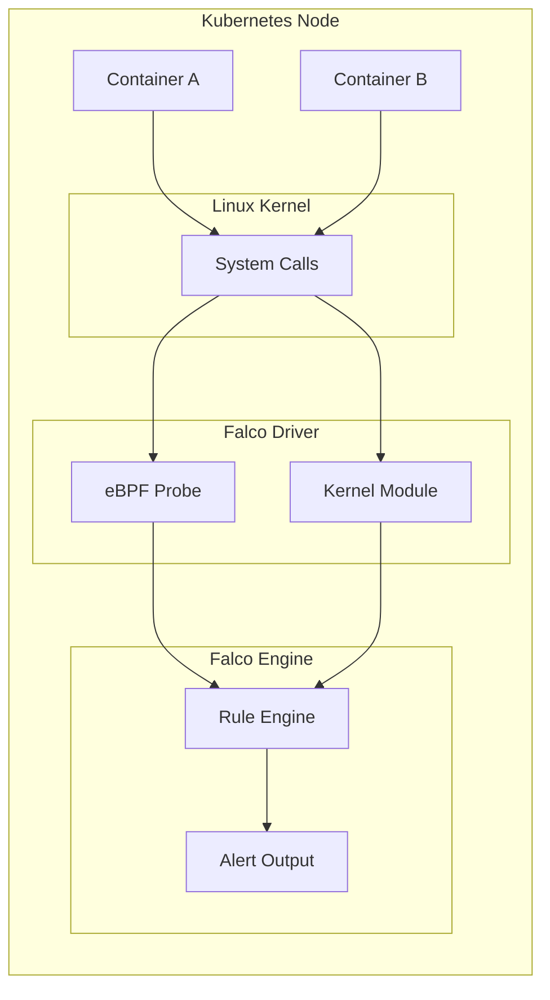
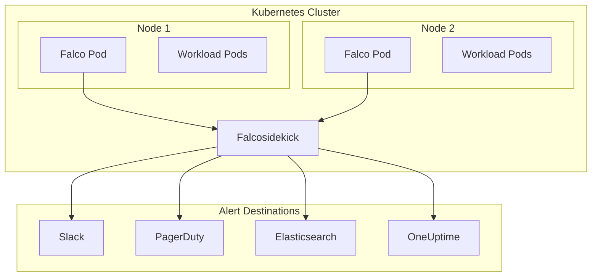

# How to Install Falco on Kubernetes

Author: [nawazdhandala](https://www.github.com/nawazdhandala)

Tags: Falco, Kubernetes, Security, Runtime, Runtime Security, DevSecOps

Description: A hands-on guide to installing and configuring Falco on Kubernetes for runtime security monitoring and threat detection.

---

Falco is the de facto standard for runtime security in Kubernetes. It watches system calls in real-time and alerts you when something suspicious happens - a shell spawned in a container, a sensitive file read, or a process trying to escape its container. Let's get it running on your cluster.

## What Falco Actually Does

Falco hooks into the Linux kernel to monitor system calls. When a container does something that matches a rule (like reading /etc/shadow or spawning a shell), Falco triggers an alert.



## Prerequisites

Before installing Falco, make sure you have:

- A running Kubernetes cluster (1.19+)
- kubectl configured to access your cluster
- Helm 3.x installed
- Cluster admin privileges

Check your cluster access with this command.

```bash
kubectl cluster-info
```

## Installation Method 1: Helm (Recommended)

Helm is the easiest way to install Falco with all its dependencies.

### Add the Falco Helm Repository

First, add the official Falco Helm repository and update your local cache.

```bash
# Add the Falcosecurity Helm repository
helm repo add falcosecurity https://falcosecurity.github.io/charts

# Update repository cache to get the latest chart versions
helm repo update
```

### Install Falco with Default Settings

This basic installation uses eBPF driver which is the safest option and works on most modern kernels.

```bash
# Install Falco in its own namespace with eBPF driver enabled
helm install falco falcosecurity/falco \
  --namespace falco \
  --create-namespace \
  --set driver.kind=ebpf
```

### Install Falco with Custom Configuration

For production, you'll want more control. This configuration enables JSON output for easier parsing and enables the modern eBPF driver.

```bash
# Production-ready Falco installation with custom settings
helm install falco falcosecurity/falco \
  --namespace falco \
  --create-namespace \
  --set driver.kind=modern_ebpf \
  --set collectors.containerd.enabled=true \
  --set collectors.docker.enabled=false \
  --set falco.json_output=true \
  --set falco.json_include_output_property=true \
  --set falco.log_stderr=true \
  --set falco.log_syslog=false
```

### Verify the Installation

Check that Falco pods are running on every node.

```bash
# Check Falco DaemonSet status - should show pods on every node
kubectl get pods -n falco -o wide

# View Falco logs to confirm it's detecting events
kubectl logs -n falco -l app.kubernetes.io/name=falco --tail=50
```

You should see output similar to this.

```
2026-02-02T10:00:00.000000Z: Falco version 0.37.0
2026-02-02T10:00:00.000001Z: Falco initialized with configuration...
2026-02-02T10:00:00.000002Z: Loading rules from /etc/falco/falco_rules.yaml
2026-02-02T10:00:00.000003Z: Starting event stream...
```

## Installation Method 2: Manifest Files

If you prefer not to use Helm, you can install Falco using raw Kubernetes manifests.

### Create the Namespace and ServiceAccount

This creates the necessary namespace and RBAC permissions for Falco to operate.

```yaml
# falco-namespace.yaml - Creates namespace and service account for Falco
apiVersion: v1
kind: Namespace
metadata:
  name: falco
---
apiVersion: v1
kind: ServiceAccount
metadata:
  name: falco
  namespace: falco
---
apiVersion: rbac.authorization.k8s.io/v1
kind: ClusterRole
metadata:
  name: falco
rules:
  - apiGroups: [""]
    resources: ["nodes", "namespaces", "pods"]
    verbs: ["get", "list", "watch"]
  - apiGroups: ["apps"]
    resources: ["deployments", "daemonsets", "replicasets", "statefulsets"]
    verbs: ["get", "list", "watch"]
---
apiVersion: rbac.authorization.k8s.io/v1
kind: ClusterRoleBinding
metadata:
  name: falco
roleRef:
  apiGroup: rbac.authorization.k8s.io
  kind: ClusterRole
  name: falco
subjects:
  - kind: ServiceAccount
    name: falco
    namespace: falco
```

### Create the ConfigMap

The ConfigMap holds the Falco configuration. This example enables JSON output and configures basic settings.

```yaml
# falco-config.yaml - Falco configuration settings
apiVersion: v1
kind: ConfigMap
metadata:
  name: falco-config
  namespace: falco
data:
  falco.yaml: |
    # Output alerts in JSON format for easier parsing
    json_output: true
    json_include_output_property: true

    # Log to stderr instead of syslog
    log_stderr: true
    log_syslog: false
    log_level: info

    # Priority level for alerts (emergency, alert, critical, error, warning, notice, info, debug)
    priority: debug

    # Buffer size for events
    buffered_outputs: false

    # Output destinations
    stdout_output:
      enabled: true

    # Enable web server for health checks
    webserver:
      enabled: true
      listen_port: 8765
      k8s_healthz_endpoint: /healthz
```

### Deploy the DaemonSet

The DaemonSet ensures Falco runs on every node in your cluster.

```yaml
# falco-daemonset.yaml - DaemonSet to run Falco on every node
apiVersion: apps/v1
kind: DaemonSet
metadata:
  name: falco
  namespace: falco
  labels:
    app: falco
spec:
  selector:
    matchLabels:
      app: falco
  template:
    metadata:
      labels:
        app: falco
    spec:
      serviceAccountName: falco
      hostNetwork: true
      hostPID: true
      tolerations:
        # Run on all nodes including control plane
        - key: node-role.kubernetes.io/control-plane
          effect: NoSchedule
        - key: node-role.kubernetes.io/master
          effect: NoSchedule
      containers:
        - name: falco
          image: falcosecurity/falco-no-driver:latest
          securityContext:
            privileged: true
          env:
            - name: HOST_ROOT
              value: /host
            - name: FALCO_BPF_PROBE
              value: ""
          volumeMounts:
            # Mount host filesystem for inspection
            - name: host-root
              mountPath: /host
              readOnly: true
            # Mount container runtime socket
            - name: containerd-socket
              mountPath: /run/containerd/containerd.sock
              readOnly: true
            # Mount Falco configuration
            - name: falco-config
              mountPath: /etc/falco
          ports:
            - containerPort: 8765
              name: http
              protocol: TCP
          livenessProbe:
            httpGet:
              path: /healthz
              port: 8765
            initialDelaySeconds: 60
            periodSeconds: 15
          readinessProbe:
            httpGet:
              path: /healthz
              port: 8765
            initialDelaySeconds: 30
            periodSeconds: 10
      volumes:
        - name: host-root
          hostPath:
            path: /
        - name: containerd-socket
          hostPath:
            path: /run/containerd/containerd.sock
        - name: falco-config
          configMap:
            name: falco-config
```

Apply the manifests in order.

```bash
# Apply all Falco manifests to the cluster
kubectl apply -f falco-namespace.yaml
kubectl apply -f falco-config.yaml
kubectl apply -f falco-daemonset.yaml
```

## Choosing the Right Driver

Falco needs a driver to capture system calls. Here's how to pick the right one.

| Driver | Kernel Requirement | Pros | Cons |
|--------|-------------------|------|------|
| modern_ebpf | 5.8+ | No compilation, safest | Newer kernels only |
| ebpf | 4.14+ | Works on older kernels | May need headers |
| kmod | Any | Works everywhere | Kernel module risks |

Check your kernel version to decide which driver to use.

```bash
# Check kernel version on your nodes
kubectl get nodes -o wide | awk '{print $1, $5}'

# Or check specific node
kubectl debug node/your-node-name -it --image=busybox -- uname -r
```

### Configure Driver in Helm

Set the driver type based on your kernel version. Modern eBPF is the recommended option for kernels 5.8 and above.

```bash
# For kernels 5.8+ (recommended)
helm upgrade falco falcosecurity/falco \
  --namespace falco \
  --set driver.kind=modern_ebpf

# For kernels 4.14+
helm upgrade falco falcosecurity/falco \
  --namespace falco \
  --set driver.kind=ebpf

# For older kernels or when eBPF fails
helm upgrade falco falcosecurity/falco \
  --namespace falco \
  --set driver.kind=kmod
```

## Testing Your Installation

Let's trigger some alerts to verify Falco is working.

### Test 1: Shell in Container

This test spawns a shell in a running pod, which Falco should detect as suspicious activity.

```bash
# Create a test pod
kubectl run test-pod --image=nginx --restart=Never

# Wait for the pod to be ready
kubectl wait --for=condition=ready pod/test-pod --timeout=60s

# Exec into the pod to trigger a shell alert
kubectl exec -it test-pod -- /bin/bash -c "whoami"
```

Check Falco logs for the alert.

```bash
# Look for shell-related alerts in Falco logs
kubectl logs -n falco -l app.kubernetes.io/name=falco --tail=100 | grep -i "shell"
```

You should see an alert like this.

```json
{
  "output": "Terminal shell in container (user=root container_name=test-pod shell=/bin/bash)",
  "priority": "Notice",
  "rule": "Terminal shell in container",
  "time": "2026-02-02T10:15:00.000000000Z"
}
```

### Test 2: Sensitive File Read

This test attempts to read a sensitive file, which should trigger a Falco alert.

```bash
# Try to read /etc/shadow in a container
kubectl exec test-pod -- cat /etc/shadow 2>/dev/null || echo "Expected: permission denied or empty"
```

### Cleanup Test Resources

Remove the test pod when you're done.

```bash
# Delete the test pod
kubectl delete pod test-pod
```

## Configuring Alert Outputs

Falco can send alerts to various destinations. Here's how to configure the most common ones.

### Output to Stdout (Default)

Alerts go to container logs, which can be collected by your logging pipeline.

```yaml
# values.yaml for Helm - stdout output configuration
falco:
  json_output: true
  json_include_output_property: true
  stdout_output:
    enabled: true
```

### Output to Falco Sidekick

Falcosidekick is a companion tool that routes alerts to Slack, PagerDuty, Elasticsearch, and 50+ other destinations.

```bash
# Install Falco with Falcosidekick enabled
helm install falco falcosecurity/falco \
  --namespace falco \
  --create-namespace \
  --set driver.kind=modern_ebpf \
  --set falcosidekick.enabled=true \
  --set falcosidekick.webui.enabled=true
```

Access the Falcosidekick UI.

```bash
# Port forward to access the Falcosidekick web UI
kubectl port-forward -n falco svc/falco-falcosidekick-ui 2802:2802
```

Then open http://localhost:2802 in your browser.

### Configure Slack Alerts

Add Slack webhook configuration to send alerts directly to a channel.

```bash
# Install with Slack alerts enabled
helm install falco falcosecurity/falco \
  --namespace falco \
  --create-namespace \
  --set driver.kind=modern_ebpf \
  --set falcosidekick.enabled=true \
  --set falcosidekick.config.slack.webhookurl="https://hooks.slack.com/services/XXX/YYY/ZZZ" \
  --set falcosidekick.config.slack.minimumpriority="warning"
```

## Common Issues and Fixes

### Issue: Falco Pods Stuck in Init

This usually means the driver can't load. Check the init container logs.

```bash
# Check init container logs for driver loading issues
kubectl logs -n falco -l app.kubernetes.io/name=falco -c falco-driver-loader

# Try switching to a different driver
helm upgrade falco falcosecurity/falco \
  --namespace falco \
  --set driver.kind=ebpf
```

### Issue: No Alerts Being Generated

Verify Falco is actually running and capturing events.

```bash
# Check Falco process status inside the container
kubectl exec -n falco -it $(kubectl get pods -n falco -l app.kubernetes.io/name=falco -o jsonpath='{.items[0].metadata.name}') -- falco --version

# Check if rules are loaded
kubectl exec -n falco -it $(kubectl get pods -n falco -l app.kubernetes.io/name=falco -o jsonpath='{.items[0].metadata.name}') -- cat /etc/falco/falco_rules.yaml | head -50
```

### Issue: High CPU Usage

Falco can be CPU-intensive. Tune the configuration to reduce load.

```bash
# Reduce CPU usage by limiting syscall capturing
helm upgrade falco falcosecurity/falco \
  --namespace falco \
  --set falco.syscall_event_drops.actions[0]=ignore \
  --set falco.outputs.rate=100 \
  --set falco.outputs.max_burst=1000
```

### Issue: Permission Denied Errors

Falco needs privileged access. Verify security context.

```bash
# Check pod security context
kubectl get pods -n falco -o yaml | grep -A10 securityContext

# If using Pod Security Standards, create an exception
kubectl label namespace falco pod-security.kubernetes.io/enforce=privileged
```

## Production Recommendations

### Resource Limits

Set appropriate resource limits to prevent Falco from impacting workloads.

```yaml
# values.yaml - Resource limits for production
resources:
  requests:
    cpu: 100m
    memory: 512Mi
  limits:
    cpu: 1000m
    memory: 1024Mi
```

### Enable Metrics

Expose Prometheus metrics for monitoring Falco itself.

```bash
# Install with Prometheus metrics enabled
helm upgrade falco falcosecurity/falco \
  --namespace falco \
  --set metrics.enabled=true \
  --set metrics.service.port=9090
```

### Custom Rules

Create a ConfigMap with your custom rules and mount it.

```yaml
# custom-rules.yaml - Custom Falco rules for your environment
apiVersion: v1
kind: ConfigMap
metadata:
  name: falco-custom-rules
  namespace: falco
data:
  custom_rules.yaml: |
    # Alert when someone execs into a production pod
    - rule: Exec in Production Pod
      desc: Detect exec into pods in production namespace
      condition: >
        spawned_process and container and
        k8s.ns.name = "production" and
        proc.name in (bash, sh, zsh)
      output: >
        Exec detected in production
        (user=%user.name pod=%k8s.pod.name namespace=%k8s.ns.name command=%proc.cmdline)
      priority: WARNING
      tags: [container, exec, production]

    # Alert on package manager usage in containers
    - rule: Package Manager in Container
      desc: Detect package installation in running containers
      condition: >
        spawned_process and container and
        proc.name in (apt, apt-get, yum, dnf, apk, pip, npm)
      output: >
        Package manager executed in container
        (user=%user.name container=%container.name command=%proc.cmdline)
      priority: WARNING
      tags: [container, software_mgmt]
```

Apply custom rules with Helm.

```bash
# Upgrade Falco to include custom rules
helm upgrade falco falcosecurity/falco \
  --namespace falco \
  --set-file customRules.custom_rules\.yaml=custom-rules.yaml
```

## Architecture Overview

Here's how Falco fits into your security monitoring stack.



## Uninstalling Falco

If you need to remove Falco, use Helm.

```bash
# Remove Falco and all its resources
helm uninstall falco -n falco

# Delete the namespace
kubectl delete namespace falco
```

---

*Runtime security is critical for any production Kubernetes cluster. Once you have Falco generating alerts, you need somewhere to send them. [OneUptime](https://oneuptime.com) integrates with Falcosidekick to give you a unified view of security events alongside your infrastructure monitoring, incident management, and status pages - all in one open-source platform.*
