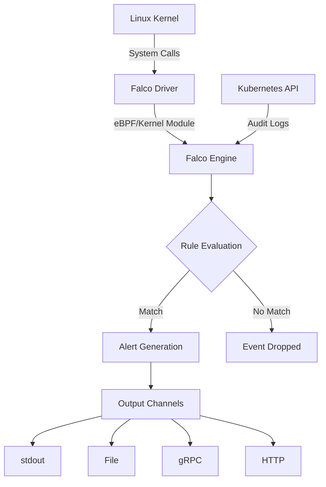
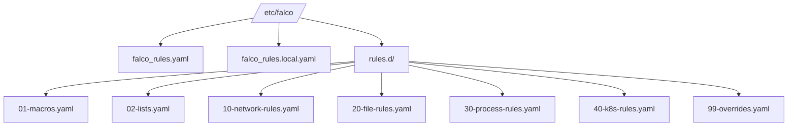
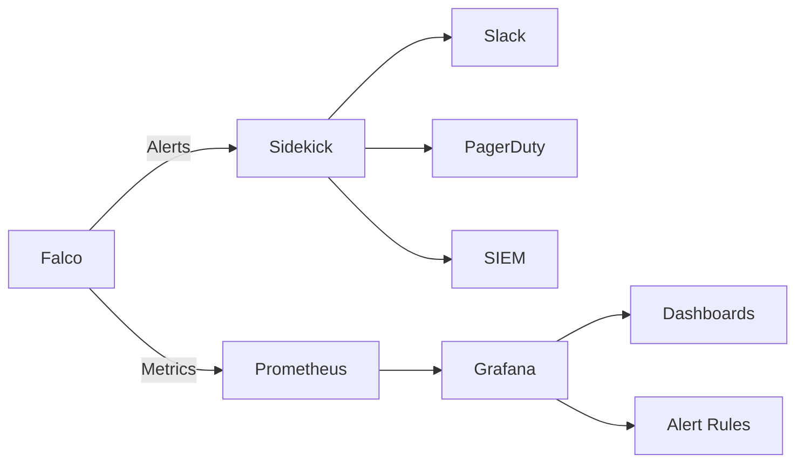

# How to Configure Falco Rules

Author: [nawazdhandala](https://www.github.com/nawazdhandala)

Tags: Falco, Kubernetes, Security, Runtime

Description: A comprehensive guide to configuring Falco rules for runtime security monitoring in Kubernetes and container environments, including rule syntax, macros, lists, and best practices.

---

Runtime security is essential for protecting containerized workloads in Kubernetes environments. Falco, the open-source cloud-native runtime security project hosted by the CNCF, provides real-time threat detection by monitoring system calls and Kubernetes audit logs. Understanding how to configure Falco rules effectively is the foundation of a robust security posture.

This guide walks you through everything you need to know about Falco rule configuration, from basic syntax to advanced patterns that scale across production environments.

## Understanding Falco's Architecture

Before diving into rule configuration, it helps to understand how Falco processes events and evaluates rules.



Falco's rule engine evaluates every captured event against your configured rules. Rules that match trigger alerts through configured output channels. The efficiency of your rules directly impacts Falco's performance and your ability to detect threats without overwhelming your security team with noise.

## Falco Rule File Structure

Falco rules are written in YAML and organized into three main components: rules, macros, and lists. Understanding how these components work together is essential for writing maintainable security policies.

### Rules

Rules are the core detection logic. Each rule specifies a condition to match, an output message to generate, and a priority level.

The following example shows a basic rule that detects shell execution inside containers. This is one of the most common indicators of potential compromise.

```yaml
# Basic rule structure
# Every rule needs: name, description, condition, output, and priority
- rule: Shell Spawned in Container
  desc: Detect shell execution inside a container environment
  condition: >
    spawned_process and
    container and
    proc.name in (bash, sh, zsh, ash, dash, csh, tcsh, ksh)
  output: >
    Shell spawned in container
    (user=%user.name container=%container.name shell=%proc.name
    parent=%proc.pname cmdline=%proc.cmdline image=%container.image.repository)
  priority: WARNING
  tags: [container, shell, mitre_execution]
```

### Macros

Macros are reusable condition snippets that simplify rule writing and improve consistency. Define common patterns once and reference them across multiple rules.

This set of macros defines common conditions you will use repeatedly. Separating these into macros makes rules easier to read and maintain.

```yaml
# Macro for detecting process spawn events
# This checks for execve syscall completion
- macro: spawned_process
  condition: evt.type = execve and evt.dir = <

# Macro for identifying container context
# container.id equals "host" when running on the host
- macro: container
  condition: container.id != host

# Macro for Kubernetes pod context
# Only matches when Kubernetes metadata is available
- macro: k8s_pod
  condition: k8s.pod.name != ""

# Macro for privileged container detection
# Privileged containers have full host access
- macro: privileged_container
  condition: container.privileged = true

# Macro for detecting write operations
# Covers various write-related syscalls
- macro: write_operation
  condition: >
    evt.type in (write, writev, pwrite, pwritev) and
    evt.dir = <

# Macro for detecting file open with write intent
- macro: open_write
  condition: >
    evt.type in (open, openat, openat2) and
    evt.dir = < and
    (evt.arg.flags contains O_WRONLY or
     evt.arg.flags contains O_RDWR or
     evt.arg.flags contains O_CREAT)
```

### Lists

Lists define collections of values that can be referenced in conditions. They make rules more readable and easier to update.

Lists help you organize related values and update them in one place. The following lists define common file paths and process names for security detection.

```yaml
# List of shell binaries commonly found in Linux systems
- list: shell_binaries
  items:
    - bash
    - sh
    - zsh
    - ash
    - dash
    - csh
    - tcsh
    - ksh
    - fish

# List of package manager binaries
# Package installation in running containers often indicates drift
- list: package_managers
  items:
    - apt
    - apt-get
    - dpkg
    - yum
    - dnf
    - rpm
    - apk
    - pip
    - pip3
    - npm
    - gem

# List of network tools that might indicate reconnaissance
- list: network_recon_tools
  items:
    - nc
    - ncat
    - netcat
    - nmap
    - masscan
    - tcpdump
    - tshark
    - wireshark
    - curl
    - wget

# List of sensitive file paths
- list: sensitive_file_paths
  items:
    - /etc/passwd
    - /etc/shadow
    - /etc/sudoers
    - /etc/ssh/sshd_config
    - /root/.ssh/authorized_keys
    - /root/.ssh/id_rsa
    - /root/.bash_history
```

## Configuring Rule Files

Falco loads rules from multiple files in a specific order. Understanding this loading mechanism helps you organize rules effectively.

### Rule Loading Order

The default configuration loads rules from the following locations. Files loaded later can override or extend rules from earlier files.

```yaml
# falco.yaml - Main configuration file
# Rules are loaded in order, with later files able to override earlier ones
rules_file:
  - /etc/falco/falco_rules.yaml          # Default Falco rules
  - /etc/falco/falco_rules.local.yaml    # Local customizations
  - /etc/falco/rules.d                   # Directory for additional rules
```

### Organizing Custom Rules

A well-organized rule structure makes maintenance easier. The following structure separates concerns and allows teams to work independently.



Create a directory structure that reflects your security domains. The following example shows how to create numbered files for predictable loading order.

```bash
# Create rules directory structure
sudo mkdir -p /etc/falco/rules.d

# Create separate files for different rule categories
# Files are loaded alphabetically, so use numeric prefixes
sudo touch /etc/falco/rules.d/01-macros.yaml
sudo touch /etc/falco/rules.d/02-lists.yaml
sudo touch /etc/falco/rules.d/10-network-rules.yaml
sudo touch /etc/falco/rules.d/20-file-rules.yaml
sudo touch /etc/falco/rules.d/30-process-rules.yaml
sudo touch /etc/falco/rules.d/40-k8s-rules.yaml
sudo touch /etc/falco/rules.d/99-overrides.yaml
```

## Writing Effective Rule Conditions

Rule conditions are where the detection logic lives. Falco uses a filtering language similar to tcpdump and Wireshark that operates on system call arguments and metadata.

### Field Classes

Falco provides several classes of fields for building conditions.

The following table shows the most commonly used field classes. Each class gives you access to different types of information about the event.

| Field Class | Description | Example Fields |
|------------|-------------|----------------|
| evt | Event metadata | evt.type, evt.time, evt.dir |
| proc | Process information | proc.name, proc.cmdline, proc.pname |
| fd | File descriptor info | fd.name, fd.directory, fd.type |
| user | User information | user.name, user.uid, user.loginuid |
| container | Container metadata | container.name, container.id, container.image |
| k8s | Kubernetes metadata | k8s.pod.name, k8s.ns.name, k8s.deployment.name |

### Condition Operators

Build conditions using comparison and logical operators.

This example demonstrates the various operators available for building rule conditions. Combine these operators to create precise detection logic.

```yaml
# Equality and inequality
- rule: Root User Process
  condition: user.uid = 0

# String matching with contains
- rule: Suspicious Command Line
  condition: proc.cmdline contains "base64 -d"

# Pattern matching with glob
- rule: Hidden File Access
  condition: fd.name glob "/tmp/.*"

# Pattern matching with regex (pmatch)
- rule: AWS Credential Access
  condition: fd.name pmatch "*/.aws/*"

# Membership testing with in
- rule: Shell Execution
  condition: proc.name in (shell_binaries)

# Logical operators
- rule: Complex Condition
  condition: >
    spawned_process and
    container and
    (proc.name in (shell_binaries) or
     proc.name in (network_recon_tools)) and
    not proc.pname = docker-init
```

### Process Ancestry

Track process lineage to detect suspicious execution chains.

Process ancestry is powerful for detecting attacks that spawn shells through vulnerable services. The following rule looks at the parent and grandparent process names.

```yaml
# Macro for checking process ancestry
# proc.aname[n] gets the nth ancestor (0=parent, 1=grandparent, etc.)
- macro: apache_ancestry
  condition: proc.aname[2] in (apache2, httpd, nginx)

# Rule detecting shell from web server
# This pattern often indicates command injection
- rule: Shell from Web Server
  desc: Detect shell spawned from web server process
  condition: >
    spawned_process and
    container and
    proc.name in (shell_binaries) and
    apache_ancestry
  output: >
    Shell spawned from web server
    (shell=%proc.name user=%user.name container=%container.name
    parent=%proc.pname grandparent=%proc.aname[2]
    cmdline=%proc.cmdline)
  priority: CRITICAL
  tags: [web, shell, mitre_execution, mitre_initial_access]
```

## Configuring Rule Priorities

Priority levels help you triage alerts and configure different responses based on severity.

### Available Priority Levels

Falco supports seven priority levels, from DEBUG to EMERGENCY.

| Priority | Use Case |
|----------|----------|
| EMERGENCY | System is unusable, immediate action required |
| ALERT | Action must be taken immediately |
| CRITICAL | Critical conditions |
| ERROR | Error conditions |
| WARNING | Warning conditions |
| NOTICE | Normal but significant conditions |
| INFORMATIONAL | Informational messages |
| DEBUG | Debug-level messages |

### Setting Minimum Priority

Configure Falco to only output alerts above a certain priority level. This helps reduce noise in production.

```yaml
# falco.yaml - Set minimum priority to WARNING
# Alerts below WARNING priority will not be output
priority: WARNING

# Alternatively, configure per-output channel
stdout_output:
  enabled: true
  # Only output WARNING and above to stdout

file_output:
  enabled: true
  filename: /var/log/falco/alerts.log
  # Log all priorities to file for forensics
```

## Configuring Rule Outputs

Output configuration determines what information appears in alerts and how they are formatted.

### Output Field Formatting

Build informative output messages using available fields.

Good output messages include all the context needed for investigation. Structure outputs consistently so they can be parsed by downstream systems.

```yaml
# Comprehensive output with Kubernetes context
- rule: Container Drift Detected
  desc: New executable running that was not in the original container image
  condition: >
    spawned_process and
    container and
    proc.is_exe_from_memfd = true
  output: >
    Container drift: executable from memory
    (
      proc=%proc.name
      cmdline=%proc.cmdline
      parent=%proc.pname
      user=%user.name
      uid=%user.uid
      container_id=%container.id
      container_name=%container.name
      image=%container.image.repository:%container.image.tag
      k8s_ns=%k8s.ns.name
      k8s_pod=%k8s.pod.name
      k8s_deployment=%k8s.deployment.name
    )
  priority: CRITICAL
  tags: [container_drift, mitre_defense_evasion]
```

### JSON Output Format

Enable JSON output for integration with log aggregation systems.

JSON output makes it easier to parse alerts in SIEM systems and build dashboards. Enable it in the main Falco configuration.

```yaml
# falco.yaml - Enable JSON output
json_output: true
json_include_output_property: true
json_include_tags_property: true

# Example JSON alert output:
# {
#   "output": "Container drift: executable from memory...",
#   "priority": "Critical",
#   "rule": "Container Drift Detected",
#   "time": "2026-02-02T10:15:30.123456789Z",
#   "output_fields": {
#     "proc.name": "suspicious",
#     "container.name": "webapp",
#     "k8s.pod.name": "webapp-5d4f6c7d8-abc12"
#   },
#   "tags": ["container_drift", "mitre_defense_evasion"]
# }
```

## Overriding and Extending Default Rules

Customize default Falco rules without modifying the original files. This approach preserves your changes across Falco upgrades.

### Disabling Rules

Disable rules that do not apply to your environment.

Some default rules may generate too much noise for your environment. Disable them in your local rules file rather than editing the default rules.

```yaml
# Disable a rule that generates too much noise
# Place this in falco_rules.local.yaml
- rule: Read Sensitive File Untrusted
  enabled: false

# Disable multiple rules by creating a list
- rule: Detect outbound connections to common miner pool ports
  enabled: false

- rule: Packet socket created in container
  enabled: false
```

### Appending to Rules

Extend existing rules with additional conditions.

The append directive lets you add conditions to existing rules. Use this to exclude known-good processes or add extra context.

```yaml
# Append exception for known CI/CD processes
# This adds to the existing rule condition
- rule: Terminal Shell in Container
  condition: and not proc.pname in (jenkins, gitlab-runner)
  append: true

# Append to a list
# Adds items to the existing list
- list: known_shell_spawn_cmdlines
  items:
    - /opt/myapp/scripts/healthcheck.sh
    - /usr/local/bin/backup.sh
  append: true
```

### Overriding Rules

Completely replace a rule definition.

When append is false or omitted, the rule definition replaces the original. Use this when you need to change the output format or condition logic significantly.

```yaml
# Override rule with custom output format
# This replaces the original rule entirely
- rule: Netcat Remote Code Execution in Container
  desc: Detect netcat usage that might indicate reverse shell
  condition: >
    spawned_process and
    container and
    proc.name in (nc, ncat, netcat) and
    (proc.cmdline contains " -e " or
     proc.cmdline contains " -c ")
  output: >
    CRITICAL: Potential reverse shell via netcat
    (user=%user.name container=%container.name
    cmdline=%proc.cmdline image=%container.image.repository
    k8s_namespace=%k8s.ns.name k8s_pod=%k8s.pod.name)
  priority: CRITICAL
  tags: [network, reverse_shell, mitre_execution]
```

## Configuring Rule Exceptions

Exceptions provide a clean way to whitelist specific behaviors without modifying rule conditions.

### Exception Structure

Define exception fields in the rule, then create exception entries separately.

Exceptions keep your rules clean while allowing granular allow-listing. Define the exception fields in the rule, then create exception entries in a separate file for easier management.

```yaml
# Rule with exception support
- rule: Write Below Binary Directory
  desc: Detect writes to binary directories
  condition: >
    write_operation and
    container and
    fd.directory in (/bin, /sbin, /usr/bin, /usr/sbin, /usr/local/bin)
  output: >
    Binary directory write detected
    (file=%fd.name user=%user.name container=%container.name
    image=%container.image.repository)
  priority: ERROR
  exceptions:
    - name: trusted_updaters
      # Match on image and process name
      fields: [container.image.repository, proc.name]
    - name: known_files
      # Match on specific file paths
      fields: [fd.name]

# Exception entries
- exception: Write Below Binary Directory
  name: trusted_updaters
  values:
    # Allow package managers in official images
    - [docker.io/library/debian, dpkg]
    - [docker.io/library/ubuntu, apt]
    - [docker.io/library/alpine, apk]

- exception: Write Below Binary Directory
  name: known_files
  values:
    # Allow specific files
    - [/usr/local/bin/myapp]
```

## Best Practices for Rule Configuration

Following these practices helps maintain effective and performant Falco deployments.

### Performance Optimization

Order conditions from cheapest to most expensive evaluation.

Falco evaluates conditions left to right. Place cheap checks before expensive ones to short-circuit evaluation early.

```yaml
# Good: Cheap checks first
- rule: Optimized Rule Example
  condition: >
    evt.type = execve and          # Cheapest: event type filter
    evt.dir = < and                # Cheap: direction check
    container.id != host and       # Cheap: simple comparison
    proc.name = suspicious and     # Medium: string comparison
    proc.cmdline contains "flag"   # Expensive: substring search

# Avoid: Expensive checks first (inefficient)
# - rule: Unoptimized Rule Example
#   condition: >
#     proc.cmdline contains "flag" and    # Expensive first - bad
#     evt.type = execve and
#     container.id != host
```

### Use Lists for Multiple Values

Lists compile to efficient hash lookups.

```yaml
# Good: Use list lookup
- list: suspicious_processes
  items: [mimikatz, lazagne, rubeus, kerberoast]

- rule: Suspicious Process
  condition: >
    spawned_process and
    container and
    proc.name in (suspicious_processes)

# Avoid: Multiple OR conditions
# condition: >
#   proc.name = mimikatz or
#   proc.name = lazagne or
#   proc.name = rubeus
```

### Tag Rules Consistently

Use tags for filtering and organizing alerts.

```yaml
# Consistent tagging scheme
- rule: Example Tagged Rule
  desc: Example showing tagging best practices
  condition: spawned_process and container
  output: Process spawned (proc=%proc.name)
  priority: INFO
  tags:
    - container           # Environment tag
    - process            # Category tag
    - T1059               # MITRE ATT&CK technique ID
    - mitre_execution    # MITRE ATT&CK tactic
    - compliance_pci     # Compliance framework
```

## Testing and Validating Rules

Always test rules before deploying to production.

### Syntax Validation

Check rules for syntax errors without running Falco.

```bash
# Validate rule syntax
# This checks for YAML errors and invalid field references
falco --validate /etc/falco/rules.d/my-rules.yaml

# Validate all rules
falco --validate /etc/falco/falco_rules.yaml \
      --validate /etc/falco/rules.d/
```

### Dry Run Testing

Test rules against captured system call traces.

Capture traffic from a test environment, then replay it against your rules to verify detection without affecting production.

```bash
# Capture syscalls for testing (run for 60 seconds)
sudo falco -c /etc/falco/falco.yaml \
  --write /tmp/capture.scap \
  -M 60

# Test rules against captured data
falco -c /etc/falco/falco.yaml \
  -r /etc/falco/falco_rules.yaml \
  -r /etc/falco/rules.d/ \
  --read /tmp/capture.scap \
  --stats-interval 10
```

### Rule Statistics

Monitor rule performance in production.

```yaml
# Enable metrics in falco.yaml
metrics:
  enabled: true
  interval: 15s
  output_rule: true

webserver:
  enabled: true
  listen_port: 8765
```

```bash
# Query rule statistics
curl -s localhost:8765/metrics | grep falco_rules

# Example output:
# falco_rules_matches_total{rule="Shell Spawned in Container"} 142
# falco_rules_matches_total{rule="Container Drift Detected"} 3
```

## Kubernetes Deployment Configuration

Deploy Falco with custom rules using Helm.

The following Helm values show how to deploy custom rules in Kubernetes. Store this configuration in version control for GitOps workflows.

```yaml
# values.yaml for Falco Helm chart
falco:
  # Set minimum alert priority
  priority: notice

  # Enable JSON output for log aggregation
  json_output: true
  json_include_output_property: true
  json_include_tags_property: true

# Custom rules to deploy
customRules:
  custom-rules.yaml: |-
    # Custom macros
    - macro: company_container
      condition: >
        container.image.repository startswith "gcr.io/mycompany/"

    # Custom list
    - list: allowed_privileged_images
      items:
        - gcr.io/mycompany/monitoring-agent
        - gcr.io/mycompany/log-collector

    # Custom rule
    - rule: Non-Company Container Running
      desc: Alert when containers from external registries are running
      condition: >
        spawned_process and
        container and
        not company_container
      output: >
        External container detected
        (image=%container.image.repository container=%container.name
        k8s_ns=%k8s.ns.name k8s_pod=%k8s.pod.name)
      priority: WARNING
      tags: [compliance, external_image]

    # Override default rule
    - rule: Launch Privileged Container
      condition: and not container.image.repository in (allowed_privileged_images)
      append: true

# Enable Falco Sidekick for alert routing
falcosidekick:
  enabled: true
  config:
    slack:
      webhookurl: "https://hooks.slack.com/services/XXX/YYY/ZZZ"
      minimumpriority: warning
```

```bash
# Deploy with Helm
helm repo add falcosecurity https://falcosecurity.github.io/charts
helm repo update

helm upgrade --install falco falcosecurity/falco \
  --namespace falco \
  --create-namespace \
  -f values.yaml
```

## Monitoring Rule Effectiveness



Track key metrics to understand rule effectiveness:

1. **Alert volume by rule** - Identify noisy rules that need tuning
2. **Alert volume by priority** - Ensure critical alerts are rare and actionable
3. **False positive rate** - Track exceptions added over time
4. **Rule match latency** - Monitor performance impact

## Wrapping Up

Effective Falco rule configuration is the foundation of runtime security. Start with the default rules, understand what they detect, then customize them for your environment. Use macros and lists for maintainability, exceptions for clean allow-listing, and consistent tagging for organization.

Key takeaways:

- Organize rules into separate files by category
- Use macros and lists for reusable, maintainable rules
- Order conditions from cheapest to most expensive
- Use exceptions instead of modifying rule conditions
- Always test rules before production deployment
- Monitor rule performance and alert volumes

As you refine your rules, remember that the goal is catching real threats while keeping false positives manageable. A small set of well-tuned rules is more valuable than hundreds of noisy ones.

**[OneUptime](https://oneuptime.com)** provides unified observability that integrates with Falco alerts, giving you runtime security events alongside metrics, logs, and traces in a single dashboard.
