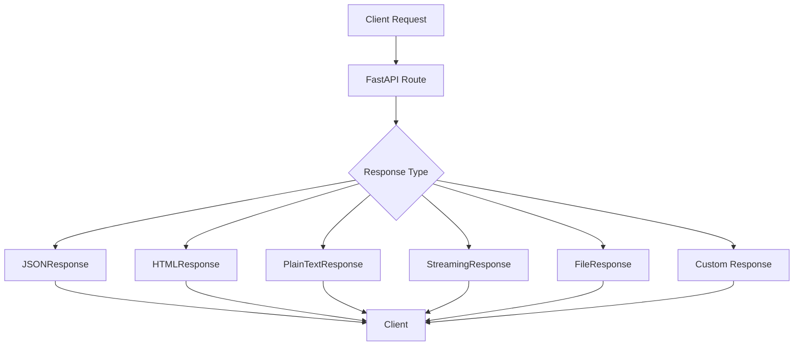
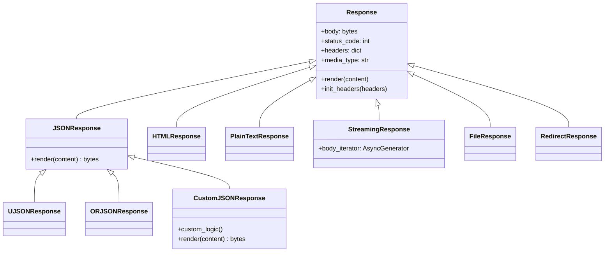

# How to Implement Custom FastAPI Response Classes

Author: [nawazdhandala](https://www.github.com/nawazdhandala)

Tags: FastAPI, Python, Response, API, Custom Response, Web Development, REST API

Description: Learn how to implement custom response classes in FastAPI to control response formats, headers, compression, and content types. This guide covers built-in response classes, creating custom responses, streaming, and production patterns.

---

> Custom response classes in FastAPI give you fine-grained control over how your API returns data. Whether you need custom headers, different content types, streaming responses, or optimized serialization, understanding response classes is essential for building production-ready APIs.

FastAPI provides several built-in response classes, but real-world applications often require custom behavior. This guide shows you how to create and use custom response classes effectively.

---

## Understanding FastAPI Response Classes

FastAPI inherits response classes from Starlette. Every response in FastAPI is an instance of a Response class that controls:

- Content body and encoding
- HTTP status code
- Response headers
- Media type (Content-Type)
- Background tasks



---

## Built-in Response Classes

Before creating custom responses, understand what FastAPI provides out of the box:

| Response Class | Use Case | Content-Type |
|----------------|----------|--------------|
| **JSONResponse** | JSON data (default) | application/json |
| **HTMLResponse** | HTML pages | text/html |
| **PlainTextResponse** | Plain text | text/plain |
| **RedirectResponse** | HTTP redirects | N/A |
| **StreamingResponse** | Large files, real-time data | Varies |
| **FileResponse** | Static files | Auto-detected |
| **Response** | Base class for custom | application/octet-stream |

---

## Basic Response Class Usage

Here is how to use built-in response classes in your FastAPI application.

```python
# basic_responses.py
from fastapi import FastAPI
from fastapi.responses import (
    JSONResponse,
    HTMLResponse,
    PlainTextResponse,
    RedirectResponse
)

app = FastAPI()

# Default JSON response - FastAPI uses JSONResponse automatically
@app.get("/api/data")
async def get_data():
    return {"message": "Hello, World!", "status": "success"}

# Explicit JSON response with custom status code
@app.get("/api/created")
async def create_resource():
    # Return JSONResponse directly for custom status codes
    return JSONResponse(
        content={"id": 123, "created": True},
        status_code=201
    )

# HTML response for web pages
@app.get("/page", response_class=HTMLResponse)
async def get_page():
    # Returns HTML content with text/html Content-Type
    return """
    <!DOCTYPE html>
    <html>
        <head><title>Welcome</title></head>
        <body><h1>Hello from FastAPI!</h1></body>
    </html>
    """

# Plain text response for simple endpoints
@app.get("/health", response_class=PlainTextResponse)
async def health_check():
    # Returns plain text with text/plain Content-Type
    return "OK"

# Redirect response for URL forwarding
@app.get("/old-path")
async def redirect_old():
    # Returns 307 temporary redirect by default
    return RedirectResponse(url="/new-path")
```

---

## Creating Custom Response Classes

When built-in classes do not meet your needs, create custom response classes by inheriting from Response or JSONResponse.

### Custom JSON Response with Metadata

This custom response automatically adds metadata to every JSON response.

```python
# custom_json_response.py
from fastapi import FastAPI, Request
from fastapi.responses import JSONResponse
from typing import Any
import time
import uuid

class MetadataJSONResponse(JSONResponse):
    """
    Custom JSON response that wraps data with metadata.
    Includes request ID, timestamp, and API version in every response.
    """

    def __init__(
        self,
        content: Any,
        status_code: int = 200,
        headers: dict = None,
        media_type: str = None,
        background = None,
        request_id: str = None,
        api_version: str = "1.0"
    ):
        # Generate request ID if not provided
        self.request_id = request_id or str(uuid.uuid4())
        self.api_version = api_version

        # Wrap content with metadata
        wrapped_content = {
            "data": content,
            "meta": {
                "request_id": self.request_id,
                "timestamp": time.time(),
                "api_version": self.api_version
            }
        }

        # Initialize headers dict if None
        headers = headers or {}

        # Add custom headers for easy access
        headers["X-Request-ID"] = self.request_id
        headers["X-API-Version"] = self.api_version

        super().__init__(
            content=wrapped_content,
            status_code=status_code,
            headers=headers,
            media_type=media_type,
            background=background
        )


app = FastAPI()

# Use the custom response class for a specific route
@app.get("/api/users/{user_id}")
async def get_user(user_id: int):
    user_data = {"id": user_id, "name": "John Doe", "email": "john@example.com"}

    return MetadataJSONResponse(
        content=user_data,
        api_version="2.0"
    )

# Set as default response class for all routes in the app
app_with_metadata = FastAPI(default_response_class=MetadataJSONResponse)

@app_with_metadata.get("/api/items")
async def get_items():
    # This will automatically use MetadataJSONResponse
    return [{"id": 1, "name": "Item 1"}, {"id": 2, "name": "Item 2"}]
```

### Custom Response with Compression

This response class automatically compresses large responses using gzip.

```python
# compressed_response.py
from fastapi import FastAPI, Request
from fastapi.responses import Response, JSONResponse
from typing import Any
import gzip
import json

class GzipJSONResponse(JSONResponse):
    """
    JSON response with automatic gzip compression.
    Only compresses responses larger than the threshold.
    """

    # Minimum size in bytes before compression is applied
    COMPRESSION_THRESHOLD = 1024  # 1KB

    def __init__(
        self,
        content: Any,
        status_code: int = 200,
        headers: dict = None,
        media_type: str = None,
        background = None,
        compression_level: int = 6
    ):
        self.compression_level = compression_level
        headers = headers or {}

        # Serialize content to JSON bytes
        json_content = json.dumps(
            content,
            ensure_ascii=False,
            allow_nan=False,
            indent=None,
            separators=(",", ":")
        ).encode("utf-8")

        # Only compress if content exceeds threshold
        if len(json_content) > self.COMPRESSION_THRESHOLD:
            # Compress the JSON content
            compressed = gzip.compress(
                json_content,
                compresslevel=self.compression_level
            )

            # Add compression headers
            headers["Content-Encoding"] = "gzip"
            headers["Vary"] = "Accept-Encoding"

            # Use base Response class for pre-encoded content
            Response.__init__(
                self,
                content=compressed,
                status_code=status_code,
                headers=headers,
                media_type="application/json",
                background=background
            )
        else:
            # Use standard JSONResponse for small content
            super().__init__(
                content=content,
                status_code=status_code,
                headers=headers,
                media_type=media_type,
                background=background
            )


app = FastAPI()

@app.get("/api/large-dataset")
async def get_large_dataset():
    # Generate large dataset that will be compressed
    large_data = [
        {"id": i, "value": f"Item {i}", "description": "A" * 100}
        for i in range(1000)
    ]

    return GzipJSONResponse(content=large_data)
```

---

## Advanced Custom Response Patterns

### Response with Custom Serialization

Control exactly how your data is serialized with a custom encoder.

```python
# custom_serialization.py
from fastapi import FastAPI
from fastapi.responses import JSONResponse
from typing import Any
from datetime import datetime, date
from decimal import Decimal
from enum import Enum
import json
import uuid

class CustomJSONEncoder(json.JSONEncoder):
    """
    Custom JSON encoder that handles common Python types.
    Extends the default encoder to support datetime, Decimal, UUID, and Enum.
    """

    def default(self, obj: Any) -> Any:
        # Handle datetime objects - convert to ISO format
        if isinstance(obj, datetime):
            return obj.isoformat()

        # Handle date objects - convert to ISO format
        if isinstance(obj, date):
            return obj.isoformat()

        # Handle Decimal - convert to string for precision
        if isinstance(obj, Decimal):
            return str(obj)

        # Handle UUID - convert to string
        if isinstance(obj, uuid.UUID):
            return str(obj)

        # Handle Enum - use value
        if isinstance(obj, Enum):
            return obj.value

        # Handle bytes - convert to base64
        if isinstance(obj, bytes):
            import base64
            return base64.b64encode(obj).decode("utf-8")

        # Handle sets - convert to list
        if isinstance(obj, set):
            return list(obj)

        # Fallback to default behavior
        return super().default(obj)


class CustomSerializerResponse(JSONResponse):
    """
    JSON response with custom serialization for complex Python types.
    Handles datetime, Decimal, UUID, Enum, bytes, and sets.
    """

    def render(self, content: Any) -> bytes:
        # Use custom encoder for serialization
        return json.dumps(
            content,
            cls=CustomJSONEncoder,
            ensure_ascii=False,
            allow_nan=False,
            indent=None,
            separators=(",", ":")
        ).encode("utf-8")


app = FastAPI()

@app.get("/api/order/{order_id}")
async def get_order(order_id: int):
    # Response includes various Python types
    order = {
        "id": uuid.uuid4(),
        "created_at": datetime.now(),
        "amount": Decimal("129.99"),
        "status": "completed",
        "tags": {"urgent", "premium"},
        "items": [
            {"product": "Widget", "quantity": 2},
            {"product": "Gadget", "quantity": 1}
        ]
    }

    return CustomSerializerResponse(content=order)
```

### Response with CORS Headers

Create a response class that automatically adds CORS headers.

```python
# cors_response.py
from fastapi import FastAPI
from fastapi.responses import JSONResponse
from typing import Any, List

class CORSJSONResponse(JSONResponse):
    """
    JSON response with automatic CORS headers.
    Useful when you need fine-grained CORS control per response.
    """

    def __init__(
        self,
        content: Any,
        status_code: int = 200,
        headers: dict = None,
        media_type: str = None,
        background = None,
        allowed_origins: List[str] = None,
        allowed_methods: List[str] = None,
        allowed_headers: List[str] = None,
        max_age: int = 86400
    ):
        headers = headers or {}

        # Set default CORS values
        origins = allowed_origins or ["*"]
        methods = allowed_methods or ["GET", "POST", "PUT", "DELETE", "OPTIONS"]
        cors_headers = allowed_headers or ["Content-Type", "Authorization"]

        # Add CORS headers
        headers["Access-Control-Allow-Origin"] = ", ".join(origins)
        headers["Access-Control-Allow-Methods"] = ", ".join(methods)
        headers["Access-Control-Allow-Headers"] = ", ".join(cors_headers)
        headers["Access-Control-Max-Age"] = str(max_age)

        # Allow credentials if not using wildcard origin
        if "*" not in origins:
            headers["Access-Control-Allow-Credentials"] = "true"

        super().__init__(
            content=content,
            status_code=status_code,
            headers=headers,
            media_type=media_type,
            background=background
        )


app = FastAPI()

@app.get("/api/public-data")
async def get_public_data():
    # Response with permissive CORS
    return CORSJSONResponse(
        content={"public": True, "data": [1, 2, 3]}
    )

@app.get("/api/restricted-data")
async def get_restricted_data():
    # Response with restricted CORS
    return CORSJSONResponse(
        content={"restricted": True},
        allowed_origins=["https://trusted-domain.com"],
        allowed_methods=["GET"]
    )
```

---

## Streaming Responses

For large files or real-time data, use streaming responses to avoid loading everything into memory.

### Basic Streaming Response

```python
# streaming_response.py
from fastapi import FastAPI
from fastapi.responses import StreamingResponse
from typing import AsyncGenerator
import asyncio

app = FastAPI()

async def generate_large_data() -> AsyncGenerator[bytes, None]:
    """
    Generator function that yields data in chunks.
    Simulates reading from a large file or database.
    """
    for i in range(100):
        # Simulate some processing time
        await asyncio.sleep(0.01)

        # Yield data chunk
        chunk = f"Line {i}: {'x' * 100}\n"
        yield chunk.encode("utf-8")


@app.get("/api/stream/data")
async def stream_data():
    # Returns data as it is generated, without loading all into memory
    return StreamingResponse(
        generate_large_data(),
        media_type="text/plain"
    )
```

### Custom Streaming JSON Response

Stream JSON arrays efficiently for large datasets.

```python
# streaming_json.py
from fastapi import FastAPI
from fastapi.responses import StreamingResponse
from typing import AsyncGenerator, List, Any
import json
import asyncio

async def stream_json_array(items: AsyncGenerator[dict, None]) -> AsyncGenerator[bytes, None]:
    """
    Stream a JSON array without loading all items into memory.
    Yields valid JSON as data becomes available.
    """
    yield b"["

    first = True
    async for item in items:
        if not first:
            yield b","
        first = False

        # Serialize individual item
        yield json.dumps(item).encode("utf-8")

    yield b"]"


async def fetch_users_from_db() -> AsyncGenerator[dict, None]:
    """
    Simulates fetching users from a database in batches.
    In production, this would be actual database queries.
    """
    for i in range(10000):
        # Simulate database latency
        if i % 100 == 0:
            await asyncio.sleep(0.01)

        yield {
            "id": i,
            "name": f"User {i}",
            "email": f"user{i}@example.com"
        }


app = FastAPI()

@app.get("/api/users/stream")
async def stream_users():
    """
    Stream large user dataset as JSON array.
    Memory efficient for datasets that would not fit in memory.
    """
    return StreamingResponse(
        stream_json_array(fetch_users_from_db()),
        media_type="application/json"
    )
```

### Server-Sent Events (SSE) Response

Create a custom response for real-time event streaming.

```python
# sse_response.py
from fastapi import FastAPI
from fastapi.responses import StreamingResponse
from typing import AsyncGenerator
import asyncio
import json

class SSEResponse(StreamingResponse):
    """
    Server-Sent Events response for real-time updates.
    Clients can receive updates using EventSource API.
    """

    def __init__(
        self,
        content: AsyncGenerator,
        status_code: int = 200,
        headers: dict = None,
        background = None
    ):
        headers = headers or {}

        # SSE requires specific headers
        headers["Content-Type"] = "text/event-stream"
        headers["Cache-Control"] = "no-cache"
        headers["Connection"] = "keep-alive"
        headers["X-Accel-Buffering"] = "no"  # Disable nginx buffering

        super().__init__(
            content=content,
            status_code=status_code,
            headers=headers,
            background=background
        )


def format_sse_event(
    data: Any,
    event: str = None,
    event_id: str = None,
    retry: int = None
) -> str:
    """
    Format data as SSE event string.
    Follows the SSE specification for event formatting.
    """
    lines = []

    if event_id:
        lines.append(f"id: {event_id}")

    if event:
        lines.append(f"event: {event}")

    if retry:
        lines.append(f"retry: {retry}")

    # Serialize data and handle multi-line content
    if isinstance(data, (dict, list)):
        data = json.dumps(data)

    for line in str(data).split("\n"):
        lines.append(f"data: {line}")

    lines.append("")  # Empty line marks end of event
    lines.append("")

    return "\n".join(lines)


async def generate_notifications() -> AsyncGenerator[bytes, None]:
    """
    Generate server-sent events for real-time notifications.
    """
    event_id = 0

    while True:
        event_id += 1

        # Simulate notification data
        notification = {
            "type": "update",
            "message": f"Notification {event_id}",
            "timestamp": asyncio.get_event_loop().time()
        }

        # Format and yield SSE event
        event = format_sse_event(
            data=notification,
            event="notification",
            event_id=str(event_id),
            retry=3000
        )
        yield event.encode("utf-8")

        # Wait before sending next event
        await asyncio.sleep(2)


app = FastAPI()

@app.get("/api/notifications/stream")
async def stream_notifications():
    """
    Stream real-time notifications using Server-Sent Events.
    Connect using EventSource in the browser.
    """
    return SSEResponse(generate_notifications())
```

---

## Response Class Architecture

Understanding the response class hierarchy helps you make better design decisions.



---

## Performance Optimized Responses

### Using ORJSON for Faster Serialization

ORJSON is significantly faster than the standard json library.

```python
# orjson_response.py
from fastapi import FastAPI
from fastapi.responses import JSONResponse
from typing import Any

# orjson must be installed: pip install orjson
try:
    import orjson

    class ORJSONResponse(JSONResponse):
        """
        High-performance JSON response using orjson.
        Up to 10x faster serialization than standard json.
        """

        media_type = "application/json"

        def render(self, content: Any) -> bytes:
            # orjson returns bytes directly, no encoding needed
            return orjson.dumps(
                content,
                option=orjson.OPT_NON_STR_KEYS | orjson.OPT_SERIALIZE_NUMPY
            )

except ImportError:
    # Fallback to standard JSONResponse if orjson not installed
    ORJSONResponse = JSONResponse


app = FastAPI(default_response_class=ORJSONResponse)

@app.get("/api/fast-data")
async def get_fast_data():
    # Large dataset serialized quickly with orjson
    return {
        "items": [{"id": i, "value": i * 2} for i in range(10000)]
    }
```

### Caching Response Class

Add caching headers to responses automatically.

```python
# caching_response.py
from fastapi import FastAPI
from fastapi.responses import JSONResponse
from typing import Any
import hashlib
import json

class CachedJSONResponse(JSONResponse):
    """
    JSON response with automatic caching headers.
    Generates ETag and sets Cache-Control headers.
    """

    def __init__(
        self,
        content: Any,
        status_code: int = 200,
        headers: dict = None,
        media_type: str = None,
        background = None,
        max_age: int = 3600,
        private: bool = False,
        must_revalidate: bool = True
    ):
        headers = headers or {}

        # Serialize content for ETag calculation
        content_bytes = json.dumps(content, sort_keys=True).encode("utf-8")

        # Generate ETag from content hash
        etag = hashlib.md5(content_bytes).hexdigest()
        headers["ETag"] = f'"{etag}"'

        # Build Cache-Control header
        cache_parts = []

        if private:
            cache_parts.append("private")
        else:
            cache_parts.append("public")

        cache_parts.append(f"max-age={max_age}")

        if must_revalidate:
            cache_parts.append("must-revalidate")

        headers["Cache-Control"] = ", ".join(cache_parts)

        super().__init__(
            content=content,
            status_code=status_code,
            headers=headers,
            media_type=media_type,
            background=background
        )


app = FastAPI()

@app.get("/api/cached-data")
async def get_cached_data():
    # Response will include caching headers
    return CachedJSONResponse(
        content={"data": "This can be cached"},
        max_age=7200,  # Cache for 2 hours
        private=False
    )

@app.get("/api/user-specific")
async def get_user_data():
    # Private cache for user-specific data
    return CachedJSONResponse(
        content={"user": "data"},
        max_age=300,  # Cache for 5 minutes
        private=True
    )
```

---

## Error Response Classes

Create consistent error responses across your API.

```python
# error_responses.py
from fastapi import FastAPI, Request
from fastapi.responses import JSONResponse
from fastapi.exceptions import RequestValidationError
from starlette.exceptions import HTTPException
from typing import Any, List, Optional
import traceback

class ErrorResponse(JSONResponse):
    """
    Standardized error response format.
    Provides consistent error structure across the API.
    """

    def __init__(
        self,
        error_code: str,
        message: str,
        status_code: int = 400,
        details: Any = None,
        headers: dict = None,
        request_id: str = None
    ):
        content = {
            "error": {
                "code": error_code,
                "message": message,
                "status": status_code
            }
        }

        if details:
            content["error"]["details"] = details

        if request_id:
            content["error"]["request_id"] = request_id
            headers = headers or {}
            headers["X-Request-ID"] = request_id

        super().__init__(
            content=content,
            status_code=status_code,
            headers=headers
        )


class ValidationErrorResponse(ErrorResponse):
    """
    Response for validation errors with field-level details.
    """

    def __init__(
        self,
        errors: List[dict],
        request_id: str = None
    ):
        # Format validation errors
        details = [
            {
                "field": ".".join(str(loc) for loc in err.get("loc", [])),
                "message": err.get("msg", "Validation error"),
                "type": err.get("type", "value_error")
            }
            for err in errors
        ]

        super().__init__(
            error_code="VALIDATION_ERROR",
            message="Request validation failed",
            status_code=422,
            details=details,
            request_id=request_id
        )


app = FastAPI()

# Custom exception handlers using error responses
@app.exception_handler(RequestValidationError)
async def validation_exception_handler(request: Request, exc: RequestValidationError):
    return ValidationErrorResponse(
        errors=exc.errors(),
        request_id=request.headers.get("X-Request-ID")
    )

@app.exception_handler(HTTPException)
async def http_exception_handler(request: Request, exc: HTTPException):
    return ErrorResponse(
        error_code=f"HTTP_{exc.status_code}",
        message=exc.detail,
        status_code=exc.status_code,
        request_id=request.headers.get("X-Request-ID")
    )

@app.exception_handler(Exception)
async def general_exception_handler(request: Request, exc: Exception):
    # Log the full traceback for debugging
    traceback.print_exc()

    return ErrorResponse(
        error_code="INTERNAL_ERROR",
        message="An unexpected error occurred",
        status_code=500,
        request_id=request.headers.get("X-Request-ID")
    )
```

---

## File and Binary Responses

Handle file downloads and binary data efficiently.

```python
# file_responses.py
from fastapi import FastAPI
from fastapi.responses import Response, FileResponse, StreamingResponse
from typing import AsyncGenerator
import io
import csv

app = FastAPI()

class CSVResponse(Response):
    """
    Response class for CSV file downloads.
    Sets appropriate headers for file download.
    """

    media_type = "text/csv"

    def __init__(
        self,
        content: str,
        filename: str = "data.csv",
        status_code: int = 200,
        headers: dict = None
    ):
        headers = headers or {}

        # Set download headers
        headers["Content-Disposition"] = f'attachment; filename="{filename}"'

        super().__init__(
            content=content.encode("utf-8"),
            status_code=status_code,
            headers=headers,
            media_type=self.media_type
        )


@app.get("/api/export/csv")
async def export_csv():
    # Generate CSV content
    output = io.StringIO()
    writer = csv.writer(output)

    # Write header
    writer.writerow(["ID", "Name", "Email"])

    # Write data rows
    for i in range(100):
        writer.writerow([i, f"User {i}", f"user{i}@example.com"])

    return CSVResponse(
        content=output.getvalue(),
        filename="users_export.csv"
    )


class PDFResponse(Response):
    """
    Response class for PDF files.
    Can be used for inline display or download.
    """

    media_type = "application/pdf"

    def __init__(
        self,
        content: bytes,
        filename: str = "document.pdf",
        inline: bool = False,
        status_code: int = 200,
        headers: dict = None
    ):
        headers = headers or {}

        # Set content disposition
        disposition = "inline" if inline else "attachment"
        headers["Content-Disposition"] = f'{disposition}; filename="{filename}"'

        super().__init__(
            content=content,
            status_code=status_code,
            headers=headers,
            media_type=self.media_type
        )


# Streaming file download for large files
async def stream_large_file(file_path: str) -> AsyncGenerator[bytes, None]:
    """
    Stream file in chunks to avoid memory issues.
    """
    chunk_size = 1024 * 1024  # 1MB chunks

    with open(file_path, "rb") as f:
        while chunk := f.read(chunk_size):
            yield chunk


@app.get("/api/download/{file_id}")
async def download_file(file_id: str):
    file_path = f"/path/to/files/{file_id}"

    return StreamingResponse(
        stream_large_file(file_path),
        media_type="application/octet-stream",
        headers={
            "Content-Disposition": f'attachment; filename="{file_id}"'
        }
    )
```

---

## Best Practices

### 1. Set Default Response Class at App Level

Configure a default response class for consistency across all routes.

```python
from fastapi import FastAPI

# All routes use custom response by default
app = FastAPI(default_response_class=CustomJSONResponse)
```

### 2. Use Response Classes for Route Groups

Apply different response classes to different API routers.

```python
from fastapi import APIRouter

# Public API with caching
public_router = APIRouter(default_response_class=CachedJSONResponse)

# Internal API with metadata
internal_router = APIRouter(default_response_class=MetadataJSONResponse)
```

### 3. Include Standard Headers

Always include useful headers in your responses.

```python
# Standard headers to consider
headers = {
    "X-Request-ID": request_id,
    "X-Response-Time": f"{elapsed_ms}ms",
    "X-API-Version": "2.0",
    "X-RateLimit-Remaining": str(remaining)
}
```

### 4. Handle Content Negotiation

Support multiple response formats based on Accept header.

```python
from fastapi import Request

@app.get("/api/data")
async def get_data(request: Request):
    data = {"key": "value"}
    accept = request.headers.get("accept", "application/json")

    if "text/html" in accept:
        return HTMLResponse(content=f"<pre>{data}</pre>")
    elif "text/plain" in accept:
        return PlainTextResponse(content=str(data))
    else:
        return JSONResponse(content=data)
```

### 5. Document Response Types

Use response_model and responses parameter for OpenAPI documentation.

```python
from fastapi import FastAPI
from pydantic import BaseModel

class UserResponse(BaseModel):
    id: int
    name: str
    email: str

@app.get(
    "/api/users/{user_id}",
    response_model=UserResponse,
    responses={
        404: {"description": "User not found"},
        500: {"description": "Internal server error"}
    }
)
async def get_user(user_id: int):
    return UserResponse(id=user_id, name="John", email="john@example.com")
```

---

## Conclusion

Custom response classes in FastAPI provide powerful control over your API output. Key takeaways:

- **Inherit from appropriate base classes** - JSONResponse for JSON, Response for binary
- **Override render() method** for custom serialization logic
- **Use streaming responses** for large data to conserve memory
- **Add consistent headers** for caching, CORS, and metadata
- **Create error response classes** for uniform error handling
- **Consider performance** with orjson for high-throughput APIs

With these patterns, you can build APIs that are not just functional but also performant, consistent, and well-documented.

---

*Building production APIs with FastAPI? [OneUptime](https://oneuptime.com) provides comprehensive API monitoring, performance tracking, and alerting to keep your services running smoothly.*

**Related Reading:**
- [How to Implement Rate Limiting in FastAPI Without External Services](https://oneuptime.com/blog/post/2025-01-06-fastapi-rate-limiting/view)
- [How to Secure FastAPI Applications Against OWASP Top 10](https://oneuptime.com/blog/post/2025-01-06-fastapi-owasp-security/view)
