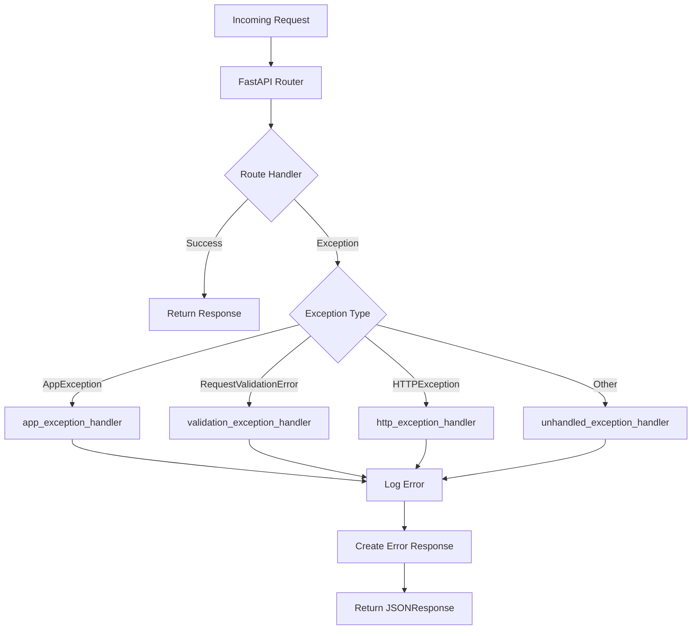

# How to Handle Exceptions Globally in FastAPI

Author: [nawazdhandala](https://www.github.com/nawazdhandala)

Tags: Python, FastAPI, Error Handling, Exceptions, API

Description: Learn how to implement global exception handling in FastAPI using exception handlers, custom exception classes, and middleware to build robust APIs with consistent error responses.

---

> Exception handling is one of those things that separates a prototype from a production-ready API. Without proper handling, your users see cryptic stack traces instead of useful error messages. This guide shows you how to catch and handle exceptions globally in FastAPI.

Every API will encounter errors. Database connections fail, validation goes wrong, third-party services timeout. The question is whether your API handles these gracefully or exposes internal details to users.

---

## Why Global Exception Handling Matters

| Benefit | Description |
|---------|-------------|
| **Consistent Responses** | All errors follow the same format |
| **Security** | No stack traces or internal details exposed |
| **Debugging** | Centralized logging of all errors |
| **User Experience** | Clear, actionable error messages |
| **Maintenance** | Single place to update error handling logic |

---

## FastAPI's Built-in Exception Handling

FastAPI provides HTTPException for raising HTTP errors. Here's how it works out of the box:

```python
# basic_exception.py
from fastapi import FastAPI, HTTPException

app = FastAPI()

@app.get("/items/{item_id}")
async def get_item(item_id: int):
    if item_id < 0:
        # Raise a 400 Bad Request error
        raise HTTPException(
            status_code=400,
            detail="Item ID must be positive"
        )

    if item_id > 1000:
        # Raise a 404 Not Found error
        raise HTTPException(
            status_code=404,
            detail="Item not found"
        )

    return {"item_id": item_id, "name": f"Item {item_id}"}
```

This works, but scattering HTTPException throughout your code leads to inconsistent error formats and duplicated logic.

---

## Custom Exception Classes

The first step toward clean exception handling is creating custom exception classes. This makes your code more readable and allows you to attach additional context to errors.

```python
# exceptions.py
from typing import Any, Dict, Optional

class AppException(Exception):
    """Base exception for all application errors"""

    def __init__(
        self,
        message: str,
        status_code: int = 500,
        error_code: str = "INTERNAL_ERROR",
        details: Optional[Dict[str, Any]] = None
    ):
        self.message = message
        self.status_code = status_code
        self.error_code = error_code
        self.details = details or {}
        super().__init__(self.message)


class NotFoundError(AppException):
    """Resource not found"""

    def __init__(
        self,
        resource: str,
        resource_id: Any,
        message: Optional[str] = None
    ):
        super().__init__(
            message=message or f"{resource} with ID {resource_id} not found",
            status_code=404,
            error_code="NOT_FOUND",
            details={"resource": resource, "resource_id": str(resource_id)}
        )


class ValidationError(AppException):
    """Input validation failed"""

    def __init__(
        self,
        field: str,
        message: str,
        value: Any = None
    ):
        super().__init__(
            message=f"Validation error on field '{field}': {message}",
            status_code=422,
            error_code="VALIDATION_ERROR",
            details={"field": field, "value": str(value) if value else None}
        )


class AuthenticationError(AppException):
    """Authentication failed"""

    def __init__(self, message: str = "Authentication required"):
        super().__init__(
            message=message,
            status_code=401,
            error_code="AUTHENTICATION_ERROR"
        )


class AuthorizationError(AppException):
    """User lacks permission"""

    def __init__(
        self,
        action: str,
        resource: str,
        message: Optional[str] = None
    ):
        super().__init__(
            message=message or f"Not authorized to {action} {resource}",
            status_code=403,
            error_code="AUTHORIZATION_ERROR",
            details={"action": action, "resource": resource}
        )


class ConflictError(AppException):
    """Resource conflict, like duplicate entries"""

    def __init__(
        self,
        resource: str,
        message: Optional[str] = None
    ):
        super().__init__(
            message=message or f"{resource} already exists",
            status_code=409,
            error_code="CONFLICT",
            details={"resource": resource}
        )


class ExternalServiceError(AppException):
    """Third-party service failed"""

    def __init__(
        self,
        service: str,
        message: Optional[str] = None
    ):
        super().__init__(
            message=message or f"External service '{service}' is unavailable",
            status_code=503,
            error_code="SERVICE_UNAVAILABLE",
            details={"service": service}
        )
```

---

## Registering Global Exception Handlers

FastAPI allows you to register exception handlers that catch specific exception types across your entire application. Here's how to set them up:

```python
# main.py
from fastapi import FastAPI, Request
from fastapi.responses import JSONResponse
from fastapi.exceptions import RequestValidationError
from starlette.exceptions import HTTPException as StarletteHTTPException
import logging
import traceback
from datetime import datetime
from typing import Any, Dict

from exceptions import (
    AppException,
    NotFoundError,
    ValidationError,
    AuthenticationError,
    AuthorizationError,
    ConflictError,
    ExternalServiceError
)

# Configure logging
logging.basicConfig(level=logging.INFO)
logger = logging.getLogger(__name__)

app = FastAPI()


def create_error_response(
    status_code: int,
    error_code: str,
    message: str,
    details: Dict[str, Any] = None,
    request_id: str = None
) -> Dict[str, Any]:
    """Create a consistent error response structure"""
    response = {
        "success": False,
        "error": {
            "code": error_code,
            "message": message,
            "timestamp": datetime.utcnow().isoformat()
        }
    }

    if details:
        response["error"]["details"] = details

    if request_id:
        response["error"]["request_id"] = request_id

    return response


@app.exception_handler(AppException)
async def app_exception_handler(request: Request, exc: AppException):
    """Handle all custom application exceptions"""

    # Log the error with context
    logger.warning(
        f"Application error: {exc.error_code} - {exc.message}",
        extra={
            "error_code": exc.error_code,
            "status_code": exc.status_code,
            "path": request.url.path,
            "method": request.method,
            "details": exc.details
        }
    )

    return JSONResponse(
        status_code=exc.status_code,
        content=create_error_response(
            status_code=exc.status_code,
            error_code=exc.error_code,
            message=exc.message,
            details=exc.details
        )
    )


@app.exception_handler(RequestValidationError)
async def validation_exception_handler(
    request: Request,
    exc: RequestValidationError
):
    """Handle Pydantic validation errors"""

    # Extract validation error details
    errors = []
    for error in exc.errors():
        field = ".".join(str(loc) for loc in error["loc"])
        errors.append({
            "field": field,
            "message": error["msg"],
            "type": error["type"]
        })

    logger.warning(
        f"Validation error on {request.url.path}",
        extra={"errors": errors, "method": request.method}
    )

    return JSONResponse(
        status_code=422,
        content=create_error_response(
            status_code=422,
            error_code="VALIDATION_ERROR",
            message="Request validation failed",
            details={"errors": errors}
        )
    )


@app.exception_handler(StarletteHTTPException)
async def http_exception_handler(
    request: Request,
    exc: StarletteHTTPException
):
    """Handle standard HTTP exceptions"""

    # Map status codes to error codes
    error_code_map = {
        400: "BAD_REQUEST",
        401: "UNAUTHORIZED",
        403: "FORBIDDEN",
        404: "NOT_FOUND",
        405: "METHOD_NOT_ALLOWED",
        408: "REQUEST_TIMEOUT",
        409: "CONFLICT",
        429: "TOO_MANY_REQUESTS",
        500: "INTERNAL_ERROR",
        502: "BAD_GATEWAY",
        503: "SERVICE_UNAVAILABLE",
        504: "GATEWAY_TIMEOUT"
    }

    error_code = error_code_map.get(exc.status_code, "HTTP_ERROR")

    return JSONResponse(
        status_code=exc.status_code,
        content=create_error_response(
            status_code=exc.status_code,
            error_code=error_code,
            message=str(exc.detail)
        )
    )


@app.exception_handler(Exception)
async def unhandled_exception_handler(request: Request, exc: Exception):
    """Catch-all handler for unexpected errors"""

    # Log the full traceback for debugging
    logger.error(
        f"Unhandled exception: {type(exc).__name__}: {str(exc)}",
        extra={
            "path": request.url.path,
            "method": request.method,
            "traceback": traceback.format_exc()
        }
    )

    # Return generic error to client, hiding internal details
    return JSONResponse(
        status_code=500,
        content=create_error_response(
            status_code=500,
            error_code="INTERNAL_ERROR",
            message="An unexpected error occurred. Please try again later."
        )
    )
```

---

## Exception Flow Diagram

Here's how exceptions flow through your FastAPI application:



---

## Using Custom Exceptions in Routes

Now your route handlers become much cleaner:

```python
# routes.py
from fastapi import FastAPI, Depends
from pydantic import BaseModel
from typing import Optional

from exceptions import (
    NotFoundError,
    ValidationError,
    AuthenticationError,
    AuthorizationError,
    ConflictError
)

app = FastAPI()


class ItemCreate(BaseModel):
    name: str
    price: float
    quantity: int


# Simulated database
items_db = {}
users_db = {"user1": {"role": "admin"}, "user2": {"role": "viewer"}}


@app.get("/items/{item_id}")
async def get_item(item_id: int):
    # Clean, readable error handling
    if item_id not in items_db:
        raise NotFoundError(resource="Item", resource_id=item_id)

    return {"item": items_db[item_id]}


@app.post("/items")
async def create_item(item: ItemCreate):
    # Validate business logic
    if item.price < 0:
        raise ValidationError(
            field="price",
            message="Price must be non-negative",
            value=item.price
        )

    if item.quantity < 0:
        raise ValidationError(
            field="quantity",
            message="Quantity must be non-negative",
            value=item.quantity
        )

    # Check for duplicates
    if item.name in [i["name"] for i in items_db.values()]:
        raise ConflictError(
            resource="Item",
            message=f"Item with name '{item.name}' already exists"
        )

    # Create item
    item_id = len(items_db) + 1
    items_db[item_id] = item.dict()

    return {"item_id": item_id, "item": items_db[item_id]}


@app.delete("/items/{item_id}")
async def delete_item(item_id: int, user_id: str = "user2"):
    # Check if item exists
    if item_id not in items_db:
        raise NotFoundError(resource="Item", resource_id=item_id)

    # Check if user exists
    if user_id not in users_db:
        raise AuthenticationError("User not found")

    # Check authorization
    if users_db[user_id]["role"] != "admin":
        raise AuthorizationError(
            action="delete",
            resource="Item"
        )

    del items_db[item_id]
    return {"message": "Item deleted successfully"}
```

---

## Exception Handling Middleware

For scenarios where you need to wrap all requests with error handling, or add request IDs, use middleware:

```python
# middleware.py
from fastapi import FastAPI, Request
from starlette.middleware.base import BaseHTTPMiddleware
from starlette.responses import Response
import uuid
import time
import logging

logger = logging.getLogger(__name__)


class ErrorHandlingMiddleware(BaseHTTPMiddleware):
    """Middleware to add request context and timing"""

    async def dispatch(self, request: Request, call_next) -> Response:
        # Generate request ID
        request_id = str(uuid.uuid4())

        # Attach to request state for use in handlers
        request.state.request_id = request_id

        # Track timing
        start_time = time.time()

        try:
            response = await call_next(request)

            # Add request ID to response headers
            response.headers["X-Request-ID"] = request_id

            # Log successful requests
            duration = time.time() - start_time
            logger.info(
                f"{request.method} {request.url.path} - {response.status_code}",
                extra={
                    "request_id": request_id,
                    "duration_ms": round(duration * 1000, 2),
                    "status_code": response.status_code
                }
            )

            return response

        except Exception as exc:
            # Log exception with request context
            duration = time.time() - start_time
            logger.error(
                f"Request failed: {request.method} {request.url.path}",
                extra={
                    "request_id": request_id,
                    "duration_ms": round(duration * 1000, 2),
                    "error": str(exc)
                }
            )
            # Re-raise to let exception handlers process it
            raise


# Apply middleware to your app
app = FastAPI()
app.add_middleware(ErrorHandlingMiddleware)
```

---

## Handling Database Exceptions

Database operations often fail. Here's how to wrap database errors into your custom exceptions:

```python
# database_errors.py
from sqlalchemy.exc import (
    IntegrityError,
    OperationalError,
    NoResultFound
)
from functools import wraps
import logging

from exceptions import (
    NotFoundError,
    ConflictError,
    ExternalServiceError
)

logger = logging.getLogger(__name__)


def handle_db_errors(resource_name: str):
    """Decorator to convert database errors to application errors"""

    def decorator(func):
        @wraps(func)
        async def wrapper(*args, **kwargs):
            try:
                return await func(*args, **kwargs)

            except NoResultFound:
                # Extract ID from kwargs if available
                resource_id = kwargs.get("id") or kwargs.get(f"{resource_name.lower()}_id")
                raise NotFoundError(
                    resource=resource_name,
                    resource_id=resource_id
                )

            except IntegrityError as e:
                logger.warning(f"Database integrity error: {str(e)}")

                # Check for unique constraint violations
                if "unique constraint" in str(e).lower():
                    raise ConflictError(
                        resource=resource_name,
                        message=f"{resource_name} with these details already exists"
                    )

                raise ExternalServiceError(
                    service="Database",
                    message="Database constraint violation"
                )

            except OperationalError as e:
                logger.error(f"Database operational error: {str(e)}")
                raise ExternalServiceError(
                    service="Database",
                    message="Database is temporarily unavailable"
                )

        return wrapper
    return decorator


# Usage example
class ItemRepository:

    @handle_db_errors("Item")
    async def get_by_id(self, item_id: int):
        # Your database query here
        result = await self.db.execute(
            select(Item).where(Item.id == item_id)
        )
        return result.scalar_one()

    @handle_db_errors("Item")
    async def create(self, item_data: dict):
        item = Item(**item_data)
        self.db.add(item)
        await self.db.commit()
        return item
```

---

## Error Response Schema

Define a Pydantic model for your error responses to document them in OpenAPI:

```python
# schemas.py
from pydantic import BaseModel
from typing import Any, Dict, List, Optional
from datetime import datetime


class ErrorDetail(BaseModel):
    code: str
    message: str
    timestamp: datetime
    details: Optional[Dict[str, Any]] = None
    request_id: Optional[str] = None


class ErrorResponse(BaseModel):
    success: bool = False
    error: ErrorDetail

    class Config:
        json_schema_extra = {
            "example": {
                "success": False,
                "error": {
                    "code": "NOT_FOUND",
                    "message": "Item with ID 123 not found",
                    "timestamp": "2024-01-15T10:30:00Z",
                    "details": {
                        "resource": "Item",
                        "resource_id": "123"
                    }
                }
            }
        }


class ValidationErrorDetail(BaseModel):
    field: str
    message: str
    type: str


class ValidationErrorResponse(BaseModel):
    success: bool = False
    error: ErrorDetail

    class Config:
        json_schema_extra = {
            "example": {
                "success": False,
                "error": {
                    "code": "VALIDATION_ERROR",
                    "message": "Request validation failed",
                    "timestamp": "2024-01-15T10:30:00Z",
                    "details": {
                        "errors": [
                            {
                                "field": "body.price",
                                "message": "value is not a valid float",
                                "type": "type_error.float"
                            }
                        ]
                    }
                }
            }
        }


# Use in route decorators for OpenAPI documentation
from fastapi import FastAPI

app = FastAPI()

@app.get(
    "/items/{item_id}",
    responses={
        404: {"model": ErrorResponse, "description": "Item not found"},
        500: {"model": ErrorResponse, "description": "Internal server error"}
    }
)
async def get_item(item_id: int):
    pass
```

---

## Testing Exception Handlers

Always test your exception handling:

```python
# test_exceptions.py
import pytest
from fastapi.testclient import TestClient
from main import app

client = TestClient(app)


def test_not_found_error():
    """Test 404 response format"""
    response = client.get("/items/99999")

    assert response.status_code == 404

    data = response.json()
    assert data["success"] is False
    assert data["error"]["code"] == "NOT_FOUND"
    assert "Item" in data["error"]["message"]
    assert data["error"]["details"]["resource"] == "Item"


def test_validation_error():
    """Test validation error response"""
    response = client.post(
        "/items",
        json={"name": "Test", "price": "invalid", "quantity": 1}
    )

    assert response.status_code == 422

    data = response.json()
    assert data["success"] is False
    assert data["error"]["code"] == "VALIDATION_ERROR"
    assert "errors" in data["error"]["details"]


def test_authorization_error():
    """Test 403 response for unauthorized action"""
    # First create an item
    client.post(
        "/items",
        json={"name": "Test Item", "price": 10.0, "quantity": 5}
    )

    # Try to delete as non-admin
    response = client.delete("/items/1?user_id=user2")

    assert response.status_code == 403

    data = response.json()
    assert data["error"]["code"] == "AUTHORIZATION_ERROR"


def test_conflict_error():
    """Test 409 response for duplicate"""
    # Create an item
    client.post(
        "/items",
        json={"name": "Unique Item", "price": 10.0, "quantity": 1}
    )

    # Try to create duplicate
    response = client.post(
        "/items",
        json={"name": "Unique Item", "price": 20.0, "quantity": 2}
    )

    assert response.status_code == 409
    assert response.json()["error"]["code"] == "CONFLICT"
```

---

## Best Practices Summary

1. **Create a base exception class** that all your custom exceptions inherit from
2. **Register specific handlers** for each exception type you want to handle differently
3. **Always have a catch-all handler** for unexpected exceptions
4. **Log errors with context** including request path, method, and relevant IDs
5. **Never expose stack traces** to clients in production
6. **Use consistent response formats** across all error types
7. **Include error codes** in addition to HTTP status codes for easier client handling
8. **Document error responses** in your OpenAPI schema
9. **Test your exception handlers** as part of your test suite
10. **Add request IDs** to correlate logs with user-reported issues

---

## Conclusion

Global exception handling transforms your FastAPI application from a prototype into production-grade software. With custom exceptions, centralized handlers, and consistent response formats, your API becomes easier to debug, maintain, and use.

The key is to catch errors at the right level, log enough context for debugging, and return clear messages to your users without exposing internal details.

---

*Want to monitor your API exceptions in production? [OneUptime](https://oneuptime.com) provides real-time error tracking, alerting, and observability for your FastAPI applications.*

**Related Reading:**
- [How to Implement Rate Limiting in FastAPI Without External Services](https://oneuptime.com/blog/post/2025-01-06-fastapi-rate-limiting/view)
