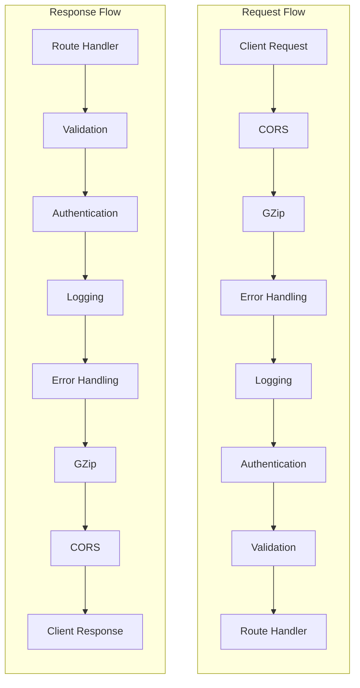

# How to Add Middleware to FastAPI

Author: [nawazdhandala](https://www.github.com/nawazdhandala)

Tags: FastAPI, Python, Middleware, API

Description: Learn how to add and configure middleware in FastAPI applications. This comprehensive guide covers built-in middleware, custom middleware creation, request/response processing, error handling, and production-ready patterns.

---

> Middleware in FastAPI sits between incoming requests and your route handlers, allowing you to process requests before they reach your endpoints and modify responses before they return to clients. Understanding middleware is essential for building robust, production-ready APIs.

Middleware enables cross-cutting concerns like logging, authentication, CORS handling, and request validation without cluttering your route handlers. This guide covers everything from basic concepts to advanced patterns you can use in production.

---

## What is Middleware?

Middleware is code that runs before and after each request in your application. It forms a chain where each piece of middleware can:

- Process the incoming request
- Decide whether to pass the request to the next middleware or return a response early
- Modify the response before sending it back to the client


The diagram above shows how a request flows through the middleware stack. Each middleware processes the request on the way in and the response on the way out.

---

## Middleware Execution Order

Understanding execution order is critical when working with multiple middleware. FastAPI executes middleware in the order they are added, but there is a key detail: middleware added last executes first for incoming requests.

| Addition Order | Request Processing | Response Processing |
|----------------|-------------------|---------------------|
| Added First    | Executed Last     | Executed Last       |
| Added Second   | Executed Second   | Executed Second     |
| Added Last     | Executed First    | Executed First      |

This behavior follows the "onion model" where outer layers wrap inner layers.

---

## Basic Middleware with the Decorator Approach

The simplest way to add middleware in FastAPI is using the `@app.middleware("http")` decorator. This approach works well for straightforward use cases.

This example demonstrates a basic middleware that logs the time taken by each request:

```python
# timing_middleware.py
from fastapi import FastAPI, Request
import time
import logging

# Configure logging
logging.basicConfig(level=logging.INFO)
logger = logging.getLogger(__name__)

app = FastAPI()

@app.middleware("http")
async def add_process_time_header(request: Request, call_next):
    """
    Middleware that measures request processing time.

    - Records the start time before passing the request
    - Calls the next middleware or route handler
    - Calculates elapsed time and adds it to response headers
    """
    # Record start time
    start_time = time.time()

    # Process the request through the rest of the stack
    response = await call_next(request)

    # Calculate processing time
    process_time = time.time() - start_time

    # Add custom header with processing time
    response.headers["X-Process-Time"] = str(process_time)

    # Log the request details
    logger.info(
        f"{request.method} {request.url.path} "
        f"completed in {process_time:.4f}s"
    )

    return response

@app.get("/")
async def root():
    return {"message": "Hello World"}

@app.get("/slow")
async def slow_endpoint():
    """Simulate a slow endpoint"""
    time.sleep(1)
    return {"message": "This was slow"}
```

---

## Class-Based Middleware with BaseHTTPMiddleware

For more complex middleware with state or configuration, use the `BaseHTTPMiddleware` class from Starlette. This approach provides better organization and reusability.

The following example creates a middleware class that adds security headers to all responses:

```python
# security_headers_middleware.py
from fastapi import FastAPI, Request
from starlette.middleware.base import BaseHTTPMiddleware
from starlette.responses import Response

class SecurityHeadersMiddleware(BaseHTTPMiddleware):
    """
    Middleware that adds security headers to all responses.

    This helps protect against common web vulnerabilities like
    XSS, clickjacking, and MIME type sniffing attacks.
    """

    def __init__(self, app, include_csp: bool = True):
        """
        Initialize the middleware with configuration options.

        Args:
            app: The ASGI application
            include_csp: Whether to include Content-Security-Policy header
        """
        super().__init__(app)
        self.include_csp = include_csp

    async def dispatch(self, request: Request, call_next) -> Response:
        """
        Process each request and add security headers to the response.
        """
        # Get response from the next middleware or route
        response = await call_next(request)

        # Add security headers
        response.headers["X-Content-Type-Options"] = "nosniff"
        response.headers["X-Frame-Options"] = "DENY"
        response.headers["X-XSS-Protection"] = "1; mode=block"
        response.headers["Referrer-Policy"] = "strict-origin-when-cross-origin"

        # Optionally add Content Security Policy
        if self.include_csp:
            response.headers["Content-Security-Policy"] = (
                "default-src 'self'; "
                "script-src 'self'; "
                "style-src 'self' 'unsafe-inline'"
            )

        return response

# Usage
app = FastAPI()

# Add the middleware with configuration
app.add_middleware(SecurityHeadersMiddleware, include_csp=True)

@app.get("/")
async def root():
    return {"message": "Secured endpoint"}
```

---

## Pure ASGI Middleware

For maximum performance and control, you can write pure ASGI middleware. This approach skips the convenience wrappers and works directly with the ASGI interface.

This example shows a pure ASGI middleware that handles request correlation IDs:

```python
# correlation_id_middleware.py
from fastapi import FastAPI, Request
from starlette.types import ASGIApp, Receive, Send, Scope, Message
import uuid
from contextvars import ContextVar

# Context variable to store correlation ID for the current request
correlation_id_ctx: ContextVar[str] = ContextVar("correlation_id", default="")

class CorrelationIdMiddleware:
    """
    Pure ASGI middleware for request correlation ID tracking.

    This middleware:
    - Extracts or generates a correlation ID for each request
    - Makes the ID available throughout the request lifecycle
    - Adds the ID to response headers for tracing
    """

    def __init__(self, app: ASGIApp, header_name: str = "X-Correlation-ID"):
        """
        Initialize the middleware.

        Args:
            app: The ASGI application
            header_name: The header name for correlation ID
        """
        self.app = app
        self.header_name = header_name.lower().encode()
        self.header_name_str = header_name

    async def __call__(self, scope: Scope, receive: Receive, send: Send):
        """
        ASGI interface method called for each connection.
        """
        # Only process HTTP requests
        if scope["type"] != "http":
            await self.app(scope, receive, send)
            return

        # Extract correlation ID from headers or generate new one
        headers = dict(scope.get("headers", []))
        correlation_id = headers.get(
            self.header_name,
            str(uuid.uuid4()).encode()
        ).decode()

        # Set the correlation ID in context
        token = correlation_id_ctx.set(correlation_id)

        async def send_with_correlation_id(message: Message):
            """
            Wrapper that adds correlation ID to response headers.
            """
            if message["type"] == "http.response.start":
                # Add correlation ID to response headers
                headers = list(message.get("headers", []))
                headers.append((
                    self.header_name_str.encode(),
                    correlation_id.encode()
                ))
                message["headers"] = headers

            await send(message)

        try:
            await self.app(scope, receive, send_with_correlation_id)
        finally:
            # Reset context variable
            correlation_id_ctx.reset(token)

# Helper function to get current correlation ID
def get_correlation_id() -> str:
    """Get the correlation ID for the current request."""
    return correlation_id_ctx.get()

# Usage
app = FastAPI()

# Add pure ASGI middleware
app.add_middleware(CorrelationIdMiddleware, header_name="X-Request-ID")

@app.get("/")
async def root():
    return {
        "message": "Hello",
        "correlation_id": get_correlation_id()
    }
```

---

## Built-in FastAPI Middleware

FastAPI and Starlette provide several useful middleware out of the box. Here are the most commonly used ones:

### CORS Middleware

Cross-Origin Resource Sharing (CORS) middleware is essential when your API is called from web browsers on different domains.

```python
# cors_middleware.py
from fastapi import FastAPI
from fastapi.middleware.cors import CORSMiddleware

app = FastAPI()

# Configure CORS - allow specific origins in production
origins = [
    "http://localhost:3000",
    "https://example.com",
    "https://app.example.com",
]

app.add_middleware(
    CORSMiddleware,
    # List of allowed origins (use ["*"] only in development)
    allow_origins=origins,
    # Allow credentials (cookies, authorization headers)
    allow_credentials=True,
    # Allow all HTTP methods
    allow_methods=["*"],
    # Allow all headers
    allow_headers=["*"],
    # Cache preflight requests for 1 hour
    max_age=3600,
)

@app.get("/api/data")
async def get_data():
    return {"data": "This can be accessed from allowed origins"}
```

### GZip Middleware

GZip compression reduces response size for clients that support it.

```python
# gzip_middleware.py
from fastapi import FastAPI
from fastapi.middleware.gzip import GZipMiddleware

app = FastAPI()

# Compress responses larger than 500 bytes
app.add_middleware(GZipMiddleware, minimum_size=500)

@app.get("/large-response")
async def large_response():
    """Returns a large response that will be compressed."""
    return {"data": "x" * 10000}
```

### Trusted Host Middleware

Protect against host header attacks by validating the Host header.

```python
# trusted_host_middleware.py
from fastapi import FastAPI
from starlette.middleware.trustedhost import TrustedHostMiddleware

app = FastAPI()

# Only allow requests to specific hosts
app.add_middleware(
    TrustedHostMiddleware,
    allowed_hosts=["example.com", "*.example.com", "localhost"]
)
```

### HTTPS Redirect Middleware

Automatically redirect HTTP requests to HTTPS.

```python
# https_redirect_middleware.py
from fastapi import FastAPI
from starlette.middleware.httpsredirect import HTTPSRedirectMiddleware

app = FastAPI()

# Redirect all HTTP requests to HTTPS
app.add_middleware(HTTPSRedirectMiddleware)
```

---

## Request Logging Middleware

Comprehensive request logging is crucial for debugging and monitoring. This middleware logs detailed information about each request and response.

```python
# logging_middleware.py
from fastapi import FastAPI, Request
from starlette.middleware.base import BaseHTTPMiddleware
from starlette.responses import Response
import logging
import time
import json
from typing import Callable

# Configure structured logging
logging.basicConfig(
    level=logging.INFO,
    format='%(asctime)s - %(name)s - %(levelname)s - %(message)s'
)
logger = logging.getLogger("api")

class RequestLoggingMiddleware(BaseHTTPMiddleware):
    """
    Middleware for comprehensive request and response logging.

    Logs:
    - Request method, path, and query parameters
    - Client IP address
    - Request headers (filtered for sensitive data)
    - Response status code and processing time
    """

    # Headers that should not be logged
    SENSITIVE_HEADERS = {"authorization", "cookie", "x-api-key"}

    def __init__(self, app, log_request_body: bool = False):
        """
        Initialize the logging middleware.

        Args:
            app: The ASGI application
            log_request_body: Whether to log request bodies (use with caution)
        """
        super().__init__(app)
        self.log_request_body = log_request_body

    def _filter_headers(self, headers: dict) -> dict:
        """
        Filter sensitive headers from logging.
        """
        return {
            k: v if k.lower() not in self.SENSITIVE_HEADERS else "[REDACTED]"
            for k, v in headers.items()
        }

    async def dispatch(self, request: Request, call_next) -> Response:
        """
        Log request details and response information.
        """
        # Generate request ID for tracing
        request_id = request.headers.get("X-Request-ID", str(time.time()))

        # Collect request information
        request_info = {
            "request_id": request_id,
            "method": request.method,
            "path": request.url.path,
            "query_params": dict(request.query_params),
            "client_ip": request.client.host if request.client else "unknown",
            "headers": self._filter_headers(dict(request.headers)),
        }

        # Log incoming request
        logger.info(f"Incoming request: {json.dumps(request_info)}")

        # Track processing time
        start_time = time.time()

        try:
            # Process the request
            response = await call_next(request)

            # Calculate duration
            duration = time.time() - start_time

            # Log response information
            response_info = {
                "request_id": request_id,
                "status_code": response.status_code,
                "duration_ms": round(duration * 1000, 2),
            }

            logger.info(f"Request completed: {json.dumps(response_info)}")

            return response

        except Exception as e:
            # Log errors
            duration = time.time() - start_time
            error_info = {
                "request_id": request_id,
                "error": str(e),
                "duration_ms": round(duration * 1000, 2),
            }
            logger.error(f"Request failed: {json.dumps(error_info)}")
            raise

# Usage
app = FastAPI()
app.add_middleware(RequestLoggingMiddleware, log_request_body=False)
```

---

## Error Handling Middleware

Centralized error handling ensures consistent error responses across your API.

```python
# error_handling_middleware.py
from fastapi import FastAPI, Request
from fastapi.responses import JSONResponse
from starlette.middleware.base import BaseHTTPMiddleware
import logging
import traceback
from typing import Dict, Any

logger = logging.getLogger(__name__)

class ErrorHandlingMiddleware(BaseHTTPMiddleware):
    """
    Middleware for centralized error handling.

    Catches unhandled exceptions and returns consistent error responses.
    Logs error details for debugging while hiding sensitive information
    from clients.
    """

    def __init__(self, app, debug: bool = False):
        """
        Initialize error handling middleware.

        Args:
            app: The ASGI application
            debug: Whether to include stack traces in responses
        """
        super().__init__(app)
        self.debug = debug

    async def dispatch(self, request: Request, call_next):
        """
        Wrap request processing in error handling.
        """
        try:
            return await call_next(request)

        except ValueError as e:
            # Handle validation errors
            logger.warning(f"Validation error: {e}")
            return self._create_error_response(
                status_code=400,
                error_type="validation_error",
                message=str(e),
                request=request
            )

        except PermissionError as e:
            # Handle authorization errors
            logger.warning(f"Permission denied: {e}")
            return self._create_error_response(
                status_code=403,
                error_type="forbidden",
                message="You do not have permission to perform this action",
                request=request
            )

        except Exception as e:
            # Handle unexpected errors
            logger.error(
                f"Unhandled exception: {e}\n{traceback.format_exc()}"
            )
            return self._create_error_response(
                status_code=500,
                error_type="internal_error",
                message="An unexpected error occurred",
                request=request,
                exception=e
            )

    def _create_error_response(
        self,
        status_code: int,
        error_type: str,
        message: str,
        request: Request,
        exception: Exception = None
    ) -> JSONResponse:
        """
        Create a standardized error response.
        """
        error_body: Dict[str, Any] = {
            "error": {
                "type": error_type,
                "message": message,
                "path": request.url.path,
            }
        }

        # Include stack trace in debug mode
        if self.debug and exception:
            error_body["error"]["debug"] = {
                "exception_type": type(exception).__name__,
                "traceback": traceback.format_exc()
            }

        return JSONResponse(
            status_code=status_code,
            content=error_body
        )

# Usage
app = FastAPI()
app.add_middleware(ErrorHandlingMiddleware, debug=False)
```

---

## Authentication Middleware

Authentication middleware validates requests before they reach your protected endpoints.

```python
# auth_middleware.py
from fastapi import FastAPI, Request
from fastapi.responses import JSONResponse
from starlette.middleware.base import BaseHTTPMiddleware
from typing import Optional, List
import jwt
from datetime import datetime

class AuthenticationMiddleware(BaseHTTPMiddleware):
    """
    JWT authentication middleware.

    Validates JWT tokens and attaches user information to the request state.
    Allows configuration of public paths that skip authentication.
    """

    def __init__(
        self,
        app,
        secret_key: str,
        algorithm: str = "HS256",
        public_paths: List[str] = None
    ):
        """
        Initialize authentication middleware.

        Args:
            app: The ASGI application
            secret_key: Secret key for JWT validation
            algorithm: JWT algorithm (default: HS256)
            public_paths: Paths that do not require authentication
        """
        super().__init__(app)
        self.secret_key = secret_key
        self.algorithm = algorithm
        self.public_paths = public_paths or ["/", "/health", "/docs", "/openapi.json"]

    def _is_public_path(self, path: str) -> bool:
        """Check if the path is public."""
        return any(
            path == p or path.startswith(p.rstrip("/") + "/")
            for p in self.public_paths
        )

    def _extract_token(self, request: Request) -> Optional[str]:
        """Extract JWT token from Authorization header."""
        auth_header = request.headers.get("Authorization", "")

        if auth_header.startswith("Bearer "):
            return auth_header[7:]

        return None

    def _validate_token(self, token: str) -> Optional[dict]:
        """Validate JWT token and return payload."""
        try:
            payload = jwt.decode(
                token,
                self.secret_key,
                algorithms=[self.algorithm]
            )

            # Check expiration
            exp = payload.get("exp")
            if exp and datetime.utcnow().timestamp() > exp:
                return None

            return payload

        except jwt.InvalidTokenError:
            return None

    async def dispatch(self, request: Request, call_next):
        """
        Validate authentication for protected endpoints.
        """
        # Skip authentication for public paths
        if self._is_public_path(request.url.path):
            return await call_next(request)

        # Extract token
        token = self._extract_token(request)

        if not token:
            return JSONResponse(
                status_code=401,
                content={"error": "Missing authentication token"},
                headers={"WWW-Authenticate": "Bearer"}
            )

        # Validate token
        payload = self._validate_token(token)

        if not payload:
            return JSONResponse(
                status_code=401,
                content={"error": "Invalid or expired token"},
                headers={"WWW-Authenticate": "Bearer"}
            )

        # Attach user info to request state
        request.state.user = payload
        request.state.user_id = payload.get("sub")

        return await call_next(request)

# Usage
app = FastAPI()

app.add_middleware(
    AuthenticationMiddleware,
    secret_key="your-secret-key-here",
    public_paths=["/", "/health", "/login", "/docs", "/openapi.json"]
)

@app.get("/protected")
async def protected_endpoint(request: Request):
    """This endpoint requires authentication."""
    return {
        "message": "You are authenticated",
        "user_id": request.state.user_id
    }
```

---

## Request Validation Middleware

Validate incoming requests before they reach your route handlers.

```python
# validation_middleware.py
from fastapi import FastAPI, Request
from fastapi.responses import JSONResponse
from starlette.middleware.base import BaseHTTPMiddleware
from typing import Dict, List, Optional
import re

class RequestValidationMiddleware(BaseHTTPMiddleware):
    """
    Middleware for request validation.

    Validates:
    - Content-Type headers
    - Request body size limits
    - Required headers
    - Path parameter patterns
    """

    def __init__(
        self,
        app,
        max_body_size: int = 1024 * 1024,  # 1 MB default
        required_headers: List[str] = None,
        allowed_content_types: List[str] = None
    ):
        """
        Initialize validation middleware.

        Args:
            app: The ASGI application
            max_body_size: Maximum allowed request body size in bytes
            required_headers: List of headers that must be present
            allowed_content_types: List of allowed Content-Type values
        """
        super().__init__(app)
        self.max_body_size = max_body_size
        self.required_headers = required_headers or []
        self.allowed_content_types = allowed_content_types or [
            "application/json",
            "application/x-www-form-urlencoded",
            "multipart/form-data"
        ]

    async def dispatch(self, request: Request, call_next):
        """
        Validate incoming requests.
        """
        # Check required headers
        for header in self.required_headers:
            if header.lower() not in [h.lower() for h in request.headers.keys()]:
                return JSONResponse(
                    status_code=400,
                    content={"error": f"Missing required header: {header}"}
                )

        # Check Content-Type for requests with body
        if request.method in ["POST", "PUT", "PATCH"]:
            content_type = request.headers.get("content-type", "")
            content_type_base = content_type.split(";")[0].strip()

            if content_type_base and content_type_base not in self.allowed_content_types:
                return JSONResponse(
                    status_code=415,
                    content={"error": f"Unsupported content type: {content_type_base}"}
                )

        # Check Content-Length
        content_length = request.headers.get("content-length")
        if content_length:
            try:
                if int(content_length) > self.max_body_size:
                    return JSONResponse(
                        status_code=413,
                        content={"error": "Request body too large"}
                    )
            except ValueError:
                return JSONResponse(
                    status_code=400,
                    content={"error": "Invalid Content-Length header"}
                )

        return await call_next(request)

# Usage
app = FastAPI()

app.add_middleware(
    RequestValidationMiddleware,
    max_body_size=5 * 1024 * 1024,  # 5 MB
    required_headers=["X-API-Version"],
    allowed_content_types=["application/json"]
)
```

---

## Combining Multiple Middleware

In production applications, you often need multiple middleware working together. Here is how to properly combine them:

```python
# combined_middleware.py
from fastapi import FastAPI
from fastapi.middleware.cors import CORSMiddleware
from fastapi.middleware.gzip import GZipMiddleware

app = FastAPI()

# Middleware is executed in reverse order of addition
# Last added = first executed for requests

# 1. CORS - outermost layer, handles preflight requests
app.add_middleware(
    CORSMiddleware,
    allow_origins=["https://example.com"],
    allow_credentials=True,
    allow_methods=["*"],
    allow_headers=["*"],
)

# 2. GZip compression
app.add_middleware(GZipMiddleware, minimum_size=500)

# 3. Error handling - catch errors from inner middleware
app.add_middleware(ErrorHandlingMiddleware, debug=False)

# 4. Request logging
app.add_middleware(RequestLoggingMiddleware)

# 5. Authentication - validate tokens before business logic
app.add_middleware(
    AuthenticationMiddleware,
    secret_key="your-secret-key",
    public_paths=["/", "/health", "/login"]
)

# 6. Request validation - innermost layer
app.add_middleware(
    RequestValidationMiddleware,
    max_body_size=1024 * 1024
)
```

The middleware stack processes requests and responses like this:



---

## Middleware Best Practices

### 1. Keep Middleware Focused

Each middleware should handle a single concern. Avoid creating "god middleware" that does everything.

```python
# Good: Single responsibility
class LoggingMiddleware(BaseHTTPMiddleware):
    """Only handles logging"""
    pass

class AuthMiddleware(BaseHTTPMiddleware):
    """Only handles authentication"""
    pass

# Bad: Multiple responsibilities in one middleware
class EverythingMiddleware(BaseHTTPMiddleware):
    """Handles logging, auth, validation, etc."""
    pass
```

### 2. Handle Exceptions Properly

Always handle exceptions in middleware to prevent crashes and ensure proper error responses.

```python
# exception_safe_middleware.py
class SafeMiddleware(BaseHTTPMiddleware):
    """
    Middleware with proper exception handling.
    """

    async def dispatch(self, request: Request, call_next):
        try:
            # Your middleware logic
            response = await call_next(request)
            return response

        except Exception as e:
            # Log the error
            logger.error(f"Middleware error: {e}")

            # Return error response instead of crashing
            return JSONResponse(
                status_code=500,
                content={"error": "Internal server error"}
            )
```

### 3. Use Context Variables for Request-Scoped Data

When you need to share data across middleware and route handlers, use context variables.

```python
# context_variables.py
from contextvars import ContextVar
from fastapi import FastAPI, Request
from starlette.middleware.base import BaseHTTPMiddleware

# Define context variables
request_id_ctx: ContextVar[str] = ContextVar("request_id", default="")
user_ctx: ContextVar[dict] = ContextVar("user", default={})

class ContextMiddleware(BaseHTTPMiddleware):
    """
    Sets up context variables for the request lifecycle.
    """

    async def dispatch(self, request: Request, call_next):
        # Set context variables
        request_id_token = request_id_ctx.set(str(uuid.uuid4()))

        try:
            response = await call_next(request)
            return response
        finally:
            # Reset context variables
            request_id_ctx.reset(request_id_token)

# Access context variables anywhere in your code
def get_request_id() -> str:
    return request_id_ctx.get()
```

### 4. Make Middleware Configurable

Design middleware to accept configuration parameters for flexibility.

```python
# configurable_middleware.py
class ConfigurableMiddleware(BaseHTTPMiddleware):
    """
    Middleware with configuration options.
    """

    def __init__(
        self,
        app,
        enabled: bool = True,
        exclude_paths: List[str] = None,
        custom_header: str = "X-Custom-Header"
    ):
        super().__init__(app)
        self.enabled = enabled
        self.exclude_paths = exclude_paths or []
        self.custom_header = custom_header

    async def dispatch(self, request: Request, call_next):
        # Skip if disabled
        if not self.enabled:
            return await call_next(request)

        # Skip excluded paths
        if request.url.path in self.exclude_paths:
            return await call_next(request)

        # Your logic here
        response = await call_next(request)
        response.headers[self.custom_header] = "value"
        return response
```

### 5. Avoid Blocking Operations

Middleware runs for every request. Avoid blocking operations that can slow down your entire application.

```python
# async_middleware.py
import asyncio
import aiohttp

class AsyncMiddleware(BaseHTTPMiddleware):
    """
    Middleware that performs async operations.
    """

    async def dispatch(self, request: Request, call_next):
        # Good: Non-blocking async operation
        async with aiohttp.ClientSession() as session:
            # Fire and forget - don't wait for response
            asyncio.create_task(
                self._log_to_external_service(request, session)
            )

        return await call_next(request)

    async def _log_to_external_service(self, request, session):
        """Send request info to external logging service."""
        try:
            await session.post(
                "https://logging-service.example.com/logs",
                json={"path": request.url.path},
                timeout=5
            )
        except Exception:
            pass  # Don't let logging failures affect requests
```

---

## Testing Middleware

Proper testing ensures your middleware works correctly. Use FastAPI's TestClient for integration tests.

```python
# test_middleware.py
from fastapi.testclient import TestClient
from fastapi import FastAPI
import pytest

def test_timing_middleware():
    """Test that timing middleware adds X-Process-Time header."""
    app = FastAPI()

    @app.middleware("http")
    async def timing_middleware(request, call_next):
        import time
        start = time.time()
        response = await call_next(request)
        response.headers["X-Process-Time"] = str(time.time() - start)
        return response

    @app.get("/test")
    async def test_endpoint():
        return {"status": "ok"}

    client = TestClient(app)
    response = client.get("/test")

    # Verify the header exists
    assert "X-Process-Time" in response.headers

    # Verify it is a valid float
    process_time = float(response.headers["X-Process-Time"])
    assert process_time >= 0

def test_auth_middleware_blocks_unauthorized():
    """Test that auth middleware blocks requests without tokens."""
    app = FastAPI()
    app.add_middleware(
        AuthenticationMiddleware,
        secret_key="test-secret",
        public_paths=["/public"]
    )

    @app.get("/protected")
    async def protected():
        return {"status": "ok"}

    @app.get("/public")
    async def public():
        return {"status": "ok"}

    client = TestClient(app)

    # Protected endpoint without token
    response = client.get("/protected")
    assert response.status_code == 401

    # Public endpoint works without token
    response = client.get("/public")
    assert response.status_code == 200
```

---

## Performance Considerations

Middleware impacts every request, so performance matters. Here are key considerations:

| Consideration | Recommendation |
|--------------|----------------|
| **Avoid sync I/O** | Use async operations for database, HTTP, and file operations |
| **Cache expensive computations** | Cache token validation, configuration lookups |
| **Use early returns** | Return quickly for excluded paths or invalid requests |
| **Minimize allocations** | Reuse objects where possible |
| **Profile your middleware** | Measure actual impact with production-like loads |

```python
# performance_optimized_middleware.py
class OptimizedMiddleware(BaseHTTPMiddleware):
    """
    Performance-optimized middleware example.
    """

    def __init__(self, app):
        super().__init__(app)
        # Pre-compile regex patterns
        self._exclude_pattern = re.compile(r"^/(health|metrics|static)")
        # Cache for expensive lookups
        self._cache: Dict[str, Any] = {}

    async def dispatch(self, request: Request, call_next):
        # Early return for excluded paths
        if self._exclude_pattern.match(request.url.path):
            return await call_next(request)

        # Use cached values when possible
        cache_key = self._get_cache_key(request)
        if cache_key in self._cache:
            cached_result = self._cache[cache_key]
            # Use cached result

        return await call_next(request)
```

---

## Conclusion

Middleware is a powerful pattern for handling cross-cutting concerns in FastAPI applications. Key takeaways:

- Use the **decorator approach** for simple middleware and **class-based middleware** for complex logic
- **Pure ASGI middleware** offers maximum performance when needed
- Leverage **built-in middleware** for CORS, compression, and security
- Keep middleware **focused on single responsibilities**
- Always **handle exceptions** properly in middleware
- **Test your middleware** thoroughly with integration tests
- Consider **performance implications** since middleware runs on every request

With these patterns and best practices, you can build maintainable, production-ready FastAPI applications with clean separation of concerns.

---

*Need to monitor your FastAPI middleware in production? [OneUptime](https://oneuptime.com) provides comprehensive API monitoring with detailed request tracing and performance metrics.*

**Related Reading:**
- [How to Implement Rate Limiting in FastAPI](https://oneuptime.com/blog/post/2025-01-06-fastapi-rate-limiting/view)
- [How to Build Authentication Middleware in FastAPI](https://oneuptime.com/blog/post/2026-01-25-fastapi-authentication-middleware/view)
