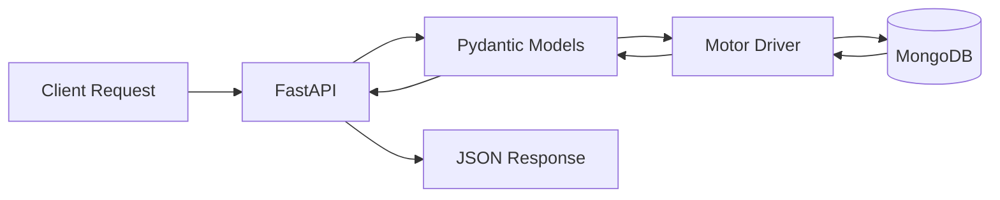

# How to Use MongoDB with FastAPI

Author: [nawazdhandala](https://www.github.com/nawazdhandala)

Tags: Python, FastAPI, MongoDB, Motor, Database, Async, Pydantic, ODM

Description: Learn how to integrate MongoDB with FastAPI using Motor for async operations. This comprehensive guide covers connection management, CRUD operations, data validation with Pydantic, indexing strategies, and production best practices.

---

> MongoDB's flexible document model pairs perfectly with FastAPI's async capabilities. Using Motor, the async MongoDB driver, you can build high-performance APIs that handle thousands of concurrent connections. This guide shows you how to set up a production-ready FastAPI application with MongoDB.

MongoDB is a natural fit for FastAPI projects. Both embrace modern patterns - FastAPI with async/await and type hints, MongoDB with flexible schemas and horizontal scaling.

---

## Architecture Overview

The following diagram shows how FastAPI interacts with MongoDB through the Motor async driver:



---

## Project Setup

### Installing Dependencies

Install the required packages for FastAPI with MongoDB support:

```bash
# Create a virtual environment
python -m venv venv
source venv/bin/activate  # On Windows: venv\Scripts\activate

# Install dependencies
pip install fastapi uvicorn motor pydantic python-dotenv
```

### Project Structure

Organize your project for maintainability and scalability:

```
project/
    app/
        __init__.py
        main.py
        config.py
        database.py
        models/
            __init__.py
            user.py
            product.py
        routes/
            __init__.py
            users.py
            products.py
        services/
            __init__.py
            user_service.py
    tests/
        __init__.py
        test_users.py
    .env
    requirements.txt
```

---

## Database Connection

### Configuration with Environment Variables

Create a configuration module that loads settings from environment variables:

```python
# app/config.py
from pydantic_settings import BaseSettings
from functools import lru_cache

class Settings(BaseSettings):
    """Application settings loaded from environment variables"""

    # MongoDB connection settings
    mongodb_url: str = "mongodb://localhost:27017"
    mongodb_database: str = "fastapi_app"

    # Connection pool settings
    mongodb_min_pool_size: int = 10
    mongodb_max_pool_size: int = 100

    # Application settings
    debug: bool = False

    class Config:
        env_file = ".env"
        env_file_encoding = "utf-8"

@lru_cache()
def get_settings() -> Settings:
    """Get cached settings instance"""
    return Settings()
```

### Async Database Client

Set up the Motor client with connection pooling and lifecycle management:

```python
# app/database.py
from motor.motor_asyncio import AsyncIOMotorClient, AsyncIOMotorDatabase
from app.config import get_settings
from typing import Optional
import logging

logger = logging.getLogger(__name__)

class Database:
    """MongoDB database connection manager"""

    client: Optional[AsyncIOMotorClient] = None
    database: Optional[AsyncIOMotorDatabase] = None

db = Database()

async def connect_to_mongodb() -> None:
    """
    Create database connection on application startup.
    Configures connection pooling for optimal performance.
    """
    settings = get_settings()

    logger.info(f"Connecting to MongoDB at {settings.mongodb_url}")

    # Create Motor client with connection pool settings
    db.client = AsyncIOMotorClient(
        settings.mongodb_url,
        minPoolSize=settings.mongodb_min_pool_size,
        maxPoolSize=settings.mongodb_max_pool_size,
        # Set timeouts to prevent hanging connections
        serverSelectionTimeoutMS=5000,
        connectTimeoutMS=10000,
        socketTimeoutMS=10000,
    )

    # Get database reference
    db.database = db.client[settings.mongodb_database]

    # Verify connection by running a simple command
    try:
        await db.client.admin.command("ping")
        logger.info("Successfully connected to MongoDB")
    except Exception as e:
        logger.error(f"Failed to connect to MongoDB: {e}")
        raise

async def close_mongodb_connection() -> None:
    """Close database connection on application shutdown"""
    if db.client:
        logger.info("Closing MongoDB connection")
        db.client.close()
        db.client = None
        db.database = None

def get_database() -> AsyncIOMotorDatabase:
    """Get database instance for dependency injection"""
    if db.database is None:
        raise RuntimeError("Database not initialized")
    return db.database
```

### FastAPI Application with Lifespan Events

Register database connection handlers using FastAPI's lifespan context manager:

```python
# app/main.py
from fastapi import FastAPI
from contextlib import asynccontextmanager
from app.database import connect_to_mongodb, close_mongodb_connection
from app.routes import users, products

@asynccontextmanager
async def lifespan(app: FastAPI):
    """
    Manage application lifespan events.
    Connect to MongoDB on startup and close connection on shutdown.
    """
    # Startup: connect to database
    await connect_to_mongodb()
    yield
    # Shutdown: close database connection
    await close_mongodb_connection()

# Create FastAPI application with lifespan handler
app = FastAPI(
    title="FastAPI MongoDB API",
    description="A production-ready API with MongoDB",
    version="1.0.0",
    lifespan=lifespan
)

# Include routers
app.include_router(users.router, prefix="/api/users", tags=["users"])
app.include_router(products.router, prefix="/api/products", tags=["products"])

@app.get("/health")
async def health_check():
    """Health check endpoint for load balancers and monitoring"""
    return {"status": "healthy"}
```

---

## Pydantic Models

### Base Document Model

Create a base model that handles MongoDB's ObjectId conversion:

```python
# app/models/base.py
from pydantic import BaseModel, Field, ConfigDict
from bson import ObjectId
from typing import Optional, Any
from datetime import datetime

class PyObjectId(str):
    """Custom type for handling MongoDB ObjectId"""

    @classmethod
    def __get_validators__(cls):
        yield cls.validate

    @classmethod
    def validate(cls, v, handler):
        if isinstance(v, ObjectId):
            return str(v)
        if isinstance(v, str) and ObjectId.is_valid(v):
            return v
        raise ValueError("Invalid ObjectId")

class MongoBaseModel(BaseModel):
    """Base model for MongoDB documents with common fields"""

    model_config = ConfigDict(
        populate_by_name=True,
        arbitrary_types_allowed=True,
        json_encoders={ObjectId: str}
    )

    id: Optional[PyObjectId] = Field(default=None, alias="_id")
    created_at: datetime = Field(default_factory=datetime.utcnow)
    updated_at: datetime = Field(default_factory=datetime.utcnow)

    def to_mongo(self) -> dict:
        """Convert model to MongoDB document format"""
        data = self.model_dump(by_alias=True, exclude_none=True)
        if "_id" in data and data["_id"] is None:
            del data["_id"]
        data["updated_at"] = datetime.utcnow()
        return data

    @classmethod
    def from_mongo(cls, data: dict):
        """Create model instance from MongoDB document"""
        if data is None:
            return None
        return cls(**data)
```

### User Model

Define a complete user model with validation:

```python
# app/models/user.py
from pydantic import BaseModel, Field, EmailStr
from typing import Optional, List
from datetime import datetime
from app.models.base import MongoBaseModel, PyObjectId
from enum import Enum

class UserRole(str, Enum):
    """User role enumeration"""
    ADMIN = "admin"
    USER = "user"
    MODERATOR = "moderator"

class Address(BaseModel):
    """Embedded address document"""
    street: str
    city: str
    state: str
    zip_code: str
    country: str = "USA"

class UserBase(BaseModel):
    """Base user fields for create and update operations"""
    email: EmailStr
    username: str = Field(..., min_length=3, max_length=50)
    full_name: Optional[str] = Field(None, max_length=100)
    role: UserRole = UserRole.USER
    is_active: bool = True
    tags: List[str] = Field(default_factory=list)
    address: Optional[Address] = None

class UserCreate(UserBase):
    """Schema for creating a new user"""
    password: str = Field(..., min_length=8)

class UserUpdate(BaseModel):
    """Schema for updating user fields (all optional)"""
    email: Optional[EmailStr] = None
    username: Optional[str] = Field(None, min_length=3, max_length=50)
    full_name: Optional[str] = Field(None, max_length=100)
    role: Optional[UserRole] = None
    is_active: Optional[bool] = None
    tags: Optional[List[str]] = None
    address: Optional[Address] = None

class User(MongoBaseModel, UserBase):
    """Complete user model stored in MongoDB"""
    hashed_password: str

    class Config:
        # Define collection name
        collection = "users"

class UserResponse(BaseModel):
    """User response schema (excludes sensitive fields)"""
    id: str = Field(..., alias="_id")
    email: EmailStr
    username: str
    full_name: Optional[str]
    role: UserRole
    is_active: bool
    tags: List[str]
    address: Optional[Address]
    created_at: datetime
    updated_at: datetime

    model_config = ConfigDict(populate_by_name=True)
```

---

## CRUD Operations

### User Service with Full CRUD

Implement a service layer that handles all database operations:

```python
# app/services/user_service.py
from motor.motor_asyncio import AsyncIOMotorDatabase
from bson import ObjectId
from typing import Optional, List
from datetime import datetime
from app.models.user import User, UserCreate, UserUpdate, UserResponse
import hashlib

class UserService:
    """Service class for user-related database operations"""

    def __init__(self, database: AsyncIOMotorDatabase):
        self.collection = database["users"]

    def _hash_password(self, password: str) -> str:
        """Hash password using SHA-256 (use bcrypt in production)"""
        return hashlib.sha256(password.encode()).hexdigest()

    async def create_user(self, user_data: UserCreate) -> UserResponse:
        """
        Create a new user in the database.
        Hashes the password before storing.
        """
        # Check if email already exists
        existing = await self.collection.find_one({"email": user_data.email})
        if existing:
            raise ValueError("Email already registered")

        # Create user document
        user_dict = user_data.model_dump(exclude={"password"})
        user_dict["hashed_password"] = self._hash_password(user_data.password)
        user_dict["created_at"] = datetime.utcnow()
        user_dict["updated_at"] = datetime.utcnow()

        # Insert into database
        result = await self.collection.insert_one(user_dict)

        # Fetch and return the created user
        created_user = await self.collection.find_one({"_id": result.inserted_id})
        return UserResponse(**created_user)

    async def get_user_by_id(self, user_id: str) -> Optional[UserResponse]:
        """Get a user by their ID"""
        if not ObjectId.is_valid(user_id):
            return None

        user = await self.collection.find_one({"_id": ObjectId(user_id)})
        if user:
            return UserResponse(**user)
        return None

    async def get_user_by_email(self, email: str) -> Optional[UserResponse]:
        """Get a user by their email address"""
        user = await self.collection.find_one({"email": email})
        if user:
            return UserResponse(**user)
        return None

    async def get_users(
        self,
        skip: int = 0,
        limit: int = 100,
        is_active: Optional[bool] = None,
        role: Optional[str] = None
    ) -> List[UserResponse]:
        """
        Get a paginated list of users with optional filtering.
        """
        # Build query filter
        query = {}
        if is_active is not None:
            query["is_active"] = is_active
        if role is not None:
            query["role"] = role

        # Execute query with pagination
        cursor = self.collection.find(query).skip(skip).limit(limit)

        users = []
        async for user in cursor:
            users.append(UserResponse(**user))

        return users

    async def update_user(
        self,
        user_id: str,
        user_update: UserUpdate
    ) -> Optional[UserResponse]:
        """
        Update user fields. Only updates provided fields.
        """
        if not ObjectId.is_valid(user_id):
            return None

        # Build update document with only non-None fields
        update_data = user_update.model_dump(exclude_none=True)

        if not update_data:
            # No fields to update
            return await self.get_user_by_id(user_id)

        # Always update the updated_at timestamp
        update_data["updated_at"] = datetime.utcnow()

        # Perform update
        result = await self.collection.update_one(
            {"_id": ObjectId(user_id)},
            {"$set": update_data}
        )

        if result.modified_count == 0:
            return None

        return await self.get_user_by_id(user_id)

    async def delete_user(self, user_id: str) -> bool:
        """Delete a user by ID. Returns True if deleted."""
        if not ObjectId.is_valid(user_id):
            return False

        result = await self.collection.delete_one({"_id": ObjectId(user_id)})
        return result.deleted_count > 0

    async def count_users(self, query: dict = None) -> int:
        """Count total users matching query"""
        return await self.collection.count_documents(query or {})
```

### API Routes

Create FastAPI routes that use the service layer:

```python
# app/routes/users.py
from fastapi import APIRouter, Depends, HTTPException, Query
from motor.motor_asyncio import AsyncIOMotorDatabase
from typing import List, Optional
from app.database import get_database
from app.models.user import UserCreate, UserUpdate, UserResponse, UserRole
from app.services.user_service import UserService

router = APIRouter()

def get_user_service(
    db: AsyncIOMotorDatabase = Depends(get_database)
) -> UserService:
    """Dependency to get user service instance"""
    return UserService(db)

@router.post("/", response_model=UserResponse, status_code=201)
async def create_user(
    user: UserCreate,
    service: UserService = Depends(get_user_service)
):
    """
    Create a new user.

    - **email**: Unique email address
    - **username**: Unique username (3-50 characters)
    - **password**: Minimum 8 characters
    """
    try:
        return await service.create_user(user)
    except ValueError as e:
        raise HTTPException(status_code=400, detail=str(e))

@router.get("/", response_model=List[UserResponse])
async def list_users(
    skip: int = Query(0, ge=0, description="Number of records to skip"),
    limit: int = Query(100, ge=1, le=1000, description="Maximum records to return"),
    is_active: Optional[bool] = Query(None, description="Filter by active status"),
    role: Optional[UserRole] = Query(None, description="Filter by role"),
    service: UserService = Depends(get_user_service)
):
    """Get a paginated list of users with optional filtering"""
    return await service.get_users(
        skip=skip,
        limit=limit,
        is_active=is_active,
        role=role.value if role else None
    )

@router.get("/{user_id}", response_model=UserResponse)
async def get_user(
    user_id: str,
    service: UserService = Depends(get_user_service)
):
    """Get a specific user by ID"""
    user = await service.get_user_by_id(user_id)
    if not user:
        raise HTTPException(status_code=404, detail="User not found")
    return user

@router.patch("/{user_id}", response_model=UserResponse)
async def update_user(
    user_id: str,
    user_update: UserUpdate,
    service: UserService = Depends(get_user_service)
):
    """Update user fields. Only provided fields will be updated."""
    user = await service.update_user(user_id, user_update)
    if not user:
        raise HTTPException(status_code=404, detail="User not found")
    return user

@router.delete("/{user_id}", status_code=204)
async def delete_user(
    user_id: str,
    service: UserService = Depends(get_user_service)
):
    """Delete a user by ID"""
    deleted = await service.delete_user(user_id)
    if not deleted:
        raise HTTPException(status_code=404, detail="User not found")
```

---

## Advanced Queries

### Aggregation Pipeline

Build complex aggregation queries for analytics and reporting:

```python
# app/services/analytics_service.py
from motor.motor_asyncio import AsyncIOMotorDatabase
from typing import List, Dict, Any
from datetime import datetime, timedelta

class AnalyticsService:
    """Service for analytics queries using MongoDB aggregation"""

    def __init__(self, database: AsyncIOMotorDatabase):
        self.users = database["users"]
        self.orders = database["orders"]

    async def get_user_stats_by_role(self) -> List[Dict[str, Any]]:
        """
        Get user count and average age grouped by role.
        Uses MongoDB aggregation pipeline.
        """
        pipeline = [
            # Group by role and calculate statistics
            {
                "$group": {
                    "_id": "$role",
                    "count": {"$sum": 1},
                    "active_count": {
                        "$sum": {"$cond": ["$is_active", 1, 0]}
                    }
                }
            },
            # Rename _id to role for cleaner output
            {
                "$project": {
                    "_id": 0,
                    "role": "$_id",
                    "total_users": "$count",
                    "active_users": "$active_count",
                    "inactive_users": {
                        "$subtract": ["$count", "$active_count"]
                    }
                }
            },
            # Sort by total users descending
            {"$sort": {"total_users": -1}}
        ]

        results = []
        async for doc in self.users.aggregate(pipeline):
            results.append(doc)
        return results

    async def get_users_by_registration_date(
        self,
        start_date: datetime,
        end_date: datetime
    ) -> List[Dict[str, Any]]:
        """
        Get daily user registration counts for a date range.
        """
        pipeline = [
            # Filter by date range
            {
                "$match": {
                    "created_at": {
                        "$gte": start_date,
                        "$lte": end_date
                    }
                }
            },
            # Group by date (truncate time)
            {
                "$group": {
                    "_id": {
                        "$dateToString": {
                            "format": "%Y-%m-%d",
                            "date": "$created_at"
                        }
                    },
                    "count": {"$sum": 1}
                }
            },
            # Sort by date
            {"$sort": {"_id": 1}},
            # Rename fields
            {
                "$project": {
                    "_id": 0,
                    "date": "$_id",
                    "registrations": "$count"
                }
            }
        ]

        results = []
        async for doc in self.users.aggregate(pipeline):
            results.append(doc)
        return results

    async def get_top_users_by_orders(self, limit: int = 10) -> List[Dict[str, Any]]:
        """
        Get top users by order count using a lookup join.
        """
        pipeline = [
            # Join with orders collection
            {
                "$lookup": {
                    "from": "orders",
                    "localField": "_id",
                    "foreignField": "user_id",
                    "as": "orders"
                }
            },
            # Add order count and total spent
            {
                "$addFields": {
                    "order_count": {"$size": "$orders"},
                    "total_spent": {"$sum": "$orders.total"}
                }
            },
            # Only include users with orders
            {"$match": {"order_count": {"$gt": 0}}},
            # Sort by order count
            {"$sort": {"order_count": -1}},
            # Limit results
            {"$limit": limit},
            # Project final fields
            {
                "$project": {
                    "_id": {"$toString": "$_id"},
                    "username": 1,
                    "email": 1,
                    "order_count": 1,
                    "total_spent": 1
                }
            }
        ]

        results = []
        async for doc in self.users.aggregate(pipeline):
            results.append(doc)
        return results
```

### Text Search

Implement full-text search with MongoDB text indexes:

```python
# app/services/search_service.py
from motor.motor_asyncio import AsyncIOMotorDatabase
from typing import List, Dict, Any

class SearchService:
    """Service for text search operations"""

    def __init__(self, database: AsyncIOMotorDatabase):
        self.products = database["products"]

    async def create_text_index(self):
        """
        Create a text index for search functionality.
        Call this during application initialization.
        """
        await self.products.create_index([
            ("name", "text"),
            ("description", "text"),
            ("tags", "text")
        ], weights={
            "name": 10,        # Name matches are most important
            "tags": 5,         # Tags are second
            "description": 1   # Description is least weighted
        })

    async def search_products(
        self,
        query: str,
        skip: int = 0,
        limit: int = 20
    ) -> List[Dict[str, Any]]:
        """
        Search products using full-text search.
        Returns results sorted by relevance score.
        """
        pipeline = [
            # Text search with score
            {
                "$match": {
                    "$text": {"$search": query}
                }
            },
            # Add relevance score
            {
                "$addFields": {
                    "score": {"$meta": "textScore"}
                }
            },
            # Sort by score descending
            {"$sort": {"score": -1}},
            # Pagination
            {"$skip": skip},
            {"$limit": limit},
            # Clean up output
            {
                "$project": {
                    "_id": {"$toString": "$_id"},
                    "name": 1,
                    "description": 1,
                    "price": 1,
                    "tags": 1,
                    "score": 1
                }
            }
        ]

        results = []
        async for doc in self.products.aggregate(pipeline):
            results.append(doc)
        return results
```

---

## Indexing Strategy

### Index Management

Create and manage indexes for optimal query performance:

```python
# app/database/indexes.py
from motor.motor_asyncio import AsyncIOMotorDatabase
import logging

logger = logging.getLogger(__name__)

async def create_indexes(database: AsyncIOMotorDatabase):
    """
    Create all required indexes for the application.
    Call this during application startup.
    """

    # Users collection indexes
    users = database["users"]

    # Unique index on email for fast lookups and uniqueness constraint
    await users.create_index("email", unique=True)
    logger.info("Created unique index on users.email")

    # Unique index on username
    await users.create_index("username", unique=True)
    logger.info("Created unique index on users.username")

    # Compound index for common query patterns
    await users.create_index([
        ("is_active", 1),
        ("role", 1),
        ("created_at", -1)
    ])
    logger.info("Created compound index on users for filtering")

    # Index for sorting by created_at
    await users.create_index([("created_at", -1)])
    logger.info("Created index on users.created_at")

    # Products collection indexes
    products = database["products"]

    # Index on category for filtering
    await products.create_index("category")
    logger.info("Created index on products.category")

    # Compound index for price range queries within category
    await products.create_index([
        ("category", 1),
        ("price", 1)
    ])
    logger.info("Created compound index on products for category+price")

    # Text index for search
    await products.create_index([
        ("name", "text"),
        ("description", "text"),
        ("tags", "text")
    ])
    logger.info("Created text index on products")

    # Orders collection indexes
    orders = database["orders"]

    # Index on user_id for user order lookups
    await orders.create_index("user_id")
    logger.info("Created index on orders.user_id")

    # Index on status and created_at for order management
    await orders.create_index([
        ("status", 1),
        ("created_at", -1)
    ])
    logger.info("Created compound index on orders for status queries")

    logger.info("All indexes created successfully")

async def list_indexes(database: AsyncIOMotorDatabase):
    """List all indexes for debugging and verification"""
    collections = await database.list_collection_names()

    for collection_name in collections:
        collection = database[collection_name]
        indexes = await collection.index_information()

        logger.info(f"Indexes for {collection_name}:")
        for index_name, index_info in indexes.items():
            logger.info(f"  {index_name}: {index_info}")
```

---

## Transactions

### Multi-Document Transactions

Use transactions for operations that must be atomic:

```python
# app/services/order_service.py
from motor.motor_asyncio import AsyncIOMotorDatabase, AsyncIOMotorClientSession
from bson import ObjectId
from typing import List, Optional
from datetime import datetime
from app.database import db

class OrderService:
    """Service for order operations with transaction support"""

    def __init__(self, database: AsyncIOMotorDatabase):
        self.database = database
        self.orders = database["orders"]
        self.products = database["products"]
        self.inventory = database["inventory"]

    async def create_order_with_transaction(
        self,
        user_id: str,
        items: List[dict]
    ) -> dict:
        """
        Create an order and update inventory in a single transaction.
        Ensures data consistency across collections.
        """
        async with await db.client.start_session() as session:
            async with session.start_transaction():
                try:
                    # Calculate order total and validate inventory
                    total = 0
                    order_items = []

                    for item in items:
                        product_id = item["product_id"]
                        quantity = item["quantity"]

                        # Get product details
                        product = await self.products.find_one(
                            {"_id": ObjectId(product_id)},
                            session=session
                        )

                        if not product:
                            raise ValueError(f"Product {product_id} not found")

                        # Check inventory
                        inventory = await self.inventory.find_one(
                            {"product_id": ObjectId(product_id)},
                            session=session
                        )

                        if not inventory or inventory["quantity"] < quantity:
                            raise ValueError(
                                f"Insufficient inventory for {product['name']}"
                            )

                        # Update inventory
                        await self.inventory.update_one(
                            {"product_id": ObjectId(product_id)},
                            {"$inc": {"quantity": -quantity}},
                            session=session
                        )

                        # Add to order items
                        item_total = product["price"] * quantity
                        total += item_total
                        order_items.append({
                            "product_id": ObjectId(product_id),
                            "name": product["name"],
                            "price": product["price"],
                            "quantity": quantity,
                            "subtotal": item_total
                        })

                    # Create order document
                    order = {
                        "user_id": ObjectId(user_id),
                        "items": order_items,
                        "total": total,
                        "status": "pending",
                        "created_at": datetime.utcnow(),
                        "updated_at": datetime.utcnow()
                    }

                    # Insert order
                    result = await self.orders.insert_one(
                        order,
                        session=session
                    )

                    order["_id"] = str(result.inserted_id)
                    return order

                except Exception as e:
                    # Transaction will automatically abort on exception
                    raise ValueError(f"Order creation failed: {str(e)}")
```

---

## Connection Pooling and Performance

### Optimized Connection Settings

Configure connection pooling for production workloads:

```python
# app/database.py (enhanced)
from motor.motor_asyncio import AsyncIOMotorClient
from app.config import get_settings

async def create_optimized_client() -> AsyncIOMotorClient:
    """
    Create an optimized Motor client for production use.
    Configures connection pooling and timeouts appropriately.
    """
    settings = get_settings()

    return AsyncIOMotorClient(
        settings.mongodb_url,
        # Connection pool settings
        minPoolSize=10,            # Minimum connections to maintain
        maxPoolSize=100,           # Maximum concurrent connections
        maxIdleTimeMS=60000,       # Close idle connections after 60s

        # Timeouts
        serverSelectionTimeoutMS=5000,   # Time to find a server
        connectTimeoutMS=10000,          # Time to establish connection
        socketTimeoutMS=20000,           # Time for socket operations

        # Write concern for durability
        w="majority",              # Wait for majority acknowledgment
        journal=True,              # Wait for journal write

        # Read preference for scaling reads
        readPreference="secondaryPreferred",  # Prefer replicas for reads

        # Compression for network efficiency
        compressors=["zstd", "snappy", "zlib"],

        # Retry settings
        retryWrites=True,          # Auto-retry failed writes
        retryReads=True,           # Auto-retry failed reads
    )
```

### Bulk Operations

Use bulk operations for efficient batch processing:

```python
# app/services/bulk_service.py
from motor.motor_asyncio import AsyncIOMotorDatabase
from typing import List, Dict, Any
from pymongo import UpdateOne, InsertOne, DeleteOne

class BulkService:
    """Service for bulk database operations"""

    def __init__(self, database: AsyncIOMotorDatabase):
        self.database = database

    async def bulk_upsert_products(
        self,
        products: List[Dict[str, Any]]
    ) -> Dict[str, int]:
        """
        Bulk upsert products using bulk_write for efficiency.
        Much faster than individual insert/update operations.
        """
        collection = self.database["products"]

        # Build bulk operations
        operations = []
        for product in products:
            # Use sku as unique identifier for upsert
            operations.append(
                UpdateOne(
                    {"sku": product["sku"]},
                    {"$set": product},
                    upsert=True
                )
            )

        # Execute bulk write
        result = await collection.bulk_write(operations, ordered=False)

        return {
            "matched": result.matched_count,
            "modified": result.modified_count,
            "upserted": result.upserted_count
        }

    async def bulk_delete_inactive_users(
        self,
        days_inactive: int = 365
    ) -> int:
        """
        Delete users inactive for specified days.
        Uses efficient deleteMany operation.
        """
        from datetime import datetime, timedelta

        cutoff = datetime.utcnow() - timedelta(days=days_inactive)

        collection = self.database["users"]
        result = await collection.delete_many({
            "is_active": False,
            "updated_at": {"$lt": cutoff}
        })

        return result.deleted_count
```

---

## Error Handling

### Custom Exception Handlers

Create robust error handling for MongoDB operations:

```python
# app/exceptions.py
from fastapi import HTTPException
from pymongo.errors import (
    DuplicateKeyError,
    ServerSelectionTimeoutError,
    NetworkTimeout,
    OperationFailure
)

class DatabaseException(HTTPException):
    """Base exception for database errors"""
    pass

class DocumentNotFoundError(DatabaseException):
    """Raised when a document is not found"""
    def __init__(self, collection: str, id: str):
        super().__init__(
            status_code=404,
            detail=f"Document not found in {collection}: {id}"
        )

class DuplicateDocumentError(DatabaseException):
    """Raised when a duplicate key error occurs"""
    def __init__(self, field: str):
        super().__init__(
            status_code=409,
            detail=f"Document with this {field} already exists"
        )

class DatabaseConnectionError(DatabaseException):
    """Raised when database connection fails"""
    def __init__(self):
        super().__init__(
            status_code=503,
            detail="Database connection unavailable"
        )

def handle_mongodb_error(error: Exception):
    """
    Convert MongoDB errors to appropriate HTTP exceptions.
    Call this in a try/except block around database operations.
    """
    if isinstance(error, DuplicateKeyError):
        # Extract the duplicate field from the error message
        key_pattern = error.details.get("keyPattern", {})
        field = list(key_pattern.keys())[0] if key_pattern else "field"
        raise DuplicateDocumentError(field)

    elif isinstance(error, ServerSelectionTimeoutError):
        raise DatabaseConnectionError()

    elif isinstance(error, NetworkTimeout):
        raise HTTPException(
            status_code=504,
            detail="Database operation timed out"
        )

    elif isinstance(error, OperationFailure):
        raise HTTPException(
            status_code=500,
            detail=f"Database operation failed: {str(error)}"
        )

    else:
        raise HTTPException(
            status_code=500,
            detail="An unexpected database error occurred"
        )
```

### Using Error Handlers in Routes

Apply error handling consistently in your routes:

```python
# app/routes/users.py (with error handling)
from app.exceptions import handle_mongodb_error, DocumentNotFoundError

@router.post("/", response_model=UserResponse, status_code=201)
async def create_user(
    user: UserCreate,
    service: UserService = Depends(get_user_service)
):
    """Create a new user with proper error handling"""
    try:
        return await service.create_user(user)
    except Exception as e:
        handle_mongodb_error(e)

@router.get("/{user_id}", response_model=UserResponse)
async def get_user(
    user_id: str,
    service: UserService = Depends(get_user_service)
):
    """Get user with proper 404 handling"""
    try:
        user = await service.get_user_by_id(user_id)
        if not user:
            raise DocumentNotFoundError("users", user_id)
        return user
    except DocumentNotFoundError:
        raise
    except Exception as e:
        handle_mongodb_error(e)
```

---

## Testing

### Test Setup with pytest

Create a test configuration that uses a separate test database:

```python
# tests/conftest.py
import pytest
import asyncio
from motor.motor_asyncio import AsyncIOMotorClient
from httpx import AsyncClient
from app.main import app
from app.database import db, get_database

# Test database URL
TEST_MONGODB_URL = "mongodb://localhost:27017"
TEST_DATABASE_NAME = "test_fastapi_app"

@pytest.fixture(scope="session")
def event_loop():
    """Create event loop for async tests"""
    loop = asyncio.get_event_loop_policy().new_event_loop()
    yield loop
    loop.close()

@pytest.fixture(scope="session")
async def test_client():
    """Create test Motor client"""
    client = AsyncIOMotorClient(TEST_MONGODB_URL)
    yield client
    client.close()

@pytest.fixture(scope="function")
async def test_database(test_client):
    """
    Get test database and clean up after each test.
    Drops all collections to ensure test isolation.
    """
    database = test_client[TEST_DATABASE_NAME]

    # Override the database dependency
    async def override_get_database():
        return database

    app.dependency_overrides[get_database] = override_get_database

    yield database

    # Cleanup: drop all collections after test
    collections = await database.list_collection_names()
    for collection in collections:
        await database[collection].drop()

    app.dependency_overrides.clear()

@pytest.fixture
async def async_client(test_database):
    """Create async HTTP client for testing endpoints"""
    async with AsyncClient(app=app, base_url="http://test") as client:
        yield client
```

### Writing Tests

Write comprehensive tests for your API endpoints:

```python
# tests/test_users.py
import pytest
from httpx import AsyncClient

@pytest.mark.asyncio
async def test_create_user(async_client: AsyncClient):
    """Test user creation endpoint"""
    user_data = {
        "email": "test@example.com",
        "username": "testuser",
        "password": "securepass123",
        "full_name": "Test User"
    }

    response = await async_client.post("/api/users/", json=user_data)

    assert response.status_code == 201
    data = response.json()
    assert data["email"] == user_data["email"]
    assert data["username"] == user_data["username"]
    assert "_id" in data

@pytest.mark.asyncio
async def test_create_duplicate_user(async_client: AsyncClient):
    """Test that duplicate email returns 409"""
    user_data = {
        "email": "duplicate@example.com",
        "username": "user1",
        "password": "securepass123"
    }

    # Create first user
    await async_client.post("/api/users/", json=user_data)

    # Try to create duplicate
    user_data["username"] = "user2"  # Different username, same email
    response = await async_client.post("/api/users/", json=user_data)

    assert response.status_code == 409

@pytest.mark.asyncio
async def test_get_user(async_client: AsyncClient):
    """Test getting a user by ID"""
    # Create user first
    user_data = {
        "email": "gettest@example.com",
        "username": "getuser",
        "password": "securepass123"
    }
    create_response = await async_client.post("/api/users/", json=user_data)
    user_id = create_response.json()["_id"]

    # Get user
    response = await async_client.get(f"/api/users/{user_id}")

    assert response.status_code == 200
    assert response.json()["email"] == user_data["email"]

@pytest.mark.asyncio
async def test_get_nonexistent_user(async_client: AsyncClient):
    """Test that nonexistent user returns 404"""
    fake_id = "507f1f77bcf86cd799439011"  # Valid ObjectId format
    response = await async_client.get(f"/api/users/{fake_id}")

    assert response.status_code == 404

@pytest.mark.asyncio
async def test_update_user(async_client: AsyncClient):
    """Test updating user fields"""
    # Create user
    user_data = {
        "email": "update@example.com",
        "username": "updateuser",
        "password": "securepass123"
    }
    create_response = await async_client.post("/api/users/", json=user_data)
    user_id = create_response.json()["_id"]

    # Update user
    update_data = {"full_name": "Updated Name"}
    response = await async_client.patch(
        f"/api/users/{user_id}",
        json=update_data
    )

    assert response.status_code == 200
    assert response.json()["full_name"] == "Updated Name"

@pytest.mark.asyncio
async def test_delete_user(async_client: AsyncClient):
    """Test deleting a user"""
    # Create user
    user_data = {
        "email": "delete@example.com",
        "username": "deleteuser",
        "password": "securepass123"
    }
    create_response = await async_client.post("/api/users/", json=user_data)
    user_id = create_response.json()["_id"]

    # Delete user
    response = await async_client.delete(f"/api/users/{user_id}")
    assert response.status_code == 204

    # Verify deleted
    get_response = await async_client.get(f"/api/users/{user_id}")
    assert get_response.status_code == 404

@pytest.mark.asyncio
async def test_list_users_with_pagination(async_client: AsyncClient):
    """Test listing users with pagination"""
    # Create multiple users
    for i in range(5):
        await async_client.post("/api/users/", json={
            "email": f"user{i}@example.com",
            "username": f"user{i}",
            "password": "securepass123"
        })

    # Test pagination
    response = await async_client.get("/api/users/?skip=0&limit=2")
    assert response.status_code == 200
    assert len(response.json()) == 2

    response = await async_client.get("/api/users/?skip=2&limit=2")
    assert response.status_code == 200
    assert len(response.json()) == 2
```

---

## Production Deployment

### Docker Configuration

Create a production-ready Docker setup:

```dockerfile
# Dockerfile
FROM python:3.11-slim

WORKDIR /app

# Install dependencies
COPY requirements.txt .
RUN pip install --no-cache-dir -r requirements.txt

# Copy application code
COPY app/ app/

# Create non-root user for security
RUN adduser --disabled-password --gecos "" appuser
USER appuser

# Expose port
EXPOSE 8000

# Run with uvicorn
CMD ["uvicorn", "app.main:app", "--host", "0.0.0.0", "--port", "8000"]
```

```yaml
# docker-compose.yml
version: '3.8'

services:
  api:
    build: .
    ports:
      - "8000:8000"
    environment:
      - MONGODB_URL=mongodb://mongo:27017
      - MONGODB_DATABASE=fastapi_app
    depends_on:
      - mongo
    restart: unless-stopped

  mongo:
    image: mongo:7.0
    volumes:
      - mongo_data:/data/db
    ports:
      - "27017:27017"
    restart: unless-stopped

volumes:
  mongo_data:
```

### Health Check Endpoint

Add a comprehensive health check that verifies MongoDB connectivity:

```python
# app/routes/health.py
from fastapi import APIRouter, Depends
from motor.motor_asyncio import AsyncIOMotorDatabase
from app.database import get_database
import time

router = APIRouter()

@router.get("/health")
async def health_check(
    db: AsyncIOMotorDatabase = Depends(get_database)
):
    """
    Health check endpoint for load balancers and monitoring.
    Verifies database connectivity and returns response time.
    """
    start = time.time()

    try:
        # Ping MongoDB to verify connection
        await db.command("ping")
        db_status = "healthy"
        db_latency = round((time.time() - start) * 1000, 2)
    except Exception as e:
        db_status = "unhealthy"
        db_latency = None

    status = "healthy" if db_status == "healthy" else "degraded"

    return {
        "status": status,
        "database": {
            "status": db_status,
            "latency_ms": db_latency
        },
        "timestamp": time.time()
    }
```

---

## Conclusion

You now have a complete foundation for building FastAPI applications with MongoDB. Key points to remember:

- **Use Motor** for async MongoDB operations that integrate naturally with FastAPI
- **Structure your code** with separate models, services, and routes for maintainability
- **Create appropriate indexes** early to ensure good query performance
- **Use transactions** when operations must be atomic across collections
- **Handle errors gracefully** with custom exception handlers
- **Write tests** using a separate test database for isolation
- **Configure connection pooling** appropriately for your production workload

The async nature of Motor combined with FastAPI's performance makes this stack capable of handling thousands of concurrent requests efficiently.

---

*Building a production API with FastAPI and MongoDB? [OneUptime](https://oneuptime.com) provides comprehensive monitoring for your API endpoints, database connections, and application performance. Set up alerts for slow queries, connection failures, and error rate spikes to keep your application running smoothly.*

**Related Reading:**
- [How to Implement Rate Limiting in FastAPI](https://oneuptime.com/blog/post/2025-01-06-fastapi-rate-limiting/view)
- [How to Test FastAPI Applications with pytest](https://oneuptime.com/blog/post/2026-01-24-configure-pytest-python-testing/view)
