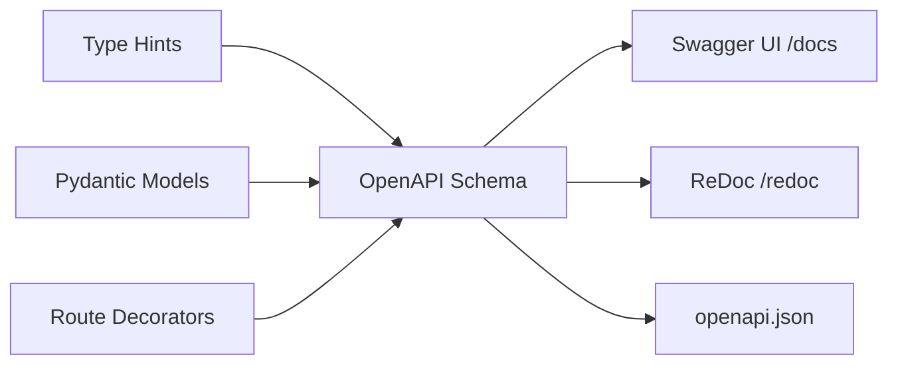

# How to Generate OpenAPI Documentation in FastAPI

Author: [nawazdhandala](https://www.github.com/nawazdhandala)

Tags: Python, FastAPI, OpenAPI, Swagger, Documentation

Description: Learn how to generate and customize OpenAPI documentation in FastAPI, including schema customization, security definitions, and interactive API docs.

---

> FastAPI automatically generates OpenAPI documentation for your API, but knowing how to customize it can make the difference between docs that sit unused and docs that developers actually love using.

One of FastAPI's biggest selling points is its automatic API documentation. Out of the box, you get interactive Swagger UI and ReDoc interfaces that let developers explore and test your API. But the real power comes when you learn to customize these docs to match your specific needs.

---

## How FastAPI Generates OpenAPI Docs

FastAPI uses Pydantic models and type hints to automatically generate an OpenAPI 3.0 schema. This schema powers both the Swagger UI (at `/docs`) and ReDoc (at `/redoc`) interfaces.



---

## Basic Setup

Here is a minimal FastAPI app with automatic documentation:

```python
# main.py
from fastapi import FastAPI

# Create the FastAPI app with basic metadata
# This metadata appears in the generated documentation
app = FastAPI(
    title="My API",
    description="A sample API with automatic OpenAPI documentation",
    version="1.0.0"
)

@app.get("/")
def read_root():
    return {"message": "Hello World"}

@app.get("/items/{item_id}")
def read_item(item_id: int, q: str = None):
    return {"item_id": item_id, "q": q}
```

Run this and visit `http://localhost:8000/docs` to see the Swagger UI, or `http://localhost:8000/redoc` for ReDoc.

---

## Customizing API Metadata

You can add detailed metadata that appears throughout your documentation:

```python
# app_with_metadata.py
from fastapi import FastAPI

# Define contact and license info for your API
# This helps developers know who to reach out to
app = FastAPI(
    title="Product Catalog API",
    description="""
## Product Catalog API

This API allows you to:

* **Create** new products
* **Read** product information
* **Update** existing products
* **Delete** products

### Authentication

All endpoints require a valid API key passed in the `X-API-Key` header.
    """,
    version="2.1.0",
    terms_of_service="https://example.com/terms/",
    contact={
        "name": "API Support",
        "url": "https://example.com/support",
        "email": "api-support@example.com",
    },
    license_info={
        "name": "Apache 2.0",
        "url": "https://www.apache.org/licenses/LICENSE-2.0.html",
    },
)
```

---

## Using Tags to Organize Endpoints

Tags group related endpoints together in the documentation. This is especially useful for larger APIs:

```python
# tags_example.py
from fastapi import FastAPI
from enum import Enum

# Define tags with descriptions upfront
# This provides context in the documentation sidebar
tags_metadata = [
    {
        "name": "users",
        "description": "Operations with users. Create, read, update, and delete users.",
    },
    {
        "name": "items",
        "description": "Manage items in the catalog.",
        "externalDocs": {
            "description": "Items external docs",
            "url": "https://example.com/items-docs/",
        },
    },
    {
        "name": "internal",
        "description": "Internal endpoints for system administration.",
    },
]

app = FastAPI(
    title="Organized API",
    openapi_tags=tags_metadata
)

# Assign tags to routes - they will be grouped in the docs
@app.get("/users/", tags=["users"])
def list_users():
    return [{"username": "johndoe"}]

@app.post("/users/", tags=["users"])
def create_user(username: str):
    return {"username": username}

@app.get("/items/", tags=["items"])
def list_items():
    return [{"name": "Widget"}]

@app.get("/health", tags=["internal"])
def health_check():
    return {"status": "healthy"}
```

---

## Documenting Request and Response Models

Pydantic models automatically generate schema documentation. Add descriptions and examples for clarity:

```python
# models_example.py
from fastapi import FastAPI
from pydantic import BaseModel, Field
from typing import Optional, List
from datetime import datetime

app = FastAPI(title="Product API")

# Use Field() to add descriptions and examples to model fields
# These appear in the schema section of the docs
class ProductCreate(BaseModel):
    name: str = Field(
        ...,
        min_length=1,
        max_length=100,
        description="The product name",
        examples=["Wireless Mouse"]
    )
    description: Optional[str] = Field(
        None,
        max_length=500,
        description="Detailed product description"
    )
    price: float = Field(
        ...,
        gt=0,
        description="Price in USD",
        examples=[29.99]
    )
    category: str = Field(
        ...,
        description="Product category",
        examples=["Electronics"]
    )
    tags: List[str] = Field(
        default=[],
        description="List of tags for searchability"
    )

    # Model-level configuration for documentation
    model_config = {
        "json_schema_extra": {
            "examples": [
                {
                    "name": "Wireless Mouse",
                    "description": "Ergonomic wireless mouse with 12-month battery life",
                    "price": 29.99,
                    "category": "Electronics",
                    "tags": ["computer", "accessories", "wireless"]
                }
            ]
        }
    }

class ProductResponse(BaseModel):
    id: int = Field(..., description="Unique product identifier")
    name: str
    description: Optional[str]
    price: float
    category: str
    tags: List[str]
    created_at: datetime = Field(..., description="Timestamp when product was created")
    updated_at: datetime = Field(..., description="Timestamp of last update")

# Use response_model to document what the endpoint returns
@app.post(
    "/products/",
    response_model=ProductResponse,
    tags=["products"],
    summary="Create a new product",
    description="Creates a new product in the catalog and returns the created product with its assigned ID."
)
def create_product(product: ProductCreate):
    # In a real app, this would save to a database
    return ProductResponse(
        id=1,
        **product.model_dump(),
        created_at=datetime.now(),
        updated_at=datetime.now()
    )
```

---

## Documenting Multiple Response Types

Real APIs return different responses for different scenarios. Document them all:

```python
# responses_example.py
from fastapi import FastAPI, HTTPException, status
from pydantic import BaseModel
from typing import Optional

app = FastAPI(title="API with Multiple Responses")

class Item(BaseModel):
    id: int
    name: str
    price: float

class ErrorResponse(BaseModel):
    detail: str
    error_code: Optional[str] = None

# Define all possible responses for this endpoint
# This generates accurate documentation for error handling
@app.get(
    "/items/{item_id}",
    response_model=Item,
    responses={
        200: {
            "description": "Successful response",
            "model": Item,
            "content": {
                "application/json": {
                    "example": {"id": 1, "name": "Widget", "price": 19.99}
                }
            }
        },
        404: {
            "description": "Item not found",
            "model": ErrorResponse,
            "content": {
                "application/json": {
                    "example": {"detail": "Item not found", "error_code": "ITEM_NOT_FOUND"}
                }
            }
        },
        422: {
            "description": "Validation error",
            "content": {
                "application/json": {
                    "example": {
                        "detail": [
                            {
                                "loc": ["path", "item_id"],
                                "msg": "value is not a valid integer",
                                "type": "type_error.integer"
                            }
                        ]
                    }
                }
            }
        }
    },
    summary="Get an item by ID",
    description="Retrieves a single item from the database by its unique identifier."
)
def get_item(item_id: int):
    # Simulated database lookup
    items_db = {1: Item(id=1, name="Widget", price=19.99)}

    if item_id not in items_db:
        raise HTTPException(
            status_code=404,
            detail="Item not found"
        )

    return items_db[item_id]
```

---

## Adding Security Definitions

Document your API's authentication requirements:

```python
# security_docs.py
from fastapi import FastAPI, Depends, HTTPException, Security, status
from fastapi.security import APIKeyHeader, HTTPBearer, OAuth2PasswordBearer

app = FastAPI(title="Secure API")

# API Key authentication
# This adds an "Authorize" button in Swagger UI for API keys
api_key_header = APIKeyHeader(
    name="X-API-Key",
    description="API key for authentication. Contact support to obtain one."
)

# Bearer token authentication
bearer_scheme = HTTPBearer(
    description="JWT token obtained from /auth/login"
)

# OAuth2 password flow
oauth2_scheme = OAuth2PasswordBearer(
    tokenUrl="/auth/token",
    description="OAuth2 password flow"
)

# Dependency that validates API key
async def verify_api_key(api_key: str = Security(api_key_header)):
    if api_key != "secret-api-key":
        raise HTTPException(
            status_code=status.HTTP_401_UNAUTHORIZED,
            detail="Invalid API key"
        )
    return api_key

# Protected endpoint with API key
@app.get(
    "/protected/",
    tags=["protected"],
    summary="Protected endpoint",
    description="This endpoint requires a valid API key in the X-API-Key header."
)
async def protected_route(api_key: str = Depends(verify_api_key)):
    return {"message": "Access granted", "api_key_preview": api_key[:4] + "..."}

# Document multiple security options
@app.get(
    "/flexible-auth/",
    tags=["protected"],
    summary="Flexible authentication",
    description="Accepts either API key or Bearer token authentication."
)
async def flexible_auth(
    api_key: str = Security(api_key_header, scopes=["read"]),
):
    return {"authenticated": True}
```

---

## Customizing OpenAPI Schema Directly

For advanced customization, modify the OpenAPI schema directly:

```python
# custom_schema.py
from fastapi import FastAPI
from fastapi.openapi.utils import get_openapi

app = FastAPI()

@app.get("/items/")
def read_items():
    return [{"name": "Item"}]

# Custom function to generate and modify the OpenAPI schema
def custom_openapi():
    # Return cached schema if already generated
    if app.openapi_schema:
        return app.openapi_schema

    # Generate the base schema
    openapi_schema = get_openapi(
        title="Custom Schema API",
        version="1.0.0",
        description="API with custom OpenAPI modifications",
        routes=app.routes,
    )

    # Add custom headers to all endpoints
    for path in openapi_schema["paths"]:
        for method in openapi_schema["paths"][path]:
            if method != "parameters":
                # Add a custom header parameter to every operation
                if "parameters" not in openapi_schema["paths"][path][method]:
                    openapi_schema["paths"][path][method]["parameters"] = []

                openapi_schema["paths"][path][method]["parameters"].append({
                    "name": "X-Request-ID",
                    "in": "header",
                    "required": False,
                    "schema": {"type": "string", "format": "uuid"},
                    "description": "Optional request ID for tracing"
                })

    # Add custom server information
    openapi_schema["servers"] = [
        {"url": "https://api.example.com", "description": "Production"},
        {"url": "https://staging-api.example.com", "description": "Staging"},
        {"url": "http://localhost:8000", "description": "Development"},
    ]

    # Add custom extension
    openapi_schema["x-api-status"] = "stable"

    # Cache the schema
    app.openapi_schema = openapi_schema
    return app.openapi_schema

# Replace the default openapi function
app.openapi = custom_openapi
```

---

## Deprecating Endpoints

Mark endpoints as deprecated to warn users:

```python
# deprecation_example.py
from fastapi import FastAPI
from pydantic import BaseModel

app = FastAPI(title="API with Deprecations")

class ItemV1(BaseModel):
    name: str

class ItemV2(BaseModel):
    name: str
    description: str
    price: float

# Mark old endpoints as deprecated
# They will still work but show a warning in the docs
@app.get(
    "/v1/items/",
    response_model=list[ItemV1],
    deprecated=True,
    tags=["v1"],
    summary="List items (deprecated)",
    description="**Deprecated**: Use /v2/items/ instead. This endpoint will be removed in v3.0."
)
def list_items_v1():
    return [{"name": "Widget"}]

# New version of the endpoint
@app.get(
    "/v2/items/",
    response_model=list[ItemV2],
    tags=["v2"],
    summary="List items",
    description="Returns a list of all items with full details."
)
def list_items_v2():
    return [{"name": "Widget", "description": "A useful widget", "price": 19.99}]
```

---

## Hiding Endpoints from Documentation

Some endpoints should not appear in public documentation:

```python
# hidden_endpoints.py
from fastapi import FastAPI

app = FastAPI(title="API with Hidden Endpoints")

# Normal public endpoint
@app.get("/public/")
def public_endpoint():
    return {"message": "This is public"}

# Hidden from OpenAPI documentation
# Use this for internal endpoints or debugging tools
@app.get("/internal/metrics/", include_in_schema=False)
def internal_metrics():
    return {"cpu": 45, "memory": 62}

@app.get("/debug/", include_in_schema=False)
def debug_info():
    return {"debug": "information"}
```

---

## Custom Documentation URLs

Change the default documentation paths or disable them entirely:

```python
# custom_docs_urls.py
from fastapi import FastAPI

# Custom paths for documentation
app = FastAPI(
    title="API with Custom Doc URLs",
    docs_url="/api/docs",           # Swagger UI at /api/docs
    redoc_url="/api/redoc",         # ReDoc at /api/redoc
    openapi_url="/api/openapi.json" # OpenAPI schema at /api/openapi.json
)

# To disable documentation entirely in production:
# app = FastAPI(docs_url=None, redoc_url=None)

@app.get("/")
def root():
    return {"message": "API is running"}
```

---

## Exporting OpenAPI Schema

Export the schema for use with other tools:

```python
# export_schema.py
from fastapi import FastAPI
from fastapi.openapi.utils import get_openapi
import json
import yaml

app = FastAPI(title="Export Demo API", version="1.0.0")

@app.get("/items/")
def list_items():
    return []

@app.post("/items/")
def create_item(name: str):
    return {"name": name}

# Endpoint to get the schema as JSON
@app.get("/schema/json", include_in_schema=False)
def get_schema_json():
    return app.openapi()

# Endpoint to get the schema as YAML
@app.get("/schema/yaml", include_in_schema=False)
def get_schema_yaml():
    schema = app.openapi()
    return yaml.dump(schema, default_flow_style=False)

# Script to export schema to file
if __name__ == "__main__":
    schema = get_openapi(
        title=app.title,
        version=app.version,
        routes=app.routes,
    )

    # Export as JSON
    with open("openapi.json", "w") as f:
        json.dump(schema, f, indent=2)

    # Export as YAML
    with open("openapi.yaml", "w") as f:
        yaml.dump(schema, f, default_flow_style=False)

    print("Schema exported to openapi.json and openapi.yaml")
```

Run the export script:

```bash
python export_schema.py
```

---

## Best Practices

| Practice | Description |
|----------|-------------|
| Use descriptive summaries | Keep them short and action-oriented |
| Add detailed descriptions | Explain what the endpoint does, not just what it is |
| Provide examples | Help developers understand expected formats |
| Document all responses | Include error responses, not just success |
| Use tags consistently | Group related endpoints logically |
| Version your API | Include version in title and URLs |
| Keep descriptions updated | Outdated docs are worse than no docs |

---

## Common Patterns

### API Key in Header

```python
# Always document your authentication method clearly
api_key_header = APIKeyHeader(
    name="X-API-Key",
    description="Your API key. Obtain one from the developer portal."
)
```

### Pagination Parameters

```python
# Document pagination in a reusable way
from fastapi import Query

@app.get("/items/")
def list_items(
    skip: int = Query(0, ge=0, description="Number of items to skip"),
    limit: int = Query(10, ge=1, le=100, description="Maximum items to return")
):
    pass
```

### File Uploads

```python
# Document file upload endpoints clearly
from fastapi import File, UploadFile

@app.post(
    "/upload/",
    summary="Upload a file",
    description="Accepts files up to 10MB. Supported formats: PNG, JPG, PDF"
)
async def upload_file(
    file: UploadFile = File(..., description="The file to upload")
):
    pass
```

---

## Conclusion

FastAPI's automatic OpenAPI documentation is powerful out of the box, but customization is what makes it truly useful. Key takeaways:

- Use detailed metadata to make your docs professional
- Organize endpoints with tags for better navigation
- Document all response types, including errors
- Add examples to help developers understand your API quickly
- Export schemas for use with API clients and testing tools

Well-documented APIs save time for everyone who uses them.

---

*Building APIs that need monitoring? [OneUptime](https://oneuptime.com) provides API monitoring, uptime tracking, and alerting to keep your endpoints healthy and your documentation accurate.*
