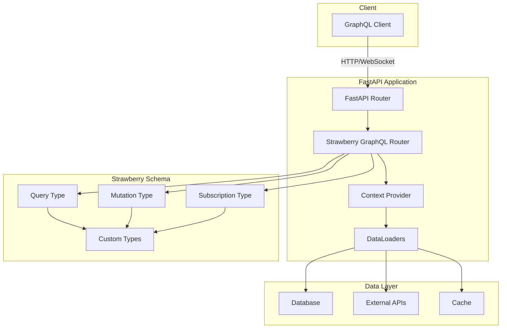
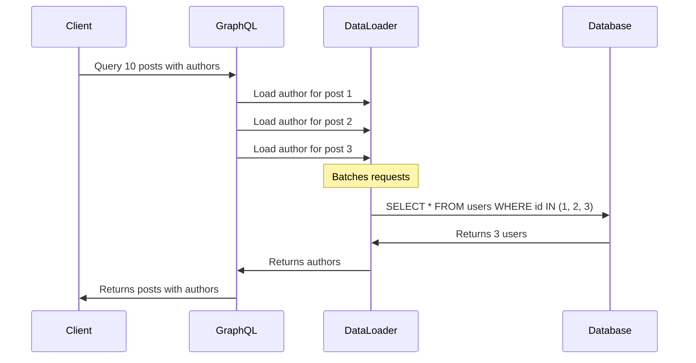
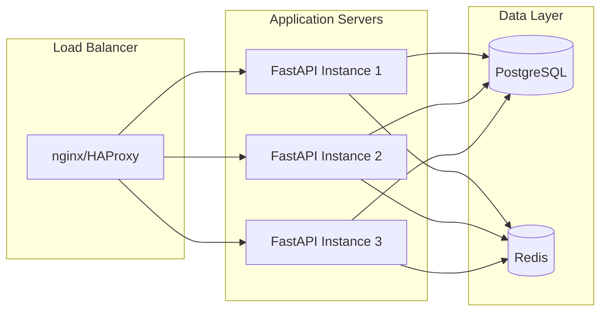

# How to Build GraphQL with Strawberry and FastAPI

Author: [nawazdhandala](https://www.github.com/nawazdhandala)

Tags: FastAPI, Strawberry, GraphQL, Python, API, Async, Type Safety, DataLoader

Description: Learn how to build production-ready GraphQL APIs using Strawberry and FastAPI. This comprehensive guide covers project setup, schema design, queries, mutations, subscriptions, authentication, error handling, testing, and deployment best practices.

---

> GraphQL has transformed how we build APIs by letting clients request exactly the data they need. Strawberry is a modern, type-safe GraphQL library for Python that uses native type hints to generate schemas automatically. Combined with FastAPI, you get a high-performance, async-first GraphQL server with automatic documentation and excellent developer experience.

This guide takes you from zero to a production-ready GraphQL API. We will cover everything from basic setup to advanced patterns like DataLoaders, authentication, and real-time subscriptions.

---

## Architecture Overview

Before diving into code, let us understand how Strawberry and FastAPI work together.



Strawberry handles schema definition and GraphQL execution, while FastAPI manages HTTP routing, dependency injection, and middleware. The combination gives you the best of both worlds.

---

## Project Setup

Start by creating a new project with the required dependencies. We will use Poetry for dependency management, but pip works just as well.

This command installs Strawberry with FastAPI integration, along with uvicorn for running the server and asyncpg for async database connections.

```bash
# Create project directory
mkdir graphql-api && cd graphql-api

# Initialize with Poetry (or use pip)
poetry init -n
poetry add strawberry-graphql[fastapi] fastapi uvicorn[standard]
poetry add sqlalchemy[asyncio] asyncpg  # For database
poetry add python-jose[cryptography] passlib[bcrypt]  # For auth

# Or with pip
pip install "strawberry-graphql[fastapi]" fastapi "uvicorn[standard]"
pip install "sqlalchemy[asyncio]" asyncpg
pip install "python-jose[cryptography]" "passlib[bcrypt]"
```

Create the following project structure to keep your code organized. Separating concerns makes the codebase maintainable as it grows.

```
graphql-api/
    app/
        __init__.py
        main.py              # FastAPI application
        schema/
            __init__.py
            types.py         # GraphQL types
            queries.py       # Query resolvers
            mutations.py     # Mutation resolvers
            subscriptions.py # Subscription resolvers
        models/
            __init__.py
            database.py      # Database models
        services/
            __init__.py
            user_service.py  # Business logic
        auth/
            __init__.py
            jwt.py           # JWT handling
            permissions.py   # Authorization
        dataloaders/
            __init__.py
            loaders.py       # DataLoader implementations
    tests/
        __init__.py
        test_queries.py
        test_mutations.py
    pyproject.toml
```

---

## Defining GraphQL Types

Strawberry uses Python dataclasses decorated with `@strawberry.type` to define GraphQL types. Type hints become GraphQL field types automatically.

This example shows how to define interconnected types. The `User` type has a method that resolves posts, demonstrating how to handle relationships between types.

```python
# app/schema/types.py
# GraphQL type definitions using Strawberry decorators
import strawberry
from typing import List, Optional
from datetime import datetime
from enum import Enum


@strawberry.enum
class UserRole(Enum):
    """User role enum - maps directly to GraphQL enum type"""
    ADMIN = "admin"
    MODERATOR = "moderator"
    USER = "user"


@strawberry.enum
class PostStatus(Enum):
    """Post publication status"""
    DRAFT = "draft"
    PUBLISHED = "published"
    ARCHIVED = "archived"


@strawberry.type
class User:
    """
    User type representing an authenticated user.
    Fields with type hints become GraphQL fields automatically.
    """
    id: strawberry.ID
    username: str
    email: str
    role: UserRole
    created_at: datetime
    bio: Optional[str] = None

    @strawberry.field
    async def posts(
        self,
        info: strawberry.Info,
        status: Optional[PostStatus] = None
    ) -> List["Post"]:
        """
        Resolver for user's posts.
        Uses DataLoader from context to batch database queries.
        The status parameter allows filtering by publication status.
        """
        loader = info.context["posts_by_user_loader"]
        posts = await loader.load(self.id)

        # Apply optional status filter
        if status:
            posts = [p for p in posts if p.status == status]

        return posts

    @strawberry.field
    def post_count(self, info: strawberry.Info) -> int:
        """
        Computed field - calculates total posts.
        This runs a separate query; consider caching for performance.
        """
        return info.context["post_counts"].get(self.id, 0)


@strawberry.type
class Post:
    """Blog post type with author relationship"""
    id: strawberry.ID
    title: str
    content: str
    slug: str
    status: PostStatus
    author_id: strawberry.Private[str]  # Internal field, not exposed in schema
    created_at: datetime
    updated_at: Optional[datetime] = None
    tags: List[str] = strawberry.field(default_factory=list)

    @strawberry.field
    async def author(self, info: strawberry.Info) -> User:
        """
        Resolve the post's author using DataLoader.
        The DataLoader batches multiple author lookups into one query.
        """
        loader = info.context["user_loader"]
        return await loader.load(self.author_id)

    @strawberry.field
    def excerpt(self, length: int = 200) -> str:
        """
        Computed field with argument.
        Returns truncated content as an excerpt.
        """
        if len(self.content) <= length:
            return self.content
        return self.content[:length].rsplit(" ", 1)[0] + "..."

    @strawberry.field
    async def comments(self, info: strawberry.Info) -> List["Comment"]:
        """Resolve comments for this post"""
        loader = info.context["comments_by_post_loader"]
        return await loader.load(self.id)


@strawberry.type
class Comment:
    """Comment on a blog post"""
    id: strawberry.ID
    content: str
    post_id: strawberry.Private[str]
    author_id: strawberry.Private[str]
    created_at: datetime

    @strawberry.field
    async def author(self, info: strawberry.Info) -> User:
        """Resolve comment author"""
        loader = info.context["user_loader"]
        return await loader.load(self.author_id)


@strawberry.type
class PageInfo:
    """Pagination information for cursor-based pagination"""
    has_next_page: bool
    has_previous_page: bool
    start_cursor: Optional[str] = None
    end_cursor: Optional[str] = None


@strawberry.type
class PostEdge:
    """Edge type for post pagination"""
    node: Post
    cursor: str


@strawberry.type
class PostConnection:
    """
    Connection type implementing Relay-style pagination.
    This pattern allows efficient cursor-based pagination.
    """
    edges: List[PostEdge]
    page_info: PageInfo
    total_count: int
```

---

## Building Queries

Queries are the read operations in GraphQL. Define them in a Query class where each method becomes a queryable field.

This query implementation shows various patterns including single item lookup, list queries with filtering, and cursor-based pagination for large datasets.

```python
# app/schema/queries.py
# GraphQL query resolvers
import strawberry
from typing import List, Optional
from datetime import datetime
import base64

from .types import (
    User, Post, Comment, PostStatus,
    PostConnection, PostEdge, PageInfo
)


def encode_cursor(id: str) -> str:
    """Encode ID as base64 cursor for pagination"""
    return base64.b64encode(f"cursor:{id}".encode()).decode()


def decode_cursor(cursor: str) -> str:
    """Decode base64 cursor back to ID"""
    decoded = base64.b64decode(cursor.encode()).decode()
    return decoded.replace("cursor:", "")


@strawberry.type
class Query:
    """
    Root query type.
    All read operations are defined as methods here.
    """

    @strawberry.field
    async def user(
        self,
        info: strawberry.Info,
        id: strawberry.ID
    ) -> Optional[User]:
        """
        Fetch a single user by ID.
        Returns None if user not found (nullable return type).
        """
        service = info.context["user_service"]
        return await service.get_by_id(id)

    @strawberry.field
    async def user_by_username(
        self,
        info: strawberry.Info,
        username: str
    ) -> Optional[User]:
        """Fetch user by username"""
        service = info.context["user_service"]
        return await service.get_by_username(username)

    @strawberry.field
    async def users(
        self,
        info: strawberry.Info,
        limit: int = 10,
        offset: int = 0
    ) -> List[User]:
        """
        Fetch multiple users with offset pagination.
        Offset pagination is simpler but less efficient for large datasets.
        """
        service = info.context["user_service"]
        return await service.get_all(limit=limit, offset=offset)

    @strawberry.field
    async def post(
        self,
        info: strawberry.Info,
        id: Optional[strawberry.ID] = None,
        slug: Optional[str] = None
    ) -> Optional[Post]:
        """
        Fetch a single post by ID or slug.
        At least one identifier must be provided.
        """
        if not id and not slug:
            raise ValueError("Must provide either id or slug")

        service = info.context["post_service"]

        if id:
            return await service.get_by_id(id)
        return await service.get_by_slug(slug)

    @strawberry.field
    async def posts(
        self,
        info: strawberry.Info,
        status: Optional[PostStatus] = None,
        tag: Optional[str] = None,
        first: int = 10,
        after: Optional[str] = None
    ) -> PostConnection:
        """
        Fetch posts with cursor-based pagination.

        Cursor pagination is more efficient for large datasets:
        - 'first' specifies how many items to fetch
        - 'after' is the cursor of the last item from previous page

        Returns a connection object with edges and pagination info.
        """
        service = info.context["post_service"]

        # Decode cursor to get the starting point
        cursor_id = decode_cursor(after) if after else None

        # Fetch one extra to determine if there are more pages
        posts = await service.get_posts(
            status=status,
            tag=tag,
            limit=first + 1,
            after_id=cursor_id
        )

        # Check if we have more items
        has_next_page = len(posts) > first
        if has_next_page:
            posts = posts[:first]  # Remove the extra item

        # Build edges with cursors
        edges = [
            PostEdge(node=post, cursor=encode_cursor(post.id))
            for post in posts
        ]

        # Build page info
        page_info = PageInfo(
            has_next_page=has_next_page,
            has_previous_page=after is not None,
            start_cursor=edges[0].cursor if edges else None,
            end_cursor=edges[-1].cursor if edges else None
        )

        # Get total count (consider caching this)
        total = await service.count_posts(status=status, tag=tag)

        return PostConnection(
            edges=edges,
            page_info=page_info,
            total_count=total
        )

    @strawberry.field
    async def search_posts(
        self,
        info: strawberry.Info,
        query: str,
        limit: int = 10
    ) -> List[Post]:
        """
        Full-text search across posts.
        Searches title and content fields.
        """
        if len(query) < 3:
            raise ValueError("Search query must be at least 3 characters")

        service = info.context["post_service"]
        return await service.search(query, limit=limit)

    @strawberry.field
    async def me(self, info: strawberry.Info) -> Optional[User]:
        """
        Get the currently authenticated user.
        Returns None if not authenticated.
        """
        user = info.context.get("current_user")
        return user
```

---

## Implementing Mutations

Mutations handle create, update, and delete operations. Use input types to group mutation arguments and response types to return structured results.

This pattern of using input and response types makes your API more maintainable and provides clear contracts for clients.

```python
# app/schema/mutations.py
# GraphQL mutation resolvers
import strawberry
from typing import Optional, List
from datetime import datetime

from .types import User, Post, Comment, PostStatus, UserRole


@strawberry.input
class CreateUserInput:
    """Input type for user registration"""
    username: str
    email: str
    password: str
    bio: Optional[str] = None


@strawberry.input
class UpdateUserInput:
    """Input type for user profile updates"""
    username: Optional[str] = None
    email: Optional[str] = None
    bio: Optional[str] = None


@strawberry.input
class CreatePostInput:
    """Input type for creating a new post"""
    title: str
    content: str
    tags: List[str] = strawberry.field(default_factory=list)
    status: PostStatus = PostStatus.DRAFT


@strawberry.input
class UpdatePostInput:
    """Input type for updating an existing post"""
    title: Optional[str] = None
    content: Optional[str] = None
    tags: Optional[List[str]] = None
    status: Optional[PostStatus] = None


@strawberry.type
class MutationError:
    """Error type for mutation failures"""
    field: Optional[str]  # Which field caused the error
    message: str


@strawberry.type
class UserResponse:
    """Response type for user mutations"""
    success: bool
    user: Optional[User] = None
    errors: List[MutationError] = strawberry.field(default_factory=list)


@strawberry.type
class PostResponse:
    """Response type for post mutations"""
    success: bool
    post: Optional[Post] = None
    errors: List[MutationError] = strawberry.field(default_factory=list)


@strawberry.type
class DeleteResponse:
    """Response type for delete operations"""
    success: bool
    message: str


@strawberry.type
class AuthPayload:
    """Response type for authentication"""
    access_token: str
    refresh_token: str
    user: User


@strawberry.type
class Mutation:
    """
    Root mutation type.
    All write operations are defined here.
    """

    @strawberry.mutation
    async def register(
        self,
        info: strawberry.Info,
        input: CreateUserInput
    ) -> UserResponse:
        """
        Register a new user account.
        Validates input and creates the user in the database.
        """
        service = info.context["user_service"]
        errors = []

        # Validate username
        if len(input.username) < 3:
            errors.append(MutationError(
                field="username",
                message="Username must be at least 3 characters"
            ))

        # Check for existing username
        existing = await service.get_by_username(input.username)
        if existing:
            errors.append(MutationError(
                field="username",
                message="Username already taken"
            ))

        # Check for existing email
        existing = await service.get_by_email(input.email)
        if existing:
            errors.append(MutationError(
                field="email",
                message="Email already registered"
            ))

        # Return early if validation failed
        if errors:
            return UserResponse(success=False, errors=errors)

        # Create the user
        user = await service.create_user(
            username=input.username,
            email=input.email,
            password=input.password,
            bio=input.bio
        )

        return UserResponse(success=True, user=user)

    @strawberry.mutation
    async def login(
        self,
        info: strawberry.Info,
        username: str,
        password: str
    ) -> AuthPayload:
        """
        Authenticate user and return JWT tokens.
        Raises error if credentials are invalid.
        """
        auth_service = info.context["auth_service"]

        # Validate credentials
        user = await auth_service.authenticate(username, password)
        if not user:
            raise ValueError("Invalid username or password")

        # Generate tokens
        access_token = auth_service.create_access_token(user.id)
        refresh_token = auth_service.create_refresh_token(user.id)

        return AuthPayload(
            access_token=access_token,
            refresh_token=refresh_token,
            user=user
        )

    @strawberry.mutation
    async def refresh_token(
        self,
        info: strawberry.Info,
        refresh_token: str
    ) -> AuthPayload:
        """
        Exchange refresh token for new access token.
        Use this when the access token expires.
        """
        auth_service = info.context["auth_service"]

        # Validate refresh token and get user
        user = await auth_service.verify_refresh_token(refresh_token)
        if not user:
            raise ValueError("Invalid or expired refresh token")

        # Generate new tokens
        new_access = auth_service.create_access_token(user.id)
        new_refresh = auth_service.create_refresh_token(user.id)

        return AuthPayload(
            access_token=new_access,
            refresh_token=new_refresh,
            user=user
        )

    @strawberry.mutation
    async def update_profile(
        self,
        info: strawberry.Info,
        input: UpdateUserInput
    ) -> UserResponse:
        """
        Update the current user's profile.
        Requires authentication.
        """
        current_user = info.context.get("current_user")
        if not current_user:
            raise PermissionError("Authentication required")

        service = info.context["user_service"]
        errors = []

        # Validate username if being changed
        if input.username:
            if len(input.username) < 3:
                errors.append(MutationError(
                    field="username",
                    message="Username must be at least 3 characters"
                ))
            else:
                existing = await service.get_by_username(input.username)
                if existing and existing.id != current_user.id:
                    errors.append(MutationError(
                        field="username",
                        message="Username already taken"
                    ))

        if errors:
            return UserResponse(success=False, errors=errors)

        # Update user
        updated = await service.update_user(
            user_id=current_user.id,
            username=input.username,
            email=input.email,
            bio=input.bio
        )

        return UserResponse(success=True, user=updated)

    @strawberry.mutation
    async def create_post(
        self,
        info: strawberry.Info,
        input: CreatePostInput
    ) -> PostResponse:
        """
        Create a new blog post.
        Requires authentication.
        """
        current_user = info.context.get("current_user")
        if not current_user:
            raise PermissionError("Authentication required")

        service = info.context["post_service"]

        # Validate input
        errors = []
        if len(input.title) < 5:
            errors.append(MutationError(
                field="title",
                message="Title must be at least 5 characters"
            ))

        if len(input.content) < 50:
            errors.append(MutationError(
                field="content",
                message="Content must be at least 50 characters"
            ))

        if errors:
            return PostResponse(success=False, errors=errors)

        # Create post
        post = await service.create_post(
            title=input.title,
            content=input.content,
            author_id=current_user.id,
            tags=input.tags,
            status=input.status
        )

        return PostResponse(success=True, post=post)

    @strawberry.mutation
    async def update_post(
        self,
        info: strawberry.Info,
        id: strawberry.ID,
        input: UpdatePostInput
    ) -> PostResponse:
        """
        Update an existing post.
        Only the author or admin can update.
        """
        current_user = info.context.get("current_user")
        if not current_user:
            raise PermissionError("Authentication required")

        service = info.context["post_service"]

        # Get existing post
        post = await service.get_by_id(id)
        if not post:
            return PostResponse(
                success=False,
                errors=[MutationError(field="id", message="Post not found")]
            )

        # Check authorization
        is_author = post.author_id == current_user.id
        is_admin = current_user.role == UserRole.ADMIN

        if not is_author and not is_admin:
            raise PermissionError("Not authorized to update this post")

        # Update post
        updated = await service.update_post(
            post_id=id,
            title=input.title,
            content=input.content,
            tags=input.tags,
            status=input.status
        )

        return PostResponse(success=True, post=updated)

    @strawberry.mutation
    async def delete_post(
        self,
        info: strawberry.Info,
        id: strawberry.ID
    ) -> DeleteResponse:
        """
        Delete a post.
        Only the author or admin can delete.
        """
        current_user = info.context.get("current_user")
        if not current_user:
            raise PermissionError("Authentication required")

        service = info.context["post_service"]

        # Get existing post
        post = await service.get_by_id(id)
        if not post:
            return DeleteResponse(success=False, message="Post not found")

        # Check authorization
        is_author = post.author_id == current_user.id
        is_admin = current_user.role == UserRole.ADMIN

        if not is_author and not is_admin:
            raise PermissionError("Not authorized to delete this post")

        # Delete post
        await service.delete_post(id)

        return DeleteResponse(success=True, message="Post deleted successfully")
```

---

## Real-time Subscriptions

Subscriptions enable real-time updates over WebSocket connections. Strawberry supports async generators for streaming data to clients.

This implementation uses an in-memory event system for simplicity. In production, use Redis pub/sub or a message queue for multi-instance deployments.

```python
# app/schema/subscriptions.py
# GraphQL subscription resolvers for real-time updates
import strawberry
from typing import AsyncGenerator, Optional
import asyncio
from datetime import datetime
from enum import Enum

from .types import Post, Comment, User


@strawberry.enum
class EventType(Enum):
    """Types of events that can be subscribed to"""
    POST_CREATED = "post_created"
    POST_UPDATED = "post_updated"
    POST_DELETED = "post_deleted"
    COMMENT_ADDED = "comment_added"


@strawberry.type
class PostEvent:
    """Event payload for post changes"""
    event_type: EventType
    post: Optional[Post] = None
    post_id: Optional[strawberry.ID] = None  # Used for delete events
    timestamp: datetime = strawberry.field(default_factory=datetime.utcnow)


@strawberry.type
class CommentEvent:
    """Event payload for new comments"""
    post_id: strawberry.ID
    comment: Comment
    timestamp: datetime = strawberry.field(default_factory=datetime.utcnow)


class EventBroker:
    """
    Simple in-memory event broker for subscriptions.
    In production, use Redis pub/sub for multi-instance support.
    """

    def __init__(self):
        self._subscribers: dict[str, list[asyncio.Queue]] = {}

    def subscribe(self, channel: str) -> asyncio.Queue:
        """Subscribe to a channel and return a queue for receiving events"""
        if channel not in self._subscribers:
            self._subscribers[channel] = []

        queue = asyncio.Queue()
        self._subscribers[channel].append(queue)
        return queue

    def unsubscribe(self, channel: str, queue: asyncio.Queue):
        """Remove a subscriber from a channel"""
        if channel in self._subscribers:
            self._subscribers[channel].remove(queue)

    async def publish(self, channel: str, event: any):
        """Publish an event to all subscribers on a channel"""
        if channel not in self._subscribers:
            return

        for queue in self._subscribers[channel]:
            await queue.put(event)


# Global event broker instance
event_broker = EventBroker()


@strawberry.type
class Subscription:
    """
    Root subscription type.
    Methods here use async generators to stream events.
    """

    @strawberry.subscription
    async def post_events(
        self,
        info: strawberry.Info,
        author_id: Optional[strawberry.ID] = None
    ) -> AsyncGenerator[PostEvent, None]:
        """
        Subscribe to post creation, update, and deletion events.
        Optionally filter by author ID.
        """
        channel = "posts"
        queue = event_broker.subscribe(channel)

        try:
            while True:
                # Wait for the next event
                event: PostEvent = await queue.get()

                # Apply author filter if specified
                if author_id and event.post:
                    if event.post.author_id != author_id:
                        continue

                yield event

        finally:
            # Clean up subscription when client disconnects
            event_broker.unsubscribe(channel, queue)

    @strawberry.subscription
    async def comments_on_post(
        self,
        info: strawberry.Info,
        post_id: strawberry.ID
    ) -> AsyncGenerator[CommentEvent, None]:
        """
        Subscribe to new comments on a specific post.
        Useful for live comment feeds.
        """
        channel = f"comments:{post_id}"
        queue = event_broker.subscribe(channel)

        try:
            while True:
                event: CommentEvent = await queue.get()
                yield event

        finally:
            event_broker.unsubscribe(channel, queue)

    @strawberry.subscription
    async def user_activity(
        self,
        info: strawberry.Info
    ) -> AsyncGenerator[str, None]:
        """
        Subscribe to general user activity notifications.
        Demonstrates simple string streaming.
        """
        current_user = info.context.get("current_user")
        if not current_user:
            raise PermissionError("Authentication required")

        channel = f"activity:{current_user.id}"
        queue = event_broker.subscribe(channel)

        try:
            while True:
                message = await queue.get()
                yield message

        finally:
            event_broker.unsubscribe(channel, queue)


async def publish_post_event(event_type: EventType, post: Post = None, post_id: str = None):
    """Helper function to publish post events from mutations"""
    event = PostEvent(
        event_type=event_type,
        post=post,
        post_id=post_id
    )
    await event_broker.publish("posts", event)


async def publish_comment_event(post_id: str, comment: Comment):
    """Helper function to publish comment events"""
    event = CommentEvent(post_id=post_id, comment=comment)
    await event_broker.publish(f"comments:{post_id}", event)
```

---

## DataLoaders for N+1 Prevention

The N+1 problem occurs when fetching related data triggers multiple database queries. DataLoaders batch these queries automatically.



This DataLoader implementation batches database queries and caches results within a single request. Each request gets fresh DataLoaders to prevent stale data.

```python
# app/dataloaders/loaders.py
# DataLoader implementations for efficient data fetching
from strawberry.dataloader import DataLoader
from typing import List, Optional
from collections import defaultdict

from app.schema.types import User, Post, Comment


class DataLoaderFactory:
    """
    Factory for creating DataLoaders.
    Each request should get fresh DataLoaders to avoid stale data.
    """

    def __init__(self, db_session):
        self.db = db_session

    def create_user_loader(self) -> DataLoader[str, Optional[User]]:
        """
        DataLoader for fetching users by ID.
        Batches multiple user lookups into a single query.
        """
        async def batch_load_users(ids: List[str]) -> List[Optional[User]]:
            # Single query for all requested users
            query = "SELECT * FROM users WHERE id = ANY($1)"
            rows = await self.db.fetch(query, ids)

            # Map results by ID for correct ordering
            users_by_id = {
                row["id"]: User(
                    id=row["id"],
                    username=row["username"],
                    email=row["email"],
                    role=row["role"],
                    bio=row["bio"],
                    created_at=row["created_at"]
                )
                for row in rows
            }

            # Return in same order as input IDs
            # None for any IDs not found
            return [users_by_id.get(id) for id in ids]

        return DataLoader(load_fn=batch_load_users)

    def create_posts_by_user_loader(self) -> DataLoader[str, List[Post]]:
        """
        DataLoader for fetching posts by user ID.
        Returns a list of posts for each user.
        """
        async def batch_load_posts(user_ids: List[str]) -> List[List[Post]]:
            # Single query for all users' posts
            query = """
                SELECT * FROM posts
                WHERE author_id = ANY($1)
                ORDER BY created_at DESC
            """
            rows = await self.db.fetch(query, user_ids)

            # Group posts by author
            posts_by_user = defaultdict(list)
            for row in rows:
                post = Post(
                    id=row["id"],
                    title=row["title"],
                    content=row["content"],
                    slug=row["slug"],
                    status=row["status"],
                    author_id=row["author_id"],
                    tags=row["tags"],
                    created_at=row["created_at"],
                    updated_at=row["updated_at"]
                )
                posts_by_user[row["author_id"]].append(post)

            # Return lists in same order as input
            return [posts_by_user.get(id, []) for id in user_ids]

        return DataLoader(load_fn=batch_load_posts)

    def create_comments_by_post_loader(self) -> DataLoader[str, List[Comment]]:
        """
        DataLoader for fetching comments by post ID.
        Returns a list of comments for each post.
        """
        async def batch_load_comments(post_ids: List[str]) -> List[List[Comment]]:
            query = """
                SELECT * FROM comments
                WHERE post_id = ANY($1)
                ORDER BY created_at ASC
            """
            rows = await self.db.fetch(query, post_ids)

            # Group comments by post
            comments_by_post = defaultdict(list)
            for row in rows:
                comment = Comment(
                    id=row["id"],
                    content=row["content"],
                    post_id=row["post_id"],
                    author_id=row["author_id"],
                    created_at=row["created_at"]
                )
                comments_by_post[row["post_id"]].append(comment)

            return [comments_by_post.get(id, []) for id in post_ids]

        return DataLoader(load_fn=batch_load_comments)


def create_dataloaders(db_session) -> dict:
    """
    Create all DataLoaders for a request.
    Call this in the context factory for each request.
    """
    factory = DataLoaderFactory(db_session)

    return {
        "user_loader": factory.create_user_loader(),
        "posts_by_user_loader": factory.create_posts_by_user_loader(),
        "comments_by_post_loader": factory.create_comments_by_post_loader(),
    }
```

---

## Authentication and Authorization

Implement JWT-based authentication and role-based authorization using Strawberry's permission system.

This permission system integrates with FastAPI's dependency injection. The context factory extracts the current user from the JWT token.

```python
# app/auth/permissions.py
# Authorization permissions for GraphQL fields
import strawberry
from strawberry.permission import BasePermission
from strawberry.types import Info
from typing import Any, List

from app.schema.types import UserRole


class IsAuthenticated(BasePermission):
    """
    Permission that requires a valid authenticated user.
    Apply to fields that need authentication.
    """
    message = "Authentication required"

    def has_permission(self, source: Any, info: Info, **kwargs) -> bool:
        user = info.context.get("current_user")
        return user is not None


class IsAdmin(BasePermission):
    """
    Permission that requires admin role.
    Use for administrative operations.
    """
    message = "Admin access required"

    def has_permission(self, source: Any, info: Info, **kwargs) -> bool:
        user = info.context.get("current_user")
        if not user:
            return False
        return user.role == UserRole.ADMIN


class IsOwnerOrAdmin(BasePermission):
    """
    Permission that allows owners or admins.
    The source object must have an owner_id or author_id attribute.
    """
    message = "Not authorized to access this resource"

    def has_permission(self, source: Any, info: Info, **kwargs) -> bool:
        user = info.context.get("current_user")
        if not user:
            return False

        # Admins can access anything
        if user.role == UserRole.ADMIN:
            return True

        # Check ownership
        owner_id = getattr(source, "owner_id", None) or getattr(source, "author_id", None)
        return owner_id == user.id


class HasRole(BasePermission):
    """
    Configurable permission for specific roles.
    Usage: @strawberry.field(permission_classes=[HasRole(UserRole.MODERATOR)])
    """
    message = "Insufficient permissions"

    def __init__(self, *roles: UserRole):
        self.roles = roles

    def has_permission(self, source: Any, info: Info, **kwargs) -> bool:
        user = info.context.get("current_user")
        if not user:
            return False
        return user.role in self.roles


# app/auth/jwt.py
# JWT token handling
from jose import jwt, JWTError
from datetime import datetime, timedelta
from typing import Optional
import os

SECRET_KEY = os.environ.get("JWT_SECRET_KEY", "your-secret-key")
ALGORITHM = "HS256"
ACCESS_TOKEN_EXPIRE_MINUTES = 30
REFRESH_TOKEN_EXPIRE_DAYS = 7


def create_access_token(user_id: str, expires_delta: timedelta = None) -> str:
    """Create a JWT access token"""
    expire = datetime.utcnow() + (expires_delta or timedelta(minutes=ACCESS_TOKEN_EXPIRE_MINUTES))

    payload = {
        "sub": user_id,
        "exp": expire,
        "type": "access"
    }

    return jwt.encode(payload, SECRET_KEY, algorithm=ALGORITHM)


def create_refresh_token(user_id: str) -> str:
    """Create a JWT refresh token with longer expiry"""
    expire = datetime.utcnow() + timedelta(days=REFRESH_TOKEN_EXPIRE_DAYS)

    payload = {
        "sub": user_id,
        "exp": expire,
        "type": "refresh"
    }

    return jwt.encode(payload, SECRET_KEY, algorithm=ALGORITHM)


def decode_token(token: str) -> Optional[dict]:
    """Decode and validate a JWT token"""
    try:
        payload = jwt.decode(token, SECRET_KEY, algorithms=[ALGORITHM])
        return payload
    except JWTError:
        return None


async def get_user_from_token(token: str, user_service) -> Optional[Any]:
    """Extract user from JWT token"""
    payload = decode_token(token)
    if not payload:
        return None

    user_id = payload.get("sub")
    if not user_id:
        return None

    return await user_service.get_by_id(user_id)
```

Apply permissions to fields that require authorization. Permissions can be combined for complex access control.

```python
# Example usage of permissions in schema
@strawberry.type
class SecureQuery:
    """Query with protected fields demonstrating permission usage"""

    @strawberry.field
    def public_info(self) -> str:
        """Available to everyone without authentication"""
        return "This is public information"

    @strawberry.field(permission_classes=[IsAuthenticated])
    def my_profile(self, info: strawberry.Info) -> User:
        """Only available to authenticated users"""
        return info.context["current_user"]

    @strawberry.field(permission_classes=[IsAdmin])
    async def all_users(self, info: strawberry.Info) -> List[User]:
        """Only available to admin users"""
        service = info.context["user_service"]
        return await service.get_all()

    @strawberry.field(permission_classes=[HasRole(UserRole.ADMIN, UserRole.MODERATOR)])
    async def flagged_posts(self, info: strawberry.Info) -> List[Post]:
        """Available to admins and moderators"""
        service = info.context["post_service"]
        return await service.get_flagged()
```

---

## FastAPI Application Setup

Now let us bring everything together in the FastAPI application. The context factory provides services and DataLoaders to resolvers.

This setup configures CORS, handles authentication, and mounts the GraphQL router with WebSocket support for subscriptions.

```python
# app/main.py
# FastAPI application with Strawberry GraphQL
from fastapi import FastAPI, Depends, Request, WebSocket
from fastapi.middleware.cors import CORSMiddleware
from strawberry.fastapi import GraphQLRouter
from contextlib import asynccontextmanager
import strawberry

from app.schema.queries import Query
from app.schema.mutations import Mutation
from app.schema.subscriptions import Subscription
from app.dataloaders.loaders import create_dataloaders
from app.auth.jwt import get_user_from_token
from app.services.user_service import UserService
from app.services.post_service import PostService
from app.services.auth_service import AuthService
from app.models.database import Database


# Database connection pool
database = Database()


@asynccontextmanager
async def lifespan(app: FastAPI):
    """
    Application lifespan handler.
    Manages database connection pool startup and shutdown.
    """
    # Startup: Initialize database connection pool
    await database.connect()
    yield
    # Shutdown: Close database connections
    await database.disconnect()


async def get_context(
    request: Request = None,
    websocket: WebSocket = None
) -> dict:
    """
    Context factory for GraphQL requests.

    Creates fresh DataLoaders and services for each request.
    Extracts authentication from headers.
    """
    # Get database session
    db_session = await database.get_session()

    # Create services
    user_service = UserService(db_session)
    post_service = PostService(db_session)
    auth_service = AuthService(db_session)

    # Create DataLoaders (fresh for each request)
    dataloaders = create_dataloaders(db_session)

    # Extract current user from Authorization header
    current_user = None

    # Handle both HTTP requests and WebSocket connections
    if request:
        auth_header = request.headers.get("Authorization")
    elif websocket:
        # For WebSocket, check query params or headers
        auth_header = websocket.headers.get("Authorization")
        if not auth_header:
            # Check query parameter as fallback
            token = websocket.query_params.get("token")
            if token:
                auth_header = f"Bearer {token}"
    else:
        auth_header = None

    if auth_header and auth_header.startswith("Bearer "):
        token = auth_header[7:]
        current_user = await get_user_from_token(token, user_service)

    # Build context dictionary
    return {
        "request": request,
        "websocket": websocket,
        "db": db_session,
        "current_user": current_user,
        "user_service": user_service,
        "post_service": post_service,
        "auth_service": auth_service,
        **dataloaders,  # Spread DataLoaders into context
    }


# Create Strawberry schema
schema = strawberry.Schema(
    query=Query,
    mutation=Mutation,
    subscription=Subscription
)

# Create GraphQL router with context
graphql_app = GraphQLRouter(
    schema,
    context_getter=get_context,
    graphiql=True  # Enable GraphiQL interface at /graphql
)

# Create FastAPI application
app = FastAPI(
    title="GraphQL Blog API",
    description="A production-ready GraphQL API built with Strawberry and FastAPI",
    version="1.0.0",
    lifespan=lifespan
)

# Configure CORS for browser clients
app.add_middleware(
    CORSMiddleware,
    allow_origins=["*"],  # Configure appropriately for production
    allow_credentials=True,
    allow_methods=["*"],
    allow_headers=["*"],
)

# Mount GraphQL router
app.include_router(graphql_app, prefix="/graphql")


@app.get("/health")
async def health_check():
    """Health check endpoint for load balancers and monitoring"""
    return {
        "status": "healthy",
        "database": await database.is_connected()
    }


@app.get("/")
async def root():
    """Root endpoint with API information"""
    return {
        "message": "GraphQL Blog API",
        "graphql_endpoint": "/graphql",
        "graphiql": "/graphql"
    }


if __name__ == "__main__":
    import uvicorn
    uvicorn.run(
        "app.main:app",
        host="0.0.0.0",
        port=8000,
        reload=True  # Enable auto-reload for development
    )
```

---

## Error Handling

Implement consistent error handling across your GraphQL API. Strawberry supports custom error formatting and extensions.

This error handling strategy provides helpful error messages in development while hiding sensitive details in production.

```python
# app/schema/errors.py
# Custom error handling for GraphQL
import strawberry
from strawberry.extensions import SchemaExtension
from typing import List, Any, Optional
import logging
import traceback
import os

logger = logging.getLogger(__name__)

IS_DEVELOPMENT = os.environ.get("ENVIRONMENT", "development") == "development"


class GraphQLError(Exception):
    """Base class for GraphQL errors"""

    def __init__(self, message: str, code: str = "INTERNAL_ERROR", extensions: dict = None):
        super().__init__(message)
        self.code = code
        self.extensions = extensions or {}


class NotFoundError(GraphQLError):
    """Resource not found error"""

    def __init__(self, resource: str, identifier: str):
        super().__init__(
            message=f"{resource} not found",
            code="NOT_FOUND",
            extensions={"resource": resource, "identifier": identifier}
        )


class ValidationError(GraphQLError):
    """Input validation error"""

    def __init__(self, message: str, field: str = None):
        super().__init__(
            message=message,
            code="VALIDATION_ERROR",
            extensions={"field": field} if field else {}
        )


class AuthenticationError(GraphQLError):
    """Authentication required error"""

    def __init__(self, message: str = "Authentication required"):
        super().__init__(message=message, code="UNAUTHENTICATED")


class AuthorizationError(GraphQLError):
    """Authorization denied error"""

    def __init__(self, message: str = "Not authorized"):
        super().__init__(message=message, code="FORBIDDEN")


class ErrorLoggingExtension(SchemaExtension):
    """
    Schema extension that logs errors and formats responses.
    Hides stack traces in production for security.
    """

    def on_operation(self):
        """Called at the start of each operation"""
        yield
        # After operation completes, check for errors
        result = self.execution_context.result

        if result and result.errors:
            for error in result.errors:
                # Log the full error with stack trace
                logger.error(
                    f"GraphQL Error: {error.message}",
                    exc_info=error.original_error
                )

    def process_errors(self, errors: List[Any]) -> List[Any]:
        """Process and format errors before sending to client"""
        processed = []

        for error in errors:
            if isinstance(error.original_error, GraphQLError):
                # Custom error with code and extensions
                custom_error = error.original_error
                processed.append({
                    "message": custom_error.message,
                    "extensions": {
                        "code": custom_error.code,
                        **custom_error.extensions
                    }
                })
            else:
                # Generic error handling
                if IS_DEVELOPMENT:
                    # Include stack trace in development
                    processed.append({
                        "message": str(error.message),
                        "extensions": {
                            "code": "INTERNAL_ERROR",
                            "stacktrace": traceback.format_exception(
                                type(error.original_error),
                                error.original_error,
                                error.original_error.__traceback__
                            ) if error.original_error else None
                        }
                    })
                else:
                    # Hide details in production
                    processed.append({
                        "message": "An internal error occurred",
                        "extensions": {"code": "INTERNAL_ERROR"}
                    })

        return processed


# Add extension to schema
schema = strawberry.Schema(
    query=Query,
    mutation=Mutation,
    subscription=Subscription,
    extensions=[ErrorLoggingExtension]
)
```

---

## Testing Your GraphQL API

Write comprehensive tests for your GraphQL API using pytest and Strawberry's testing utilities.

These tests cover queries, mutations, and authentication scenarios. Use a test database to avoid affecting production data.

```python
# tests/test_queries.py
# Tests for GraphQL queries
import pytest
from strawberry.test import TestClient
from app.main import schema
from unittest.mock import AsyncMock, patch


@pytest.fixture
def client():
    """Create a test client for the GraphQL schema"""
    return TestClient(schema)


@pytest.fixture
def mock_context():
    """Create mock context with services and DataLoaders"""
    mock_user_service = AsyncMock()
    mock_post_service = AsyncMock()

    return {
        "user_service": mock_user_service,
        "post_service": mock_post_service,
        "current_user": None,
        "user_loader": AsyncMock(),
        "posts_by_user_loader": AsyncMock(),
        "comments_by_post_loader": AsyncMock(),
    }


class TestUserQueries:
    """Tests for user-related queries"""

    def test_get_user_by_id(self, client, mock_context):
        """Test fetching a single user by ID"""
        # Setup mock
        mock_user = {
            "id": "1",
            "username": "testuser",
            "email": "test@example.com",
            "role": "USER",
            "created_at": "2024-01-01T00:00:00"
        }
        mock_context["user_service"].get_by_id.return_value = mock_user

        # Execute query
        query = """
            query GetUser($id: ID!) {
                user(id: $id) {
                    id
                    username
                    email
                }
            }
        """

        result = client.execute(
            query,
            variables={"id": "1"},
            context_value=mock_context
        )

        # Assertions
        assert result.errors is None
        assert result.data["user"]["id"] == "1"
        assert result.data["user"]["username"] == "testuser"

    def test_get_user_not_found(self, client, mock_context):
        """Test querying non-existent user returns None"""
        mock_context["user_service"].get_by_id.return_value = None

        query = """
            query GetUser($id: ID!) {
                user(id: $id) {
                    id
                    username
                }
            }
        """

        result = client.execute(
            query,
            variables={"id": "999"},
            context_value=mock_context
        )

        assert result.errors is None
        assert result.data["user"] is None


class TestPostQueries:
    """Tests for post-related queries"""

    def test_get_posts_with_pagination(self, client, mock_context):
        """Test fetching posts with cursor pagination"""
        mock_posts = [
            {"id": "1", "title": "First Post", "status": "PUBLISHED"},
            {"id": "2", "title": "Second Post", "status": "PUBLISHED"},
        ]
        mock_context["post_service"].get_posts.return_value = mock_posts
        mock_context["post_service"].count_posts.return_value = 10

        query = """
            query GetPosts($first: Int, $after: String) {
                posts(first: $first, after: $after) {
                    edges {
                        node {
                            id
                            title
                        }
                        cursor
                    }
                    pageInfo {
                        hasNextPage
                        hasPreviousPage
                    }
                    totalCount
                }
            }
        """

        result = client.execute(
            query,
            variables={"first": 2},
            context_value=mock_context
        )

        assert result.errors is None
        assert len(result.data["posts"]["edges"]) == 2
        assert result.data["posts"]["totalCount"] == 10


class TestMutations:
    """Tests for mutations"""

    def test_register_user_success(self, client, mock_context):
        """Test successful user registration"""
        mock_context["user_service"].get_by_username.return_value = None
        mock_context["user_service"].get_by_email.return_value = None
        mock_context["user_service"].create_user.return_value = {
            "id": "1",
            "username": "newuser",
            "email": "new@example.com"
        }

        mutation = """
            mutation Register($input: CreateUserInput!) {
                register(input: $input) {
                    success
                    user {
                        id
                        username
                    }
                    errors {
                        field
                        message
                    }
                }
            }
        """

        result = client.execute(
            mutation,
            variables={
                "input": {
                    "username": "newuser",
                    "email": "new@example.com",
                    "password": "securepassword"
                }
            },
            context_value=mock_context
        )

        assert result.errors is None
        assert result.data["register"]["success"] is True
        assert result.data["register"]["user"]["username"] == "newuser"

    def test_register_duplicate_username(self, client, mock_context):
        """Test registration with existing username fails"""
        mock_context["user_service"].get_by_username.return_value = {"id": "1"}

        mutation = """
            mutation Register($input: CreateUserInput!) {
                register(input: $input) {
                    success
                    errors {
                        field
                        message
                    }
                }
            }
        """

        result = client.execute(
            mutation,
            variables={
                "input": {
                    "username": "existinguser",
                    "email": "new@example.com",
                    "password": "password"
                }
            },
            context_value=mock_context
        )

        assert result.data["register"]["success"] is False
        assert any(e["field"] == "username" for e in result.data["register"]["errors"])


class TestAuthentication:
    """Tests for authenticated endpoints"""

    def test_me_query_authenticated(self, client, mock_context):
        """Test me query returns current user when authenticated"""
        mock_context["current_user"] = {
            "id": "1",
            "username": "authuser",
            "email": "auth@example.com"
        }

        query = """
            query {
                me {
                    id
                    username
                }
            }
        """

        result = client.execute(query, context_value=mock_context)

        assert result.errors is None
        assert result.data["me"]["username"] == "authuser"

    def test_me_query_unauthenticated(self, client, mock_context):
        """Test me query returns None when not authenticated"""
        mock_context["current_user"] = None

        query = """
            query {
                me {
                    id
                    username
                }
            }
        """

        result = client.execute(query, context_value=mock_context)

        assert result.data["me"] is None
```

Run tests with pytest.

```bash
# Run all tests
pytest tests/ -v

# Run with coverage report
pytest tests/ -v --cov=app --cov-report=html

# Run specific test file
pytest tests/test_queries.py -v
```

---

## Deployment Considerations

When deploying your GraphQL API to production, consider these important aspects.



Production configuration with environment variables and optimized settings for performance and security.

```python
# app/config.py
# Production configuration
from pydantic_settings import BaseSettings
from functools import lru_cache


class Settings(BaseSettings):
    """Application settings from environment variables"""

    # Database
    database_url: str
    database_pool_size: int = 20
    database_max_overflow: int = 10

    # Authentication
    jwt_secret_key: str
    jwt_algorithm: str = "HS256"
    access_token_expire_minutes: int = 30
    refresh_token_expire_days: int = 7

    # Redis (for caching and subscriptions)
    redis_url: str = "redis://localhost:6379"

    # Application
    environment: str = "development"
    debug: bool = False
    allowed_origins: list[str] = ["*"]

    # GraphQL
    graphiql_enabled: bool = True
    max_query_depth: int = 10

    class Config:
        env_file = ".env"


@lru_cache()
def get_settings() -> Settings:
    """Get cached settings instance"""
    return Settings()


# Dockerfile for production deployment
# Dockerfile
"""
FROM python:3.11-slim

WORKDIR /app

# Install dependencies
COPY requirements.txt .
RUN pip install --no-cache-dir -r requirements.txt

# Copy application code
COPY app/ ./app/

# Create non-root user
RUN useradd -m appuser && chown -R appuser:appuser /app
USER appuser

# Run with uvicorn
CMD ["uvicorn", "app.main:app", "--host", "0.0.0.0", "--port", "8000", "--workers", "4"]
"""
```

---

## Best Practices Summary

Follow these practices to build maintainable and performant GraphQL APIs:

1. **Use DataLoaders everywhere** - Prevent N+1 queries by batching all database lookups through DataLoaders.

2. **Type everything** - Leverage Python type hints for automatic schema generation and IDE support.

3. **Validate inputs thoroughly** - Use input types with validation to catch errors early.

4. **Implement proper error handling** - Return meaningful error codes and messages while hiding sensitive details in production.

5. **Use cursor-based pagination** - For large datasets, cursor pagination is more efficient than offset pagination.

6. **Secure your API** - Implement authentication and field-level authorization.

7. **Test comprehensively** - Write unit tests for resolvers and integration tests for complete operations.

8. **Monitor performance** - Track query execution times and optimize slow resolvers.

9. **Document your schema** - Add descriptions to types and fields for self-documenting APIs.

10. **Version carefully** - GraphQL allows schema evolution without breaking clients, but plan deprecations thoughtfully.

---

## Conclusion

Building GraphQL APIs with Strawberry and FastAPI provides a powerful, type-safe development experience. The combination of Strawberry's Python-native schema definition with FastAPI's high performance and automatic documentation creates an excellent foundation for modern APIs.

Key takeaways from this guide:

- Strawberry uses Python type hints to generate GraphQL schemas automatically
- FastAPI provides the HTTP layer, dependency injection, and middleware support
- DataLoaders solve the N+1 problem by batching database queries
- Subscriptions enable real-time features over WebSocket connections
- Proper error handling and testing ensure reliability in production

Start small, add features incrementally, and follow the patterns outlined here to build scalable GraphQL APIs.

---

*Building GraphQL APIs? [OneUptime](https://oneuptime.com) provides comprehensive monitoring for your GraphQL endpoints, tracking query performance, error rates, and availability to ensure your API delivers the best experience to your users.*

**Related Reading:**
- [How to Implement WebSocket Connections in Python with FastAPI](https://oneuptime.com/blog/post/2025-01-06-python-websocket-fastapi/view)
- [How to Create Health Check Endpoints in Python for Kubernetes](https://oneuptime.com/blog/post/2025-01-06-python-health-checks-kubernetes/view)
- [How to Build GraphQL APIs with Strawberry in Python](https://oneuptime.com/blog/post/2026-01-22-python-graphql-strawberry/view)
