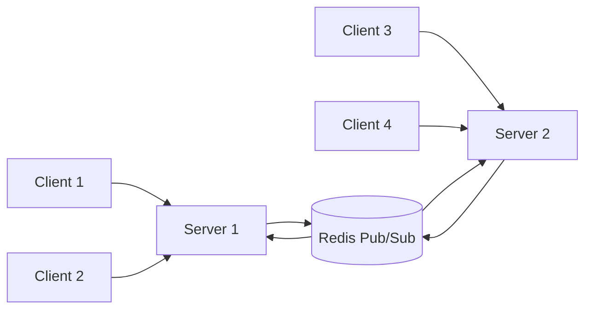

# How to Implement WebSockets in FastAPI

Author: [nawazdhandala](https://github.com/nawazdhandala)

Tags: Python, FastAPI, WebSockets, Real-time, Async

Description: Learn how to implement WebSocket connections in FastAPI for real-time communication, including connection management, broadcasting, and authentication.

---

If you've ever built a feature that needs real-time updates - live notifications, chat, collaborative editing, or live dashboards - you know that polling HTTP endpoints feels wrong. You're basically asking the server "anything new?" over and over again. WebSockets solve this by keeping a persistent connection open between client and server, allowing both sides to send messages whenever they want.

FastAPI makes WebSocket implementation surprisingly straightforward. Let's walk through building a production-ready WebSocket setup from scratch.

---

## WebSocket vs HTTP - When to Use What

Before diving into code, let's understand when WebSockets actually make sense:

| Feature | HTTP | WebSocket |
|---------|------|-----------|
| Connection | New connection per request | Persistent connection |
| Direction | Client initiates, server responds | Bidirectional anytime |
| Overhead | Headers sent every request | Headers only on handshake |
| Best for | CRUD operations, file uploads | Real-time updates, streaming |
| Server push | Requires polling or SSE | Native support |

Use WebSockets when you need low-latency bidirectional communication. Stick with HTTP for standard request-response patterns.

---

## Setting Up Your First WebSocket Endpoint

Here's the simplest possible WebSocket endpoint in FastAPI. It accepts connections and echoes back whatever the client sends.

```python
# main.py
from fastapi import FastAPI, WebSocket, WebSocketDisconnect

app = FastAPI()

@app.websocket("/ws")
async def websocket_endpoint(websocket: WebSocket):
    # Accept the incoming WebSocket connection
    await websocket.accept()

    try:
        while True:
            # Wait for a message from the client
            message = await websocket.receive_text()
            # Send a response back
            await websocket.send_text(f"You said: {message}")
    except WebSocketDisconnect:
        # Client closed the connection
        print("Client disconnected")
```

Run this with `uvicorn main:app --reload` and test it with a WebSocket client. The connection stays open until the client disconnects.

---

## Managing Multiple Connections

In any real application, you'll have multiple clients connected at once. A connection manager keeps track of all active connections and provides methods for broadcasting messages.

```python
# connection_manager.py
from fastapi import WebSocket
from typing import List

class ConnectionManager:
    def __init__(self):
        # Store all active WebSocket connections
        self.active_connections: List[WebSocket] = []

    async def connect(self, websocket: WebSocket):
        # Accept and store the new connection
        await websocket.accept()
        self.active_connections.append(websocket)

    def disconnect(self, websocket: WebSocket):
        # Remove connection from the list
        self.active_connections.remove(websocket)

    async def send_personal_message(self, message: str, websocket: WebSocket):
        # Send message to a specific client
        await websocket.send_text(message)

    async def broadcast(self, message: str):
        # Send message to ALL connected clients
        for connection in self.active_connections:
            await connection.send_text(message)

# Create a single instance to use across your app
manager = ConnectionManager()
```

Now let's use this manager in a chat-like endpoint:

```python
# main.py
from fastapi import FastAPI, WebSocket, WebSocketDisconnect
from connection_manager import manager

app = FastAPI()

@app.websocket("/ws/{client_id}")
async def websocket_endpoint(websocket: WebSocket, client_id: str):
    await manager.connect(websocket)
    # Let everyone know a new user joined
    await manager.broadcast(f"Client #{client_id} joined the chat")

    try:
        while True:
            data = await websocket.receive_text()
            # Broadcast the message to all clients
            await manager.broadcast(f"Client #{client_id}: {data}")
    except WebSocketDisconnect:
        manager.disconnect(websocket)
        await manager.broadcast(f"Client #{client_id} left the chat")
```

---

## Adding Authentication

WebSocket connections should be authenticated before you accept them. The cleanest approach is validating a token passed as a query parameter.

```python
# auth.py
from fastapi import WebSocket, WebSocketDisconnect, Query
from jose import jwt, JWTError
from typing import Optional

SECRET_KEY = "your-secret-key"
ALGORITHM = "HS256"

async def verify_websocket_token(token: str) -> Optional[dict]:
    """Validate JWT and return user data or None if invalid."""
    try:
        payload = jwt.decode(token, SECRET_KEY, algorithms=[ALGORITHM])
        return {"user_id": payload.get("sub"), "username": payload.get("name")}
    except JWTError:
        return None

@app.websocket("/ws/secure")
async def secure_websocket(
    websocket: WebSocket,
    token: str = Query(...)  # Client connects with /ws/secure?token=xyz
):
    # Validate BEFORE accepting the connection
    user = await verify_websocket_token(token)

    if not user:
        # Reject with custom close code (4001 = unauthorized)
        await websocket.close(code=4001)
        return

    # Token valid - accept connection
    await websocket.accept()
    print(f"User {user['username']} connected")

    try:
        while True:
            data = await websocket.receive_text()
            # Now you know who sent this message
            await websocket.send_text(f"Hello {user['username']}, you said: {data}")
    except WebSocketDisconnect:
        print(f"User {user['username']} disconnected")
```

The key here is validating before calling `websocket.accept()`. This way, invalid connections never fully establish.

---

## Error Handling and Connection Health

WebSocket connections can die silently - network issues, client crashes, or just users closing their browser. Implement heartbeats to detect dead connections.

```python
# heartbeat.py
import asyncio
from fastapi import WebSocket, WebSocketDisconnect

HEARTBEAT_INTERVAL = 30  # seconds

async def send_heartbeat(websocket: WebSocket):
    """Background task that pings the client periodically."""
    while True:
        try:
            await asyncio.sleep(HEARTBEAT_INTERVAL)
            await websocket.send_json({"type": "ping"})
        except Exception:
            # Connection is dead
            break

@app.websocket("/ws/with-heartbeat")
async def websocket_with_heartbeat(websocket: WebSocket):
    await websocket.accept()

    # Start heartbeat as background task
    heartbeat_task = asyncio.create_task(send_heartbeat(websocket))

    try:
        while True:
            data = await websocket.receive_json()

            if data.get("type") == "pong":
                # Client responded to heartbeat - connection is healthy
                continue

            # Handle other message types
            await handle_message(websocket, data)

    except WebSocketDisconnect:
        pass
    finally:
        # Always clean up the heartbeat task
        heartbeat_task.cancel()
```

Clients should respond with `{"type": "pong"}` when they receive a ping. If they don't respond within a reasonable time, you can consider the connection dead.

---

## Broadcasting with JSON Messages

For anything beyond simple strings, use structured JSON messages. This makes it easy to handle different message types.

```python
# json_messages.py
from fastapi import WebSocket, WebSocketDisconnect
from pydantic import BaseModel
from typing import Optional
import json

class WebSocketMessage(BaseModel):
    type: str
    payload: Optional[dict] = None

@app.websocket("/ws/json")
async def json_websocket(websocket: WebSocket):
    await websocket.accept()

    try:
        while True:
            raw_data = await websocket.receive_text()
            message = WebSocketMessage(**json.loads(raw_data))

            if message.type == "subscribe":
                # Handle subscription to a channel
                channel = message.payload.get("channel")
                await websocket.send_json({
                    "type": "subscribed",
                    "payload": {"channel": channel}
                })

            elif message.type == "message":
                # Echo the message back with a timestamp
                await websocket.send_json({
                    "type": "message",
                    "payload": {
                        "content": message.payload.get("content"),
                        "received": True
                    }
                })

    except WebSocketDisconnect:
        print("Client disconnected")
```

---

## Scaling Considerations

A single FastAPI instance can only track its own WebSocket connections. When you scale to multiple servers behind a load balancer, you need a way to broadcast messages across all instances. Redis pub/sub is the standard solution.



Here's a simplified Redis-backed manager:

```python
# redis_manager.py
import aioredis
import json
from fastapi import WebSocket

class RedisConnectionManager:
    def __init__(self, redis_url: str):
        self.redis_url = redis_url
        self.local_connections: dict = {}  # Connections on THIS server
        self.redis = None

    async def initialize(self):
        """Call this on application startup."""
        self.redis = await aioredis.from_url(self.redis_url)
        # Start listening for messages from other servers
        asyncio.create_task(self._listen_for_broadcasts())

    async def _listen_for_broadcasts(self):
        """Listen for messages published by other server instances."""
        pubsub = self.redis.pubsub()
        await pubsub.subscribe("ws_broadcast")

        async for message in pubsub.listen():
            if message["type"] == "message":
                data = json.loads(message["data"])
                # Deliver to all local connections
                for ws in self.local_connections.values():
                    await ws.send_json(data)

    async def broadcast(self, message: dict):
        """Publish message to Redis - all servers will receive it."""
        await self.redis.publish("ws_broadcast", json.dumps(message))
```

This pattern ensures that when Server 1 broadcasts a message, clients connected to Server 2 also receive it.

---

## Summary

WebSockets in FastAPI are straightforward once you understand the patterns:

1. Use `@app.websocket()` decorator to define endpoints
2. Call `websocket.accept()` to establish the connection
3. Use a connection manager to track multiple clients
4. Authenticate before accepting connections
5. Implement heartbeats to detect dead connections
6. Use Redis pub/sub when scaling horizontally

The async nature of FastAPI makes it well-suited for WebSocket workloads. Just remember that WebSockets are stateful - you need to plan for connection management, cleanup, and scaling from the start.

---

*Building real-time applications? [OneUptime](https://oneuptime.com) helps you monitor WebSocket endpoints and get alerted when connections fail.*
