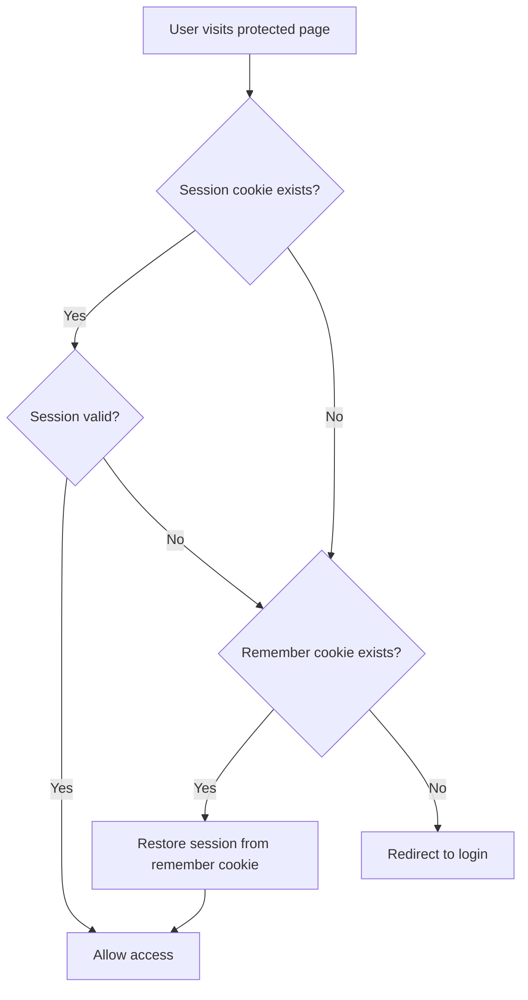

# How to Implement Authentication in Flask

Author: [nawazdhandala](https://github.com/nawazdhandala)

Tags: Python, Flask, Authentication, Flask-Login, Security

Description: A comprehensive guide to implementing user authentication in Flask using Flask-Login, password hashing, session management, and protected routes.

---

If you're building a Flask application that needs user accounts, you'll eventually face the question of how to handle authentication. Flask itself is unopinionated about this - it gives you the building blocks but leaves the implementation up to you. The good news is that Flask-Login makes this process straightforward once you understand the pieces involved.

In this guide, we'll build a complete authentication system from scratch. By the end, you'll have working login, logout, registration, and protected routes.

## Setting Up Your Project

First, let's install the packages we need:

```bash
pip install flask flask-login flask-sqlalchemy werkzeug
```

Here's our basic project structure:

```
myapp/
├── app.py
├── models.py
├── forms.py
└── templates/
    ├── base.html
    ├── login.html
    └── dashboard.html
```

## Configuring Flask-Login

Flask-Login handles the session management side of authentication. It tracks which user is logged in, manages the "remember me" functionality, and protects views from unauthenticated access.

Here's how to set it up:

```python
# app.py
from flask import Flask, render_template, redirect, url_for, request, flash
from flask_login import LoginManager, login_user, logout_user, login_required, current_user
from flask_sqlalchemy import SQLAlchemy

app = Flask(__name__)
app.config['SECRET_KEY'] = 'your-secret-key-change-this-in-production'
app.config['SQLALCHEMY_DATABASE_URI'] = 'sqlite:///users.db'

db = SQLAlchemy(app)
login_manager = LoginManager(app)

# This tells Flask-Login which view handles logins
login_manager.login_view = 'login'

# Customize the flash message for unauthorized access
login_manager.login_message = 'Please log in to access this page.'
login_manager.login_message_category = 'info'
```

The key Flask-Login configuration options are:

| Option | Description |
|--------|-------------|
| `login_view` | The view name to redirect to when login is required |
| `login_message` | Message flashed when redirecting to login |
| `login_message_category` | Category for the flash message |
| `session_protection` | Level of session protection - "basic", "strong", or None |
| `remember_cookie_duration` | How long the remember me cookie lasts (default: 365 days) |

## Creating the User Model

Flask-Login requires your user model to implement a few specific methods and properties. The easiest way is to inherit from `UserMixin`:

```python
# models.py
from flask_login import UserMixin
from werkzeug.security import generate_password_hash, check_password_hash
from app import db

class User(UserMixin, db.Model):
    id = db.Column(db.Integer, primary_key=True)
    email = db.Column(db.String(120), unique=True, nullable=False)
    username = db.Column(db.String(80), unique=True, nullable=False)
    password_hash = db.Column(db.String(256), nullable=False)

    def set_password(self, password):
        # Werkzeug handles the salting and hashing for us
        self.password_hash = generate_password_hash(password)

    def check_password(self, password):
        # Returns True if the password matches
        return check_password_hash(self.password_hash, password)

    def __repr__(self):
        return f'<User {self.username}>'
```

`UserMixin` provides default implementations for:

- `is_authenticated` - Returns True if the user is authenticated
- `is_active` - Returns True if this is an active user
- `is_anonymous` - Returns False for regular users
- `get_id()` - Returns the user's unique identifier as a string

Now we need to tell Flask-Login how to load a user from the database:

```python
# app.py (add this after login_manager initialization)
from models import User

@login_manager.user_loader
def load_user(user_id):
    # Flask-Login passes the user_id as a string, so we convert to int
    return User.query.get(int(user_id))
```

## Password Hashing with Werkzeug

Never store passwords in plain text. Werkzeug's security module provides solid password hashing out of the box. Here's what happens under the hood:

```python
from werkzeug.security import generate_password_hash, check_password_hash

# When a user registers
password = "mysecretpassword"
hashed = generate_password_hash(password)
# Result looks like: "pbkdf2:sha256:260000$..."

# When a user logs in
check_password_hash(hashed, "mysecretpassword")  # Returns True
check_password_hash(hashed, "wrongpassword")     # Returns False
```

The default method is PBKDF2 with SHA-256 and 260,000 iterations. Each hash includes a random salt, so identical passwords produce different hashes.

## Building the Login and Logout Views

Here's where it all comes together:

```python
# app.py - login and logout routes

@app.route('/login', methods=['GET', 'POST'])
def login():
    # If user is already logged in, redirect to dashboard
    if current_user.is_authenticated:
        return redirect(url_for('dashboard'))

    if request.method == 'POST':
        email = request.form.get('email')
        password = request.form.get('password')
        remember = request.form.get('remember', False)

        # Find the user by email
        user = User.query.filter_by(email=email).first()

        # Check if user exists and password is correct
        if user is None or not user.check_password(password):
            flash('Invalid email or password', 'error')
            return redirect(url_for('login'))

        # Log the user in
        # remember=True creates a persistent cookie
        login_user(user, remember=bool(remember))

        # Handle the 'next' parameter for redirecting after login
        next_page = request.args.get('next')
        if next_page:
            return redirect(next_page)
        return redirect(url_for('dashboard'))

    return render_template('login.html')


@app.route('/logout')
@login_required
def logout():
    logout_user()
    flash('You have been logged out.', 'info')
    return redirect(url_for('login'))


@app.route('/register', methods=['GET', 'POST'])
def register():
    if current_user.is_authenticated:
        return redirect(url_for('dashboard'))

    if request.method == 'POST':
        email = request.form.get('email')
        username = request.form.get('username')
        password = request.form.get('password')

        # Check if user already exists
        if User.query.filter_by(email=email).first():
            flash('Email already registered', 'error')
            return redirect(url_for('register'))

        if User.query.filter_by(username=username).first():
            flash('Username already taken', 'error')
            return redirect(url_for('register'))

        # Create new user
        user = User(email=email, username=username)
        user.set_password(password)

        db.session.add(user)
        db.session.commit()

        flash('Registration successful! Please log in.', 'success')
        return redirect(url_for('login'))

    return render_template('register.html')
```

## Protecting Routes

The `@login_required` decorator is the key to protecting routes:

```python
@app.route('/dashboard')
@login_required
def dashboard():
    # current_user is automatically available in templates too
    return render_template('dashboard.html', user=current_user)


@app.route('/profile')
@login_required
def profile():
    return render_template('profile.html')


@app.route('/settings')
@login_required
def settings():
    return render_template('settings.html')
```

When an unauthenticated user tries to access a protected route, they get redirected to the `login_view` you configured earlier. Flask-Login also adds a `next` query parameter so you can redirect them back after login.

## The Remember Me Feature

The "remember me" functionality works through a separate cookie. When `remember=True` is passed to `login_user()`, Flask-Login creates a long-lived cookie that can restore the session even after the browser is closed.

Here's how the authentication flow works:



You can configure the remember cookie duration:

```python
from datetime import timedelta

app.config['REMEMBER_COOKIE_DURATION'] = timedelta(days=14)
app.config['REMEMBER_COOKIE_SECURE'] = True  # Only send over HTTPS
app.config['REMEMBER_COOKIE_HTTPONLY'] = True  # Not accessible via JavaScript
```

## A Simple Login Template

Here's a basic login template to get you started:

```html
<!-- templates/login.html -->
<!DOCTYPE html>
<html>
<head>
    <title>Login</title>
</head>
<body>
    <h1>Login</h1>

    
        
            <p class="{{ category }}">{{ message }}</p>
        
    

    <form method="POST">
        <div>
            <label for="email">Email:</label>
            <input type="email" name="email" id="email" required>
        </div>
        <div>
            <label for="password">Password:</label>
            <input type="password" name="password" id="password" required>
        </div>
        <div>
            <input type="checkbox" name="remember" id="remember">
            <label for="remember">Remember me</label>
        </div>
        <button type="submit">Log In</button>
    </form>

    <p>Don't have an account? <a href="{{ url_for('register') }}">Register</a></p>
</body>
</html>
```

## Running the Application

Here's the complete app.py with the database initialization:

```python
# At the bottom of app.py
if __name__ == '__main__':
    with app.app_context():
        db.create_all()  # Create tables if they don't exist
    app.run(debug=True)
```

## Wrapping Up

That covers the essentials of Flask authentication. You now have a working system with user registration, login, logout, password hashing, session management, and protected routes.

A few things to keep in mind for production:

- Use a proper secret key (generate one with `python -c "import secrets; print(secrets.token_hex(32))"`)
- Enable HTTPS and set secure cookie options
- Add rate limiting to prevent brute force attacks
- Consider adding email verification for new accounts
- Look into Flask-WTF for form validation and CSRF protection

Flask-Login handles the heavy lifting of session management, but the rest of the authentication logic is yours to customize. That flexibility is one of Flask's biggest strengths - you can build exactly what your application needs.
