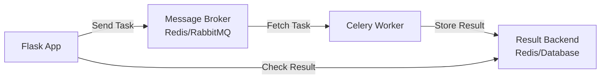
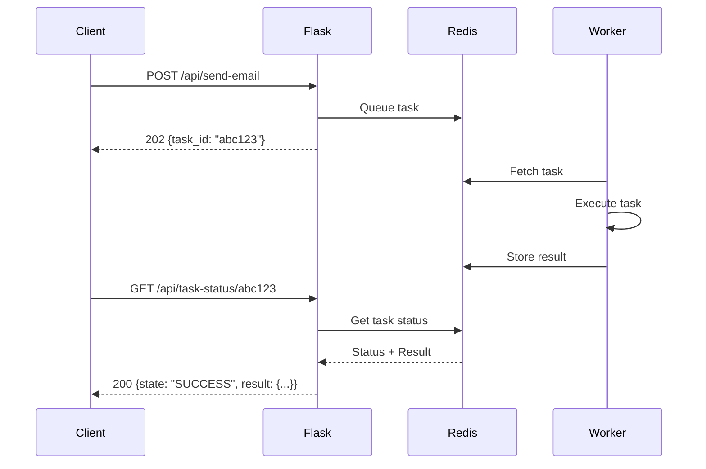
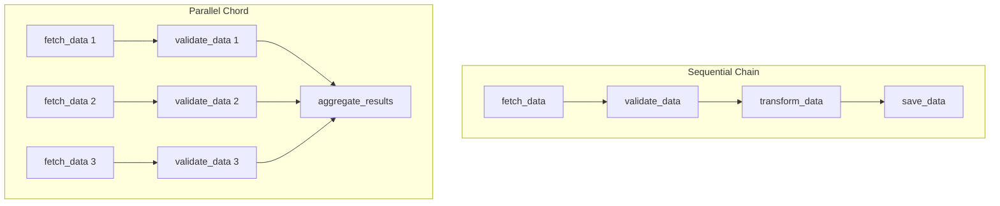

# How to Use Celery with Flask for Background Tasks

Author: [nawazdhandala](https://www.github.com/nawazdhandala)

Tags: Flask, Python, Celery, Background Tasks, Queue

Description: Learn how to integrate Celery with Flask for background task processing. This comprehensive guide covers setup, task creation, scheduling, error handling, monitoring, and production best practices.

---

> Background tasks are essential for building responsive web applications. Whether you need to send emails, process images, generate reports, or handle any long-running operation, Celery provides a robust solution for executing tasks asynchronously without blocking your Flask application.

When a user submits a form that triggers an email or uploads an image that needs processing, you do not want them waiting for these operations to complete. Celery allows you to offload these tasks to worker processes, keeping your web application responsive.

---

## What is Celery?

Celery is a distributed task queue for Python that enables you to run tasks asynchronously. It consists of three main components:

1. **Client**: Your Flask application that sends tasks to the queue
2. **Broker**: A message broker (like Redis or RabbitMQ) that stores the task queue
3. **Worker**: Processes that execute the tasks from the queue



---

## Why Use Celery with Flask?

| Scenario | Without Celery | With Celery |
|----------|----------------|-------------|
| **Email Sending** | User waits 2-5 seconds | Instant response |
| **Image Processing** | Request times out | Background processing |
| **Report Generation** | Browser hangs | Async with progress |
| **Data Import** | Server overload | Controlled throughput |
| **API Calls** | Cascading failures | Retry with backoff |

---

## Project Setup

### Installing Dependencies

First, install the required packages for your Flask and Celery integration.

```bash
# Install Flask, Celery, and Redis client
pip install flask celery redis

# For monitoring (optional but recommended)
pip install flower
```

### Project Structure

Organize your project for clean separation of concerns between Flask and Celery components.

```
flask_celery_app/
├── app/
│   ├── __init__.py          # Flask app factory
│   ├── celery_app.py        # Celery configuration
│   ├── tasks/
│   │   ├── __init__.py
│   │   ├── email_tasks.py   # Email-related tasks
│   │   └── data_tasks.py    # Data processing tasks
│   ├── routes/
│   │   ├── __init__.py
│   │   └── api.py           # API endpoints
│   └── models.py            # Database models
├── config.py                # Configuration settings
├── requirements.txt
└── run.py                   # Application entry point
```

---

## Basic Configuration

### Configuration File

Create a configuration file that contains settings for both Flask and Celery. This keeps your configuration centralized and environment-aware.

```python
# config.py
import os

class Config:
    """Base configuration class"""

    # Flask settings
    SECRET_KEY = os.environ.get('SECRET_KEY', 'dev-secret-key')

    # Celery settings
    CELERY_BROKER_URL = os.environ.get('CELERY_BROKER_URL', 'redis://localhost:6379/0')
    CELERY_RESULT_BACKEND = os.environ.get('CELERY_RESULT_BACKEND', 'redis://localhost:6379/0')

    # Task settings
    CELERY_TASK_SERIALIZER = 'json'
    CELERY_RESULT_SERIALIZER = 'json'
    CELERY_ACCEPT_CONTENT = ['json']
    CELERY_TIMEZONE = 'UTC'
    CELERY_ENABLE_UTC = True

    # Task execution settings
    CELERY_TASK_TRACK_STARTED = True
    CELERY_TASK_TIME_LIMIT = 30 * 60  # 30 minutes
    CELERY_TASK_SOFT_TIME_LIMIT = 25 * 60  # 25 minutes

    # Retry settings
    CELERY_TASK_ACKS_LATE = True
    CELERY_WORKER_PREFETCH_MULTIPLIER = 1


class DevelopmentConfig(Config):
    """Development configuration"""
    DEBUG = True
    CELERY_TASK_ALWAYS_EAGER = False  # Set to True to run tasks synchronously for debugging


class ProductionConfig(Config):
    """Production configuration"""
    DEBUG = False

    # Production-specific Celery settings
    CELERY_WORKER_CONCURRENCY = 4
    CELERY_TASK_COMPRESSION = 'gzip'


# Configuration dictionary for easy selection
config = {
    'development': DevelopmentConfig,
    'production': ProductionConfig,
    'default': DevelopmentConfig
}
```

### Flask Application Factory

Create your Flask application using the factory pattern, which makes it easier to configure Celery integration and test your application.

```python
# app/__init__.py
from flask import Flask
from config import config


def create_app(config_name='default'):
    """Application factory for creating Flask app instances"""

    app = Flask(__name__)

    # Load configuration
    app.config.from_object(config[config_name])

    # Register blueprints
    from app.routes.api import api_bp
    app.register_blueprint(api_bp, url_prefix='/api')

    return app
```

### Celery Configuration

Configure Celery to work with your Flask application. This setup ensures Celery tasks have access to Flask's application context.

```python
# app/celery_app.py
from celery import Celery

# Create Celery instance
celery = Celery('flask_celery_app')


def configure_celery(app):
    """Configure Celery with Flask app context"""

    # Update Celery config from Flask config
    celery.conf.update(
        broker_url=app.config['CELERY_BROKER_URL'],
        result_backend=app.config['CELERY_RESULT_BACKEND'],
        task_serializer=app.config['CELERY_TASK_SERIALIZER'],
        result_serializer=app.config['CELERY_RESULT_SERIALIZER'],
        accept_content=app.config['CELERY_ACCEPT_CONTENT'],
        timezone=app.config['CELERY_TIMEZONE'],
        enable_utc=app.config['CELERY_ENABLE_UTC'],
        task_track_started=app.config['CELERY_TASK_TRACK_STARTED'],
        task_time_limit=app.config['CELERY_TASK_TIME_LIMIT'],
        task_soft_time_limit=app.config['CELERY_TASK_SOFT_TIME_LIMIT'],
        task_acks_late=app.config['CELERY_TASK_ACKS_LATE'],
        worker_prefetch_multiplier=app.config['CELERY_WORKER_PREFETCH_MULTIPLIER'],
    )

    # Create a subclass of Task that wraps execution in app context
    class ContextTask(celery.Task):
        """Task subclass that runs within Flask application context"""

        def __call__(self, *args, **kwargs):
            with app.app_context():
                return self.run(*args, **kwargs)

    celery.Task = ContextTask

    return celery


def make_celery(app):
    """Create and configure Celery instance for Flask app"""

    configure_celery(app)

    # Auto-discover tasks from the tasks package
    celery.autodiscover_tasks(['app.tasks'])

    return celery
```

### Application Entry Point

Create the entry point that initializes both Flask and Celery together.

```python
# run.py
import os
from app import create_app
from app.celery_app import make_celery

# Determine configuration
config_name = os.environ.get('FLASK_ENV', 'development')

# Create Flask app
app = create_app(config_name)

# Create and configure Celery
celery = make_celery(app)

if __name__ == '__main__':
    app.run(debug=True)
```

---

## Creating Celery Tasks

### Basic Task Definition

Define tasks using the shared_task decorator, which allows tasks to be used without binding them to a specific Celery instance.

```python
# app/tasks/email_tasks.py
from celery import shared_task
import time
import logging

logger = logging.getLogger(__name__)


@shared_task(bind=True, name='tasks.send_email')
def send_email(self, recipient, subject, body):
    """
    Send an email asynchronously.

    Args:
        recipient: Email address of the recipient
        subject: Email subject line
        body: Email body content

    Returns:
        dict: Status information about the sent email
    """
    logger.info(f"Sending email to {recipient}")

    try:
        # Simulate email sending (replace with actual email logic)
        # Example: use Flask-Mail or smtplib
        time.sleep(2)  # Simulating network latency

        # Your actual email sending code would go here
        # from flask_mail import Message, Mail
        # mail = Mail()
        # msg = Message(subject, recipients=[recipient], body=body)
        # mail.send(msg)

        logger.info(f"Email sent successfully to {recipient}")

        return {
            'status': 'success',
            'recipient': recipient,
            'subject': subject
        }

    except Exception as e:
        logger.error(f"Failed to send email: {str(e)}")
        raise


@shared_task(bind=True, name='tasks.send_bulk_emails')
def send_bulk_emails(self, recipients, subject, body):
    """
    Send emails to multiple recipients with progress tracking.

    Args:
        recipients: List of email addresses
        subject: Email subject line
        body: Email body content

    Returns:
        dict: Summary of sent emails
    """
    total = len(recipients)
    sent = 0
    failed = []

    for i, recipient in enumerate(recipients):
        try:
            # Send individual email
            send_email.delay(recipient, subject, body)
            sent += 1

        except Exception as e:
            failed.append({'recipient': recipient, 'error': str(e)})

        # Update task progress
        self.update_state(
            state='PROGRESS',
            meta={
                'current': i + 1,
                'total': total,
                'percent': int((i + 1) / total * 100)
            }
        )

    return {
        'status': 'completed',
        'total': total,
        'sent': sent,
        'failed': failed
    }
```

### Data Processing Tasks

Create tasks for handling data-intensive operations that would otherwise block your web application.

```python
# app/tasks/data_tasks.py
from celery import shared_task
import time
import logging

logger = logging.getLogger(__name__)


@shared_task(bind=True, name='tasks.process_data')
def process_data(self, data_id):
    """
    Process data asynchronously with progress updates.

    Args:
        data_id: Identifier for the data to process

    Returns:
        dict: Processing results
    """
    logger.info(f"Processing data: {data_id}")

    # Simulate multi-step processing
    steps = ['validating', 'transforming', 'analyzing', 'saving']

    for i, step in enumerate(steps):
        # Update progress
        self.update_state(
            state='PROGRESS',
            meta={
                'step': step,
                'current': i + 1,
                'total': len(steps),
                'percent': int((i + 1) / len(steps) * 100)
            }
        )

        # Simulate processing time
        time.sleep(1)
        logger.info(f"Completed step: {step}")

    return {
        'status': 'completed',
        'data_id': data_id,
        'steps_completed': len(steps)
    }


@shared_task(bind=True, name='tasks.generate_report')
def generate_report(self, report_type, parameters):
    """
    Generate a report asynchronously.

    Args:
        report_type: Type of report to generate
        parameters: Dictionary of report parameters

    Returns:
        dict: Report generation result with file path
    """
    logger.info(f"Generating {report_type} report")

    try:
        # Update state to indicate processing has started
        self.update_state(
            state='PROGRESS',
            meta={'status': 'generating', 'percent': 0}
        )

        # Simulate report generation (replace with actual logic)
        time.sleep(5)

        # Generate a unique filename
        import uuid
        filename = f"reports/{report_type}_{uuid.uuid4().hex}.pdf"

        self.update_state(
            state='PROGRESS',
            meta={'status': 'saving', 'percent': 90}
        )

        # Simulate saving
        time.sleep(1)

        return {
            'status': 'completed',
            'report_type': report_type,
            'file_path': filename
        }

    except Exception as e:
        logger.error(f"Report generation failed: {str(e)}")
        raise


@shared_task(bind=True, name='tasks.import_csv')
def import_csv(self, file_path, options=None):
    """
    Import data from a CSV file with progress tracking.

    Args:
        file_path: Path to the CSV file
        options: Dictionary of import options

    Returns:
        dict: Import summary
    """
    options = options or {}
    logger.info(f"Importing CSV from: {file_path}")

    # Simulate reading file and getting row count
    total_rows = 1000  # Would come from actual file
    processed = 0
    errors = []

    # Process in chunks
    chunk_size = options.get('chunk_size', 100)

    for chunk_start in range(0, total_rows, chunk_size):
        chunk_end = min(chunk_start + chunk_size, total_rows)

        # Simulate processing chunk
        time.sleep(0.5)
        processed += (chunk_end - chunk_start)

        # Update progress
        self.update_state(
            state='PROGRESS',
            meta={
                'processed': processed,
                'total': total_rows,
                'percent': int(processed / total_rows * 100)
            }
        )

    return {
        'status': 'completed',
        'total_rows': total_rows,
        'processed': processed,
        'errors': errors
    }
```

---

## Calling Tasks from Flask Routes

### API Endpoints

Create Flask routes that trigger Celery tasks and return task status information to the client.

```python
# app/routes/api.py
from flask import Blueprint, jsonify, request
from app.tasks.email_tasks import send_email, send_bulk_emails
from app.tasks.data_tasks import process_data, generate_report, import_csv
from app.celery_app import celery

api_bp = Blueprint('api', __name__)


@api_bp.route('/send-email', methods=['POST'])
def trigger_send_email():
    """Trigger an async email send task"""

    data = request.get_json()

    # Validate required fields
    required_fields = ['recipient', 'subject', 'body']
    for field in required_fields:
        if field not in data:
            return jsonify({'error': f'Missing required field: {field}'}), 400

    # Queue the email task
    task = send_email.delay(
        recipient=data['recipient'],
        subject=data['subject'],
        body=data['body']
    )

    return jsonify({
        'message': 'Email queued for sending',
        'task_id': task.id
    }), 202


@api_bp.route('/send-bulk-emails', methods=['POST'])
def trigger_bulk_emails():
    """Trigger bulk email sending"""

    data = request.get_json()

    if 'recipients' not in data or not isinstance(data['recipients'], list):
        return jsonify({'error': 'Recipients list is required'}), 400

    task = send_bulk_emails.delay(
        recipients=data['recipients'],
        subject=data.get('subject', 'No Subject'),
        body=data.get('body', '')
    )

    return jsonify({
        'message': f'Queued {len(data["recipients"])} emails',
        'task_id': task.id
    }), 202


@api_bp.route('/process-data/<int:data_id>', methods=['POST'])
def trigger_process_data(data_id):
    """Trigger data processing task"""

    task = process_data.delay(data_id)

    return jsonify({
        'message': 'Data processing started',
        'task_id': task.id
    }), 202


@api_bp.route('/generate-report', methods=['POST'])
def trigger_generate_report():
    """Trigger report generation"""

    data = request.get_json()

    if 'report_type' not in data:
        return jsonify({'error': 'report_type is required'}), 400

    task = generate_report.delay(
        report_type=data['report_type'],
        parameters=data.get('parameters', {})
    )

    return jsonify({
        'message': 'Report generation started',
        'task_id': task.id
    }), 202


@api_bp.route('/task-status/<task_id>', methods=['GET'])
def get_task_status(task_id):
    """Get the status of a Celery task"""

    task = celery.AsyncResult(task_id)

    response = {
        'task_id': task_id,
        'state': task.state,
    }

    if task.state == 'PENDING':
        response['status'] = 'Task is waiting to be executed'

    elif task.state == 'PROGRESS':
        response['status'] = 'Task is in progress'
        response['progress'] = task.info

    elif task.state == 'SUCCESS':
        response['status'] = 'Task completed successfully'
        response['result'] = task.result

    elif task.state == 'FAILURE':
        response['status'] = 'Task failed'
        response['error'] = str(task.info)

    else:
        response['status'] = task.state

    return jsonify(response)


@api_bp.route('/task-cancel/<task_id>', methods=['POST'])
def cancel_task(task_id):
    """Cancel a pending or running task"""

    celery.control.revoke(task_id, terminate=True)

    return jsonify({
        'message': f'Task {task_id} cancellation requested'
    })
```

---

## Task Flow Diagram

The following diagram illustrates how a typical task flows through the system from the initial HTTP request to the final result retrieval.



---

## Error Handling and Retries

### Configuring Task Retries

Implement robust error handling with automatic retries for transient failures. This is essential for tasks that depend on external services.

```python
# app/tasks/reliable_tasks.py
from celery import shared_task
from celery.exceptions import MaxRetriesExceededError
import logging
import requests

logger = logging.getLogger(__name__)


@shared_task(
    bind=True,
    name='tasks.call_external_api',
    autoretry_for=(requests.RequestException,),
    retry_backoff=True,
    retry_backoff_max=600,
    retry_jitter=True,
    max_retries=5
)
def call_external_api(self, endpoint, payload):
    """
    Call an external API with automatic retry on failure.

    The task will automatically retry on RequestException with
    exponential backoff (2, 4, 8, 16... seconds) up to 5 times.

    Args:
        endpoint: API endpoint URL
        payload: Request payload

    Returns:
        dict: API response data
    """
    logger.info(f"Calling external API: {endpoint}")

    response = requests.post(
        endpoint,
        json=payload,
        timeout=30
    )
    response.raise_for_status()

    return response.json()


@shared_task(
    bind=True,
    name='tasks.send_webhook',
    max_retries=3,
    default_retry_delay=60
)
def send_webhook(self, url, event_data):
    """
    Send a webhook notification with manual retry logic.

    Args:
        url: Webhook URL
        event_data: Event payload

    Returns:
        dict: Delivery status
    """
    logger.info(f"Sending webhook to: {url}")

    try:
        response = requests.post(
            url,
            json=event_data,
            headers={'Content-Type': 'application/json'},
            timeout=10
        )
        response.raise_for_status()

        return {
            'status': 'delivered',
            'status_code': response.status_code
        }

    except requests.RequestException as exc:
        logger.warning(f"Webhook delivery failed: {exc}")

        try:
            # Retry with exponential backoff
            raise self.retry(exc=exc, countdown=60 * (2 ** self.request.retries))

        except MaxRetriesExceededError:
            logger.error(f"Webhook delivery failed after {self.max_retries} retries")
            return {
                'status': 'failed',
                'error': str(exc),
                'retries_exhausted': True
            }


@shared_task(bind=True, name='tasks.process_payment')
def process_payment(self, order_id, amount, payment_method):
    """
    Process a payment with comprehensive error handling.

    Args:
        order_id: Order identifier
        amount: Payment amount
        payment_method: Payment method details

    Returns:
        dict: Payment result
    """
    logger.info(f"Processing payment for order: {order_id}")

    try:
        # Validate input
        if amount <= 0:
            raise ValueError("Amount must be positive")

        # Simulate payment processing
        # In reality, this would call a payment gateway API
        import time
        time.sleep(2)

        # Simulate occasional failures for demonstration
        import random
        if random.random() < 0.1:  # 10% failure rate
            raise Exception("Payment gateway timeout")

        return {
            'status': 'success',
            'order_id': order_id,
            'amount': amount,
            'transaction_id': f"txn_{order_id}_{int(time.time())}"
        }

    except ValueError as e:
        # Do not retry validation errors
        logger.error(f"Validation error: {e}")
        return {'status': 'failed', 'error': str(e), 'retryable': False}

    except Exception as e:
        logger.error(f"Payment processing error: {e}")

        # Retry transient errors
        if self.request.retries < 3:
            raise self.retry(exc=e, countdown=30)

        return {'status': 'failed', 'error': str(e), 'retryable': True}
```

### Custom Error Handler

Create a custom error handler to log failures and notify administrators.

```python
# app/tasks/handlers.py
from celery import shared_task
from celery.signals import task_failure, task_success, task_retry
import logging

logger = logging.getLogger(__name__)


@task_failure.connect
def handle_task_failure(sender=None, task_id=None, exception=None,
                        args=None, kwargs=None, traceback=None, **kw):
    """Handle task failures globally"""

    logger.error(
        f"Task {sender.name}[{task_id}] failed: {exception}",
        exc_info=True,
        extra={
            'task_name': sender.name,
            'task_id': task_id,
            'args': args,
            'kwargs': kwargs
        }
    )

    # Send alert for critical tasks
    critical_tasks = ['tasks.process_payment', 'tasks.send_webhook']
    if sender.name in critical_tasks:
        # Notify administrators (e.g., send to Slack, PagerDuty, etc.)
        notify_admin_task_failure(sender.name, task_id, str(exception))


@task_retry.connect
def handle_task_retry(sender=None, request=None, reason=None, **kw):
    """Log task retries"""

    logger.warning(
        f"Task {sender.name}[{request.id}] retrying: {reason}",
        extra={
            'task_name': sender.name,
            'task_id': request.id,
            'retry_count': request.retries
        }
    )


@task_success.connect
def handle_task_success(sender=None, result=None, **kw):
    """Log successful task completion"""

    logger.info(f"Task {sender.name} completed successfully")


def notify_admin_task_failure(task_name, task_id, error_message):
    """Send notification about task failure"""
    # Implement your notification logic here
    # Example: send to Slack, email, PagerDuty, etc.
    pass
```

---

## Scheduled Tasks with Celery Beat

### Configuring Periodic Tasks

Use Celery Beat to run tasks on a schedule. This is useful for maintenance tasks, report generation, and data synchronization.

```python
# app/celery_config.py
from celery.schedules import crontab

# Celery Beat schedule configuration
beat_schedule = {
    # Run every minute
    'cleanup-expired-sessions': {
        'task': 'tasks.cleanup_expired_sessions',
        'schedule': 60.0,  # Every 60 seconds
    },

    # Run every hour
    'sync-external-data': {
        'task': 'tasks.sync_external_data',
        'schedule': crontab(minute=0),  # Every hour at minute 0
    },

    # Run daily at midnight
    'generate-daily-report': {
        'task': 'tasks.generate_daily_report',
        'schedule': crontab(hour=0, minute=0),
        'kwargs': {'report_type': 'daily_summary'}
    },

    # Run weekly on Monday at 9 AM
    'send-weekly-digest': {
        'task': 'tasks.send_weekly_digest',
        'schedule': crontab(hour=9, minute=0, day_of_week='monday'),
    },

    # Run on the first day of each month
    'generate-monthly-report': {
        'task': 'tasks.generate_monthly_report',
        'schedule': crontab(hour=0, minute=0, day_of_month=1),
    },
}
```

### Scheduled Task Implementations

Create the tasks that will run on schedule.

```python
# app/tasks/scheduled_tasks.py
from celery import shared_task
import logging
from datetime import datetime, timedelta

logger = logging.getLogger(__name__)


@shared_task(name='tasks.cleanup_expired_sessions')
def cleanup_expired_sessions():
    """
    Clean up expired user sessions from the database.
    Runs every minute to ensure timely cleanup.
    """
    logger.info("Starting session cleanup")

    # Example implementation
    # from app.models import Session
    # expired = Session.query.filter(Session.expires_at < datetime.utcnow()).all()
    # count = len(expired)
    # for session in expired:
    #     db.session.delete(session)
    # db.session.commit()

    count = 0  # Placeholder
    logger.info(f"Cleaned up {count} expired sessions")

    return {'cleaned': count}


@shared_task(name='tasks.sync_external_data')
def sync_external_data():
    """
    Synchronize data from external sources.
    Runs every hour to keep data fresh.
    """
    logger.info("Starting external data sync")

    # Example: sync from multiple sources
    sources = ['api_source_1', 'api_source_2', 'api_source_3']
    results = {}

    for source in sources:
        try:
            # Simulate sync operation
            # records = fetch_from_source(source)
            # save_records(records)
            results[source] = {'status': 'success', 'records': 100}
        except Exception as e:
            results[source] = {'status': 'failed', 'error': str(e)}

    logger.info(f"Sync completed: {results}")
    return results


@shared_task(name='tasks.generate_daily_report')
def generate_daily_report(report_type='daily_summary'):
    """
    Generate and distribute daily reports.
    Runs at midnight every day.
    """
    logger.info(f"Generating {report_type} report")

    # Get yesterday's date for the report
    report_date = datetime.utcnow().date() - timedelta(days=1)

    # Example implementation
    # report_data = gather_daily_metrics(report_date)
    # report_file = create_report_file(report_data)
    # distribute_report(report_file, ['admin@example.com'])

    return {
        'report_type': report_type,
        'report_date': str(report_date),
        'status': 'generated'
    }


@shared_task(name='tasks.send_weekly_digest')
def send_weekly_digest():
    """
    Send weekly digest emails to subscribed users.
    Runs every Monday at 9 AM.
    """
    logger.info("Sending weekly digest")

    # Example implementation
    # subscribers = User.query.filter(User.weekly_digest=True).all()
    # for user in subscribers:
    #     digest_content = generate_digest_for_user(user)
    #     send_email.delay(user.email, "Weekly Digest", digest_content)

    return {'status': 'sent', 'recipient_count': 0}


@shared_task(name='tasks.generate_monthly_report')
def generate_monthly_report():
    """
    Generate comprehensive monthly report.
    Runs on the first day of each month.
    """
    logger.info("Generating monthly report")

    # Calculate the previous month
    today = datetime.utcnow().date()
    first_of_month = today.replace(day=1)
    last_month = first_of_month - timedelta(days=1)

    return {
        'month': last_month.strftime('%Y-%m'),
        'status': 'generated'
    }
```

### Integrating Beat Schedule

Update your Celery configuration to include the beat schedule.

```python
# app/celery_app.py (updated)
from celery import Celery
from app.celery_config import beat_schedule

celery = Celery('flask_celery_app')


def configure_celery(app):
    """Configure Celery with Flask app context"""

    celery.conf.update(
        broker_url=app.config['CELERY_BROKER_URL'],
        result_backend=app.config['CELERY_RESULT_BACKEND'],
        task_serializer=app.config['CELERY_TASK_SERIALIZER'],
        result_serializer=app.config['CELERY_RESULT_SERIALIZER'],
        accept_content=app.config['CELERY_ACCEPT_CONTENT'],
        timezone=app.config['CELERY_TIMEZONE'],
        enable_utc=app.config['CELERY_ENABLE_UTC'],
        task_track_started=app.config['CELERY_TASK_TRACK_STARTED'],
        task_time_limit=app.config['CELERY_TASK_TIME_LIMIT'],
        task_soft_time_limit=app.config['CELERY_TASK_SOFT_TIME_LIMIT'],
        task_acks_late=app.config['CELERY_TASK_ACKS_LATE'],
        worker_prefetch_multiplier=app.config['CELERY_WORKER_PREFETCH_MULTIPLIER'],

        # Add beat schedule
        beat_schedule=beat_schedule,
    )

    class ContextTask(celery.Task):
        def __call__(self, *args, **kwargs):
            with app.app_context():
                return self.run(*args, **kwargs)

    celery.Task = ContextTask

    return celery
```

---

## Task Chains and Workflows

### Creating Task Pipelines

Use Celery's primitives to create complex workflows with task chains, groups, and chords.

```python
# app/tasks/workflow_tasks.py
from celery import shared_task, chain, group, chord
import logging

logger = logging.getLogger(__name__)


@shared_task(name='tasks.fetch_data')
def fetch_data(source_id):
    """Fetch data from a source"""
    logger.info(f"Fetching data from source: {source_id}")
    # Simulate fetching
    return {'source_id': source_id, 'records': 100}


@shared_task(name='tasks.validate_data')
def validate_data(data):
    """Validate fetched data"""
    logger.info(f"Validating data from source: {data['source_id']}")
    data['validated'] = True
    data['valid_records'] = data['records'] - 5  # Simulated invalid records
    return data


@shared_task(name='tasks.transform_data')
def transform_data(data):
    """Transform validated data"""
    logger.info(f"Transforming data from source: {data['source_id']}")
    data['transformed'] = True
    return data


@shared_task(name='tasks.save_data')
def save_data(data):
    """Save transformed data to database"""
    logger.info(f"Saving data from source: {data['source_id']}")
    data['saved'] = True
    return data


@shared_task(name='tasks.aggregate_results')
def aggregate_results(results):
    """Aggregate results from multiple sources"""
    logger.info(f"Aggregating {len(results)} results")

    total_records = sum(r['valid_records'] for r in results)

    return {
        'total_sources': len(results),
        'total_records': total_records,
        'sources': [r['source_id'] for r in results]
    }


def create_etl_pipeline(source_id):
    """
    Create an ETL pipeline using task chain.
    Tasks execute in sequence: fetch -> validate -> transform -> save
    """
    pipeline = chain(
        fetch_data.s(source_id),
        validate_data.s(),
        transform_data.s(),
        save_data.s()
    )

    return pipeline.apply_async()


def create_parallel_etl(source_ids):
    """
    Process multiple sources in parallel, then aggregate.
    Uses chord: parallel execution followed by callback.
    """
    # Create a pipeline for each source
    pipelines = [
        chain(
            fetch_data.s(source_id),
            validate_data.s(),
            transform_data.s()
        )
        for source_id in source_ids
    ]

    # Execute all pipelines in parallel, then aggregate
    workflow = chord(pipelines, aggregate_results.s())

    return workflow.apply_async()


def create_parallel_group(source_ids):
    """
    Execute tasks in parallel without aggregation.
    Uses group for simple parallel execution.
    """
    tasks = group(fetch_data.s(source_id) for source_id in source_ids)

    return tasks.apply_async()
```

### Workflow Visualization



### Using Workflows in Routes

Expose workflow functionality through API endpoints.

```python
# app/routes/api.py (additional endpoints)

@api_bp.route('/etl/single/<int:source_id>', methods=['POST'])
def trigger_single_etl(source_id):
    """Trigger ETL for a single source"""
    from app.tasks.workflow_tasks import create_etl_pipeline

    result = create_etl_pipeline(source_id)

    return jsonify({
        'message': 'ETL pipeline started',
        'task_id': result.id
    }), 202


@api_bp.route('/etl/parallel', methods=['POST'])
def trigger_parallel_etl():
    """Trigger parallel ETL for multiple sources"""
    from app.tasks.workflow_tasks import create_parallel_etl

    data = request.get_json()
    source_ids = data.get('source_ids', [])

    if not source_ids:
        return jsonify({'error': 'source_ids required'}), 400

    result = create_parallel_etl(source_ids)

    return jsonify({
        'message': f'Parallel ETL started for {len(source_ids)} sources',
        'task_id': result.id
    }), 202
```

---

## Running Celery Workers

### Starting the Worker

Run Celery workers to process tasks from the queue.

```bash
# Start a single worker
celery -A run.celery worker --loglevel=info

# Start worker with specific concurrency
celery -A run.celery worker --loglevel=info --concurrency=4

# Start worker with specific queue
celery -A run.celery worker --loglevel=info -Q high_priority,default

# Start worker with name (useful for multiple workers)
celery -A run.celery worker --loglevel=info -n worker1@%h
```

### Starting Celery Beat

Run Celery Beat for scheduled tasks.

```bash
# Start beat scheduler
celery -A run.celery beat --loglevel=info

# Start beat with custom schedule database
celery -A run.celery beat --loglevel=info -s /var/run/celery/celerybeat-schedule
```

### Combined Worker and Beat

For development, you can run both in one process.

```bash
# Start worker with beat (development only)
celery -A run.celery worker --beat --loglevel=info
```

### Production Deployment Script

Create a script for managing Celery processes in production.

```bash
#!/bin/bash
# celery_manager.sh

CELERY_APP="run.celery"
LOG_DIR="/var/log/celery"
PID_DIR="/var/run/celery"

start_worker() {
    celery -A $CELERY_APP worker \
        --loglevel=info \
        --concurrency=4 \
        --pidfile=$PID_DIR/worker.pid \
        --logfile=$LOG_DIR/worker.log \
        --detach
}

start_beat() {
    celery -A $CELERY_APP beat \
        --loglevel=info \
        --pidfile=$PID_DIR/beat.pid \
        --logfile=$LOG_DIR/beat.log \
        --schedule=$PID_DIR/celerybeat-schedule \
        --detach
}

stop_all() {
    pkill -f "celery.*$CELERY_APP"
}

case "$1" in
    start)
        start_worker
        start_beat
        ;;
    stop)
        stop_all
        ;;
    restart)
        stop_all
        sleep 2
        start_worker
        start_beat
        ;;
    *)
        echo "Usage: $0 {start|stop|restart}"
        exit 1
esac
```

---

## Monitoring with Flower

### Installing and Running Flower

Flower provides a real-time web interface for monitoring Celery workers and tasks.

```bash
# Install Flower
pip install flower

# Start Flower
celery -A run.celery flower --port=5555

# Start with basic authentication
celery -A run.celery flower --port=5555 --basic_auth=admin:password

# Start with persistent task history
celery -A run.celery flower --port=5555 --persistent=True --db=flower.db
```

### Flower Dashboard Features

Flower provides comprehensive monitoring capabilities for your Celery deployment.

| Feature | Description |
|---------|-------------|
| **Worker Status** | Real-time worker health and resource usage |
| **Task History** | View completed, failed, and active tasks |
| **Task Details** | Inspect arguments, results, and exceptions |
| **Rate Control** | Adjust worker concurrency and rate limits |
| **Broker Monitoring** | Queue lengths and message rates |

### Accessing Monitoring Data Programmatically

Create endpoints to expose monitoring data from your Flask application.

```python
# app/routes/monitoring.py
from flask import Blueprint, jsonify
from app.celery_app import celery

monitoring_bp = Blueprint('monitoring', __name__)


@monitoring_bp.route('/workers')
def get_workers():
    """Get active worker information"""

    inspector = celery.control.inspect()

    # Get various worker stats
    active = inspector.active() or {}
    reserved = inspector.reserved() or {}
    stats = inspector.stats() or {}

    workers = []
    for worker_name in stats.keys():
        workers.append({
            'name': worker_name,
            'active_tasks': len(active.get(worker_name, [])),
            'reserved_tasks': len(reserved.get(worker_name, [])),
            'concurrency': stats[worker_name].get('pool', {}).get('max-concurrency', 0)
        })

    return jsonify({'workers': workers})


@monitoring_bp.route('/queues')
def get_queues():
    """Get queue lengths"""

    inspector = celery.control.inspect()
    active_queues = inspector.active_queues() or {}

    queues = {}
    for worker, worker_queues in active_queues.items():
        for queue in worker_queues:
            queue_name = queue['name']
            if queue_name not in queues:
                queues[queue_name] = {'workers': []}
            queues[queue_name]['workers'].append(worker)

    return jsonify({'queues': queues})


@monitoring_bp.route('/health')
def health_check():
    """Celery health check endpoint"""

    try:
        inspector = celery.control.inspect()
        ping_result = inspector.ping()

        if ping_result:
            return jsonify({
                'status': 'healthy',
                'workers': list(ping_result.keys())
            })
        else:
            return jsonify({
                'status': 'unhealthy',
                'message': 'No workers responding'
            }), 503

    except Exception as e:
        return jsonify({
            'status': 'unhealthy',
            'error': str(e)
        }), 503
```

---

## Production Best Practices

### Task Design Guidelines

Follow these guidelines to create reliable and maintainable Celery tasks.

```python
# app/tasks/best_practices.py
from celery import shared_task
import logging

logger = logging.getLogger(__name__)


# 1. Make tasks idempotent - safe to run multiple times
@shared_task(name='tasks.idempotent_update')
def idempotent_update(record_id, new_value):
    """
    Idempotent task - running multiple times has same effect.
    Uses database constraints or checks to prevent duplicates.
    """
    # Check if update already applied
    # record = Record.query.get(record_id)
    # if record.value == new_value:
    #     return {'status': 'already_updated'}
    # record.value = new_value
    # db.session.commit()

    return {'status': 'updated', 'record_id': record_id}


# 2. Keep tasks small and focused
@shared_task(name='tasks.focused_task')
def process_single_item(item_id):
    """Process a single item - small and focused"""
    # Process just one item
    return {'item_id': item_id, 'status': 'processed'}


# 3. Use separate queues for different priorities
@shared_task(name='tasks.high_priority', queue='high_priority')
def high_priority_task(data):
    """High priority task routed to dedicated queue"""
    return {'status': 'completed'}


@shared_task(name='tasks.low_priority', queue='low_priority')
def low_priority_task(data):
    """Low priority task for background processing"""
    return {'status': 'completed'}


# 4. Set appropriate time limits
@shared_task(
    name='tasks.time_limited',
    time_limit=300,        # Hard limit: 5 minutes
    soft_time_limit=240    # Soft limit: 4 minutes (raises exception)
)
def time_limited_task(data):
    """Task with time limits to prevent runaway execution"""
    from celery.exceptions import SoftTimeLimitExceeded

    try:
        # Long running operation
        pass
    except SoftTimeLimitExceeded:
        # Cleanup and save progress
        logger.warning("Task approaching time limit, saving progress")
        return {'status': 'partial', 'message': 'Time limit reached'}

    return {'status': 'completed'}


# 5. Handle failures gracefully
@shared_task(name='tasks.graceful_failure')
def graceful_failure_task(data):
    """Task that handles failures gracefully"""
    try:
        # Main logic
        result = perform_operation(data)
        return {'status': 'success', 'result': result}

    except ValueError as e:
        # Known error - do not retry
        logger.error(f"Validation error: {e}")
        return {'status': 'failed', 'error': str(e), 'retry': False}

    except ConnectionError as e:
        # Transient error - will retry
        logger.warning(f"Connection error: {e}")
        raise  # Let Celery handle retry

    except Exception as e:
        # Unexpected error - log and fail
        logger.exception(f"Unexpected error in task: {e}")
        return {'status': 'failed', 'error': 'Internal error'}


def perform_operation(data):
    """Placeholder for actual operation"""
    return data
```

### Queue Configuration

Configure multiple queues for different task types and priorities.

```python
# config.py (additional settings)

class ProductionConfig(Config):
    # Queue routing configuration
    CELERY_TASK_ROUTES = {
        'tasks.send_email': {'queue': 'email'},
        'tasks.send_bulk_emails': {'queue': 'email'},
        'tasks.process_payment': {'queue': 'high_priority'},
        'tasks.generate_report': {'queue': 'reports'},
        'tasks.*': {'queue': 'default'},
    }

    # Queue-specific settings
    CELERY_TASK_QUEUES = {
        'high_priority': {
            'exchange': 'high_priority',
            'routing_key': 'high_priority',
        },
        'email': {
            'exchange': 'email',
            'routing_key': 'email',
        },
        'reports': {
            'exchange': 'reports',
            'routing_key': 'reports',
        },
        'default': {
            'exchange': 'default',
            'routing_key': 'default',
        },
    }
```

### Worker Configuration for Different Queues

Run dedicated workers for different queue types.

```bash
# High priority worker (fast, dedicated)
celery -A run.celery worker -Q high_priority --concurrency=2 -n priority@%h

# Email worker
celery -A run.celery worker -Q email --concurrency=4 -n email@%h

# Report worker (lower concurrency for memory-intensive tasks)
celery -A run.celery worker -Q reports --concurrency=1 -n reports@%h

# Default worker
celery -A run.celery worker -Q default --concurrency=4 -n default@%h
```

---

## Docker Deployment

### Docker Compose Configuration

Deploy Flask and Celery together using Docker Compose.

```yaml
# docker-compose.yml
version: '3.8'

services:
  redis:
    image: redis:7-alpine
    ports:
      - "6379:6379"
    volumes:
      - redis_data:/data
    healthcheck:
      test: ["CMD", "redis-cli", "ping"]
      interval: 10s
      timeout: 5s
      retries: 5

  flask:
    build: .
    ports:
      - "5000:5000"
    environment:
      - FLASK_ENV=production
      - CELERY_BROKER_URL=redis://redis:6379/0
      - CELERY_RESULT_BACKEND=redis://redis:6379/0
    depends_on:
      redis:
        condition: service_healthy
    command: gunicorn -w 4 -b 0.0.0.0:5000 run:app

  celery_worker:
    build: .
    environment:
      - CELERY_BROKER_URL=redis://redis:6379/0
      - CELERY_RESULT_BACKEND=redis://redis:6379/0
    depends_on:
      redis:
        condition: service_healthy
    command: celery -A run.celery worker --loglevel=info --concurrency=4
    deploy:
      replicas: 2

  celery_beat:
    build: .
    environment:
      - CELERY_BROKER_URL=redis://redis:6379/0
      - CELERY_RESULT_BACKEND=redis://redis:6379/0
    depends_on:
      redis:
        condition: service_healthy
    command: celery -A run.celery beat --loglevel=info

  flower:
    build: .
    ports:
      - "5555:5555"
    environment:
      - CELERY_BROKER_URL=redis://redis:6379/0
      - CELERY_RESULT_BACKEND=redis://redis:6379/0
    depends_on:
      - celery_worker
    command: celery -A run.celery flower --port=5555

volumes:
  redis_data:
```

### Dockerfile

Create a Dockerfile for your Flask and Celery application.

```dockerfile
# Dockerfile
FROM python:3.11-slim

WORKDIR /app

# Install dependencies
COPY requirements.txt .
RUN pip install --no-cache-dir -r requirements.txt

# Copy application code
COPY . .

# Create non-root user
RUN useradd -m appuser && chown -R appuser:appuser /app
USER appuser

# Default command (overridden in docker-compose)
CMD ["gunicorn", "-w", "4", "-b", "0.0.0.0:5000", "run:app"]
```

---

## Testing Celery Tasks

### Unit Testing Tasks

Write unit tests for your Celery tasks using pytest.

```python
# tests/test_tasks.py
import pytest
from unittest.mock import patch, MagicMock
from app import create_app
from app.celery_app import make_celery
from app.tasks.email_tasks import send_email
from app.tasks.data_tasks import process_data


@pytest.fixture
def app():
    """Create test application"""
    app = create_app('testing')
    app.config['CELERY_TASK_ALWAYS_EAGER'] = True  # Execute tasks synchronously
    app.config['CELERY_TASK_EAGER_PROPAGATES'] = True
    return app


@pytest.fixture
def celery_app(app):
    """Create Celery app for testing"""
    return make_celery(app)


class TestEmailTasks:
    """Test email-related tasks"""

    def test_send_email_success(self, app, celery_app):
        """Test successful email sending"""
        with app.app_context():
            result = send_email.apply(
                args=['test@example.com', 'Test Subject', 'Test Body']
            )

            assert result.successful()
            assert result.result['status'] == 'success'
            assert result.result['recipient'] == 'test@example.com'

    def test_send_email_with_invalid_recipient(self, app, celery_app):
        """Test email sending with invalid recipient"""
        with app.app_context():
            # Test your validation logic
            pass


class TestDataTasks:
    """Test data processing tasks"""

    def test_process_data_updates_progress(self, app, celery_app):
        """Test that process_data updates progress correctly"""
        with app.app_context():
            result = process_data.apply(args=[123])

            assert result.successful()
            assert result.result['status'] == 'completed'
            assert result.result['data_id'] == 123

    def test_process_data_handles_errors(self, app, celery_app):
        """Test error handling in data processing"""
        # Test error scenarios
        pass


class TestTaskRetries:
    """Test task retry behavior"""

    @patch('requests.post')
    def test_webhook_retry_on_failure(self, mock_post, app, celery_app):
        """Test that webhook task retries on failure"""
        from app.tasks.reliable_tasks import send_webhook
        import requests

        # First call fails, second succeeds
        mock_post.side_effect = [
            requests.RequestException("Connection failed"),
            MagicMock(status_code=200)
        ]

        with app.app_context():
            # The task should retry and eventually succeed
            # or return failure after max retries
            pass
```

### Integration Testing

Test the full integration between Flask routes and Celery tasks.

```python
# tests/test_integration.py
import pytest
from app import create_app
from app.celery_app import make_celery


@pytest.fixture
def client():
    """Create test client"""
    app = create_app('testing')
    app.config['CELERY_TASK_ALWAYS_EAGER'] = True
    make_celery(app)

    with app.test_client() as client:
        yield client


class TestAPIIntegration:
    """Test API endpoints that trigger Celery tasks"""

    def test_send_email_endpoint(self, client):
        """Test the send email API endpoint"""
        response = client.post('/api/send-email', json={
            'recipient': 'test@example.com',
            'subject': 'Test',
            'body': 'Test body'
        })

        assert response.status_code == 202
        data = response.get_json()
        assert 'task_id' in data

    def test_task_status_endpoint(self, client):
        """Test task status retrieval"""
        # First, trigger a task
        response = client.post('/api/process-data/1')
        task_id = response.get_json()['task_id']

        # Then check its status
        response = client.get(f'/api/task-status/{task_id}')
        assert response.status_code == 200

        data = response.get_json()
        assert data['state'] == 'SUCCESS'
```

---

## Conclusion

Integrating Celery with Flask provides a powerful solution for handling background tasks in your web applications. By following the patterns and practices outlined in this guide, you can build reliable, scalable, and maintainable task processing systems.

Key takeaways:

- **Use the application factory pattern** to properly integrate Flask and Celery
- **Design idempotent tasks** that can safely be retried
- **Implement proper error handling** with retry strategies for transient failures
- **Use task chains and workflows** for complex multi-step processes
- **Configure multiple queues** to prioritize different types of work
- **Monitor your workers** using Flower or custom endpoints
- **Test your tasks thoroughly** using both unit and integration tests

With Celery, your Flask application can remain responsive while handling email sending, data processing, report generation, and any other long-running operations in the background.

---

*Need to monitor your Celery workers in production? [OneUptime](https://oneuptime.com) provides comprehensive monitoring for distributed task queues with alerting, metrics visualization, and distributed tracing.*

**Related Reading:**
- [How to Monitor Celery Workers with OpenTelemetry and OneUptime](https://oneuptime.com/blog/post/2025-01-06-celery-opentelemetry-oneuptime/view)
- [How to Build a Job Queue in Python with Celery and Redis](https://oneuptime.com/blog/post/2025-01-06-python-celery-redis-job-queue/view)
