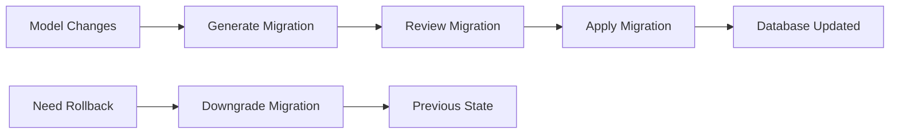
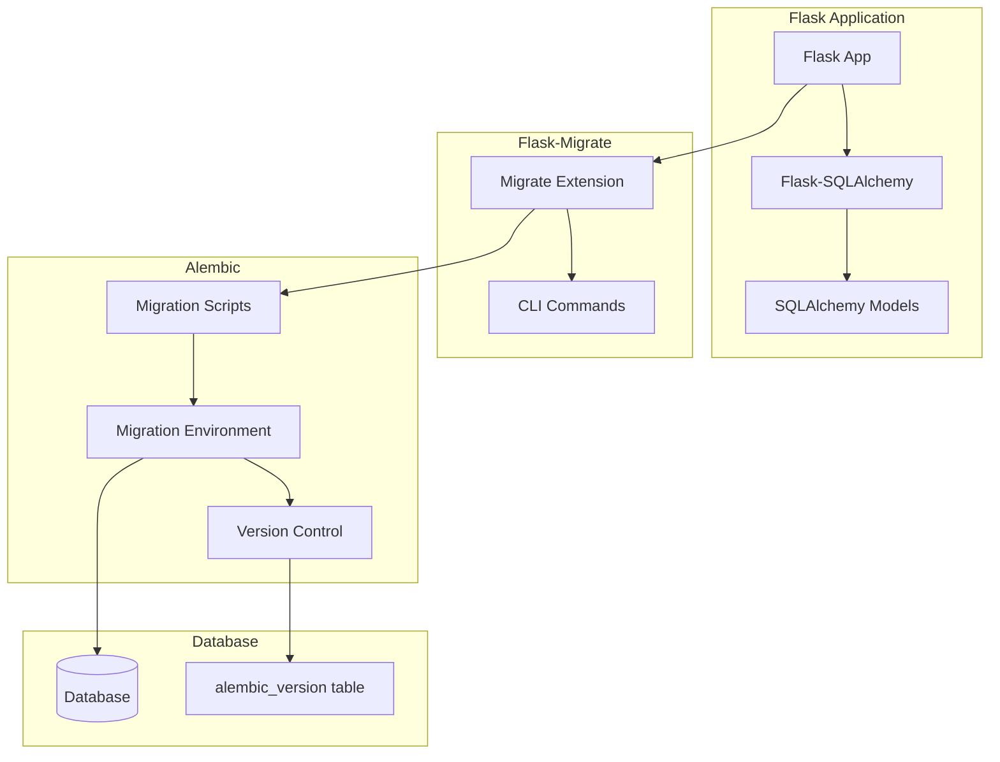
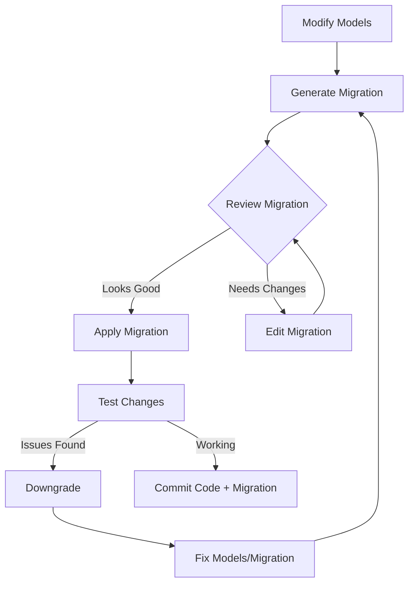
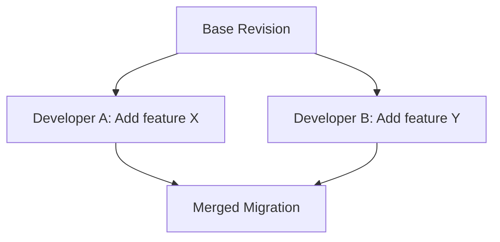
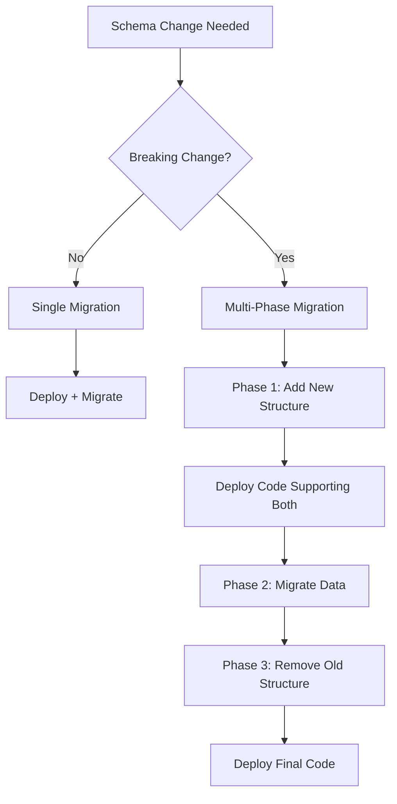

# How to Handle Database Migrations in Flask

Author: [nawazdhandala](https://www.github.com/nawazdhandala)

Tags: Flask, Python, Database, Migrations, Flask-Migrate, Alembic, SQLAlchemy

Description: Learn how to handle database migrations in Flask applications using Flask-Migrate and Alembic. This comprehensive guide covers migration setup, creating and managing migrations, data migrations, team workflows, production deployment strategies, and troubleshooting common issues.

---

> Database migrations are essential for evolving your application's data model over time. They allow you to make schema changes in a controlled, versioned, and reversible way. Flask-Migrate provides a seamless integration between Flask-SQLAlchemy and Alembic, the database migration tool for SQLAlchemy.

Whether you are adding new tables, modifying columns, or restructuring relationships, migrations ensure your database changes are tracked, repeatable, and safe to deploy across different environments.

---

## Understanding Database Migrations

Before diving into implementation, let us understand what migrations are and why they matter.

### What Are Database Migrations?

Database migrations are version-controlled scripts that modify your database schema. Instead of manually running SQL commands on your database, migrations provide a structured approach to schema changes.



### Why Use Migrations?

| Benefit | Description |
|---------|-------------|
| **Version Control** | Track schema changes alongside code |
| **Reproducibility** | Same migrations produce identical schemas |
| **Team Collaboration** | Multiple developers can work on schema changes |
| **Safe Deployments** | Test migrations before production |
| **Rollback Capability** | Revert changes when issues arise |
| **Documentation** | Migrations serve as schema change history |

---

## Flask-Migrate Architecture

Flask-Migrate acts as a bridge between Flask-SQLAlchemy and Alembic. Understanding this architecture helps you use the tool effectively.



### Key Components

- **Flask-Migrate**: Provides Flask CLI integration and configuration
- **Alembic**: Handles the actual migration logic and version tracking
- **alembic_version table**: Stores the current migration version in your database

---

## Setting Up Flask-Migrate

### Installation

Install Flask-Migrate and its dependencies using pip.

```bash
# Install Flask-Migrate (includes Alembic as a dependency)
pip install flask-migrate

# Install Flask-SQLAlchemy if not already installed
pip install flask-sqlalchemy

# Install a database driver based on your database choice
pip install psycopg2-binary  # PostgreSQL
pip install pymysql          # MySQL
# SQLite is included with Python
```

### Project Structure

Organize your Flask application with a clear structure for migrations.

```
flask_app/
├── app/
│   ├── __init__.py           # Application factory
│   ├── models/
│   │   ├── __init__.py       # Import all models here
│   │   ├── user.py
│   │   ├── post.py
│   │   └── comment.py
│   └── routes/
│       └── __init__.py
├── migrations/               # Created by flask db init
│   ├── alembic.ini
│   ├── env.py
│   ├── script.py.mako
│   └── versions/             # Migration scripts stored here
│       ├── 001_initial.py
│       └── 002_add_posts.py
├── config.py
├── requirements.txt
└── run.py
```

### Basic Configuration

Set up your Flask application with Flask-SQLAlchemy and Flask-Migrate.

```python
# config.py
import os

class Config:
    """Base configuration class"""

    # Secret key for session management
    SECRET_KEY = os.environ.get('SECRET_KEY', 'dev-secret-key')

    # Database configuration
    SQLALCHEMY_DATABASE_URI = os.environ.get(
        'DATABASE_URL',
        'sqlite:///app.db'
    )

    # Disable modification tracking for better performance
    SQLALCHEMY_TRACK_MODIFICATIONS = False


class DevelopmentConfig(Config):
    """Development configuration"""
    DEBUG = True
    SQLALCHEMY_ECHO = True  # Log SQL queries


class ProductionConfig(Config):
    """Production configuration"""
    DEBUG = False
    SQLALCHEMY_ECHO = False


class TestingConfig(Config):
    """Testing configuration"""
    TESTING = True
    SQLALCHEMY_DATABASE_URI = 'sqlite:///:memory:'


config = {
    'development': DevelopmentConfig,
    'production': ProductionConfig,
    'testing': TestingConfig,
    'default': DevelopmentConfig
}
```

### Application Factory with Migrations

Create the application factory that initializes both SQLAlchemy and Migrate.

```python
# app/__init__.py
from flask import Flask
from flask_sqlalchemy import SQLAlchemy
from flask_migrate import Migrate
from config import config

# Create extension instances without app binding
db = SQLAlchemy()
migrate = Migrate()


def create_app(config_name='default'):
    """
    Application factory function.

    Args:
        config_name: Configuration to use (development, production, testing)

    Returns:
        Configured Flask application instance
    """
    app = Flask(__name__)

    # Load configuration
    app.config.from_object(config[config_name])

    # Initialize extensions with app
    db.init_app(app)
    migrate.init_app(app, db)

    # Import models to register them with SQLAlchemy
    # This is crucial for autogenerate to detect model changes
    from app import models

    # Register blueprints
    from app.routes import main_bp
    app.register_blueprint(main_bp)

    return app
```

### Model Definitions

Define your SQLAlchemy models. These serve as the source of truth for migration generation.

```python
# app/models/__init__.py
# Import all models here so they are registered with SQLAlchemy
from app.models.user import User
from app.models.post import Post
from app.models.comment import Comment
```

```python
# app/models/user.py
from datetime import datetime
from app import db


class User(db.Model):
    """User model representing application users"""

    __tablename__ = 'users'

    id = db.Column(db.Integer, primary_key=True)
    username = db.Column(db.String(80), unique=True, nullable=False, index=True)
    email = db.Column(db.String(120), unique=True, nullable=False, index=True)
    password_hash = db.Column(db.String(256), nullable=False)
    is_active = db.Column(db.Boolean, default=True, nullable=False)
    created_at = db.Column(db.DateTime, default=datetime.utcnow, nullable=False)
    updated_at = db.Column(
        db.DateTime,
        default=datetime.utcnow,
        onupdate=datetime.utcnow
    )

    # Relationship to posts
    posts = db.relationship('Post', backref='author', lazy='dynamic')

    def __repr__(self):
        return f'<User {self.username}>'
```

```python
# app/models/post.py
from datetime import datetime
from app import db


class Post(db.Model):
    """Blog post model"""

    __tablename__ = 'posts'

    id = db.Column(db.Integer, primary_key=True)
    title = db.Column(db.String(200), nullable=False)
    slug = db.Column(db.String(200), unique=True, nullable=False, index=True)
    content = db.Column(db.Text, nullable=False)
    is_published = db.Column(db.Boolean, default=False, nullable=False)
    published_at = db.Column(db.DateTime, nullable=True)
    created_at = db.Column(db.DateTime, default=datetime.utcnow, nullable=False)
    updated_at = db.Column(
        db.DateTime,
        default=datetime.utcnow,
        onupdate=datetime.utcnow
    )

    # Foreign key to user
    user_id = db.Column(
        db.Integer,
        db.ForeignKey('users.id'),
        nullable=False,
        index=True
    )

    # Relationship to comments
    comments = db.relationship('Comment', backref='post', lazy='dynamic')

    def __repr__(self):
        return f'<Post {self.title[:30]}>'
```

### Application Entry Point

Create the entry point that the Flask CLI uses.

```python
# run.py
import os
from app import create_app, db

# Get configuration from environment
config_name = os.environ.get('FLASK_ENV', 'development')

# Create the application
app = create_app(config_name)

if __name__ == '__main__':
    app.run()
```

---

## Migration Commands Reference

Flask-Migrate provides CLI commands through Flask. Set the FLASK_APP environment variable first.

```bash
# Set the Flask application (bash/zsh)
export FLASK_APP=run.py

# Set the Flask application (Windows PowerShell)
$env:FLASK_APP = "run.py"

# Set the Flask application (Windows CMD)
set FLASK_APP=run.py
```

### Essential Commands

Initialize the migrations directory. Run this once per project.

```bash
# Initialize migrations directory
flask db init
```

This creates the following structure:

```
migrations/
├── alembic.ini          # Alembic configuration
├── env.py               # Migration environment setup
├── script.py.mako       # Template for new migrations
└── versions/            # Migration scripts go here
```

### Generating Migrations

After changing your models, generate a migration script.

```bash
# Generate a migration with auto-detected changes
flask db migrate -m "Add user and post tables"

# Generate migration with verbose output
flask db migrate -m "Add comments table" --verbose
```

The `-m` flag provides a message that becomes part of the migration filename, making it easier to identify migrations later.

### Applying Migrations

Apply pending migrations to update the database schema.

```bash
# Apply all pending migrations
flask db upgrade

# Apply migrations up to a specific revision
flask db upgrade ae1027a6acf

# Apply only the next migration
flask db upgrade +1
```

### Rolling Back Migrations

Revert migrations when you need to undo changes.

```bash
# Rollback the last migration
flask db downgrade

# Rollback to a specific revision
flask db downgrade ae1027a6acf

# Rollback all migrations
flask db downgrade base

# Rollback two migrations
flask db downgrade -2
```

### Viewing Migration Status

Check the current state of migrations.

```bash
# Show current revision
flask db current

# Show migration history
flask db history

# Show migration history with verbose details
flask db history --verbose

# Show pending migrations
flask db heads
```

### Additional Commands

```bash
# Show available branches
flask db branches

# Merge multiple heads into one
flask db merge -m "Merge heads"

# Mark the database as current without running migrations
flask db stamp head

# Edit the most recent migration
flask db edit
```

---

## Migration Workflow

### Standard Development Workflow

Follow this workflow when making database changes during development.



### Step-by-Step Example

Let us walk through adding a new feature that requires schema changes.

Step 1: Modify the model to add new fields.

```python
# app/models/user.py (updated)
from datetime import datetime
from app import db


class User(db.Model):
    """User model with profile information"""

    __tablename__ = 'users'

    id = db.Column(db.Integer, primary_key=True)
    username = db.Column(db.String(80), unique=True, nullable=False, index=True)
    email = db.Column(db.String(120), unique=True, nullable=False, index=True)
    password_hash = db.Column(db.String(256), nullable=False)
    is_active = db.Column(db.Boolean, default=True, nullable=False)

    # New fields for user profile
    first_name = db.Column(db.String(50), nullable=True)
    last_name = db.Column(db.String(50), nullable=True)
    bio = db.Column(db.Text, nullable=True)
    avatar_url = db.Column(db.String(500), nullable=True)

    created_at = db.Column(db.DateTime, default=datetime.utcnow, nullable=False)
    updated_at = db.Column(
        db.DateTime,
        default=datetime.utcnow,
        onupdate=datetime.utcnow
    )

    posts = db.relationship('Post', backref='author', lazy='dynamic')

    def __repr__(self):
        return f'<User {self.username}>'

    @property
    def full_name(self):
        """Return the user's full name"""
        if self.first_name and self.last_name:
            return f'{self.first_name} {self.last_name}'
        return self.username
```

Step 2: Generate the migration.

```bash
flask db migrate -m "Add profile fields to user"
```

Step 3: Review the generated migration file.

```python
# migrations/versions/xxxx_add_profile_fields_to_user.py
"""Add profile fields to user

Revision ID: 3a7b9c2d1e0f
Revises: 2b8c0d3e4f1a
Create Date: 2026-02-02 10:30:00.000000
"""
from alembic import op
import sqlalchemy as sa

# Revision identifiers used by Alembic
revision = '3a7b9c2d1e0f'
down_revision = '2b8c0d3e4f1a'
branch_labels = None
depends_on = None


def upgrade():
    """Apply migration: add profile fields to users table"""

    # Add first_name column
    op.add_column('users', sa.Column('first_name', sa.String(50), nullable=True))

    # Add last_name column
    op.add_column('users', sa.Column('last_name', sa.String(50), nullable=True))

    # Add bio column
    op.add_column('users', sa.Column('bio', sa.Text(), nullable=True))

    # Add avatar_url column
    op.add_column('users', sa.Column('avatar_url', sa.String(500), nullable=True))


def downgrade():
    """Reverse migration: remove profile fields from users table"""

    op.drop_column('users', 'avatar_url')
    op.drop_column('users', 'bio')
    op.drop_column('users', 'last_name')
    op.drop_column('users', 'first_name')
```

Step 4: Apply the migration.

```bash
flask db upgrade
```

Step 5: Verify the changes.

```bash
flask db current
```

---

## Writing Custom Migrations

Sometimes auto-generated migrations need manual adjustments or you need to write migrations from scratch.

### Manual Migration Operations

Alembic provides operations for common schema changes.

```python
# migrations/versions/xxxx_custom_migration.py
"""Custom migration example

Revision ID: 4c8d1e2f3a0b
Revises: 3a7b9c2d1e0f
Create Date: 2026-02-02 11:00:00.000000
"""
from alembic import op
import sqlalchemy as sa

revision = '4c8d1e2f3a0b'
down_revision = '3a7b9c2d1e0f'
branch_labels = None
depends_on = None


def upgrade():
    """Demonstrate various Alembic operations"""

    # Create a new table
    op.create_table(
        'categories',
        sa.Column('id', sa.Integer(), nullable=False),
        sa.Column('name', sa.String(100), nullable=False),
        sa.Column('slug', sa.String(100), nullable=False),
        sa.Column('description', sa.Text(), nullable=True),
        sa.Column('created_at', sa.DateTime(), nullable=False),
        sa.PrimaryKeyConstraint('id'),
        sa.UniqueConstraint('slug')
    )

    # Create an index
    op.create_index('ix_categories_name', 'categories', ['name'])

    # Add a column with a default value
    op.add_column(
        'posts',
        sa.Column('view_count', sa.Integer(), nullable=False, server_default='0')
    )

    # Add a foreign key column
    op.add_column(
        'posts',
        sa.Column('category_id', sa.Integer(), nullable=True)
    )

    # Create foreign key constraint
    op.create_foreign_key(
        'fk_posts_category',      # Constraint name
        'posts',                  # Source table
        'categories',             # Target table
        ['category_id'],          # Source columns
        ['id'],                   # Target columns
        ondelete='SET NULL'       # On delete behavior
    )

    # Alter column type
    op.alter_column(
        'users',
        'username',
        existing_type=sa.String(80),
        type_=sa.String(100),
        existing_nullable=False
    )

    # Rename a column
    op.alter_column(
        'posts',
        'content',
        new_column_name='body'
    )


def downgrade():
    """Reverse all operations"""

    # Rename column back
    op.alter_column(
        'posts',
        'body',
        new_column_name='content'
    )

    # Revert column type
    op.alter_column(
        'users',
        'username',
        existing_type=sa.String(100),
        type_=sa.String(80),
        existing_nullable=False
    )

    # Drop foreign key
    op.drop_constraint('fk_posts_category', 'posts', type_='foreignkey')

    # Drop columns
    op.drop_column('posts', 'category_id')
    op.drop_column('posts', 'view_count')

    # Drop index
    op.drop_index('ix_categories_name', table_name='categories')

    # Drop table
    op.drop_table('categories')
```

### Common Operations Reference

| Operation | Method | Example |
|-----------|--------|---------|
| Create table | `create_table()` | `op.create_table('name', columns...)` |
| Drop table | `drop_table()` | `op.drop_table('name')` |
| Add column | `add_column()` | `op.add_column('table', Column(...))` |
| Drop column | `drop_column()` | `op.drop_column('table', 'column')` |
| Alter column | `alter_column()` | `op.alter_column('table', 'column', ...)` |
| Create index | `create_index()` | `op.create_index('name', 'table', ['cols'])` |
| Drop index | `drop_index()` | `op.drop_index('name', 'table')` |
| Add FK | `create_foreign_key()` | `op.create_foreign_key(...)` |
| Drop FK | `drop_constraint()` | `op.drop_constraint('name', 'table')` |
| Add unique | `create_unique_constraint()` | `op.create_unique_constraint(...)` |
| Rename table | `rename_table()` | `op.rename_table('old', 'new')` |

---

## Data Migrations

Sometimes you need to migrate data along with schema changes. This is common when splitting columns, computing values, or restructuring data.

### Data Migration Example

Suppose you want to split a `name` column into `first_name` and `last_name`.

```python
# migrations/versions/xxxx_split_name_column.py
"""Split name column into first_name and last_name

Revision ID: 5d9e2f3a4b1c
Revises: 4c8d1e2f3a0b
Create Date: 2026-02-02 12:00:00.000000
"""
from alembic import op
import sqlalchemy as sa
from sqlalchemy.sql import table, column

revision = '5d9e2f3a4b1c'
down_revision = '4c8d1e2f3a0b'
branch_labels = None
depends_on = None


def upgrade():
    """Split name into first_name and last_name"""

    # Step 1: Add new columns (if not already present)
    # Assuming first_name and last_name already exist from previous migration

    # Step 2: Define table reference for data operations
    users = table(
        'users',
        column('id', sa.Integer),
        column('name', sa.String),
        column('first_name', sa.String),
        column('last_name', sa.String)
    )

    # Step 3: Get database connection
    connection = op.get_bind()

    # Step 4: Fetch all users with name data
    results = connection.execute(
        sa.select(users.c.id, users.c.name).where(users.c.name.isnot(None))
    ).fetchall()

    # Step 5: Split and update each user's name
    for user_id, name in results:
        parts = name.split(' ', 1) if name else ['', '']
        first_name = parts[0] if parts else ''
        last_name = parts[1] if len(parts) > 1 else ''

        connection.execute(
            users.update().where(users.c.id == user_id).values(
                first_name=first_name,
                last_name=last_name
            )
        )

    # Step 6: Drop the old name column
    op.drop_column('users', 'name')


def downgrade():
    """Merge first_name and last_name back to name"""

    # Step 1: Add name column back
    op.add_column('users', sa.Column('name', sa.String(160), nullable=True))

    # Step 2: Define table reference
    users = table(
        'users',
        column('id', sa.Integer),
        column('name', sa.String),
        column('first_name', sa.String),
        column('last_name', sa.String)
    )

    # Step 3: Get connection and merge names
    connection = op.get_bind()

    results = connection.execute(
        sa.select(users.c.id, users.c.first_name, users.c.last_name)
    ).fetchall()

    for user_id, first_name, last_name in results:
        full_name = f'{first_name or ""} {last_name or ""}'.strip()

        connection.execute(
            users.update().where(users.c.id == user_id).values(name=full_name)
        )
```

### Batch Data Migration

For large datasets, process data in batches to avoid memory issues and long-running transactions.

```python
# migrations/versions/xxxx_batch_data_migration.py
"""Batch data migration example

Revision ID: 6e0f3a4b5c2d
Revises: 5d9e2f3a4b1c
Create Date: 2026-02-02 13:00:00.000000
"""
from alembic import op
import sqlalchemy as sa
from sqlalchemy.sql import table, column

revision = '6e0f3a4b5c2d'
down_revision = '5d9e2f3a4b1c'
branch_labels = None
depends_on = None

# Batch size for processing
BATCH_SIZE = 1000


def upgrade():
    """Compute and populate slug field for all posts"""

    # Add slug column if it does not exist
    op.add_column(
        'posts',
        sa.Column('slug', sa.String(250), nullable=True)
    )

    # Define table reference
    posts = table(
        'posts',
        column('id', sa.Integer),
        column('title', sa.String),
        column('slug', sa.String)
    )

    connection = op.get_bind()

    # Get total count for progress tracking
    total = connection.execute(sa.select(sa.func.count()).select_from(posts)).scalar()
    processed = 0

    # Process in batches
    while True:
        # Fetch batch of posts without slugs
        results = connection.execute(
            sa.select(posts.c.id, posts.c.title)
            .where(posts.c.slug.is_(None))
            .limit(BATCH_SIZE)
        ).fetchall()

        if not results:
            break

        # Update each post in the batch
        for post_id, title in results:
            slug = generate_slug(title, post_id)

            connection.execute(
                posts.update().where(posts.c.id == post_id).values(slug=slug)
            )

        processed += len(results)
        print(f'Processed {processed}/{total} posts')

    # Make slug non-nullable and add unique constraint
    op.alter_column('posts', 'slug', nullable=False)
    op.create_unique_constraint('uq_posts_slug', 'posts', ['slug'])
    op.create_index('ix_posts_slug', 'posts', ['slug'])


def downgrade():
    """Remove slug field"""

    op.drop_index('ix_posts_slug', table_name='posts')
    op.drop_constraint('uq_posts_slug', 'posts', type_='unique')
    op.drop_column('posts', 'slug')


def generate_slug(title, post_id):
    """Generate URL-friendly slug from title"""
    import re

    if not title:
        return f'post-{post_id}'

    # Convert to lowercase and replace spaces
    slug = title.lower().strip()

    # Remove special characters
    slug = re.sub(r'[^\w\s-]', '', slug)

    # Replace spaces with hyphens
    slug = re.sub(r'[\s_-]+', '-', slug)

    # Remove leading/trailing hyphens
    slug = slug.strip('-')

    # Add post ID for uniqueness
    return f'{slug}-{post_id}' if slug else f'post-{post_id}'
```

---

## Handling Migration Edge Cases

### Adding Non-Nullable Columns

When adding a non-nullable column to an existing table with data, you need a multi-step approach.

```python
# migrations/versions/xxxx_add_required_field.py
"""Add required status field to posts

Revision ID: 7f1a4b5c6d3e
Revises: 6e0f3a4b5c2d
Create Date: 2026-02-02 14:00:00.000000
"""
from alembic import op
import sqlalchemy as sa

revision = '7f1a4b5c6d3e'
down_revision = '6e0f3a4b5c2d'
branch_labels = None
depends_on = None


def upgrade():
    """Add non-nullable status column with default value migration"""

    # Step 1: Add column as nullable with server default
    op.add_column(
        'posts',
        sa.Column(
            'status',
            sa.String(20),
            nullable=True,
            server_default='draft'
        )
    )

    # Step 2: Update existing rows (server_default handles this, but explicit is clearer)
    op.execute("UPDATE posts SET status = 'draft' WHERE status IS NULL")

    # Step 3: Make column non-nullable
    op.alter_column(
        'posts',
        'status',
        nullable=False,
        existing_type=sa.String(20)
    )

    # Step 4: Optionally remove server default for future inserts
    op.alter_column(
        'posts',
        'status',
        server_default=None,
        existing_type=sa.String(20)
    )


def downgrade():
    """Remove status column"""
    op.drop_column('posts', 'status')
```

### Renaming Tables Safely

When renaming tables, update foreign keys and indexes accordingly.

```python
# migrations/versions/xxxx_rename_table.py
"""Rename articles to posts

Revision ID: 8a2b5c6d7e4f
Revises: 7f1a4b5c6d3e
Create Date: 2026-02-02 15:00:00.000000
"""
from alembic import op
import sqlalchemy as sa

revision = '8a2b5c6d7e4f'
down_revision = '7f1a4b5c6d3e'
branch_labels = None
depends_on = None


def upgrade():
    """Rename articles table to posts"""

    # Drop foreign keys referencing the table first
    op.drop_constraint('fk_comments_article', 'comments', type_='foreignkey')

    # Rename the table
    op.rename_table('articles', 'posts')

    # Rename the foreign key column in related tables
    op.alter_column('comments', 'article_id', new_column_name='post_id')

    # Recreate foreign key with new names
    op.create_foreign_key(
        'fk_comments_post',
        'comments',
        'posts',
        ['post_id'],
        ['id']
    )


def downgrade():
    """Revert table rename from posts to articles"""

    op.drop_constraint('fk_comments_post', 'comments', type_='foreignkey')

    op.alter_column('comments', 'post_id', new_column_name='article_id')

    op.rename_table('posts', 'articles')

    op.create_foreign_key(
        'fk_comments_article',
        'comments',
        'articles',
        ['article_id'],
        ['id']
    )
```

### SQLite Limitations

SQLite has limited ALTER TABLE support. Flask-Migrate handles this using batch operations.

```python
# migrations/versions/xxxx_sqlite_batch_operations.py
"""Handle SQLite limitations with batch operations

Revision ID: 9b3c6d7e8f5a
Revises: 8a2b5c6d7e4f
Create Date: 2026-02-02 16:00:00.000000
"""
from alembic import op
import sqlalchemy as sa

revision = '9b3c6d7e8f5a'
down_revision = '8a2b5c6d7e4f'
branch_labels = None
depends_on = None


def upgrade():
    """Use batch mode for SQLite compatibility"""

    # Batch mode recreates the table with modifications
    with op.batch_alter_table('users') as batch_op:
        # Add new column
        batch_op.add_column(sa.Column('phone', sa.String(20), nullable=True))

        # Modify existing column
        batch_op.alter_column(
            'email',
            existing_type=sa.String(120),
            type_=sa.String(255)
        )

        # Add constraint
        batch_op.create_unique_constraint('uq_users_phone', ['phone'])


def downgrade():
    """Revert batch operations"""

    with op.batch_alter_table('users') as batch_op:
        batch_op.drop_constraint('uq_users_phone', type_='unique')
        batch_op.alter_column(
            'email',
            existing_type=sa.String(255),
            type_=sa.String(120)
        )
        batch_op.drop_column('phone')
```

---

## Team Workflow Best Practices

### Migration Naming Conventions

Use clear, descriptive names for migrations.

```bash
# Good migration names
flask db migrate -m "Create users table"
flask db migrate -m "Add profile fields to users"
flask db migrate -m "Add posts table with user relationship"
flask db migrate -m "Create index on posts.published_at"
flask db migrate -m "Rename articles to posts"

# Avoid vague names
flask db migrate -m "Update"
flask db migrate -m "Fix"
flask db migrate -m "Changes"
```

### Handling Merge Conflicts

When multiple developers create migrations simultaneously, you may encounter multiple heads.



Resolve multiple heads by merging them.

```bash
# Check for multiple heads
flask db heads

# If multiple heads exist, create a merge migration
flask db merge -m "Merge feature branches"

# Then apply the merged migration
flask db upgrade
```

### Migration Review Checklist

Before committing migrations, review them against this checklist.

```markdown
## Migration Review Checklist

- [ ] Migration has a clear, descriptive message
- [ ] Both upgrade() and downgrade() are implemented
- [ ] downgrade() correctly reverses upgrade()
- [ ] Data migrations handle NULL values appropriately
- [ ] Batch operations used for large data sets
- [ ] Indexes added for frequently queried columns
- [ ] Foreign key constraints have appropriate ON DELETE behavior
- [ ] Migration tested locally with fresh database
- [ ] Migration tested with existing data
- [ ] No hardcoded environment-specific values
```

### Git Workflow for Migrations

Follow these practices when working with migrations in version control.

```bash
# Always commit migrations with related model changes
git add app/models/user.py
git add migrations/versions/xxxx_add_user_profile.py
git commit -m "feat(users): add profile fields with migration"

# When pulling changes that include new migrations
git pull origin main
flask db upgrade

# If you have local uncommitted migrations and pull conflicts
# First, save your migration
git stash
git pull origin main
flask db upgrade
git stash pop
# Regenerate your migration if needed
flask db migrate -m "Your feature"
```

---

## Production Deployment Strategies

### Pre-Deployment Checks

Create a script to verify migrations before deploying.

```python
# scripts/check_migrations.py
"""Pre-deployment migration checks"""
import sys
from flask import Flask
from flask_migrate import Migrate
from alembic.config import Config
from alembic.script import ScriptDirectory
from app import create_app, db


def check_migrations():
    """Verify migration state before deployment"""

    app = create_app('production')

    with app.app_context():
        # Get Alembic configuration
        config = Config('migrations/alembic.ini')
        config.set_main_option('script_location', 'migrations')

        script = ScriptDirectory.from_config(config)

        # Get current database revision
        from alembic.runtime.migration import MigrationContext
        connection = db.engine.connect()
        context = MigrationContext.configure(connection)
        current_rev = context.get_current_revision()

        # Get head revision
        head_rev = script.get_current_head()

        print(f"Current database revision: {current_rev}")
        print(f"Head revision: {head_rev}")

        if current_rev == head_rev:
            print("Database is up to date.")
            return True

        # List pending migrations
        pending = []
        for rev in script.walk_revisions(head_rev, current_rev):
            if rev.revision != current_rev:
                pending.append(rev)

        print(f"\nPending migrations ({len(pending)}):")
        for rev in reversed(pending):
            print(f"  - {rev.revision}: {rev.doc}")

        return False


if __name__ == '__main__':
    is_current = check_migrations()
    sys.exit(0 if is_current else 1)
```

### Deployment Script

Create a deployment script that safely applies migrations.

```bash
#!/bin/bash
# deploy.sh - Production deployment script

set -e  # Exit on error

echo "Starting deployment..."

# Set environment
export FLASK_APP=run.py
export FLASK_ENV=production

# Step 1: Backup database
echo "Creating database backup..."
pg_dump $DATABASE_URL > backup_$(date +%Y%m%d_%H%M%S).sql

# Step 2: Check current migration state
echo "Checking migration state..."
python scripts/check_migrations.py

# Step 3: Apply migrations
echo "Applying migrations..."
flask db upgrade

# Step 4: Verify migration success
echo "Verifying migrations..."
flask db current

# Step 5: Run smoke tests
echo "Running smoke tests..."
python -m pytest tests/smoke/ -v

echo "Deployment complete!"
```

### Rollback Procedure

Document and automate your rollback procedure.

```bash
#!/bin/bash
# rollback.sh - Rollback to previous migration

set -e

export FLASK_APP=run.py
export FLASK_ENV=production

# Get current revision
CURRENT=$(flask db current 2>/dev/null | tail -1)
echo "Current revision: $CURRENT"

# Show recent history
echo "Recent migration history:"
flask db history | head -10

# Prompt for confirmation
read -p "Enter revision to rollback to: " TARGET_REV

if [ -z "$TARGET_REV" ]; then
    echo "No revision specified, rolling back one migration"
    flask db downgrade -1
else
    echo "Rolling back to revision: $TARGET_REV"
    flask db downgrade $TARGET_REV
fi

echo "Rollback complete. Current revision:"
flask db current
```

### Zero-Downtime Migrations

For critical applications, follow these patterns to avoid downtime.



Example: Safely renaming a column without downtime.

```python
# Phase 1: Add new column
# migrations/versions/phase1_add_new_column.py
def upgrade():
    # Add new column, keep old one
    op.add_column('users', sa.Column('display_name', sa.String(100)))

    # Copy data from old to new
    op.execute("UPDATE users SET display_name = username")


# Phase 2: After code deployed supporting both columns
# migrations/versions/phase2_remove_old_column.py
def upgrade():
    # Now safe to remove old column
    op.drop_column('users', 'username')
```

---

## Troubleshooting Common Issues

### "Target database is not up to date"

This error occurs when the database revision does not match expectations.

```bash
# Check current state
flask db current

# Show migration history
flask db history --verbose

# If database is ahead of migrations, stamp it
flask db stamp head

# If database is behind, upgrade it
flask db upgrade
```

### "Multiple heads" Error

Multiple developers created migrations from the same base.

```bash
# Show current heads
flask db heads

# Merge the heads
flask db merge heads -m "Merge migration heads"

# Apply the merge
flask db upgrade
```

### Migration Not Detecting Changes

Alembic may miss certain changes. Check these common causes.

```python
# 1. Models not imported in app/__init__.py
# Make sure all models are imported
from app import models  # This should import all model files

# 2. Check env.py includes your metadata
# migrations/env.py
from app import db
target_metadata = db.metadata

# 3. Some changes are not auto-detected:
# - Table name changes
# - Column name changes
# - Some constraint changes
# For these, write manual migrations
```

### "Can't locate revision" Error

The referenced revision does not exist in your migrations.

```bash
# List all revisions
flask db history --verbose

# If the revision is missing, you may need to:
# 1. Check if migrations were deleted
# 2. Stamp the database to a known good state
flask db stamp <known_good_revision>

# Or stamp to base and rerun all migrations
flask db stamp base
flask db upgrade
```

### Database Connection Issues During Migration

Handle connection timeouts and locks.

```python
# migrations/env.py - add connection configuration
from sqlalchemy import pool

def run_migrations_online():
    connectable = engine_from_config(
        config.get_section(config.config_ini_section),
        prefix="sqlalchemy.",
        poolclass=pool.NullPool,  # Disable connection pooling for migrations
    )

    with connectable.connect() as connection:
        context.configure(
            connection=connection,
            target_metadata=target_metadata,
            # Increase lock timeout for long-running migrations
            transaction_per_migration=True
        )

        with context.begin_transaction():
            context.run_migrations()
```

---

## Testing Migrations

### Testing Migration Up and Down

Create tests to verify migrations work correctly.

```python
# tests/test_migrations.py
import pytest
from alembic.config import Config
from alembic import command
from app import create_app, db


@pytest.fixture
def app():
    """Create test application"""
    app = create_app('testing')

    with app.app_context():
        yield app


class TestMigrations:
    """Test migration up and down operations"""

    def test_upgrade_to_head(self, app):
        """Test that all migrations can be applied"""
        with app.app_context():
            alembic_cfg = Config('migrations/alembic.ini')
            alembic_cfg.set_main_option('script_location', 'migrations')

            # Start from empty database
            command.downgrade(alembic_cfg, 'base')

            # Apply all migrations
            command.upgrade(alembic_cfg, 'head')

            # Verify tables exist
            inspector = db.inspect(db.engine)
            tables = inspector.get_table_names()

            assert 'users' in tables
            assert 'posts' in tables
            assert 'alembic_version' in tables

    def test_downgrade_to_base(self, app):
        """Test that all migrations can be reversed"""
        with app.app_context():
            alembic_cfg = Config('migrations/alembic.ini')
            alembic_cfg.set_main_option('script_location', 'migrations')

            # Start from head
            command.upgrade(alembic_cfg, 'head')

            # Downgrade all migrations
            command.downgrade(alembic_cfg, 'base')

            # Verify tables are removed (except alembic_version)
            inspector = db.inspect(db.engine)
            tables = inspector.get_table_names()

            assert 'users' not in tables
            assert 'posts' not in tables

    def test_upgrade_downgrade_cycle(self, app):
        """Test upgrade/downgrade cycle for each migration"""
        with app.app_context():
            alembic_cfg = Config('migrations/alembic.ini')
            alembic_cfg.set_main_option('script_location', 'migrations')

            # Start from base
            command.downgrade(alembic_cfg, 'base')

            # Get all revisions
            from alembic.script import ScriptDirectory
            script = ScriptDirectory.from_config(alembic_cfg)
            revisions = list(script.walk_revisions('head', 'base'))

            # Test each migration individually
            for rev in reversed(revisions):
                # Upgrade to this revision
                command.upgrade(alembic_cfg, rev.revision)

                # Downgrade from this revision
                command.downgrade(alembic_cfg, '-1')

                # Upgrade again
                command.upgrade(alembic_cfg, rev.revision)
```

### Testing Data Migrations

Test that data migrations preserve data integrity.

```python
# tests/test_data_migrations.py
import pytest
from app import create_app, db
from app.models import User


@pytest.fixture
def app_with_data():
    """Create app with sample data"""
    app = create_app('testing')

    with app.app_context():
        db.create_all()

        # Create sample users
        users = [
            User(username='john_doe', email='john@example.com', password_hash='hash1'),
            User(username='jane_smith', email='jane@example.com', password_hash='hash2'),
        ]

        for user in users:
            db.session.add(user)

        db.session.commit()

        yield app

        db.session.remove()
        db.drop_all()


class TestDataMigrations:
    """Test data migration integrity"""

    def test_user_data_preserved_after_migration(self, app_with_data):
        """Verify user data is preserved through migration"""
        with app_with_data.app_context():
            # Get users before migration
            users_before = User.query.all()
            user_count = len(users_before)

            # Apply migration (you would run the specific migration here)
            # ...

            # Verify users after migration
            users_after = User.query.all()

            assert len(users_after) == user_count

            # Verify specific data
            john = User.query.filter_by(username='john_doe').first()
            assert john is not None
            assert john.email == 'john@example.com'
```

---

## Conclusion

Database migrations are a critical part of maintaining Flask applications. Flask-Migrate provides a robust solution by combining Flask-SQLAlchemy with Alembic's powerful migration capabilities.

Key takeaways from this guide:

- **Always use migrations** instead of manual database changes
- **Review auto-generated migrations** before applying them
- **Test migrations thoroughly** including both upgrade and downgrade paths
- **Use data migrations** when schema changes require data transformation
- **Follow team conventions** for naming and reviewing migrations
- **Plan zero-downtime strategies** for production deployments
- **Maintain rollback procedures** for emergency recovery

By following these practices, you can evolve your database schema safely and confidently across development, staging, and production environments.

---

*Managing database migrations in production requires robust monitoring to detect issues early. [OneUptime](https://oneuptime.com) provides comprehensive monitoring for Flask applications, including database health checks, migration tracking, and instant alerts when something goes wrong. Set up proactive monitoring to ensure your database migrations succeed every time.*

**Related Reading:**
- [How to Use Flask with SQLAlchemy](/blog/post/2026-01-26-flask-sqlalchemy/view)
- [How to Use Celery with Flask for Background Tasks](/blog/post/2026-02-02-flask-celery-background-tasks/view)
