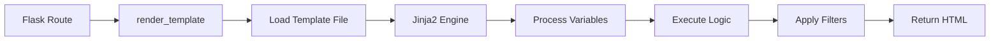
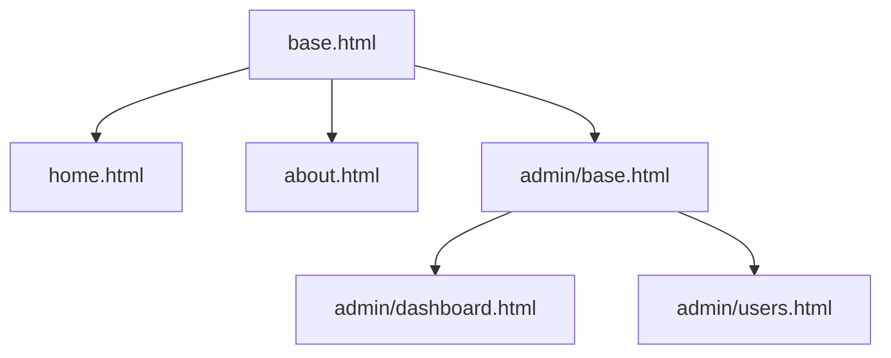
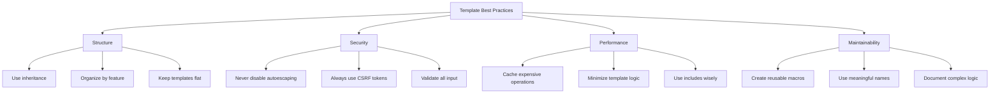

# How to Use Flask Templates (Jinja2) Effectively

Author: [nawazdhandala](https://www.github.com/nawazdhandala)

Tags: Flask, Jinja2, Templates, Python

Description: A comprehensive guide to using Flask templates with Jinja2 effectively. Learn template syntax, inheritance, macros, filters, and best practices for building maintainable and dynamic web applications.

---

> Flask uses Jinja2 as its templating engine, providing a powerful way to generate dynamic HTML content. Mastering Jinja2 templates is essential for building clean, maintainable web applications with proper separation of concerns.

Jinja2 combines simplicity with power, offering features like template inheritance, macros, filters, and context processors. This guide covers everything you need to build production-ready Flask applications with well-structured templates.

---

## Understanding Jinja2 Basics

### How Flask Template Rendering Works

Flask integrates seamlessly with Jinja2. When you call `render_template()`, Flask loads the template file, processes it through Jinja2, and returns the rendered HTML.



### Project Structure

Before diving into templates, establish a clean project structure. Flask expects templates in a specific location by default:

```
myapp/
    app.py
    templates/
        base.html
        index.html
        components/
            navbar.html
            footer.html
        pages/
            about.html
            contact.html
    static/
        css/
        js/
        images/
```

### Basic Template Rendering

The render_template function loads templates from the templates directory and passes variables to Jinja2 for processing:

```python
# app.py
from flask import Flask, render_template

app = Flask(__name__)

@app.route('/')
def index():
    # Pass variables to the template context
    # These become available in the template as {{ variable_name }}
    return render_template(
        'index.html',
        title='Welcome',
        user={'name': 'Alice', 'role': 'admin'},
        items=['Item 1', 'Item 2', 'Item 3']
    )

@app.route('/user/<username>')
def user_profile(username):
    # Dynamic data from URL parameters
    user = get_user_from_database(username)
    return render_template('profile.html', user=user)
```

---

## Jinja2 Syntax Fundamentals

### Variable Output

Use double curly braces to output variables. Jinja2 automatically escapes HTML to prevent XSS attacks:

```html
<!-- templates/index.html -->
<!DOCTYPE html>
<html>
<head>
    <!-- Output simple variables with {{ }} -->
    <title>{{ title }}</title>
</head>
<body>
    <!-- Access dictionary keys with dot notation -->
    <h1>Hello, {{ user.name }}!</h1>

    <!-- Alternative bracket notation for dictionary access -->
    <p>Role: {{ user['role'] }}</p>

    <!-- Access list items by index -->
    <p>First item: {{ items[0] }}</p>

    <!-- Use default filter for missing values -->
    <p>Description: {{ description | default('No description provided') }}</p>
</body>
</html>
```

### Control Structures

Control structures use `` tags. Always include the closing tag with `end` prefix:

```html
<!-- templates/dashboard.html -->

<!-- If/elif/else for conditional rendering -->

    <div class="admin-panel">
        <h2>Admin Dashboard</h2>
        <a href="/admin/users">Manage Users</a>
    </div>

    <div class="mod-panel">
        <h2>Moderator Tools</h2>
    </div>

    <div class="user-panel">
        <h2>User Dashboard</h2>
    </div>


<!-- For loops with loop variable access -->
<ul class="items-list">

    <li class="firstlast">
        <!-- loop.index starts at 1, loop.index0 starts at 0 -->
        <span class="index">{{ loop.index }}.</span>
        <span class="name">{{ item.name }}</span>

        <!-- loop.cycle alternates between values -->
        <span class="row-{{ loop.cycle('odd', 'even') }}">
            {{ item.value }}
        </span>
    </li>

    <!-- Rendered when the list is empty -->
    <li class="empty">No items found</li>

</ul>
```

### Loop Variables Reference

Jinja2 provides several useful variables inside loops:

```html
<!-- All available loop variables -->

    {{ loop.index }}      <!-- Current iteration (1-indexed) -->
    {{ loop.index0 }}     <!-- Current iteration (0-indexed) -->
    {{ loop.revindex }}   <!-- Iterations from end (1-indexed) -->
    {{ loop.revindex0 }}  <!-- Iterations from end (0-indexed) -->
    {{ loop.first }}      <!-- True if first iteration -->
    {{ loop.last }}       <!-- True if last iteration -->
    {{ loop.length }}     <!-- Total number of items -->
    {{ loop.depth }}      <!-- Nesting level (starts at 1) -->
    {{ loop.depth0 }}     <!-- Nesting level (starts at 0) -->

```

---

## Template Inheritance

Template inheritance is Jinja2's most powerful feature. It allows you to create a base template with common structure and extend it in child templates.



### Base Template

Create a base template that defines the overall structure and blocks that child templates can override:

```html
<!-- templates/base.html -->
<!DOCTYPE html>
<html lang="en">
<head>
    <meta charset="UTF-8">
    <meta name="viewport" content="width=device-width, initial-scale=1.0">

    <!-- Block for page title with default value -->
    <title>My Application</title>

    <!-- Base CSS that all pages need -->
    <link rel="stylesheet" href="{{ url_for('static', filename='css/main.css') }}">

    <!-- Block for additional page-specific CSS -->
    
</head>
<body>
    <!-- Navigation included on all pages -->
    <nav class="navbar">
        
    </nav>

    <!-- Flash messages for user feedback -->
    
        
            <div class="flash-messages">
                
                    <div class="alert alert-{{ category }}">
                        {{ message }}
                    </div>
                
            </div>
        
    

    <!-- Main content area that child templates override -->
    <main class="container">
        
        <!-- Default content if block is not overridden -->
        <p>Welcome to the application</p>
        
    </main>

    <!-- Footer included on all pages -->
    <footer>
        
    </footer>

    <!-- Base JavaScript -->
    <script src="{{ url_for('static', filename='js/main.js') }}"></script>

    <!-- Block for additional page-specific JavaScript -->
    
</body>
</html>
```

### Child Template

Child templates extend the base and override specific blocks:

```html
<!-- templates/pages/about.html -->


<!-- Override the title block -->
About Us - {{ super() }}

<!-- Add page-specific CSS -->

<link rel="stylesheet" href="{{ url_for('static', filename='css/about.css') }}">


<!-- Override the main content block -->

<article class="about-page">
    <h1>About Our Company</h1>

    <section class="mission">
        <h2>Our Mission</h2>
        <p>{{ company.mission }}</p>
    </section>

    <section class="team">
        <h2>Our Team</h2>
        <div class="team-grid">
            
                <div class="team-member">
                    
                    <h3>{{ member.name }}</h3>
                    <p>{{ member.role }}</p>
                </div>
            
        </div>
    </section>
</article>


<!-- Add page-specific JavaScript -->

<script src="{{ url_for('static', filename='js/about.js') }}"></script>

```

### Using super() to Extend Blocks

The `super()` function includes the parent block's content instead of replacing it entirely:

```html
<!-- templates/admin/base.html -->


<!-- Extend the CSS block instead of replacing -->

{{ super() }}
<link rel="stylesheet" href="{{ url_for('static', filename='css/admin.css') }}">



<div class="admin-layout">
    <aside class="admin-sidebar">
        
        <nav class="admin-nav">
            <a href="{{ url_for('admin.dashboard') }}">Dashboard</a>
            <a href="{{ url_for('admin.users') }}">Users</a>
            <a href="{{ url_for('admin.settings') }}">Settings</a>
        </nav>
        
    </aside>

    <div class="admin-content">
        
    </div>
</div>

```

---

## Macros for Reusable Components

Macros are like functions for templates. They help avoid code duplication and create reusable UI components.

### Defining Macros

Create a dedicated file for macros to keep them organized:

```html
<!-- templates/macros/forms.html -->

<!-- Form input macro with validation support -->

<div class="form-group has-error">
    <label for="{{ name }}">
        {{ label }}
        <span class="required">*</span>
    </label>
    <input
        type="{{ type }}"
        id="{{ name }}"
        name="{{ name }}"
        value="{{ value }}"
        required
        class="form-control"
    >
    
        <span class="error-message">{{ error }}</span>
    
</div>


<!-- Textarea macro -->

<div class="form-group has-error">
    <label for="{{ name }}">{{ label }}</label>
    <textarea
        id="{{ name }}"
        name="{{ name }}"
        rows="{{ rows }}"
        required
        class="form-control"
    >{{ value }}</textarea>
    
        <span class="error-message">{{ error }}</span>
    
</div>


<!-- Select dropdown macro -->

<div class="form-group">
    <label for="{{ name }}">{{ label }}</label>
    <select id="{{ name }}" name="{{ name }}" required>
        <option value="">Select {{ label }}</option>
        
            <option value="{{ value }}" selected>
                {{ text }}
            </option>
        
    </select>
</div>


<!-- Submit button macro -->

<button type="submit" class="btn btn-{{ style }}">
    {{ text }}
</button>

```

### Using Macros

Import macros into templates that need them:

```html
<!-- templates/pages/contact.html -->


<!-- Import macros from the forms file -->


Contact Us


<div class="contact-page">
    <h1>Contact Us</h1>

    <form method="POST" action="{{ url_for('contact') }}">
        {{ csrf_token() }}

        <!-- Use macros instead of writing HTML repeatedly -->
        {{ form_input('name', 'Your Name', required=true, error=errors.get('name')) }}
        {{ form_input('email', 'Email Address', type='email', required=true, error=errors.get('email')) }}

        {{ form_select('subject', 'Subject', [
            ('general', 'General Inquiry'),
            ('support', 'Technical Support'),
            ('sales', 'Sales Question'),
            ('feedback', 'Feedback')
        ], required=true) }}

        {{ form_textarea('message', 'Your Message', required=true, rows=6, error=errors.get('message')) }}

        {{ submit_button('Send Message') }}
    </form>
</div>

```

### Component Macros for UI Elements

Create macros for common UI patterns:

```html
<!-- templates/macros/components.html -->

<!-- Card component -->

<div class="card">
    <div class="card-header">
        <h3 class="card-title">{{ title }}</h3>
        
            <p class="card-subtitle">{{ subtitle }}</p>
        
    </div>
    <div class="card-body">
        {{ caller() }}
    </div>
    
        <div class="card-footer">
            {{ footer }}
        </div>
    
</div>


<!-- Alert/notification component -->

<div class="alert alert-{{ type }} alert-dismissible">
    {{ message }}
    
        <button type="button" class="close" data-dismiss="alert">&times;</button>
    
</div>


<!-- Pagination component -->

<nav class="pagination">
    
        <a href="{{ url_func(page=page-1) }}" class="prev">Previous</a>
    

    
        
            <span class="current">{{ p }}</span>
        
            <a href="{{ url_func(page=p) }}">{{ p }}</a>
        
    

    
        <a href="{{ url_func(page=page+1) }}" class="next">Next</a>
    
</nav>

```

### Using call Block with Macros

The `call` block allows passing content to macros:

```html
<!-- templates/pages/dashboard.html -->



<div class="dashboard">
    <!-- Use call to pass content to the card macro -->
    
        <ul class="activity-list">
            
                <li>{{ activity.description }} - {{ activity.timestamp }}</li>
            
        </ul>
    

    
        <div class="stats-grid">
            <div class="stat">
                <span class="value">{{ stats.users }}</span>
                <span class="label">Users</span>
            </div>
            <div class="stat">
                <span class="value">{{ stats.orders }}</span>
                <span class="label">Orders</span>
            </div>
        </div>
    
</div>

```

---

## Filters for Data Transformation

Filters transform data before output. Jinja2 includes many built-in filters, and Flask adds more.

### Built-in Filters

Apply filters using the pipe symbol:

```html
<!-- String filters -->
<p>{{ name | upper }}</p>              <!-- ALICE -->
<p>{{ name | lower }}</p>              <!-- alice -->
<p>{{ name | capitalize }}</p>         <!-- Alice -->
<p>{{ name | title }}</p>              <!-- Alice Smith -->
<p>{{ text | truncate(50) }}</p>       <!-- Truncate to 50 chars with ... -->
<p>{{ text | wordwrap(80) }}</p>       <!-- Wrap at 80 characters -->
<p>{{ text | striptags }}</p>          <!-- Remove HTML tags -->
<p>{{ text | trim }}</p>               <!-- Remove leading/trailing whitespace -->
<p>{{ text | replace('old', 'new') }}</p>

<!-- Number filters -->
<p>{{ price | round(2) }}</p>          <!-- Round to 2 decimal places -->
<p>{{ number | int }}</p>              <!-- Convert to integer -->
<p>{{ number | float }}</p>            <!-- Convert to float -->
<p>{{ number | abs }}</p>              <!-- Absolute value -->

<!-- List filters -->
<p>{{ items | length }}</p>            <!-- Count of items -->
<p>{{ items | first }}</p>             <!-- First item -->
<p>{{ items | last }}</p>              <!-- Last item -->
<p>{{ items | join(', ') }}</p>        <!-- Join with separator -->
<p>{{ items | sort }}</p>              <!-- Sort ascending -->
<p>{{ items | reverse }}</p>           <!-- Reverse order -->
<p>{{ items | unique }}</p>            <!-- Remove duplicates -->
<p>{{ items | random }}</p>            <!-- Random item -->

<!-- Default values -->
<p>{{ description | default('N/A') }}</p>
<p>{{ count | default(0, true) }}</p>  <!-- Use default if falsy -->

<!-- JSON output -->
<script>
    var data = {{ data | tojson | safe }};
</script>
```

### Creating Custom Filters

Register custom filters in your Flask application for domain-specific transformations:

```python
# app.py
from flask import Flask
from datetime import datetime
import humanize

app = Flask(__name__)

# Custom filter for formatting currency
@app.template_filter('currency')
def currency_filter(value, symbol='$'):
    """Format number as currency with proper formatting"""
    try:
        return f"{symbol}{value:,.2f}"
    except (ValueError, TypeError):
        return value

# Custom filter for relative time (e.g., "2 hours ago")
@app.template_filter('timeago')
def timeago_filter(dt):
    """Convert datetime to human-readable relative time"""
    if dt is None:
        return ''
    return humanize.naturaltime(datetime.utcnow() - dt)

# Custom filter for formatting file sizes
@app.template_filter('filesize')
def filesize_filter(value):
    """Convert bytes to human-readable file size"""
    return humanize.naturalsize(value, binary=True)

# Custom filter for pluralization
@app.template_filter('pluralize')
def pluralize_filter(count, singular, plural=None):
    """Return singular or plural form based on count"""
    if plural is None:
        plural = singular + 's'
    return singular if count == 1 else plural

# Custom filter for highlighting search terms
@app.template_filter('highlight')
def highlight_filter(text, term):
    """Highlight search term in text"""
    if not term:
        return text
    import re
    pattern = re.compile(f'({re.escape(term)})', re.IGNORECASE)
    return pattern.sub(r'<mark>\1</mark>', text)
```

### Using Custom Filters in Templates

Once registered, custom filters work like built-in ones:

```html
<!-- templates/pages/product.html -->



<div class="product">
    <h1>{{ product.name }}</h1>

    <!-- Currency formatting -->
    <p class="price">{{ product.price | currency }}</p>
    <p class="price-eur">{{ product.price_eur | currency('EUR ') }}</p>

    <!-- Relative time -->
    <p class="updated">Last updated: {{ product.updated_at | timeago }}</p>

    <!-- File size -->
    <p class="download">Download size: {{ product.file_size | filesize }}</p>

    <!-- Pluralization -->
    <p>{{ review_count }} {{ review_count | pluralize('review') }}</p>
    <p>{{ child_count }} {{ child_count | pluralize('child', 'children') }}</p>

    <!-- Search highlighting -->
    <div class="description">
        {{ product.description | highlight(search_term) | safe }}
    </div>
</div>

```

---

## Context Processors for Global Variables

Context processors add variables to all templates automatically.

### Registering Context Processors

Use the context_processor decorator to inject global data:

```python
# app.py
from flask import Flask, g
from datetime import datetime

app = Flask(__name__)

@app.context_processor
def inject_globals():
    """Inject common variables into all templates"""
    return {
        'current_year': datetime.utcnow().year,
        'app_name': 'My Application',
        'app_version': '1.0.0',
    }

@app.context_processor
def inject_user():
    """Inject current user into all templates"""
    return {
        'current_user': getattr(g, 'user', None)
    }

@app.context_processor
def inject_settings():
    """Inject application settings into all templates"""
    return {
        'settings': {
            'theme': get_user_theme(),
            'language': get_user_language(),
            'timezone': get_user_timezone(),
        }
    }

@app.context_processor
def utility_functions():
    """Inject utility functions for use in templates"""
    def format_date(dt, fmt='%Y-%m-%d'):
        return dt.strftime(fmt) if dt else ''

    def is_active(endpoint):
        from flask import request
        return 'active' if request.endpoint == endpoint else ''

    return {
        'format_date': format_date,
        'is_active': is_active,
    }
```

### Using Context Variables in Templates

Context processor variables are available in all templates without explicit passing:

```html
<!-- templates/base.html -->
<!DOCTYPE html>
<html lang="{{ settings.language }}">
<head>
    <title>{{ app_name }}</title>
</head>
<body class="theme-{{ settings.theme }}">
    <nav>
        <!-- is_active function from context processor -->
        <a href="/" class="{{ is_active('index') }}">Home</a>
        <a href="/about" class="{{ is_active('about') }}">About</a>

        <!-- current_user from context processor -->
        
            <span>Welcome, {{ current_user.name }}</span>
            <a href="/logout">Logout</a>
        
            <a href="/login">Login</a>
        
    </nav>

    

    <footer>
        <!-- current_year from context processor -->
        <p>&copy; {{ current_year }} {{ app_name }} v{{ app_version }}</p>
    </footer>
</body>
</html>
```

---

## Template Security

### Auto-Escaping

Jinja2 automatically escapes HTML to prevent XSS attacks. This is crucial for security:

```html
<!-- Automatic escaping prevents XSS -->
<!-- If user_input = "<script>alert('xss')</script>" -->
<p>{{ user_input }}</p>
<!-- Output: &lt;script&gt;alert('xss')&lt;/script&gt; -->

<!-- Use the safe filter ONLY for trusted HTML content -->
<!-- WARNING: Never use safe with user input! -->
<div>{{ trusted_html | safe }}</div>

<!-- Use Markup in Python for trusted HTML -->
```

```python
# app.py
from markupsafe import Markup

@app.route('/article/<int:id>')
def article(id):
    article = get_article(id)
    # Only mark as safe if you trust the source completely
    # For example, HTML from a WYSIWYG editor you control
    safe_content = Markup(article.content) if article.is_sanitized else article.content
    return render_template('article.html', content=safe_content)
```

### CSRF Protection

Always include CSRF tokens in forms to prevent cross-site request forgery:

```python
# app.py
from flask_wtf.csrf import CSRFProtect

app = Flask(__name__)
app.config['SECRET_KEY'] = 'your-secret-key'
csrf = CSRFProtect(app)
```

```html
<!-- templates/forms/login.html -->
<form method="POST" action="{{ url_for('login') }}">
    <!-- CSRF token is required for POST requests -->
    <input type="hidden" name="csrf_token" value="{{ csrf_token() }}">

    <!-- Or use the hidden_tag() method if using Flask-WTF forms -->
    {{ form.hidden_tag() }}

    <input type="email" name="email" required>
    <input type="password" name="password" required>
    <button type="submit">Login</button>
</form>
```

---

## Performance Optimization

### Template Caching

Flask caches compiled templates by default in production. Configure caching behavior:

```python
# app.py
app = Flask(__name__)

# Production settings
app.config['TEMPLATES_AUTO_RELOAD'] = False  # Disable reload checking

# Development settings
if app.debug:
    app.config['TEMPLATES_AUTO_RELOAD'] = True
```

### Fragment Caching

Cache expensive template fragments to improve performance:

```python
# app.py
from flask_caching import Cache

cache = Cache(app, config={
    'CACHE_TYPE': 'redis',
    'CACHE_REDIS_URL': 'redis://localhost:6379/0'
})

@app.route('/')
def index():
    # Cache the expensive computation
    stats = cache.get('site_stats')
    if stats is None:
        stats = compute_expensive_stats()
        cache.set('site_stats', stats, timeout=300)  # Cache for 5 minutes

    return render_template('index.html', stats=stats)
```

### Using include Wisely

Break large templates into smaller, cacheable fragments:

```html
<!-- templates/index.html -->



<!-- Include reusable fragments -->


<!-- Pass variables to included templates -->


<!-- Include with custom variables -->

    


<!-- Conditional include -->

    


```

---

## Advanced Patterns

### Dynamic Template Selection

Choose templates dynamically based on conditions:

```python
# app.py
@app.route('/page/<slug>')
def page(slug):
    page = get_page(slug)

    # Select template based on page type
    template_map = {
        'article': 'pages/article.html',
        'gallery': 'pages/gallery.html',
        'contact': 'pages/contact.html',
        'landing': 'pages/landing.html',
    }

    template = template_map.get(page.type, 'pages/default.html')
    return render_template(template, page=page)

@app.route('/dashboard')
def dashboard():
    # Select template based on user device
    if request.user_agent.platform in ['iphone', 'android']:
        return render_template('dashboard_mobile.html', data=data)
    return render_template('dashboard.html', data=data)
```

### Rendering Partial Templates for AJAX

Return partial HTML for dynamic page updates:

```python
# app.py
@app.route('/api/comments/<int:post_id>')
def get_comments(post_id):
    comments = Comment.query.filter_by(post_id=post_id).all()

    # Render only the comments fragment, not the full page
    return render_template('fragments/comments.html', comments=comments)

@app.route('/api/search')
def search():
    query = request.args.get('q', '')
    results = search_products(query)

    # Return partial template for AJAX requests
    if request.headers.get('X-Requested-With') == 'XMLHttpRequest':
        return render_template('fragments/search_results.html', results=results)

    # Return full page for regular requests
    return render_template('search.html', results=results, query=query)
```

```html
<!-- templates/fragments/comments.html -->
<div class="comments-list">
    
    <div class="comment" id="comment-{{ comment.id }}">
        <div class="comment-header">
            <strong>{{ comment.author.name }}</strong>
            <span class="date">{{ comment.created_at | timeago }}</span>
        </div>
        <div class="comment-body">
            {{ comment.text }}
        </div>
    </div>
    
</div>
```

### Building Email Templates

Create HTML emails with proper structure:

```html
<!-- templates/emails/base.html -->
<!DOCTYPE html>
<html>
<head>
    <meta charset="UTF-8">
    <meta name="viewport" content="width=device-width, initial-scale=1.0">
    <title>{{ app_name }}</title>
    <style>
        /* Inline styles for email compatibility */
        body {
            font-family: Arial, sans-serif;
            line-height: 1.6;
            color: #333;
        }
        .container {
            max-width: 600px;
            margin: 0 auto;
            padding: 20px;
        }
        .header {
            background: #4a90d9;
            color: white;
            padding: 20px;
            text-align: center;
        }
        .content {
            padding: 30px 20px;
        }
        .button {
            display: inline-block;
            background: #4a90d9;
            color: white;
            padding: 12px 24px;
            text-decoration: none;
            border-radius: 4px;
        }
        .footer {
            text-align: center;
            font-size: 12px;
            color: #666;
            padding: 20px;
        }
    </style>
</head>
<body>
    <div class="container">
        <div class="header">
            <h1>{{ app_name }}</h1>
        </div>
        <div class="content">
            
        </div>
        <div class="footer">
            
            <p>&copy; {{ current_year }} {{ app_name }}. All rights reserved.</p>
            
        </div>
    </div>
</body>
</html>
```

```html
<!-- templates/emails/welcome.html -->


Welcome to {{ app_name }}


<h2>Welcome, {{ user.name }}!</h2>

<p>Thank you for joining {{ app_name }}. We're excited to have you on board.</p>

<p>To get started, please verify your email address by clicking the button below:</p>

<p style="text-align: center;">
    <a href="{{ verification_url }}" class="button">Verify Email</a>
</p>

<p>If you didn't create an account, you can safely ignore this email.</p>

<p>Best regards,<br>The {{ app_name }} Team</p>

```

---

## Best Practices Summary



### Key Takeaways

1. **Use template inheritance** - Create a base template and extend it for consistency across pages.

2. **Keep logic minimal** - Templates should focus on presentation. Move complex logic to Python code.

3. **Create reusable macros** - Extract common patterns into macros to avoid duplication.

4. **Leverage filters** - Use built-in filters and create custom ones for domain-specific transformations.

5. **Use context processors** - Inject global variables once instead of passing them to every template.

6. **Never trust user input** - Rely on Jinja2's auto-escaping and only use `safe` for trusted content.

7. **Organize templates logically** - Group templates by feature or type for easier maintenance.

8. **Cache expensive operations** - Use fragment caching for database-heavy template sections.

---

## Conclusion

Jinja2 provides a powerful yet approachable templating system for Flask applications. The key to effective template usage lies in:

- **Template inheritance** for consistent layouts and reduced duplication
- **Macros** for reusable UI components
- **Filters** for clean data transformation
- **Context processors** for global data injection
- **Proper security practices** to protect against XSS and CSRF attacks

By following these patterns and best practices, you can build maintainable, secure, and performant Flask applications with clean separation between logic and presentation.

---

*Building Flask applications? [OneUptime](https://oneuptime.com) provides comprehensive monitoring for Python web applications with automatic error tracking and performance insights.*
