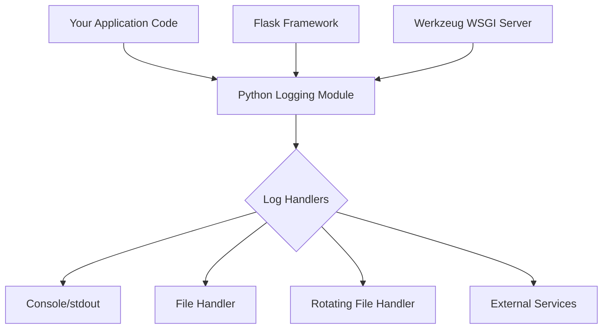
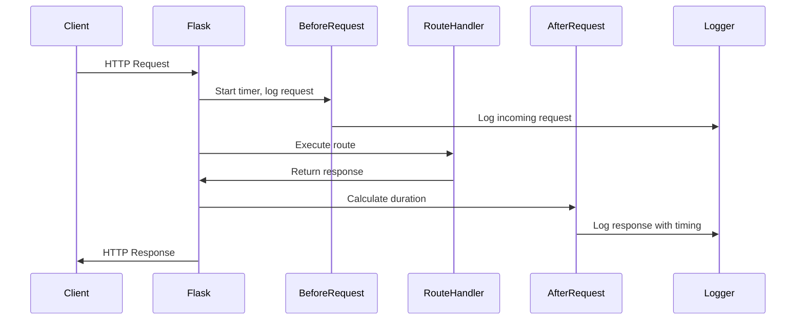
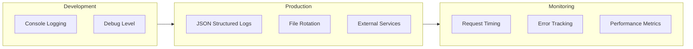

# How to Implement Logging in Flask

Author: [nawazdhandala](https://github.com/nawazdhandala)

Tags: Flask, Python, Logging, Observability, Debugging

Description: Learn how to implement comprehensive logging in Flask applications, covering basic setup, structured logging, log levels, file rotation, request logging, and production best practices.

---

Proper logging is essential for debugging, monitoring, and maintaining Flask applications. This guide covers everything from basic logging setup to production-ready configurations with structured logging and log aggregation.

## Understanding Flask Logging Architecture

Flask applications need to handle logs from multiple sources: the application itself, Werkzeug (the WSGI server), and any libraries you use. Understanding this flow helps you configure logging correctly.



## Basic Logging Setup

Flask uses Python's built-in logging module. Here is how to set up basic logging for your application.

The following code configures a simple logging setup that writes to both console and file. The basicConfig function sets up the root logger with your specified format and level.

```python
# app.py
# Basic Flask logging configuration using Python's logging module
import logging
from flask import Flask

# Create Flask application instance
app = Flask(__name__)

# Configure basic logging with timestamp, level, and message format
logging.basicConfig(
    level=logging.INFO,
    format='%(asctime)s - %(name)s - %(levelname)s - %(message)s',
    datefmt='%Y-%m-%d %H:%M:%S'
)

# Get the logger for your application module
logger = logging.getLogger(__name__)

@app.route('/')
def index():
    # Log informational message when endpoint is accessed
    logger.info('Index page accessed')
    return 'Hello World'

@app.route('/api/data')
def get_data():
    # Log debug information for troubleshooting
    logger.debug('Fetching data from database')
    try:
        # Simulate data retrieval
        data = {'status': 'success'}
        logger.info('Data retrieved successfully')
        return data
    except Exception as e:
        # Log errors with full exception details
        logger.error(f'Failed to fetch data: {e}', exc_info=True)
        return {'error': 'Internal server error'}, 500

if __name__ == '__main__':
    app.run(debug=True)
```

## Understanding Log Levels

Python provides five standard log levels. Choose the appropriate level based on the importance and nature of the message.

| Level | Value | Use Case |
|-------|-------|----------|
| DEBUG | 10 | Detailed diagnostic information |
| INFO | 20 | General operational messages |
| WARNING | 30 | Something unexpected but not critical |
| ERROR | 40 | A feature failed but app continues |
| CRITICAL | 50 | Application may not be able to continue |

The following code demonstrates when to use each log level in practical scenarios.

```python
# log_levels.py
# Demonstrates appropriate use of each log level
import logging
from flask import Flask, request

app = Flask(__name__)
logger = logging.getLogger(__name__)

@app.route('/process/<item_id>')
def process_item(item_id):
    # DEBUG: Detailed information useful during development
    logger.debug(f'Received request for item_id: {item_id}')
    logger.debug(f'Request headers: {dict(request.headers)}')

    # INFO: Confirmation that things are working as expected
    logger.info(f'Processing item {item_id}')

    # Simulate processing with potential issues
    if not item_id.isdigit():
        # WARNING: Something unexpected but the app can handle it
        logger.warning(f'Non-numeric item_id received: {item_id}')
        return {'error': 'Invalid item ID format'}, 400

    try:
        # Simulate database operation
        result = perform_operation(int(item_id))
        logger.info(f'Successfully processed item {item_id}')
        return {'result': result}
    except ConnectionError as e:
        # ERROR: A specific operation failed
        logger.error(f'Database connection failed for item {item_id}: {e}')
        return {'error': 'Service temporarily unavailable'}, 503
    except Exception as e:
        # CRITICAL: Severe error that may prevent the app from continuing
        logger.critical(f'Unexpected failure processing {item_id}: {e}', exc_info=True)
        return {'error': 'Internal server error'}, 500

def perform_operation(item_id):
    # Placeholder for actual business logic
    return f'Processed {item_id}'
```

## File Logging with Rotation

For production applications, you need to write logs to files with rotation to prevent disk space issues. This example shows how to configure rotating file handlers.

```python
# file_logging.py
# Configure file logging with automatic rotation
import logging
from logging.handlers import RotatingFileHandler, TimedRotatingFileHandler
import os
from flask import Flask

app = Flask(__name__)

def setup_file_logging(app):
    """Configure file-based logging with rotation."""
    # Create logs directory if it does not exist
    log_dir = 'logs'
    if not os.path.exists(log_dir):
        os.makedirs(log_dir)

    # Define consistent log format for all handlers
    formatter = logging.Formatter(
        '%(asctime)s - %(name)s - %(levelname)s - '
        '%(filename)s:%(lineno)d - %(message)s'
    )

    # Size-based rotation: creates new file when size limit reached
    # maxBytes=10MB, keeps 10 backup files
    size_handler = RotatingFileHandler(
        os.path.join(log_dir, 'app.log'),
        maxBytes=10 * 1024 * 1024,  # 10 MB
        backupCount=10
    )
    size_handler.setFormatter(formatter)
    size_handler.setLevel(logging.INFO)

    # Time-based rotation: creates new file at midnight daily
    # Keeps logs for 30 days
    time_handler = TimedRotatingFileHandler(
        os.path.join(log_dir, 'app_daily.log'),
        when='midnight',
        interval=1,
        backupCount=30
    )
    time_handler.setFormatter(formatter)
    time_handler.setLevel(logging.INFO)

    # Separate error log for easier troubleshooting
    error_handler = RotatingFileHandler(
        os.path.join(log_dir, 'error.log'),
        maxBytes=10 * 1024 * 1024,
        backupCount=5
    )
    error_handler.setFormatter(formatter)
    error_handler.setLevel(logging.ERROR)

    # Add handlers to the Flask app logger
    app.logger.addHandler(size_handler)
    app.logger.addHandler(time_handler)
    app.logger.addHandler(error_handler)
    app.logger.setLevel(logging.DEBUG)

# Initialize logging when app starts
setup_file_logging(app)

@app.route('/')
def index():
    app.logger.info('Index accessed')
    return 'Hello World'

if __name__ == '__main__':
    app.run()
```

## Request Logging Middleware

Track all incoming requests with timing information using Flask's before_request and after_request hooks. This is invaluable for performance monitoring and debugging.



The following middleware logs every request with its duration, helping you identify slow endpoints.

```python
# request_logging.py
# Middleware for comprehensive request logging
import time
import logging
from flask import Flask, request, g
from functools import wraps

app = Flask(__name__)
logger = logging.getLogger(__name__)

# Configure logging format
logging.basicConfig(
    level=logging.INFO,
    format='%(asctime)s - %(levelname)s - %(message)s'
)

@app.before_request
def log_request_start():
    """Log incoming request and start timer."""
    # Store start time in Flask's g object for access in after_request
    g.start_time = time.time()

    # Log request details
    logger.info(
        'Request started: %s %s - Client: %s - User-Agent: %s',
        request.method,
        request.path,
        request.remote_addr,
        request.user_agent.string[:100] if request.user_agent.string else 'Unknown'
    )

    # Log query parameters if present (be careful with sensitive data)
    if request.args:
        logger.debug('Query params: %s', dict(request.args))

@app.after_request
def log_request_end(response):
    """Log response details and duration."""
    # Calculate request duration
    duration = time.time() - g.start_time
    duration_ms = round(duration * 1000, 2)

    # Choose log level based on response status
    if response.status_code >= 500:
        log_func = logger.error
    elif response.status_code >= 400:
        log_func = logger.warning
    else:
        log_func = logger.info

    log_func(
        'Request completed: %s %s - Status: %d - Duration: %sms',
        request.method,
        request.path,
        response.status_code,
        duration_ms
    )

    # Add timing header to response for client-side monitoring
    response.headers['X-Response-Time'] = f'{duration_ms}ms'

    return response

@app.route('/api/users')
def get_users():
    # Simulate some processing time
    time.sleep(0.1)
    return {'users': ['alice', 'bob']}

@app.route('/api/slow')
def slow_endpoint():
    # Simulate slow operation
    time.sleep(2)
    return {'status': 'completed'}

if __name__ == '__main__':
    app.run(debug=True)
```

## Structured Logging with JSON

Structured logging makes it easier to parse and analyze logs with tools like Elasticsearch, Splunk, or cloud logging services.

```python
# structured_logging.py
# JSON-formatted structured logging for log aggregation systems
import logging
import json
import sys
from datetime import datetime
from flask import Flask, request, g
import time

app = Flask(__name__)

class JSONFormatter(logging.Formatter):
    """Custom formatter that outputs JSON-formatted log records."""

    def format(self, record):
        # Build the base log structure
        log_record = {
            'timestamp': datetime.utcnow().isoformat() + 'Z',
            'level': record.levelname,
            'logger': record.name,
            'message': record.getMessage(),
            'module': record.module,
            'function': record.funcName,
            'line': record.lineno
        }

        # Add exception info if present
        if record.exc_info:
            log_record['exception'] = self.formatException(record.exc_info)

        # Add any extra fields passed to the logger
        if hasattr(record, 'extra_fields'):
            log_record.update(record.extra_fields)

        return json.dumps(log_record)

class ContextualLogger:
    """Logger wrapper that automatically includes request context."""

    def __init__(self, logger):
        self.logger = logger

    def _get_request_context(self):
        """Extract relevant context from the current request."""
        context = {}
        try:
            context = {
                'request_id': getattr(g, 'request_id', None),
                'method': request.method,
                'path': request.path,
                'client_ip': request.remote_addr
            }
        except RuntimeError:
            # Outside of request context
            pass
        return context

    def _log(self, level, message, **kwargs):
        """Log message with context."""
        extra = {'extra_fields': {**self._get_request_context(), **kwargs}}
        getattr(self.logger, level)(message, extra=extra)

    def debug(self, message, **kwargs):
        self._log('debug', message, **kwargs)

    def info(self, message, **kwargs):
        self._log('info', message, **kwargs)

    def warning(self, message, **kwargs):
        self._log('warning', message, **kwargs)

    def error(self, message, **kwargs):
        self._log('error', message, **kwargs)

def setup_structured_logging():
    """Configure JSON-formatted logging."""
    # Create handler for stdout with JSON formatting
    handler = logging.StreamHandler(sys.stdout)
    handler.setFormatter(JSONFormatter())

    # Configure root logger
    root_logger = logging.getLogger()
    root_logger.handlers = []  # Clear existing handlers
    root_logger.addHandler(handler)
    root_logger.setLevel(logging.INFO)

    return ContextualLogger(logging.getLogger(__name__))

# Initialize structured logging
logger = setup_structured_logging()

@app.before_request
def setup_request_context():
    """Add unique request ID for tracing."""
    import uuid
    g.request_id = str(uuid.uuid4())[:8]
    g.start_time = time.time()

@app.route('/api/orders/<order_id>')
def get_order(order_id):
    # Log with additional structured fields
    logger.info(
        'Fetching order',
        order_id=order_id,
        action='order_fetch'
    )

    # Simulate order lookup
    order = {'id': order_id, 'status': 'shipped'}

    logger.info(
        'Order retrieved successfully',
        order_id=order_id,
        order_status=order['status'],
        action='order_fetch_complete'
    )

    return order

if __name__ == '__main__':
    app.run(debug=True)
```

Example JSON log output:

```json
{
  "timestamp": "2026-02-02T14:30:45.123Z",
  "level": "INFO",
  "logger": "structured_logging",
  "message": "Fetching order",
  "module": "structured_logging",
  "function": "get_order",
  "line": 89,
  "request_id": "a1b2c3d4",
  "method": "GET",
  "path": "/api/orders/12345",
  "client_ip": "192.168.1.100",
  "order_id": "12345",
  "action": "order_fetch"
}
```

## Error Logging and Exception Handling

Proper exception logging captures the full stack trace and context needed for debugging.

```python
# error_logging.py
# Comprehensive error and exception logging
import logging
import traceback
import sys
from flask import Flask, request, jsonify
from functools import wraps

app = Flask(__name__)
logger = logging.getLogger(__name__)

logging.basicConfig(
    level=logging.DEBUG,
    format='%(asctime)s - %(name)s - %(levelname)s - %(message)s'
)

class AppError(Exception):
    """Base exception for application errors."""
    def __init__(self, message, status_code=500, payload=None):
        super().__init__(message)
        self.message = message
        self.status_code = status_code
        self.payload = payload

class ValidationError(AppError):
    """Raised when request validation fails."""
    def __init__(self, message, payload=None):
        super().__init__(message, status_code=400, payload=payload)

class NotFoundError(AppError):
    """Raised when a resource is not found."""
    def __init__(self, message, payload=None):
        super().__init__(message, status_code=404, payload=payload)

@app.errorhandler(AppError)
def handle_app_error(error):
    """Handle custom application errors with appropriate logging."""
    # Log based on error severity
    if error.status_code >= 500:
        logger.error(
            'Application error: %s - Status: %d - Path: %s',
            error.message,
            error.status_code,
            request.path,
            exc_info=True
        )
    else:
        logger.warning(
            'Client error: %s - Status: %d - Path: %s',
            error.message,
            error.status_code,
            request.path
        )

    response = {'error': error.message}
    if error.payload:
        response['details'] = error.payload

    return jsonify(response), error.status_code

@app.errorhandler(Exception)
def handle_unexpected_error(error):
    """Catch-all handler for unexpected exceptions."""
    # Log the full exception with stack trace
    logger.critical(
        'Unexpected error: %s - Path: %s - Method: %s',
        str(error),
        request.path,
        request.method,
        exc_info=True
    )

    # In production, do not expose internal error details
    return jsonify({'error': 'An unexpected error occurred'}), 500

def log_exceptions(func):
    """Decorator to log exceptions with context."""
    @wraps(func)
    def wrapper(*args, **kwargs):
        try:
            return func(*args, **kwargs)
        except AppError:
            # Re-raise application errors to be handled by error handlers
            raise
        except Exception as e:
            # Log unexpected exceptions with full context
            logger.error(
                'Exception in %s: %s',
                func.__name__,
                str(e),
                exc_info=True,
                extra={
                    'function': func.__name__,
                    'args': str(args),
                    'kwargs': str(kwargs)
                }
            )
            raise
    return wrapper

@app.route('/api/items/<item_id>')
@log_exceptions
def get_item(item_id):
    # Validate input
    if not item_id.isdigit():
        raise ValidationError(
            'Item ID must be numeric',
            payload={'received': item_id}
        )

    # Simulate database lookup
    item = find_item(int(item_id))
    if not item:
        raise NotFoundError(f'Item {item_id} not found')

    return jsonify(item)

def find_item(item_id):
    """Simulate database lookup."""
    items = {1: {'id': 1, 'name': 'Widget'}, 2: {'id': 2, 'name': 'Gadget'}}
    return items.get(item_id)

if __name__ == '__main__':
    app.run(debug=True)
```

## Logging Configuration with Dictionary Config

For complex applications, use dictionary-based configuration to manage multiple loggers and handlers.

```python
# dict_config.py
# Advanced logging configuration using dictConfig
import logging
import logging.config
import os
from flask import Flask

app = Flask(__name__)

# Comprehensive logging configuration
LOGGING_CONFIG = {
    'version': 1,
    'disable_existing_loggers': False,

    # Define log message formats
    'formatters': {
        'standard': {
            'format': '%(asctime)s - %(name)s - %(levelname)s - %(message)s',
            'datefmt': '%Y-%m-%d %H:%M:%S'
        },
        'detailed': {
            'format': '%(asctime)s - %(name)s - %(levelname)s - '
                      '%(filename)s:%(lineno)d - %(funcName)s - %(message)s',
            'datefmt': '%Y-%m-%d %H:%M:%S'
        },
        'json': {
            '()': 'pythonjsonlogger.jsonlogger.JsonFormatter',
            'format': '%(asctime)s %(name)s %(levelname)s %(message)s'
        }
    },

    # Define log handlers (destinations)
    'handlers': {
        'console': {
            'class': 'logging.StreamHandler',
            'level': 'DEBUG',
            'formatter': 'standard',
            'stream': 'ext://sys.stdout'
        },
        'file': {
            'class': 'logging.handlers.RotatingFileHandler',
            'level': 'INFO',
            'formatter': 'detailed',
            'filename': 'logs/app.log',
            'maxBytes': 10485760,  # 10MB
            'backupCount': 5
        },
        'error_file': {
            'class': 'logging.handlers.RotatingFileHandler',
            'level': 'ERROR',
            'formatter': 'detailed',
            'filename': 'logs/error.log',
            'maxBytes': 10485760,
            'backupCount': 5
        }
    },

    # Configure specific loggers
    'loggers': {
        '': {  # Root logger
            'handlers': ['console'],
            'level': 'WARNING',
            'propagate': True
        },
        'app': {  # Application logger
            'handlers': ['console', 'file', 'error_file'],
            'level': 'DEBUG',
            'propagate': False
        },
        'werkzeug': {  # Flask's development server
            'handlers': ['console'],
            'level': 'WARNING',
            'propagate': False
        },
        'sqlalchemy.engine': {  # Database queries
            'handlers': ['file'],
            'level': 'WARNING',
            'propagate': False
        }
    }
}

def setup_logging():
    """Initialize logging from configuration dictionary."""
    # Create logs directory
    os.makedirs('logs', exist_ok=True)

    # Apply configuration
    logging.config.dictConfig(LOGGING_CONFIG)

# Initialize logging
setup_logging()

# Get application logger
logger = logging.getLogger('app')

@app.route('/')
def index():
    logger.info('Index page accessed')
    return 'Hello World'

@app.route('/debug')
def debug_endpoint():
    logger.debug('Debug information')
    logger.info('Info message')
    logger.warning('Warning message')
    logger.error('Error message')
    return 'Check your logs'

if __name__ == '__main__':
    app.run(debug=True)
```

## Production Logging Best Practices

Here is a production-ready logging setup that combines all the best practices.

```python
# production_logging.py
# Production-ready Flask logging configuration
import logging
import logging.config
import os
import sys
from datetime import datetime
from flask import Flask, request, g
import time

def create_app():
    """Application factory with production logging."""
    app = Flask(__name__)

    # Load configuration based on environment
    env = os.getenv('FLASK_ENV', 'development')

    if env == 'production':
        configure_production_logging(app)
    else:
        configure_development_logging(app)

    register_request_hooks(app)
    register_routes(app)

    return app

def configure_production_logging(app):
    """Configure logging for production environment."""
    log_level = os.getenv('LOG_LEVEL', 'INFO')
    log_dir = os.getenv('LOG_DIR', '/var/log/flask')

    os.makedirs(log_dir, exist_ok=True)

    config = {
        'version': 1,
        'disable_existing_loggers': False,
        'formatters': {
            'json': {
                'format': '%(message)s',
                'class': 'pythonjsonlogger.jsonlogger.JsonFormatter'
            }
        },
        'handlers': {
            'stdout': {
                'class': 'logging.StreamHandler',
                'formatter': 'json',
                'stream': 'ext://sys.stdout'
            },
            'file': {
                'class': 'logging.handlers.RotatingFileHandler',
                'formatter': 'json',
                'filename': os.path.join(log_dir, 'app.log'),
                'maxBytes': 52428800,  # 50MB
                'backupCount': 10
            }
        },
        'root': {
            'level': log_level,
            'handlers': ['stdout', 'file']
        }
    }

    logging.config.dictConfig(config)
    app.logger.info('Production logging configured')

def configure_development_logging(app):
    """Configure logging for development environment."""
    logging.basicConfig(
        level=logging.DEBUG,
        format='%(asctime)s - %(name)s - %(levelname)s - %(message)s',
        handlers=[logging.StreamHandler(sys.stdout)]
    )
    app.logger.info('Development logging configured')

def register_request_hooks(app):
    """Register before/after request hooks for logging."""

    @app.before_request
    def before_request():
        g.request_id = request.headers.get('X-Request-ID', generate_request_id())
        g.start_time = time.time()

        app.logger.info(
            'Request started',
            extra={
                'request_id': g.request_id,
                'method': request.method,
                'path': request.path,
                'remote_addr': request.remote_addr
            }
        )

    @app.after_request
    def after_request(response):
        duration_ms = round((time.time() - g.start_time) * 1000, 2)

        app.logger.info(
            'Request completed',
            extra={
                'request_id': g.request_id,
                'method': request.method,
                'path': request.path,
                'status_code': response.status_code,
                'duration_ms': duration_ms
            }
        )

        # Add request ID to response for tracing
        response.headers['X-Request-ID'] = g.request_id
        return response

def generate_request_id():
    """Generate unique request identifier."""
    import uuid
    return str(uuid.uuid4())[:12]

def register_routes(app):
    """Register application routes."""

    @app.route('/health')
    def health():
        return {'status': 'healthy'}

    @app.route('/api/data')
    def get_data():
        app.logger.info('Processing data request')
        return {'data': 'example'}

# Create application
app = create_app()

if __name__ == '__main__':
    app.run()
```

## Integrating with External Log Aggregators

Send logs to external services like Elasticsearch, CloudWatch, or Datadog using appropriate handlers.

```python
# external_logging.py
# Integration with external logging services
import logging
import socket
import json
from logging.handlers import SysLogHandler, HTTPHandler
from flask import Flask

app = Flask(__name__)

class ElasticsearchHandler(logging.Handler):
    """Custom handler to send logs to Elasticsearch."""

    def __init__(self, host, port, index):
        super().__init__()
        self.host = host
        self.port = port
        self.index = index

    def emit(self, record):
        try:
            import requests
            from datetime import datetime

            log_entry = {
                '@timestamp': datetime.utcnow().isoformat(),
                'level': record.levelname,
                'logger': record.name,
                'message': self.format(record),
                'host': socket.gethostname()
            }

            url = f'http://{self.host}:{self.port}/{self.index}/_doc'
            requests.post(url, json=log_entry, timeout=5)
        except Exception:
            self.handleError(record)

def setup_syslog_logging():
    """Configure syslog for centralized logging."""
    syslog_handler = SysLogHandler(
        address=('/dev/log'),
        facility=SysLogHandler.LOG_USER
    )
    syslog_handler.setFormatter(logging.Formatter(
        '%(name)s: %(levelname)s %(message)s'
    ))

    app.logger.addHandler(syslog_handler)

def setup_elasticsearch_logging():
    """Configure Elasticsearch logging."""
    es_handler = ElasticsearchHandler(
        host='localhost',
        port=9200,
        index='flask-logs'
    )
    es_handler.setLevel(logging.INFO)
    es_handler.setFormatter(logging.Formatter('%(message)s'))

    app.logger.addHandler(es_handler)

# Choose logging backend based on environment variable
import os
log_backend = os.getenv('LOG_BACKEND', 'console')

if log_backend == 'syslog':
    setup_syslog_logging()
elif log_backend == 'elasticsearch':
    setup_elasticsearch_logging()

@app.route('/')
def index():
    app.logger.info('Index accessed')
    return 'Hello World'

if __name__ == '__main__':
    app.run()
```

## Performance Logging and Metrics

Track endpoint performance with detailed timing metrics.

```python
# performance_logging.py
# Performance monitoring with detailed metrics
import logging
import time
from functools import wraps
from flask import Flask, request, g
from collections import defaultdict
import statistics

app = Flask(__name__)
logger = logging.getLogger(__name__)

logging.basicConfig(level=logging.INFO)

# Store metrics in memory (use Redis in production)
metrics = defaultdict(list)

def track_performance(func):
    """Decorator to track function execution time."""
    @wraps(func)
    def wrapper(*args, **kwargs):
        start_time = time.time()
        result = func(*args, **kwargs)
        duration = time.time() - start_time

        # Record metric
        endpoint = f'{request.method} {request.path}'
        metrics[endpoint].append(duration)

        # Log slow requests (over 1 second)
        if duration > 1.0:
            logger.warning(
                'Slow request detected: %s took %.2fs',
                endpoint,
                duration
            )

        return result
    return wrapper

@app.route('/api/metrics')
def get_metrics():
    """Endpoint to view performance metrics."""
    result = {}
    for endpoint, times in metrics.items():
        if times:
            result[endpoint] = {
                'count': len(times),
                'avg_ms': round(statistics.mean(times) * 1000, 2),
                'min_ms': round(min(times) * 1000, 2),
                'max_ms': round(max(times) * 1000, 2),
                'p95_ms': round(
                    sorted(times)[int(len(times) * 0.95)] * 1000, 2
                ) if len(times) > 1 else round(times[0] * 1000, 2)
            }
    return result

@app.route('/api/data')
@track_performance
def get_data():
    # Simulate variable processing time
    time.sleep(0.1)
    return {'data': 'example'}

@app.route('/api/slow')
@track_performance
def slow_endpoint():
    time.sleep(1.5)
    return {'status': 'done'}

if __name__ == '__main__':
    app.run(debug=True)
```

## Summary

Effective logging in Flask requires:

1. Choose appropriate log levels for different message types
2. Use rotating file handlers to prevent disk space issues
3. Implement request logging middleware for performance monitoring
4. Use structured JSON logging for production environments
5. Configure proper exception handling with full stack traces
6. Use dictionary configuration for complex setups
7. Integrate with external log aggregation services



## Monitoring Your Flask Application with OneUptime

While proper logging helps you understand what is happening in your application, you also need proactive monitoring to catch issues before they affect your users. OneUptime provides comprehensive monitoring for Flask applications, including uptime monitoring, performance tracking, and alerting.

With OneUptime, you can:

- Monitor your Flask application endpoints for availability
- Set up alerts when error rates spike based on your logs
- Track response times and get notified of performance degradation
- Create status pages to keep your users informed
- Integrate with your logging infrastructure for complete observability

Get started with OneUptime at [https://oneuptime.com](https://oneuptime.com) to complement your logging setup with powerful monitoring capabilities.
