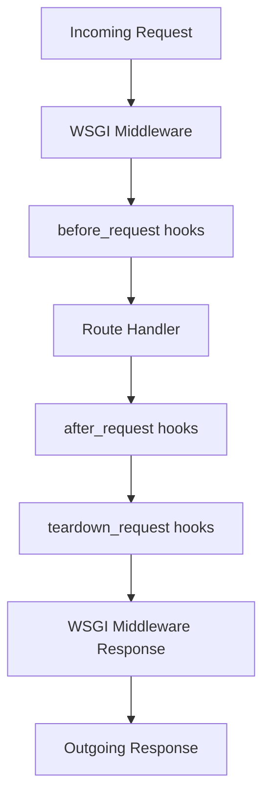
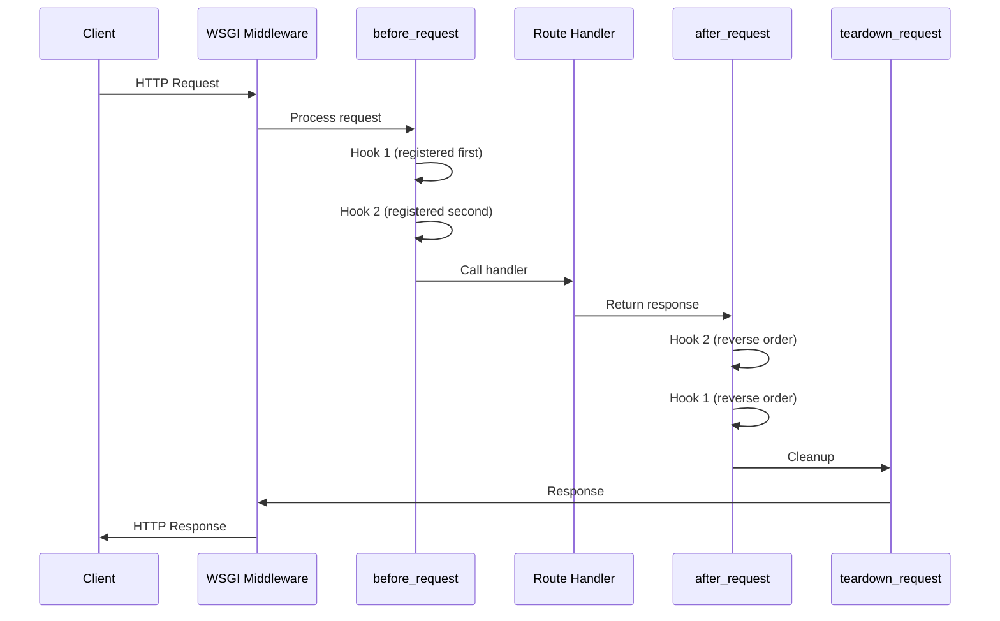

# How to Add Middleware to Flask

Author: [nawazdhandala](https://www.github.com/nawazdhandala)

Tags: Flask, Python, Middleware, Web Development, WSGI, Request Processing

Description: Learn how to implement middleware in Flask applications using WSGI middleware, before/after request hooks, and custom decorators. This guide covers logging, authentication, request modification, and error handling patterns.

---

> Middleware allows you to process requests and responses globally before they reach your route handlers or after they leave. Flask provides multiple ways to implement middleware patterns, from WSGI-level middleware to application-level hooks.

Middleware is essential for cross-cutting concerns like authentication, logging, request validation, and response transformation. Understanding how to implement middleware in Flask gives you powerful tools for building maintainable applications.

---

## Understanding Flask Request Lifecycle

Before diving into middleware implementation, it helps to understand how Flask processes requests.



Flask processes requests through several stages, giving you multiple points to intercept and modify behavior.

---

## Method 1: Before and After Request Hooks

The simplest way to add middleware-like behavior in Flask is using request hooks.

### Basic Request Hooks

This example demonstrates all available request hooks and when they execute.

```python
# app.py
from flask import Flask, request, g
import time

app = Flask(__name__)

# before_request runs before every request handler
# Use it for authentication, request validation, or setting up resources
@app.before_request
def before_request_handler():
    """Execute before each request"""
    # Store request start time for measuring duration
    g.start_time = time.time()

    # Log incoming request details
    app.logger.info(f"Request: {request.method} {request.path}")

    # You can return a response here to short-circuit the request
    # Returning None continues to the route handler

# after_request runs after the route handler but before the response is sent
# The response object can be modified here
@app.after_request
def after_request_handler(response):
    """Execute after each request, receives the response object"""
    # Calculate request duration
    duration = time.time() - g.start_time

    # Add custom headers to response
    response.headers['X-Request-Duration'] = f"{duration:.4f}s"
    response.headers['X-Request-ID'] = g.get('request_id', 'unknown')

    # Log response details
    app.logger.info(f"Response: {response.status_code} in {duration:.4f}s")

    return response

# teardown_request runs at the very end, even if an exception occurred
# Use it for cleanup tasks like closing database connections
@app.teardown_request
def teardown_request_handler(exception=None):
    """Execute after each request, even on errors"""
    if exception:
        app.logger.error(f"Request failed with: {exception}")

    # Clean up any resources stored in g
    # Database connections, file handles, etc.

@app.route('/')
def index():
    return {'message': 'Hello, World!'}

if __name__ == '__main__':
    app.run(debug=True)
```

---

### Authentication Middleware with Hooks

Implementing authentication as middleware ensures all protected routes are secured.

```python
# auth_middleware.py
from flask import Flask, request, g, jsonify
from functools import wraps
import jwt

app = Flask(__name__)
app.config['SECRET_KEY'] = 'your-secret-key'

# List of paths that don't require authentication
PUBLIC_PATHS = ['/login', '/health', '/docs']

@app.before_request
def authenticate_request():
    """Verify JWT token for protected routes"""
    # Skip authentication for public paths
    if request.path in PUBLIC_PATHS:
        return None

    # Extract token from Authorization header
    auth_header = request.headers.get('Authorization')

    if not auth_header:
        return jsonify({'error': 'Missing Authorization header'}), 401

    # Expect format: "Bearer <token>"
    parts = auth_header.split()

    if len(parts) != 2 or parts[0].lower() != 'bearer':
        return jsonify({'error': 'Invalid Authorization format'}), 401

    token = parts[1]

    try:
        # Decode and verify the JWT token
        payload = jwt.decode(
            token,
            app.config['SECRET_KEY'],
            algorithms=['HS256']
        )

        # Store user info in g for access in route handlers
        g.current_user = payload
        g.user_id = payload.get('user_id')

    except jwt.ExpiredSignatureError:
        return jsonify({'error': 'Token has expired'}), 401
    except jwt.InvalidTokenError:
        return jsonify({'error': 'Invalid token'}), 401

    return None

@app.route('/login', methods=['POST'])
def login():
    """Public endpoint for authentication"""
    # Authentication logic here
    return {'token': 'jwt_token_here'}

@app.route('/protected')
def protected_route():
    """This route requires authentication"""
    return {'user_id': g.user_id, 'message': 'Access granted'}

@app.route('/health')
def health():
    """Public health check endpoint"""
    return {'status': 'healthy'}
```

---

## Method 2: WSGI Middleware

For lower-level control, you can create WSGI middleware that wraps your Flask application.

### Basic WSGI Middleware Structure

WSGI middleware wraps the entire application and has access to the raw request and response.

```python
# wsgi_middleware.py
from flask import Flask
import time

class TimingMiddleware:
    """WSGI middleware that measures request processing time"""

    def __init__(self, app):
        # Store the wrapped WSGI application
        self.app = app

    def __call__(self, environ, start_response):
        """WSGI interface: called for each request"""
        # Record start time
        start_time = time.time()

        # Store timing info in environ for the app to access
        environ['REQUEST_START_TIME'] = start_time

        # Custom start_response to intercept response
        def custom_start_response(status, headers, exc_info=None):
            # Calculate duration
            duration = time.time() - start_time

            # Add timing header to response
            headers.append(('X-Request-Duration', f'{duration:.4f}s'))

            return start_response(status, headers, exc_info)

        # Call the wrapped application
        return self.app(environ, custom_start_response)


class RequestLoggingMiddleware:
    """WSGI middleware for logging all requests"""

    def __init__(self, app, logger=None):
        self.app = app
        self.logger = logger or self._default_logger

    def _default_logger(self, message):
        print(message)

    def __call__(self, environ, start_response):
        # Extract request information from environ
        method = environ.get('REQUEST_METHOD')
        path = environ.get('PATH_INFO')
        query = environ.get('QUERY_STRING', '')
        remote_addr = environ.get('REMOTE_ADDR')

        # Log the incoming request
        self.logger(f"Request: {method} {path}?{query} from {remote_addr}")

        # Track response status
        response_status = [None]

        def logging_start_response(status, headers, exc_info=None):
            response_status[0] = status
            return start_response(status, headers, exc_info)

        # Call the application
        try:
            response = self.app(environ, logging_start_response)
            self.logger(f"Response: {response_status[0]}")
            return response
        except Exception as e:
            self.logger(f"Error: {e}")
            raise


# Apply WSGI middleware to Flask app
app = Flask(__name__)

# Wrap the app with middleware (order matters - last added runs first)
app.wsgi_app = TimingMiddleware(app.wsgi_app)
app.wsgi_app = RequestLoggingMiddleware(app.wsgi_app)

@app.route('/')
def index():
    return {'message': 'Hello with WSGI middleware!'}

if __name__ == '__main__':
    app.run(debug=True)
```

---

### Request Modification Middleware

Modify incoming requests before they reach your application.

```python
# request_modifier.py
from flask import Flask
import json

class RequestModifierMiddleware:
    """Middleware that modifies incoming requests"""

    def __init__(self, app):
        self.app = app

    def __call__(self, environ, start_response):
        # Add custom headers to all requests
        environ['HTTP_X_PROCESSED_BY'] = 'RequestModifierMiddleware'

        # Normalize path (remove trailing slashes)
        path = environ.get('PATH_INFO', '')
        if path != '/' and path.endswith('/'):
            environ['PATH_INFO'] = path.rstrip('/')

        # Parse and validate JSON body for POST/PUT requests
        method = environ.get('REQUEST_METHOD')
        content_type = environ.get('CONTENT_TYPE', '')

        if method in ['POST', 'PUT', 'PATCH'] and 'application/json' in content_type:
            try:
                # Read the request body
                content_length = int(environ.get('CONTENT_LENGTH', 0))
                body = environ['wsgi.input'].read(content_length)

                # Parse JSON to validate it
                if body:
                    data = json.loads(body)

                    # Add timestamp to all JSON requests
                    import time
                    data['_request_timestamp'] = time.time()

                    # Re-encode and update the body
                    new_body = json.dumps(data).encode('utf-8')
                    environ['CONTENT_LENGTH'] = str(len(new_body))

                    # Create a new input stream with modified body
                    from io import BytesIO
                    environ['wsgi.input'] = BytesIO(new_body)

            except json.JSONDecodeError:
                # Invalid JSON - let the app handle the error
                pass

        return self.app(environ, start_response)


app = Flask(__name__)
app.wsgi_app = RequestModifierMiddleware(app.wsgi_app)

@app.route('/data', methods=['POST'])
def receive_data():
    from flask import request
    data = request.get_json()
    return {'received': data}
```

---

## Method 3: Custom Decorators

Create reusable middleware using decorators for specific routes.

### Rate Limiting Decorator

```python
# rate_limit_decorator.py
from flask import Flask, request, jsonify, g
from functools import wraps
from collections import defaultdict
import time

app = Flask(__name__)

class RateLimiter:
    """Simple in-memory rate limiter"""

    def __init__(self):
        # Store request counts: {key: [(timestamp, count)]}
        self.requests = defaultdict(list)

    def is_allowed(self, key, limit, window):
        """Check if request is within rate limit"""
        now = time.time()
        window_start = now - window

        # Remove old entries
        self.requests[key] = [
            (ts, count) for ts, count in self.requests[key]
            if ts > window_start
        ]

        # Count requests in current window
        current_count = sum(count for _, count in self.requests[key])

        if current_count >= limit:
            return False

        # Record this request
        self.requests[key].append((now, 1))
        return True

    def get_remaining(self, key, limit, window):
        """Get remaining requests in window"""
        now = time.time()
        window_start = now - window

        current_count = sum(
            count for ts, count in self.requests[key]
            if ts > window_start
        )

        return max(0, limit - current_count)


# Global rate limiter instance
rate_limiter = RateLimiter()


def rate_limit(limit=100, window=60, key_func=None):
    """
    Rate limiting decorator

    Args:
        limit: Maximum requests allowed in the window
        window: Time window in seconds
        key_func: Function to generate rate limit key (default: IP address)
    """
    def decorator(f):
        @wraps(f)
        def decorated_function(*args, **kwargs):
            # Generate rate limit key
            if key_func:
                key = key_func()
            else:
                key = request.remote_addr

            # Check rate limit
            if not rate_limiter.is_allowed(key, limit, window):
                remaining = rate_limiter.get_remaining(key, limit, window)
                response = jsonify({
                    'error': 'Rate limit exceeded',
                    'limit': limit,
                    'window': window,
                    'remaining': remaining
                })
                response.status_code = 429
                response.headers['X-RateLimit-Limit'] = str(limit)
                response.headers['X-RateLimit-Remaining'] = str(remaining)
                response.headers['Retry-After'] = str(window)
                return response

            # Execute the route handler
            response = f(*args, **kwargs)

            # Add rate limit headers to successful responses
            if hasattr(response, 'headers'):
                remaining = rate_limiter.get_remaining(key, limit, window)
                response.headers['X-RateLimit-Limit'] = str(limit)
                response.headers['X-RateLimit-Remaining'] = str(remaining)

            return response

        return decorated_function
    return decorator


# Usage examples

@app.route('/api/public')
@rate_limit(limit=100, window=60)  # 100 requests per minute
def public_api():
    return {'data': 'public response'}

@app.route('/api/limited')
@rate_limit(limit=10, window=60)  # 10 requests per minute
def limited_api():
    return {'data': 'limited response'}

# Rate limit by API key instead of IP
def get_api_key():
    return request.headers.get('X-API-Key', request.remote_addr)

@app.route('/api/premium')
@rate_limit(limit=1000, window=60, key_func=get_api_key)
def premium_api():
    return {'data': 'premium response'}
```

---

### Caching Decorator

```python
# caching_decorator.py
from flask import Flask, request, Response
from functools import wraps
import hashlib
import json
import time

app = Flask(__name__)

class SimpleCache:
    """Simple in-memory cache with TTL"""

    def __init__(self):
        self.cache = {}

    def get(self, key):
        """Get value from cache if not expired"""
        if key in self.cache:
            value, expiry = self.cache[key]
            if time.time() < expiry:
                return value
            else:
                del self.cache[key]
        return None

    def set(self, key, value, ttl):
        """Set value with TTL in seconds"""
        expiry = time.time() + ttl
        self.cache[key] = (value, expiry)

    def delete(self, key):
        """Remove key from cache"""
        self.cache.pop(key, None)


cache = SimpleCache()


def cached(ttl=300, key_prefix=''):
    """
    Caching decorator for GET requests

    Args:
        ttl: Time to live in seconds
        key_prefix: Optional prefix for cache keys
    """
    def decorator(f):
        @wraps(f)
        def decorated_function(*args, **kwargs):
            # Only cache GET requests
            if request.method != 'GET':
                return f(*args, **kwargs)

            # Generate cache key from request path and query string
            cache_key = f"{key_prefix}:{request.path}:{request.query_string.decode()}"
            cache_key = hashlib.md5(cache_key.encode()).hexdigest()

            # Check cache
            cached_response = cache.get(cache_key)
            if cached_response is not None:
                response_data, status_code, headers = cached_response
                response = Response(
                    response_data,
                    status=status_code,
                    mimetype='application/json'
                )
                response.headers['X-Cache'] = 'HIT'
                for key, value in headers.items():
                    response.headers[key] = value
                return response

            # Execute handler and cache result
            response = f(*args, **kwargs)

            # Convert response to cacheable format
            if isinstance(response, dict):
                response_data = json.dumps(response)
                status_code = 200
                headers = {}
            elif isinstance(response, tuple):
                response_data = json.dumps(response[0]) if isinstance(response[0], dict) else response[0]
                status_code = response[1] if len(response) > 1 else 200
                headers = dict(response[2]) if len(response) > 2 else {}
            else:
                # Don't cache non-standard responses
                return response

            # Store in cache
            cache.set(cache_key, (response_data, status_code, headers), ttl)

            # Return response with cache miss header
            final_response = Response(
                response_data,
                status=status_code,
                mimetype='application/json'
            )
            final_response.headers['X-Cache'] = 'MISS'
            final_response.headers['Cache-Control'] = f'max-age={ttl}'

            return final_response

        return decorated_function
    return decorator


@app.route('/api/data')
@cached(ttl=60)  # Cache for 60 seconds
def get_data():
    # Simulate expensive operation
    time.sleep(0.5)
    return {'data': 'expensive result', 'timestamp': time.time()}

@app.route('/api/users/<int:user_id>')
@cached(ttl=300, key_prefix='users')
def get_user(user_id):
    return {'user_id': user_id, 'name': f'User {user_id}'}
```

---

## Method 4: Blueprint Middleware

Apply middleware to specific groups of routes using Blueprints.

```python
# blueprint_middleware.py
from flask import Flask, Blueprint, request, g, jsonify
import time

app = Flask(__name__)

# Create blueprints for different API versions
api_v1 = Blueprint('api_v1', __name__, url_prefix='/api/v1')
api_v2 = Blueprint('api_v2', __name__, url_prefix='/api/v2')
admin_bp = Blueprint('admin', __name__, url_prefix='/admin')


# Middleware specific to API v1
@api_v1.before_request
def api_v1_before_request():
    """Middleware for API v1 routes only"""
    g.api_version = 'v1'
    g.start_time = time.time()

    # Check for deprecated API version warning
    app.logger.warning("API v1 is deprecated, please migrate to v2")

@api_v1.after_request
def api_v1_after_request(response):
    """Add deprecation warning to v1 responses"""
    response.headers['X-API-Version'] = 'v1'
    response.headers['X-Deprecation-Warning'] = 'API v1 will be removed on 2025-01-01'
    return response


# Middleware specific to API v2
@api_v2.before_request
def api_v2_before_request():
    """Middleware for API v2 routes only"""
    g.api_version = 'v2'
    g.start_time = time.time()

@api_v2.after_request
def api_v2_after_request(response):
    """Add version header to v2 responses"""
    response.headers['X-API-Version'] = 'v2'
    return response


# Middleware specific to admin routes
@admin_bp.before_request
def admin_before_request():
    """Admin routes require special authentication"""
    admin_token = request.headers.get('X-Admin-Token')

    if not admin_token or admin_token != 'secret-admin-token':
        return jsonify({'error': 'Admin access required'}), 403

    g.is_admin = True


# Define routes for each blueprint
@api_v1.route('/users')
def v1_get_users():
    return {'version': g.api_version, 'users': ['user1', 'user2']}

@api_v2.route('/users')
def v2_get_users():
    return {
        'version': g.api_version,
        'data': {
            'users': [
                {'id': 1, 'name': 'user1'},
                {'id': 2, 'name': 'user2'}
            ]
        },
        'meta': {'total': 2}
    }

@admin_bp.route('/stats')
def admin_stats():
    return {'admin': True, 'stats': {'requests': 1000}}


# Register blueprints with the app
app.register_blueprint(api_v1)
app.register_blueprint(api_v2)
app.register_blueprint(admin_bp)

if __name__ == '__main__':
    app.run(debug=True)
```

---

## Method 5: Error Handling Middleware

Centralize error handling across your application.

```python
# error_handling.py
from flask import Flask, jsonify, request, g
from werkzeug.exceptions import HTTPException
import traceback
import logging

app = Flask(__name__)

# Configure logging
logging.basicConfig(level=logging.INFO)
logger = logging.getLogger(__name__)


class APIError(Exception):
    """Custom API error with status code and details"""

    def __init__(self, message, status_code=400, details=None):
        super().__init__(message)
        self.message = message
        self.status_code = status_code
        self.details = details or {}


# Global error handlers act as middleware for errors

@app.errorhandler(APIError)
def handle_api_error(error):
    """Handle custom API errors"""
    response = {
        'error': {
            'message': error.message,
            'code': error.status_code,
            'details': error.details
        }
    }

    logger.warning(f"API Error: {error.message}", extra={
        'status_code': error.status_code,
        'path': request.path,
        'method': request.method
    })

    return jsonify(response), error.status_code


@app.errorhandler(HTTPException)
def handle_http_exception(error):
    """Handle Werkzeug HTTP exceptions"""
    response = {
        'error': {
            'message': error.description,
            'code': error.code
        }
    }

    logger.warning(f"HTTP Error: {error.code} - {error.description}")

    return jsonify(response), error.code


@app.errorhandler(Exception)
def handle_generic_exception(error):
    """Handle all other exceptions"""
    # Log the full traceback for debugging
    logger.error(f"Unhandled exception: {error}", exc_info=True)

    # Return generic error in production
    if app.debug:
        response = {
            'error': {
                'message': str(error),
                'type': type(error).__name__,
                'traceback': traceback.format_exc()
            }
        }
    else:
        response = {
            'error': {
                'message': 'An internal error occurred',
                'code': 500
            }
        }

    return jsonify(response), 500


# Before request handler for request ID tracking
@app.before_request
def add_request_context():
    """Add request ID for error tracking"""
    import uuid
    g.request_id = request.headers.get('X-Request-ID', str(uuid.uuid4()))


@app.after_request
def add_request_id_header(response):
    """Add request ID to response headers"""
    response.headers['X-Request-ID'] = g.get('request_id', 'unknown')
    return response


# Example routes that demonstrate error handling
@app.route('/api/users/<int:user_id>')
def get_user(user_id):
    if user_id <= 0:
        raise APIError(
            'Invalid user ID',
            status_code=400,
            details={'user_id': user_id, 'reason': 'Must be positive'}
        )

    if user_id == 999:
        raise APIError('User not found', status_code=404)

    return {'user_id': user_id, 'name': f'User {user_id}'}


@app.route('/api/error')
def trigger_error():
    # This will be caught by handle_generic_exception
    raise RuntimeError('Something went wrong!')
```

---

## Complete Middleware Stack Example

Here is a production-ready example combining multiple middleware patterns.

```python
# complete_middleware_stack.py
from flask import Flask, request, g, jsonify
from functools import wraps
import time
import uuid
import logging

# Configure logging
logging.basicConfig(
    level=logging.INFO,
    format='%(asctime)s - %(name)s - %(levelname)s - %(message)s'
)
logger = logging.getLogger(__name__)

app = Flask(__name__)
app.config['SECRET_KEY'] = 'your-secret-key'


# WSGI Middleware for low-level processing
class SecurityHeadersMiddleware:
    """Add security headers to all responses"""

    def __init__(self, app):
        self.app = app

    def __call__(self, environ, start_response):
        def custom_start_response(status, headers, exc_info=None):
            # Add security headers
            security_headers = [
                ('X-Content-Type-Options', 'nosniff'),
                ('X-Frame-Options', 'DENY'),
                ('X-XSS-Protection', '1; mode=block'),
                ('Strict-Transport-Security', 'max-age=31536000; includeSubDomains'),
            ]
            headers.extend(security_headers)
            return start_response(status, headers, exc_info)

        return self.app(environ, custom_start_response)


# Apply WSGI middleware
app.wsgi_app = SecurityHeadersMiddleware(app.wsgi_app)


# Request tracking middleware using hooks
@app.before_request
def before_request_middleware():
    """Set up request context"""
    # Generate unique request ID
    g.request_id = request.headers.get('X-Request-ID', str(uuid.uuid4()))

    # Record start time
    g.start_time = time.time()

    # Log request
    logger.info(f"[{g.request_id}] {request.method} {request.path}")


@app.after_request
def after_request_middleware(response):
    """Finalize response"""
    # Calculate duration
    duration = time.time() - g.start_time

    # Add standard headers
    response.headers['X-Request-ID'] = g.request_id
    response.headers['X-Response-Time'] = f'{duration:.4f}s'

    # Log response
    logger.info(
        f"[{g.request_id}] Response: {response.status_code} "
        f"in {duration:.4f}s"
    )

    return response


# Authentication decorator
def require_auth(f):
    """Decorator to require authentication"""
    @wraps(f)
    def decorated(*args, **kwargs):
        auth_header = request.headers.get('Authorization')

        if not auth_header:
            return jsonify({'error': 'Authorization required'}), 401

        # Validate token (simplified)
        if not auth_header.startswith('Bearer '):
            return jsonify({'error': 'Invalid authorization format'}), 401

        token = auth_header[7:]

        # In production, validate JWT token here
        if token == 'invalid':
            return jsonify({'error': 'Invalid token'}), 401

        g.user_id = 'user_from_token'
        return f(*args, **kwargs)

    return decorated


# Rate limiting decorator
def rate_limit(requests_per_minute=60):
    """Simple rate limiting decorator"""
    # In production, use Redis for distributed rate limiting
    request_counts = {}

    def decorator(f):
        @wraps(f)
        def decorated(*args, **kwargs):
            key = f"{request.remote_addr}:{request.path}"
            now = time.time()
            minute = int(now / 60)

            count_key = f"{key}:{minute}"

            # Clean old entries
            old_keys = [k for k in request_counts if not k.endswith(f":{minute}")]
            for k in old_keys:
                del request_counts[k]

            # Check limit
            current = request_counts.get(count_key, 0)
            if current >= requests_per_minute:
                return jsonify({
                    'error': 'Rate limit exceeded',
                    'retry_after': 60 - int(now % 60)
                }), 429

            request_counts[count_key] = current + 1

            return f(*args, **kwargs)

        return decorated
    return decorator


# Error handlers
@app.errorhandler(Exception)
def handle_exception(error):
    """Global exception handler"""
    logger.exception(f"[{g.get('request_id', 'unknown')}] Error: {error}")

    return jsonify({
        'error': 'Internal server error',
        'request_id': g.get('request_id')
    }), 500


# Routes demonstrating middleware usage
@app.route('/public')
def public_route():
    """Public route with basic middleware"""
    return {'message': 'Public endpoint', 'request_id': g.request_id}


@app.route('/protected')
@require_auth
def protected_route():
    """Protected route requiring authentication"""
    return {
        'message': 'Protected endpoint',
        'user_id': g.user_id,
        'request_id': g.request_id
    }


@app.route('/limited')
@rate_limit(requests_per_minute=10)
def limited_route():
    """Rate-limited route"""
    return {'message': 'Rate-limited endpoint', 'request_id': g.request_id}


@app.route('/health')
def health_check():
    """Health check endpoint"""
    return {'status': 'healthy'}


if __name__ == '__main__':
    app.run(debug=True)
```

---

## Middleware Execution Order

Understanding execution order is crucial when combining multiple middleware.



Key points about execution order:

- **before_request**: Runs in registration order (first registered runs first)
- **after_request**: Runs in reverse order (last registered runs first)
- **WSGI middleware**: Wraps everything, outermost layer runs first
- **Decorators**: Applied from bottom to top, executed from top to bottom

---

## Best Practices

### 1. Keep Middleware Focused

Each middleware should do one thing well.

```python
# Good: Single responsibility
@app.before_request
def log_request():
    logger.info(f"{request.method} {request.path}")

@app.before_request
def set_request_id():
    g.request_id = str(uuid.uuid4())

# Avoid: Doing too much in one middleware
@app.before_request
def do_everything():
    # Logging, auth, rate limiting, validation...
    pass
```

### 2. Handle Errors Gracefully

```python
@app.before_request
def safe_middleware():
    try:
        # Middleware logic
        pass
    except Exception as e:
        logger.error(f"Middleware error: {e}")
        # Don't break the request on non-critical errors
```

### 3. Use g Object for Request-Scoped Data

```python
@app.before_request
def setup_context():
    g.db = get_database_connection()
    g.request_id = str(uuid.uuid4())

@app.teardown_request
def cleanup_context(exception=None):
    db = g.pop('db', None)
    if db:
        db.close()
```

### 4. Document Middleware Behavior

```python
def rate_limit(limit=100, window=60):
    """
    Rate limiting decorator.

    Args:
        limit: Maximum requests per window
        window: Time window in seconds

    Returns:
        429 response if rate limit exceeded

    Headers added:
        X-RateLimit-Limit: Maximum requests allowed
        X-RateLimit-Remaining: Requests remaining
        Retry-After: Seconds until reset (on 429)
    """
    # Implementation
```

---

## Conclusion

Flask provides multiple ways to implement middleware:

- **Request hooks** (`before_request`, `after_request`) for application-level processing
- **WSGI middleware** for low-level request/response manipulation
- **Decorators** for route-specific behavior
- **Blueprints** for grouping middleware by route prefix
- **Error handlers** for centralized error processing

Choose the right approach based on your needs:

| Use Case | Recommended Approach |
|----------|---------------------|
| Logging all requests | `before_request` / `after_request` |
| Security headers | WSGI middleware |
| Route-specific auth | Decorators |
| API versioning | Blueprints |
| Global error handling | Error handlers |

With these patterns, you can build clean, maintainable Flask applications with proper separation of concerns.

---

*Need to monitor your Flask application in production? [OneUptime](https://oneuptime.com) provides comprehensive application monitoring with request tracing, error tracking, and performance metrics to help you identify issues before they impact your users.*
