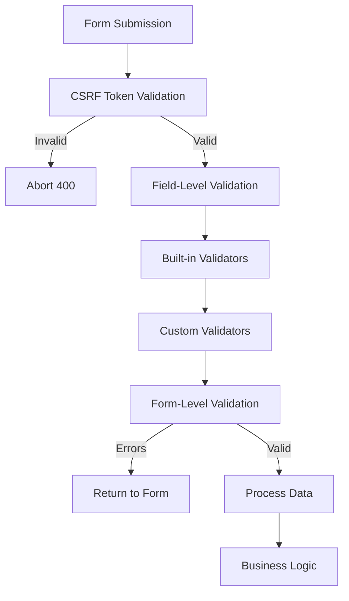
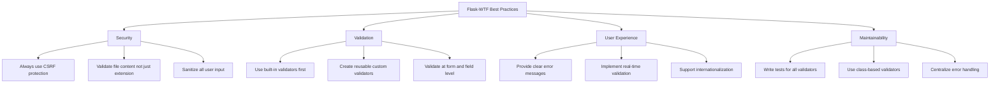

# How to Implement Validation with Flask-WTF

Author: [nawazdhandala](https://www.github.com/nawazdhandala)

Tags: Flask, Flask-WTF, Validation, Forms, Python, WTForms

Description: A comprehensive guide to implementing form validation in Flask using Flask-WTF. Learn how to create secure forms, implement built-in and custom validators, handle file uploads, and build production-ready validation workflows.

---

> Form validation is essential for building secure and user-friendly web applications. Flask-WTF combines WTForms with Flask to provide a robust, extensible validation system with built-in CSRF protection and seamless template integration.

Flask-WTF extends WTForms with Flask-specific features like CSRF protection, file upload handling, and reCAPTCHA support. This guide covers everything from basic form creation to advanced custom validators for production applications.

---

## Understanding Flask-WTF Architecture

### How Validation Flows Through Flask-WTF

Flask-WTF processes form data through multiple validation layers. Each layer serves a specific purpose in ensuring data integrity and security.



### Installation and Setup

Install Flask-WTF and its dependencies using pip:

```bash
pip install flask-wtf
```

Configure your Flask application with a secret key for CSRF protection:

```python
# app.py
from flask import Flask
from flask_wtf.csrf import CSRFProtect

app = Flask(__name__)

# Secret key is required for CSRF protection
# Use a strong, random value in production
app.config['SECRET_KEY'] = 'your-secure-secret-key-here'

# Optional: Configure additional settings
app.config['WTF_CSRF_TIME_LIMIT'] = 3600  # CSRF token expiry in seconds
app.config['WTF_CSRF_SSL_STRICT'] = True  # Enforce HTTPS for CSRF

# Initialize CSRF protection globally
csrf = CSRFProtect(app)
```

---

## Creating Your First Form

### Basic Form Structure

Forms inherit from FlaskForm and define fields with their validators. Each field represents an input element with its validation rules:

```python
# forms.py
from flask_wtf import FlaskForm
from wtforms import StringField, PasswordField, EmailField, SubmitField
from wtforms.validators import DataRequired, Email, Length, EqualTo

class RegistrationForm(FlaskForm):
    """User registration form with basic validation rules.

    Each field defines its type and a list of validators that run
    in order when the form is submitted.
    """

    # StringField creates a text input
    # DataRequired ensures the field is not empty
    # Length enforces minimum and maximum character limits
    username = StringField(
        'Username',
        validators=[
            DataRequired(message='Username is required'),
            Length(min=3, max=50, message='Username must be between 3 and 50 characters')
        ]
    )

    # EmailField creates an email input with HTML5 validation
    # Email validator checks for valid email format
    email = EmailField(
        'Email Address',
        validators=[
            DataRequired(message='Email is required'),
            Email(message='Please enter a valid email address')
        ]
    )

    # PasswordField masks input for security
    password = PasswordField(
        'Password',
        validators=[
            DataRequired(message='Password is required'),
            Length(min=8, message='Password must be at least 8 characters')
        ]
    )

    # EqualTo validates that two fields match
    confirm_password = PasswordField(
        'Confirm Password',
        validators=[
            DataRequired(message='Please confirm your password'),
            EqualTo('password', message='Passwords must match')
        ]
    )

    submit = SubmitField('Create Account')
```

### Handling Form Submissions

Process form data in your route by checking if validation passes:

```python
# routes.py
from flask import Flask, render_template, redirect, url_for, flash
from forms import RegistrationForm

app = Flask(__name__)
app.config['SECRET_KEY'] = 'your-secret-key'

@app.route('/register', methods=['GET', 'POST'])
def register():
    form = RegistrationForm()

    # validate_on_submit() checks:
    # 1. Request method is POST (or PUT/PATCH/DELETE)
    # 2. CSRF token is valid
    # 3. All field validators pass
    if form.validate_on_submit():
        # Access validated data through form.field.data
        username = form.username.data
        email = form.email.data
        password = form.password.data

        # Process the registration (save to database, etc.)
        create_user(username, email, password)

        flash('Registration successful! Please log in.', 'success')
        return redirect(url_for('login'))

    # If validation fails, form.errors contains error messages
    # These are automatically available in the template
    return render_template('register.html', form=form)
```

### Rendering Forms in Templates

Use Jinja2 to render form fields and display validation errors:

```html
<!-- templates/register.html -->



<div class="registration-form">
    <h1>Create Account</h1>

    <form method="POST" action="{{ url_for('register') }}">
        <!-- CSRF token is required for POST requests -->
        {{ form.hidden_tag() }}

        <!-- Username field with error display -->
        <div class="form-group has-error">
            {{ form.username.label }}
            {{ form.username(class='form-control', placeholder='Enter username') }}
            
                <ul class="errors">
                    
                        <li class="error-message">{{ error }}</li>
                    
                </ul>
            
        </div>

        <!-- Email field -->
        <div class="form-group has-error">
            {{ form.email.label }}
            {{ form.email(class='form-control', placeholder='your@email.com') }}
            
                <ul class="errors">
                    
                        <li class="error-message">{{ error }}</li>
                    
                </ul>
            
        </div>

        <!-- Password field -->
        <div class="form-group has-error">
            {{ form.password.label }}
            {{ form.password(class='form-control') }}
            
                <ul class="errors">
                    
                        <li class="error-message">{{ error }}</li>
                    
                </ul>
            
        </div>

        <!-- Confirm password field -->
        <div class="form-group has-error">
            {{ form.confirm_password.label }}
            {{ form.confirm_password(class='form-control') }}
            
                <ul class="errors">
                    
                        <li class="error-message">{{ error }}</li>
                    
                </ul>
            
        </div>

        {{ form.submit(class='btn btn-primary') }}
    </form>
</div>

```

---

## Built-in Validators Reference

### Essential Validators

WTForms provides a comprehensive set of validators for common validation scenarios:

```python
# forms.py
from flask_wtf import FlaskForm
from wtforms import (
    StringField, IntegerField, DecimalField,
    TextAreaField, SelectField, BooleanField
)
from wtforms.validators import (
    DataRequired,      # Field must not be empty
    InputRequired,     # Field must have input (allows 0, False)
    Email,             # Valid email format
    Length,            # String length constraints
    NumberRange,       # Numeric value range
    Optional,          # Field is optional
    Regexp,            # Match regular expression
    URL,               # Valid URL format
    AnyOf,             # Value must be in list
    NoneOf,            # Value must not be in list
    EqualTo,           # Must equal another field
    IPAddress,         # Valid IP address
    MacAddress,        # Valid MAC address
    UUID,              # Valid UUID format
)

class ProfileForm(FlaskForm):
    """Demonstrates various built-in validators."""

    # DataRequired vs InputRequired:
    # DataRequired considers 0, '', False as empty
    # InputRequired only checks if input was provided
    name = StringField('Name', validators=[
        DataRequired(message='Name is required')
    ])

    # Age must be between 18 and 120
    age = IntegerField('Age', validators=[
        Optional(),  # Field is optional
        NumberRange(min=18, max=120, message='Age must be between 18 and 120')
    ])

    # Bio with length constraints
    bio = TextAreaField('Bio', validators=[
        Optional(),
        Length(max=500, message='Bio cannot exceed 500 characters')
    ])

    # Website must be a valid URL
    website = StringField('Website', validators=[
        Optional(),
        URL(message='Please enter a valid URL')
    ])

    # Phone number with regex pattern
    phone = StringField('Phone', validators=[
        Optional(),
        Regexp(
            r'^\+?1?\d{9,15}$',
            message='Please enter a valid phone number'
        )
    ])

    # Country must be from allowed list
    country = SelectField('Country', validators=[
        DataRequired(),
        AnyOf(
            ['US', 'CA', 'UK', 'AU'],
            message='Please select a valid country'
        )
    ])

    # Username cannot be reserved
    username = StringField('Username', validators=[
        DataRequired(),
        NoneOf(
            ['admin', 'root', 'system'],
            message='This username is reserved'
        )
    ])
```

### Combining Multiple Validators

Validators run in order, so place the most important checks first:

```python
# forms.py
from wtforms import StringField
from wtforms.validators import DataRequired, Length, Regexp

class UsernameForm(FlaskForm):
    """Validators execute in the order they are defined.

    For this field:
    1. First checks if the field is not empty (DataRequired)
    2. Then validates length is between 3-20 characters
    3. Finally checks the regex pattern for allowed characters
    """
    username = StringField('Username', validators=[
        DataRequired(message='Username is required'),
        Length(
            min=3,
            max=20,
            message='Username must be between 3 and 20 characters'
        ),
        Regexp(
            r'^[a-zA-Z0-9_]+$',
            message='Username can only contain letters, numbers, and underscores'
        )
    ])
```

---

## Custom Validators

### Field-Level Custom Validators

Create validators that check a single field's value:

```python
# validators.py
from wtforms.validators import ValidationError
import re

def validate_strong_password(form, field):
    """Validate password strength with multiple criteria.

    Custom validators receive the form and field as arguments.
    Raise ValidationError to indicate validation failure.
    """
    password = field.data

    if len(password) < 8:
        raise ValidationError('Password must be at least 8 characters long')

    if not re.search(r'[A-Z]', password):
        raise ValidationError('Password must contain at least one uppercase letter')

    if not re.search(r'[a-z]', password):
        raise ValidationError('Password must contain at least one lowercase letter')

    if not re.search(r'\d', password):
        raise ValidationError('Password must contain at least one number')

    if not re.search(r'[!@#$%^&*(),.?":{}|<>]', password):
        raise ValidationError('Password must contain at least one special character')


def validate_no_profanity(form, field):
    """Check that field does not contain profanity.

    In production, use a proper profanity filter library
    like better-profanity or profanity-filter.
    """
    profanity_list = ['badword1', 'badword2']  # Use a real list
    text = field.data.lower()

    for word in profanity_list:
        if word in text:
            raise ValidationError('Please avoid using inappropriate language')


def validate_username_available(form, field):
    """Check that username is not already taken.

    This validator queries the database to ensure uniqueness.
    """
    from models import User

    existing_user = User.query.filter_by(username=field.data).first()
    if existing_user:
        raise ValidationError('This username is already taken')
```

Use custom validators in your forms:

```python
# forms.py
from flask_wtf import FlaskForm
from wtforms import StringField, PasswordField
from wtforms.validators import DataRequired
from validators import (
    validate_strong_password,
    validate_no_profanity,
    validate_username_available
)

class SecureRegistrationForm(FlaskForm):
    """Form using custom validators for enhanced validation."""

    username = StringField('Username', validators=[
        DataRequired(),
        validate_no_profanity,
        validate_username_available
    ])

    password = PasswordField('Password', validators=[
        DataRequired(),
        validate_strong_password
    ])
```

### Class-Based Custom Validators

Create reusable validators with configuration options:

```python
# validators.py
from wtforms.validators import ValidationError
import re

class StrongPassword:
    """Configurable password strength validator.

    Class-based validators allow customization through
    constructor parameters while maintaining reusability.
    """

    def __init__(
        self,
        min_length=8,
        require_uppercase=True,
        require_lowercase=True,
        require_digit=True,
        require_special=True,
        message=None
    ):
        self.min_length = min_length
        self.require_uppercase = require_uppercase
        self.require_lowercase = require_lowercase
        self.require_digit = require_digit
        self.require_special = require_special
        self.message = message

    def __call__(self, form, field):
        """Validators must be callable with form and field arguments."""
        password = field.data
        errors = []

        if len(password) < self.min_length:
            errors.append(f'at least {self.min_length} characters')

        if self.require_uppercase and not re.search(r'[A-Z]', password):
            errors.append('one uppercase letter')

        if self.require_lowercase and not re.search(r'[a-z]', password):
            errors.append('one lowercase letter')

        if self.require_digit and not re.search(r'\d', password):
            errors.append('one number')

        if self.require_special and not re.search(r'[!@#$%^&*(),.?":{}|<>]', password):
            errors.append('one special character')

        if errors:
            if self.message:
                raise ValidationError(self.message)
            raise ValidationError(f'Password must contain: {", ".join(errors)}')


class UniqueField:
    """Validate that a field value is unique in the database.

    This validator can be reused for any model and field.
    """

    def __init__(self, model, field, message=None):
        self.model = model
        self.field = field
        self.message = message or 'This value is already in use'

    def __call__(self, form, field):
        # Build dynamic query
        query_filter = {self.field: field.data}
        existing = self.model.query.filter_by(**query_filter).first()

        if existing:
            raise ValidationError(self.message)


class FileAllowed:
    """Validate file extension is in allowed list."""

    def __init__(self, extensions, message=None):
        self.extensions = [ext.lower() for ext in extensions]
        self.message = message

    def __call__(self, form, field):
        if not field.data:
            return

        filename = field.data.filename
        if '.' not in filename:
            raise ValidationError('File must have an extension')

        ext = filename.rsplit('.', 1)[1].lower()
        if ext not in self.extensions:
            if self.message:
                raise ValidationError(self.message)
            raise ValidationError(
                f'File type not allowed. Allowed types: {", ".join(self.extensions)}'
            )
```

Use class-based validators with custom configurations:

```python
# forms.py
from flask_wtf import FlaskForm
from wtforms import StringField, PasswordField
from wtforms.validators import DataRequired
from validators import StrongPassword, UniqueField
from models import User

class AdminRegistrationForm(FlaskForm):
    """Admin registration with stricter password requirements."""

    username = StringField('Username', validators=[
        DataRequired(),
        UniqueField(User, 'username', message='Username already exists')
    ])

    email = StringField('Email', validators=[
        DataRequired(),
        UniqueField(User, 'email', message='Email already registered')
    ])

    # Stricter password requirements for admin accounts
    password = PasswordField('Password', validators=[
        DataRequired(),
        StrongPassword(
            min_length=12,
            require_uppercase=True,
            require_lowercase=True,
            require_digit=True,
            require_special=True
        )
    ])


class BasicUserForm(FlaskForm):
    """Regular user with relaxed password requirements."""

    password = PasswordField('Password', validators=[
        DataRequired(),
        StrongPassword(
            min_length=8,
            require_special=False  # No special character required
        )
    ])
```

### Form-Level Validation

Validate relationships between multiple fields using the validate method:

```python
# forms.py
from flask_wtf import FlaskForm
from wtforms import StringField, DateField, IntegerField
from wtforms.validators import DataRequired, ValidationError
from datetime import date

class DateRangeForm(FlaskForm):
    """Form with cross-field validation for date ranges."""

    start_date = DateField('Start Date', validators=[DataRequired()])
    end_date = DateField('End Date', validators=[DataRequired()])

    def validate_end_date(self, field):
        """Custom validation method for end_date field.

        Methods named validate_<fieldname> are automatically called
        during validation. They can access other fields via self.
        """
        if field.data < self.start_date.data:
            raise ValidationError('End date must be after start date')

    def validate_start_date(self, field):
        """Ensure start date is not in the past."""
        if field.data < date.today():
            raise ValidationError('Start date cannot be in the past')


class PriceRangeForm(FlaskForm):
    """Form validating price relationships."""

    min_price = IntegerField('Minimum Price', validators=[DataRequired()])
    max_price = IntegerField('Maximum Price', validators=[DataRequired()])
    discount_price = IntegerField('Discount Price')

    def validate_max_price(self, field):
        """Max price must be greater than min price."""
        if field.data <= self.min_price.data:
            raise ValidationError('Maximum price must be greater than minimum price')

    def validate_discount_price(self, field):
        """Discount price must be between min and max."""
        if field.data is None:
            return

        if field.data < self.min_price.data:
            raise ValidationError('Discount price cannot be less than minimum price')

        if field.data > self.max_price.data:
            raise ValidationError('Discount price cannot exceed maximum price')


class PasswordChangeForm(FlaskForm):
    """Form for changing passwords with security checks."""

    current_password = PasswordField('Current Password', validators=[DataRequired()])
    new_password = PasswordField('New Password', validators=[DataRequired()])
    confirm_password = PasswordField('Confirm Password', validators=[DataRequired()])

    def validate_new_password(self, field):
        """New password must differ from current password."""
        if field.data == self.current_password.data:
            raise ValidationError('New password must be different from current password')

    def validate_confirm_password(self, field):
        """Confirmation must match new password."""
        if field.data != self.new_password.data:
            raise ValidationError('Passwords do not match')
```

---

## File Upload Validation

### Basic File Validation

Flask-WTF provides specialized handling for file uploads:

```python
# forms.py
from flask_wtf import FlaskForm
from flask_wtf.file import FileField, FileRequired, FileAllowed, FileSize
from wtforms import StringField
from wtforms.validators import DataRequired

class ProfilePictureForm(FlaskForm):
    """Form for uploading profile pictures with validation."""

    # FileRequired ensures a file is uploaded
    # FileAllowed restricts to specific extensions
    # FileSize limits file size (in bytes)
    picture = FileField('Profile Picture', validators=[
        FileRequired(message='Please select a file'),
        FileAllowed(
            ['jpg', 'jpeg', 'png', 'gif'],
            message='Only image files are allowed (jpg, jpeg, png, gif)'
        ),
        FileSize(
            max_size=5 * 1024 * 1024,  # 5 MB
            message='File size must be less than 5 MB'
        )
    ])


class DocumentUploadForm(FlaskForm):
    """Form for document uploads with multiple validations."""

    title = StringField('Document Title', validators=[DataRequired()])

    document = FileField('Document', validators=[
        FileRequired(),
        FileAllowed(
            ['pdf', 'doc', 'docx', 'txt'],
            message='Only document files are allowed'
        ),
        FileSize(max_size=10 * 1024 * 1024)  # 10 MB
    ])
```

Handle file uploads in your route:

```python
# routes.py
from flask import Flask, render_template, redirect, url_for, flash
from werkzeug.utils import secure_filename
import os

app = Flask(__name__)
app.config['UPLOAD_FOLDER'] = 'uploads'
app.config['MAX_CONTENT_LENGTH'] = 16 * 1024 * 1024  # 16 MB max

@app.route('/upload', methods=['GET', 'POST'])
def upload():
    form = ProfilePictureForm()

    if form.validate_on_submit():
        # Get the uploaded file
        file = form.picture.data

        # Secure the filename to prevent directory traversal attacks
        filename = secure_filename(file.filename)

        # Add unique prefix to prevent overwriting
        import uuid
        unique_filename = f"{uuid.uuid4().hex}_{filename}"

        # Save the file
        filepath = os.path.join(app.config['UPLOAD_FOLDER'], unique_filename)
        file.save(filepath)

        flash('File uploaded successfully!', 'success')
        return redirect(url_for('profile'))

    return render_template('upload.html', form=form)
```

### Advanced File Validation

Create custom validators for more complex file validation:

```python
# validators.py
from wtforms.validators import ValidationError
import magic  # python-magic library for MIME type detection

class ValidateFileContent:
    """Validate file content matches expected type.

    This validator checks the actual file content, not just the extension,
    to prevent malicious file uploads disguised with fake extensions.
    """

    ALLOWED_MIMES = {
        'image': ['image/jpeg', 'image/png', 'image/gif', 'image/webp'],
        'document': ['application/pdf', 'application/msword'],
        'video': ['video/mp4', 'video/webm', 'video/quicktime']
    }

    def __init__(self, file_type, message=None):
        self.file_type = file_type
        self.message = message

    def __call__(self, form, field):
        if not field.data:
            return

        # Read the first bytes to determine MIME type
        file_content = field.data.read(2048)
        field.data.seek(0)  # Reset file pointer

        mime = magic.from_buffer(file_content, mime=True)

        allowed = self.ALLOWED_MIMES.get(self.file_type, [])
        if mime not in allowed:
            if self.message:
                raise ValidationError(self.message)
            raise ValidationError(f'Invalid file type. Detected: {mime}')


class ValidateImageDimensions:
    """Validate image dimensions are within acceptable range."""

    def __init__(self, min_width=None, min_height=None,
                 max_width=None, max_height=None, message=None):
        self.min_width = min_width
        self.min_height = min_height
        self.max_width = max_width
        self.max_height = max_height
        self.message = message

    def __call__(self, form, field):
        if not field.data:
            return

        from PIL import Image

        try:
            image = Image.open(field.data)
            width, height = image.size
            field.data.seek(0)  # Reset file pointer
        except Exception:
            raise ValidationError('Unable to read image file')

        errors = []

        if self.min_width and width < self.min_width:
            errors.append(f'width at least {self.min_width}px')

        if self.min_height and height < self.min_height:
            errors.append(f'height at least {self.min_height}px')

        if self.max_width and width > self.max_width:
            errors.append(f'width at most {self.max_width}px')

        if self.max_height and height > self.max_height:
            errors.append(f'height at most {self.max_height}px')

        if errors:
            if self.message:
                raise ValidationError(self.message)
            raise ValidationError(f'Image must have: {", ".join(errors)}')
```

Use advanced file validators:

```python
# forms.py
from flask_wtf import FlaskForm
from flask_wtf.file import FileField, FileRequired
from validators import ValidateFileContent, ValidateImageDimensions

class AvatarForm(FlaskForm):
    """Form for avatar upload with content and dimension validation."""

    avatar = FileField('Avatar', validators=[
        FileRequired(),
        ValidateFileContent('image', message='Please upload a valid image file'),
        ValidateImageDimensions(
            min_width=100,
            min_height=100,
            max_width=2000,
            max_height=2000,
            message='Avatar must be between 100x100 and 2000x2000 pixels'
        )
    ])
```

---

## Dynamic Forms

### Adding Fields Dynamically

Create forms that adapt based on user input or configuration:

```python
# forms.py
from flask_wtf import FlaskForm
from wtforms import StringField, SelectField, FieldList, FormField
from wtforms.validators import DataRequired

class AddressForm(FlaskForm):
    """Nested form for address fields."""

    street = StringField('Street', validators=[DataRequired()])
    city = StringField('City', validators=[DataRequired()])
    state = StringField('State', validators=[DataRequired()])
    zip_code = StringField('ZIP Code', validators=[DataRequired()])

    class Meta:
        # Disable CSRF for nested forms
        csrf = False


class ContactForm(FlaskForm):
    """Form with dynamic address fields."""

    name = StringField('Name', validators=[DataRequired()])

    # FieldList allows multiple entries of the same form
    addresses = FieldList(
        FormField(AddressForm),
        min_entries=1,
        max_entries=5
    )


def create_dynamic_form(fields_config):
    """Factory function to create forms dynamically.

    This is useful when form structure is stored in a database
    or configuration file.
    """

    class DynamicForm(FlaskForm):
        pass

    # Add fields based on configuration
    for field_config in fields_config:
        field_name = field_config['name']
        field_type = field_config['type']
        required = field_config.get('required', False)

        validators = []
        if required:
            validators.append(DataRequired())

        if field_type == 'text':
            field = StringField(field_config['label'], validators=validators)
        elif field_type == 'select':
            choices = field_config.get('choices', [])
            field = SelectField(
                field_config['label'],
                choices=choices,
                validators=validators
            )
        else:
            continue

        setattr(DynamicForm, field_name, field)

    return DynamicForm
```

Use dynamic forms in routes:

```python
# routes.py
@app.route('/survey/<int:survey_id>', methods=['GET', 'POST'])
def survey(survey_id):
    # Load survey configuration from database
    survey = Survey.query.get_or_404(survey_id)
    fields_config = survey.get_fields_config()

    # Create form dynamically
    SurveyForm = create_dynamic_form(fields_config)
    form = SurveyForm()

    if form.validate_on_submit():
        # Process responses
        responses = {
            field.name: field.data
            for field in form
            if field.name != 'csrf_token'
        }
        save_survey_responses(survey_id, responses)
        flash('Survey submitted successfully!', 'success')
        return redirect(url_for('thank_you'))

    return render_template('survey.html', form=form, survey=survey)
```

---

## AJAX Form Validation

### Client-Side Validation with AJAX

Implement real-time validation without page reloads:

```python
# routes.py
from flask import Flask, jsonify, request
from forms import RegistrationForm

@app.route('/api/validate/username', methods=['POST'])
def validate_username():
    """API endpoint for real-time username validation."""
    username = request.json.get('username', '')

    # Create a partial form for validation
    form = RegistrationForm(data={'username': username})

    # Validate only the username field
    form.username.validate(form)

    if form.username.errors:
        return jsonify({
            'valid': False,
            'errors': form.username.errors
        })

    return jsonify({'valid': True})


@app.route('/api/validate/email', methods=['POST'])
def validate_email():
    """API endpoint for real-time email validation."""
    email = request.json.get('email', '')

    form = RegistrationForm(data={'email': email})
    form.email.validate(form)

    if form.email.errors:
        return jsonify({
            'valid': False,
            'errors': form.email.errors
        })

    return jsonify({'valid': True})


@app.route('/api/validate/form', methods=['POST'])
def validate_full_form():
    """Validate entire form via AJAX and return all errors."""
    form = RegistrationForm(data=request.json)

    if form.validate():
        return jsonify({'valid': True})

    # Return all errors organized by field
    errors = {}
    for field_name, field_errors in form.errors.items():
        errors[field_name] = field_errors

    return jsonify({
        'valid': False,
        'errors': errors
    })
```

JavaScript for client-side validation:

```html
<!-- templates/register.html -->
<script>
// Debounce function to limit API calls
function debounce(func, wait) {
    let timeout;
    return function executedFunction(...args) {
        const later = () => {
            clearTimeout(timeout);
            func(...args);
        };
        clearTimeout(timeout);
        timeout = setTimeout(later, wait);
    };
}

// Validate field on blur or input
async function validateField(fieldName, value) {
    const response = await fetch(`/api/validate/${fieldName}`, {
        method: 'POST',
        headers: {
            'Content-Type': 'application/json',
            'X-CSRFToken': document.querySelector('[name=csrf_token]').value
        },
        body: JSON.stringify({ [fieldName]: value })
    });

    const result = await response.json();
    const errorContainer = document.querySelector(`#${fieldName}-errors`);

    if (!result.valid) {
        errorContainer.innerHTML = result.errors
            .map(error => `<li class="error">${error}</li>`)
            .join('');
        errorContainer.style.display = 'block';
    } else {
        errorContainer.innerHTML = '';
        errorContainer.style.display = 'none';
    }

    return result.valid;
}

// Attach validation to form fields
document.addEventListener('DOMContentLoaded', function() {
    const usernameInput = document.querySelector('#username');
    const emailInput = document.querySelector('#email');

    // Validate on blur with debounce
    usernameInput.addEventListener(
        'blur',
        debounce(() => validateField('username', usernameInput.value), 300)
    );

    emailInput.addEventListener(
        'blur',
        debounce(() => validateField('email', emailInput.value), 300)
    );

    // Validate entire form before submit
    document.querySelector('form').addEventListener('submit', async function(e) {
        e.preventDefault();

        const formData = new FormData(this);
        const data = Object.fromEntries(formData.entries());

        const response = await fetch('/api/validate/form', {
            method: 'POST',
            headers: {
                'Content-Type': 'application/json',
                'X-CSRFToken': data.csrf_token
            },
            body: JSON.stringify(data)
        });

        const result = await response.json();

        if (result.valid) {
            // Submit the form normally
            this.submit();
        } else {
            // Display all errors
            for (const [field, errors] of Object.entries(result.errors)) {
                const errorContainer = document.querySelector(`#${field}-errors`);
                if (errorContainer) {
                    errorContainer.innerHTML = errors
                        .map(error => `<li class="error">${error}</li>`)
                        .join('');
                    errorContainer.style.display = 'block';
                }
            }
        }
    });
});
</script>
```

---

## Internationalization

### Translating Validation Messages

Support multiple languages for validation messages:

```python
# translations.py
VALIDATION_MESSAGES = {
    'en': {
        'required': 'This field is required',
        'email': 'Please enter a valid email address',
        'min_length': 'Must be at least {min} characters',
        'max_length': 'Must be no more than {max} characters',
        'password_weak': 'Password is too weak',
    },
    'es': {
        'required': 'Este campo es obligatorio',
        'email': 'Por favor ingrese un correo valido',
        'min_length': 'Debe tener al menos {min} caracteres',
        'max_length': 'No debe exceder {max} caracteres',
        'password_weak': 'La contrasena es muy debil',
    },
    'fr': {
        'required': 'Ce champ est requis',
        'email': 'Veuillez entrer une adresse email valide',
        'min_length': 'Doit contenir au moins {min} caracteres',
        'max_length': 'Ne doit pas depasser {max} caracteres',
        'password_weak': 'Le mot de passe est trop faible',
    }
}

def get_message(key, lang='en', **kwargs):
    """Get translated message with variable substitution."""
    messages = VALIDATION_MESSAGES.get(lang, VALIDATION_MESSAGES['en'])
    message = messages.get(key, VALIDATION_MESSAGES['en'].get(key, key))
    return message.format(**kwargs)
```

Create language-aware forms:

```python
# forms.py
from flask import request, session
from flask_wtf import FlaskForm
from wtforms import StringField, PasswordField
from wtforms.validators import DataRequired, Email, Length
from translations import get_message

def get_current_language():
    """Get current language from session or request."""
    return session.get('language', request.accept_languages.best_match(['en', 'es', 'fr']))

class LocalizedForm(FlaskForm):
    """Base form with localized validation messages."""

    @classmethod
    def create_localized(cls):
        """Factory method to create form with localized messages."""
        lang = get_current_language()

        class LocalizedFormInstance(cls):
            pass

        # Update field validators with localized messages
        for field_name in dir(LocalizedFormInstance):
            field = getattr(LocalizedFormInstance, field_name, None)
            if hasattr(field, 'validators'):
                for validator in field.validators:
                    if hasattr(validator, 'message'):
                        # Map validator type to translation key
                        if isinstance(validator, DataRequired):
                            validator.message = get_message('required', lang)
                        elif isinstance(validator, Email):
                            validator.message = get_message('email', lang)

        return LocalizedFormInstance()


class LoginForm(LocalizedForm):
    """Login form with localizable messages."""

    email = StringField('Email', validators=[
        DataRequired(),
        Email()
    ])

    password = PasswordField('Password', validators=[
        DataRequired()
    ])
```

---

## Error Handling Strategies

### Centralized Error Processing

Create a unified approach to handling validation errors:

```python
# error_handlers.py
from flask import jsonify, render_template, request

def format_validation_errors(form):
    """Format form errors for consistent API responses."""
    errors = {}

    for field_name, field_errors in form.errors.items():
        # Get the field label for better error messages
        field = getattr(form, field_name, None)
        label = field.label.text if field else field_name

        errors[field_name] = {
            'label': label,
            'messages': field_errors
        }

    return errors


def handle_form_errors(form, template=None):
    """Handle form errors based on request type.

    Returns JSON for AJAX requests, rendered template otherwise.
    """
    if request.is_json or request.headers.get('X-Requested-With') == 'XMLHttpRequest':
        return jsonify({
            'success': False,
            'errors': format_validation_errors(form)
        }), 400

    if template:
        return render_template(template, form=form)

    return None


class FormHandler:
    """Context manager for handling form submissions."""

    def __init__(self, form, success_redirect=None, error_template=None):
        self.form = form
        self.success_redirect = success_redirect
        self.error_template = error_template
        self.success = False

    def __enter__(self):
        return self

    def __exit__(self, exc_type, exc_val, exc_tb):
        pass

    def validate(self):
        """Validate form and set success flag."""
        self.success = self.form.validate_on_submit()
        return self.success

    def get_error_response(self):
        """Get appropriate error response."""
        return handle_form_errors(self.form, self.error_template)
```

Use the error handler in routes:

```python
# routes.py
from flask import redirect, url_for, flash
from error_handlers import FormHandler

@app.route('/register', methods=['GET', 'POST'])
def register():
    form = RegistrationForm()

    with FormHandler(form, error_template='register.html') as handler:
        if handler.validate():
            # Process valid form
            create_user(form.username.data, form.email.data, form.password.data)
            flash('Registration successful!', 'success')
            return redirect(url_for('login'))

        if request.method == 'POST':
            # Handle validation errors
            error_response = handler.get_error_response()
            if error_response:
                return error_response

    return render_template('register.html', form=form)
```

---

## Testing Form Validation

### Unit Testing Validators

Write comprehensive tests for your validation logic:

```python
# tests/test_validators.py
import pytest
from forms import RegistrationForm, ProfileForm
from validators import StrongPassword, UniqueField
from wtforms import Form, StringField, PasswordField
from wtforms.validators import ValidationError

class TestStrongPasswordValidator:
    """Test cases for the StrongPassword validator."""

    def test_valid_password(self):
        """Test that valid passwords pass validation."""
        validator = StrongPassword()

        class TestForm(Form):
            password = PasswordField()

        form = TestForm(data={'password': 'SecurePass123!'})

        # Should not raise any exception
        validator(form, form.password)

    def test_password_too_short(self):
        """Test that short passwords fail validation."""
        validator = StrongPassword(min_length=8)

        class TestForm(Form):
            password = PasswordField()

        form = TestForm(data={'password': 'Short1!'})

        with pytest.raises(ValidationError) as exc_info:
            validator(form, form.password)

        assert 'at least 8 characters' in str(exc_info.value)

    def test_password_missing_uppercase(self):
        """Test that passwords without uppercase fail."""
        validator = StrongPassword(require_uppercase=True)

        class TestForm(Form):
            password = PasswordField()

        form = TestForm(data={'password': 'lowercase123!'})

        with pytest.raises(ValidationError) as exc_info:
            validator(form, form.password)

        assert 'uppercase' in str(exc_info.value)

    def test_custom_error_message(self):
        """Test that custom error messages are used."""
        validator = StrongPassword(message='Password is weak')

        class TestForm(Form):
            password = PasswordField()

        form = TestForm(data={'password': 'weak'})

        with pytest.raises(ValidationError) as exc_info:
            validator(form, form.password)

        assert 'Password is weak' in str(exc_info.value)


class TestFormValidation:
    """Integration tests for complete form validation."""

    def test_valid_registration(self, app):
        """Test successful form validation."""
        with app.test_request_context():
            form = RegistrationForm(
                data={
                    'username': 'testuser',
                    'email': 'test@example.com',
                    'password': 'SecurePass123!',
                    'confirm_password': 'SecurePass123!'
                }
            )

            # Manually validate without CSRF
            assert form.validate()

    def test_password_mismatch(self, app):
        """Test that mismatched passwords fail validation."""
        with app.test_request_context():
            form = RegistrationForm(
                data={
                    'username': 'testuser',
                    'email': 'test@example.com',
                    'password': 'SecurePass123!',
                    'confirm_password': 'DifferentPass123!'
                }
            )

            assert not form.validate()
            assert 'confirm_password' in form.errors

    def test_invalid_email(self, app):
        """Test that invalid emails fail validation."""
        with app.test_request_context():
            form = RegistrationForm(
                data={
                    'username': 'testuser',
                    'email': 'not-an-email',
                    'password': 'SecurePass123!',
                    'confirm_password': 'SecurePass123!'
                }
            )

            assert not form.validate()
            assert 'email' in form.errors


@pytest.fixture
def app():
    """Create application for testing."""
    from flask import Flask

    app = Flask(__name__)
    app.config['SECRET_KEY'] = 'test-secret'
    app.config['WTF_CSRF_ENABLED'] = False  # Disable CSRF for testing

    return app
```

### Testing with Flask Test Client

Test form submissions through HTTP requests:

```python
# tests/test_routes.py
import pytest
from app import create_app

@pytest.fixture
def client():
    """Create test client."""
    app = create_app('testing')
    app.config['WTF_CSRF_ENABLED'] = False

    with app.test_client() as client:
        yield client

class TestRegistrationRoute:
    """Test registration endpoint."""

    def test_get_registration_page(self, client):
        """Test that registration page loads."""
        response = client.get('/register')

        assert response.status_code == 200
        assert b'Create Account' in response.data

    def test_successful_registration(self, client):
        """Test successful user registration."""
        response = client.post('/register', data={
            'username': 'newuser',
            'email': 'new@example.com',
            'password': 'SecurePass123!',
            'confirm_password': 'SecurePass123!'
        }, follow_redirects=True)

        assert response.status_code == 200
        assert b'Registration successful' in response.data

    def test_duplicate_username(self, client):
        """Test that duplicate usernames are rejected."""
        # First registration
        client.post('/register', data={
            'username': 'existinguser',
            'email': 'first@example.com',
            'password': 'SecurePass123!',
            'confirm_password': 'SecurePass123!'
        })

        # Second registration with same username
        response = client.post('/register', data={
            'username': 'existinguser',
            'email': 'second@example.com',
            'password': 'SecurePass123!',
            'confirm_password': 'SecurePass123!'
        })

        assert response.status_code == 200
        assert b'already taken' in response.data

    def test_ajax_validation(self, client):
        """Test AJAX validation endpoint."""
        response = client.post(
            '/api/validate/username',
            json={'username': 'validuser'},
            content_type='application/json'
        )

        assert response.status_code == 200
        data = response.get_json()
        assert data['valid'] is True
```

---

## Best Practices Summary



### Key Takeaways

1. **Always enable CSRF protection** - Flask-WTF includes CSRF by default; never disable it in production.

2. **Layer your validators** - Combine built-in validators for common checks and custom validators for business logic.

3. **Validate on multiple levels** - Use field-level validators for individual fields and form-level validation for cross-field rules.

4. **Provide helpful error messages** - Clear, specific error messages improve user experience and reduce support requests.

5. **Test thoroughly** - Write unit tests for custom validators and integration tests for complete form workflows.

6. **Handle files carefully** - Validate file content, not just extensions, to prevent malicious uploads.

7. **Support internationalization** - Design forms with translation support from the start for global applications.

8. **Use AJAX for real-time feedback** - Implement client-side validation with server-side verification for the best user experience.

---

## Conclusion

Flask-WTF provides a powerful foundation for form validation in Flask applications. By combining WTForms' extensive validator library with Flask-specific features like CSRF protection, you can build secure, user-friendly forms that handle complex validation requirements.

The key to effective validation lies in:

- **Leveraging built-in validators** for common patterns
- **Creating reusable custom validators** for domain-specific rules
- **Implementing form-level validation** for cross-field relationships
- **Providing immediate feedback** through AJAX validation
- **Writing comprehensive tests** to ensure reliability

With these patterns and practices, you can build production-ready forms that protect your application and provide a smooth user experience.

---

*Building Flask applications with complex forms? [OneUptime](https://oneuptime.com) provides comprehensive monitoring for Python web applications, helping you track form submission errors, validation failures, and performance issues in real-time.*
