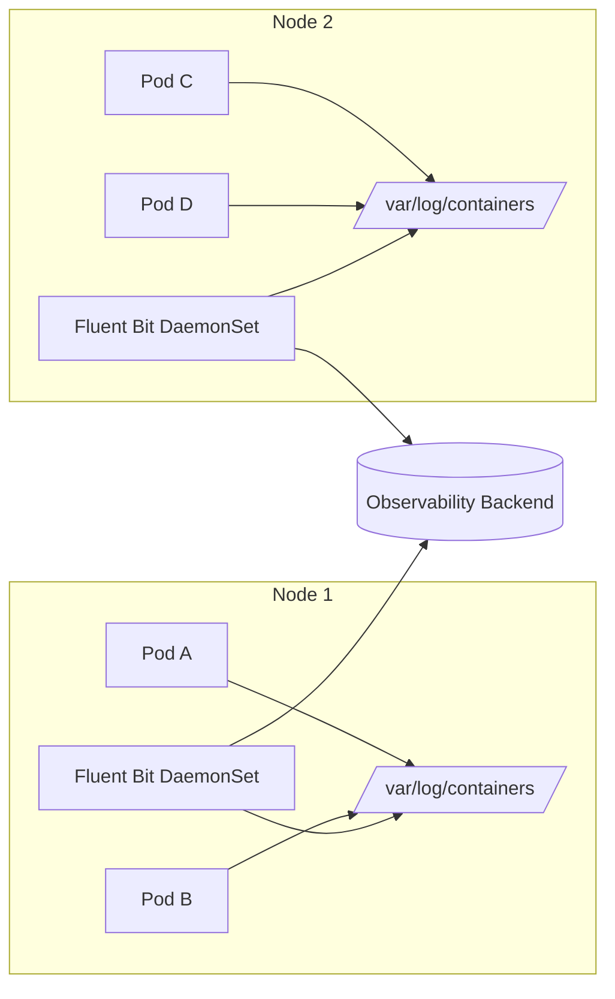

# How to Use Fluent Bit with Kubernetes

Author: [nawazdhandala](https://www.github.com/nawazdhandala)

Tags: Fluent Bit, Kubernetes, Logging, Observability, DevOps

Description: A practical guide to deploying Fluent Bit on Kubernetes for collecting, parsing, and shipping container logs to your observability backend.

---

Kubernetes generates a lot of logs. Every container, every pod, every system component writes logs somewhere. Without a proper log collection strategy, you end up SSH-ing into nodes, running `kubectl logs` commands manually, or worse, losing logs entirely when pods get evicted.

Fluent Bit solves this problem. It's a lightweight, high-performance log processor that runs as a DaemonSet on every node in your cluster, collecting logs from all containers and shipping them to your backend of choice.

This guide walks through deploying Fluent Bit on Kubernetes, configuring it to parse container logs correctly, and shipping them to an observability platform like OneUptime.

---

## Why Fluent Bit for Kubernetes?

Before diving into configuration, let's understand why Fluent Bit is a good fit for Kubernetes log collection:

| Feature | Benefit |
|---------|---------|
| Low memory footprint | ~450KB memory per instance - critical when running on every node |
| Native Kubernetes support | Built-in tail input and kubernetes filter for metadata enrichment |
| Flexible outputs | Ships to Elasticsearch, Loki, S3, HTTP endpoints, and more |
| Stream processing | Filter, parse, and transform logs before shipping |
| No external dependencies | Single binary, no JVM or runtime required |

---

## Architecture Overview

Here's how Fluent Bit fits into a Kubernetes logging architecture:



Fluent Bit runs as a DaemonSet, meaning one pod runs on each node. It tails log files from `/var/log/containers/`, enriches them with Kubernetes metadata (pod name, namespace, labels), and forwards them to your backend.

---

## Step 1: Create the Namespace and RBAC

Fluent Bit needs permission to read pod metadata from the Kubernetes API. Let's set up the namespace and RBAC rules.

Create a file named `fluent-bit-rbac.yaml`:

```yaml
# Create a dedicated namespace for logging infrastructure
# Keeping observability components isolated makes management easier
apiVersion: v1
kind: Namespace
metadata:
  name: logging
---
# ServiceAccount that Fluent Bit pods will use
# This identity is used when making requests to the K8s API
apiVersion: v1
kind: ServiceAccount
metadata:
  name: fluent-bit
  namespace: logging
---
# ClusterRole defines what permissions Fluent Bit needs
# It needs to read pods and namespaces to enrich logs with metadata
apiVersion: rbac.authorization.k8s.io/v1
kind: ClusterRole
metadata:
  name: fluent-bit-read
rules:
  - apiGroups: [""]
    resources:
      - namespaces
      - pods
    verbs: ["get", "list", "watch"]
---
# Bind the ClusterRole to the ServiceAccount
# This grants the permissions defined above to Fluent Bit
apiVersion: rbac.authorization.k8s.io/v1
kind: ClusterRoleBinding
metadata:
  name: fluent-bit-read
roleRef:
  apiGroup: rbac.authorization.k8s.io
  kind: ClusterRole
  name: fluent-bit-read
subjects:
  - kind: ServiceAccount
    name: fluent-bit
    namespace: logging
```

Apply it:

```bash
kubectl apply -f fluent-bit-rbac.yaml
```

---

## Step 2: Create the Fluent Bit Configuration

This is where the magic happens. The configuration tells Fluent Bit what to collect, how to parse it, and where to send it.

Create `fluent-bit-configmap.yaml`:

```yaml
apiVersion: v1
kind: ConfigMap
metadata:
  name: fluent-bit-config
  namespace: logging
  labels:
    app: fluent-bit
data:
  # Main Fluent Bit configuration file
  fluent-bit.conf: |
    [SERVICE]
        # Flush logs every 5 seconds to the output
        Flush         5
        # Log level for Fluent Bit itself (debug, info, warn, error)
        Log_Level     info
        # Run as a daemon in the background
        Daemon        off
        # Location of parsers configuration
        Parsers_File  parsers.conf
        # Enable HTTP server for health checks and metrics
        HTTP_Server   On
        HTTP_Listen   0.0.0.0
        HTTP_Port     2020

    # INPUT: Tail container log files
    # Kubernetes writes container logs to /var/log/containers/
    [INPUT]
        Name              tail
        # Match all container log files
        Path              /var/log/containers/*.log
        # Use the CRI parser (containerd/CRI-O format)
        Parser            cri
        # Tag logs with the filename for later routing
        Tag               kube.*
        # Remember position between restarts
        DB                /var/log/flb_kube.db
        # Start reading from the end of files on first run
        Skip_Long_Lines   On
        # Refresh file list every 10 seconds for new pods
        Refresh_Interval  10
        # Memory buffer limit per monitored file
        Mem_Buf_Limit     5MB

    # FILTER: Add Kubernetes metadata to each log record
    # This enriches logs with pod name, namespace, labels, etc.
    [FILTER]
        Name                kubernetes
        Match               kube.*
        # Path to ServiceAccount token for K8s API auth
        Kube_Token_File     /var/run/secrets/kubernetes.io/serviceaccount/token
        Kube_URL            https://kubernetes.default.svc:443
        Kube_CA_File        /var/run/secrets/kubernetes.io/serviceaccount/ca.crt
        # Merge the log field into the root of the record
        Merge_Log           On
        # Keep the original log field after merging
        Keep_Log            Off
        # Include Kubernetes labels in the record
        K8S-Logging.Parser  On
        K8S-Logging.Exclude On

    # OUTPUT: Send logs to an HTTP endpoint (like OneUptime)
    # Configure your observability backend endpoint here
    [OUTPUT]
        Name              http
        Match             *
        # Replace with your actual endpoint
        Host              ingest.oneuptime.com
        Port              443
        URI               /fluentbit/v1/logs
        Format            json
        TLS               On
        # Header for authentication
        Header            x-oneuptime-token ${ONEUPTIME_TOKEN}
        # Retry failed requests
        Retry_Limit       5

  # Parser definitions for different log formats
  parsers.conf: |
    # Parser for CRI (containerd/CRI-O) log format
    # This is the default format in modern Kubernetes clusters
    [PARSER]
        Name        cri
        Format      regex
        Regex       ^(?<time>[^ ]+) (?<stream>stdout|stderr) (?<logtag>[^ ]*) (?<log>.*)$
        Time_Key    time
        Time_Format %Y-%m-%dT%H:%M:%S.%L%z

    # Parser for Docker JSON log format
    # Use this if your cluster still uses Docker runtime
    [PARSER]
        Name        docker
        Format      json
        Time_Key    time
        Time_Format %Y-%m-%dT%H:%M:%S.%L
        Time_Keep   On

    # Parser for JSON formatted application logs
    # Use this when your apps output structured JSON
    [PARSER]
        Name        json
        Format      json
        Time_Key    time
        Time_Format %Y-%m-%dT%H:%M:%S.%L
```

Apply the ConfigMap:

```bash
kubectl apply -f fluent-bit-configmap.yaml
```

---

## Step 3: Deploy Fluent Bit as a DaemonSet

The DaemonSet ensures Fluent Bit runs on every node in your cluster.

Create `fluent-bit-daemonset.yaml`:

```yaml
apiVersion: apps/v1
kind: DaemonSet
metadata:
  name: fluent-bit
  namespace: logging
  labels:
    app: fluent-bit
spec:
  selector:
    matchLabels:
      app: fluent-bit
  template:
    metadata:
      labels:
        app: fluent-bit
    spec:
      serviceAccountName: fluent-bit
      # Tolerate all taints so Fluent Bit runs on every node
      # including control plane nodes if needed
      tolerations:
        - key: node-role.kubernetes.io/control-plane
          operator: Exists
          effect: NoSchedule
        - key: node-role.kubernetes.io/master
          operator: Exists
          effect: NoSchedule
      containers:
        - name: fluent-bit
          image: fluent/fluent-bit:2.2
          # Environment variables for configuration
          env:
            # Token for authenticating with your observability backend
            - name: ONEUPTIME_TOKEN
              valueFrom:
                secretKeyRef:
                  name: fluent-bit-secrets
                  key: oneuptime-token
          ports:
            # Health check and metrics endpoint
            - containerPort: 2020
              name: http
          # Liveness probe ensures Fluent Bit restarts if it crashes
          livenessProbe:
            httpGet:
              path: /api/v1/health
              port: 2020
            initialDelaySeconds: 10
            periodSeconds: 30
          # Readiness probe for service discovery
          readinessProbe:
            httpGet:
              path: /api/v1/health
              port: 2020
            initialDelaySeconds: 5
            periodSeconds: 10
          # Resource limits - Fluent Bit is lightweight but set bounds
          resources:
            requests:
              cpu: 50m
              memory: 64Mi
            limits:
              cpu: 200m
              memory: 256Mi
          # Mount the configuration and log directories
          volumeMounts:
            - name: config
              mountPath: /fluent-bit/etc/
            # Container logs directory
            - name: varlog
              mountPath: /var/log
              readOnly: true
            # Docker/containerd container data
            - name: varlibdockercontainers
              mountPath: /var/lib/docker/containers
              readOnly: true
      volumes:
        - name: config
          configMap:
            name: fluent-bit-config
        - name: varlog
          hostPath:
            path: /var/log
        - name: varlibdockercontainers
          hostPath:
            path: /var/lib/docker/containers
```

Before deploying, create the secret for your API token:

```bash
# Replace with your actual token
kubectl create secret generic fluent-bit-secrets \
  --namespace=logging \
  --from-literal=oneuptime-token=your-api-token-here
```

Now deploy the DaemonSet:

```bash
kubectl apply -f fluent-bit-daemonset.yaml
```

---

## Step 4: Verify the Deployment

Check that Fluent Bit pods are running on all nodes:

```bash
# List Fluent Bit pods - should show one per node
kubectl get pods -n logging -l app=fluent-bit -o wide

# Check logs from a Fluent Bit pod
kubectl logs -n logging -l app=fluent-bit --tail=50

# Verify the health endpoint
kubectl port-forward -n logging daemonset/fluent-bit 2020:2020 &
curl http://localhost:2020/api/v1/health
```

You should see output like:

```
NAME               READY   STATUS    RESTARTS   NODE
fluent-bit-abc12   1/1     Running   0          node-1
fluent-bit-def34   1/1     Running   0          node-2
fluent-bit-ghi56   1/1     Running   0          node-3
```

---

## Filtering and Excluding Logs

Not all logs are worth shipping. System noise, health checks, and debug output can overwhelm your backend. Add filters to exclude unwanted logs.

Add this to your ConfigMap under the kubernetes filter:

```yaml
# Exclude logs from specific namespaces
# Useful for noisy system namespaces
[FILTER]
    Name     grep
    Match    kube.*
    Exclude  $kubernetes['namespace_name'] kube-system

# Exclude health check spam from ingress controllers
[FILTER]
    Name     grep
    Match    kube.*
    Exclude  log health

# Only keep logs with level error or warning (optional)
# Uncomment if you want to reduce volume significantly
# [FILTER]
#     Name     grep
#     Match    kube.*
#     Regex    level (error|warn|fatal)
```

---

## Parsing Application-Specific Log Formats

If your applications output structured JSON logs, configure Fluent Bit to parse them properly.

Add a parser for your application logs:

```yaml
# Parser for custom application JSON format
[PARSER]
    Name        myapp_json
    Format      json
    Time_Key    timestamp
    Time_Format %Y-%m-%dT%H:%M:%S.%LZ
```

Then add a filter to apply it to specific pods using annotations. In your application deployment, add:

```yaml
apiVersion: apps/v1
kind: Deployment
metadata:
  name: my-application
spec:
  template:
    metadata:
      annotations:
        # Tell Fluent Bit to use the myapp_json parser for this pod
        fluentbit.io/parser: myapp_json
```

---

## Monitoring Fluent Bit Itself

Fluent Bit exposes Prometheus metrics that you should monitor:

```bash
# Get metrics from Fluent Bit
curl http://localhost:2020/api/v1/metrics/prometheus
```

Key metrics to watch:

| Metric | Description |
|--------|-------------|
| `fluentbit_input_records_total` | Total records received |
| `fluentbit_output_retries_total` | Failed output attempts |
| `fluentbit_output_errors_total` | Output errors (check backend connectivity) |
| `fluentbit_filter_records_total` | Records processed by filters |

---

## Common Issues and Troubleshooting

### Logs not appearing in backend

Check the Fluent Bit logs for errors:

```bash
kubectl logs -n logging -l app=fluent-bit | grep -i error
```

Common causes:
- Wrong API token or endpoint URL
- Network policy blocking egress
- TLS certificate issues

### High memory usage

If Fluent Bit is using too much memory, reduce the buffer size:

```yaml
[INPUT]
    Name              tail
    Mem_Buf_Limit     2MB  # Reduce from 5MB
```

### Missing Kubernetes metadata

Ensure the ServiceAccount has correct permissions:

```bash
kubectl auth can-i get pods --as=system:serviceaccount:logging:fluent-bit
```

---

## Production Checklist

Before going to production, verify:

- [ ] RBAC permissions are correctly configured
- [ ] Secret for API token is created and referenced
- [ ] Resource limits are set appropriately for your cluster size
- [ ] Log exclusion filters are configured to reduce noise
- [ ] Health checks and liveness probes are working
- [ ] Prometheus metrics are being scraped
- [ ] Fluent Bit logs are not filling up node disk (check log rotation)

---

## Wrapping Up

Fluent Bit is a solid choice for Kubernetes log collection. It's lightweight, flexible, and handles the complexity of enriching logs with Kubernetes metadata automatically.

The key points to remember:

1. Deploy as a DaemonSet to collect from all nodes
2. Use the kubernetes filter to enrich logs with pod metadata
3. Configure parsers that match your log format (CRI for modern clusters)
4. Filter out noisy logs before shipping to save costs
5. Monitor Fluent Bit itself using its built-in metrics endpoint

---

*Looking for a complete observability solution that works seamlessly with Fluent Bit? [OneUptime](https://oneuptime.com) provides native support for Fluent Bit logs along with metrics, traces, and alerting - all in one platform.*
