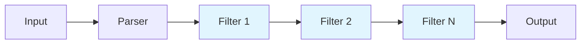
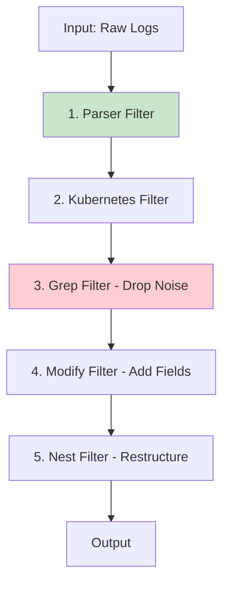

# How to Use Fluent Bit Filters

Author: [nawazdhandala](https://www.github.com/nawazdhandala)

Tags: Fluent Bit, Logging, Observability, DevOps, Log Processing, Kubernetes, OpenTelemetry

Description: A hands-on guide to using Fluent Bit filters for log transformation, enrichment, and routing. Learn how to modify, parse, and filter log data before sending it to your observability backend.

---

Fluent Bit processes millions of log events per second in production environments worldwide. Raw logs, however, rarely arrive in the format your observability platform expects. Filters sit between inputs and outputs, transforming data on the fly without modifying your applications.

## Understanding the Fluent Bit Pipeline

Before diving into filters, you need to understand where they fit in the processing pipeline.



Each log record flows through this pipeline sequentially. Filters can:
- Modify existing fields
- Add new fields
- Remove unwanted fields
- Drop entire records
- Route records to different outputs

## Basic Configuration Structure

Fluent Bit uses either classic INI format or YAML. Here's the basic structure for both.

The following configuration demonstrates the classic INI format with an input, filter, and output section.

```ini
[SERVICE]
    flush        1
    log_level    info

[INPUT]
    name         tail
    path         /var/log/app/*.log
    tag          app.*

[FILTER]
    name         modify
    match        app.*
    add          environment production

[OUTPUT]
    name         stdout
    match        *
```

The YAML equivalent offers better readability for complex configurations.

```yaml
service:
  flush: 1
  log_level: info

pipeline:
  inputs:
    - name: tail
      path: /var/log/app/*.log
      tag: app.*

  filters:
    - name: modify
      match: app.*
      add: environment production

  outputs:
    - name: stdout
      match: "*"
```

## The Modify Filter: Your Swiss Army Knife

The modify filter handles the most common transformations. You'll use it constantly for field manipulation.

### Adding and Renaming Fields

Adding metadata to logs helps with debugging and correlation. The following configuration adds environment information and renames the default host field.

```ini
[FILTER]
    name         modify
    match        *
    # Add static fields for environment context
    add          datacenter us-east-1
    add          team platform

    # Rename fields to match your schema
    rename       host hostname
    rename       log message

    # Copy a field while preserving the original
    copy         kubernetes.pod_name pod
```

### Conditional Field Operations

Only modify records that match certain conditions. The following filter adds a priority field only when the log level indicates an error.

```ini
[FILTER]
    name         modify
    match        app.*
    # Add high priority flag only for error logs
    condition    key_value_equals level error
    add          priority high
```

### Removing Sensitive Data

Production logs often contain data that shouldn't reach your logging backend. Remove sensitive fields before transmission.

```ini
[FILTER]
    name         modify
    match        *
    # Remove fields containing sensitive information
    remove       password
    remove       api_key
    remove       authorization
    remove       credit_card

    # Remove fields matching a pattern
    remove_wildcard secret_*
    remove_regex  .*token.*
```

## The Record Modifier Filter

When you need to add Kubernetes-style metadata or structured information, record_modifier provides cleaner syntax than modify.

The following configuration enriches every log with service identification fields.

```ini
[FILTER]
    name         record_modifier
    match        *
    # Add multiple fields with service context
    record       service_name myapp
    record       service_version 2.1.0
    record       service_instance ${HOSTNAME}

    # Remove specific fields
    remove_key   internal_debug

    # Whitelist only specific fields (drops everything else)
    # whitelist_key timestamp
    # whitelist_key message
    # whitelist_key level
```

### Using Environment Variables

Inject runtime configuration without hardcoding values.

```ini
[FILTER]
    name         record_modifier
    match        *
    # Reference environment variables for dynamic values
    record       cluster_name ${CLUSTER_NAME}
    record       namespace ${POD_NAMESPACE}
    record       deployment_sha ${GIT_SHA}
```

## The Grep Filter: Include and Exclude Records

Grep filters drop entire records based on field values. Use them to reduce noise and control log volume.

### Keep Only Error Logs

Reduce storage costs by keeping only important logs. The following filter drops everything except errors and warnings.

```ini
[FILTER]
    name         grep
    match        app.*
    # Keep only records where level matches error or warn
    regex        level (error|warn|fatal|critical)
```

### Exclude Health Check Noise

Health checks generate massive log volume with zero debugging value. Drop them early in the pipeline.

```ini
[FILTER]
    name         grep
    match        nginx.*
    # Exclude health check endpoints
    exclude      path ^/health
    exclude      path ^/ready
    exclude      path ^/live
```

### Complex Filtering with Multiple Conditions

Chain grep filters for AND logic. Each filter processes records that passed the previous one.

```ini
# First filter: only production traffic
[FILTER]
    name         grep
    match        api.*
    regex        environment production

# Second filter: exclude internal requests
[FILTER]
    name         grep
    match        api.*
    exclude      user_agent ^InternalHealthChecker
```

## The Parser Filter: Structure Unstructured Logs

Many applications emit unstructured text logs. The parser filter extracts fields from these messages.

### Define Custom Parsers

First, create parser definitions in your parsers configuration file.

```ini
# parsers.conf - Parser definitions for common log formats

[PARSER]
    name         app_log
    format       regex
    regex        ^(?<timestamp>[^ ]+) \[(?<level>[^\]]+)\] (?<logger>[^:]+): (?<message>.*)$
    time_key     timestamp
    time_format  %Y-%m-%dT%H:%M:%S.%L

[PARSER]
    name         nginx_access
    format       regex
    regex        ^(?<remote_addr>[^ ]+) - (?<remote_user>[^ ]+) \[(?<time_local>[^\]]+)\] "(?<request>[^"]+)" (?<status>\d+) (?<body_bytes_sent>\d+) "(?<http_referer>[^"]*)" "(?<http_user_agent>[^"]*)"
    time_key     time_local
    time_format  %d/%b/%Y:%H:%M:%S %z

[PARSER]
    name         json_docker
    format       json
    time_key     time
    time_format  %Y-%m-%dT%H:%M:%S.%L
```

### Apply Parsers to Log Streams

Reference your parsers in the filter configuration.

```ini
[FILTER]
    name         parser
    match        app.*
    key_name     log
    parser       app_log
    # Preserve original log field alongside parsed fields
    preserve_key on
    reserve_data on
```

### Handling Multiple Log Formats

When a single stream contains different formats, try multiple parsers.

```ini
[FILTER]
    name         parser
    match        mixed.*
    key_name     message
    # Try parsers in order until one succeeds
    parser       json_docker
    parser       app_log
    parser       syslog
    reserve_data on
```

## The Nest Filter: Restructure JSON

Nest allows you to group fields under a parent key or flatten nested structures.

### Group Related Fields

Bundle Kubernetes metadata under a single parent for cleaner log structure.

```ini
[FILTER]
    name         nest
    match        kube.*
    operation    nest
    wildcard     kubernetes.*
    nest_under   k8s
    remove_prefix kubernetes.
```

Before transformation:
```json
{
  "message": "Request processed",
  "kubernetes.pod_name": "api-7d9f8b6c5d-x2k4m",
  "kubernetes.namespace": "production",
  "kubernetes.container_name": "api"
}
```

After transformation:
```json
{
  "message": "Request processed",
  "k8s": {
    "pod_name": "api-7d9f8b6c5d-x2k4m",
    "namespace": "production",
    "container_name": "api"
  }
}
```

### Flatten Nested Structures

Some backends prefer flat key structures. Lift nested fields to the root level.

```ini
[FILTER]
    name         nest
    match        app.*
    operation    lift
    nested_under metadata
    add_prefix   meta_
```

## The Lua Filter: Custom Processing Logic

When built-in filters aren't enough, Lua scripts provide unlimited flexibility.

### Basic Lua Filter

Create a Lua script file with your transformation logic.

```lua
-- /fluent-bit/scripts/transform.lua
-- Custom transformation function for log enrichment

function enrich_log(tag, timestamp, record)
    -- Add processing timestamp
    record["processed_at"] = os.date("!%Y-%m-%dT%H:%M:%SZ")

    -- Normalize log levels to uppercase
    if record["level"] then
        record["level"] = string.upper(record["level"])
    end

    -- Calculate message length for analysis
    if record["message"] then
        record["message_length"] = string.len(record["message"])
    end

    -- Return code 2 means record was modified
    return 2, timestamp, record
end
```

Reference the script in your filter configuration.

```ini
[FILTER]
    name         lua
    match        *
    script       /fluent-bit/scripts/transform.lua
    call         enrich_log
```

### Advanced Lua: Conditional Routing

Use Lua to implement complex routing logic that modifies tags.

```lua
-- /fluent-bit/scripts/router.lua
-- Route logs to different outputs based on content

function route_by_severity(tag, timestamp, record)
    local level = record["level"] or "info"
    level = string.lower(level)

    -- Critical errors go to PagerDuty stream
    if level == "fatal" or level == "critical" then
        return 1, timestamp, record, "alerts.critical"
    end

    -- Errors go to error stream for faster indexing
    if level == "error" then
        return 1, timestamp, record, "alerts.error"
    end

    -- Everything else goes to standard stream
    return 1, timestamp, record, "logs.standard"
end
```

### Lua for Data Masking

Protect sensitive data with pattern-based masking.

```lua
-- /fluent-bit/scripts/mask.lua
-- Mask sensitive data patterns in log messages

function mask_sensitive(tag, timestamp, record)
    if record["message"] then
        local msg = record["message"]

        -- Mask credit card numbers (basic pattern)
        msg = string.gsub(msg, "%d%d%d%d%-%d%d%d%d%-%d%d%d%d%-%d%d%d%d", "****-****-****-****")

        -- Mask email addresses
        msg = string.gsub(msg, "[%w%.%-]+@[%w%.%-]+%.%w+", "***@***.***")

        -- Mask IP addresses
        msg = string.gsub(msg, "%d+%.%d+%.%d+%.%d+", "*.*.*.*")

        record["message"] = msg
    end

    return 2, timestamp, record
end
```

## The Kubernetes Filter

Running Fluent Bit in Kubernetes? The kubernetes filter automatically enriches logs with pod metadata.

```ini
[FILTER]
    name                kubernetes
    match               kube.*
    # API server endpoint
    kube_url            https://kubernetes.default.svc:443
    kube_ca_file        /var/run/secrets/kubernetes.io/serviceaccount/ca.crt
    kube_token_file     /var/run/secrets/kubernetes.io/serviceaccount/token

    # Metadata enrichment options
    merge_log           on
    merge_log_trim      on
    keep_log            off

    # Include additional metadata
    k8s-logging.parser  on
    k8s-logging.exclude off

    # Labels and annotations to include
    labels              on
    annotations         off
```

The filter adds rich context to every log.

```json
{
  "message": "Connection established",
  "kubernetes": {
    "pod_name": "api-deployment-7d9f8b6c5d-x2k4m",
    "namespace_name": "production",
    "pod_id": "abc123-def456",
    "labels": {
      "app": "api",
      "version": "2.1.0"
    },
    "host": "worker-node-03",
    "container_name": "api",
    "container_image": "myregistry/api:2.1.0"
  }
}
```

## Filter Ordering and Performance

Filter order significantly impacts both functionality and performance.



### Performance Best Practices

1. **Filter early, filter often**: Drop unwanted records with grep before expensive transformations
2. **Parse once**: Apply parser filters early, then work with structured data
3. **Minimize Lua usage**: Native filters outperform Lua by 10-100x
4. **Batch operations**: Group related modifications in a single modify filter

The following configuration demonstrates optimal filter ordering.

```ini
# STEP 1: Parse raw logs into structured format (do this first)
[FILTER]
    name         parser
    match        app.*
    key_name     log
    parser       json

# STEP 2: Drop unwanted records early (reduces processing for later filters)
[FILTER]
    name         grep
    match        app.*
    exclude      path ^/health
    exclude      level debug

# STEP 3: Add Kubernetes metadata
[FILTER]
    name         kubernetes
    match        app.*
    merge_log    on

# STEP 4: Enrich with static fields
[FILTER]
    name         modify
    match        app.*
    add          datacenter us-east-1
    remove       kubernetes.pod_id
    remove       kubernetes.docker_id

# STEP 5: Final restructuring
[FILTER]
    name         nest
    match        app.*
    operation    nest
    wildcard     kubernetes.*
    nest_under   k8s
```

## Complete Production Example

Here's a production-ready configuration combining multiple filters for a Kubernetes environment.

```ini
# fluent-bit.conf - Production configuration for Kubernetes logging

[SERVICE]
    flush         5
    daemon        off
    log_level     info
    parsers_file  parsers.conf
    http_server   on
    http_listen   0.0.0.0
    http_port     2020

# Collect container logs from Kubernetes
[INPUT]
    name              tail
    path              /var/log/containers/*.log
    exclude_path      /var/log/containers/*fluent-bit*.log
    parser            docker
    tag               kube.*
    refresh_interval  5
    mem_buf_limit     50MB
    skip_long_lines   on

# Parse JSON logs if present
[FILTER]
    name         parser
    match        kube.*
    key_name     log
    parser       json
    reserve_data on

# Enrich with Kubernetes metadata
[FILTER]
    name                kubernetes
    match               kube.*
    kube_url            https://kubernetes.default.svc:443
    kube_ca_file        /var/run/secrets/kubernetes.io/serviceaccount/ca.crt
    kube_token_file     /var/run/secrets/kubernetes.io/serviceaccount/token
    merge_log           on
    keep_log            off
    labels              on
    annotations         off

# Drop health check logs (high volume, low value)
[FILTER]
    name         grep
    match        kube.*
    exclude      log ^GET /health
    exclude      log ^GET /ready
    exclude      log ^GET /metrics

# Drop debug logs in production
[FILTER]
    name         grep
    match        kube.*
    exclude      level debug
    exclude      level trace

# Remove sensitive fields
[FILTER]
    name         modify
    match        kube.*
    remove       kubernetes.pod_id
    remove       kubernetes.docker_id
    remove_wildcard password*
    remove_regex .*secret.*

# Add environment metadata
[FILTER]
    name         record_modifier
    match        kube.*
    record       cluster_name ${CLUSTER_NAME}
    record       environment production

# Restructure for cleaner output
[FILTER]
    name         nest
    match        kube.*
    operation    nest
    wildcard     kubernetes.*
    nest_under   k8s
    remove_prefix kubernetes.

# Send to OpenTelemetry collector
[OUTPUT]
    name         opentelemetry
    match        kube.*
    host         otel-collector.monitoring.svc
    port         4318
    logs_uri     /v1/logs
    tls          off
    tls.verify   off

# Also send errors to a separate stream for alerting
[OUTPUT]
    name         http
    match        kube.*
    host         alerts.internal
    port         8080
    uri          /api/v1/logs
    format       json
    json_date_key timestamp
    json_date_format iso8601
```

## Debugging Filter Issues

When filters don't behave as expected, use these techniques.

### Enable Debug Output

Temporarily output to stdout to see transformation results.

```ini
[OUTPUT]
    name         stdout
    match        *
    format       json_lines
```

### Check Filter Statistics

Fluent Bit exposes metrics about filter processing.

```bash
# Query the built-in metrics endpoint
curl http://localhost:2020/api/v1/metrics

# Look for filter-specific metrics
curl http://localhost:2020/api/v1/metrics | grep filter
```

### Common Problems and Solutions

**Records not matching filters**
- Verify tag patterns match your input tags
- Use `*` temporarily to match everything during debugging

**Parser filter not extracting fields**
- Test regex patterns at regex101.com
- Verify `key_name` points to the correct field

**Lua filter errors**
- Check Fluent Bit logs for Lua stack traces
- Add debug print statements: `print("Debug: " .. record["field"])`

---

Filters transform Fluent Bit from a simple log forwarder into a powerful stream processor. Start with basic modify and grep filters, then add complexity as needed. Your observability pipeline will thank you when logs arrive clean, structured, and enriched with context.
