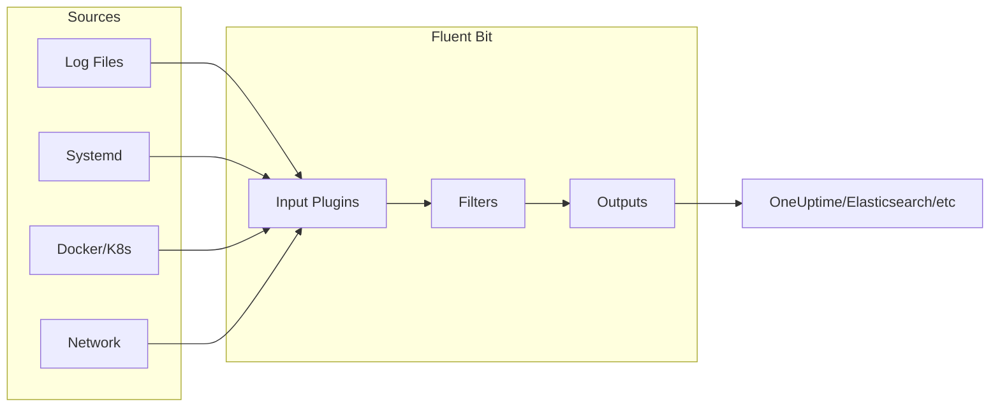
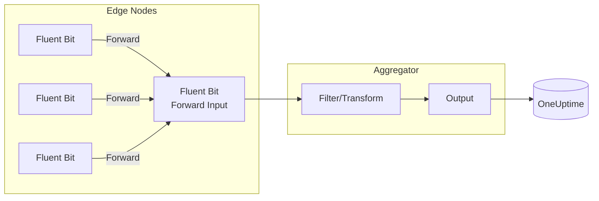
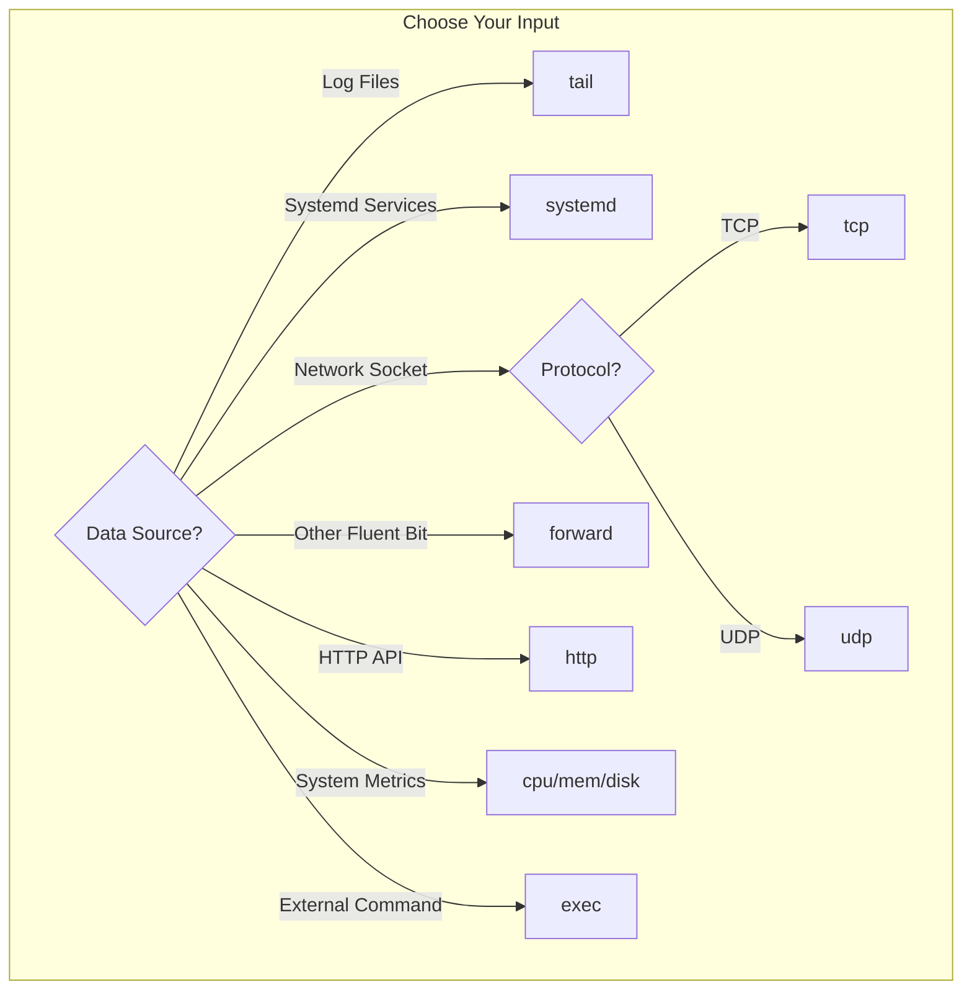

# How to Configure Fluent Bit Inputs

Author: [nawazdhandala](https://www.github.com/nawazdhandala)

Tags: Fluent Bit, Log Collection, Observability, DevOps, Kubernetes, Monitoring, Logging

Description: A comprehensive guide to configuring Fluent Bit input plugins for collecting logs, metrics, and events from various sources. Learn how to set up tail, systemd, forward, and other inputs for production logging pipelines.

---

> Efficient log collection starts at the source. Fluent Bit input plugins determine what data enters your observability pipeline. Proper configuration of these inputs can mean the difference between actionable insights and a flood of useless data.

Log aggregation tools are only as good as the data they receive. Fluent Bit's lightweight architecture makes it ideal for collecting logs from containers, files, system services, and network sources without overwhelming your infrastructure.

---

## Overview

Fluent Bit uses a plugin-based architecture where inputs collect data, filters transform it, and outputs send it to destinations. Input plugins are the entry point for all data.



---

## Installation

Fluent Bit can be installed on most Linux distributions, macOS, and Windows. Here are the common installation methods.

Installing Fluent Bit on Ubuntu/Debian systems requires adding the official repository and installing the package.

```bash
# Add the Fluent Bit GPG key
curl https://raw.githubusercontent.com/fluent/fluent-bit/master/install.sh | sh

# Alternative: Install from package repository
curl https://packages.fluentbit.io/fluentbit.key | sudo apt-key add -
echo "deb https://packages.fluentbit.io/ubuntu/focal focal main" | sudo tee /etc/apt/sources.list.d/fluentbit.list
sudo apt update && sudo apt install fluent-bit
```

For container deployments, the official Docker image provides a ready-to-use Fluent Bit instance.

```bash
# Pull the official Fluent Bit image
docker pull fluent/fluent-bit:latest

# Run with a custom configuration
docker run -v /path/to/fluent-bit.conf:/fluent-bit/etc/fluent-bit.conf fluent/fluent-bit:latest
```

---

## Configuration File Structure

Fluent Bit uses a configuration file that defines inputs, filters, and outputs. Understanding the structure is essential before diving into specific inputs.

The configuration file follows an INI-style format with section headers and key-value pairs.

```ini
# fluent-bit.conf
# Main Fluent Bit configuration file

# Service section configures the Fluent Bit daemon itself
[SERVICE]
    # Flush interval in seconds - how often to send data to outputs
    Flush           5

    # Enable daemon mode for production (runs in background)
    Daemon          Off

    # Log level: error, warning, info, debug, trace
    Log_Level       info

    # Enable built-in HTTP server for health checks and metrics
    HTTP_Server     On
    HTTP_Listen     0.0.0.0
    HTTP_Port       2020

    # Parsers file contains format definitions for log parsing
    Parsers_File    parsers.conf

# Input section - defines data sources (covered in detail below)
[INPUT]
    Name            tail
    Path            /var/log/*.log

# Filter section - transforms data in the pipeline
[FILTER]
    Name            modify
    Match           *
    Add             hostname ${HOSTNAME}

# Output section - destinations for processed data
[OUTPUT]
    Name            stdout
    Match           *
```

---

## Tail Input (Log Files)

The tail input is the most commonly used input plugin. It reads log files similar to the `tail -f` command, tracking file position and handling log rotation.

### Basic Tail Configuration

Reading a single log file with tail is straightforward. Fluent Bit tracks the read position in a database file to resume correctly after restarts.

```ini
# fluent-bit.conf
# Basic tail input for reading application logs

[INPUT]
    # Use the tail input plugin
    Name              tail

    # Unique tag for routing logs through filters and outputs
    Tag               app.logs

    # Path to the log file (supports wildcards)
    Path              /var/log/myapp/application.log

    # Database file stores the current read position
    # Prevents re-reading logs after Fluent Bit restarts
    DB                /var/lib/fluent-bit/app-logs.db

    # How often to check for new data (in seconds)
    Refresh_Interval  10
```

### Multi-File Tail with Wildcards

Production applications often write to multiple log files. Wildcards allow collecting from all matching files while maintaining separate position tracking for each.

```ini
# fluent-bit.conf
# Tail multiple log files using wildcard patterns

[INPUT]
    Name              tail
    Tag               nginx.access

    # Wildcard pattern matches all .log files in the directory
    Path              /var/log/nginx/*.log

    # Exclude error logs - handle them separately with different parsing
    Exclude_Path      /var/log/nginx/error.log

    # Position database for all matched files
    DB                /var/lib/fluent-bit/nginx-access.db

    # Enable multiline logging for stack traces
    Multiline         On
    Parser_Firstline  nginx_access

[INPUT]
    Name              tail
    Tag               nginx.error
    Path              /var/log/nginx/error.log
    DB                /var/lib/fluent-bit/nginx-error.db

    # Different parser for error log format
    Parser            nginx_error
```

### Tail with Parsing

Raw log lines are difficult to query. Parsers extract structured fields from log messages, enabling powerful filtering and searching.

```ini
# fluent-bit.conf
# Parse JSON application logs automatically

[INPUT]
    Name              tail
    Tag               api.logs
    Path              /var/log/api/service.log
    DB                /var/lib/fluent-bit/api.db

    # Apply JSON parser to each log line
    # Extracts all JSON fields as separate record fields
    Parser            json

    # Read from the end of the file on first run
    # Prevents processing historical logs on initial deployment
    Read_from_Head    Off

    # Skip lines longer than this (bytes) to prevent memory issues
    Buffer_Max_Size   64k

[INPUT]
    Name              tail
    Tag               apache.access
    Path              /var/log/apache2/access.log
    DB                /var/lib/fluent-bit/apache.db

    # Use Apache combined log format parser
    Parser            apache2
```

The parsers referenced above are defined in a separate parsers file.

```ini
# parsers.conf
# Parser definitions for common log formats

# JSON parser for structured application logs
[PARSER]
    Name        json
    Format      json
    Time_Key    timestamp
    Time_Format %Y-%m-%dT%H:%M:%S.%L

# Apache combined log format parser
[PARSER]
    Name        apache2
    Format      regex
    Regex       ^(?<host>[^ ]*) [^ ]* (?<user>[^ ]*) \[(?<time>[^\]]*)\] "(?<method>\S+)(?: +(?<path>[^\"]*?)(?: +\S*)?)?" (?<code>[^ ]*) (?<size>[^ ]*)(?: "(?<referer>[^\"]*)" "(?<agent>[^\"]*)")?$
    Time_Key    time
    Time_Format %d/%b/%Y:%H:%M:%S %z
```

---

## Systemd Input

On systemd-based Linux distributions, the systemd input collects logs from the journal. All services managed by systemd write their logs here.

### Basic Systemd Configuration

Collecting all journal entries gives you system-wide visibility. The systemd input efficiently reads from the journal without parsing individual log files.

```ini
# fluent-bit.conf
# Collect all systemd journal entries

[INPUT]
    Name              systemd
    Tag               systemd.*

    # Read entries from all system services
    # Alternative: Systemd_Filter can limit to specific units
    Read_From_Tail    On

    # Strip the leading underscore from systemd field names
    # _HOSTNAME becomes HOSTNAME for cleaner output
    Strip_Underscores On

    # Database file for tracking journal cursor position
    DB                /var/lib/fluent-bit/systemd.db
```

### Filtering Specific Services

In most cases, you want logs from specific services rather than the entire journal. Systemd_Filter limits collection to matching units.

```ini
# fluent-bit.conf
# Collect logs only from specific systemd services

[INPUT]
    Name              systemd
    Tag               docker.logs

    # Filter to only Docker daemon logs
    Systemd_Filter    _SYSTEMD_UNIT=docker.service

    Read_From_Tail    On
    DB                /var/lib/fluent-bit/docker-journal.db

[INPUT]
    Name              systemd
    Tag               ssh.logs

    # Filter to SSH daemon logs
    Systemd_Filter    _SYSTEMD_UNIT=sshd.service

    # Multiple filters create an OR condition
    Systemd_Filter    _SYSTEMD_UNIT=ssh.service

    Read_From_Tail    On
    DB                /var/lib/fluent-bit/ssh-journal.db

[INPUT]
    Name              systemd
    Tag               kubelet.logs

    # Capture kubelet logs on Kubernetes nodes
    Systemd_Filter    _SYSTEMD_UNIT=kubelet.service

    Read_From_Tail    On
    Strip_Underscores On
    DB                /var/lib/fluent-bit/kubelet-journal.db
```

---

## Forward Input

The forward input receives data from other Fluent Bit or Fluentd instances. Use it to build multi-tier log aggregation architectures.



### Forward Input Configuration

Configuring a forward listener allows Fluent Bit to accept logs from remote collectors. Security options include shared key authentication and TLS encryption.

```ini
# fluent-bit.conf
# Accept forwarded logs from other Fluent Bit instances

[INPUT]
    Name              forward
    Tag               forwarded.*

    # Listen on all interfaces
    Listen            0.0.0.0
    Port              24224

    # Buffer configuration for handling traffic spikes
    Buffer_Chunk_Size 1M
    Buffer_Max_Size   6M

[INPUT]
    Name              forward
    Tag               secure.forwarded.*
    Listen            0.0.0.0
    Port              24225

    # Enable shared secret authentication
    # Clients must provide matching Shared_Key
    Shared_Key        my-secret-key-change-in-production

    # Require matching hostname (optional additional security)
    Self_Hostname     aggregator.example.com
```

### Forward Input with TLS

Production deployments should encrypt traffic between collectors. TLS configuration requires certificate files accessible to the Fluent Bit process.

```ini
# fluent-bit.conf
# Secure forward input with TLS encryption

[INPUT]
    Name              forward
    Tag               tls.forwarded.*
    Listen            0.0.0.0
    Port              24226

    # Enable TLS encryption
    tls               on
    tls.verify        on

    # Server certificate and key
    tls.crt_file      /etc/fluent-bit/certs/server.crt
    tls.key_file      /etc/fluent-bit/certs/server.key

    # CA certificate for verifying client certificates
    tls.ca_file       /etc/fluent-bit/certs/ca.crt

    # Optional shared key for additional authentication
    Shared_Key        super-secret-shared-key
```

---

## Kubernetes Input

Kubernetes deployments require specialized handling for container logs. The Kubernetes filter enriches logs with pod metadata, but the underlying input is typically tail.

### Kubernetes Container Logs

Container runtime logs are stored in standardized paths. Fluent Bit can read these directly and enrich them with Kubernetes metadata.

```ini
# fluent-bit.conf
# Kubernetes container log collection

[INPUT]
    Name              tail
    Tag               kube.*

    # Standard container log path in Kubernetes
    # Format varies by container runtime (Docker, containerd, CRI-O)
    Path              /var/log/containers/*.log

    # CRI (Container Runtime Interface) parser for containerd/CRI-O
    Parser            cri

    # Track log position per container
    DB                /var/lib/fluent-bit/kube.db

    # Memory limit for log buffering
    Mem_Buf_Limit     5MB

    # Skip long lines to prevent memory issues
    Skip_Long_Lines   On

    # Continue refreshing even when no new data
    Refresh_Interval  10

# Kubernetes filter adds pod metadata to log records
[FILTER]
    Name              kubernetes
    Match             kube.*

    # Enable Kubernetes API metadata enrichment
    Kube_URL          https://kubernetes.default.svc:443

    # Path to service account credentials (auto-mounted in pods)
    Kube_CA_File      /var/run/secrets/kubernetes.io/serviceaccount/ca.crt
    Kube_Token_File   /var/run/secrets/kubernetes.io/serviceaccount/token

    # Cache settings for metadata lookups
    Kube_Tag_Prefix   kube.var.log.containers.

    # Merge log field content into record if JSON
    Merge_Log         On

    # Keep original log field after merge
    Keep_Log          Off

    # Add Kubernetes labels as record fields
    K8S-Logging.Parser  On
    K8S-Logging.Exclude On
```

### Parser Configuration for Container Runtimes

Different container runtimes use different log formats. CRI format is standard for containerd and CRI-O, while Docker uses JSON.

```ini
# parsers.conf
# Container runtime log parsers

# CRI format used by containerd and CRI-O
[PARSER]
    Name        cri
    Format      regex
    Regex       ^(?<time>[^ ]+) (?<stream>stdout|stderr) (?<logtag>[^ ]*) (?<log>.*)$
    Time_Key    time
    Time_Format %Y-%m-%dT%H:%M:%S.%L%z

# Docker JSON log format
[PARSER]
    Name        docker
    Format      json
    Time_Key    time
    Time_Format %Y-%m-%dT%H:%M:%S.%L
    Time_Keep   On
```

---

## TCP and UDP Inputs

Network inputs allow applications to send logs directly over TCP or UDP sockets. Applications can write logs to a socket instead of files.

### TCP Input Configuration

TCP provides reliable delivery with connection tracking. Use it when log integrity is critical and some latency is acceptable.

```ini
# fluent-bit.conf
# Accept logs over TCP connections

[INPUT]
    Name              tcp
    Tag               tcp.logs

    # Listen on all interfaces
    Listen            0.0.0.0
    Port              5170

    # Expected format of incoming data
    # json: Parse as JSON, none: Raw text
    Format            json

    # Chunk and buffer sizes for handling bursts
    Chunk_Size        32k
    Buffer_Size       64k

    # Separator between log entries (default: newline)
    Separator         \n

[INPUT]
    Name              tcp
    Tag               syslog.tcp
    Listen            0.0.0.0
    Port              5514

    # Raw format for syslog messages
    Format            none

    # Apply syslog parser after reception
    Parser            syslog-rfc5424
```

### UDP Input Configuration

UDP offers lower latency than TCP but without delivery guarantees. Use it for high-volume, time-sensitive data where occasional loss is acceptable.

```ini
# fluent-bit.conf
# Accept logs over UDP datagrams

[INPUT]
    Name              udp
    Tag               udp.logs

    Listen            0.0.0.0
    Port              5160

    # Expect JSON formatted messages
    Format            json

    # Buffer size for UDP datagrams
    Buffer_Size       64k

[INPUT]
    Name              udp
    Tag               statsd.metrics
    Listen            0.0.0.0
    Port              8125

    # Raw format for StatsD protocol
    Format            none
```

---

## HTTP Input

The HTTP input creates an endpoint that receives logs via HTTP POST requests. Applications with HTTP clients can send logs directly without additional libraries.

```ini
# fluent-bit.conf
# HTTP endpoint for receiving logs

[INPUT]
    Name              http
    Tag               http.logs

    # Listen configuration
    Listen            0.0.0.0
    Port              8888

    # Buffer settings for handling concurrent requests
    Buffer_Max_Size   4M
    Buffer_Chunk_Size 1M

    # Enable successful response on log receipt
    Successful_Response_Code 200

[INPUT]
    Name              http
    Tag               webhook.events
    Listen            0.0.0.0
    Port              9999

    # TLS configuration for HTTPS endpoint
    tls               on
    tls.crt_file      /etc/fluent-bit/certs/server.crt
    tls.key_file      /etc/fluent-bit/certs/server.key
```

Applications can send logs to the HTTP input using standard HTTP clients.

```bash
# Send a log entry via curl
curl -X POST -H "Content-Type: application/json" \
    -d '{"level":"info","message":"Application started","service":"api"}' \
    http://localhost:8888/
```

---

## CPU and Memory Inputs

Fluent Bit can collect system metrics in addition to logs. CPU and memory inputs provide resource utilization data.

```ini
# fluent-bit.conf
# Collect system resource metrics

[INPUT]
    Name              cpu
    Tag               metrics.cpu

    # Collection interval in seconds
    Interval_Sec      10

    # Include per-core CPU statistics
    Interval_NSec     0

[INPUT]
    Name              mem
    Tag               metrics.memory

    # Collection interval
    Interval_Sec      10

[INPUT]
    Name              disk
    Tag               metrics.disk

    # Collect disk I/O statistics
    Interval_Sec      30

    # Limit to specific devices (optional)
    Dev_Name          sda

[INPUT]
    Name              netif
    Tag               metrics.network

    # Collect network interface statistics
    Interval_Sec      10

    # Specific interface to monitor
    Interface         eth0
```

---

## Exec Input

The exec input runs external commands and captures their output as log records. Useful for collecting data from scripts or commands without native Fluent Bit support.

```ini
# fluent-bit.conf
# Execute commands and collect output as logs

[INPUT]
    Name              exec
    Tag               exec.uptime

    # Command to execute
    Command           uptime

    # Execution interval in seconds
    Interval_Sec      60

    # Parse output as JSON if applicable
    Parser            json

[INPUT]
    Name              exec
    Tag               exec.disk_usage

    # Custom script for disk usage reporting
    Command           /opt/scripts/disk-usage.sh

    Interval_Sec      300

    # Buffer size for command output
    Buf_Size          8k

[INPUT]
    Name              exec
    Tag               exec.connections

    # Count active connections
    Command           ss -s | grep -oP 'TCP:\s+\K\d+(?= \()'

    Interval_Sec      30
```

---

## Multiline Logs

Stack traces and multi-line log entries require special handling. Fluent Bit's multiline parser concatenates related lines into single records.

### Multiline Configuration

Java stack traces and similar multi-line entries span multiple lines. The multiline parser uses pattern matching to identify entry boundaries.

```ini
# fluent-bit.conf
# Handle Java stack traces as single log entries

[INPUT]
    Name              tail
    Tag               java.app
    Path              /var/log/java-app/*.log
    DB                /var/lib/fluent-bit/java.db

    # Enable multiline mode
    Multiline         On

    # Parser that identifies the first line of each entry
    Parser_Firstline  java_multiline

    # Buffer settings for large stack traces
    Buffer_Max_Size   256k

[MULTILINE_PARSER]
    Name              java_multiline
    Type              regex

    # First line pattern: timestamp followed by log level
    # Lines not matching this pattern are appended to previous record
    Flush_Timeout     1000

    # Match: 2024-01-15 10:30:45.123 INFO ...
    Rule              "start_state" "/^\d{4}-\d{2}-\d{2}\s+\d{2}:\d{2}:\d{2}/" "cont"

    # Continuation lines: whitespace or "at " (stack trace)
    Rule              "cont" "/^\s+|^Caused by:|^\s+at\s+/" "cont"
```

### Parsers File for Multiline

Define the multiline parser patterns in a separate file for maintainability.

```ini
# parsers-multiline.conf
# Multiline parser for Java applications

[MULTILINE_PARSER]
    Name          java_stacktrace
    Type          regex
    Flush_Timeout 1000

    # First line: starts with timestamp
    Rule          "start_state" "/^\d{4}-\d{2}-\d{2}[\sT]\d{2}:\d{2}:\d{2}/" "cont"

    # Continuation: stack trace lines starting with whitespace or "at"
    Rule          "cont" "/^(\s+at\s|\s+\.\.\.|\s*Caused by:|\s+\.\.\.\s\d+\smore)/" "cont"

[MULTILINE_PARSER]
    Name          python_traceback
    Type          regex
    Flush_Timeout 1000

    # First line: Traceback or standard log format
    Rule          "start_state" "/^(Traceback|(\d{4}-\d{2}-\d{2}\s))/" "cont"

    # Continuation: indented lines or File/line references
    Rule          "cont" "/^(\s+File|\s+\w+Error|\s+)/" "cont"
```

---

## Complete Production Example

A production Fluent Bit configuration combines multiple inputs with appropriate filters and outputs. Here is a complete example for a Kubernetes environment.

```ini
# fluent-bit.conf
# Production Fluent Bit configuration for Kubernetes

[SERVICE]
    Flush           5
    Daemon          Off
    Log_Level       info

    # Health check and metrics endpoint
    HTTP_Server     On
    HTTP_Listen     0.0.0.0
    HTTP_Port       2020

    # Parser definitions
    Parsers_File    /fluent-bit/etc/parsers.conf

    # Storage configuration for reliability
    storage.path    /var/lib/fluent-bit/storage
    storage.sync    normal
    storage.checksum off
    storage.backlog.mem_limit 50M

# Application container logs
[INPUT]
    Name              tail
    Tag               kube.*
    Path              /var/log/containers/*.log
    Parser            cri
    DB                /var/lib/fluent-bit/tail-containers.db
    Mem_Buf_Limit     50MB
    Skip_Long_Lines   On
    Refresh_Interval  10
    Read_from_Head    False

    # Storage buffering for reliability
    storage.type      filesystem

# Node-level system logs
[INPUT]
    Name              systemd
    Tag               node.systemd.*
    Systemd_Filter    _SYSTEMD_UNIT=kubelet.service
    Systemd_Filter    _SYSTEMD_UNIT=docker.service
    Systemd_Filter    _SYSTEMD_UNIT=containerd.service
    Read_From_Tail    On
    Strip_Underscores On
    DB                /var/lib/fluent-bit/systemd.db

# Kernel messages
[INPUT]
    Name              kmsg
    Tag               node.kernel

# Metrics collection
[INPUT]
    Name              cpu
    Tag               node.metrics.cpu
    Interval_Sec      30

[INPUT]
    Name              mem
    Tag               node.metrics.memory
    Interval_Sec      30

# Kubernetes metadata enrichment
[FILTER]
    Name              kubernetes
    Match             kube.*
    Kube_URL          https://kubernetes.default.svc:443
    Kube_CA_File      /var/run/secrets/kubernetes.io/serviceaccount/ca.crt
    Kube_Token_File   /var/run/secrets/kubernetes.io/serviceaccount/token
    Kube_Tag_Prefix   kube.var.log.containers.
    Merge_Log         On
    K8S-Logging.Parser On
    K8S-Logging.Exclude On
    Labels            On
    Annotations       Off

# Add hostname to all records
[FILTER]
    Name              modify
    Match             *
    Add               cluster ${CLUSTER_NAME}
    Add               node ${NODE_NAME}

# Output to OneUptime
[OUTPUT]
    Name              http
    Match             *
    Host              otlp.oneuptime.com
    Port              443
    URI               /v1/logs
    Format            json
    tls               On
    Header            Authorization Bearer ${ONEUPTIME_TOKEN}

    # Retry configuration
    Retry_Limit       5
```

---

## Input Plugin Comparison

Choosing the right input plugin depends on your data source. Here is a comparison of common inputs.



| Input | Use Case | Reliability | Resource Usage |
|-------|----------|-------------|----------------|
| tail | File-based logs | High (with DB) | Low |
| systemd | Linux system services | High | Low |
| forward | Log aggregation | High | Medium |
| tcp | Network log shipping | High | Medium |
| udp | High-volume, low-latency | Low | Low |
| http | Application webhooks | High | Medium |
| cpu/mem | System metrics | N/A | Very Low |
| exec | Custom scripts | Varies | Varies |

---

## Troubleshooting

Common issues and solutions when configuring Fluent Bit inputs.

### Logs Not Being Collected

Check if Fluent Bit has read permissions on the log files. The process user must have access to the paths specified.

```bash
# Check Fluent Bit can read the log file
sudo -u fluent-bit cat /var/log/myapp/app.log

# Verify file permissions
ls -la /var/log/myapp/

# Check Fluent Bit status
systemctl status fluent-bit
```

### High Memory Usage

Large log files or high-throughput sources can cause memory issues. Adjust buffer settings to limit memory consumption.

```ini
# Limit memory usage per input
[INPUT]
    Name              tail
    Tag               app.logs
    Path              /var/log/app/*.log

    # Limit in-memory buffer size
    Mem_Buf_Limit     10MB

    # Skip extremely long lines
    Skip_Long_Lines   On

    # Maximum line buffer size
    Buffer_Max_Size   32k
```

### Duplicate Logs After Restart

Missing or corrupted database files cause Fluent Bit to re-read logs. Ensure the DB path is persistent and writable.

```ini
# Use persistent storage for position tracking
[INPUT]
    Name              tail
    Tag               app.logs
    Path              /var/log/app/*.log

    # Store DB file on persistent volume
    DB                /var/lib/fluent-bit/positions/app.db

    # Sync database writes immediately
    DB.sync           full
```

---

## Best Practices

1. **Always use position databases** - DB files prevent log re-reading after restarts
2. **Set memory limits** - Mem_Buf_Limit prevents runaway memory consumption
3. **Use specific tags** - Descriptive tags enable precise routing and filtering
4. **Match parser to format** - Correct parsing enables structured queries
5. **Monitor Fluent Bit** - Use the HTTP server endpoint for health checks
6. **Test configuration changes** - Run with Log_Level debug during development
7. **Secure network inputs** - Use TLS and authentication for forward/tcp/http inputs

---

## Conclusion

Fluent Bit input configuration determines the quality and completeness of your log data. Key points to remember:

- **Choose the right input** for your data source type
- **Configure position tracking** to prevent data loss or duplication
- **Set resource limits** to prevent memory exhaustion
- **Use parsers** to structure raw log data
- **Enable multiline** for stack traces and multi-line entries

With properly configured inputs, Fluent Bit becomes a reliable foundation for your observability pipeline.

---

*Want to send your Fluent Bit logs to a unified observability platform? [OneUptime](https://oneuptime.com) provides centralized logging, metrics, and monitoring for your infrastructure.*
