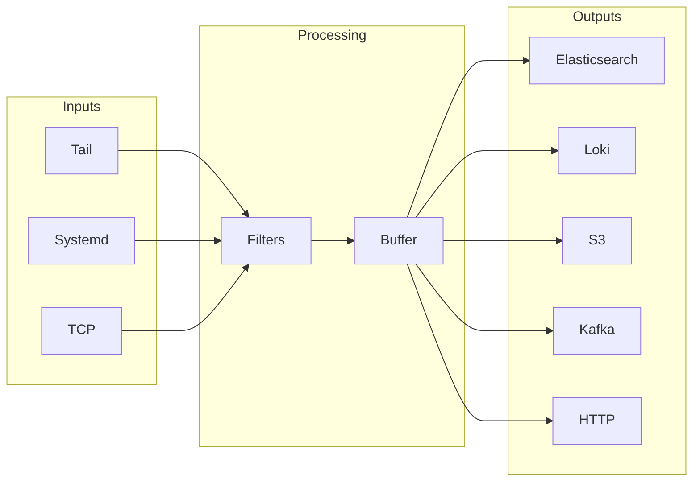
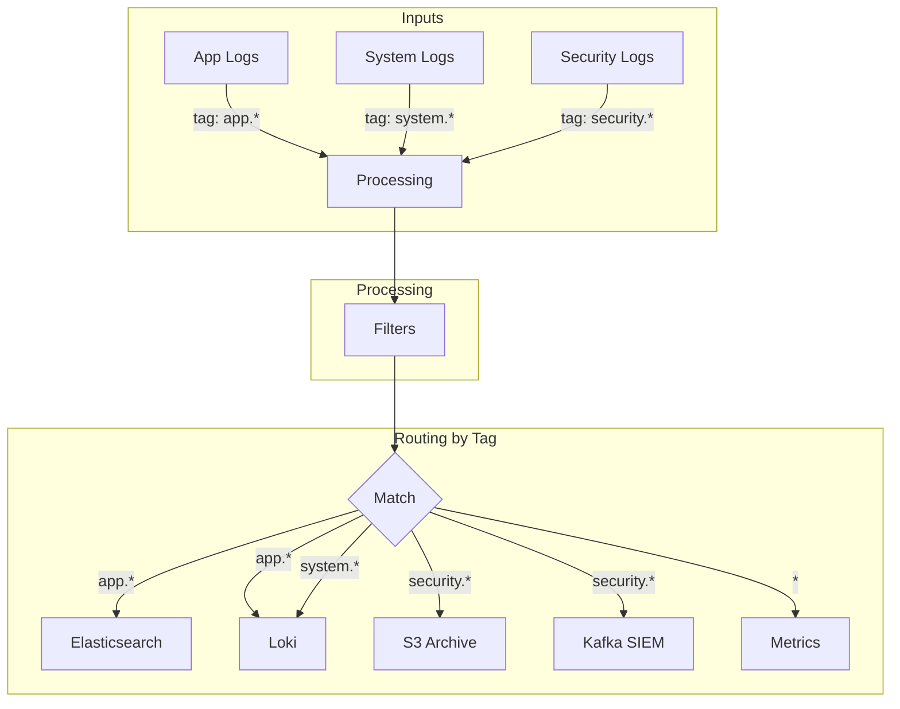

# How to Configure Fluent Bit Outputs

Author: [nawazdhandala](https://www.github.com/nawazdhandala)

Tags: Fluent Bit, Logging, Outputs, Observability, Elasticsearch, Loki, Kafka, S3, Cloud Native

Description: A practical guide to configuring Fluent Bit output plugins for various destinations including Elasticsearch, Loki, Kafka, S3, and HTTP endpoints. Learn routing strategies, buffering, retry logic, and production best practices.

---

> Fluent Bit collects and processes logs, but the output configuration determines where those logs actually go. Getting outputs right means reliable delivery, efficient resource usage, and the ability to route different log streams to different destinations.

Outputs in Fluent Bit are the final stage of the log pipeline. After inputs collect data and filters transform it, outputs deliver logs to their destinations. A single Fluent Bit instance can send data to multiple outputs simultaneously, making it a powerful hub for log distribution.

---

## Output Pipeline Architecture

Understanding how data flows through Fluent Bit helps you configure outputs effectively:



Each output plugin handles its own connection management, batching, and retry logic. You can configure multiple outputs with different match patterns to route specific log streams to specific destinations.

---

## Core Output Configuration Concepts

### Match Patterns

Every output requires a `Match` parameter that determines which tagged logs it receives. Tags are assigned by inputs and can be modified by filters.

The following configuration demonstrates basic match patterns for routing logs to different outputs based on their tags:

```ini
# Match all logs - the asterisk is a wildcard
[OUTPUT]
    Name   stdout
    Match  *

# Match logs with tags starting with "app."
[OUTPUT]
    Name   es
    Match  app.*

# Match logs with specific tag
[OUTPUT]
    Name   loki
    Match  system.syslog

# Match multiple patterns using OR logic
[OUTPUT]
    Name   s3
    Match_Regex (app\..*)|(system\..*)
```

### Buffering and Retry Configuration

Fluent Bit buffers data before sending to outputs. When an output fails, the retry mechanism kicks in. Proper configuration prevents data loss during network issues.

The configuration below shows how to set up filesystem buffering with retry limits for reliable delivery:

```ini
[SERVICE]
    # Enable filesystem buffering for persistence
    storage.path              /var/log/flb-storage/
    storage.sync              normal
    storage.checksum          off
    storage.max_chunks_up     128
    storage.backlog.mem_limit 10M

[OUTPUT]
    Name          es
    Match         *
    Host          elasticsearch.example.com
    Port          9200

    # Retry configuration
    # False = unlimited retries, number = max retry count
    Retry_Limit   5

    # Use filesystem buffer for this output
    storage.total_limit_size 500M
```

---

## Elasticsearch Output

Elasticsearch remains one of the most popular log destinations. The plugin supports bulk operations, time-based indices, and authentication.

### Basic Elasticsearch Configuration

Here is a minimal configuration to send logs to an Elasticsearch cluster:

```ini
# Basic Elasticsearch output - sends all matched logs to a single index
[OUTPUT]
    Name            es
    Match           *

    # Elasticsearch connection details
    Host            elasticsearch.logging.svc
    Port            9200

    # Index name (static)
    Index           application-logs
```

### Production Elasticsearch Configuration

Production deployments need authentication, TLS, time-based indices, and proper retry handling:

```ini
# Production-ready Elasticsearch configuration with security and reliability settings
[OUTPUT]
    Name            es
    Match           app.*

    # Connection settings
    Host            elasticsearch.logging.svc
    Port            9200

    # Authentication credentials
    HTTP_User       elastic
    HTTP_Passwd     ${ES_PASSWORD}

    # TLS encryption for secure transport
    tls             On
    tls.verify      On
    tls.ca_file     /etc/fluent-bit/certs/elasticsearch-ca.crt

    # Use Logstash-compatible time-based index naming
    # Creates indices like: app-logs-2026.02.02
    Logstash_Format On
    Logstash_Prefix app-logs
    Logstash_DateFormat %Y.%m.%d

    # Suppress type name (required for ES 8.x)
    Suppress_Type_Name On

    # Include the Fluent Bit tag in documents
    Include_Tag_Key On
    Tag_Key         fluent_tag

    # Generate document IDs to prevent duplicates on retry
    Generate_ID     On

    # Replace dots in field names with underscores (ES compatibility)
    Replace_Dots    On

    # Bulk operation settings
    Buffer_Size     5MB

    # Retry failed requests up to 10 times
    Retry_Limit     10

    # Enable trace output for debugging (disable in production)
    Trace_Output    Off
    Trace_Error     On
```

### Multiple Elasticsearch Indices

Route different log types to different indices for better organization:

```ini
# Application logs go to app-specific index
[OUTPUT]
    Name            es
    Match           app.*
    Host            elasticsearch.logging.svc
    Port            9200
    Logstash_Format On
    Logstash_Prefix application
    HTTP_User       elastic
    HTTP_Passwd     ${ES_PASSWORD}
    tls             On

# System logs go to infrastructure index
[OUTPUT]
    Name            es
    Match           system.*
    Host            elasticsearch.logging.svc
    Port            9200
    Logstash_Format On
    Logstash_Prefix infrastructure
    HTTP_User       elastic
    HTTP_Passwd     ${ES_PASSWORD}
    tls             On

# Security logs go to separate secure index
[OUTPUT]
    Name            es
    Match           security.*
    Host            elasticsearch.logging.svc
    Port            9200
    Logstash_Format On
    Logstash_Prefix security-audit
    HTTP_User       elastic
    HTTP_Passwd     ${ES_PASSWORD}
    tls             On
```

---

## Loki Output

Grafana Loki stores logs efficiently using label-based indexing. Fluent Bit's Loki output maps well to Kubernetes environments.

### Basic Loki Configuration

Send logs to Loki with minimal configuration:

```ini
# Basic Loki output - logs are labeled with job name
[OUTPUT]
    Name        loki
    Match       *

    # Loki server connection
    Host        loki.monitoring.svc
    Port        3100

    # Static labels applied to all logs
    Labels      job=fluent-bit
```

### Production Loki Configuration

Production setups need proper labeling, tenant configuration, and batching:

```ini
# Production Loki configuration with structured labels and batching
[OUTPUT]
    Name        loki
    Match       kube.*

    # Loki server endpoint
    Host        loki-gateway.monitoring.svc
    Port        80

    # Multi-tenant support - set tenant ID header
    Tenant_ID   production

    # Authentication (if required)
    HTTP_User   loki
    HTTP_Passwd ${LOKI_PASSWORD}

    # TLS configuration
    tls         On
    tls.verify  On

    # Static labels applied to all logs from this output
    Labels      job=kubernetes, cluster=production-us-east

    # Automatically add Kubernetes labels as Loki labels
    # Useful for filtering by namespace, pod, container
    Auto_Kubernetes_Labels On

    # Remove specific Kubernetes annotations from labels
    # Prevents high cardinality label explosion
    Label_Keys  $kubernetes['namespace_name'],$kubernetes['pod_name'],$kubernetes['container_name']

    # Drop these keys from log lines (they become labels)
    Remove_Keys kubernetes,stream

    # Batch configuration for efficiency
    # Wait up to 1 second to batch logs
    Line_Format json

    # Retry settings
    Retry_Limit 5
```

### Loki with Line Format Options

Control how log lines appear in Loki:

```ini
# JSON format - preserves structured data
[OUTPUT]
    Name        loki
    Match       app.*
    Host        loki.monitoring.svc
    Port        3100
    Labels      job=application
    Line_Format json

# Key-value format - human readable
[OUTPUT]
    Name        loki
    Match       system.*
    Host        loki.monitoring.svc
    Port        3100
    Labels      job=system
    Line_Format key_value
```

---

## Kafka Output

Kafka provides durable, high-throughput log streaming. Fluent Bit can produce messages to Kafka topics for downstream processing.

### Basic Kafka Configuration

Send logs to a Kafka topic:

```ini
# Basic Kafka producer configuration
[OUTPUT]
    Name          kafka
    Match         *

    # Kafka broker addresses (comma-separated for clusters)
    Brokers       kafka-0.kafka.svc:9092,kafka-1.kafka.svc:9092,kafka-2.kafka.svc:9092

    # Destination topic
    Topics        application-logs
```

### Production Kafka Configuration

Production Kafka deployments need security, partitioning, and reliability settings:

```ini
# Production Kafka configuration with SASL authentication and compression
[OUTPUT]
    Name          kafka
    Match         app.*

    # Kafka cluster brokers
    Brokers       kafka-0.kafka.svc:9093,kafka-1.kafka.svc:9093,kafka-2.kafka.svc:9093

    # Topic configuration
    Topics        logs-production

    # Message key for partitioning (ensures logs from same source go to same partition)
    Message_Key   ${kubernetes['pod_name']}

    # Timestamp field name in the message
    Timestamp_Key @timestamp
    Timestamp_Format iso8601

    # SASL authentication
    rdkafka.security.protocol        SASL_SSL
    rdkafka.sasl.mechanism           PLAIN
    rdkafka.sasl.username            fluent-bit
    rdkafka.sasl.password            ${KAFKA_PASSWORD}

    # TLS configuration
    rdkafka.ssl.ca.location          /etc/fluent-bit/certs/kafka-ca.crt

    # Producer reliability settings
    # wait for all replicas to acknowledge
    rdkafka.request.required.acks    -1

    # Compression reduces network bandwidth
    rdkafka.compression.type         lz4

    # Batching for throughput
    rdkafka.batch.num.messages       1000
    rdkafka.linger.ms                50

    # Buffer settings
    rdkafka.queue.buffering.max.messages    100000
    rdkafka.queue.buffering.max.kbytes      1048576

    # Retry configuration
    rdkafka.message.send.max.retries        3
    rdkafka.retry.backoff.ms                100
```

### Dynamic Topic Routing

Route logs to different topics based on tags:

```ini
# Route application logs to app-specific topic
[OUTPUT]
    Name          kafka
    Match         app.*
    Brokers       kafka.svc:9092
    Topics        application-logs

# Route system logs to infrastructure topic
[OUTPUT]
    Name          kafka
    Match         system.*
    Brokers       kafka.svc:9092
    Topics        infrastructure-logs

# Route security events to dedicated topic
[OUTPUT]
    Name          kafka
    Match         security.*
    Brokers       kafka.svc:9092
    Topics        security-events
```

---

## S3 Output

Amazon S3 provides cost-effective long-term log storage. Fluent Bit can write logs directly to S3 buckets.

### Basic S3 Configuration

Write logs to an S3 bucket:

```ini
# Basic S3 output - writes JSON files to bucket
[OUTPUT]
    Name                         s3
    Match                        *

    # S3 bucket and region
    bucket                       company-logs-archive
    region                       us-east-1

    # File size before upload (accumulate logs until this size)
    total_file_size              50M

    # Force upload after this duration even if file size not reached
    upload_timeout               5m
```

### Production S3 Configuration

Production setups need proper partitioning, compression, and error handling:

```ini
# Production S3 configuration with partitioning and compression
[OUTPUT]
    Name                         s3
    Match                        *

    # S3 bucket configuration
    bucket                       production-logs-archive
    region                       us-east-1

    # IAM role assumption (for cross-account or specific permissions)
    role_arn                     arn:aws:iam::123456789012:role/FluentBitS3Writer

    # S3 key format with time-based partitioning
    # Creates paths like: logs/app/2026/02/02/14/app-logs-1234567890.gz
    s3_key_format                /logs/$TAG/%Y/%m/%d/%H/$TAG-logs-%{[1]}-%{[2]}.gz
    s3_key_format_tag_delimiters .-

    # Use static file naming for easier debugging
    static_file_path             Off

    # Compression reduces storage costs significantly
    compression                  gzip
    content_type                 application/gzip

    # File accumulation settings
    total_file_size              100M
    upload_timeout               10m

    # Local buffer directory (survives restarts)
    store_dir                    /var/log/fluent-bit/s3-buffer

    # Number of upload workers
    upload_workers               4

    # Retry configuration
    retry_limit                  5

    # Preserve failed uploads for manual recovery
    preserve_data_ordering       On

    # Server-side encryption
    use_put_object               On
    send_content_md5             On
```

### S3 with Multiple Retention Policies

Route logs to different S3 paths based on retention requirements:

```ini
# High-value logs - standard storage, long retention
[OUTPUT]
    Name                         s3
    Match                        security.*
    bucket                       compliance-logs
    region                       us-east-1
    s3_key_format                /security/%Y/%m/%d/%H/security-$UUID.gz
    compression                  gzip
    total_file_size              50M
    upload_timeout               5m
    store_dir                    /var/log/fluent-bit/s3-security

# Application logs - Intelligent Tiering for cost optimization
[OUTPUT]
    Name                         s3
    Match                        app.*
    bucket                       application-logs
    region                       us-east-1
    s3_key_format                /application/%Y/%m/%d/$TAG-$UUID.gz
    compression                  gzip
    total_file_size              100M
    upload_timeout               10m
    store_dir                    /var/log/fluent-bit/s3-app
    storage_class                INTELLIGENT_TIERING

# Debug logs - Glacier for cheap archival
[OUTPUT]
    Name                         s3
    Match                        debug.*
    bucket                       debug-logs-archive
    region                       us-east-1
    s3_key_format                /debug/%Y/%m/%d/$TAG.gz
    compression                  gzip
    total_file_size              250M
    upload_timeout               30m
    store_dir                    /var/log/fluent-bit/s3-debug
```

---

## HTTP Output

HTTP outputs enable integration with any REST API endpoint, including custom log aggregators and observability platforms.

### Basic HTTP Configuration

Send logs to an HTTP endpoint:

```ini
# Basic HTTP POST output
[OUTPUT]
    Name          http
    Match         *

    # Endpoint configuration
    Host          logs.example.com
    Port          443
    URI           /api/v1/logs

    # Use HTTPS
    tls           On

    # Output format
    Format        json
```

### Production HTTP Configuration

Production HTTP outputs need authentication, compression, and proper error handling:

```ini
# Production HTTP output with authentication and batching
[OUTPUT]
    Name          http
    Match         *

    # Endpoint configuration
    Host          api.logging-service.com
    Port          443
    URI           /v1/logs/ingest

    # TLS configuration
    tls           On
    tls.verify    On
    tls.ca_file   /etc/fluent-bit/certs/api-ca.crt

    # Authentication headers
    Header        Authorization Bearer ${API_TOKEN}
    Header        X-Source fluent-bit
    Header        X-Environment production

    # Request format
    Format        json
    Json_Date_Key timestamp
    Json_Date_Format iso8601

    # Compression reduces bandwidth usage
    Compress      gzip

    # Connection settings
    Keepalive     On
    Keepalive_Idle_Timeout 30

    # Retry configuration
    Retry_Limit   5

    # Workers for parallel requests
    Workers       2
```

### HTTP Output to OneUptime

Send logs directly to OneUptime's telemetry ingestion endpoint:

```ini
# OneUptime log ingestion via HTTP
[OUTPUT]
    Name          http
    Match         *

    # OneUptime ingestion endpoint
    Host          oneuptime.com
    Port          443
    URI           /api/telemetry/logs

    # TLS encryption
    tls           On
    tls.verify    On

    # Authentication with OneUptime API key
    Header        X-OneUptime-Token ${ONEUPTIME_TOKEN}
    Header        Content-Type application/json

    # JSON output format
    Format        json
    Json_Date_Key timestamp
    Json_Date_Format iso8601

    # Batching for efficiency
    Compress      gzip

    # Reliability settings
    Retry_Limit   10
    Workers       2
```

---

## Forward Output

The Forward output sends logs to Fluentd or another Fluent Bit instance. Useful for building tiered log collection architectures.

### Basic Forward Configuration

Send logs to a Fluentd aggregator:

```ini
# Forward logs to Fluentd
[OUTPUT]
    Name          forward
    Match         *

    # Fluentd server
    Host          fluentd-aggregator.logging.svc
    Port          24224
```

### Production Forward Configuration

Production deployments need authentication, TLS, and load balancing:

```ini
# Production forward output with security and reliability
[OUTPUT]
    Name          forward
    Match         *

    # Primary Fluentd aggregator
    Host          fluentd-primary.logging.svc
    Port          24224

    # Shared secret for authentication
    Shared_Key    ${FORWARD_SHARED_KEY}
    Self_Hostname fluent-bit-node-01

    # TLS encryption
    tls           On
    tls.verify    On
    tls.ca_file   /etc/fluent-bit/certs/fluentd-ca.crt

    # Request acknowledgment (ensures delivery)
    Require_ack_response true

    # Send additional options metadata
    Send_options  true

    # Retry configuration
    Retry_Limit   10
```

### Forward with Load Balancing

Distribute logs across multiple aggregators:

```ini
# Load balanced forward output using upstream configuration
[OUTPUT]
    Name          forward
    Match         *

    # Reference upstream block for multiple hosts
    Upstream      forward-upstream.conf

    Shared_Key    ${FORWARD_SHARED_KEY}
    tls           On
    tls.verify    On
    Require_ack_response true
```

Create a separate upstream configuration file:

```ini
# forward-upstream.conf
# Defines multiple forward targets for load balancing

[UPSTREAM]
    Name          fluentd-cluster

[NODE]
    Name          node1
    Host          fluentd-1.logging.svc
    Port          24224

[NODE]
    Name          node2
    Host          fluentd-2.logging.svc
    Port          24224

[NODE]
    Name          node3
    Host          fluentd-3.logging.svc
    Port          24224
```

---

## CloudWatch Logs Output

Send logs directly to AWS CloudWatch Logs:

```ini
# CloudWatch Logs output with auto-created log groups
[OUTPUT]
    Name                  cloudwatch_logs
    Match                 *

    # AWS region
    region                us-east-1

    # Log group naming
    log_group_name        /fluent-bit/application
    log_stream_prefix     node-

    # Automatically create log group if it doesn't exist
    auto_create_group     true

    # Use IAM role credentials (recommended for EKS)
    # Credentials are automatically retrieved from environment or instance metadata

    # Retry configuration
    retry_limit           5

    # Log retention (in days, 0 = never expire)
    log_retention_days    30
```

---

## Datadog Output

Send logs to Datadog's log management platform:

```ini
# Datadog log output with tagging
[OUTPUT]
    Name          datadog
    Match         *

    # Datadog API endpoint (region-specific)
    Host          http-intake.logs.datadoghq.com

    # Authentication
    apikey        ${DATADOG_API_KEY}

    # Datadog-specific settings
    dd_service    my-application
    dd_source     fluent-bit
    dd_tags       env:production,team:platform

    # Compression
    compress      gzip

    # TLS
    tls           On
```

---

## Multi-Output Routing Strategy

Real-world deployments often need logs sent to multiple destinations. Here's a complete example:



The following configuration implements multi-destination routing:

```ini
[SERVICE]
    Flush         5
    Daemon        Off
    Log_Level     info
    Parsers_File  parsers.conf

    # Enable filesystem storage for reliability
    storage.path              /var/log/flb-storage/
    storage.sync              normal
    storage.backlog.mem_limit 50M

# Application logs - primary to Elasticsearch
[OUTPUT]
    Name            es
    Match           app.*
    Host            elasticsearch.logging.svc
    Port            9200
    Logstash_Format On
    Logstash_Prefix application
    HTTP_User       elastic
    HTTP_Passwd     ${ES_PASSWORD}
    tls             On
    Retry_Limit     10

# Application logs - also to Loki for Grafana dashboards
[OUTPUT]
    Name        loki
    Match       app.*
    Host        loki.monitoring.svc
    Port        3100
    Labels      job=application, env=production
    Line_Format json

# System logs - to Loki only
[OUTPUT]
    Name        loki
    Match       system.*
    Host        loki.monitoring.svc
    Port        3100
    Labels      job=infrastructure, env=production
    Line_Format json

# Security logs - to S3 for compliance archival
[OUTPUT]
    Name                         s3
    Match                        security.*
    bucket                       security-compliance-logs
    region                       us-east-1
    s3_key_format                /security/%Y/%m/%d/%H/audit-$UUID.gz
    compression                  gzip
    total_file_size              50M
    upload_timeout               5m
    Retry_Limit                  10

# Security logs - to Kafka for SIEM integration
[OUTPUT]
    Name          kafka
    Match         security.*
    Brokers       kafka.svc:9092
    Topics        security-events
    rdkafka.compression.type lz4

# All logs - forward to central aggregator as backup
[OUTPUT]
    Name          forward
    Match         *
    Host          fluentd-backup.logging.svc
    Port          24224
    Retry_Limit   3
```

---

## Troubleshooting Output Issues

### Debugging Output Problems

Enable tracing to diagnose output issues:

```ini
[SERVICE]
    Log_Level     debug

[OUTPUT]
    Name          es
    Match         *
    Host          elasticsearch.logging.svc
    Port          9200

    # Enable trace output for debugging
    Trace_Output  On
    Trace_Error   On
```

### Common Output Issues

**Connection Refused**
- Verify the destination host and port are correct
- Check network policies and firewall rules
- Ensure the destination service is running

**Authentication Failures**
- Verify credentials are correct and not expired
- Check that environment variables are set
- Validate TLS certificates match the expected CA

**High Memory Usage**
- Reduce buffer sizes
- Enable filesystem buffering
- Lower retry limits to prevent queue buildup

**Data Loss**
- Enable filesystem storage for persistence
- Increase retry limits
- Check destination capacity and throttling

### Monitor Output Health

Check output metrics via the Fluent Bit HTTP API:

```bash
# Get output plugin metrics
curl -s http://localhost:2020/api/v1/metrics/prometheus | grep fluentbit_output

# Key metrics to monitor:
# - fluentbit_output_retries_total: High values indicate delivery problems
# - fluentbit_output_errors_total: Errors during output processing
# - fluentbit_output_records_total: Total records sent
# - fluentbit_output_bytes_total: Total bytes sent
```

---

## Summary

Fluent Bit outputs provide flexible log delivery to virtually any destination. Key takeaways:

1. **Use match patterns** to route specific log streams to appropriate destinations
2. **Enable filesystem buffering** for reliability during outages
3. **Configure retries** based on destination reliability requirements
4. **Compress data** when sending over networks to reduce bandwidth
5. **Monitor output metrics** to catch delivery issues early
6. **Use multiple outputs** to send logs to different destinations based on use case

Start with a simple stdout output for testing, then add production destinations as you validate the pipeline works correctly.

---

*Looking for a unified observability platform that works with Fluent Bit? [OneUptime](https://oneuptime.com) supports log ingestion from Fluent Bit along with metrics, traces, and uptime monitoring in a single platform.*
