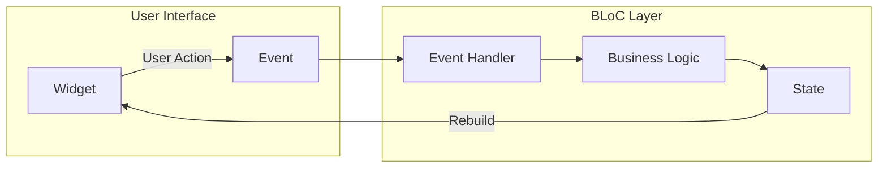
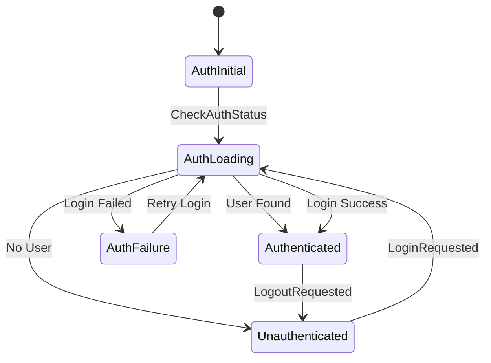
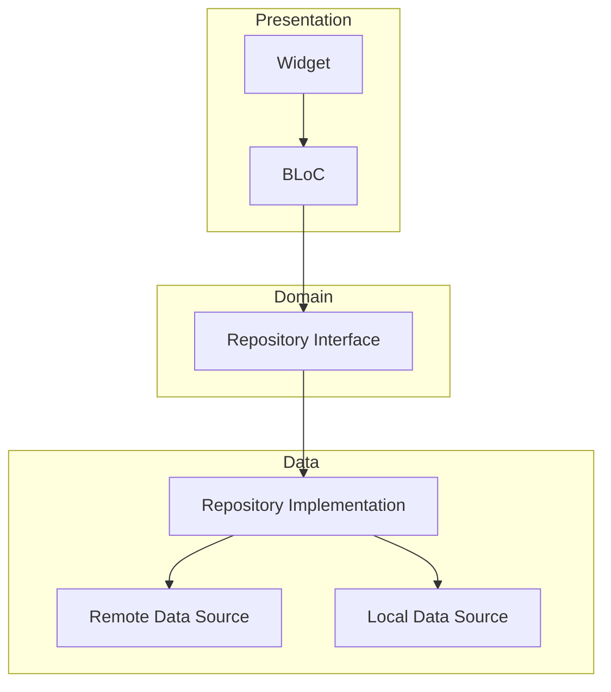

# How to Use Flutter with BLoC Pattern

Author: [nawazdhandala](https://www.github.com/nawazdhandala)

Tags: Flutter, BLoC, State Management, Dart

Description: Master the BLoC (Business Logic Component) pattern in Flutter. Learn how to build scalable, testable applications with clean separation between UI and business logic using events, states, and streams.

---

The BLoC (Business Logic Component) pattern has become one of the most popular architectural patterns for Flutter applications. Originally developed by Google, BLoC provides a clear separation between presentation and business logic, making your code more testable, maintainable, and scalable. This comprehensive guide walks you through everything you need to know to effectively use BLoC in your Flutter projects.

## What is the BLoC Pattern?

BLoC stands for Business Logic Component. At its core, BLoC is a design pattern that separates presentation from business logic using reactive programming principles. The pattern relies on streams to handle data flow, where the UI sends events to the BLoC, and the BLoC emits states back to the UI.



The key components of the BLoC pattern are:

- **Events**: Actions triggered by user interactions or system events
- **States**: Representations of the UI at any given moment
- **BLoC**: The component that receives events, processes them, and emits states

This unidirectional data flow makes it easy to understand how data moves through your application and simplifies debugging.

## Why Choose BLoC?

Before diving into implementation, let's understand when and why you should use BLoC:

**Advantages:**

1. **Testability**: Business logic is isolated from the UI, making unit tests straightforward
2. **Predictability**: Every state change is traceable to an event
3. **Reusability**: BLoCs can be shared across multiple widgets or even apps
4. **Separation of Concerns**: Clear boundaries between UI and business logic
5. **Scalability**: Works well for both small and large applications

**When to Use BLoC:**

- Medium to large applications with complex business logic
- Teams that value strict architectural patterns
- Applications requiring extensive testing
- Projects where multiple developers work on different features

## Setting Up BLoC in Your Project

Let's start by adding the necessary dependencies to your Flutter project.

The flutter_bloc package provides the core BLoC functionality, while equatable helps with state comparison for efficient rebuilds.

```yaml
# pubspec.yaml
dependencies:
  flutter:
    sdk: flutter
  flutter_bloc: ^8.1.3
  equatable: ^2.0.5

dev_dependencies:
  flutter_test:
    sdk: flutter
  bloc_test: ^9.1.4
```

Run the following command to install the dependencies:

```bash
flutter pub get
```

## Understanding Events and States

Before writing code, you need to understand how events and states work together.

### Events

Events represent user actions or system triggers. They are inputs to your BLoC that describe what happened.

This example shows how to define events for a counter feature. Each event class represents a specific action the user can take.

```dart
// counter_event.dart
// Events describe WHAT happened in the application
// They are the input to the BLoC

import 'package:equatable/equatable.dart';

// Base event class that all counter events extend
// Using sealed class for exhaustive pattern matching (Dart 3+)
sealed class CounterEvent extends Equatable {
  const CounterEvent();

  @override
  List<Object?> get props => [];
}

// Event fired when user taps the increment button
class CounterIncrementPressed extends CounterEvent {
  const CounterIncrementPressed();
}

// Event fired when user taps the decrement button
class CounterDecrementPressed extends CounterEvent {
  const CounterDecrementPressed();
}

// Event fired when user wants to reset the counter
// Includes an optional starting value parameter
class CounterResetPressed extends CounterEvent {
  final int startValue;

  const CounterResetPressed({this.startValue = 0});

  @override
  List<Object?> get props => [startValue];
}
```

### States

States represent the output of your BLoC. They describe how the UI should look at any moment.

This example demonstrates different state classes for a counter. The base state holds the current count, and specialized states add context like loading or error information.

```dart
// counter_state.dart
// States describe HOW the UI should look
// They are the output of the BLoC

import 'package:equatable/equatable.dart';

// Base state class with the core data
class CounterState extends Equatable {
  final int count;
  final bool isLoading;
  final String? errorMessage;

  const CounterState({
    this.count = 0,
    this.isLoading = false,
    this.errorMessage,
  });

  // copyWith pattern for immutable state updates
  // This ensures we create new state objects instead of mutating
  CounterState copyWith({
    int? count,
    bool? isLoading,
    String? errorMessage,
  }) {
    return CounterState(
      count: count ?? this.count,
      isLoading: isLoading ?? this.isLoading,
      errorMessage: errorMessage,
    );
  }

  @override
  List<Object?> get props => [count, isLoading, errorMessage];
}
```

## Building Your First BLoC

Now let's create the BLoC that connects events to states.

The BLoC class extends the Bloc base class, specifying the event and state types. Event handlers are registered in the constructor and define how each event transforms the current state.

```dart
// counter_bloc.dart
// The BLoC processes events and emits new states

import 'package:flutter_bloc/flutter_bloc.dart';
import 'counter_event.dart';
import 'counter_state.dart';

class CounterBloc extends Bloc<CounterEvent, CounterState> {
  // Initialize with the default state
  CounterBloc() : super(const CounterState()) {
    // Register event handlers
    // Each handler maps an event type to a function
    on<CounterIncrementPressed>(_onIncrement);
    on<CounterDecrementPressed>(_onDecrement);
    on<CounterResetPressed>(_onReset);
  }

  // Handler for increment events
  // Takes the event and an Emitter to output new states
  void _onIncrement(
    CounterIncrementPressed event,
    Emitter<CounterState> emit,
  ) {
    // Emit a new state with incremented count
    // state refers to the current state of the BLoC
    emit(state.copyWith(count: state.count + 1));
  }

  // Handler for decrement events
  void _onDecrement(
    CounterDecrementPressed event,
    Emitter<CounterState> emit,
  ) {
    emit(state.copyWith(count: state.count - 1));
  }

  // Handler for reset events
  // Demonstrates using event properties
  void _onReset(
    CounterResetPressed event,
    Emitter<CounterState> emit,
  ) {
    emit(state.copyWith(count: event.startValue));
  }
}
```

## Integrating BLoC with Flutter UI

Flutter provides several widgets for integrating BLoC with your UI.

### BlocProvider

BlocProvider creates and provides a BLoC instance to the widget subtree. Place it at the top of your feature's widget tree.

This widget creates the BLoC and makes it available to all descendant widgets through the context.

```dart
// main.dart
// BlocProvider creates and provides the BLoC to descendants

import 'package:flutter/material.dart';
import 'package:flutter_bloc/flutter_bloc.dart';
import 'counter_bloc.dart';

void main() {
  runApp(const MyApp());
}

class MyApp extends StatelessWidget {
  const MyApp({super.key});

  @override
  Widget build(BuildContext context) {
    return MaterialApp(
      title: 'Flutter BLoC Demo',
      home: BlocProvider(
        // create is called once when the widget is first built
        // The BLoC is automatically closed when the provider is disposed
        create: (context) => CounterBloc(),
        child: const CounterPage(),
      ),
    );
  }
}
```

### BlocBuilder

BlocBuilder rebuilds the UI whenever the BLoC emits a new state.

The builder function receives the current context and state, returning the widget tree that should be displayed for that state.

```dart
// counter_page.dart
// BlocBuilder rebuilds UI based on state changes

import 'package:flutter/material.dart';
import 'package:flutter_bloc/flutter_bloc.dart';
import 'counter_bloc.dart';
import 'counter_event.dart';
import 'counter_state.dart';

class CounterPage extends StatelessWidget {
  const CounterPage({super.key});

  @override
  Widget build(BuildContext context) {
    return Scaffold(
      appBar: AppBar(
        title: const Text('BLoC Counter'),
        actions: [
          IconButton(
            icon: const Icon(Icons.refresh),
            onPressed: () {
              // Use context.read to access BLoC for dispatching events
              // read does not listen for changes, only accesses the BLoC
              context.read<CounterBloc>().add(const CounterResetPressed());
            },
          ),
        ],
      ),
      body: Center(
        // BlocBuilder rebuilds this widget when state changes
        child: BlocBuilder<CounterBloc, CounterState>(
          // buildWhen is optional - controls when rebuilds happen
          // Return true to rebuild, false to skip
          buildWhen: (previous, current) {
            return previous.count != current.count;
          },
          builder: (context, state) {
            // Handle loading state
            if (state.isLoading) {
              return const CircularProgressIndicator();
            }

            // Handle error state
            if (state.errorMessage != null) {
              return Text(
                'Error: ${state.errorMessage}',
                style: const TextStyle(color: Colors.red),
              );
            }

            // Normal state - display the count
            return Column(
              mainAxisAlignment: MainAxisAlignment.center,
              children: [
                const Text('Current Count:'),
                Text(
                  '${state.count}',
                  style: Theme.of(context).textTheme.displayLarge,
                ),
              ],
            );
          },
        ),
      ),
      floatingActionButton: Column(
        mainAxisAlignment: MainAxisAlignment.end,
        children: [
          FloatingActionButton(
            heroTag: 'increment',
            onPressed: () {
              context.read<CounterBloc>().add(const CounterIncrementPressed());
            },
            child: const Icon(Icons.add),
          ),
          const SizedBox(height: 8),
          FloatingActionButton(
            heroTag: 'decrement',
            onPressed: () {
              context.read<CounterBloc>().add(const CounterDecrementPressed());
            },
            child: const Icon(Icons.remove),
          ),
        ],
      ),
    );
  }
}
```

### BlocListener

BlocListener executes side effects in response to state changes without rebuilding the UI. Use it for navigation, showing dialogs, or displaying snackbars.

This widget listens for state changes and performs actions like showing error messages, without affecting the widget tree structure.

```dart
// Using BlocListener for side effects
// Perfect for navigation, snackbars, dialogs

class CounterPageWithListener extends StatelessWidget {
  const CounterPageWithListener({super.key});

  @override
  Widget build(BuildContext context) {
    return BlocListener<CounterBloc, CounterState>(
      // listenWhen controls when the listener fires
      listenWhen: (previous, current) {
        // Only listen when error state changes
        return previous.errorMessage != current.errorMessage;
      },
      listener: (context, state) {
        // This runs when state changes but does not rebuild UI
        if (state.errorMessage != null) {
          ScaffoldMessenger.of(context).showSnackBar(
            SnackBar(
              content: Text(state.errorMessage!),
              backgroundColor: Colors.red,
            ),
          );
        }

        // Example: Navigate when reaching a milestone
        if (state.count == 100) {
          Navigator.of(context).push(
            MaterialPageRoute(
              builder: (_) => const MilestoneScreen(),
            ),
          );
        }
      },
      child: const CounterView(),
    );
  }
}
```

### BlocConsumer

BlocConsumer combines BlocBuilder and BlocListener when you need both.

This widget is useful when you need to both rebuild the UI and perform side effects based on state changes.

```dart
// BlocConsumer combines Builder and Listener
// Use when you need both UI updates and side effects

class CounterPageWithConsumer extends StatelessWidget {
  const CounterPageWithConsumer({super.key});

  @override
  Widget build(BuildContext context) {
    return Scaffold(
      body: BlocConsumer<CounterBloc, CounterState>(
        // Optional: Control when to listen
        listenWhen: (previous, current) {
          return current.errorMessage != null;
        },
        // Optional: Control when to rebuild
        buildWhen: (previous, current) {
          return previous.count != current.count;
        },
        // Listener for side effects
        listener: (context, state) {
          if (state.errorMessage != null) {
            ScaffoldMessenger.of(context).showSnackBar(
              SnackBar(content: Text(state.errorMessage!)),
            );
          }
        },
        // Builder for UI
        builder: (context, state) {
          return Center(
            child: Text(
              '${state.count}',
              style: Theme.of(context).textTheme.displayLarge,
            ),
          );
        },
      ),
    );
  }
}
```

## Real-World Example: Authentication Flow

Let's build a complete authentication feature to demonstrate BLoC in a real-world scenario.



### Authentication Events

These events cover all the authentication actions a user might trigger in your application.

```dart
// auth_event.dart
// All possible authentication events

import 'package:equatable/equatable.dart';

sealed class AuthEvent extends Equatable {
  const AuthEvent();

  @override
  List<Object?> get props => [];
}

// Check if user is already logged in (app startup)
class AuthCheckRequested extends AuthEvent {
  const AuthCheckRequested();
}

// User submitted login form
class AuthLoginRequested extends AuthEvent {
  final String email;
  final String password;

  const AuthLoginRequested({
    required this.email,
    required this.password,
  });

  @override
  List<Object?> get props => [email, password];
}

// User requested logout
class AuthLogoutRequested extends AuthEvent {
  const AuthLogoutRequested();
}

// User requested password reset
class AuthPasswordResetRequested extends AuthEvent {
  final String email;

  const AuthPasswordResetRequested({required this.email});

  @override
  List<Object?> get props => [email];
}
```

### Authentication States

The authentication states represent every possible UI state during the auth flow.

```dart
// auth_state.dart
// All possible authentication states

import 'package:equatable/equatable.dart';

// User model
class User extends Equatable {
  final String id;
  final String email;
  final String displayName;
  final String? photoUrl;

  const User({
    required this.id,
    required this.email,
    required this.displayName,
    this.photoUrl,
  });

  @override
  List<Object?> get props => [id, email, displayName, photoUrl];
}

// Authentication states
sealed class AuthState extends Equatable {
  const AuthState();

  @override
  List<Object?> get props => [];
}

// Initial state before any auth check
class AuthInitial extends AuthState {
  const AuthInitial();
}

// Loading state during auth operations
class AuthLoading extends AuthState {
  const AuthLoading();
}

// User is authenticated
class Authenticated extends AuthState {
  final User user;

  const Authenticated(this.user);

  @override
  List<Object?> get props => [user];
}

// User is not authenticated
class Unauthenticated extends AuthState {
  const Unauthenticated();
}

// Authentication failed with an error
class AuthFailure extends AuthState {
  final String message;

  const AuthFailure(this.message);

  @override
  List<Object?> get props => [message];
}
```

### Authentication Repository

The repository handles data operations. This separation allows the BLoC to focus on business logic while the repository handles API calls.

```dart
// auth_repository.dart
// Handles all authentication data operations

class AuthRepository {
  // In a real app, inject your API client here
  // final ApiClient _apiClient;

  User? _cachedUser;

  // Check for existing authentication
  Future<User?> getCurrentUser() async {
    // Simulate checking stored token/session
    await Future.delayed(const Duration(seconds: 1));
    return _cachedUser;
  }

  // Perform login
  Future<User> login(String email, String password) async {
    // Simulate API call
    await Future.delayed(const Duration(seconds: 2));

    // Validate credentials (replace with actual API call)
    if (email.isEmpty || password.isEmpty) {
      throw AuthException('Email and password are required');
    }

    if (password.length < 6) {
      throw AuthException('Password must be at least 6 characters');
    }

    // Simulate successful login
    final user = User(
      id: 'user_${DateTime.now().millisecondsSinceEpoch}',
      email: email,
      displayName: email.split('@').first,
    );

    _cachedUser = user;
    return user;
  }

  // Perform logout
  Future<void> logout() async {
    await Future.delayed(const Duration(milliseconds: 500));
    _cachedUser = null;
  }

  // Request password reset
  Future<void> resetPassword(String email) async {
    await Future.delayed(const Duration(seconds: 1));

    if (!email.contains('@')) {
      throw AuthException('Invalid email address');
    }

    // Simulate sending reset email
  }
}

// Custom exception for auth errors
class AuthException implements Exception {
  final String message;

  AuthException(this.message);

  @override
  String toString() => message;
}
```

### Authentication BLoC

The BLoC coordinates between events and states, using the repository for data operations.

```dart
// auth_bloc.dart
// Manages authentication state and logic

import 'package:flutter_bloc/flutter_bloc.dart';
import 'auth_event.dart';
import 'auth_state.dart';
import 'auth_repository.dart';

class AuthBloc extends Bloc<AuthEvent, AuthState> {
  final AuthRepository _authRepository;

  AuthBloc({required AuthRepository authRepository})
      : _authRepository = authRepository,
        super(const AuthInitial()) {
    // Register all event handlers
    on<AuthCheckRequested>(_onAuthCheckRequested);
    on<AuthLoginRequested>(_onAuthLoginRequested);
    on<AuthLogoutRequested>(_onAuthLogoutRequested);
    on<AuthPasswordResetRequested>(_onPasswordResetRequested);
  }

  // Handle initial auth check
  Future<void> _onAuthCheckRequested(
    AuthCheckRequested event,
    Emitter<AuthState> emit,
  ) async {
    emit(const AuthLoading());

    try {
      final user = await _authRepository.getCurrentUser();

      if (user != null) {
        emit(Authenticated(user));
      } else {
        emit(const Unauthenticated());
      }
    } catch (e) {
      emit(const Unauthenticated());
    }
  }

  // Handle login request
  Future<void> _onAuthLoginRequested(
    AuthLoginRequested event,
    Emitter<AuthState> emit,
  ) async {
    emit(const AuthLoading());

    try {
      final user = await _authRepository.login(
        event.email,
        event.password,
      );
      emit(Authenticated(user));
    } on AuthException catch (e) {
      emit(AuthFailure(e.message));
    } catch (e) {
      emit(AuthFailure('An unexpected error occurred'));
    }
  }

  // Handle logout request
  Future<void> _onAuthLogoutRequested(
    AuthLogoutRequested event,
    Emitter<AuthState> emit,
  ) async {
    emit(const AuthLoading());

    try {
      await _authRepository.logout();
      emit(const Unauthenticated());
    } catch (e) {
      // Even if logout fails, treat user as unauthenticated
      emit(const Unauthenticated());
    }
  }

  // Handle password reset request
  Future<void> _onPasswordResetRequested(
    AuthPasswordResetRequested event,
    Emitter<AuthState> emit,
  ) async {
    // Store current state to restore after reset
    final currentState = state;
    emit(const AuthLoading());

    try {
      await _authRepository.resetPassword(event.email);
      // Return to previous state after successful reset
      emit(currentState);
    } on AuthException catch (e) {
      emit(AuthFailure(e.message));
    }
  }
}
```

### Authentication UI

The UI components work together to create a complete authentication flow.

```dart
// auth_wrapper.dart
// Decides which screen to show based on auth state

import 'package:flutter/material.dart';
import 'package:flutter_bloc/flutter_bloc.dart';
import 'auth_bloc.dart';
import 'auth_state.dart';
import 'auth_event.dart';

class AuthWrapper extends StatelessWidget {
  const AuthWrapper({super.key});

  @override
  Widget build(BuildContext context) {
    return BlocConsumer<AuthBloc, AuthState>(
      listener: (context, state) {
        // Show error snackbar on auth failure
        if (state is AuthFailure) {
          ScaffoldMessenger.of(context).showSnackBar(
            SnackBar(
              content: Text(state.message),
              backgroundColor: Colors.red,
            ),
          );
        }
      },
      builder: (context, state) {
        // Show loading spinner during auth operations
        if (state is AuthInitial || state is AuthLoading) {
          return const Scaffold(
            body: Center(
              child: CircularProgressIndicator(),
            ),
          );
        }

        // Show home screen for authenticated users
        if (state is Authenticated) {
          return HomeScreen(user: state.user);
        }

        // Show login screen for unauthenticated users
        return const LoginScreen();
      },
    );
  }
}
```

Here is the login screen implementation that dispatches authentication events.

```dart
// login_screen.dart
// Login form that dispatches auth events

import 'package:flutter/material.dart';
import 'package:flutter_bloc/flutter_bloc.dart';
import 'auth_bloc.dart';
import 'auth_event.dart';
import 'auth_state.dart';

class LoginScreen extends StatefulWidget {
  const LoginScreen({super.key});

  @override
  State<LoginScreen> createState() => _LoginScreenState();
}

class _LoginScreenState extends State<LoginScreen> {
  final _formKey = GlobalKey<FormState>();
  final _emailController = TextEditingController();
  final _passwordController = TextEditingController();

  @override
  void dispose() {
    _emailController.dispose();
    _passwordController.dispose();
    super.dispose();
  }

  void _onSubmit() {
    if (_formKey.currentState?.validate() ?? false) {
      // Dispatch login event to the BLoC
      context.read<AuthBloc>().add(
            AuthLoginRequested(
              email: _emailController.text.trim(),
              password: _passwordController.text,
            ),
          );
    }
  }

  @override
  Widget build(BuildContext context) {
    return Scaffold(
      appBar: AppBar(title: const Text('Login')),
      body: Padding(
        padding: const EdgeInsets.all(16),
        child: Form(
          key: _formKey,
          child: Column(
            mainAxisAlignment: MainAxisAlignment.center,
            children: [
              TextFormField(
                controller: _emailController,
                decoration: const InputDecoration(
                  labelText: 'Email',
                  prefixIcon: Icon(Icons.email),
                ),
                keyboardType: TextInputType.emailAddress,
                validator: (value) {
                  if (value == null || !value.contains('@')) {
                    return 'Please enter a valid email';
                  }
                  return null;
                },
              ),
              const SizedBox(height: 16),
              TextFormField(
                controller: _passwordController,
                decoration: const InputDecoration(
                  labelText: 'Password',
                  prefixIcon: Icon(Icons.lock),
                ),
                obscureText: true,
                validator: (value) {
                  if (value == null || value.length < 6) {
                    return 'Password must be at least 6 characters';
                  }
                  return null;
                },
              ),
              const SizedBox(height: 24),
              // Use BlocBuilder to show loading state on button
              BlocBuilder<AuthBloc, AuthState>(
                buildWhen: (previous, current) {
                  return current is AuthLoading ||
                         previous is AuthLoading;
                },
                builder: (context, state) {
                  final isLoading = state is AuthLoading;

                  return SizedBox(
                    width: double.infinity,
                    child: ElevatedButton(
                      onPressed: isLoading ? null : _onSubmit,
                      child: isLoading
                          ? const SizedBox(
                              height: 20,
                              width: 20,
                              child: CircularProgressIndicator(
                                strokeWidth: 2,
                              ),
                            )
                          : const Text('Login'),
                    ),
                  );
                },
              ),
            ],
          ),
        ),
      ),
    );
  }
}
```

## Testing BLoC

One of BLoC's greatest strengths is testability. The bloc_test package provides utilities for testing BLoCs.

### Unit Testing Events and States

Test your event and state classes to ensure equality comparison works correctly.

```dart
// test/auth_test.dart
// Testing BLoC events and states

import 'package:flutter_test/flutter_test.dart';
import 'package:bloc_test/bloc_test.dart';
import 'package:mocktail/mocktail.dart';

import 'auth_bloc.dart';
import 'auth_event.dart';
import 'auth_state.dart';
import 'auth_repository.dart';

// Create a mock repository
class MockAuthRepository extends Mock implements AuthRepository {}

void main() {
  group('AuthEvent', () {
    test('AuthLoginRequested supports equality', () {
      expect(
        const AuthLoginRequested(email: 'test@test.com', password: 'pass'),
        equals(
          const AuthLoginRequested(email: 'test@test.com', password: 'pass'),
        ),
      );
    });
  });

  group('AuthState', () {
    test('Authenticated supports equality', () {
      const user = User(
        id: '1',
        email: 'test@test.com',
        displayName: 'Test',
      );

      expect(
        const Authenticated(user),
        equals(const Authenticated(user)),
      );
    });
  });
}
```

### Testing BLoC Logic

The blocTest function makes it easy to test the entire event-to-state flow.

```dart
// test/auth_bloc_test.dart
// Testing BLoC behavior

import 'package:flutter_test/flutter_test.dart';
import 'package:bloc_test/bloc_test.dart';
import 'package:mocktail/mocktail.dart';

class MockAuthRepository extends Mock implements AuthRepository {}

void main() {
  late MockAuthRepository mockAuthRepository;

  setUp(() {
    mockAuthRepository = MockAuthRepository();
  });

  group('AuthBloc', () {
    // Test successful login flow
    blocTest<AuthBloc, AuthState>(
      'emits [AuthLoading, Authenticated] when login succeeds',
      // Arrange: Set up mock behavior
      setUp: () {
        when(() => mockAuthRepository.login(any(), any())).thenAnswer(
          (_) async => const User(
            id: '1',
            email: 'test@test.com',
            displayName: 'Test',
          ),
        );
      },
      // Build: Create the BLoC instance
      build: () => AuthBloc(authRepository: mockAuthRepository),
      // Act: Add the event
      act: (bloc) => bloc.add(
        const AuthLoginRequested(
          email: 'test@test.com',
          password: 'password123',
        ),
      ),
      // Assert: Verify emitted states
      expect: () => [
        const AuthLoading(),
        isA<Authenticated>(),
      ],
      // Verify: Check repository interactions
      verify: (_) {
        verify(
          () => mockAuthRepository.login('test@test.com', 'password123'),
        ).called(1);
      },
    );

    // Test failed login flow
    blocTest<AuthBloc, AuthState>(
      'emits [AuthLoading, AuthFailure] when login fails',
      setUp: () {
        when(() => mockAuthRepository.login(any(), any())).thenThrow(
          AuthException('Invalid credentials'),
        );
      },
      build: () => AuthBloc(authRepository: mockAuthRepository),
      act: (bloc) => bloc.add(
        const AuthLoginRequested(
          email: 'test@test.com',
          password: 'wrong',
        ),
      ),
      expect: () => [
        const AuthLoading(),
        const AuthFailure('Invalid credentials'),
      ],
    );

    // Test logout flow
    blocTest<AuthBloc, AuthState>(
      'emits [AuthLoading, Unauthenticated] when logout succeeds',
      setUp: () {
        when(() => mockAuthRepository.logout()).thenAnswer(
          (_) async {},
        );
      },
      build: () => AuthBloc(authRepository: mockAuthRepository),
      act: (bloc) => bloc.add(const AuthLogoutRequested()),
      expect: () => [
        const AuthLoading(),
        const Unauthenticated(),
      ],
    );
  });
}
```

## Best Practices

### 1. Keep BLoCs Focused

Each BLoC should handle a single feature or domain. Avoid creating god BLoCs that manage multiple unrelated concerns.

```dart
// Good: Focused BLoCs
class AuthBloc extends Bloc<AuthEvent, AuthState> { }
class CartBloc extends Bloc<CartEvent, CartState> { }
class ProfileBloc extends Bloc<ProfileEvent, ProfileState> { }

// Avoid: Monolithic BLoC
class AppBloc extends Bloc<AppEvent, AppState> {
  // Handles auth, cart, profile, settings, etc.
  // This becomes hard to maintain and test
}
```

### 2. Use Equatable for States

Always extend Equatable for states to ensure proper equality comparison and efficient rebuilds.

```dart
// Good: Uses Equatable
class CounterState extends Equatable {
  final int count;

  const CounterState({this.count = 0});

  @override
  List<Object?> get props => [count];
}

// Avoid: Without Equatable
class CounterState {
  final int count;

  const CounterState({this.count = 0});
  // BlocBuilder will rebuild even when state has not changed
}
```

### 3. Prefer copyWith for State Updates

Use the copyWith pattern to create immutable state updates.

```dart
// Good: Immutable update with copyWith
emit(state.copyWith(count: state.count + 1));

// Avoid: Creating entirely new state objects manually
emit(CounterState(
  count: state.count + 1,
  isLoading: state.isLoading,
  errorMessage: state.errorMessage,
  // Easy to forget properties
));
```

### 4. Handle Errors Gracefully

Always wrap async operations in try-catch blocks and emit appropriate error states.

```dart
Future<void> _onDataRequested(
  DataRequested event,
  Emitter<DataState> emit,
) async {
  emit(state.copyWith(isLoading: true, error: null));

  try {
    final data = await _repository.fetchData();
    emit(state.copyWith(isLoading: false, data: data));
  } on NetworkException catch (e) {
    // Handle specific exceptions
    emit(state.copyWith(
      isLoading: false,
      error: 'Network error: ${e.message}',
    ));
  } catch (e) {
    // Handle unexpected errors
    emit(state.copyWith(
      isLoading: false,
      error: 'Something went wrong',
    ));
  }
}
```

### 5. Use MultiBlocProvider for Multiple BLoCs

When your app needs multiple BLoCs, use MultiBlocProvider for cleaner code.

```dart
// Good: Using MultiBlocProvider
class MyApp extends StatelessWidget {
  @override
  Widget build(BuildContext context) {
    return MultiBlocProvider(
      providers: [
        BlocProvider(create: (_) => AuthBloc(authRepository: authRepo)),
        BlocProvider(create: (_) => ThemeBloc()),
        BlocProvider(create: (_) => CartBloc(cartRepository: cartRepo)),
      ],
      child: const MaterialApp(home: HomeScreen()),
    );
  }
}

// Avoid: Nested BlocProviders
class MyApp extends StatelessWidget {
  @override
  Widget build(BuildContext context) {
    return BlocProvider(
      create: (_) => AuthBloc(),
      child: BlocProvider(
        create: (_) => ThemeBloc(),
        child: BlocProvider(
          create: (_) => CartBloc(),
          child: const MaterialApp(home: HomeScreen()),
        ),
      ),
    );
  }
}
```

### 6. Optimize Rebuilds with buildWhen

Use the buildWhen parameter to prevent unnecessary widget rebuilds.

```dart
BlocBuilder<UserBloc, UserState>(
  // Only rebuild when the user's name changes
  buildWhen: (previous, current) {
    return previous.user?.name != current.user?.name;
  },
  builder: (context, state) {
    return Text(state.user?.name ?? 'Guest');
  },
)
```

## Common Patterns

### Repository Pattern with BLoC



### BLoC-to-BLoC Communication

When BLoCs need to communicate, use BlocListener or pass events through the UI layer.

```dart
// BLoC listening to another BLoC
class CartBloc extends Bloc<CartEvent, CartState> {
  final AuthBloc _authBloc;
  late final StreamSubscription<AuthState> _authSubscription;

  CartBloc({required AuthBloc authBloc})
      : _authBloc = authBloc,
        super(const CartState()) {
    // Listen to auth state changes
    _authSubscription = _authBloc.stream.listen((authState) {
      if (authState is Unauthenticated) {
        // Clear cart when user logs out
        add(const CartClearRequested());
      }
    });

    on<CartClearRequested>(_onCartClear);
  }

  @override
  Future<void> close() {
    _authSubscription.cancel();
    return super.close();
  }
}
```

## Conclusion

The BLoC pattern provides a robust architecture for building Flutter applications. Its strict separation of concerns makes code more testable, maintainable, and scalable. While the initial learning curve and boilerplate may seem high, the benefits become apparent as your application grows.

Key takeaways:

1. **Events are inputs** - They describe what happened
2. **States are outputs** - They describe how the UI should look
3. **BLoCs process events and emit states** - They contain your business logic
4. **Use the right widget** - BlocBuilder for UI, BlocListener for side effects
5. **Test thoroughly** - BLoC's architecture makes testing straightforward

Start with simple features and gradually adopt more complex patterns as you become comfortable with the paradigm. The investment in learning BLoC pays off with cleaner, more maintainable codebases.

---

*Building Flutter apps with complex state management? Monitor your backend APIs and ensure reliability with [OneUptime](https://oneuptime.com). Track performance, catch errors, and keep your mobile app's services running smoothly.*

**Related Reading:**
- [How to Handle State Management in Flutter](https://oneuptime.com/blog/post/2026-02-02-flutter-state-management/view)
- [How to Build Navigation in Flutter](https://oneuptime.com/blog/post/2026-02-02-flutter-navigation/view)
